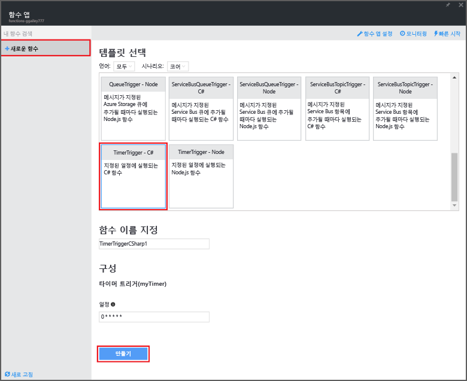
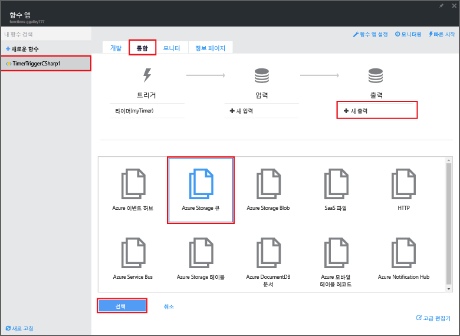
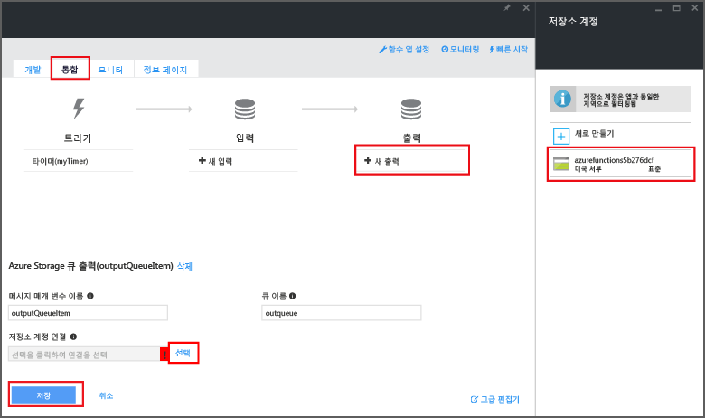

<properties
   pageTitle="이벤트 처리 기능 만들기 | Microsoft Azure"
   description="Azure Functions를 사용하여 이벤트 타이머에 기반하여 실행되는 C# 함수를 만듭니다."
   services="functions"
   documentationCenter="na"
   authors="ggailey777"
   manager="erikre"
   editor=""
   tags=""
   />

<tags
   ms.service="functions"
   ms.devlang="multiple"
   ms.topic="get-started-article"
   ms.tgt_pltfrm="multiple"
   ms.workload="na"
   ms.date="09/25/2016"
   ms.author="glenga"/>
   
# 이벤트 처리 Azure 기능 만들기

Azure Functions은 이벤트 기반 주문형 계산 환경이며 이를 통해 다양한 프로그래밍 언어로 구현된 예약되거나 트리거된 코드 단위를 만들 수 있습니다. Azure Functions에 대해 자세히 알아보려면 [Azure Functions 개요](functions-overview.md)를 참조하세요.

이 항목에서는 이벤트 타이머에 따라 실행되는 C#에 새 함수를 만들어 저장소 큐에 메시지를 추가하는 방법을 보여 줍니다.

## 필수 조건 

함수를 만들기 전에 활성 Azure 계정이 있어야 합니다. Azure 계정이 아직 없는 경우 [무료 계정을 사용](https://azure.microsoft.com/free/)할 수 있습니다.

## 템플릿에서 타이머로 트리거된 함수 만들기

함수 앱은 Azure에서 함수 실행을 호스트합니다. 함수를 만들기 전에 활성 Azure 계정이 있어야 합니다. Azure 계정이 아직 없는 경우 [무료 계정을 사용](https://azure.microsoft.com/free/)할 수 있습니다.

1. [Azure Functions 포털](https://functions.azure.com/signin)로 이동하여 Azure 계정으로 로그인합니다.

2. 기존 함수 앱을 사용 하는 경우 **함수 앱**에서 선택하고 **열기**를 클릭합니다. 새 함수 앱을 만들려면 새 함수 앱에 대해 고유한 **이름**을 입력하거나 생성된 이름을 수락하거나 선호하는 **지역**을 선택한 후 **만들기 + 시작**을 클릭합니다.

3. 함수 앱에서 **+새 함수** > **TimerTrigger - C#** > **만들기**를 클릭합니다. 1분에 한 번씩 기본 일정에서 실행되는 기본 이름을 가진 함수를 만듭니다.

	

4. 새 함수에서 **통합** 탭 > **새 출력** > **Azure 저장소 큐** > **선택**을 클릭합니다.

	

5. **Azure Storage 큐 출력**에서 기존 **저장소 계정 연결**을 선택하거나 새 항목을 만든 다음 **저장**을 클릭합니다.

	

6. **개발** 탭에 돌아가서 **코드** 창의 기존 C# 스크립트를 다음 코드로 바꿉니다.

		using System;
		
		public static void Run(TimerInfo myTimer, out string outputQueueItem, TraceWriter log)
		{
		    // Add a new scheduled message to the queue.
		    outputQueueItem = $"Ping message added to the queue at: {DateTime.Now}.";
		    
		    // Also write the message to the logs.
		    log.Info(outputQueueItem);
		}

	이 코드는 함수를 실행할 경우 현재 날짜 및 시간을 사용하여 큐에 새 메시지를 추가합니다.

7. **저장**을 클릭하고 다음 함수 실행에 대한 **로그** 창을 봅니다.

8. (선택 사항) 저장소 계정으로 이동하고 메시지가 큐에 추가되는지를 확인합니다.

9. **통합** 탭으로 돌아가서 일정 필드를 `0 0 * * * *`로 변경합니다. 함수는 이제 한 시간마다 한 번씩 실행됩니다.

이는 타이머 트리거 및 저장소 큐 출력 바인딩의 매우 간단한 예입니다. 자세한 내용은 [Azure Functions 타이머 트리거](functions-bindings-timer.md) 및 [Azure Storage에 Azure Functions 트리거 및 바인딩](functions-bindings-storage.md) 항목을 모두 참조하세요.

##다음 단계

Azure Functions에 대한 자세한 내용은 다음 항목을 참조합니다.

+ [Azure Functions 개발자 참조](functions-reference.md) 함수를 코딩하고 트리거 및 바인딩을 정의하기 위한 프로그래머 참조입니다.
+ [Azure Functions 테스트](functions-test-a-function.md) 함수를 테스트하는 다양한 도구와 기법을 설명합니다.
+ [Azure Functions 크기 조정 방법](functions-scale.md) 동적 서비스 계획 등 Azure Functions에 사용할 수 있는 서비스 계획과 적절한 계획을 선택하는 방법을 설명합니다.

[AZURE.INCLUDE [시작 메모](../../includes/functions-get-help.md)]

<!---HONumber=AcomDC_0928_2016-->