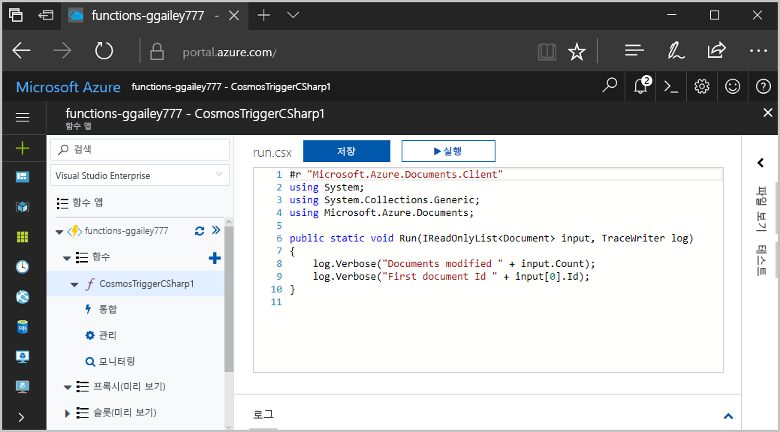
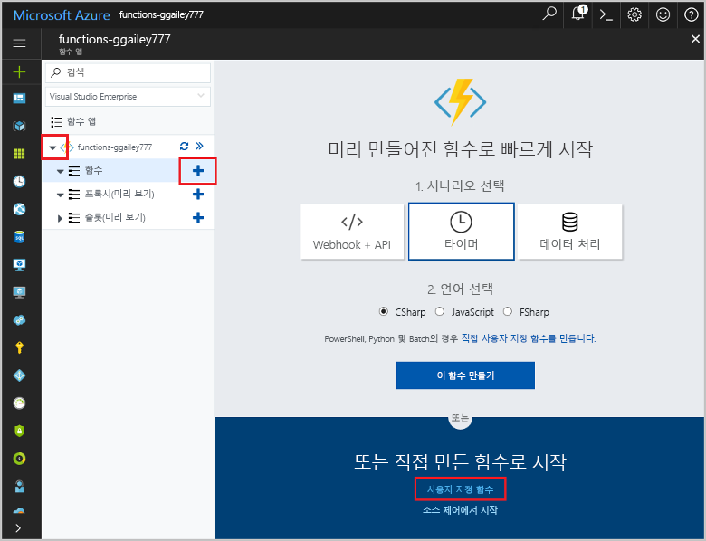
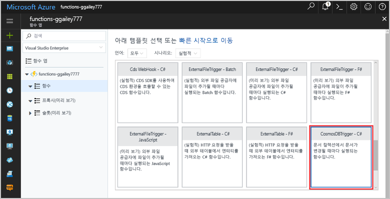
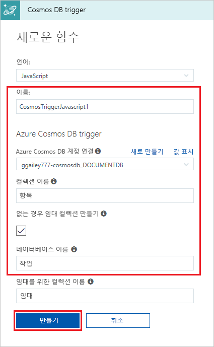
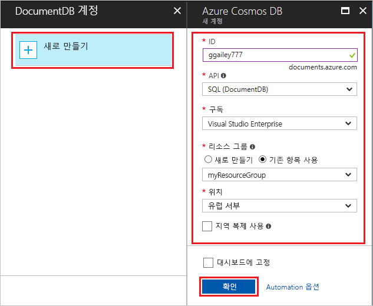
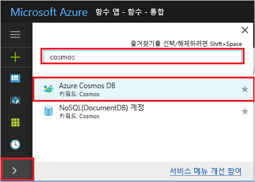
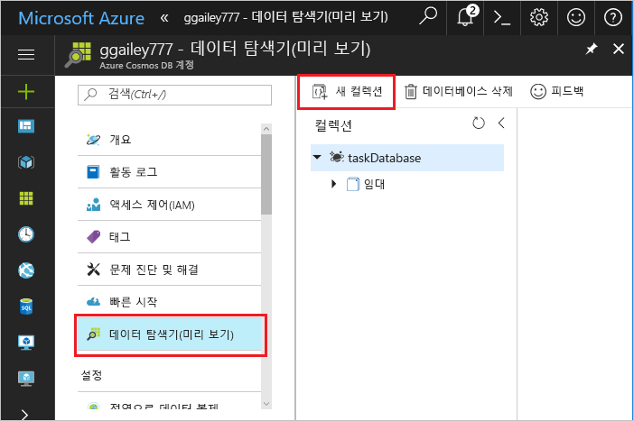
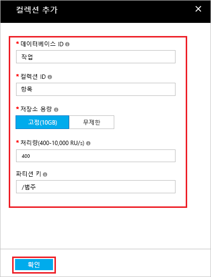
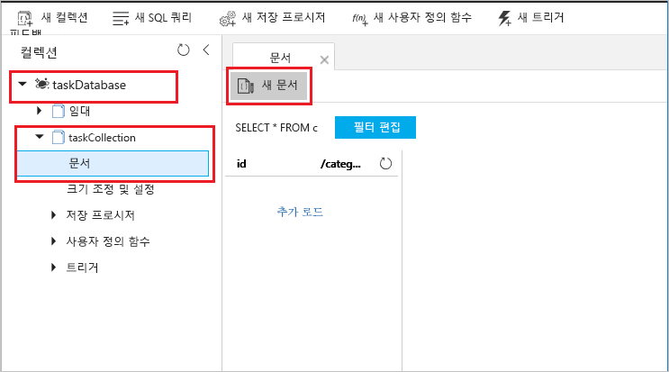
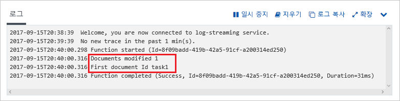

# Azure Cosmos DB에 의해 트리거되는 함수 만들기

데이터가 Azure Cosmos DB에 추가될 때 또는 변경될 때 트리거되는 함수를 만드는 방법에 대해 알아봅니다. Azure Cosmos DB에 대한 자세한 내용은 [Azure Cosmos DB: Azure Functions를 통한, 서버를 사용하지 않는 데이터베이스 컴퓨팅](..\cosmos-db\serverless-computing-database.md)을 참조하세요.

## 필수 조건

이 자습서를 완료하려면 다음이 필요합니다.

+ Azure 구독이 아직 없는 경우 시작하기 전에 [체험 계정](https://azure.microsoft.com/free/?WT.mc_id=A261C142F)을 만듭니다.

## Azure Function 앱 만들기

[!INCLUDE [Create function app Azure portal](../../includes/functions-create-function-app-portal.md)]

다음으로 새 함수 앱에서 함수를 만듭니다.

## Azure Cosmos DB 트리거 만들기

1. 함수 앱을 확장한 후 **함수** 옆의 **+** 단추를 클릭합니다. 함수 앱에서 첫 번째 함수이면 **사용자 지정 함수**를 선택합니다. 그러면 함수 템플릿의 전체 집합이 표시됩니다.

    

2. 검색 필드에 `cosmos`를 입력한 다음 Azure Cosmos DB 트리거 템플릿에서 원하는 언어를 선택합니다.

    

3. 이미지 아래의 테이블에 지정된 설정을 사용하여 새 트리거를 구성합니다.

    
    
    | 설정      | 제안 값  | 설명                                |
    | ------------ | ---------------- | ------------------------------------------ |
    | **Name** | 기본값 | 템플릿에서 추천하는 기본 함수 이름을 사용합니다. |
    | **컬렉션 이름** | 항목 | 모니터링할 컬렉션의 이름입니다. |
    | **임대 컬렉션이 없는 경우 새로 만들기** | 선택 | 아직 컬렉션이 없으므로 지금 만듭니다. |
    | **데이터베이스 이름** | 작업 | 모니터링할 컬렉션이 포함된 데이터베이스의 이름입니다. |

4. **Azure Cosmos DB 계정 연결** 레이블 옆에 있는 **새로 만들기**를 선택하고, 기존 Cosmos DB 계정을 선택하거나 **+ 새로 만들기**를 선택합니다. 
 
    

6. 새 Cosmos DB 계정을 만들 때는 테이블에 지정된 대로 **새 계정** 설정을 사용합니다.

    | 설정      | 제안 값  | 설명                                |
    | ------------ | ---------------- | ------------------------------------------ |
    | **ID** | 데이터베이스의 이름 | Azure Cosmos DB 데이터베이스의 고유한 ID  |
    | **API** | SQL | 이 항목에서는 SQL API를 사용합니다.  |
    | **구독** | Azure 구독 | 이 새 Cosmos DB 계정이 만들어지는 구독입니다.  |
    | **리소스 그룹** | myResourceGroup |  함수 앱이 포함된 기존 리소스 그룹을 사용합니다. |
    | **위치**:  | WestEurope | 함수 앱 또는 저장된 문서를 사용하는 다른 앱과 가까운 위치를 선택합니다.  |

6. **확인**을 클릭하여 데이터베이스를 만듭니다. 데이터베이스를 만드는 데 몇 분 정도 걸릴 수 있습니다. 데이터베이스가 생성되면 데이터베이스 연결 문자열이 함수 앱 설정으로 저장됩니다. 이 앱 설정의 이름이 **Azure Cosmos DB 계정 연결**에 삽입됩니다. 

7. **만들기**를 클릭하여 Azure Cosmos DB에 의해 트리거되는 함수를 만듭니다. 함수를 만들면 템플릿 기반 함수 코드가 표시됩니다.  

    

    이 함수 템플릿은 문서 수와 첫 번째 문서 ID를 로그에 기록합니다. 

다음으로, Azure Cosmos DB 계정에 연결하고 데이터베이스에 **작업** 컬렉션을 만듭니다. 

## 항목 컬렉션 만들기

1. [Azure Portal](https://portal.azure.com)의 두 번째 인스턴스를 브라우저의 새 탭에서 엽니다. 

2. 포털 왼쪽에서 아이콘 표시줄을 확장하고, 검색 필드에 `cosmos`를 입력하고, **Azure Cosmos DB**를 선택합니다.

    

2. Azure Cosmos DB 계정을 선택한 다음 **데이터 탐색기**를 선택합니다. 
 
3. **컬렉션**에서 **taskDatabase**를 선택하고 **새 컬렉션**을 선택합니다.

    

4. **컬렉션 추가**에서 이미지 아래의 표에 표시된 설정을 사용합니다. 
 
    
 
    | 설정|제안 값|설명 |
    | ---|---|--- |
    | **데이터베이스 ID** | 작업 |새 데이터베이스에 대한 이름입니다. 함수 바인딩에 정의된 이름과 일치해야 합니다. |
    | **컬렉션 ID** | 항목 | 새 컬렉션의 이름입니다. 함수 바인딩에 정의된 이름과 일치해야 합니다.  |
    | **저장소 용량** | 고정(10GB)|기본값을 사용합니다. 이 값은 데이터베이스의 저장소 용량입니다. |
    | **처리량** |400RU| 기본값을 사용합니다. 대기 시간을 줄이면 나중에 처리량을 늘릴 수 있습니다. |
    | **[파티션 키](../cosmos-db/partition-data.md#design-for-partitioning)** | /category|각 파티션에 데이터를 균등하게 배포하는 파티션 키입니다. 올바른 파티션 키를 선택하는 것은 성능이 뛰어난 컬렉션을 만드는 데 중요합니다. | 

1. **확인**을 클릭하여 **작업** 컬렉션을 만듭니다. 컬렉션이 생성될 때까지 잠시 시간이 걸릴 수 있습니다.

함수 바인딩에 지정된 컬렉션이 있으면 이 새 컬렉션에 문서를 추가하여 함수를 테스트할 수 있습니다.

## 함수 테스트

1. 데이터 탐색기에서 새 **taskCollection** 컬렉션을 확장하고, **문서**를 선택한 다음 **새 문서**를 선택합니다.

    

2. 새 문서의 콘텐츠를 다음 콘텐츠로 바꾼 후 **저장**을 선택합니다.

        {
            "id": "task1",
            "category": "general",
            "description": "some task"
        }

1. 포털에서 함수를 포함하고 있는 첫 번째 브라우저 탭으로 전환합니다. 함수 로그를 확장하고 새 문서가 함수를 트리거했는지 확인합니다. `task1` 문서 ID 값이 로그에 기록되었는지 살펴봅니다. 

    

4. (선택 사항) 다시 문서로 돌아가서 변경 작업을 수행하고 **업데이트**를 클릭합니다. 그런 다음 함수 로그로 돌아가서 업데이트도 함수를 트리거했는지 확인합니다.

## 리소스 정리

[!INCLUDE [Next steps note](../../includes/functions-quickstart-cleanup.md)]

## 다음 단계

문서가 Azure Cosmos DB에 추가되거나 수정될 때 실행되는 함수를 만들었습니다.

[!INCLUDE [Next steps note](../../includes/functions-quickstart-next-steps.md)]

Azure Cosmos DB 트리거에 대한 자세한 내용은 [Azure Functions의 Azure Cosmos DB 바인딩](functions-bindings-cosmosdb.md)을 참조하세요.
