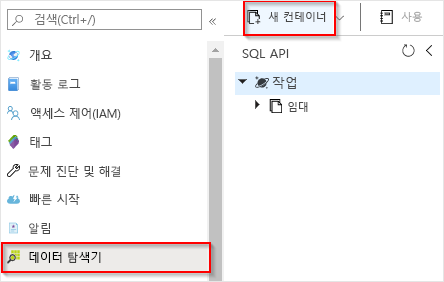
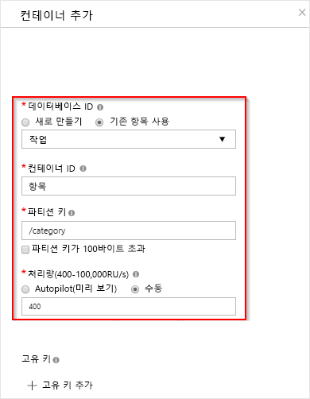

# Azure Cosmos DB에 의해 트리거되는 함수 만들기

데이터가 Azure Cosmos DB에 추가될 때 또는 변경될 때 트리거되는 함수를 만드는 방법에 대해 알아봅니다. Azure Cosmos DB에 대한 자세한 내용은 [Azure Cosmos DB: Azure Functions를 사용하는 서버리스 데이터베이스 컴퓨팅](../cosmos-db/serverless-computing-database.md)을 참조하세요.

:::image type="content" source="./media/functions-create-cosmos-db-triggered-function/quickstart-completed.png" alt-text="Azure Cosmos DB 코드":::

## 사전 요구 사항

이 자습서를 완료하려면 다음이 필요합니다.

+ Azure 구독이 아직 없는 경우 시작하기 전에 [체험 계정](https://azure.microsoft.com/free/?WT.mc_id=A261C142F)을 만듭니다.

> [!NOTE]
> [!INCLUDE [SQL API support only](../../includes/functions-cosmosdb-sqlapi-note.md)]

## Azure에 로그인
Azure 계정을 사용하여 [Azure Portal](https://portal.azure.com/) 에 로그인합니다.

## Azure Cosmos DB 계정 만들기

트리거를 만들기 전에 SQL API를 사용하는 Azure Cosmos DB 계정이 있어야 합니다.

[!INCLUDE [cosmos-db-create-dbaccount](../../includes/cosmos-db-create-dbaccount.md)]

## Azure 함수 앱 만들기

[!INCLUDE [Create function app Azure portal](../../includes/functions-create-function-app-portal.md)]

다음으로 새 함수 앱에서 함수를 만듭니다.

## Azure Cosmos DB 트리거 만들기

1. 함수 앱의 왼쪽 메뉴에서 **Functions**를 선택한 다음, 맨 위 메뉴에서 **추가**를 선택합니다. 

1. **새 함수** 페이지의 검색 필드에 `cosmos`를 입력한 다음, **Azure Cosmos DB 트리거** 템플릿을 선택합니다.

   :::image type="content" source="./media/functions-create-cosmos-db-triggered-function/function-choose-cosmos.png" alt-text="Azure Portal의 Functions 페이지":::

1. 다음 표에 지정된 설정을 사용하여 새 트리거를 구성합니다.

    | 설정      | 제안 값  | Description                                |
    | ------------ | ---------------- | ------------------------------------------ |
    | **새 함수** | 기본 이름 적용 | 함수의 이름입니다. |
    | **Cosmos DB 계정 연결** | 새 기본 이름 적용 | **새로 만들기**, 이전에 만든 **데이터베이스 계정**을 선택한 다음, **확인**을 선택합니다. 이 작업은 계정 연결을 위한 애플리케이션 설정을 만듭니다. 이 설정은 데이터베이스에 연결하는 바인딩에서 사용됩니다. |
    | **데이터베이스 이름** | 작업 | 모니터링할 컬렉션이 포함된 데이터베이스의 이름입니다. |
    | **컬렉션 이름** | Items | 모니터링할 컬렉션의 이름입니다. |
    | **임대 컬렉션 이름** | 임대 | 임대를 저장하는 컬렉션의 이름입니다. |
    | **임대 컬렉션이 없는 경우 만들기** | 예 | 임대 컬렉션이 있는지 확인하고 자동으로 만듭니다. |

    :::image type="content" source="./media/functions-create-cosmos-db-triggered-function/functions-cosmosdb-trigger-settings.png" alt-text="Azure Cosmos DB에 의해 트리거되는 함수 만들기":::

1. **함수 만들기**를 선택합니다. 

    Azure에서 Cosmos DB 트리거 함수를 만듭니다.

1. 템플릿 기반 함수 코드를 표시하려면 **코드 + 테스트**를 선택합니다.

    :::image type="content" source="./media/functions-create-cosmos-db-triggered-function/function-cosmosdb-template.png" alt-text="C#의 Cosmos DB 함수 템플릿":::

    이 함수 템플릿은 문서 수와 첫 번째 문서 ID를 로그에 기록합니다.

다음으로, Azure Cosmos DB 계정에 연결하고 `Tasks` 데이터베이스에 `Items` 컨테이너를 만듭니다.

## 항목 컨테이너 만들기

1. [Azure Portal](https://portal.azure.com)의 두 번째 인스턴스를 브라우저의 새 탭에서 엽니다.

1. 포털 왼쪽에서 아이콘 표시줄을 확장하고, 검색 필드에 `cosmos`를 입력하고, **Azure Cosmos DB**를 선택합니다.

    

1. Azure Cosmos DB 계정을 선택한 다음 **데이터 탐색기**를 선택합니다. 

1. **SQL API**에서 **작업** 데이터베이스를 선택하고 **새 컨테이너**를 선택합니다.

    

1. **컨테이너 추가**에서 이미지 아래의 표에 표시된 설정을 사용합니다. 

    

    | 설정|제안 값|Description |
    | ---|---|--- |
    | **데이터베이스 ID** | 작업 |새 데이터베이스에 대한 이름입니다. 함수 바인딩에 정의된 이름과 일치해야 합니다. |
    | **컨테이너 ID** | Items | 새 컨테이너의 이름입니다. 함수 바인딩에 정의된 이름과 일치해야 합니다.  |
    | **[파티션 키](../cosmos-db/partition-data.md)** | /category|각 파티션에 데이터를 균등하게 배포하는 파티션 키입니다. 올바른 파티션 키를 선택하는 것은 성능이 뛰어난 컨테이너를 만드는 데 중요합니다. | 
    | **처리량** |400RU| 기본값을 사용합니다. 대기 시간을 줄이면 나중에 처리량을 늘릴 수 있습니다. |    

1. **확인**을 클릭하여 항목 컨테이너를 만듭니다. 컨테이너가 생성될 때까지 잠시 시간이 걸릴 수 있습니다.

함수 바인딩에 지정된 컨테이너가 있으면 이 새 컨테이너에 항목을 추가하여 함수를 테스트할 수 있습니다.

## 함수 테스트

1. Data Explorer에서 새 **항목** 컨테이너를 확장하고 **항목**을 선택한 다음, **새 항목**을 선택합니다.

    :::image type="content" source="./media/functions-create-cosmos-db-triggered-function/create-item-in-container.png" alt-text="항목 컨테이너에 항목 만들기":::

1. 새 문서의 콘텐츠를 다음 콘텐츠로 바꾼 다음, **저장**을 선택합니다.

        {
            "id": "task1",
            "category": "general",
            "description": "some task"
        }

1. 포털에서 함수를 포함하고 있는 첫 번째 브라우저 탭으로 전환합니다. 함수 로그를 확장하고 새 문서가 함수를 트리거했는지 확인합니다. `task1` 문서 ID 값이 로그에 기록되었는지 살펴봅니다. 

    

1. (선택 사항) 다시 문서로 돌아가서 변경 작업을 수행하고 **업데이트**를 클릭합니다. 그런 다음, 함수 로그로 돌아가서 업데이트도 함수를 트리거했는지 확인합니다.

## 리소스 정리

[!INCLUDE [Next steps note](../../includes/functions-quickstart-cleanup.md)]

## 다음 단계

문서가 Azure Cosmos DB에 추가되거나 수정될 때 실행되는 함수를 만들었습니다. Azure Cosmos DB 트리거에 대한 자세한 내용은 [Azure Functions의 Azure Cosmos DB 바인딩](functions-bindings-cosmosdb.md)을 참조하세요.

[!INCLUDE [Next steps note](../../includes/functions-quickstart-next-steps.md)]
