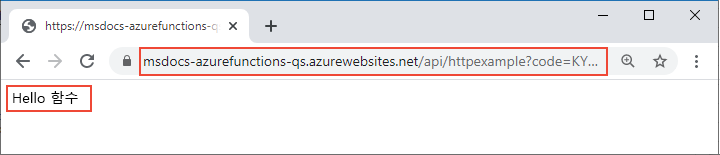

# <a name="quickstart-create-a-function-in-azure-that-responds-to-http-requests"></a>빠른 시작: Azure에서 HTTP 요청에 응답하는 함수 만들기

::: zone pivot="programming-language-csharp"  
이 문서에서는 명령줄 도구를 사용하여 HTTP 요청에 응답하는 C# 클래스 라이브러리 기반 함수를 만듭니다. 코드를 로컬로 테스트한 후 서버리스 Azure Functions 환경에 배포합니다. 
::: zone-end  
::: zone pivot="programming-language-javascript"
이 문서에서는 명령줄 도구를 사용하여 HTTP 요청에 응답하는 JavaScript 함수를 만듭니다. 코드를 로컬로 테스트한 후 서버리스 Azure Functions 환경에 배포합니다. 
::: zone-end
::: zone pivot="programming-language-typescript"
이 문서에서는 명령줄 도구를 사용하여 HTTP 요청에 응답하는 TypeScript 함수를 만듭니다. 코드를 로컬로 테스트한 후 서버리스 Azure Functions 환경에 배포합니다. 
::: zone-end   
::: zone pivot="programming-language-powershell"
이 문서에서는 명령줄 도구를 사용하여 HTTP 요청에 응답하는 PowerShell 함수를 만듭니다. 코드를 로컬로 테스트한 후 서버리스 Azure Functions 환경에 배포합니다. 
::: zone-end  
::: zone pivot="programming-language-python" 
이 문서에서는 명령줄 도구를 사용하여 HTTP 요청에 응답하는 Python 함수를 만듭니다. 코드를 로컬로 테스트한 후 서버리스 Azure Functions 환경에 배포합니다. 
::: zone-end  
::: zone pivot="programming-language-java" 
이 문서에서는 명령줄 도구를 사용하여 HTTP 요청에 응답하는 Java 함수를 만듭니다. 코드를 로컬로 테스트한 후 서버리스 Azure Functions 환경에 배포합니다. 
::: zone-end

이 빠른 시작을 완료하면 Azure 계정에서 약간의 비용(몇 USD 센트)이 발생합니다.

::: zone pivot="programming-language-csharp,programming-language-javascript,programming-language-typescript,programming-language-powershell,programming-language-python"  
또한 이 문서의 [Visual Studio Code 기반 버전](functions-create-first-function-vs-code.md)도 있습니다.
::: zone-end  
::: zone pivot="programming-language-java"  
> [!NOTE]
> Maven이 선호하는 개발 도구가 아닌 경우 [Gradle](./functions-create-first-java-gradle.md), [IntelliJ IDEA](/azure/developer/java/toolkit-for-intellij/quickstart-functions) 및 [Visual Studio Code](./functions-create-first-function-vs-code.md?pivots=programming-language-java)를 사용하여 Java 개발자를 위한 비슷한 자습서를 확인하세요.
::: zone-end  

[!INCLUDE [functions-requirements-cli](../../includes/functions-requirements-cli.md)]

[!INCLUDE [functions-cli-verify-prereqs](../../includes/functions-cli-verify-prereqs.md)]

[!INCLUDE [functions-cli-create-venv](../../includes/functions-cli-create-venv.md)]

## <a name="create-a-local-function-project"></a>로컬 함수 프로젝트 만들기

Azure Functions에서 함수 프로젝트는 각각 특정 트리거에 응답하는 하나 이상의 개별 함수에 대한 컨테이너입니다. 프로젝트의 모든 함수는 동일한 로컬 및 호스팅 구성을 공유합니다. 이 섹션에서는 단일 함수가 포함된 함수 프로젝트를 만듭니다.

::: zone pivot="programming-language-csharp,programming-language-javascript,programming-language-typescript,programming-language-powershell,programming-language-python"  
다음과 같이 `func init` 명령을 실행하여 지정된 런타임에 *LocalFunctionProj* 폴더에 함수 프로젝트를 만듭니다.  
::: zone-end  
::: zone pivot="programming-language-python"  
```
func init LocalFunctionProj --python
```
::: zone-end  
::: zone pivot="programming-language-csharp"  
```
func init LocalFunctionProj --dotnet
```
::: zone-end  
::: zone pivot="programming-language-javascript"  
```
func init LocalFunctionProj --javascript
```
::: zone-end  
::: zone pivot="programming-language-typescript"  
```
func init LocalFunctionProj --typescript
```
::: zone-end  
::: zone pivot="programming-language-powershell"  
```
func init LocalFunctionProj --powershell
```
::: zone-end    
::: zone pivot="programming-language-java"  
빈 폴더에서 다음 명령을 실행하여 [Maven archetype](https://maven.apache.org/guides/introduction/introduction-to-archetypes.html)으로부터 Functions 프로젝트를 생성합니다.

# <a name="bash"></a>[bash](#tab/bash)
```bash
mvn archetype:generate -DarchetypeGroupId=com.microsoft.azure -DarchetypeArtifactId=azure-functions-archetype 
```
# <a name="powershell"></a>[PowerShell](#tab/powershell)
```powershell
mvn archetype:generate "-DarchetypeGroupId=com.microsoft.azure" "-DarchetypeArtifactId=azure-functions-archetype" 
```
# <a name="cmd"></a>[Cmd](#tab/cmd)
```cmd
mvn archetype:generate "-DarchetypeGroupId=com.microsoft.azure" "-DarchetypeArtifactId=azure-functions-archetype" 
```
---

Maven은 배포 시 프로젝트 생성 완료를 위해 필요한 값을 요청합니다.   
메시지가 표시되면 다음 값을 제공합니다.

| prompt | 값 | Description |
| ------ | ----- | ----------- |
| **groupId** | `com.fabrikam` | Java에 대한 [패키지 명명 규칙](https://docs.oracle.com/javase/specs/jls/se6/html/packages.html#7.7)에 따라 모든 프로젝트에서 프로젝트를 고유하게 식별하는 값입니다. |
| **artifactId** | `fabrikam-functions` | 버전 번호가 없는 jar의 이름인 값입니다. |
| **version** | `1.0-SNAPSHOT` | 기본값을 선택합니다. |
| **package** | `com.fabrikam` | 생성된 함수 코드에 대한 Java 패키지인 값입니다. 기본값을 사용하세요. |

`Y`를 입력하거나 Enter 키를 눌러 확인합니다.

Maven은 이름이 _artifactId_인 새 폴더에 프로젝트 파일을 만드는데, 이 예제에서는 `fabrikam-functions`입니다. 

Azure에서 Java 11을 실행하려면 pom.xml 파일의 값을 수정해야 합니다. 자세히 알아보려면 [Java 버전](functions-reference-java.md#java-versions)을 참조하세요. 

::: zone-end  
프로젝트 폴더로 이동합니다.

::: zone pivot="programming-language-csharp,programming-language-javascript,programming-language-typescript,programming-language-powershell,programming-language-python"  
```
cd LocalFunctionProj
```
::: zone-end  
::: zone pivot="programming-language-java"  
```
cd fabrikam-functions
```
::: zone-end  
이 폴더에는 [local.settings.json](functions-run-local.md#local-settings-file) 및 [host.json](functions-host-json.md)이라는 구성 파일을 포함하여 프로젝트의 다양한 파일이 있습니다. *local.settings.json*은 Azure에서 다운로드한 비밀을 포함할 수 있으므로 이 파일은 기본적으로 *.gitignore* 파일의 원본 제어에서 제외됩니다.

[!INCLUDE [functions-cli-add-function](../../includes/functions-cli-add-function.md)]

### <a name="optional-examine-the-file-contents"></a>(선택 사항) 파일 내용 검사

원하는 경우 [로컬에서 함수 실행](#run-the-function-locally)으로 건너뛰고, 나중에 파일 내용을 검사할 수 있습니다.

::: zone pivot="programming-language-csharp"
#### <a name="httpexamplecs"></a>HttpExample.cs

*HttpExample.cs*에는 `req` 변수에 요청 데이터를 수신하는 `Run` 메서드가 포함되며, 트리거 동작을 정의하는 **HttpTriggerAttribute**로 데코레이트된 [HttpRequest](/dotnet/api/microsoft.aspnetcore.http.httprequest)입니다. 

:::code language="csharp" source="~/functions-docs-csharp/http-trigger-template/HttpExample.cs":::

반환 개체는 [OkObjectResult](/dotnet/api/microsoft.aspnetcore.mvc.okobjectresult)(200) 또는 [BadRequestObjectResult](/dotnet/api/microsoft.aspnetcore.mvc.badrequestobjectresult)(400)로 응답 메시지를 반환하는 [ActionResult](/dotnet/api/microsoft.aspnetcore.mvc.actionresult)입니다. 자세한 내용은 [Azure Functions HTTP 트리거 및 바인딩](./functions-bindings-http-webhook.md?tabs=csharp)을 참조하세요.
::: zone-end

::: zone pivot="programming-language-java"
#### <a name="functionjava"></a>Function.java
*Function.java*에는 `request` 변수에서 요청 데이터를 수신하는 `run` 메서드가 포함되며, 트리거 동작을 정의하는 [HttpTrigger](/java/api/com.microsoft.azure.functions.annotation.httptrigger) 주석으로 데코레이트된 [HttpRequestMessage](/java/api/com.microsoft.azure.functions.httprequestmessage)입니다. 

:::code language="java" source="~/azure-functions-samples-java/src/main/java/com/functions/Function.java":::

응답 메시지는 [HttpResponseMessage](/java/api/com.microsoft.azure.functions.httpresponsemessage.builder) API에서 생성됩니다.

#### <a name="pomxml"></a>pom.xml

앱을 호스트하기 위해 만든 Azure 리소스의 설정은 생성된 pom.xml 파일에 있는 `com.microsoft.azure`의 **groupId**를 사용하여 플러그 인의 **configuration** 요소에 정의됩니다. 예를 들어 아래 구성 요소는 `westus` 지역의 `java-functions-group` 리소스 그룹에 함수 앱을 만들도록 Maven 기반 배포에 지시합니다. 함수 앱 자체는 `java-functions-app-service-plan` 플랜에서 호스트되는 Windows에서 실행되며, 이 플랜은 기본적으로 서버리스 사용 플랜입니다.    

:::code language="java" source="~/azure-functions-samples-java/pom.xml" range="62-102":::

초기 배포 전에 `runtime.os`를 `windows`에서 `linux`로 변경하는 등의 방법으로 이러한 설정을 변경하면 Azure에서 리소스를 만드는 방식을 제어할 수 있습니다. Maven 플러그 인에서 지원하는 전체 설정 목록은 [구성 세부 정보](https://github.com/microsoft/azure-maven-plugins/wiki/Azure-Functions:-Configuration-Details)를 참조하세요.

Java 8 대신 Java 11에서 함수 앱을 실행하려는 경우 Java 11 값을 사용하여 pom.xml 파일을 수동으로 업데이트해야 합니다. 자세히 알아보려면 [Java 버전](functions-reference-java.md#java-versions)을 참조하세요. Java 11에서 실행하는 경우 다음을 확인합니다.  

#### <a name="functiontestjava"></a>FunctionTest.java

원형 역시 함수의 단위 테스트를 생성합니다. 바인딩을 추가하거나 프로젝트에 새 함수를 추가하도록 함수를 변경하는 경우에는 *FunctionTest.java* 파일에서 테스트도 수정해야 합니다.
::: zone-end  
::: zone pivot="programming-language-python"
#### <a name="__init__py"></a>\_\_init\_\_.py

*\_\_init\_\_.py*에는 *function.json*의 구성에 따라 트리거되는 `main()` Python 함수가 포함되어 있습니다.

:::code language="python" source="~/functions-quickstart-templates/Functions.Templates/Templates/HttpTrigger-Python/__init__.py":::

HTTP 트리거의 경우 함수는 *function.json*에 정의된 `req` 변수에 요청 데이터를 받습니다. `req`는 [azure.functions.HttpRequest 클래스](/python/api/azure-functions/azure.functions.httprequest)의 인스턴스입니다. *function.json*에 `$return`으로 정의되는 반환 개체는 [azure.functions.HttpResponse 클래스](/python/api/azure-functions/azure.functions.httpresponse)의 인스턴스입니다. 자세한 내용은 [Azure Functions HTTP 트리거 및 바인딩](./functions-bindings-http-webhook.md?tabs=python)을 참조하세요.
::: zone-end

::: zone pivot="programming-language-javascript"
#### <a name="indexjs"></a>index.js

*index.js*는 *function.json*의 구성에 따라 트리거되는 함수를 내보냅니다.

:::code language="javascript" source="~/functions-quickstart-templates/Functions.Templates/Templates/HttpTrigger-JavaScript/index.js":::

HTTP 트리거의 경우 함수는 *function.json*에 정의된 `req` 변수에 요청 데이터를 받습니다. *function.json*에 `$return`으로 정의된 반환 개체는 응답입니다. 자세한 내용은 [Azure Functions HTTP 트리거 및 바인딩](./functions-bindings-http-webhook.md?tabs=javascript)을 참조하세요.
::: zone-end

::: zone pivot="programming-language-typescript"
#### <a name="indexts"></a>index.ts

*index.ts*는 *function.json*의 구성에 따라 트리거되는 함수를 내보냅니다.

:::code language="typescript" source="~/functions-quickstart-templates/Functions.Templates/Templates/HttpTrigger-TypeScript/index.ts":::

HTTP 트리거의 경우 함수는 *function.json*에 정의된 **HttpRequest** 유형의 `req` 변수에 요청 데이터를 받습니다. *function.json*에 `$return`으로 정의된 반환 개체는 응답입니다. 
::: zone-end

::: zone pivot="programming-language-powershell"
#### <a name="runps1"></a>run.ps1

*run.ps1*은 *function.json*의 구성에 따라 트리거되는 함수 스크립트를 정의합니다.

:::code language="powershell" source="~/functions-quickstart-templates/Functions.Templates/Templates/HttpTrigger-PowerShell/run.ps1":::

HTTP 트리거의 경우 함수는 *function.json*에 정의된 `$Request` 매개 변수에 전달된 요청 데이터를 받습니다. *function.json*에 `Response`로 정의된 반환 개체는 `Push-OutputBinding` cmdlet에 응답으로 전달됩니다. 
::: zone-end

::: zone pivot="programming-language-javascript,programming-language-typescript,programming-language-python,programming-language-powershell"
#### <a name="functionjson"></a>function.json

*function.json*은 트리거 형식을 포함하여 함수의 입력 및 출력 `bindings`를 정의하는 구성 파일입니다. 
::: zone-end

::: zone pivot="programming-language-python"
원하는 경우 다른 Python 파일을 호출하도록 `scriptFile`을 변경할 수 있습니다.

:::code language="json" source="~/functions-quickstart-templates/Functions.Templates/Templates/HttpTrigger-Python/function.json":::
::: zone-end

::: zone pivot="programming-language-javascript,programming-language-typescript"
:::code language="json" source="~/functions-quickstart-templates/Functions.Templates/Templates/HttpTrigger-JavaScript/function.json":::
::: zone-end

::: zone pivot="programming-language-powershell"
:::code language="json" source="~/functions-quickstart-templates/Functions.Templates/Templates/HttpTrigger-PowerShell/function.json":::
::: zone-end

::: zone pivot="programming-language-javascript,programming-language-typescript,programming-language-python,programming-language-powershell"  
각 바인딩에는 명령, 형식 및 고유한 이름이 필요합니다. HTTP 트리거의 입력 바인딩은 [`httpTrigger`](functions-bindings-http-webhook-trigger.md) 형식이고, 출력 바인딩은 [`http`](functions-bindings-http-webhook-output.md) 형식입니다.
::: zone-end  

[!INCLUDE [functions-run-function-test-local-cli](../../includes/functions-run-function-test-local-cli.md)]

::: zone pivot="programming-language-javascript,programming-language-typescript,programming-language-python,programming-language-powershell,programming-language-csharp"    
## <a name="create-supporting-azure-resources-for-your-function"></a>함수를 지원하는 Azure 리소스 만들기

함수 코드를 Azure에 배포하기 전에 다음 세 가지 리소스를 만들어야 합니다.

- 리소스 그룹 - 관련 리소스에 대한 논리 컨테이너입니다.
- 스토리지 계정 - 프로젝트에 대한 상태 및 기타 정보를 유지 관리합니다.
- 함수 앱 - 함수 코드를 실행할 수 있는 환경을 제공합니다. 함수 앱은 로컬 함수 프로젝트에 매핑되며, 함수를 논리적 단위로 그룹화하여 리소스를 더 쉽게 관리, 배포 및 공유할 수 있습니다.

다음 Azure CLI 명령을 사용하여 이러한 항목을 만듭니다. 각 명령은 완료 시 JSON 출력을 제공합니다.

아직 로그인하지 않은 경우 [az login](/cli/azure/reference-index#az-login) 명령을 사용하여 Azure에 로그인합니다.

```azurecli
az login
```
    
[az group create](/cli/azure/group#az-group-create) 명령을 사용하여 리소스 그룹을 만듭니다. 다음 예제에서는 `AzureFunctionsQuickstart-rg`라는 리소스 그룹을 `westeurope` 지역에 만듭니다. (일반적으로 `az account list-locations` 명령에서 사용 가능한 지역을 사용하여 리소스 그룹과 리소스를 가까운 지역에 만듭니다.)

```azurecli
az group create --name AzureFunctionsQuickstart-rg --location westeurope
```

> [!NOTE]
> Linux 및 Windows 앱을 동일한 리소스 그룹에 호스트할 수 없습니다. Windows 함수 앱 또는 웹앱이 포함된 `AzureFunctionsQuickstart-rg`이라는 기존 리소스 그룹이 있는 경우 다른 리소스 그룹을 사용해야 합니다.
 
    
[az storage account create](/cli/azure/storage/account#az-storage-account-create) 명령을 사용하여 범용 스토리지 계정을 리소스 그룹 및 지역에 만듭니다. 다음 예제에서 `<STORAGE_NAME>`을 적절하고 전역적으로 고유한 이름으로 바꿉니다. 이름은 3~24자의 숫자와 소문자만 포함해야 합니다. `Standard_LRS`는 범용 계정을 지정하며, [Functions로 지원](storage-considerations.md#storage-account-requirements)됩니다.

```azurecli
az storage account create --name <STORAGE_NAME> --location westeurope --resource-group AzureFunctionsQuickstart-rg --sku Standard_LRS
```

이 빠른 시작에 대해 스토리지 계정은 약간의 비용(몇 USD 센트)만 발생합니다.
    
[az functionapp create](/cli/azure/functionapp#az-functionapp-create) 명령을 사용하여 함수 앱을 만듭니다. 다음 예제에서 `<STORAGE_NAME>`을 이전 단계에서 사용한 계정의 이름으로 바꾸고, `<APP_NAME>`을 적절하고 전역적으로 고유한 이름으로 바꿉니다. `<APP_NAME>`은 함수 앱의 기본 DNS 도메인이기도 합니다. 
::: zone-end  

::: zone pivot="programming-language-python"  
Python 3.8을 사용하는 경우 `--runtime-version`을 `3.8`로 변경하고 `--functions_version`을 `3`으로 변경합니다.

Python 3.6을 사용하는 경우 `--runtime-version`을 `3.6`으로 변경합니다.

```azurecli
az functionapp create --resource-group AzureFunctionsQuickstart-rg --os-type Linux --consumption-plan-location westeurope --runtime python --runtime-version 3.7 --functions-version 2 --name <APP_NAME> --storage-account <STORAGE_NAME>
```
::: zone-end  

::: zone pivot="programming-language-javascript,programming-language-typescript"  
Node.js 8을 사용하는 경우 `--runtime-version`도 `8`로 변경합니다.


```azurecli
az functionapp create --resource-group AzureFunctionsQuickstart-rg --consumption-plan-location westeurope --runtime node --runtime-version 10 --functions-version 2 --name <APP_NAME> --storage-account <STORAGE_NAME>
```
::: zone-end  

::: zone pivot="programming-language-csharp"  
```azurecli
az functionapp create --resource-group AzureFunctionsQuickstart-rg --consumption-plan-location westeurope --runtime dotnet --functions-version 2 --name <APP_NAME> --storage-account <STORAGE_NAME>
```
::: zone-end  

::: zone pivot="programming-language-powershell"  
```azurecli
az functionapp create --resource-group AzureFunctionsQuickstart-rg --consumption-plan-location westeurope --runtime powershell --functions-version 2 --name <APP_NAME> --storage-account <STORAGE_NAME>
```
::: zone-end  

::: zone pivot="programming-language-javascript,programming-language-typescript,programming-language-python,programming-language-powershell,programming-language-csharp"  
이 명령은 [Azure Functions 소비 계획](functions-scale.md#consumption-plan)에 따라 지정된 언어 런타임을 실행하는 함수 앱을 만듭니다. 여기서 발생하는 사용량에 대한 비용은 무료입니다. 또한 이 명령은 동일한 리소스 그룹에 연결된 Azure Application Insights 인스턴스를 프로비저닝하여 함수 앱을 모니터링하고 로그를 볼 수 있습니다. 자세한 내용은 [Azure Functions 모니터링](functions-monitoring.md)을 참조하세요. 인스턴스를 활성화할 때까지 비용이 발생하지 않습니다.
    
## <a name="deploy-the-function-project-to-azure"></a>Azure에 함수 프로젝트 배포
::: zone-end  

::: zone pivot="programming-language-typescript"  
Core Tools를 사용하여 Azure에 프로젝트를 배포하기 전에 TypeScript 소스 파일에서 프로덕션이 준비된 JavaScript 파일 빌드를 만듭니다.

다음 명령은 배포를 위한 TypeScript 프로젝트를 준비합니다.

```
npm run build:production 
```
::: zone-end  

::: zone pivot="programming-language-javascript,programming-language-typescript,programming-language-python,programming-language-powershell,programming-language-csharp"  
이제 필요한 리소스가 있으면 [func azure functionapp publish](functions-run-local.md#project-file-deployment) 명령을 사용하여 로컬 함수 프로젝트를 Azure의 함수 앱에 배포할 수 있습니다. 다음 예제에서 `<APP_NAME>`을 앱 이름으로 바꿉니다.

```
func azure functionapp publish <APP_NAME>
```

"... 이름의 앱을 찾을 수 없습니다."라는 오류가 표시되면 Azure에서 이전 `az functionapp create` 명령 후에 앱을 완전히 초기화하지 않았을 수 있으므로 몇 초 정도 기다렸다가 다시 시도하세요.

publish 명령은 다음 출력과 비슷한 결과를 표시합니다(간단히 하기 위해 잘랐음).

<pre>
...

Getting site publishing info...
Creating archive for current directory...
Performing remote build for functions project.

...

Deployment successful.
Remote build succeeded!
Syncing triggers...
Functions in msdocs-azurefunctions-qs:
    HttpExample - [httpTrigger]
        Invoke url: https://msdocs-azurefunctions-qs.azurewebsites.net/api/httpexample?code=KYHrydo4GFe9y0000000qRgRJ8NdLFKpkakGJQfC3izYVidzzDN4gQ==
</pre>

::: zone-end  
::: zone pivot="programming-language-java"  
## <a name="deploy-the-function-project-to-azure"></a>Azure에 함수 프로젝트 배포

함수 앱 및 관련 리소스는 함수 프로젝트를 처음 배포할 때 Azure에 생성됩니다. 앱을 호스트하기 위해 만든 Azure 리소스의 설정은 [pom.xml 파일](#pomxml)에 정의됩니다. 이 문서에서는 기본값을 적용합니다.

> [!TIP]
> Windows 대신 Linux에서 실행되는 함수 앱을 만들려면 pom.xml 파일의 `runtime.os` 요소를 `windows`에서 `linux`로 변경합니다. 사용 플랜에서 Linux를 실행할 수 있는 지역은 [여기](https://github.com/Azure/azure-functions-host/wiki/Linux-Consumption-Regions)서 확인할 수 있습니다. Linux에서 실행되는 앱과 Windows에서 실행되는 앱이 동일한 리소스 그룹에 있으면 안 됩니다.

배포하기 전에 [az login](/cli/azure/authenticate-azure-cli) Azure CLI 명령을 사용하여 Azure 구독에 로그인합니다. 

```azurecli
az login
```

다음 명령을 사용하여 프로젝트를 새 함수 앱에 배포합니다. 

```
mvn azure-functions:deploy
```

그러면 Azure에서 다음 리소스가 생성됩니다.

+ 리소스 그룹 이름은 _java-functions-group_입니다.
+ Storage 계정 함수에 필요합니다. 이름은 스토리지 계정 이름 요구 사항에 따라 임의로 생성됩니다.
+ 호스팅 계획. _westus_ 지역의 함수 앱에 대한 서버리스 호스팅입니다. 이름은 _java-functions-app-service-plan_입니다.
+ 함수 앱 함수 앱은 함수에 대한 배포 및 실행 단위입니다. 이름은 _artifactId_에 따라 임의로 생성된 이름에 임의로 생성된 번호를 붙여서 지정됩니다. 

배포에서는 프로젝트 파일을 패키징한 후 [zip 배포](functions-deployment-technologies.md#zip-deploy)를 사용하여 새 함수 앱에 배포합니다. 코드는 Azure의 배포 패키지에서 실행됩니다.
::: zone-end

## <a name="invoke-the-function-on-azure"></a>Azure에서 함수 호출

함수에서 HTTP 트리거를 사용하므로 브라우저 또는 도구(예: curl)를 사용하여 URL에 대한 HTTP 요청을 수행하여 호출합니다. 두 경우 모두에서 `code` URL 매개 변수는 함수 엔드포인트의 호출 권한을 부여하는 고유한 [함수 키](functions-bindings-http-webhook-trigger.md#authorization-keys)입니다.

# <a name="browser"></a>[브라우저](#tab/browser)

publish 명령의 출력에 표시된 **호출 URL** 전체를 브라우저 주소 표시줄에 복사하여 `&name=Functions` 쿼리 매개 변수를 추가합니다. 브라우저에서 함수를 로컬로 실행했을 때와 비슷한 출력이 표시됩니다.




# <a name="curl"></a>[curl](#tab/curl)

**호출 URL**을 사용하고 `&name=Functions` 매개 변수를 추가하여 [`curl`](https://curl.haxx.se/)을 실행합니다. 명령의 출력은 "Hello Functions" 텍스트여야 합니다.


---

> [!TIP]
> 게시된 함수 앱의 근 실시간 로그를 보려면 [Application Insights 라이브 메트릭 스트림](functions-monitoring.md#streaming-logs)을 사용합니다.
>
> 다음 명령을 실행하여 브라우저에서 라이브 메트릭 스트림을 엽니다.
>   ```
>   func azure functionapp logstream <APP_NAME> --browser
>   ```

## <a name="clean-up-resources"></a>리소스 정리

다음 [Azure Storage 큐 출력 바인딩 추가](functions-add-output-binding-storage-queue-cli.md) 단계로 계속 진행하는 경우 이미 수행한 작업을 기반으로 하여 빌드되는 모든 리소스를 그대로 유지합니다.

그렇지 않으면 추가 비용이 발생하지 않도록 다음 명령을 사용하여 리소스 그룹 및 포함된 모든 리소스를 삭제합니다.

::: zone pivot="programming-language-javascript,programming-language-typescript,programming-language-python,programming-language-powershell,programming-language-csharp" 
```azurecli
az group delete --name AzureFunctionsQuickstart-rg
```
::: zone-end
::: zone pivot="programming-language-java"
```azurecli
az group delete --name java-functions-group
```
::: zone-end
::: zone pivot="programming-language-python"
가상 환경을 종료하려면 `deactivate`를 실행하세요.
::: zone-end

## <a name="next-steps"></a>다음 단계

> [!div class="nextstepaction"]
> [Azure Storage 큐에 연결](functions-add-output-binding-storage-queue-cli.md)
 
