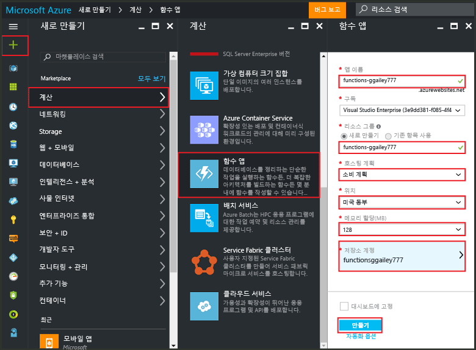
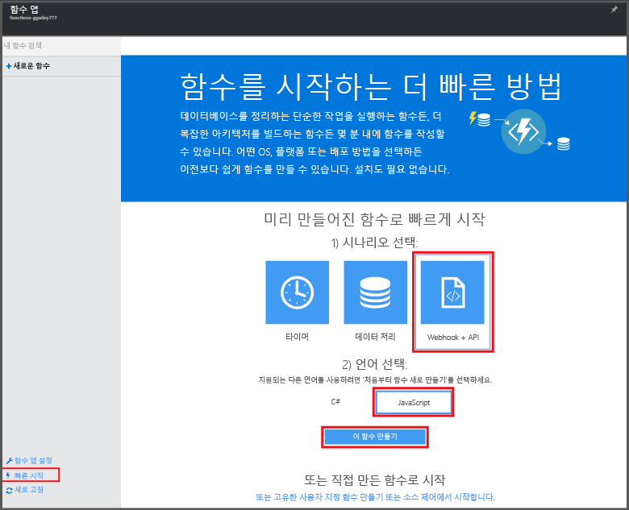

# Azure Portal에서 함수 만들기
## 개요
Azure 기능은 다른 Azure 서비스, SaaS 제품 및 온-프레미스 시스템에서 발생하는 이벤트에 의해 트리거되는 코드를 구현하는 기능으로 기존 Azure 응용 프로그램 플랫폼을 확장하는 이벤트 기반의 주문형 계산 환경입니다. Azure Functions를 통해 응용 프로그램은 요구에 따라 확장하고 사용하는 리소스에 대해서만 비용을 지불합니다. Azure Functions를 사용하여 다양한 프로그래밍 언어로 구현되는 예약되거나 트리거된 코드 단위를 만들 수 있습니다. Azure Functions에 대해 자세히 알아보려면 [Azure Functions 개요](functions-overview.md)를 참조하세요.

이 토픽에서는 Azure Portal을 사용하여 HTTP 트리거에서 호출되는 간단한 "hello world" Node.js Azure Functions를 만드는 방법을 보여 줍니다. Azure App Service에서 함수 앱을 명시적으로 만들어야 Azure Portal에서 함수를 만들 수 있습니다. 함수 앱이 자동으로 만들어지게 하려면 더 간단한 빠른 시작 환경으로서 비디오를 포함하고 있는 [다른 Azure Functions 빠른 시작 자습서](functions-create-first-azure-function.md)를 참조하세요.

## 함수 앱 만들기
함수 앱은 Azure에서 함수 실행을 호스트합니다. Azure 계정이 없는 경우 [Functions 사용](https://functions.azure.com/try) 환경을 확인하거나 [무료 Azure 계정을 만드세요](https://azure.microsoft.com/free/). Azure Portal에서 함수 앱을 만들려면 다음 단계를 수행합니다.

1. [Azure Portal](https://portal.azure.com) 로 이동하여 Azure 계정으로 로그인합니다.
2. **+새로 만들기** > **Compute** > **함수 앱**을 클릭하고 , **구독**을 선택하고 함수 앱을 식별하는 고유한 **앱 이름**을 입력한 후 다음 설정을 지정합니다.
   
   * **[리소스 그룹](../azure-resource-manager/resource-group-overview.md)**: **새로 만들기**를 선택하고 새 리소스 그룹에 대한 이름을 입력합니다. 기존 리소스 그룹을 선택할 수도 있지만 함수 앱에 대한 소비 기반 App Service 계획을 만들지 못할 수도 있습니다.
   * **[호스팅 계획](../app-service/azure-web-sites-web-hosting-plans-in-depth-overview.md)**은 다음 중 하나일 수 있습니다. 
     * **소비 계획**: Azure Functions의 기본 계획 유형입니다. 소비 계획을 선택하는 경우 **위치**를 선택하고 **메모리 할당**(MB)도 설정해야 합니다. 메모리 할당이 비용에 미치는 영향에 대한 자세한 내용은 [Azure Functions 가격 책정](https://azure.microsoft.com/pricing/details/functions/)을 참조하세요. 
     * **App Service 계획**: App Service 계획을 사용하려면 **App Service 계획/위치**를 만들거나 기존 계획이나 위치를 선택해야 합니다. 이러한 설정은 [위치, 기능, 비용을 결정하고 앱과 연결된 리소스를 계산](https://azure.microsoft.com/pricing/details/app-service/) 합니다.  
   * **저장소 계정**: 각 함수 앱에 저장소 계정이 필요합니다. 기존 저장소 계정을 선택하거나 계정을 만들 수 있습니다. 
     
     

    문자, 숫자 및 하이픈만 포함할 수 있는 유효한 **앱 이름**을 입력해야 합니다. 밑줄(**_**)은 허용되는 문자가 아닙니다.

3. **만들기** 를 클릭하여 새 함수 앱을 프로비전하고 배포합니다.  

이제 함수 앱이 프로비전되었으므로 첫 번째 함수를 만들 수 있습니다.

## 함수 만들기
이 단계는 Azure Functions 빠른 시작에서 함수를 만듭니다.

1. **빠른 시작** 탭에서 **웹후크 + API** 및 **JavaScript**를 클릭한 다음 **함수 만들기**를 클릭합니다. 새로운 미리 정의된 Node.js 함수가 만들어집니다. 
   
    

2. (선택 사항) 빠른 시작의 이 시점에서 포털의 Azure Functions 기능을 둘러보도록 선택할 수 있습니다.    둘러보기를 완료했거나 건너뛴 경우 HTTP 트리거를 사용하여 새 함수를 테스트할 수 있습니다.

## 함수 테스트
[!INCLUDE [Functions quickstart test](../../includes/functions-quickstart-test.md)]

## 다음 단계
[!INCLUDE [Functions quickstart next steps](../../includes/functions-quickstart-next-steps.md)]

[!INCLUDE [Getting Started Note](../../includes/functions-get-help.md)]

<!--HONumber=Feb17_HO1-->

