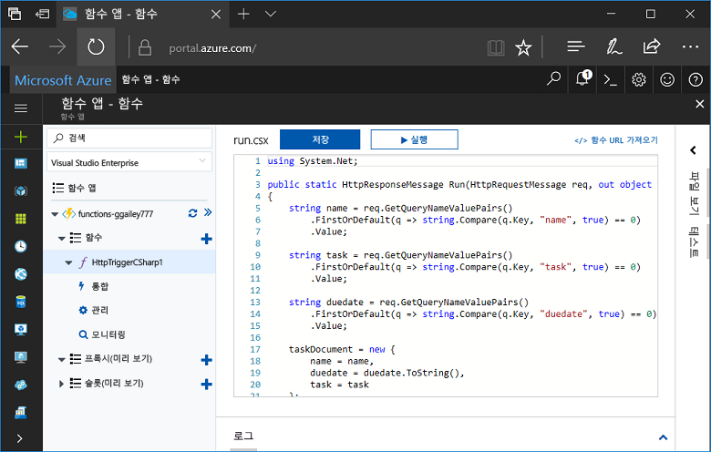
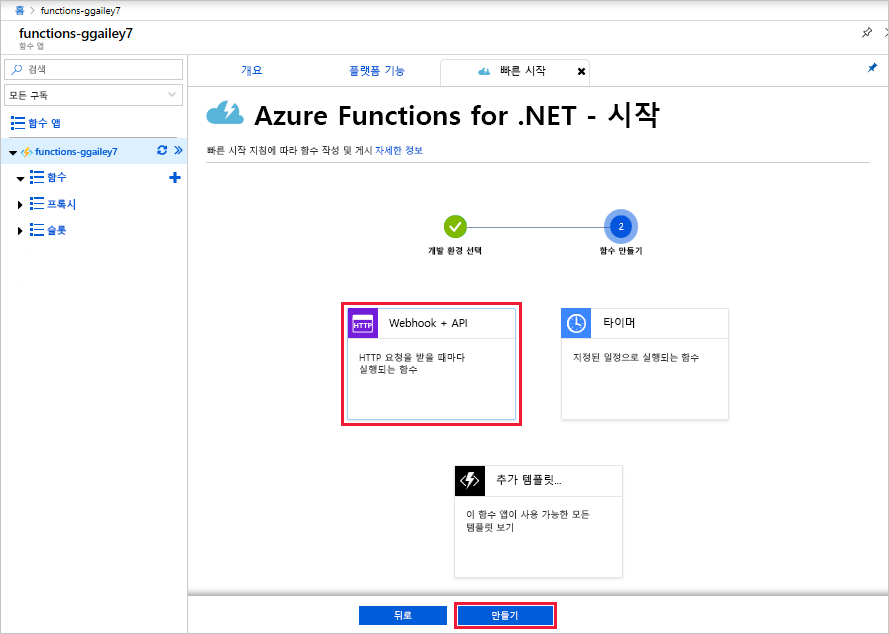
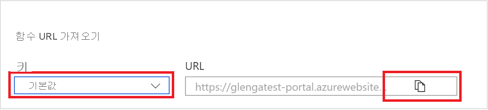
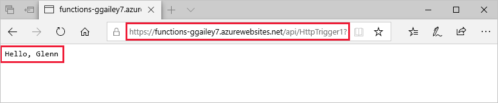
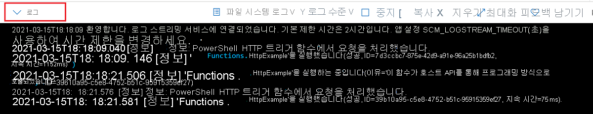

# Azure Portal에서 첫 번째 Azure Function을 만듭니다.

Azure Functions를 사용하면 먼저 VM을 만들거나 웹 응용 프로그램을 게시하지 않고도 [서버를 사용하지 않는](https://azure.microsoft.com/overview/serverless-computing/) 환경에서 코드를 실행할 수 있습니다. 이 항목에서는 Azure Portal에서 함수를 사용하여 "hello world" 함수를 만드는 방법을 보여 줍니다.

[!INCLUDE [quickstarts-free-trial-note](../../includes/quickstarts-free-trial-note.md)]

## Azure에 로그인

Azure 계정을 사용하여 <http://portal.azure.com>에서 Azure Portal에 로그인합니다.

## 함수 앱 만들기

함수 실행을 호스트하는 함수 앱이 있어야 합니다. 함수 앱을 통해 함수를 논리 단위로 그룹화하여 더욱 쉽게 관리, 배포 및 리소스 공유할 수 있습니다. 

[!INCLUDE [Create function app Azure portal](../../includes/functions-create-function-app-portal-experiment.md)]

다음으로 새 함수 앱에서 함수를 만듭니다.

## HTTP 트리거 함수 만들기

1. 새 함수 앱을 확장한 후 **함수** 옆의 **+** 단추를 클릭합니다.

2.  **빨리 시작하기** 페이지에서 **WebHook + API**를 선택한 후 함수에 대한 **언어를 선택**하고 **이 함수 만들기**를 클릭합니다. 
   
    

함수는 HTTP 트리거 함수에 대한 템플릿을 사용하여 선택한 언어로 만들어집니다. 이 토픽에서는 포털의 C# 스크립트 함수를 나타내거나 지원되는 [모든 언어](supported-languages.md)로 함수를 만들 수 있습니다. 

이제 HTTP 요청을 전송하여 새 함수를 실행할 수 있습니다.

## 함수 테스트

1. 새 함수에서 오른쪽 맨 위에 있는 **</> 함수 URL 가져오기**를 클릭하고 **기본값(함수 키)**를 선택한 후 **복사**를 클릭합니다. 

    

2. 함수 URL을 브라우저의 주소 표시줄에 붙여 넣습니다. `&name=<yourname>` 쿼리 문자열을 이 URL의 마지막에 추가하고 키보드에서 `Enter` 키를 눌러 요청을 실행합니다. 브라우저에 함수에서 반환한 응답이 표시될 것입니다.  

    다음 예제에서는 Microsoft Edge 브라우저의 응답을 보여 줍니다(표시된 XML은 다른 브라우저에도 포함될 수 있음).

    

    요청 URL에는 기본적으로 HTTP를 통해 함수에 액세스하는 데 필요한 키가 포함됩니다.   

3. 함수가 실행되면 추적 정보가 로그에 기록됩니다. 이전 실행에서 추적 출력을 보려면 포털에서 함수로 돌아가 화면 맨 아래에서 위쪽 화살표를 클릭하여 **로그**를 확장합니다. 

   

## 리소스 정리

[!INCLUDE [Clean-up resources](../../includes/functions-quickstart-cleanup.md)]

## 다음 단계

간단한 HTTP 트리거 함수가 있는 함수 앱을 만들었습니다.  

[!INCLUDE [Next steps note](../../includes/functions-quickstart-next-steps.md)]

자세한 내용은 [Azure Functions HTTP 및 웹후크 바인딩](functions-bindings-http-webhook.md)을 참조하세요.

