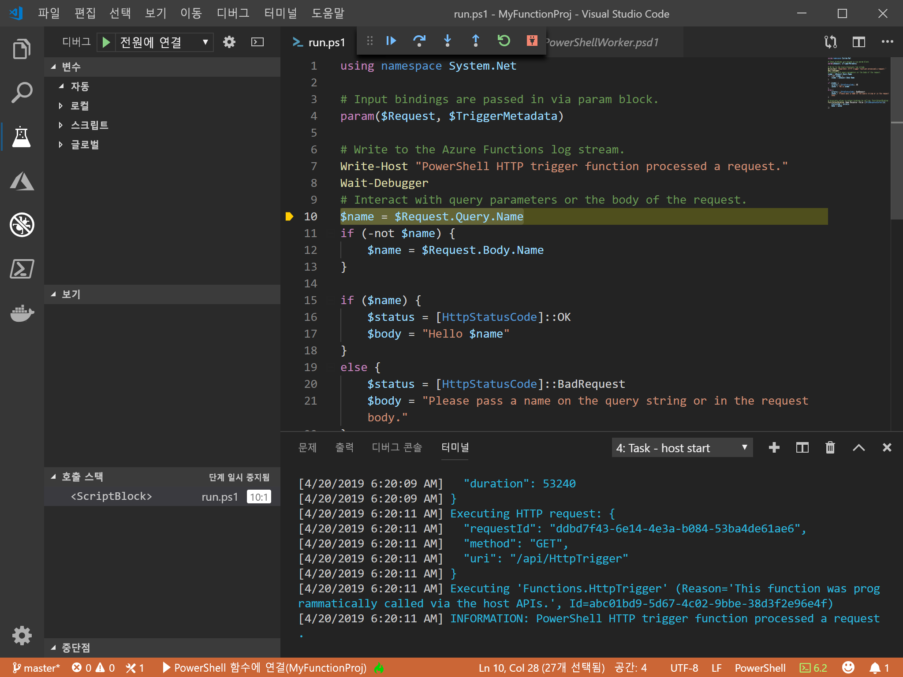
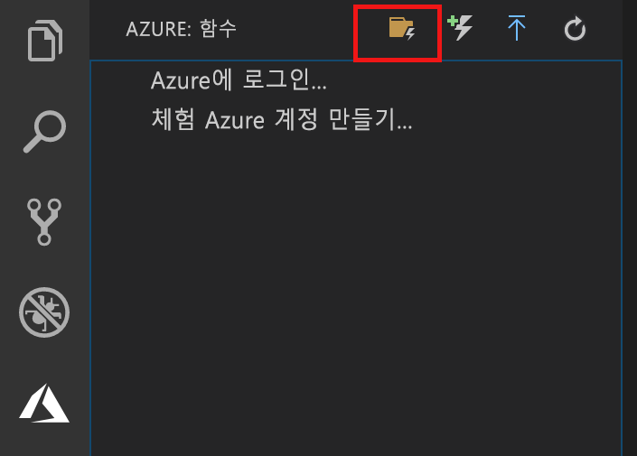

# <a name="create-your-first-powershell-function-in-azure"></a>Azure에서 첫 번째 PowerShell 함수 만들기

이 빠른 시작 문서에서는 Visual Studio Code를 사용하여 첫 번째 [서버리스](https://azure.com/serverless) PowerShell 함수를 만드는 방법을 안내합니다.



[Visual Studio Code용 Azure Functions 확장]을 사용하여 로컬로 PowerShell 함수를 만든 후 Azure에서 새 함수 앱에 배포합니다. 확장은 현재 미리 보기로 제공되고 있습니다. 자세한 내용은 [Visual Studio Code용 Azure Functions 확장] 확장 페이지를 참조하세요.

다음 단계는 macOS, Windows, Linux 기반 운영 체제에서 지원됩니다.

## <a name="prerequisites"></a>사전 요구 사항

이 빠른 시작을 완료하려면 다음이 필요합니다.

* [PowerShell Core](/powershell/scripting/install/installing-powershell-core-on-windows) 설치

* [지원되는 플랫폼](https://code.visualstudio.com/docs/supporting/requirements#_platforms) 중 하나에 [Visual Studio Code](https://code.visualstudio.com/)를 설치합니다. 

* [Visual Studio Code용 PowerShell 확장](https://marketplace.visualstudio.com/items?itemName=ms-vscode.PowerShell)을 설치합니다.

* [.NET Core SDK 2.2+](https://www.microsoft.com/net/download)(Azure Functions Core Tools에 필요하고 지원되는 모든 플랫폼에서 사용 가능)를 설치합니다.

* [Azure Functions Core Tools](functions-run-local.md#v2)의 버전 2.x를 설치합니다.

* 활성 상태인 Azure 구독도 필요합니다.

[!INCLUDE [quickstarts-free-trial-note](../../includes/quickstarts-free-trial-note.md)]

[!INCLUDE [functions-install-vs-code-extension](../../includes/functions-install-vs-code-extension.md)] 

## <a name="create-a-function-app-project"></a>함수 앱 프로젝트 만들기

Visual Studio Code의 Azure Functions 프로젝트 템플릿은 Azure에서 함수 앱에 게시할 수 있는 프로젝트를 만듭니다. 함수 앱을 사용하면 함수를 논리 단위로 그룹화하여 더 쉽게 리소스를 관리, 배포, 크기 조정 및 공유할 수 있습니다.

1. Visual Studio Code에서 **Azure: 함수** 영역에 표시할 Azure 로고를 선택하고 새 프로젝트 만들기 아이콘을 선택합니다.

    

1. Functions 프로젝트 작업 영역에 대한 위치를 선택하고 **선택**을 선택합니다.

    > [!NOTE]
    > 이 문서는 작업 영역 외부에서 완료하도록 설계되었습니다. 이 경우 작업 영역에 포함된 프로젝트 폴더를 선택하지 마십시오.

1. 함수 앱 프로젝트의 언어로 **Powershell**을 선택한 다음, **Azure Functions v2**를 선택합니다.

1. **HTTP 트리거**를 첫 번째 함수의 템플릿으로 선택하고 `HTTPTrigger`를 함수 이름으로 지정한 후 권한 부여 수준으로 **함수**를 선택합니다.

    > [!NOTE]
    > **함수** 권한 부여 수준에는 Azure에서 함수 엔드포인트를 호출할 때 [함수 키](functions-bindings-http-webhook-trigger.md#authorization-keys) 값이 필요합니다. 따라서 누구든지 쉽게 사용자 함수를 호출하지는 못하게 됩니다.

1. 메시지가 표시되면 **작업 영역에 추가**를 선택합니다.

Visual Studio Code는 새 작업 영역에서 PowerShell 함수 앱 프로젝트를 만듭니다. 이 프로젝트에는 프로젝트의 모든 함수를 적용되는 [host.json](functions-host-json.md) 및 [local.settings.json](functions-run-local.md#local-settings-file) 구성 파일이 포함되어 있습니다. 이 [PowerShell 프로젝트](functions-reference-powershell.md#folder-structure)는 Azure에서 실행되는 함수 앱과 동일합니다.

[!INCLUDE [functions-run-function-test-local-vs-code-ps](../../includes/functions-run-function-test-local-vs-code-ps.md)]

[!INCLUDE [functions-publish-project-vscode](../../includes/functions-publish-project-vscode.md)]

## <a name="test"></a>Azure에서 함수 실행

Azure에서 게시된 함수가 실행되는지 확인하려면 `Uri` 매개 변수를 이전 단계에 나오는 HTTPTrigger의 URL로 바꾸고, 다음 PowerShell 명령을 실행합니다. 앞에서와 같이 쿼리 문자열을 `&name=<yourname>` URL에 추가합니다. 다음 예제를 참조하세요.

```powershell
PS > Invoke-WebRequest -Method Get -Uri "https://glengatest-vscode-powershell.azurewebsites.net/api/HttpTrigger?code=nrY05eZutfPqLo0som...&name=PowerShell"

StatusCode        : 200
StatusDescription : OK
Content           : Hello PowerShell
RawContent        : HTTP/1.1 200 OK
                    Content-Length: 16
                    Content-Type: text/plain; charset=utf-8
                    Date: Thu, 25 Apr 2019 16:01:22 GMT

                    Hello PowerShell
Forms             : {}
Headers           : {[Content-Length, 16], [Content-Type, text/plain; charset=utf-8], [Date, Thu, 25 Apr 2019 16:01:22 GMT]}
Images            : {}
InputFields       : {}
Links             : {}
ParsedHtml        : mshtml.HTMLDocumentClass
RawContentLength  : 16
```

## <a name="next-steps"></a>다음 단계

Visual Studio Code를 사용하여 간단한 HTTP 트리거 함수가 있는 PowerShell 함수 앱을 만들었습니다. Azure Functions Core Tools를 사용하여 [PowerShell 함수를 로컬로 디버그](functions-debug-powershell-local.md)에 대해 자세히 알아볼 수도 있습니다. [Azure Functions PowerShell 개발자 가이드](functions-reference-powershell.md)를 참조하세요.

> [!div class="nextstepaction"]
> [Application Insights 통합 사용](functions-monitoring.md#manually-connect-an-app-insights-resource)

[Azure portal]: https://portal.azure.com
[Azure Functions Core Tools]: functions-run-local.md
[Visual Studio Code용 Azure Functions 확장]: https://marketplace.visualstudio.com/items?itemName=ms-azuretools.vscode-azurefunctions
[`Wait-Debugger`]: /powershell/module/microsoft.powershell.utility/wait-debugger?view=powershell-6
