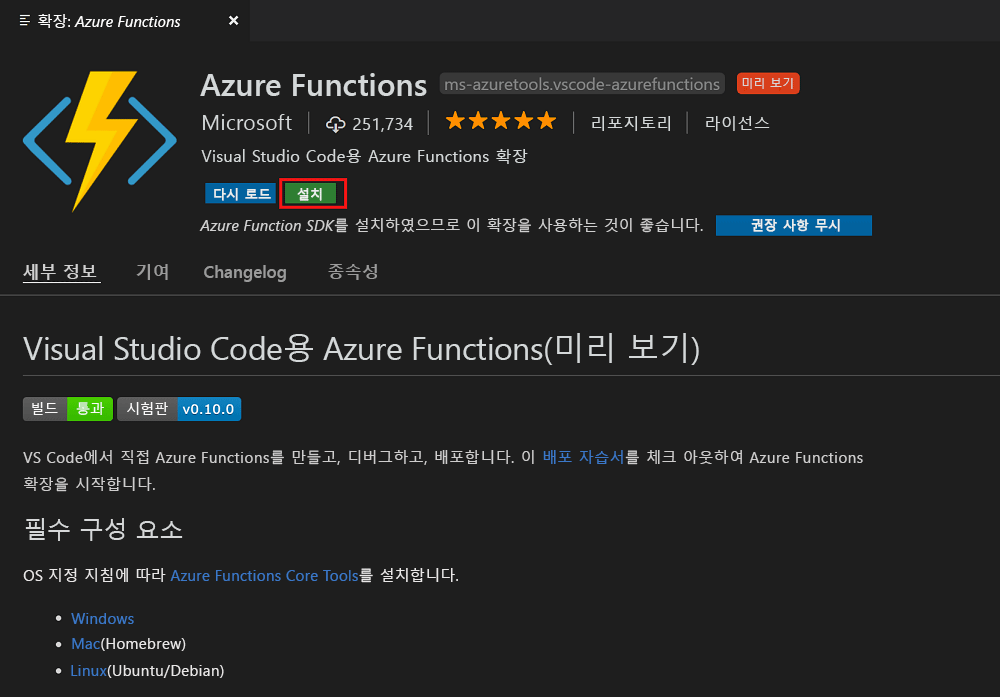
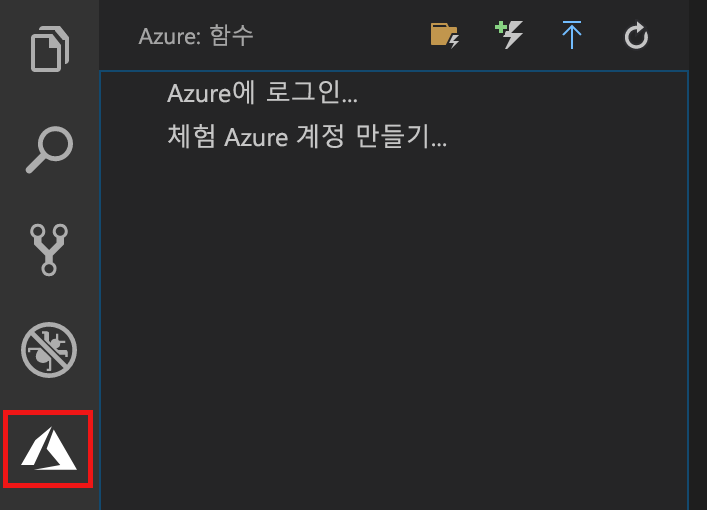
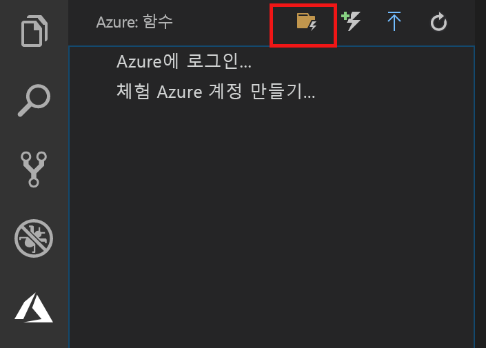
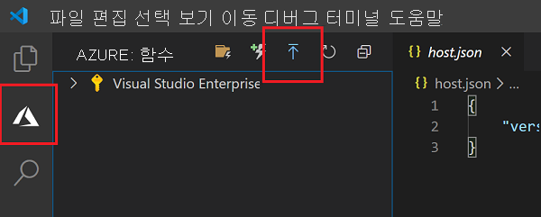
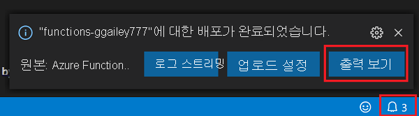
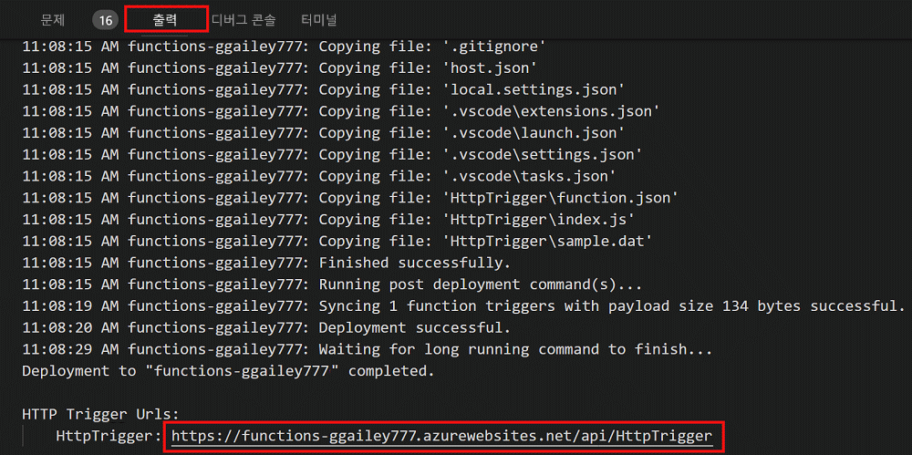

# Visual Studio Code를 사용하여 첫 번째 함수 만들기

Azure Functions를 사용하면 먼저 VM을 만들거나 웹 응용 프로그램을 게시하지 않고도 [서버를 사용하지 않는](https://azure.microsoft.com/solutions/serverless/) 환경에서 코드를 실행할 수 있습니다.

이 문서에서는 [Visual Studio Code용 Azure Functions 확장]을 사용하여 Microsoft Visual Studio Code를 통해 로컬 컴퓨터에 “hello world” 함수를 만들고 테스트하는 방법을 알아봅니다. 그런 다음, Visual Studio Code에서 함수 코드를 Azure에 게시합니다.

확장은 현재 C#, JavaScript 및 Java 함수를 지원합니다. 이 문서의 단계는 Azure Functions 프로젝트에 대해 선택하는 언어에 따라 달라질 수 있습니다. 확장은 현재 미리 보기로 제공되고 있습니다. 자세한 내용은 [Visual Studio Code용 Azure Functions 확장] 확장 페이지를 참조하세요.

## 필수 조건

이 빠른 시작을 완료하려면 다음이 필요합니다.

* [지원되는 플랫폼](https://code.visualstudio.com/docs/supporting/requirements#_platforms) 중 하나에 [Visual Studio Code](https://code.visualstudio.com/)를 설치합니다. 이 문서는 macOS(High Sierra)를 실행하는 장치에서 개발되고 테스트되었습니다.

* 아직 미리 보기 상태인 [Azure Functions 핵심 도구](functions-run-local.md#v2)의 2.x 버전을 설치합니다.

* 선택한 언어에 대한 특정 요구 사항을 설치합니다.

    | 언어 | 내선 번호 |
    | -------- | --------- |
    | **C#** | [C# for Visual Studio Code](https://marketplace.visualstudio.com/items?itemName=ms-vscode.csharp) [.NET Core CLI 도구](https://docs.microsoft.com/dotnet/core/tools/?tabs=netcore2x)*   |
    | **Java** | [Java에 대한 디버거](https://marketplace.visualstudio.com/items?itemName=vscjava.vscode-java-debug) [JDK 1.8](http://www.oracle.com/technetwork/java/javase/downloads/index.html) [Maven 3+](https://maven.apache.org/) |
    | **JavaScript** | [Node 8.0+](https://nodejs.org/)  |

    \* 또한 Core 도구에서 필요합니다.

[!INCLUDE [quickstarts-free-trial-note](../../includes/quickstarts-free-trial-note.md)]

## Azure Function 확장 설치

Azure Functions 확장은 함수를 Azure에 만들고, 테스트 및 배포하는 데 사용됩니다.

1. Visual Studio Code에서 **확장**을 열고 `azure functions`를 검색하거나 [Visual Studio Code에서 이 링크를 엽니다](vscode:extension/ms-azuretools.vscode-azurefunctions).

1. **설치**를 선택하여 Visual Studio Code에 확장을 설치합니다. 

    

1. Visual Studio Code를 다시 시작하고 작업 표시줄에서 Azure 아이콘을 선택합니다. 사이드바에 Azure Functions 영역이 표시됩니다.

    

## Azure Functions 프로젝트 만들기

Visual Studio Code의 Azure Functions 프로젝트 템플릿은 Azure에서 함수 앱에 게시할 수 있는 프로젝트를 만듭니다. 함수 앱을 통해 함수를 논리적 단위로 그룹화하여 관리, 배포 및 리소스를 공유할 수 있습니다.

1. Visual Studio Code에서 **Azure: Functions** 영역을 표시하도록 Azure 로고를 선택한 다음, 새 프로젝트 만들기 아이콘을 선택합니다.

    

1. 프로젝트 작업 영역에 대한 위치를 선택하고 **선택**을 선택합니다.

    > [!NOTE]
    > 이 문서는 작업 영역 외부에서 완료하도록 설계되었습니다. 이 경우 작업 영역에 포함된 프로젝트 폴더를 선택하지 마십시오.

1. 함수 앱 프로젝트에 대한 언어를 선택합니다. 이 문서에서는 JavaScript가 사용됩니다.
    

1. 메시지가 표시되면 **작업 영역에 추가**를 선택합니다.

Visual Studio Code는 새 작업 영역에서 함수 앱 프로젝트를 만듭니다. 이 프로젝트에는 [host.json](functions-host-json.md) 및 [local.settings.json](functions-run-local.md#local-settings-file) 구성 파일과 언어별 프로젝트 파일이 포함됩니다. 또한 프로젝트 폴더에 새 Git 리포지토리를 가져올 수 있습니다.

## HTTP 트리거 함수 만들기

1. **Azure: Functions**에서 함수 만들기 아이콘을 선택합니다.

    

1. 함수 앱 프로젝트를 사용하여 폴더를 선택하고 **HTTP 트리거** 함수 템플릿을 선택합니다.

    

1. 함수 이름에 `HTTPTrigger`를 입력하고 Enter 키를 누른 다음, **익명** 인증을 선택합니다.

    

    HTTP 트리거 함수에 대한 템플릿을 사용하여 선택한 언어로 함수가 만들어집니다.

    

function.json 파일을 수정하여 함수에 입력 및 출력을 추가할 수 있습니다. 자세한 내용은 [Azure Functions 트리거 및 바인딩 개념](functions-triggers-bindings.md)을 참조하세요.

함수 프로젝트 및 HTTP로 트리거되는 함수를 만들었으니, 로컬 컴퓨터에서 이 함수를 테스트할 수 있습니다.

## 로컬에서 함수 테스트

Azure Functions Core Tools를 사용하면 로컬 개발 컴퓨터에서 Azure Functions 프로젝트를 실행할 수 있습니다. Visual Studio Code에서 처음으로 함수를 시작할 때 이러한 도구를 설치하도록 요구하는 메시지가 표시됩니다.  

1. 함수를 테스트하려면 함수 코드에 중단점을 설정하고 F5 키를 눌러 함수 앱 프로젝트를 시작합니다. 핵심 도구의 출력이 **터미널** 패널에 표시됩니다.

1. **터미널** 패널에서 HTTP 트리거 함수의 URL 엔드포인트를 복사합니다.

    

1. HTTP 요청에 대한 URL을 브라우저의 주소 표시줄에 붙여 넣습니다. 이 URL에 쿼리 문자열 `?name=<yourname>`을 추가하고 요청을 실행합니다. 중단점이 적중되는 경우 실행이 일시 중지됩니다.

    

1. 계속 실행하는 경우 다음과 같이 GET 요청에 대한 응답이 브라우저에 표시됩니다.

    

1. 디버깅을 중지하려면 Shift+F1을 누릅니다.

함수가 로컬 컴퓨터에서 제대로 실행되는지 확인한 후에 해당 프로젝트를 Azure에 게시해야 합니다.

## Azure에 로그인

앱을 게시하기 전에 Azure에 로그인해야 합니다.

1. **Azure: Functions** 영역에서 **Azure에 로그인...** 을 선택합니다. 계정이 없는 경우 **무료 Azure 계정 만들기**를 수행할 수 있습니다.

    

1. 메시지가 표시되면 **복사 및 열기**를 선택하거나, 표시된 코드를 복사하고 브라우저에서 <https://aka.ms/devicelogin>을 엽니다.

1. 복사한 코드를 **장치 로그인** 페이지에 붙여넣고, Visual Studio Code에 대한 로그인을 확인한 다음, **계속**을 선택합니다.  

1. Azure 계정 자격 증명을 사용하여 로그인을 완료합니다. 성공적으로 로그인한 후에 브라우저를 닫을 수 있습니다.

## Azure에 프로젝트 게시

Visual Studio Code를 사용하면 Azure에 직접 함수 프로젝트를 게시할 수 있습니다. 프로세스를 통해 함수 앱 및 관련된 리소스를 Azure 구독에서 만듭니다. 함수 앱은 함수를 위한 실행 컨텍스트를 제공합니다. 프로젝트는 패키지되어 Azure 구독에서 새 함수 앱에 배포됩니다. 

이 문서에서는 새 함수 앱을 만든다고 가정합니다. 기존 함수 앱에 게시하면 Azure에서 해당 앱의 콘텐츠를 덮어씁니다.

1. **Azure: Functions** 영역에서 함수 앱에 배포 아이콘을 선택합니다.

    

1. 현재 작업 영역인 프로젝트 폴더를 선택합니다.

1. 둘 이상의 구독이 있는 경우 함수 앱을 호스트하려는 것을 선택한 다음, **+ 새 함수 앱 만들기**를 선택합니다.

1. 함수 앱을 식별하는 전역적으로 고유한 이름을 입력하고 Enter 키를 누릅니다. 함수 앱 이름에 대한 유효한 문자는 `a-z`, `0-9` 및 `-`입니다.

1. **+ 새 리소스 그룹 만들기**를 선택하고 `myResourceGroup`과 같은 리소스 그룹 이름을 입력한 후 Enter 키를 누릅니다. 기존 리소스 그룹을 사용할 수도 있습니다.

1. **+ 새 저장소 계정 만들기**를 선택하고, 함수 앱에서 사용되는 전역적으로 고유한 새 저장소 계정의 이름을 입력한 후 Enter 키를 누릅니다. Storage 계정 이름은 3자에서 24자 사이여야 하고 숫자 및 소문자만 포함할 수 있습니다. 기존 계정을 사용할 수도 있습니다.

1. 사용자 근처 또는 함수가 액세스할 기타 서비스에 가까운 [지역](https://azure.microsoft.com/regions/)의 위치를 선택합니다.

    사용자의 위치를 선택한 후 함수 앱 만들기를 시작합니다. 함수 앱을 만들고 배포 패키지가 적용되면 알림이 표시됩니다.

1. 알림에서 **출력 보기**를 선택하여 사용자가 만든 Azure 리소스를 포함한 만들기 및 배포 결과를 표시합니다.

    

1. Azure에서 새 함수 앱의 URL을 기록해 둡니다. 이는 프로젝트가 Azure에 게시된 후 함수를 테스트하는 데 사용합니다.

    

1. **Azure: Functions** 영역으로 돌아가면 사용자 구독 아래에 새 함수 앱이 표시됩니다. 이 노드를 확장하면 응용 프로그램 설정 및 함수 프록시와 함께 함수 앱의 함수가 표시됩니다.

    

    함수 앱 노드에서 Ctrl 키와 함께 마우스 오른쪽 단추를 클릭하여 Azure에서 함수 앱에 대한 다양한 관리 및 구성 작업을 수행하도록 선택합니다. 또한 Azure Portal에서 함수 앱을 보도록 선택할 수 있습니다.

## Azure에서 함수 테스트

1. **출력** 패널에서 HTTP 트리거의 URL을 복사합니다. 이전처럼 이 URL 마지막에 `?name=<yourname>` 쿼리 문자열을 추가하고 요청을 실행해야 합니다.

    HTTP 트리거 함수를 호출하는 URL은 다음 형식이어야 합니다.

        http://<functionappname>.azurewebsites.net/api/<functionname>?name=<yourname> 

1. HTTP 요청에 대한 이러한 새 URL을 브라우저의 주소 표시줄에 붙여넣습니다. 다음은 함수에서 반환된 원격 GET 요청에 대한 브라우저의 응답을 보여 줍니다. 

    

## 다음 단계

Visual Studio Code를 사용하여 간단한 HTTP 트리거 함수가 있는 함수 앱을 만들었습니다. 특정 언어로 함수를 개발하는 것에 관한 자세한 내용은 [JavaScript](functions-reference-node.md), [.NET](functions-dotnet-class-library.md) 또는 [Java](functions-reference-java.md)에 대한 언어 참조 가이드를 참조하세요.

다음으로, Azure Functions 핵심 도구를 사용하여 터미널 또는 명령 프롬프트에서 로컬 테스트 및 디버깅하는 데 관한 자세한 내용을 알아볼 수 있습니다.

> [!div class="nextstepaction"]
> [로컬로 코드 및 테스트](functions-run-local.md)

[Azure Functions Core Tools]: functions-run-local.md
[Visual Studio Code용 Azure Functions 확장]: https://marketplace.visualstudio.com/items?itemName=ms-azuretools.vscode-azurefunctions
