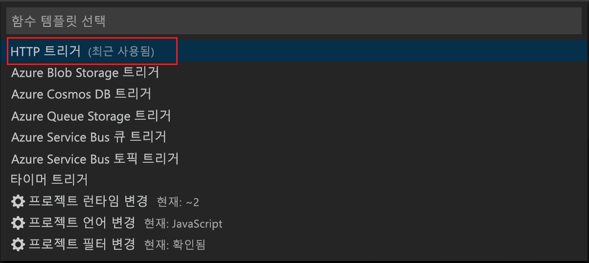
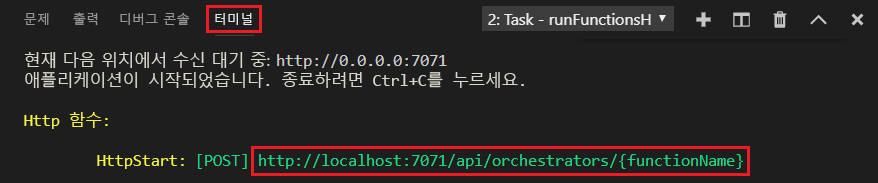
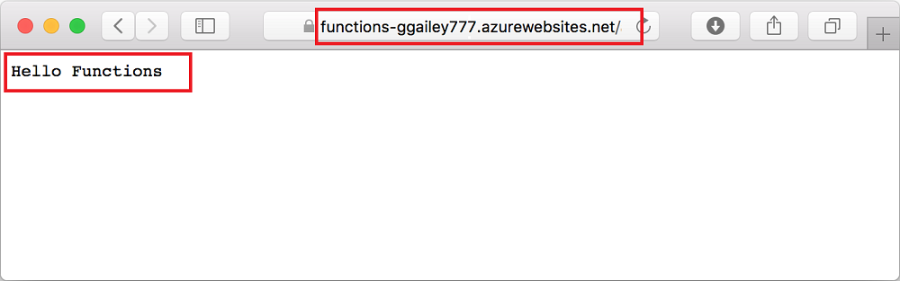

# Visual Studio Code를 사용하여 첫 번째 함수 만들기

Azure Functions를 사용하면 먼저 VM을 만들거나 웹 응용 프로그램을 게시하지 않고도 [서버를 사용하지 않는](https://azure.microsoft.com/solutions/serverless/) 환경에서 코드를 실행할 수 있습니다.

이 문서에서는 [Visual Studio Code용 Azure Functions 확장]을 사용하여 Microsoft Visual Studio Code를 통해 로컬 컴퓨터에 “hello world” 함수를 만들고 테스트하는 방법을 알아봅니다. 그런 다음, Visual Studio Code에서 함수 코드를 Azure에 게시합니다.

확장은 현재 C#, JavaScript 및 Java 함수를 지원합니다. 이 문서의 단계는 Azure Functions 프로젝트에 대해 선택하는 언어에 따라 달라질 수 있습니다. 확장은 현재 미리 보기로 제공되고 있습니다. 자세한 내용은 [Visual Studio Code용 Azure Functions 확장] 확장 페이지를 참조하세요.

## 필수 조건

이 빠른 시작을 완료하려면 다음이 필요합니다.

* [지원되는 플랫폼](https://code.visualstudio.com/docs/supporting/requirements#_platforms) 중 하나에 [Visual Studio Code](https://code.visualstudio.com/)를 설치합니다. 이 문서는 macOS(High Sierra)를 실행하는 장치에서 개발되고 테스트되었습니다.

* 아직 미리 보기 상태인 [Azure Functions 핵심 도구](functions-run-local.md#v2)의 2.x 버전을 설치합니다.

* 선택한 언어에 대한 특정 요구 사항을 설치합니다.

    | 언어 | 내선 번호 |
    | -------- | --------- |
    | **C#** | [C# for Visual Studio Code](https://marketplace.visualstudio.com/items?itemName=ms-vscode.csharp) [.NET Core CLI 도구](https://docs.microsoft.com/dotnet/core/tools/?tabs=netcore2x)*   |
    | **Java** | [Java에 대한 디버거](https://marketplace.visualstudio.com/items?itemName=vscjava.vscode-java-debug) [Java 8](https://aka.ms/azure-jdks) [Maven 3+](https://maven.apache.org/) |
    | **JavaScript** | [Node 8.0+](https://nodejs.org/)  |

    \* 또한 Core 도구에서 필요합니다.

[!INCLUDE [quickstarts-free-trial-note](../../includes/quickstarts-free-trial-note.md)]

[!INCLUDE [functions-install-vs-code-extension](../../includes/functions-install-vs-code-extension.md)]

[!INCLUDE [functions-create-function-app-vs-code](../../includes/functions-create-function-app-vs-code.md)]

## HTTP 트리거 함수 만들기

1. **Azure: Functions**에서 함수 만들기 아이콘을 선택합니다.

    

1. 함수 앱 프로젝트를 사용하여 폴더를 선택하고 **HTTP 트리거** 함수 템플릿을 선택합니다.

    

1. 함수 이름에 `HTTPTrigger`를 입력하고 Enter 키를 누른 다음, **익명** 인증을 선택합니다.

    

    HTTP 트리거 함수에 대한 템플릿을 사용하여 선택한 언어로 함수가 만들어집니다.

    

function.json 파일을 수정하여 함수에 입력 및 출력을 추가할 수 있습니다. 자세한 내용은 [Azure Functions 트리거 및 바인딩 개념](functions-triggers-bindings.md)을 참조하세요.

함수 프로젝트 및 HTTP로 트리거되는 함수를 만들었으니, 로컬 컴퓨터에서 이 함수를 테스트할 수 있습니다.

## 로컬에서 함수 테스트

Azure Functions Core Tools를 사용하면 로컬 개발 컴퓨터에서 Azure Functions 프로젝트를 실행할 수 있습니다. Visual Studio Code에서 처음으로 함수를 시작할 때 이러한 도구를 설치하도록 요구하는 메시지가 표시됩니다.  

1. 함수를 테스트하려면 함수 코드에 중단점을 설정하고 F5 키를 눌러 함수 앱 프로젝트를 시작합니다. 핵심 도구의 출력이 **터미널** 패널에 표시됩니다.

1. **터미널** 패널에서 HTTP 트리거 함수의 URL 엔드포인트를 복사합니다.

    

1. HTTP 요청에 대한 URL을 브라우저의 주소 표시줄에 붙여 넣습니다. 이 URL에 쿼리 문자열 `?name=<yourname>`을 추가하고 요청을 실행합니다. 중단점이 적중되는 경우 실행이 일시 중지됩니다.

    

1. 계속 실행하는 경우 다음과 같이 GET 요청에 대한 응답이 브라우저에 표시됩니다.

    

1. 디버깅을 중지하려면 Shift+F1을 누릅니다.

함수가 로컬 컴퓨터에서 제대로 실행되는지 확인한 후에 해당 프로젝트를 Azure에 게시해야 합니다.

[!INCLUDE [functions-sign-in-vs-code](../../includes/functions-sign-in-vs-code.md)]

[!INCLUDE [functions-publish-project-vscode](../../includes/functions-publish-project-vscode.md)]

## Azure에서 함수 테스트

1. **출력** 패널에서 HTTP 트리거의 URL을 복사합니다. 이전처럼 이 URL 마지막에 `?name=<yourname>` 쿼리 문자열을 추가하고 요청을 실행해야 합니다.

    HTTP 트리거 함수를 호출하는 URL은 다음 형식이어야 합니다.

        http://<functionappname>.azurewebsites.net/api/<functionname>?name=<yourname> 

1. HTTP 요청에 대한 이러한 새 URL을 브라우저의 주소 표시줄에 붙여넣습니다. 다음은 함수에서 반환된 원격 GET 요청에 대한 브라우저의 응답을 보여 줍니다. 

    

## 다음 단계

Visual Studio Code를 사용하여 간단한 HTTP 트리거 함수가 있는 함수 앱을 만들었습니다. 특정 언어로 함수를 개발하는 것에 관한 자세한 내용은 [JavaScript](functions-reference-node.md), [.NET](functions-dotnet-class-library.md) 또는 [Java](functions-reference-java.md)에 대한 언어 참조 가이드를 참조하세요.

다음으로, Azure Functions 핵심 도구를 사용하여 터미널 또는 명령 프롬프트에서 로컬 테스트 및 디버깅하는 데 관한 자세한 내용을 알아볼 수 있습니다.

> [!div class="nextstepaction"]
> [로컬로 코드 및 테스트](functions-run-local.md)

[Azure Functions Core Tools]: functions-run-local.md
[Visual Studio Code용 Azure Functions 확장]: https://marketplace.visualstudio.com/items?itemName=ms-azuretools.vscode-azurefunctions
