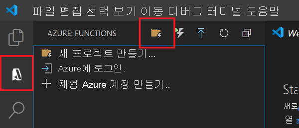
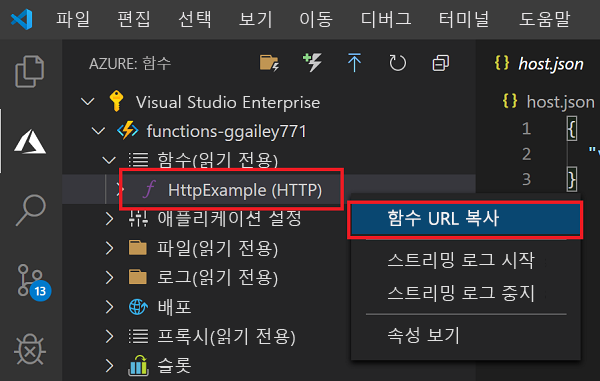

# 빠른 시작: Visual Studio Code를 사용하여 Azure Functions 프로젝트 만들기

이 문서에서는 Visual Studio Code를 사용하여 HTTP 요청에 응답하는 함수를 만듭니다. 코드를 로컬로 테스트한 후 Azure Functions의 서버리스 환경에 배포합니다. 이 빠른 시작을 완료하면 Azure 계정에서 USD 센트 이하의 작은 비용이 발생합니다. 

이 문서의 [CLI 기반 버전](functions-create-first-azure-function-azure-cli.md)도 있습니다.

## 환경 구성

시작하기 전에 다음 요구 사항을 갖추었는지 확인합니다.

+ 활성 구독이 있는 Azure 계정. [체험 계정을 만듭니다](https://azure.microsoft.com/free/?ref=microsoft.com&utm_source=microsoft.com&utm_medium=docs&utm_campaign=visualstudio).

::: zone pivot="programming-language-csharp,programming-language-powershell,programming-language-python"  
+ npm용 Windows에 필요한 [Node.js](https://nodejs.org/)입니다. [활성 LTS 및 유지 관리 LTS 버전](https://nodejs.org/about/releases/)만 해당합니다. `npm --version` 명령을 사용하여 버전을 확인합니다.
    MacOS 및 Linux의 로컬 개발에는 필요하지 않습니다.   
::: zone-end  
::: zone pivot="programming-language-javascript,programming-language-typescript"  
+ [Node.js](https://nodejs.org/), 활성 LTS 및 유지 관리 LTS 버전(10.14.1 권장). `npm --version` 명령을 사용하여 버전을 확인합니다.
::: zone-end 
::: zone pivot="programming-language-python"
+ [Python 3.8](https://www.python.org/downloads/release/python-381/), [Python 3.7](https://www.python.org/downloads/release/python-375/), [Python 3.6](https://www.python.org/downloads/release/python-368/)은 Azure Functions(x64)에서 지원됩니다.
::: zone-end   
::: zone pivot="programming-language-powershell"
+ [PowerShell Core](/powershell/scripting/install/installing-powershell-core-on-windows)

+ [.NET Core SDK 2.2 이상](https://www.microsoft.com/net/download)  
::: zone-end  
+ [지원되는 플랫폼](https://code.visualstudio.com/docs/supporting/requirements#_platforms) 중 하나인 [Visual Studio Code](https://code.visualstudio.com/).  
::: zone pivot="programming-language-csharp"  
+ Visual Studio Code용 [C# 확장](https://marketplace.visualstudio.com/items?itemName=ms-dotnettools.csharp).  
::: zone-end  
::: zone pivot="programming-language-python"
+ Visual Studio Code용 [Python 확장](https://marketplace.visualstudio.com/items?itemName=ms-python.python).  
::: zone-end  
::: zone pivot="programming-language-powershell"
+ [Visual Studio Code용 PowerShell 확장](https://marketplace.visualstudio.com/items?itemName=ms-vscode.PowerShell).  
::: zone-end  

+ Visual Studio Code용 [Azure Functions 확장](https://marketplace.visualstudio.com/items?itemName=ms-azuretools.vscode-azurefunctions). 

## 로컬 프로젝트 만들기 

이 섹션에서는 Visual Studio Code를 사용하여 선택한 언어로 로컬 Azure Functions 프로젝트를 만듭니다. 이 문서의 뒷부분에서 함수 코드를 Azure에 게시합니다. 

1. 작업 막대에서 Azure 아이콘을 선택한 다음, **Azure: Functions** 영역에서 **새 프로젝트 만들기...** 아이콘을 선택합니다.

    

1. 프로젝트 작업 영역에 대한 디렉터리 위치를 선택하고 **선택**을 선택합니다.

    > [!NOTE]
    > 다음 단계는 작업 영역 외부에서 완료하도록 설계되었습니다. 이 경우 작업 영역에 포함된 프로젝트 폴더를 선택하지 마십시오.

1. 프롬프트에서 다음 정보를 제공합니다.

    ::: zone pivot="programming-language-csharp"
    + **함수 프로젝트에 대한 언어 선택**: `C#`을 선택합니다.
    ::: zone-end
    ::: zone pivot="programming-language-javascript"
    + **함수 프로젝트에 대한 언어 선택**: `JavaScript`을 선택합니다.
    ::: zone-end
    ::: zone pivot="programming-language-typescript"
    + **함수 프로젝트에 대한 언어 선택**: `TypeScript`을 선택합니다.
    ::: zone-end
    ::: zone pivot="programming-language-powershell"
    + **함수 프로젝트에 대한 언어 선택**: `PowerShell`을 선택합니다.
    ::: zone-end
    ::: zone pivot="programming-language-python"
    + **함수 프로젝트에 대한 언어 선택**: `Python`을 선택합니다.

    + **가상 환경을 만들기 위한 Python 별칭 선택**: Python 인터프리터의 위치를 선택합니다. 위치가 표시되지 않으면 Python 이진에 대한 전체 경로를 입력합니다.  
    ::: zone-end

    + **프로젝트의 첫 번째 함수에 대한 템플릿 선택**: `HTTP trigger`을 선택합니다.
    
    + **함수 이름 입력**: `HttpExample`.
    
    ::: zone pivot="programming-language-csharp"
    + **네임스페이스 입력**: `My.Functions`. 
    ::: zone-end

    + **권한 부여 수준**: 누구나 함수 엔드포인트를 호출할 수 있도록 하는 `Anonymous`를 선택합니다. 권한 부여 수준에 대해 알아보려면 [권한 부여 키](functions-bindings-http-webhook-trigger.md#authorization-keys)를 참조하세요.

    + **프로젝트를 여는 방법 선택**: `Add to workspace`을 선택합니다.

1. Visual Studio Code는 이 정보를 사용하여 HTTP 트리거를 통해 Azure Functions 프로젝트를 생성합니다. 탐색기에서 로컬 프로젝트 파일을 볼 수 있습니다. 생성된 파일에 대한 자세한 내용은 [생성된 프로젝트 파일](functions-develop-vs-code.md#generated-project-files)을 참조하세요. 

::: zone pivot="programming-language-csharp,programming-language-javascript,programming-language-python"

[!INCLUDE [functions-run-function-test-local-vs-code](../../includes/functions-run-function-test-local-vs-code.md)]

::: zone-end

::: zone pivot="programming-language-powershell"

[!INCLUDE [functions-run-function-test-local-vs-code-ps](../../includes/functions-run-function-test-local-vs-code-ps.md)]

::: zone-end

함수가 로컬 컴퓨터에서 제대로 실행되는지 확인한 후에 Visual Studio Code를 사용하여 프로젝트를 Azure에 직접 게시합니다. 

[!INCLUDE [functions-sign-in-vs-code](../../includes/functions-sign-in-vs-code.md)]

[!INCLUDE [functions-publish-project-vscode](../../includes/functions-publish-project-vscode.md)]

## Azure에서 함수 실행

1. **Azure: Functions** 영역으로 돌아가서 구독의 새 함수 앱을 확장합니다. **Functions**를 확장하고 **HttpExample**에서 (Windows) 또는 Ctrl + 클릭(MacOS)을 마우스 오른쪽 단추로 클릭한 다음, **함수 URL 복사**를 선택합니다.

    

1. HTTP 요청에 대한 이 URL을 브라우저의 주소 표시줄에 붙여넣고 `name` 쿼리 문자열을 이 URL의 끝에 `?name=Functions`로 추가한 다음, 요청을 실행합니다. HTTP 트리거 함수를 호출하는 URL은 다음 형식이어야 합니다.

        http://<functionappname>.azurewebsites.net/api/httpexample?name=Functions 
        
    다음 예제에서는 함수에서 반환된 원격 GET 요청에 대한 브라우저의 응답을 보여 줍니다. 

    

## 리소스 정리

다음 단계인 [함수에 Azure Storage 큐 바인딩 추가](functions-add-output-binding-storage-queue-vs-code.md)를 계속 진행하는 경우 이미 수행한 작업을 기반으로 모든 리소스를 제자리에 유지해야 합니다.

그렇지 않으면 다음 단계를 수행하여 추가 비용이 발생하지 않도록 함수 앱 및 관련 리소스를 삭제할 수 있습니다.

[!INCLUDE [functions-cleanup-resources-vs-code.md](../../includes/functions-cleanup-resources-vs-code.md)]

함수 비용에 대한 자세한 내용은 [소비 계획 비용 예측](functions-consumption-costs.md)을 참조하세요.

## 다음 단계

Visual Studio Code를 사용하여 간단한 HTTP 트리거 함수가 있는 함수 앱을 만들었습니다. 다음 문서에서는 출력 바인딩을 추가하여 해당 함수를 확장합니다. 이 바인딩은 HTTP 요청의 문자열을 Azure Queue Storage 큐의 메시지에 씁니다. 

> [!div class="nextstepaction"]
> [함수에 Azure Storage 큐 바인딩 추가](functions-add-output-binding-storage-queue-vs-code.md)

[Azure Functions Core Tools]: functions-run-local.md
[Azure Functions extension for Visual Studio Code]: https://marketplace.visualstudio.com/items?itemName=ms-azuretools.vscode-azurefunctions
