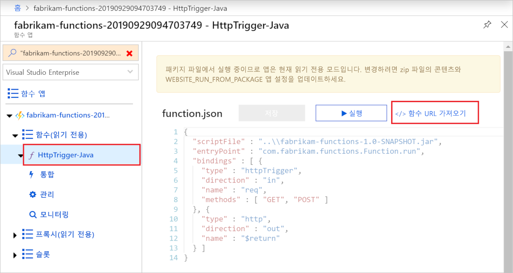

# <a name="quickstart-use-java-and-mavengradle-to-create-and-publish-a-function-to-azure"></a>빠른 시작: Java 및 Maven/Gradle을 사용하여 함수를 만들고 Azure에 게시

이 문서에서는 Maven/Gradle 명령줄 도구를 사용하여 Java 함수를 만들고 Azure Functions에 게시하는 방법을 보여 줍니다. 완료되면 함수 코드는 [서버리스 호스팅 계획](functions-scale.md#consumption-plan)의 Azure에서 실행되고 HTTP 요청에 의해 트리거됩니다.

<!--
> [!NOTE] 
> You can also create a Kotlin-based Azure Functions project by using the azure-functions-kotlin-archetype instead. Visit the [GitHub repository](https://github.com/microsoft/azure-maven-archetypes/tree/develop/azure-functions-kotlin-archetype) for more information.
-->

## <a name="prerequisites"></a>사전 요구 사항

Java를 사용하여 함수를 개발하려면 다음을 설치해야 합니다.

- [Java Developer Kit](https://aka.ms/azure-jdks), 버전 8
- [Azure CLI]
- [Azure Functions Core Tools](./functions-run-local.md#v2) 버전 2.6.666 이상
::: zone pivot="java-build-tools-maven" 
- [Apache Maven](https://maven.apache.org), 버전 3.0 이상
::: zone-end

::: zone pivot="java-build-tools-gradle"  
- [Gradle](https://gradle.org/), 버전 4.10 이상
::: zone-end 

활성 상태인 Azure 구독도 필요합니다. [!INCLUDE [quickstarts-free-trial-note](../../includes/quickstarts-free-trial-note.md)]


> [!IMPORTANT]
> 이 퀵 스타트를 완료하려면 JAVA_HOME 환경 변수를 JDK 설치 위치로 설정해야 합니다.

## <a name="prepare-a-functions-project"></a>Functions 프로젝트 준비

::: zone pivot="java-build-tools-maven" 
빈 폴더에서 다음 명령을 실행하여 [Maven archetype](https://maven.apache.org/guides/introduction/introduction-to-archetypes.html)으로부터 Functions 프로젝트를 생성합니다.

```bash
mvn archetype:generate -DarchetypeGroupId=com.microsoft.azure -DarchetypeArtifactId=azure-functions-archetype 
```

> [!NOTE]
> Powershell을 사용하는 경우 매개 변수 주위에 ""를 추가해야 합니다.

> [!NOTE]
> 명령 실행에 문제가 발생하는 경우 `maven-archetype-plugin` 버전이 사용되는지 살펴보시기 바랍니다. `.pom` 파일이 없는 빈 디렉터리에서 명령을 실행하고 있으므로 이전 버전에서 Maven을 업그레이드한 경우 `~/.m2/repository/org/apache/maven/plugins/maven-archetype-plugin`에서 이전 버전의 플러그 인을 사용을 시도할 수도 있습니다. 그렇다면 `maven-archetype-plugin` 디렉터리를 삭제하고 명령을 다시 실행해보세요.

Maven은 배포 시 프로젝트 생성 완료를 위해 필요한 값을 요청합니다. 메시지가 표시되면 다음 값을 제공합니다.

| 값 | Description |
| ----- | ----------- |
| **groupId** | Java에 대한 [패키지 명명 규칙](https://docs.oracle.com/javase/specs/jls/se6/html/packages.html#7.7)에 따라 모든 프로젝트에서 프로젝트를 고유하게 식별하는 값입니다. 이 빠른 시작의 예제에서는 `com.fabrikam.functions`를 사용합니다. |
| **artifactId** | 버전 번호가 없는 jar의 이름인 값입니다. 이 빠른 시작의 예제에서는 `fabrikam-functions`를 사용합니다. |
| **version** | `1.0-SNAPSHOT`의 기본값을 선택합니다. |
| **package** | 생성된 함수 코드에 대한 Java 패키지인 값입니다. 기본값을 사용하세요. 이 빠른 시작의 예제에서는 `com.fabrikam.functions`를 사용합니다. |
| **appName** | Azure에서 새 함수 앱을 식별하는 전역적으로 고유한 이름입니다. 난수와 함께 추가되는 _artifactId_인 기본값을 사용합니다. 이 값을 기록해 둡니다. 나중에 필요합니다. |
| **appRegion** | 사용자 근처 또는 함수가 액세스할 기타 서비스에 가까운 [지역](https://azure.microsoft.com/regions/)을 선택합니다. 기본값은 `westus`입니다. 이 [Azure CLI] 명령을 실행하여 모든 지역 목록을 가져옵니다.<br/>`az account list-locations --query '[].{Name:name}' -o tsv` |
| **resourceGroup** | 함수 앱을 만들 새 [리소스 그룹](../azure-resource-manager/management/overview.md)의 이름입니다. 이 빠른 시작의 예제에서 사용하는 `myResourceGroup`을 사용합니다. 리소스 그룹은 Azure 구독에 대해 고유해야 합니다.|

`Y`를 입력하거나 Enter 키를 눌러 확인합니다.

Maven은 이름이 _artifactId_인 새 폴더에 프로젝트 파일을 만드는데, 이 예제에서는 `fabrikam-functions`입니다. 다음 명령을 실행하여 디렉터리를 만든 프로젝트 폴더로 변경합니다.
```bash
cd fabrikam-function
```

::: zone-end 
::: zone pivot="java-build-tools-gradle"
다음 명령을 사용하여 샘플 프로젝트를 복제합니다.

```bash
git clone https://github.com/Azure-Samples/azure-functions-samples-java.git
cd azure-functions-samples-java/
```

`build.gradle`을 열고 Azure에 배포할 때 도메인 이름 충돌을 방지하기 위해 다음 섹션의 `appName`을 고유한 이름으로 변경합니다. 

```gradle
azurefunctions {
    resourceGroup = 'java-functions-group'
    appName = 'azure-functions-sample-demo'
    pricingTier = 'Consumption'
    region = 'westus'
    runtime {
      os = 'windows'
    }
    localDebug = "transport=dt_socket,server=y,suspend=n,address=5005"
}
```
::: zone-end

텍스트 편집기에서 *src/main/java* 경로에서 새 Function.java 파일을 열고 생성된 코드를 검토합니다. 이 코드는 요청의 본문을 에코하는 [HTTP 트리거](functions-bindings-http-webhook.md) 함수입니다. 

> [!div class="nextstepaction"]
> [문제가 발생했습니다.](https://www.research.net/r/javae2e?tutorial=functions-maven-quickstart&step=generate-project)

## <a name="run-the-function-locally"></a>로컬에서 함수 실행

다음 명령을 실행하여 빌드한 다음, 함수 프로젝트를 실행합니다.

::: zone pivot="java-build-tools-maven" 
```bash
mvn clean package 
mvn azure-functions:run
```
::: zone-end 

::: zone pivot="java-build-tools-gradle"  
```bash
gradle jar --info
gradle azureFunctionsRun
```
::: zone-end 

프로젝트를 로컬로 실행할 때 Azure Functions Core Tools에서 다음과 같은 출력이 표시됩니다.

```output
...

Now listening on: http://0.0.0.0:7071
Application started. Press Ctrl+C to shut down.

Http Functions:

    HttpTrigger-Java: [GET,POST] http://localhost:7071/api/HttpTrigger-Java
...
```

새 터미널 창에서 cURL을 사용하여 명령줄에서 함수를 트리거합니다.

```bash
curl -w "\n" http://localhost:7071/api/HttpTrigger-Java --data AzureFunctions
```

```output
Hello AzureFunctions!
```
로컬로 실행하는 경우 [함수 키](functions-bindings-http-webhook-trigger.md#authorization-keys)는 필요하지 않습니다. 터미널에서 `Ctrl+C`를 사용하여 함수 코드를 중지합니다.

> [!div class="nextstepaction"]
> [문제가 발생했습니다.](https://www.research.net/r/javae2e?tutorial=functions-maven-quickstart&step=local-run)

## <a name="deploy-the-function-to-azure"></a>Azure에 함수 배포

함수 앱 및 관련 리소스는 함수 앱을 처음 배포할 때 Azure에 생성됩니다. 배포하기 전에 [az login](/cli/azure/authenticate-azure-cli) Azure CLI 명령을 사용하여 Azure 구독에 로그인합니다. 

```azurecli
az login
```

> [!TIP]
> 계정에서 여러 구독에 액세스할 수 있는 경우 [az account set](/cli/azure/account#az-account-set)을 사용하여 이 세션에 대한 기본 구독을 설정합니다. 

다음 명령을 사용하여 프로젝트를 새 함수 앱에 배포합니다. 


::: zone pivot="java-build-tools-maven" 
```bash
mvn azure-functions:deploy
```
::: zone-end 

::: zone pivot="java-build-tools-gradle"  
```bash
gradle azureFunctionsDeploy
```
::: zone-end

그러면 Azure에서 다음 리소스가 생성됩니다.

+ 리소스 그룹 지정한 _resourceGroup_을 사용하여 명명됩니다.
+ Storage 계정 함수에 필요합니다. 이름은 스토리지 계정 이름 요구 사항에 따라 임의로 생성됩니다.
+ App Service 계획 지정된 _appRegion_에서 함수 앱에 대한 서버리스 호스팅입니다. 이름은 임의로 생성됩니다.
+ 함수 앱 함수 앱은 함수에 대한 배포 및 실행 단위입니다. 이름은 임의로 생성된 번호와 함께 추가되는 _appName_입니다. 

또한 배포는 프로젝트 파일을 패키지하고 패키지에서 실행 모드가 활성화되어 [zip 배포](functions-deployment-technologies.md#zip-deploy)를 사용하여 새 함수 앱에 배포합니다.

배포가 완료되면 함수 앱 엔드포인트에 액세스하는 데 사용할 수 있는 URL이 표시됩니다. 게시한 HTTP 트리거에서 `authLevel = AuthorizationLevel.FUNCTION`을 사용하기 때문에 HTTP를 통해 함수 엔드포인트를 호출하려면 함수 키를 가져와야 합니다. 함수 키를 가져오는 가장 쉬운 방법은 [Azure Portal]에서 가져오는 것입니다.

> [!div class="nextstepaction"]
> [문제가 발생했습니다.](https://www.research.net/r/javae2e?tutorial=functions-maven-quickstart&step=deploy)

## <a name="get-the-http-trigger-url"></a>HTTP 트리거 URL 가져오기

<!--- We can updates this to remove portal dependency after the Maven archetype returns the full URLs with keys on publish (https://github.com/microsoft/azure-maven-plugins/issues/571). -->

Azure Portal에서 함수 키를 사용하여 함수를 트리거하는 데 필요한 URL을 가져올 수 있습니다. 

1. [Azure Portal]로 이동하여 로그인하고, 함수 앱의 _appName_을 페이지 맨 위에 있는 **검색**에 입력하고 enter 키를 누릅니다.
 
1. 함수 앱에서 **Functions(읽기 전용)** 를 확장하고, 함수를 선택한 다음, 오른쪽 위에 있는 **</> 함수 URL 가져오기**를 선택합니다. 

    

1. **기본(함수 키)** 을 선택하고 **복사**를 선택합니다. 

이제 복사된 URL을 사용하여 함수에 액세스할 수 있습니다.

## <a name="verify-the-function-in-azure"></a>Azure에서 함수 확인

`cURL`을 사용하여 Azure에서 실행되는 함수 앱을 확인하려면 아래 샘플의 URL을 포털에서 복사한 URL로 바꿉니다.

```console
curl -w "\n" https://fabrikam-functions-20190929094703749.azurewebsites.net/api/HttpTrigger-Java?code=zYRohsTwBlZ68YF.... --data AzureFunctions
```

이는 요청 본문에 `AzureFunctions`를 사용하여 POST 요청을 함수 엔드포인트로 보냅니다. 다음 응답이 표시됩니다.

```output
Hello AzureFunctions!
```

> [!div class="nextstepaction"]
> [문제가 발생했습니다.](https://www.research.net/r/javae2e?tutorial=functions-maven-quickstart&step=verify-deployment)

## <a name="next-steps"></a>다음 단계

HTTP 트리거 함수를 사용하여 Java 함수 프로젝트를 만들고, 로컬 머신에서 실행하고, Azure에 배포했습니다. 이제 아래 방법으로 함수를 확장하겠습니다.

> [!div class="nextstepaction"]
> [Azure Storage 큐 출력 바인딩 추가](functions-add-output-binding-storage-queue-java.md)


[Azure CLI]: /cli/azure
[Azure Portal]: https://portal.azure.com
