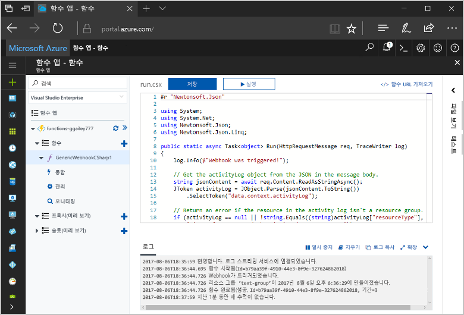
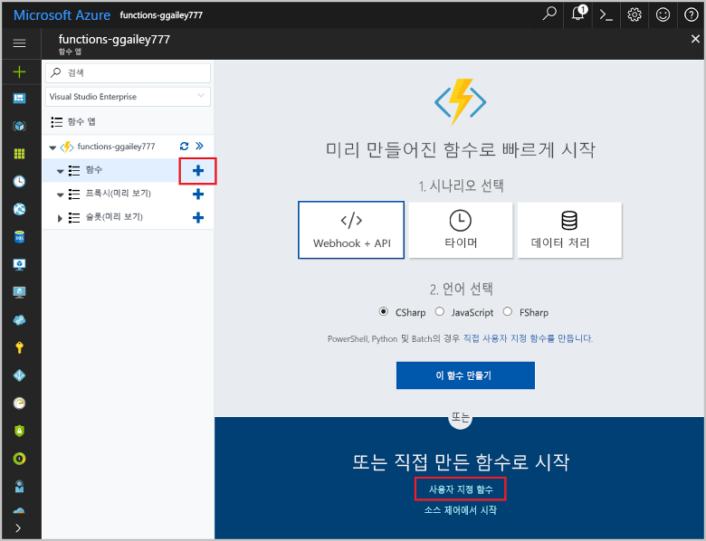
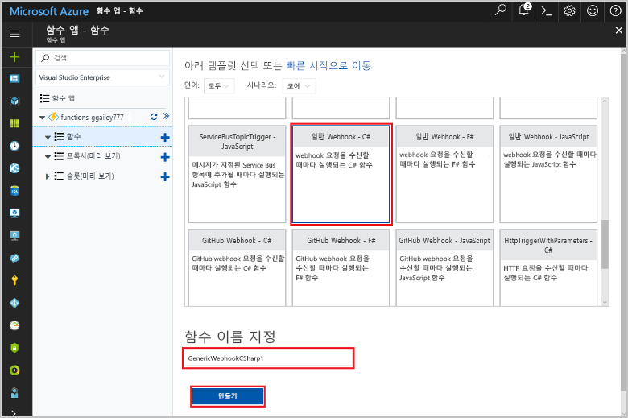
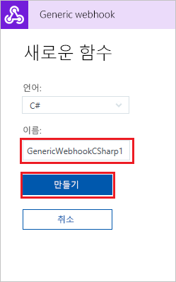
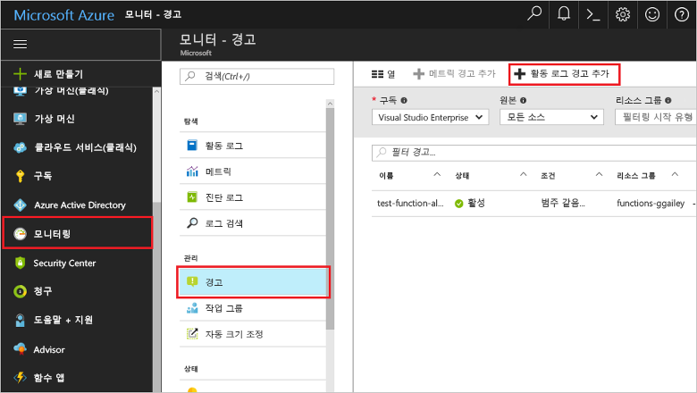
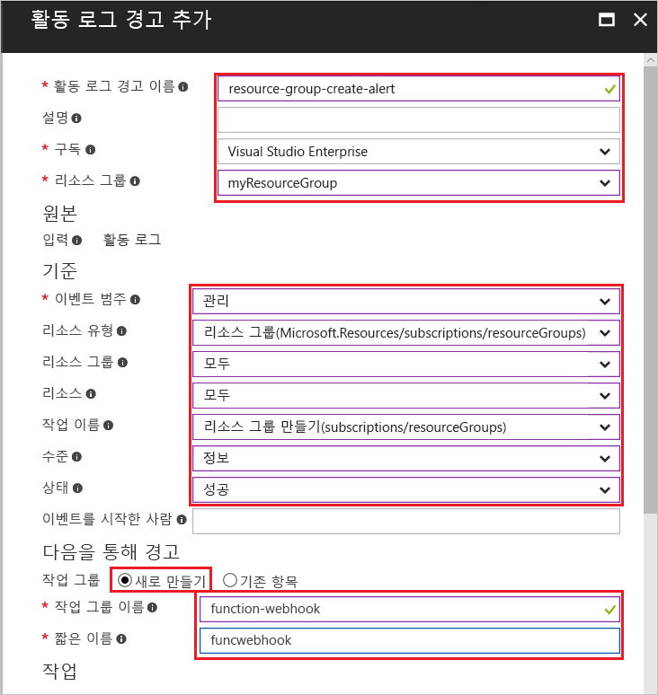
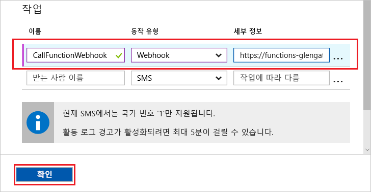
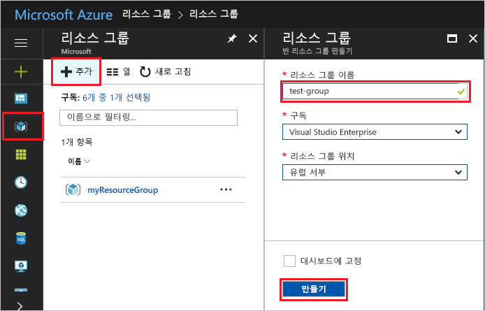
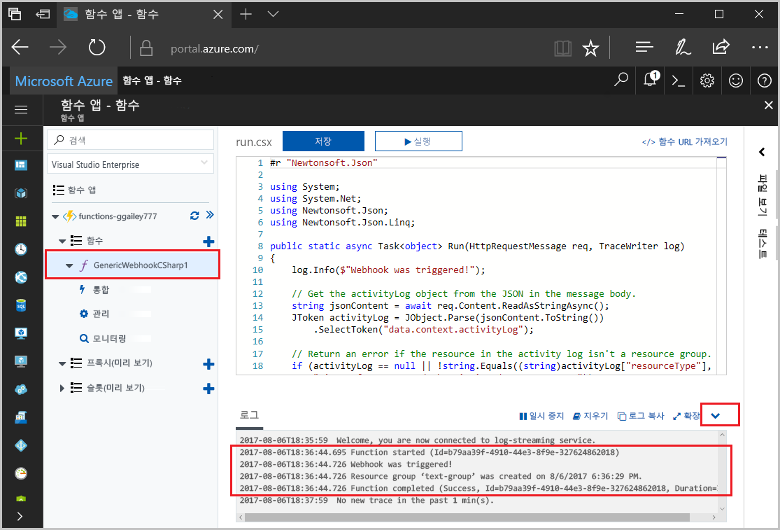

# <a name="create-a-function-triggered-by-a-generic-webhook"></a>제네릭 웹후크를 통해 트리거되는 함수 만들기

Azure Functions를 사용하면 먼저 VM을 만들거나 웹 응용 프로그램을 게시하지 않고도 서버를 사용하지 않는 환경에서 코드를 실행할 수 있습니다. 예를 들어 Azure Monitor에서 발생된 경고에 의해 트리거되도록 함수를 구성할 수 있습니다. 이 항목에서는 리소스 그룹이 구독에 추가될 때 C# 코드를 실행하는 방법을 보여 줍니다.   



## <a name="prerequisites"></a>필수 조건 

이 자습서를 완료하려면 다음이 필요합니다.

+ Azure 구독이 아직 없는 경우 시작하기 전에 [무료 계정](https://azure.microsoft.com/free/?WT.mc_id=A261C142F)을 만듭니다.

## <a name="create-an-azure-function-app"></a>Azure Function 앱 만들기

[!INCLUDE [Create function app Azure portal](../../includes/functions-create-function-app-portal.md)]

다음으로 새 함수 앱에서 함수를 만듭니다.

## <a name="create-function"></a>제네릭 웹후크를 통해 트리거되는 함수 만들기

1. 함수 앱을 확장한 후 **함수** 옆의 **+** 단추를 클릭합니다. 이 함수가 함수 앱의 첫 번째 함수이면 **사용자 지정 함수**를 선택합니다. 그러면 함수 템플릿의 전체 집합이 표시됩니다.

    

2. 검색 필드에 `generic`을 입력한 다음 일반 웹후크 트리거 템플릿에 사용할 언어를 선택합니다. 이 항목에서는 C# 함수를 사용합니다.

     

2. 함수의 **이름**을 입력한 다음 **만들기**를 선택합니다. 

      

2. 새 함수에서 **</> 함수 URL 가져오기**를 클릭한 다음 값을 복사하여 저장합니다. 이 값을 사용하여 웹후크를 구성합니다. 

    
         
다음으로 Azure Monitor의 활동 로그 경고에서 웹후크 끝점을 만듭니다. 

## <a name="create-an-activity-log-alert"></a>활동 로그 경고 만들기

1. Azure Portal에서 **모니터** 서비스로 이동하고 **경고**를 선택한 후 **활동 로그 경고 추가**를 클릭합니다.   

    

2. 표에 지정된 대로 설정을 사용합니다.

    

    | 설정      |  제안 값   | 설명                              |
    | ------------ |  ------- | -------------------------------------------------- |
    | **활동 로그 경고 이름** | resource-group-create-alert | 활동 로그 경고의 이름입니다. |
    | **구독** | 사용자의 구독 | 이 자습서를 위해 사용 중인 구독입니다. | 
    |  **리소스 그룹** | myResourceGroup | 경고 리소스가 배포되는 리소스 그룹입니다. 함수 앱과 동일한 리소스 그룹을 사용하면 자습서를 완료한 후 보다 쉽게 정리할 수 있습니다. |
    | **이벤트 범주** | 관리 | 이 범주에는 Azure 리소스에 대한 변경 내용이 포함됩니다.  |
    | **리소스 종류** | 리소스 그룹 | 경고를 리소스 그룹 활동으로 필터링합니다. |
    | **리소스 그룹**<br/>및 **리소스** | 모두 | 모든 리소스를 모니터링합니다. |
    | **작업 이름** | 리소스 그룹 만들기 | 경고를 만들기 작업으로 필터링합니다. |
    | **Level** | 정보 제공 | 정보 수준 경고를 포함합니다. | 
    | **상태** | Succeeded | 경고를 성공적으로 완료한 작업으로 필터링합니다. |
    | **작업 그룹** | 새로 만들기 | 경고가 발생하는 경우 수행하는 작업을 정의하는 새 작업 그룹을 만듭니다. |
    | **작업 그룹 이름** | function-webhook | 작업 그룹을 식별하는 이름입니다.  | 
    | **짧은 이름** | funcwebhook | 작업 그룹에 대한 짧은 이름입니다. |  

3. **작업**에서 표에 지정된 설정을 사용하여 작업을 추가합니다. 

    

    | 설정      |  제안 값   | 설명                              |
    | ------------ |  ------- | -------------------------------------------------- |
    | **Name** | CallFunctionWebhook | 작업의 이름입니다. |
    | **작업 유형** | 웹후크 | 경고에 대한 응답은 웹후크 URL이 호출되는 것입니다. |
    | **세부 정보** | 함수 URL | 앞에서 복사한 함수의 웹후크 URL에 붙여 넣습니다. |v

4. **확인**을 클릭하여 경고 및 작업 그룹을 만듭니다.  

이제 구독에서 리소스 그룹을 만들 때 웹후크가 호출됩니다. 다음으로, 요청 본문의 JSON 로그 데이터를 처리하도록 함수의 코드를 업데이트합니다.   

## <a name="update-the-function-code"></a>함수 코드 업데이트

1. 포털의 함수 앱으로 돌아간 후 함수를 확장합니다. 

2. 포털에서 함수의 C# 스크립트 코드를 다음 코드로 바꿉니다.

    ```csharp
    #r "Newtonsoft.Json"
    
    using System;
    using System.Net;
    using Newtonsoft.Json;
    using Newtonsoft.Json.Linq;
    
    public static async Task<object> Run(HttpRequestMessage req, TraceWriter log)
    {
        log.Info($"Webhook was triggered!");
    
        // Get the activityLog object from the JSON in the message body.
        string jsonContent = await req.Content.ReadAsStringAsync();
        JToken activityLog = JObject.Parse(jsonContent.ToString())
            .SelectToken("data.context.activityLog");
    
        // Return an error if the resource in the activity log isn't a resource group. 
        if (activityLog == null || !string.Equals((string)activityLog["resourceType"], 
            "Microsoft.Resources/subscriptions/resourcegroups"))
        {
            log.Error("An error occurred");
            return req.CreateResponse(HttpStatusCode.BadRequest, new
            {
                error = "Unexpected message payload or wrong alert received."
            });
        }
    
        // Write information about the created resource group to the streaming log.
        log.Info(string.Format("Resource group '{0}' was {1} on {2}.",
            (string)activityLog["resourceGroupName"],
            ((string)activityLog["subStatus"]).ToLower(), 
            (DateTime)activityLog["submissionTimestamp"]));
    
        return req.CreateResponse(HttpStatusCode.OK);    
    }
    ```

이제 구독에 새 리소스 그룹을 만들어 함수를 테스트할 수 있습니다.

## <a name="test-the-function"></a>함수 테스트

1. Azure Portal 왼쪽에 있는 리소스 그룹 아이콘을 클릭하고 **+추가**를 선택한 후 **리소스 그룹 이름**을 입력하고 **만들기**를 선택하여 빈 리소스 그룹을 만듭니다.
    
    

2. 함수도 돌아가서 **로그** 창을 확장합니다. 리소스 그룹이 만들어지면 활동 로그 경고가 웹후크를 트리거하고 함수가 실행됩니다. 로그에 기록된 새 리소스 그룹의 이름이 표시됩니다.  

    

3. (선택 사항) 뒤로 돌아가 만든 리소스 그룹을 삭제합니다. 이 활동은 함수를 트리거하지 않습니다. 삭제 작업이 경고에 의해 필터링되기 때문입니다. 

## <a name="clean-up-resources"></a>리소스 정리

[!INCLUDE [Next steps note](../../includes/functions-quickstart-cleanup.md)]

## <a name="next-steps"></a>다음 단계

제네릭 웹후크에서 요청을 수신할 때 실행되는 함수를 만들었습니다. 

[!INCLUDE [Next steps note](../../includes/functions-quickstart-next-steps.md)]

웹후크 트리거에 대한 자세한 내용은 [Azure Functions HTTP 및 웹후크 바인딩](functions-bindings-http-webhook.md)을 참조하세요. C#으로 함수를 개발하는 방법에 대한 자세한 내용은 [Azure Functions C# 스크립트 개발자 참조](functions-reference-csharp.md)를 참조하세요.

