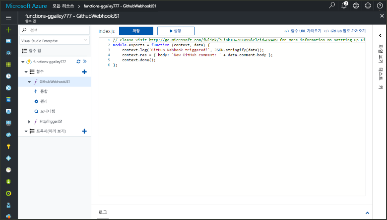
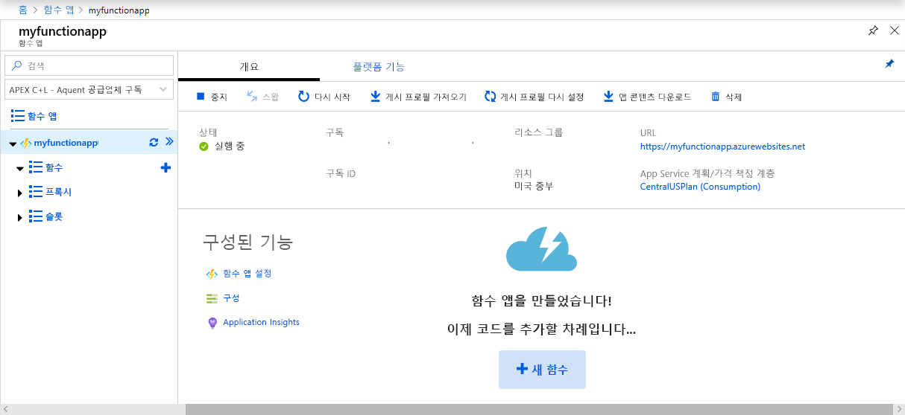
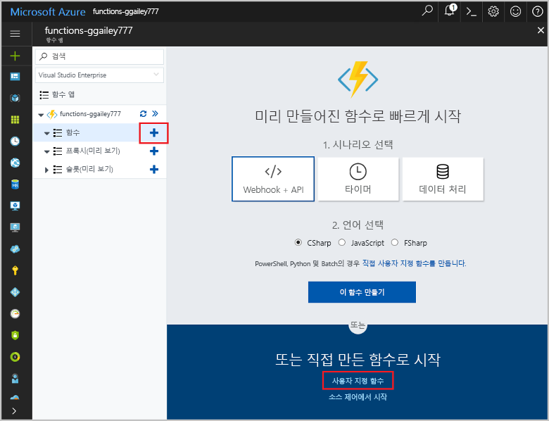
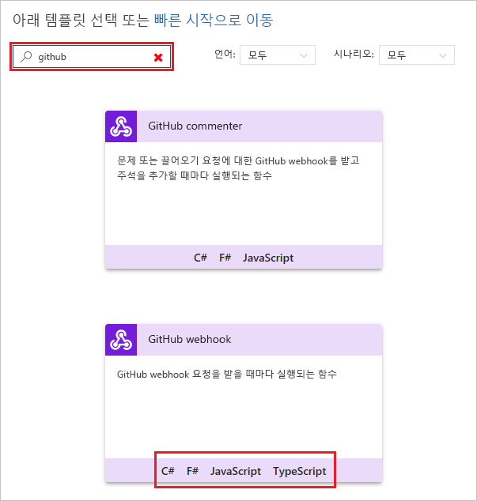
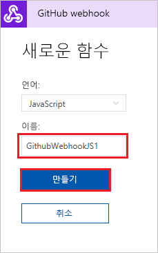
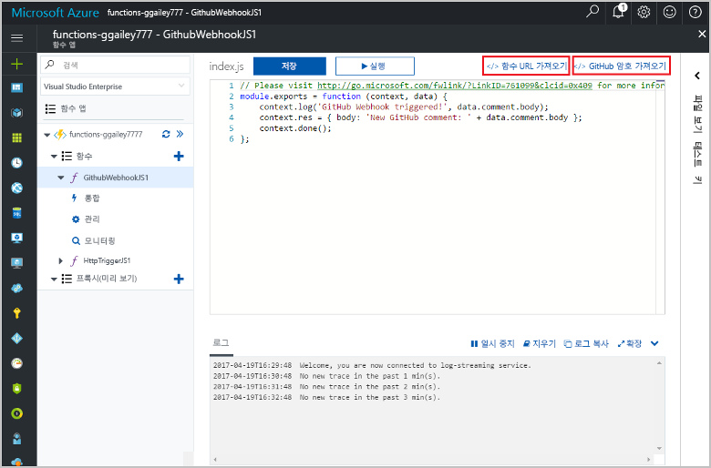
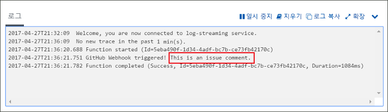

# GitHub webhook를 통해 트리거되는 함수 만들기

GitHub별 페이로드와 함께 HTTP 웹후크 요청에 의해 트리거되는 함수를 만드는 방법을 알아봅니다.

## 필수 조건

+ 하나 이상의 프로젝트와 함께 GitHub 계정.
+ Azure 구독. 구독이 없으면 시작하기 전에 [계정](https://azure.microsoft.com/free/?WT.mc_id=A261C142F)을 만드세요.

## Azure Function 앱 만들기

[!INCLUDE [Create function app Azure portal](../../includes/functions-create-function-app-portal.md)]

다음으로 새 함수 앱에서 함수를 만듭니다.

## GitHub 웹후크 트리거 함수 만들기

1. 함수 앱을 확장한 후 **함수** 옆의 **+** 단추를 클릭합니다. 함수 앱에서 첫 번째 함수이면 **사용자 지정 함수**를 선택합니다. 그러면 함수 템플릿의 전체 집합이 표시됩니다.

    

2. 검색 필드에 `github`를 입력한 다음 GitHub 웹후크 트리거 템플릿에 사용할 언어를 선택합니다. 

      

2. 함수의 **이름**을 입력한 다음 **만들기**를 선택합니다. 

      

3. 새 함수에서 **</> 함수 URL 가져오기**를 클릭한 다음 값을 복사하여 저장합니다. **</> GitHub 비밀 가져오기**에 대해 같은 작업을 수행합니다. 이러한 값은 GitHub에서 webhook를 구성할 때 사용됩니다.

    

다음으로 GitHub 리포지토리에 webhook를 만듭니다.

## 웹후크 구성

1. GitHub에서 소유한 리포지토리로 이동합니다. 분기된 모든 리포지토리를 사용할 수도 있습니다. 리포지토리를 분기해야 하는 경우 <https://github.com/Azure-Samples/functions-quickstart>를 사용합니다.

2. **설정** > **옵션**을 선택하고 **기능** 아래에서 **문제**를 사용하도록 설정합니다.

   

1. **설정**에서 **웹후크** > **웹후크 추가**를 선택합니다.

    

1. 다음 표에 지정된 것처럼 설정을 사용한 다음, **웹후크 추가**를 클릭합니다.

    

| 설정 | 제안 값 | 설명 |
|---|---|---|
| **페이로드 URL** | 복사된 값 | **</> 함수 URL 가져오기**에서 반환된 값을 사용합니다. |
| **콘텐츠 형식** | application/json | 함수에는 JSON 페이로드가 필요합니다. |
| **비밀**   | 복사된 값 | **</> GitHub 비밀 가져오기**에서 반환된 값을 사용합니다. |
| 이벤트 트리거 | 개별 이벤트를 선택하겠습니다. | 문제 주석 이벤트만 트리거하려고 합니다.  |
| | 문제 주석 |  |

이제 새로운 문제 주석이 추가되면 함수를 트리거하도록 webhook가 구성되었습니다.

## 함수 테스트

1. GitHub 리포지토리에서 **문제** 탭을 새 브라우저 창에서 엽니다.

1. 새 창에서 **새 문제**를 클릭하고 제목을 입력한 다음 **새 문제 제출**을 클릭합니다.

1. 문제에 주석을 입력하고 **주석**을 클릭합니다.

    

1. 포털로 돌아가 로그를 확인합니다. 새 주석 텍스트와 함께 추적 항목이 표시됩니다.

     

## 리소스 정리

[!INCLUDE [Next steps note](../../includes/functions-quickstart-cleanup.md)]

## 다음 단계

GitHub 웹후크에서 요청을 수신할 때 트리거되는 함수를 만들었습니다.

[!INCLUDE [Next steps note](../../includes/functions-quickstart-next-steps.md)]

웹후크 트리거에 대한 자세한 내용은 [Azure Functions HTTP 및 웹후크 바인딩](functions-bindings-http-webhook.md)을 참조하세요.
