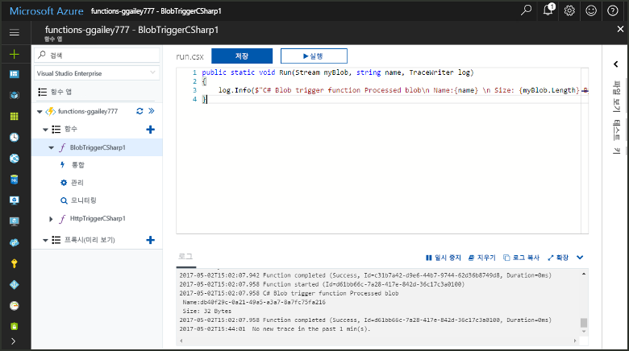
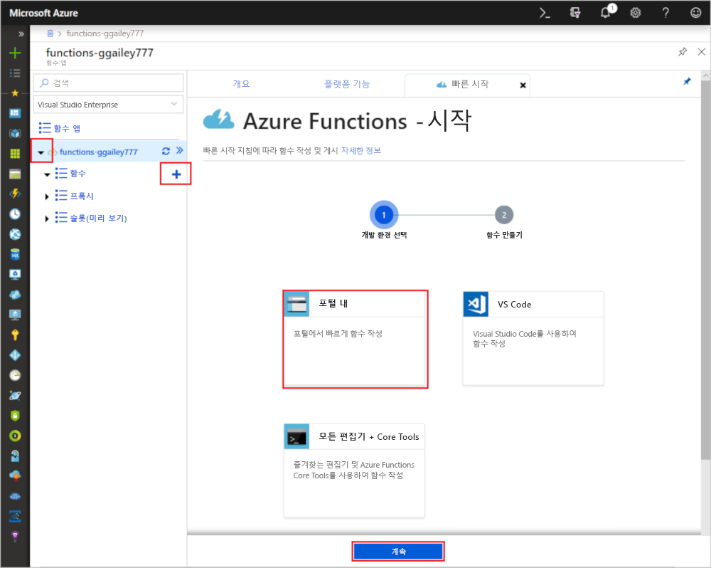
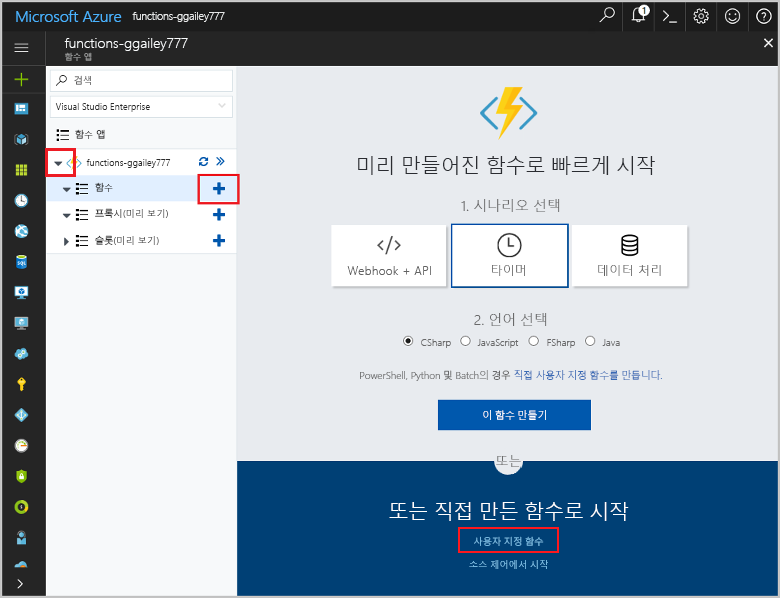
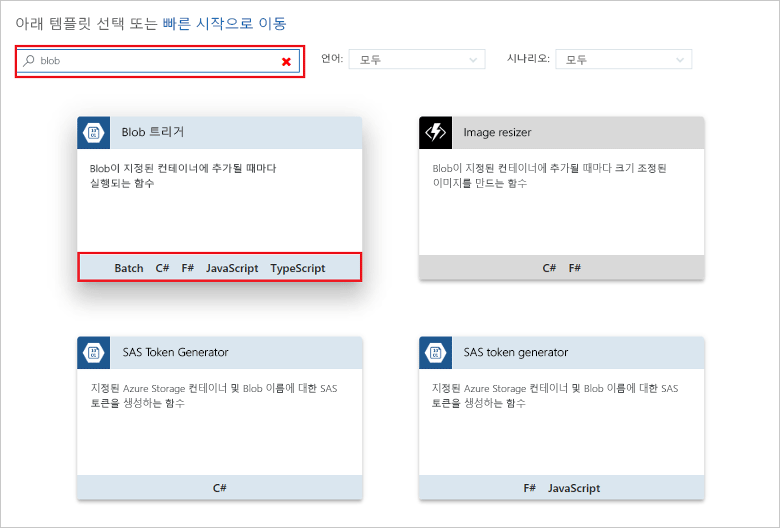
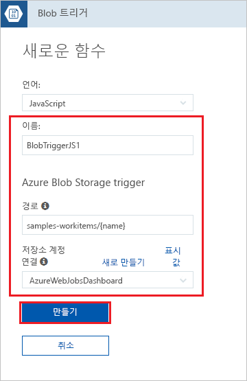
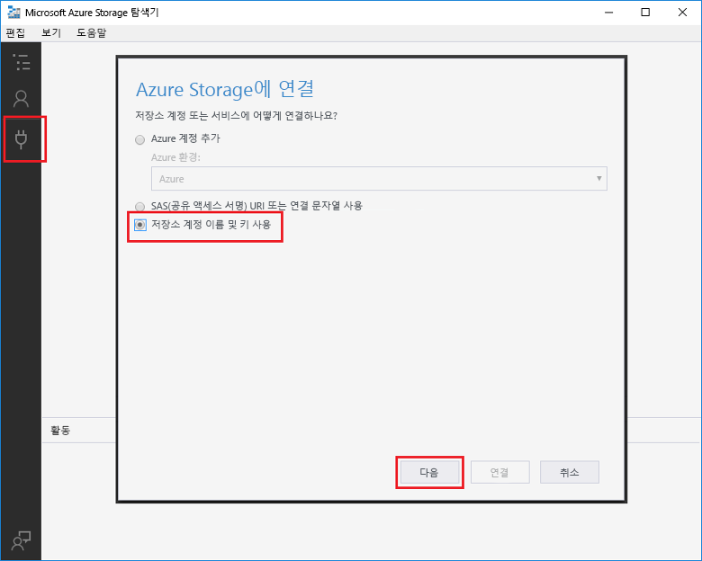
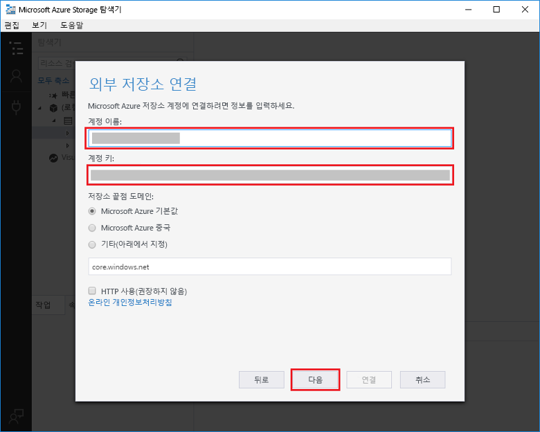
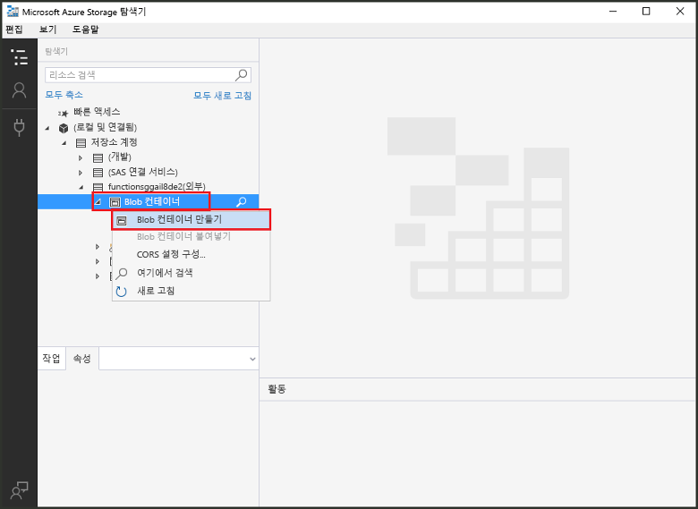
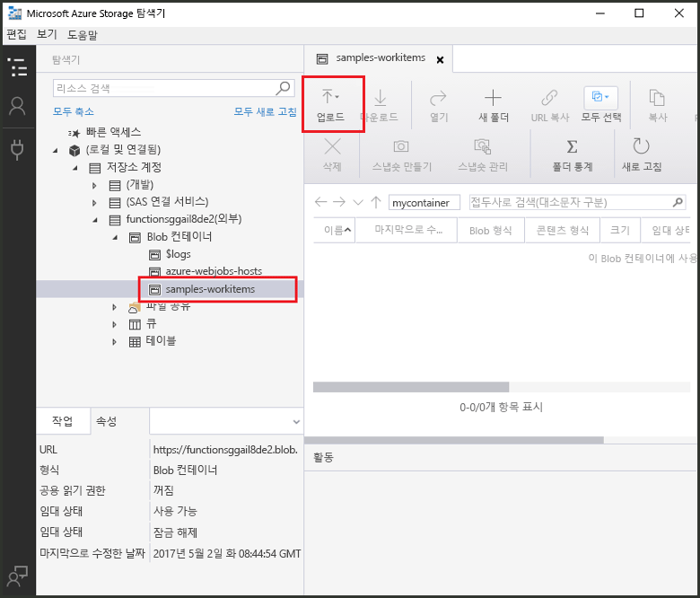
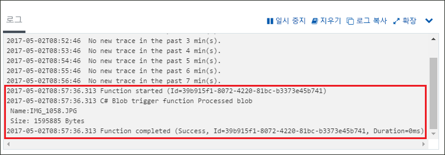

# Azure Blob Storage에 의해 트리거되는 함수 만들기

파일이 업로드되거나 Azure Blob Storage에서 업데이트될 때 트리거되는 함수를 만드는 방법을 알아봅니다.

## 필수 조건

+ [Microsoft Azure Storage 탐색기](http://storageexplorer.com/)를 다운로드하고 설치합니다.
+ Azure 구독. 구독이 없으면 시작하기 전에 [계정](https://azure.microsoft.com/free/?WT.mc_id=A261C142F)을 만드세요.

## Azure Function 앱 만들기

[!INCLUDE [Create function app Azure portal](../../includes/functions-create-function-app-portal.md)]

다음으로 새 함수 앱에서 함수를 만듭니다.

## Blob Storage 트리거 함수 만들기

1. 함수 앱을 확장한 후 **함수** 옆의 **+** 단추를 클릭합니다. 함수 앱의 첫 번째 함수인 경우 **포털 내**를 선택한 다음, **계속**을 선택합니다. 그렇지 않으면 3단계로 이동합니다.

   

1. **추가 템플릿**, **템플릿 마침 및 보기**를 차례로 선택합니다.

    

1. 검색 필드에서 `blob`을 입력한 다음, **Blob 트리거** 템플릿을 선택합니다.

1. 메시지가 표시되면 **설치**를 선택하여 함수 앱에 Azure Storage 확장과 모든 종속성을 설치합니다. 설치가 완료되면 **계속**을 선택합니다.

    

1. 이미지 아래의 표에 지정된 설정을 사용합니다.

    

    | 설정 | 제안 값 | 설명 |
    |---|---|---|
    | **Name** | 함수 앱에서 고유 | 이 Blob 트리거 함수의 이름입니다. |
    | **Path**   | samples-workitems/{name}    | 모니터링되는 Blob Storage의 위치입니다. 바인딩에 _name_ 매개 변수로 전달되는 Blob의 파일 이름입니다.  |
    | **Storage 계정 연결** | AzureWebJobsStorage | 함수 앱에 이미 사용된 저장소 계정 연결을 사용하거나 새로 만들 수 있습니다.  |

1. **만들기**를 클릭하여 사용자의 함수를 만듭니다.

다음으로 Azure Storage 계정에 연결하고 **samples-workitems** 컨테이너를 만듭니다.

## 컨테이너 만들기

1. 함수에서 **통합**을 클릭하고 **설명서**를 확장하여 **계정 이름** 및 **계정 키**를 모두 복사합니다. 이러한 자격 증명을 사용하여 저장소 계정에 연결합니다. 저장소 계정에 이미 연결된 경우 4단계로 건너뜁니다.

    

1. [Microsoft Azure Storage 탐색기](http://storageexplorer.com/) 도구를 실행하고 왼쪽의 연결 아이콘을 클릭하고 **저장소 계정 이름 및 키 사용**을 선택하고 **다음**을 클릭합니다.

    

1. 1단계에서 **계정 이름** 및 **계정 키**를 입력하고 **다음**을 클릭한 후 **연결**을 클릭합니다. 

    

1. 연결된 저장소 계정을 확장하고 **Blob 컨테이너**를 마우스 오른쪽 단추로 클릭하고 **Blob 컨테이너 만들기**를 클릭하고 `samples-workitems`를 입력한 후 Enter 키를 누릅니다.

    

이제 Blob 컨테이너가 있고 컨테이너에 파일을 업로드하여 함수를 테스트할 수 있습니다.

## 함수 테스트

1. Azure Portal로 돌아가서 함수를 찾은 후 페이지 맨 아래에 있는 **로그**를 확장하고 로그 스트리밍이 일시 중지되지 않았는지 확인합니다.

1. Storage 탐색기에서 저장소 계정, **Blob 컨테이너** 및 **samples-workitems**를 확장합니다. **업로드**를 클릭한 후 **파일 업로드...** 를 클릭합니다.

    

1. **파일 업로드** 대화 상자에서 **파일** 필드를 클릭합니다. 로컬 컴퓨터에서 이미지 파일과 같은 파일을 찾아 선택하고 **열기** 및 **업로드**를 차례로 클릭합니다.

1. 함수 로그로 돌아가 Blob를 읽었는지 확인합니다.

   

    >[!NOTE]
    > 함수 앱이 기본 소비 계획에서 실행될 때 추가 또는 업데이트되는 Blob과 트리거되는 함수 사이에 최대 몇 분의 지연이 있을 수 있습니다. Blob 트리거 함수에서 대기 시간을 줄여야 하는 경우 App Service 계획에서 함수 앱을 실행하는 것이 좋습니다.

## 리소스 정리

[!INCLUDE [Next steps note](../../includes/functions-quickstart-cleanup.md)]

## 다음 단계

Blob Storage에서 Blob이 추가 또는 업데이트될 때 실행되는 함수를 만들었습니다. 

[!INCLUDE [Next steps note](../../includes/functions-quickstart-next-steps.md)]

Blob Storage 트리거에 대한 자세한 내용은 [Azure Functions Blob Storage 바인딩](functions-bindings-storage-blob.md)을 참조하세요.
