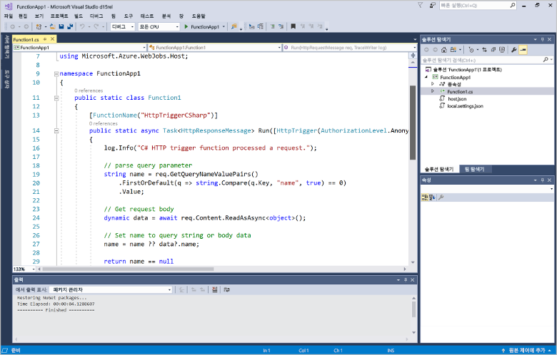
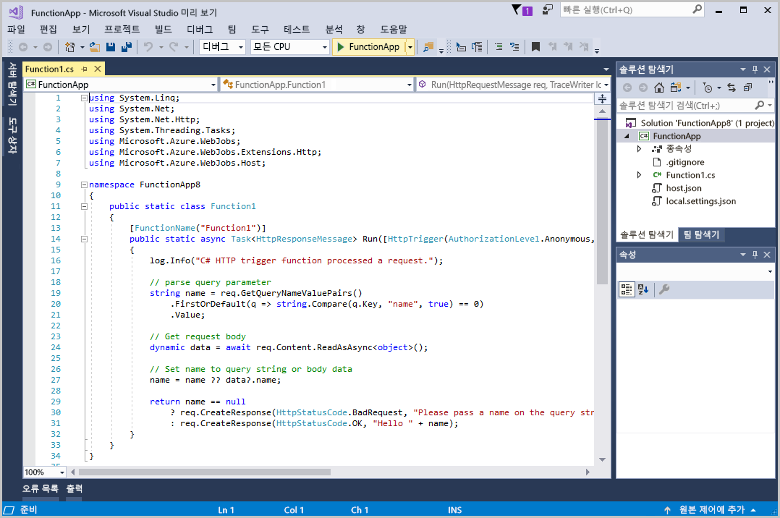
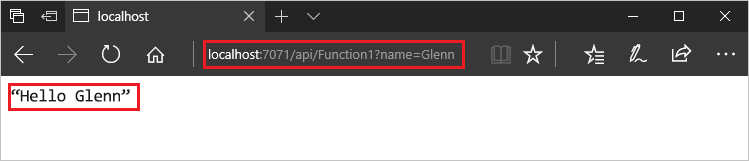
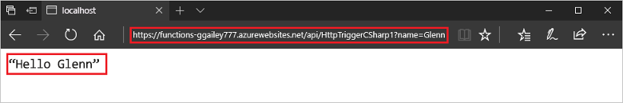

# Visual Studio를 사용하여 첫 번째 함수 만들기

Azure Functions를 사용하면 먼저 VM을 만들거나 웹 응용 프로그램을 게시하지 않고도 [서버를 사용하지 않는](https://azure.microsoft.com/overview/serverless-computing/) 환경에서 코드를 실행할 수 있습니다.

이 문서에서는 Visual Studio 2017 tools for Azure Functions를 사용하여 로컬로 "hello world" 함수를 만들고 테스트하는 방법에 대해 알아봅니다. 그런 후 함수 코드를 Azure에 게시합니다. 이러한 도구는 Visual Studio 2017에서 Azure 개발 워크로드의 일부로 제공됩니다.

이 항목에는 동일한 기본 단계를 보여주는 [비디오](#watch-the-video)가 포함되어 있습니다.

## 필수 조건

이 자습서를 완료하려면 다음이 필요합니다.

* **Azure 개발** 워크로드를 포함하여 [Visual Studio 2017 버전 15.5](https://www.visualstudio.com/vs/) 이상을 설치합니다.

    

    Visual Studio를 이미 설치한 경우 모든 보류 중인 업데이트를 설치했는지 확인합니다. 

* Visual Studio 2017 버전 15.4 이하를 사용해 Azure 개발 워크로드를 설치한 경우 [Azure Functions 도구 업데이트](functions-develop-vs.md#check-your-tools-version)가 필요할 수도 있습니다. 

## 함수 앱 프로젝트 만들기

[!INCLUDE [Create a project using the Azure Functions template](../../includes/functions-vstools-create.md)]

Visual Studio는 프로젝트를 만들고 그 안에는 선택한 함수 형식에 대한 상용구 코드를 포함하는 클래스를 만듭니다. 메서드의 **FunctionName** 특성은 함수 이름을 설정합니다. **HttpTrigger** 특성은 함수가 HTTP 요청에 의해 트리거되도록 지정합니다. 상용구 코드는 요청 본문 또는 쿼리 문자열의 값을 포함하는 HTTP 응답을 보냅니다. 메서드에 적절한 특성을 적용하여 입력 및 출력 바인딩을 함수에 추가할 수 있습니다. 자세한 내용은 [Azure Functions C# 개발자 참조](functions-dotnet-class-library.md)의 [트리거 및 바인딩](functions-dotnet-class-library.md#triggers-and-bindings) 섹션을 참조하세요.

함수 프로젝트 및 HTTP로 트리거되는 함수를 만들었으니, 로컬 컴퓨터에서 이 함수를 테스트할 수 있습니다.

## 로컬에서 함수 테스트

Azure Functions Core Tools를 사용하면 로컬 개발 컴퓨터에서 Azure Functions 프로젝트를 실행할 수 있습니다. Visual Studio에서 처음으로 함수를 시작할 때 이 도구를 설치하도록 요구하는 메시지가 표시됩니다.  

1. 함수를 테스트하려면 F5 키를 누릅니다. 메시지가 표시되면 Visual Studio에서 Azure Functions Core(CLI) 도구를 다운로드하여 설치하도록 요구하는 요청을 수락합니다. 또한 도구에서 HTTP 요청을 처리할 수 있도록 방화벽 예외를 사용하도록 설정해야 합니다.

2. Azure Functions 런타임 출력에서 함수의 URL을 복사합니다.  

    

3. HTTP 요청에 대한 URL을 브라우저의 주소 표시줄에 붙여 넣습니다. 이 URL에 쿼리 문자열 `?name=<yourname>`을 추가하고 요청을 실행합니다. 다음은 함수에서 반환된 로컬 GET 요청에 대한 브라우저의 응답을 보여 줍니다. 

    

4. 디버깅을 중지하려면 Shift+F5를 누릅니다.

함수가 로컬 컴퓨터에서 제대로 실행되는지 확인한 후에 해당 프로젝트를 Azure에 게시해야 합니다.

## Azure에 프로젝트 게시

Azure 구독이 아직 없는 경우 계속 진행하려면 [무료 계정](https://azure.microsoft.com/free/?ref=microsoft.com&utm_source=microsoft.com&utm_medium=docs&utm_campaign=visualstudio)을 만들어야 합니다.

프로젝트를 게시하려면 먼저 Azure 구독에 함수 앱이 있어야 합니다. Visual Studio에서 바로 구독에 함수 앱을 만들 수 있습니다.

[!INCLUDE [Publish the project to Azure](../../includes/functions-vstools-publish.md)]

## Azure에서 함수 테스트

1. 게시 프로필 페이지에서 함수 앱의 기준 URL을 복사합니다. 로컬에서 함수를 테스트할 때 사용한 URL의 `localhost:port` 부분을 새 기준 URL로 바꿉니다. 이전처럼 이 URL에 `?name=<yourname>` 쿼리 문자열을 추가하고 요청을 실행합니다.

    HTTP로 트리거되는 함수를 호출하는 URL은 다음 형식이어야 합니다.

        http://<functionappname>.azurewebsites.net/api/<functionname>?name=<yourname> 

2. HTTP 요청에 대한 이러한 새 URL을 브라우저의 주소 표시줄에 붙여넣습니다. 다음은 함수에서 반환된 원격 GET 요청에 대한 브라우저의 응답을 보여 줍니다. 

    

## 비디오 보기

> [!VIDEO https://www.youtube-nocookie.com/embed/DrhG-Rdm80k]

## 다음 단계

Visual Studio를 사용하여 간단하고 HTTP에서 트리거한 함수가 있는 C# 함수 앱을 만들고 게시했습니다. 

+ 다른 종류의 트리거 및 바인딩을 지원하도록 프로젝트를 구성하는 방법은 [Visual Studio용 Azure Functions 도구](functions-develop-vs.md#configure-the-project-for-local-development)의 [로컬 개발에 대한 프로젝트 구성](functions-develop-vs.md) 섹션을 참조하세요.
+ Azure Functions Core 도구를 사용하여 로컬에서 테스트하고 디버그하는 방법에 대한 자세한 내용은 [Azure Functions를 로컬로 코딩 및 테스트하는 방법](functions-run-local.md)을 참조하세요. 
+ .NET 클래스 라이브러리로 기능을 개발하는 방법에 대해 자세히 알아보려면 [Azure Functions에서 .NET 클래스 라이브러리 사용](functions-dotnet-class-library.md)을 참조하세요. 

