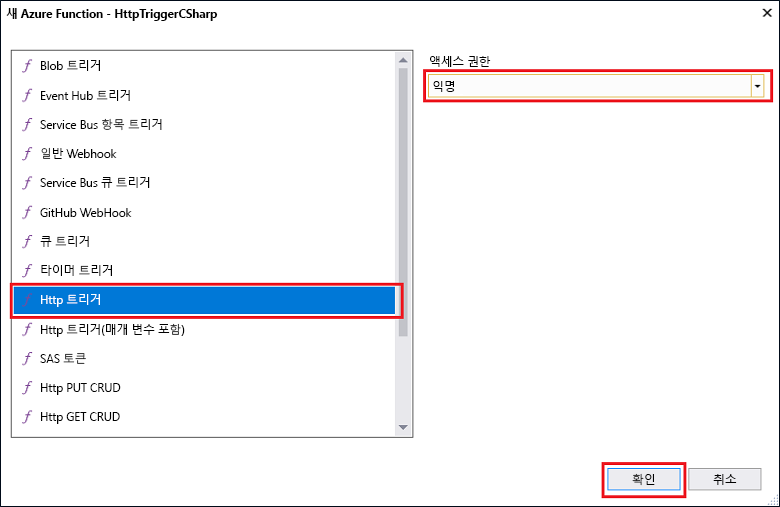

# Visual Studio를 사용하여 첫 번째 함수 만들기
 

Azure Functions를 사용하면 먼저 VM을 만들거나 웹 응용 프로그램을 게시하지 않고도 서버를 사용하지 않는 환경에서 코드를 실행할 수 있습니다. 

이 항목에서는 Azure Function Tools for Visual Studio 2017을 사용하여 로컬에서 "hello world" 함수를 만들고 테스트하는 방법에 대해 알아봅니다. 그런 다음 함수 코드를 Azure에 게시합니다.

## 필수 조건

이 자습서를 완료하려면 다음을 설치합니다.

* [Visual Studio 2017 미리 보기 버전 15.3](https://www.visualstudio.com/vs/preview/)(**Azure 개발** 워크로드 포함)
    
    

[!INCLUDE [quickstarts-free-trial-note](../../includes/quickstarts-free-trial-note.md)]

## Azure Functions Tools for Visual Studio 2017 설치

시작하기 전에 먼저 Azure Functions Tools for Visual Studio 2017을 다운로드하여 설치해야 합니다. 이 도구는 Visual Studio 2017 미리 보기 버전 15.3 이상 버전에서만 사용할 수 있습니다. Azure Functions Tools를 이미 설치한 경우 이 섹션을 건너뛸 수 있습니다.

[!INCLUDE [Install the Azure Functions Tools for Visual Studio](../../includes/functions-install-vstools.md)]   

## Visual Studio에서 Azure Functions 프로젝트 만들기

[!INCLUDE [Create a project using the Azure Functions template](../../includes/functions-vstools-create.md)]

이제 프로젝트를 만들었으므로 첫 번째 함수를 만들 수 있습니다.

## 함수 만들기

**솔루션 탐색기**에서 프로젝트 노드를 마우스 오른쪽 단추로 클릭하고 **추가** > **새 항목**을 차례로 선택합니다. **Azure 함수**를 선택하고 **추가**를 클릭합니다.

**HttpTrigger**를 선택하고, **함수 이름**을 입력하고, **익명**에 대한 **액세스 권한**을 선택하고, **만들기**를 클릭합니다. 만든 함수는 모든 클라이언트의 HTTP 요청으로 액세스됩니다. 

이제 HTTP에서 트리거한 함수를 만들었으므로 로컬 컴퓨터에서 해당 함수를 테스트할 수 있습니다.

## 로컬에서 함수 테스트

[!INCLUDE [Test the function locally](../../includes/functions-vstools-test.md)]

Azure Functions 런타임 출력에서 함수의 URL을 복사합니다.  

 HTTP 요청에 대한 URL을 브라우저의 주소 표시줄에 붙여 넣습니다. 이 URL에 쿼리 문자열 `&name=<yourname>`을 추가하고 요청을 실행합니다. 다음은 함수에서 반환된 로컬 GET 요청에 대한 브라우저의 응답을 보여 줍니다. 

디버깅을 중지하려면 Visual Studio 도구 모음에서 **중지** 단추를 클릭합니다.

함수가 로컬 컴퓨터에서 제대로 실행되는지 확인한 후에 해당 프로젝트를 Azure에 게시해야 합니다.

## Azure에 프로젝트 게시

프로젝트를 게시하려면 먼저 Azure 구독에 함수 앱이 있어야 합니다. Visual Studio에서 직접 함수 앱을 만들 수 있습니다.

[!INCLUDE [Publish the project to Azure](../../includes/functions-vstools-publish.md)]

## Azure에서 함수 테스트

게시 프로필 페이지에서 함수 앱의 기준 URL을 복사합니다. 로컬에서 함수를 테스트할 때 사용한 URL의 `localhost:port` 부분을 새 기준 URL로 바꿉니다. 이전처럼 이 URL에 `&name=<yourname>` 쿼리 문자열을 추가하고 요청을 실행합니다.

HTTP에서 트리거한 함수를 호출하는 URL은 다음과 같습니다.

    http://<functionappname>.azurewebsites.net/api/<functionname>?name=<yourname> 

HTTP 요청에 대한 이러한 새 URL을 브라우저의 주소 표시줄에 붙여넣습니다. 다음은 함수에서 반환된 원격 GET 요청에 대한 브라우저의 응답을 보여 줍니다. 

 
## 다음 단계

Visual Studio를 사용하여 간단하고 HTTP에서 트리거한 함수가 있는 C# 함수 앱을 만들었습니다. 

[!INCLUDE [functions-quickstart-next-steps](../../includes/functions-quickstart-next-steps.md)]

Azure Functions Core 도구를 사용하여 로컬에서 테스트하고 디버그하는 방법에 대한 자세한 내용은 [Azure Functions를 로컬로 코딩 및 테스트하는 방법](functions-run-local.md)을 참조하세요. 

