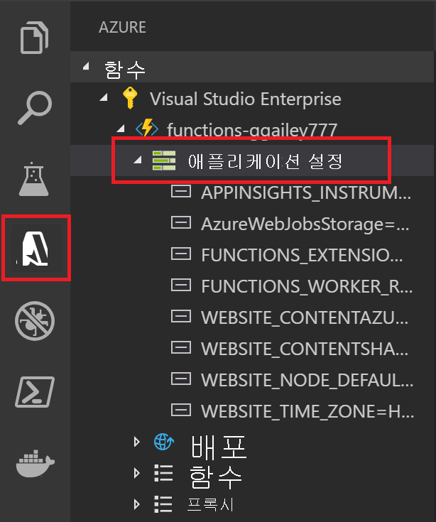

# <a name="develop-azure-functions-using-visual-studio-code"></a>Visual Studio Code를 사용 하 여 Azure Functions를 개발

합니다 [Visual Studio Code용 Azure Functions 확장] 로컬로 개발 하 고 Azure에 함수를 배포할 수 있습니다. Azure Functions를 처음으로 접하는 경우라면 [Azure Functions 소개](functions-overview.md)에서 자세한 내용을 확인할 수 있습니다.

Azure Functions 확장에는 다음과 같은 이점을 제공합니다. 

* 로컬 개발 컴퓨터에서 함수를 편집, 빌드 및 실행합니다. 
* Azure에 직접 Azure Functions 프로젝트를 게시합니다. 
* Visual Studio Code의 이점을 모두를 포함 하는 동안 다양 한 언어로 함수를 작성 합니다. 

Azure Functions 버전 2.x 런타임에서 지 원하는 언어를 사용 하 여 확장을 사용할 수 있습니다. 

* [C#컴파일](functions-dotnet-class-library.md) 
* [C#스크립트](functions-reference-csharp.md)<sup>*</sup>
* [JavaScript](functions-reference-node.md)
* [Java](functions-reference-java.md)
* [PowerShell](functions-reference-powershell.md)
* [Python](functions-reference-python.md)

<sup>*</sup>해야 했는지 [설정 C# 스크립트를 기본 프로젝트 언어로](#c-script-projects)합니다.

이 문서의 예제에서는 현재에 사용할 JavaScript (Node.js) 및 C# 클래스 라이브러리 함수입니다.  

이 문서에서는 Azure Functions 확장을 사용 하 여 functions를 개발 하 여 Azure에 게시 하는 방법에 대 한 세부 정보를 제공 합니다. 이 문서를 읽기 전에 수행 해야 합니다 [Visual Studio Code를 사용 하 여 첫 번째 함수 만들기](functions-create-first-function-vs-code.md)합니다.

> [!IMPORTANT]
> 로컬 개발과 포털 개발을 동일한 함수 앱에 혼합하지 않도록 합니다. 로컬 프로젝트에서 함수 앱에 게시할 때 배포 프로세스는 포털에서 개발한 모든 기능을 덮어씁니다.

## <a name="prerequisites"></a>필수 조건

설치 및 실행 하기 전에 합니다 [Azure Functions 확장][visual studio code용 azure functions 확장], 다음 요구 사항을 충족 해야 합니다.

* [Visual Studio Code](https://code.visualstudio.com/) 중 하나에 설치 합니다 [지원 되는 플랫폼](https://code.visualstudio.com/docs/supporting/requirements#_platforms)합니다.

* 활성 Azure 구독.

[!INCLUDE [quickstarts-free-trial-note](../../includes/quickstarts-free-trial-note.md)]

구독에는 Azure Storage 계정과 같은 해야 하는 다른 리소스가 만들어지는 경우 있습니다 [Visual Studio Code를 사용 하 여 게시](#publish-to-azure)합니다.

> [!IMPORTANT]
> Functions를 로컬로 개발 하 고 시작 하 고 로컬로 실행 하 고 필요 없이 Azure에 게시할 수 있습니다. 로컬로 Azure Functions 핵심 도구의 자동 다운로드를 비롯 하 여 기능에 실행 하기 위한 추가 요구 사항이 있습니다. 자세한 내용은 참조 하세요 [로컬로 실행 하기 위한 요구 사항이](#additional-requirements-to-run-locally)합니다. 

[!INCLUDE [functions-install-vs-code-extension](../../includes/functions-install-vs-code-extension.md)]

## <a name="create-an-azure-functions-project"></a>Azure Functions 프로젝트 만들기

함수 확장을 통해 첫 번째 함수를 함께 함수 앱 프로젝트를 만들 수 있습니다. 다음 단계를 새 functions 프로젝트에서 HTTP 트리거 함수를 만드는 방법을 보여 줍니다. [HTTP 트리거](functions-bindings-http-webhook.md) 보여 주기 위해 가장 간단한 함수 트리거 템플릿입니다.

1. **Azure: Functions**에서 함수 만들기 아이콘을 선택합니다.

    

1. 함수 앱 프로젝트에 대 한 폴더를 선택 차례로 **함수 프로젝트에 대 한 언어 선택**합니다. 

1. 선택 된 **HTTP 트리거** 함수 템플릿을 선택할 수 있습니다 하 **지금은 건너뛰고** 함수를 사용 하지 않고 프로젝트를 만들려면. 언제 든 지 [함수를 프로젝트에 추가할](#add-a-function-to-your-project) 나중에 있습니다. 

    

1. 형식 `HTTPTrigger` 함수 이름에 Enter 키를 눌러 선택한 **함수** 권한 부여 합니다. 이 권한 수준을 제공 해야는 [function 키](functions-bindings-http-webhook.md#authorization-keys) 함수 끝점을 호출할 때.

    

    HTTP 트리거 함수에 대한 템플릿을 사용하여 선택한 언어로 함수가 만들어집니다.

    

프로젝트 템플릿을 선택한 언어로 프로젝트를 만들고, 필요한 종속성을 설치 합니다. 모든 언어에 대 한 새 프로젝트에는 다음 파일이 있습니다.

* **host.json**: Functions 호스트를 구성할 수 있습니다. 이러한 설정은 로컬 및 Azure에서 실행할 때 모두 적용됩니다. 자세한 내용은 [host.json 참조](functions-host-json.md)를 참조하세요.

* **local.settings.json**: 함수를 로컬로 실행할 때 사용되는 설정을 유지합니다. 이러한 설정은 로컬로 실행 하는 경우에 사용 됩니다. 자세한 내용은 [로컬 설정 파일](#local-settings-file)합니다.

    >[!IMPORTANT]
    >local.settings.json 파일에 비밀이 포함될 수 있으므로 프로젝트 원본 제어에서 해당 파일을 제외해야 합니다.

이 시점에서 입력을 추가 하 고 함수에서 출력 바인딩을 [function.json 파일 수정](#javascript-2), 또는 [매개 변수를 추가 C# 클래스 라이브러리 함수가](#c-class-library-2).

할 수도 있습니다 [프로젝트에 새 함수를 추가](#add-a-function-to-your-project)합니다.

## <a name="install-binding-extensions"></a>바인딩 확장 설치

HTTP 및 타이머 트리거를 제외 하 고 바인딩 확장 패키지에서 구현 됩니다. 트리거 및 바인딩이 필요로 하는 확장 패키지를 설치 해야 합니다. 바인딩 확장을 설치 하는 방식으로 프로젝트 언어에 따라 달라 집니다.

### <a name="javascript"></a>JavaScript

[!INCLUDE [functions-extension-bundles](../../includes/functions-extension-bundles.md)]

### <a name="c-class-library"></a>C\# 클래스 라이브러리

실행 합니다 [dotnet 패키지 추가](/dotnet/core/tools/dotnet-add-package) 프로젝트에 필요한 확장 패키지를 설치 하려면 터미널 창에서 명령을 합니다. 다음 예제에서는 Blob, Queue 및 Table storage에 대 한 바인딩을 구현 하는 Azure Storage 확장을 설치 합니다.

```bash
dotnet add package Microsoft.Azure.WebJobs.Extensions.Storage --version 3.0.4
```

## <a name="add-a-function-to-your-project"></a>프로젝트에 함수 추가

미리 정의 된 함수 트리거 템플릿 중 하나를 사용 하 여 기존 프로젝트에 새 함수를 추가할 수 있습니다. 새 함수 트리거를 추가 하려면 명령 팔레트를 열고 다음 검색 하 고 명령을 실행 하 여 F1 키를 눌러 **Azure Functions: 함수 만들기...** . 지시에 따라 트리거 유형을 선택 하 고 트리거의 필수 특성을 정의 합니다. 트리거는 서비스에 연결할 액세스 키나 연결 문자열에 필요한 경우 준비 하기 전에 함수 트리거를 만듭니다. 

이 작업의 결과 프로젝트 언어에 따라 달라 집니다.

### <a name="javascript"></a>JavaScript

새 폴더를 새 function.json 파일 및 새 JavaScript 코드 파일을 포함 하는 프로젝트에서 생성 됩니다.

### <a name="c-class-library"></a>C\# 클래스 라이브러리

새 C# 클래스 라이브러리 (.cs) 파일이 프로젝트에 추가 됩니다.

## <a name="add-input-and-output-bindings"></a>추가 입력 및 출력 바인딩

입력 및 출력 바인딩을 추가 하 여 함수를 확장할 수 있습니다. 이 수행 하는 방법은 프로젝트 언어에 따라 달라 집니다. 바인딩에 대 한 자세한 내용은 참조 하세요 [Azure Functions 트리거 및 바인딩 개념](functions-triggers-bindings.md)합니다. 

다음 예에서는 이라는 storage 큐에 연결 `outqueue`저장소 계정에 대 한 연결 문자열에 설정 되어 있는는 `MyStorageConnection` local.settings.json에 응용 프로그램 설정 합니다. 

### <a name="javascript"></a>JavaScript

Visual Studio Code는 편리 하 게 일련의 메시지에 따라 function.json 파일에 바인딩을 추가할 수 있습니다. 바인딩 키를 만들려면 (Ctrl + 클릭 macos) 마우스 오른쪽 단추로 클릭 합니다 `function.json` 함수 폴더에 파일을 선택 **바인딩을 추가 하는 중...** . 


다음 예제에서는 새 정의할 것인지는 storage 출력 바인딩:

| 프롬프트 | 값 | 설명 |
| -------- | ----- | ----------- |
| **바인딩 방향을 선택 합니다.** | `out` | 바인딩은 출력 바인딩입니다. |
| **바인딩 방향 사용 하 여 선택...** | `Azure Queue Storage` | 바인딩은 Azure Storage 큐 바인딩입니다. |
| **코드에서이 바인딩을 식별 하는 데 사용 하는 이름** | `msg` | 코드에서 참조되는 바인딩 매개 변수를 식별하는 이름입니다. |
| **메시지가 전송 큐** | `outqueue` | 바인딩이 데이터를 쓰는 큐의 이름입니다. 바인딩을 처음 사용할 때 *queueName*이 없으면 바인딩이 알아서 만듭니다. |
| **"Local.setting.json"에서 설정을 선택 합니다.** | `MyStorageConnection` | 저장소 계정에 대 한 연결 문자열을 포함 하는 응용 프로그램 설정의 이름입니다. `AzureWebJobsStorage` 설정은 함수 앱을 사용하여 만든 Storage 계정의 연결 문자열을 포함합니다. |

이 예제에서는 다음 바인딩에 추가 됩니다는 `bindings` function.json 파일의 배열:

```javascript
{
    "type": "queue",
    "direction": "out",
    "name": "msg",
    "queueName": "outqueue",
    "connection": "MyStorageConnection"
}
```

또한 function.json에 직접 동일한 바인딩 정의 추가할 수 있습니다.

함수 코드에는 `msg` 에서 액세스 하는 바인딩은 `context`다음 예제와 같이:

```javascript
context.bindings.msg = "Name passed to the function: " req.query.name;
```

자세한 내용은 참조는 [Queue storage 출력 바인딩](functions-bindings-storage-queue.md#output---javascript-example) 참조 합니다.

### <a name="c-class-library"></a>C\# 클래스 라이브러리

다음 매개 변수를 추가 하려면 함수 메서드를 업데이트 합니다 `Run` 메서드 정의:

```cs
[Queue("outqueue"),StorageAccount("MyStorageConnection")] ICollector<string> msg
```

이 코드는 다음을 추가 해야 `using` 문:

```cs
using Microsoft.Azure.WebJobs.Extensions.Storage;
```

합니다 `msg` 매개 변수는는 `ICollector<T>` 함수 일 때 바인딩을 출력에 기록 되는 메시지의 컬렉션을 나타내는 형식을 완료 합니다. 추가한 하나 이상의 메시지를 컬렉션에 함수가 완료 될 때 큐에 전송 됩니다.

자세한 내용은 참조는 [Queue storage 출력 바인딩](functions-bindings-storage-queue.md#output---c-example) 참조 합니다.

[!INCLUDE [Supported triggers and bindings](../../includes/functions-bindings.md)]

## <a name="publish-to-azure"></a>Azure에 게시

Visual Studio Code를 사용하면 Azure에 직접 함수 프로젝트를 게시할 수 있습니다. 프로세스를 통해 함수 앱 및 관련된 리소스를 Azure 구독에서 만듭니다. 함수 앱은 함수를 위한 실행 컨텍스트를 제공합니다. 프로젝트는 패키지되어 Azure 구독에서 새 함수 앱에 배포됩니다.

Visual Studio Code에서 게시할 때 두 가지 배포 방법 중 하나 사용 됩니다.

* [실행-에서-패키지 사용을 사용 하 여 배포를 zip](functions-deployment-technologies.md#zip-deploy): 대부분의 Azure Functions 배포에 사용 됩니다.
* [외부 패키지 URL](functions-deployment-technologies.md#external-package-url):에서 Linux 앱을 배포에 사용 된 [소비 계획](functions-scale.md#consumption-plan)합니다.

### <a name="quick-function-app-creation"></a>빠른 함수 앱 만들기

기본적으로 Visual Studio Code 함수 앱에 필요한 Azure 리소스에 대 한 값을 자동으로 생성 합니다. 이러한 값은 선택 하면 함수 앱 이름을 기반으로 합니다. Azure에서 새 함수 앱 프로젝트를 게시 하는 기본값을 사용 하 여 예제를 참조 합니다 [빠른 시작 문서에서는 Visual Studio Code](functions-create-first-function-vs-code.md#publish-the-project-to-azure)합니다.

생성된 된 리소스에 명시적 이름을 제공 하려는 경우 고급 옵션을 사용 하 여 게시를 활성화 해야 합니다.

### <a name="enabled-publishing-with-advanced-create-options"></a>고급로 설정 된 게시 옵션 만들기

제공 하는 설정에 대 한 제어 연결 된 만드는 Azure Functions와 사용 하 여 앱에서 고급 설정을 사용 하도록 Azure Functions 확장을 업데이트 합니다.

1. 클릭 **파일 > 기본 설정 > 설정**

1. 탐색할 **사용자 설정 > 확장 > Azure Functions**

1. 에 대 한 확인란을 선택 **Azure Function: 고급 만들기**

### <a name="publish-to-a-new-function-app-in-azure-with-advanced-creation"></a>고급 만들기를 사용 하 여 Azure에서 새 함수 앱에 게시

다음 단계를 만들 새 함수 앱에 프로젝트 게시 고급 사용 하 여 만들기 옵션입니다.

1. **Azure: Functions** 영역에서 함수 앱에 배포 아이콘을 선택합니다.

    

1. 로그인하지 않으면 **Azure에 로그인**하라는 메시지가 표시됩니다. 또한 **무료 Azure 계정을 만들** 수 있습니다. 브라우저에서 성공적으로 로그인한 후 Visual Studio Code로 다시 이동합니다.

1. 여러 구독이 있다면 함수 앱에 대해 **구독을 선택**한 다음, **+ Azure에서 새 함수 앱 만들기**를 선택합니다.

1. 다음 프롬프트에 다음 정보를 제공 합니다.

    | 프롬프트 | 값 | 설명 |
    | ------ | ----- | ----------- |
    | Azure에서 함수 앱 선택 | + Azure에서 새 함수 앱 만들기 | 다음 프롬프트에서 새 함수 앱을 식별 하는 전역적으로 고유한 이름을 입력 하 고 Enter 키를 누릅니다. 함수 앱 이름에 대한 유효한 문자는 `a-z`, `0-9` 및 `-`입니다. |
    | 운영 체제를 선택 합니다. | Windows | Windows에서 실행 되는 함수 앱 |
    | 호스팅 계획 선택 | 소비 계획 | 서버 리스 [사용 계획 호스팅은](functions-scale.md#consumption-plan) 사용 됩니다. |
    | 새 앱에 대 한 런타임을 선택합니다 | 프로젝트 언어 | 런타임 프로젝트를 게시 하는 일치 해야 합니다. |
    | 새 리소스에 대 한 리소스 그룹 선택 | 새 리소스 그룹 만들기 | 다음 프롬프트에서 리소스 그룹 이름의 같은 입력 `myResourceGroup`, 및 enter 키를 누릅니다. 기존 리소스 그룹을 선택할 수도 있습니다. |
    | 저장소 계정 선택 | 새 저장소 계정 만들기 | 다음 프롬프트에서 새 저장소 계정 유형을 전역적으로 고유한 이름을 사용한 함수 앱 및 Enter 키를 누릅니다. Storage 계정 이름은 3자에서 24자 사이여야 하고 숫자 및 소문자만 포함할 수 있습니다. 기존 계정을 선택할 수도 있습니다. |
    | 새 리소스에 대 한 위치를 선택 합니다. | 영역(region) | 사용자 근처 또는 함수가 액세스할 기타 서비스에 가까운 [지역](https://azure.microsoft.com/regions/)의 위치를 선택합니다. |

    함수 앱을 만들고 배포 패키지가 적용되면 알림이 표시됩니다. 이 알림에서 **출력 보기**를 선택하여 사용자가 만든 Azure 리소스를 포함한 만들기 및 배포 결과를 표시합니다.

## <a name="republish-project-files"></a>프로젝트 파일을 다시 게시

설정할 때 [연속 배포](functions-continuous-deployment.md), Azure에서 함수 앱은 연결 된 원본 위치에 원본 파일이 업데이트 될 때마다 업데이트 됩니다. 이 개발 연습을 권장 하는 동안에 Visual Studio Code에서 프로젝트 파일 업데이트도 다시 게시할 수 있습니다. 

> [!IMPORTANT]
> 기존 함수 앱에 게시하면 Azure에서 해당 앱의 콘텐츠를 덮어씁니다.

1. Visual Studio Code에서 F1 키를 눌러 명령 팔레트를 엽니다. 명령 팔레트에서 검색 하 고 선택 `Azure Functions: Deploy to function app...`합니다.

1. 로그인하지 않으면 **Azure에 로그인**하라는 메시지가 표시됩니다. 브라우저에서 성공적으로 로그인한 후 Visual Studio Code로 다시 이동합니다. 여러 구독이 있다면 **구독을 선택** 함수 앱을 포함 하는 합니다.

1. Azure에서 기존 함수 앱을 선택 합니다. 함수 앱의 모든 파일 덮어쓰기에 대 한 경고가 표시를 하는 경우 선택할 **배포** 하 여 경고를 확인 하 고 계속 합니다. 

프로젝트를 다시 작성, 다시 작성 및 Azure에 업로드 합니다. 새 패키지를 기존 프로젝트를 대신 표시 되며 함수 앱이 다시 시작 합니다.

## <a name="get-deployed-function-url"></a>배포 된 함수 URL 가져오기

HTTP에서 트리거한 함수를 호출할 수 있으려면, 함수 앱으로 배포 하는 경우 함수의 URL 필요 합니다. 이 URL을 포함 하는 데 필요한 모든 [함수 키](functions-bindings-http-webhook.md#authorization-keys)합니다. 배포 된 함수에 대해 이러한 Url을 가져오기 위해 확장을 사용할 수 있습니다.

1. 명령 팔레트를 열고 다음 검색 하 고 명령을 실행 하 여 F1 키를 눌러 **Azure Functions: 함수 URL 복사**합니다.

1. 지시에 따라 Azure 고 호출 하려는 특정 HTTP 트리거 함수 앱을 선택 합니다. 

함수 URL을 사용 하 여 전달 된 모든 필요한 키와 함께 클립보드에 복사 됩니다는 `code` 쿼리 매개 변수입니다. HTTP 도구를 사용 하 여 원격 함수에 대 한 GET 요청에 대 한 브라우저 또는 POST 요청을 제출할 수 있습니다.  

## <a name="run-functions-locally"></a>로컬로 함수 실행

Azure Functions 확장에는 로컬 개발 컴퓨터에서 functions 프로젝트를 실행할 수 있습니다. 로컬 런타임에는 Azure에서 함수 앱을 호스트 하는 동일한 런타임이입니다. 로컬 설정은에서 읽기를 [local.settings.json 파일](#local-settings-file)합니다.

### <a name="additional-requirements-to-run-locally"></a>로컬로 실행 하는 추가 요구 사항

함수 프로젝트를 실행 하려면 로컬에서 충족 해야 합니다도 이러한 추가 요구 사항:

* [Azure Functions Core Tools](functions-run-local.md#v2)의 버전 2.x를 설치합니다. 핵심 도구 패키지를 다운로드 및 설치에 로컬로 프로젝트를 시작할 때 자동으로 합니다. 핵심 도구 다운로드 및 설치에는 다소 시간이 걸릴 수 있으므로 전체 Azure Functions 런타임을 포함 합니다.

* 선택한 언어에 대한 특정 요구 사항을 설치합니다.

    | 언어 | 요구 사항 |
    | -------- | --------- |
    | **C#** | [C# 확장](https://marketplace.visualstudio.com/items?itemName=ms-vscode.csharp)<br/>[.NET core CLI 도구](https://docs.microsoft.com/dotnet/core/tools/?tabs=netcore2x)   |
    | **Java** | [Java 확장에 대 한 디버거](https://marketplace.visualstudio.com/items?itemName=vscjava.vscode-java-debug)<br/>[Java 8](https://aka.ms/azure-jdks)<br/>[Maven 3+](https://maven.apache.org/) |
    | **JavaScript** | [Node.js](https://nodejs.org/)<sup>*</sup> |  
    | **Python** | [Python 확장](https://marketplace.visualstudio.com/items?itemName=ms-python.python)<br/>[Python 3.6+](https://www.python.org/downloads/)|

    <sup>*</sup>활성 LTS 및 유지 관리 LTS 버전 (8.11.1 및 10.14.1 권장).

### <a name="configure-the-project-to-run-locally"></a>로컬로 실행 하도록 프로젝트 구성

Functions 런타임은 HTTP 및 웹 후크 이외의 모든 트리거 형식에 대 한 Azure Storage 계정을 내부적으로 사용 합니다. 이 설정 해야 하는 것을 의미 합니다 **Values.AzureWebJobsStorage** 유효한 Azure 저장소 계정 연결 문자열을 키.

이 섹션에서는 합니다 [Visual Studio Code 용 Azure Storage 확장](https://marketplace.visualstudio.com/items?itemName=ms-azuretools.vscode-azurestorage) 사용 하 여 [Microsoft Azure Storage 탐색기](https://storageexplorer.com/) 연결 하 고 저장소 연결 문자열을 검색 합니다.   

저장소 계정 연결 문자열을 설정하려면 다음을 수행합니다.

1. Visual Studio에서 **클라우드 탐색기**를 열고 **Storage 계정** > **Storage 계정**을 확장한 후 **속성**을 선택하고 **기본 연결 문자열** 값을 복사합니다.

2. 사용자 프로젝트에서 local.settings.json 파일을 열고 **AzureWebJobsStorage** 키의 값을 복사한 연결 문자열로 설정합니다.

3. 이전 단계를 반복하여 사용자의 함수에 필요한 다른 연결에 대한 **값** 배열에 고유 키를 추가합니다.

자세한 내용은 [로컬 설정 파일](#local-settings-file)합니다.

### <a name="debugging-functions-locally"></a>Functions를 로컬로 디버깅  

함수를 디버그 하려면 f5 키를 누릅니다. 아직 다운로드 하지 않은 경우는 [Core 도구][Azure Functions 핵심 도구], 이렇게 하 라는 메시지가 표시 됩니다. 경우 Core 도구가 설치 되어 있고 실행 출력 터미널에 표시 됩니다. 이 실행 중인 동일 `func host start` 핵심 도구 명령은 터미널에서 하지만 추가 작업 및 연결된 된 디버거에 빌드합니다.  

실행 하는 프로젝트를 사용 하 여 Azure에 배포 하는 경우와 마찬가지로 함수를 트리거할 수 있습니다. 디버그 모드에서 실행 하는 경우 예상 대로 Visual Studio Code에서 중단점이 적중 됩니다.

HTTP 트리거에 대 한 요청 URL의 출력 터미널에 표시 됩니다. HTTP 트리거 함수 키에는 로컬로 실행할 때 사용 되지 않습니다. 자세한 내용은 [Azure Functions에서 코드를 테스트하기 위한 전략](functions-test-a-function.md)을 참조하세요.  

자세한 내용은 참조 하세요 [Azure Functions 핵심 도구를 사용 하 여 작동][Azure Functions 핵심 도구]합니다.

[!INCLUDE [functions-local-settings-file](../../includes/functions-local-settings-file.md)]

기본적으로 이러한 설정은 프로젝트가 Azure에 게시될 때 자동으로 마이그레이션되지 않습니다. 게시가 완료 되 면 Azure에서 함수 앱으로 local.settings.json의 설정을 게시 하는 옵션이 제공 됩니다. 자세한 내용은 참조 하세요 [게시 응용 프로그램 설정을](#publish-application-settings)합니다.

**ConnectionStrings**의 값은 절대 게시되지 않습니다.

함수 응용 프로그램 설정 값을 코드에서 환경 변수로 읽을 수도 있습니다. 자세한 내용은 다음 언어별 참조 문서의 환경 변수 섹션을 참조 합니다.

* [미리 컴파일된 C#](functions-dotnet-class-library.md#environment-variables)
* [C# 스크립트(.csx)](functions-reference-csharp.md#environment-variables)
* [Java](functions-reference-java.md#environment-variables)
* [JavaScript](functions-reference-node.md#environment-variables)

## <a name="application-settings-in-azure"></a>Azure에서 응용 프로그램 설정

프로젝트에서 local.settings.json 파일의 설정은 Azure에서 함수 앱에서 응용 프로그램 설정으로 동일 해야 합니다. Local.settings.json에 추가한 모든 설정은 Azure에서 함수 앱에도 추가 되어야 합니다. 이러한 설정은 프로젝트를 게시할 때 자동으로 업로드되지 않습니다. 함수 앱에서 만든 모든 설정을 마찬가지로 [포털에서](functions-how-to-use-azure-function-app-settings.md#settings) 로컬 프로젝트를 다운로드 해야 합니다.

### <a name="publish-application-settings"></a>게시 응용 프로그램 설정

사용 하는 가장 쉬운 방법은 Azure에서 함수 앱에 필요한 설정을 게시 하는 것은 **업로드 설정** 프로젝트가 성공적으로 게시 한 후 표시 되는 링크입니다.


설정을 사용 하 여 게시할 수도 있습니다는 `Azure Functions: Upload Local Setting` 명령 팔레트에서 명령을 합니다. 개별 설정을 사용 하 여 Azure에서 응용 프로그램 설정에 추가 됩니다는 `Azure Functions: Add New Setting...` 명령입니다. 

> [!TIP]
> 게시 하기 전에 local.settings.json 파일을 저장 해야 합니다.

로컬 파일이 암호화 되어 암호 해독, 게시 되며 다시 암호화 합니다. 설정 값이 서로 다른 두 위치 모두에 존재 하는 경우 선택 계속 하는 방법을 묻는 메시지가 나타납니다.

에서는 기존 앱 설정을 볼는 **Azure: 함수** 구독을 함수 앱을 확장 하 여 영역 및 **응용 프로그램 설정**합니다.



### <a name="download-settings-from-azure"></a>Azure에서 다운로드 설정

Azure에서 응용 프로그램 설정을 만든 경우 local.settings.json 파일에 다운로드할 수 있습니다. 사용 하 여는 `Azure Functions: Download Remote Settings...` 명령입니다. 

업로드, 로컬 파일이 암호화 되어 경우와 마찬가지로 암호 해독, 업데이트 및 다시 암호화 됩니다 것입니다. 설정 값이 서로 다른 두 위치 모두에 존재 하는 경우 선택 계속 하는 방법을 묻는 메시지가 나타납니다.

## <a name="monitoring-functions"></a>함수 모니터링

경우 있습니다 [로컬로 실행](#run-functions-locally), 로그 데이터 터미널 콘솔로 스트리밍됩니다. Functions 프로젝트는 Azure에서 함수 앱에서 실행 중인 경우에 로그 데이터를 가져올 수 있습니다. 스트리밍 로그를 거의 실시간으로 로그 데이터를 Azure에 연결할 하나 또는 한 완전 한 이해의 함수 앱은 작동 하는 방법에 대 한 Application Insights를 설정할 수 있습니다.

### <a name="streaming-logs"></a>스트리밍 로그

애플리케이션을 개발하는 동안 거의 실시간의 로깅 정보를 보는 것이 종종 유용합니다. 함수에 의해 생성 되는 로그 파일의 스트림을 볼 수 있습니다. 다음 출력은 트리거되는 함수는 http 요청에 대 한 로그를 스트리밍하는 예제는:

 

자세한 내용은 참조 하세요 [스트리밍 로그](functions-monitoring.md#streaming-logs)합니다. 

[!INCLUDE [functions-enable-log-stream-vs-code](../../includes/functions-enable-log-stream-vs-code.md)]

> [!NOTE]
> 스트리밍 로그는 Functions 호스트의 단일 인스턴스만을 지원합니다. 함수를 여러 인스턴스로 조정 하는 경우 다른 인스턴스에서 데이터 로그 스트림에 표시 되지 않습니다. 합니다 [라이브 메트릭 Stream](../azure-monitor/app/live-stream.md) Application Insights에서 여러 인스턴스 지원지 않습니다. 또한 거의 실시간으로 스트리밍 분석은 또한 기반으로 하는 동안 [샘플링 한 데이터](functions-monitoring.md#configure-sampling)입니다.

### <a name="application-insights"></a>Application Insights

함수 실행을 모니터링할 때는 Azure Application Insights와 함수 앱을 통합하는 방식을 사용하는 것이 좋습니다. Azure Portal에서 함수 앱을 만들 때는 이 통합이 기본적으로 자동 수행됩니다. 그러나 Visual Studio 게시 중에 함수 앱을 만들 때는 Azure에서 함수 앱 통합이 수행되지 않습니다.

[!INCLUDE [functions-connect-new-app-insights.md](../../includes/functions-connect-new-app-insights.md)]

자세히 알아보려면 [Azure Functions 모니터링](functions-monitoring.md)을 참조하세요.

## <a name="c-script-projects"></a>C\# 스크립트 프로젝트

기본적으로 모든 C# 로 프로젝트를 만들 [ C# 클래스 라이브러리 프로젝트를 컴파일](functions-dotnet-class-library.md)합니다. 대신 사용 하려는 경우 C# 을 선택 해야 스크립트 프로젝트를 C# Azure Functions 확장 프로그램 설정의 기본 언어를 스크립팅 합니다.

1. 클릭 **파일 > 기본 설정 > 설정**합니다.

1. 탐색할 **사용자 설정 > 확장 > Azure Functions**합니다.

1. 선택할 **C #Script** 에서 **Azure 함수: 프로젝트 언어**합니다.

이 시점에서 기본 핵심 도구에 대 한 호출이 포함 된 `--csx` 생성 및 게시 하는 옵션을 C# 스크립트 (.csx) 프로젝트 파일입니다. 기본적으로 프로젝트를 만든 모든 지정 된 기본 언어를 사용 하 여 C# 스크립트 프로젝트입니다. 프로젝트 언어를 선택 하 여 기본 설정 된 경우를 요구 하지 않습니다. 다른 언어 프로젝트를 만들려면이 설정을 변경 하거나 사용자 settings.json 파일에서 제거 해야 합니다. 이 설정은 제거한 후 다시 하는 메시지가 프로젝트를 만들 때 언어를 선택 합니다.

## <a name="command-palette-reference"></a>명령 팔레트 참조

Azure에서 함수 앱을 사용 하 여 상호 작용에 대 한 Azure 영역에 유용한 그래픽 인터페이스를 제공 하는 Azure Functions 확장 합니다. 동일한 기능 명령 팔레트 (F1)에서 명령으로도 있습니다. 다음 Azure Functions 관련 명령을 사용할 수 있습니다.

|Azure Functions 명령  | 설명  |
|---------|---------|
|**새 설정을 추가 하는 중...**  |  Azure에서 새 응용 프로그램 설정을 만듭니다. 자세한 내용은 참조 하세요 [게시 응용 프로그램 설정을](#publish-application-settings)합니다. 또한 해야 [로컬 설정에이 설정은 다운로드](#download-settings-from-azure)합니다. |
| **배포 원본을 구성 하는 중...** | 로컬 Git 리포지토리에 Azure에서 함수 앱을 연결 합니다. 자세한 내용은 참조 하세요 [Azure Functions에 대 한 연속 배포](functions-continuous-deployment.md)합니다. |
| **GitHub 리포지토리에 연결 하는 중...** | 함수 앱을 GitHub 리포지토리를 연결 합니다. |
| **함수 URL 복사** | 가져옵니다 HTTP의 원격 URL에는 Azure에서 실행 되는 함수가 트리거됩니다. 자세한 내용은 참조 하는 방법 [배포 된 함수 URL 가져오기](#get-deployed-function-url)합니다. |
| **Azure에서 함수 앱을 만드는 중...** | Azure에서 구독에 새 함수 앱을 만듭니다. 자세한 내용은 참조 하는 방법 [Azure에서 새 함수 앱을 게시할](#publish-to-azure)합니다.        |
| **설정을 해독합니다** | 암호를 해독 하는 데 [2000만](#local-settings-file) 사용 하 여 암호화 되어 있는 `Azure Functions: Encrypt Settings`합니다.  |
| **함수 앱을 삭제 하는 중...** | Azure 구독에서 기존 함수 앱을 제거합니다. App Service 계획에서 다른 앱이 없는 경우 너무 삭제 하는 옵션을 지정 하는 있습니다. 저장소 계정 및 리소스 그룹을 같은 다른 리소스가 삭제 되지 않습니다. 모든 리소스를 제거 하려면 해야 대신 [리소스 그룹을 삭제](functions-add-output-binding-storage-queue-vs-code.md#clean-up-resources)합니다. 로컬 프로젝트에 영향을 받지 않습니다. |
|**함수를 삭제 하는 중...**  | Azure에서 함수 앱에서 기존 함수를 제거합니다. 이 삭제 되지 않습니다 로컬 프로젝트에 영향을 주는 대신 지므로 로컬로 함수를 제거 했다가 [프로젝트를 다시 게시](#republish-project-files)합니다. |
| **프록시를 삭제 하는 중...** | Azure에서 함수 앱에서 Azure Functions 프록시를 제거합니다. 프록시에 대 한 자세한 내용은 참조 하세요 [Azure Functions 프록시 사용](functions-proxies.md)합니다. |
| **설정을 삭제 하는 중...** | Azure 함수 응용 프로그램 설정을 삭제 합니다. Local.settings.json 파일에서 설정을 영향을 주지 않습니다. |
| **리포지토리에서 분리 하는 중...**  | 제거 합니다 [연속 배포](functions-continuous-deployment.md) Azure에서 함수 앱의 소스 제어 리포지토리 사이 연결 합니다. |
| **원격 설정을 다운로드 하는 중...** | Local.settings.json 파일에 Azure에서 선택한 함수 앱의 설정을 다운로드 합니다. 로컬 파일이 암호화 되어 암호 해독, 업데이트 되며 다시 암호화 합니다. 설정 값이 서로 다른 두 위치 모두에 존재 하는 경우 선택 계속 하는 방법을 묻는 메시지가 나타납니다. 이 명령을 실행 하기 전에 변경 내용을 local.settings.json 파일에 저장 했는지 확인 합니다. |
| **설정 편집...** | Azure에서 기존 함수 응용 프로그램 설정의 값을 변경합니다. Local.settings.json 파일에서 설정을 영향을 주지 않습니다.  |
| **암호화 설정** | 개별 항목을 암호화 합니다 `Values` 배열을 합니다 [로컬 설정](#local-settings-file)합니다. 이 파일에서 `IsEncrypted` 로 설정 됩니다 `true`를 사용 하기 전에 설정을 해독 하도록 로컬 런타임에 지시 하는 합니다. 중요 한 정보가 누출의 위험을 줄이려면 로컬 설정을 암호화 합니다. Azure 응용 프로그램 설정이 저장 됩니다 항상 암호화 됩니다. |
| **이제 함수 실행** | 시작을 [타이머 트리거 함수](functions-bindings-timer.md) 수동으로 테스트를 위해 Azure에서. Azure에서 HTTP가 아닌 함수를 트리거하는 방법에 대 한 자세한 내용은 참조 하세요 [수동으로 비 HTTP에서 트리거한 함수를 실행할](functions-manually-run-non-http.md)합니다. |
| **VS Code 사용에 대 한 프로젝트를 초기화 하는 중...** | 기존 함수 프로젝트에 필요한 Visual Studio Code 프로젝트 파일을 추가합니다. 이 명령을 사용 하 여 핵심 도구를 사용 하 여 만든 프로젝트를 사용 합니다. |
| **Azure Functions 핵심 도구 업데이트 설치** | 설치 하거나 업데이트 합니다 [Azure Functions 핵심 도구] 로컬로 실행 하는 데 사용 되는 합니다. |
| **Redeploy**  | Azure에서 특정 배포에 연결 된 Git 리포지토리에서 프로젝트 파일을 다시 배포할 수 있습니다. Visual Studio Code에서 로컬 업데이트를 다시 게시할 [프로젝트를 다시 게시](#republish-project-files)합니다. |
| **설정 이름 바꾸기...** | Azure에서 기존 함수 응용 프로그램 설정 키 이름을 변경합니다. Local.settings.json 파일에서 설정을 영향을 주지 않습니다. 해야 Azure에서 설정의 이름을 바꾸면 [로컬 프로젝트에 이러한 변경 내용을 다운로드](#download-settings-from-azure)합니다. |
| **다시 시작** | Azure에서 함수 앱을 다시 시작합니다. 업데이트 배포에 함수 앱 다시 시작 합니다. |
| **AzureWebJobStorage를 설정 하는 중...**| 값을 설정 합니다 `AzureWebJobStorage` 응용 프로그램 설정 합니다. 이 설정은 Azure functions는 필요 하 고 Azure에서 함수 앱을 만들 때 설정 됩니다. |
| **시작** | Azure에서 중지 된 함수 앱을 시작합니다. | 
| **로그 스트리밍을 시작합니다** | Azure에서 함수 앱에 대 한 로그 스트림을 시작합니다. 스트리밍 로그를 사용 하 여 거의 실시간으로이 정보를 표시 해야 하는 경우 Azure에서 원격 문제 해결 중입니다. 자세한 내용은 참조 하세요 [스트리밍 로그](#streaming-logs)합니다. |
| **중지** | Azure에서 실행 되는 함수 앱을 종료-다운 합니다. |
| **로그 스트리밍 중지** | Azure에서 함수 앱에 대 한 로그 스트림을 중지합니다. |
| **슬롯 설정으로 설정/해제** | 사용 하도록 설정 하면 지정 된 배포 슬롯에 대 한 응용 프로그램 설정을 유지 되도록 해야 합니다. |
| **Azure Functions 핵심 도구를 제거 합니다.** | 확장 프로그램에서 필요한 Azure Functions 핵심 도구를 제거 합니다. |
| **로컬 설정을 업로드 하는 중...** | Azure에서 선택한 함수 앱으로 local.settings.json 파일에서 설정에 업로드합니다. 로컬 파일을 암호화 하 고, 암호 해독, 업로드 이며 다시 암호화 합니다. 설정 값이 서로 다른 두 위치 모두에 존재 하는 경우 선택 계속 하는 방법을 묻는 메시지가 나타납니다. 이 명령을 실행 하기 전에 변경 내용을 local.settings.json 파일에 저장 했는지 확인 합니다. |
| **Github에서 커밋 보기** | 보면 최신 커밋 특정 배포에 함수 앱 저장소에 연결 되어 있습니다. |
| **배포 로그 보기** | Azure를 보여 줍니다 하면 함수 앱에 특정 배포에 대 한 로그입니다. |

## <a name="next-steps"></a>다음 단계

Azure Functions 핵심 도구에 대한 자세한 내용은 [Azure Functions를 로컬로 코딩 및 테스트](functions-run-local.md)를 참조하세요.

.NET 클래스 라이브러리인 함수를 개발하는 방법에 대해 자세히 알아보려면 [Azure Functions C# 개발자 참조](functions-dotnet-class-library.md)를 참조하세요. 이 문서에서는 특성을 사용하여 Azure Functions에서 지원하는 다양한 유형의 바인딩을 선언하는 방법의 예제로 연결합니다.    

[Visual Studio Code용 Azure Functions 확장]: https://marketplace.visualstudio.com/items?itemName=ms-azuretools.vscode-azurefunctions
[Azure Functions 핵심 도구]: functions-run-local.md