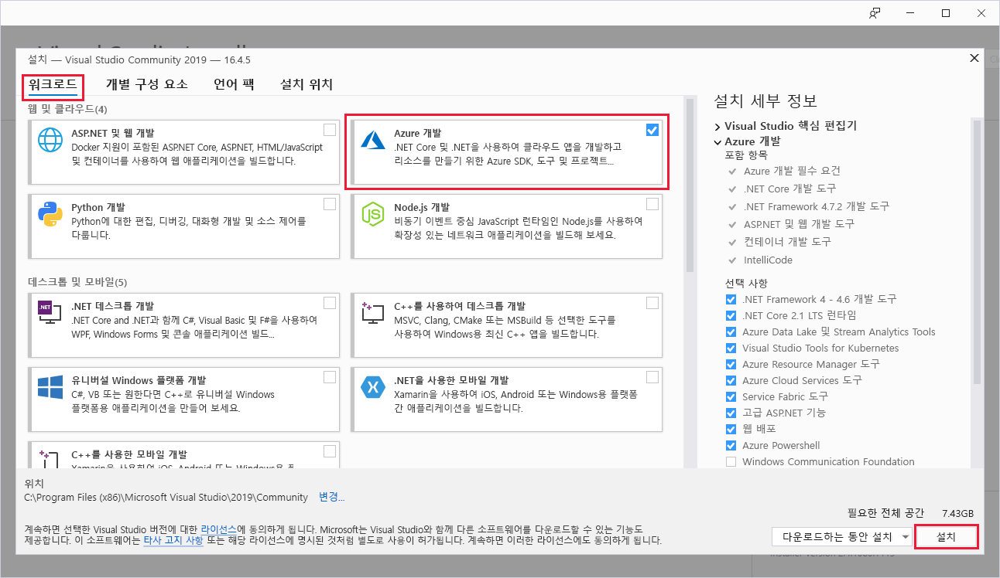
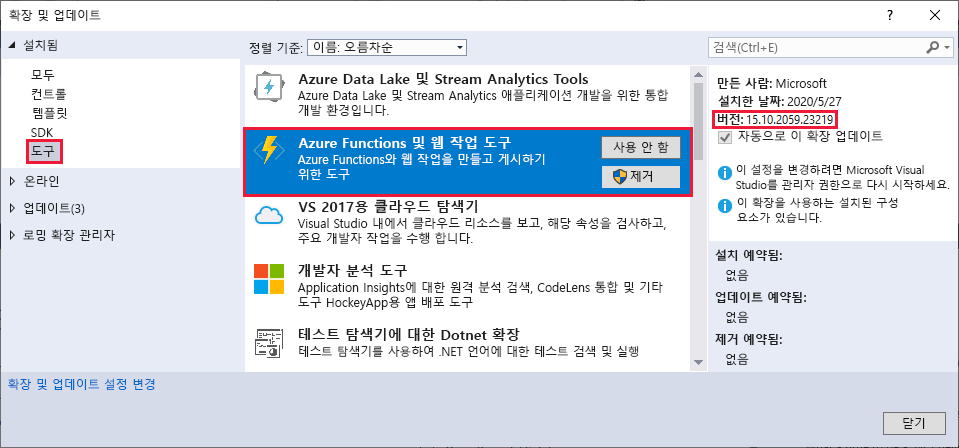
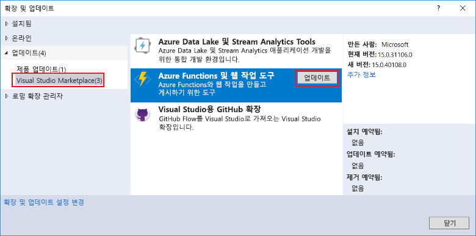
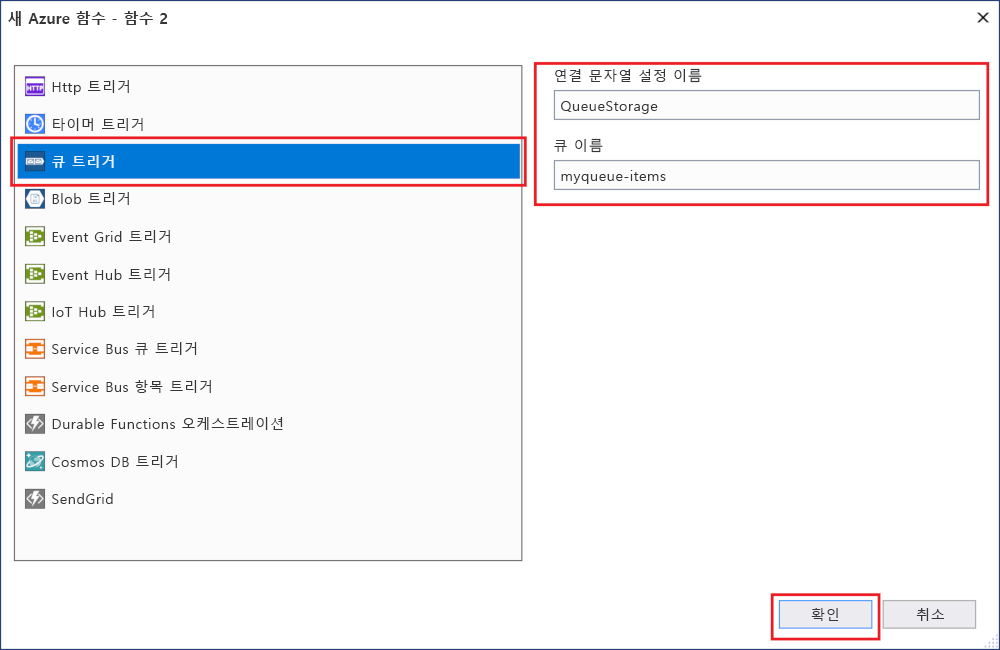
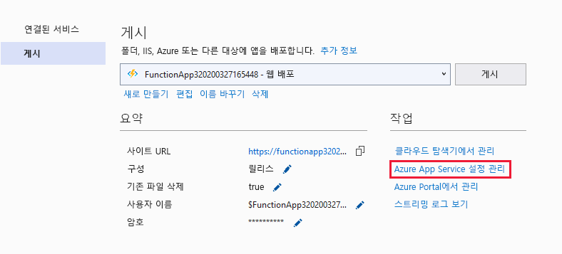
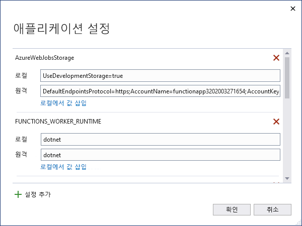

# <a name="develop-azure-functions-using-visual-studio"></a>Visual Studio를 사용하여 Azure Functions 개발  

Azure Functions Tools for Visual Studio 2017은 C# 함수를 Azure에 개발, 테스트 및 배포할 수 있는 Visual Studio에 대한 확장입니다. Azure Functions를 처음으로 접하는 경우라면 [Azure Functions 소개](functions-overview.md)에서 자세한 내용을 확인할 수 있습니다.

Azure Functions 도구는 다음과 같은 이점을 제공합니다. 

* 로컬 개발 컴퓨터에서 함수를 편집, 빌드 및 실행합니다. 
* Azure에 직접 Azure Functions 프로젝트를 게시합니다. 
* 바인딩 정의에 대한 별도 function.json을 유지하는 대신 WebJobs 특성을 사용하여 함수 바인딩을 C# 코드에 직접 선언합니다.
* 미리 컴파일된 C# 함수를 개발하고 배포합니다. 미리 컴파일된 함수는 C# 스크립트 기반 함수보다 더 뛰어난 콜드 부팅 성능을 제공합니다. 
* Visual Studio 개발의 모든 이점을 누리면서 C#에서 함수를 코딩합니다. 

이 문서에서는 Azure Functions Tools for Visual Studio 2017을 사용하여 C#에서 함수를 개발하는 방법을 보여줍니다. 또한 .NET 어셈블리로 Azure에 프로젝트를 게시하는 방법도 알아 봅니다.

> [!IMPORTANT]
> 로컬 개발과 포털 개발을 동일한 함수 앱에 혼합하지 않도록 합니다. 로컬 프로젝트에서 함수 앱에 게시할 때 배포 프로세스는 포털에서 개발한 모든 기능을 덮어씁니다.

## <a name="prerequisites"></a>필수 조건

Azure Functions 도구는 [Visual Studio 2017 버전 15.5](https://www.visualstudio.com/vs/) 이상에서 Azure 개발 워크로드에 포함되어 있습니다. Visual Studio 2017 설치에 **Azure 개발** 워크로드가 포함되어 있는지 확인합니다.



Visual Studio가 최신 상태이고 [가장 최신 버전](#check-your-tools-version)의 Azure Functions 도구를 사용하고 있는지 확인합니다.

### <a name="other-requirements"></a>기타 요구 사항

함수를 만들고 배포하려면 다음이 필요합니다.

* 활성 Azure 구독. Azure 구독이 아직 없는 경우 [무료 계정](https://azure.microsoft.com/free/?WT.mc_id=A261C142F)을 사용할 수 있습니다.

* Azure Storage 계정. 저장소 계정을 만들려면 [저장소 계정 만들기](../storage/common/storage-quickstart-create-account.md)를 참조하세요.

### <a name="check-your-tools-version"></a>도구 버전 확인

1. **도구** 메뉴에서 **확장 및 업데이트**를 선택합니다. **설치됨** > **도구**를 확장하고 **Azure Functions 및 웹 작업 도구**를 선택합니다.

    

2. 설치된 **버전**을 적어둡니다. [릴리스 정보에](https://github.com/Azure/Azure-Functions/blob/master/VS-AzureTools-ReleaseNotes.md) 나열된 최신 버전과 이 버전을 비교할 수 있습니다. 

3. 최신 버전이 아닌 경우 다음 섹션에 표시된 대로 Visual Studio에서 도구를 업데이트합니다.

### <a name="update-your-tools"></a>도구 업데이트

1. **확장명 및 업데이트** 대화 상자에서 **업데이트** > **Visual Studio Marketplace**를 확장하고, **Azure Functions 및 웹 작업 도구**를 선택하고 **업데이트**를 선택합니다.

       

2. 도구 업데이트를 다운로드한 후에 Visual Studio를 닫고 VSIX 설치 관리자를 사용하여 도구 업데이트를 트리거합니다.

3. 설치 관리자에서 **확인**을 선택하여 시작한 다음, **수정**을 선택하여 도구를 업데이트합니다. 

4. 업데이트가 완료되면 **닫기**를 선택하고 Visual Studio를 다시 시작합니다.

## <a name="create-an-azure-functions-project"></a>Azure Functions 프로젝트 만들기

[!INCLUDE [Create a project using the Azure Functions](../../includes/functions-vstools-create.md)]

프로젝트 템플릿은 C# 프로젝트를 만들고, `Microsoft.NET.Sdk.Functions` NuGet 패키지를 설치하고, 대상 프레임워크를 설정합니다. Functions 1.x는 .NET Framework를 대상으로 하고, Functions 2.x는 .NET Standard를 대상으로 합니다. 새 프로젝트에는 다음 파일이 포함됩니다.

* **host.json**: 함수 호스트를 구성할 수 있습니다. 이러한 설정은 로컬 및 Azure에서 실행할 때 모두 적용됩니다. 자세한 내용은 [host.json 참조](functions-host-json.md)를 참조하세요.

* **local.settings.json**: 함수를 로컬로 실행할 때 사용되는 설정을 유지합니다. 이러한 설정은 Azure에서 사용되지 않으며, [Azure Functions 핵심 도구](functions-run-local.md)에서 사용됩니다. 이 파일을 사용하여 함수에 필요한 변수에 대한 앱 설정을 지정합니다. 프로젝트에서 함수 바인딩에 필요한 각 연결에 대한 **값** 배열에 새 항목을 추가합니다. 자세한 내용은 Azure Functions 핵심 도구 문서의 [로컬 설정 파일](functions-run-local.md#local-settings-file)을 참조하세요.

자세한 내용은 [Functions 클래스 라이브러리 프로젝트](functions-dotnet-class-library.md#functions-class-library-project)를 참조하세요.

## <a name="configure-the-project-for-local-development"></a>로컬 개발에 대한 프로젝트 구성

함수 런타임에서 Azure Storage 계정을 내부적으로 사용합니다. HTTP 및 웹후크 이외의 모든 트리거 형식을 위해 **Values.AzureWebJobsStorage** 키를 유효한 Azure Storage 계정 연결 문자열에 설정해야 합니다. 함수 앱은 프로젝트에 필요한 **AzureWebJobsStorage** 연결 설정에 [Azure Storage 에뮬레이터](../storage/common/storage-use-emulator.md)를 사용할 수도 있습니다. 에뮬레이터를 사용하려면 **AzureWebJobsStorage** 값을 `UseDevelopmentStorage=true`로 설정합니다. 배포하기 전에 이 설정을 실제 저장소 연결으로 변경해야 합니다.

저장소 계정 연결 문자열을 설정하려면 다음을 수행합니다.

1. Visual Studio에서 **클라우드 탐색기**를 열고 **Storage 계정** > **Storage 계정**을 확장한 후 **속성**을 선택하고 **기본 연결 문자열** 값을 복사합니다.

2. 사용자 프로젝트에서 local.settings.json 파일을 열고 **AzureWebJobsStorage** 키의 값을 복사한 연결 문자열로 설정합니다.

3. 이전 단계를 반복하여 사용자의 함수에 필요한 다른 연결에 대한 **값** 배열에 고유 키를 추가합니다.

## <a name="add-a-function-to-your-project"></a>프로젝트에 함수 추가

미리 컴파일된 함수에서 함수에 사용된 바인딩은 코드에 특성을 적용함에 따라 정의됩니다. Azure Functions 도구를 사용하여 제공된 템플릿에서 함수를 만들 때 이러한 특성이 적용됩니다. 

1. **솔루션 탐색기**에서 프로젝트 노드를 마우스 오른쪽 단추로 클릭하고 **추가** > **새 항목**을 차례로 선택합니다. **Azure Function**을 선택하고 클래스에 사용할 **이름**을 입력하고 **추가**를 클릭합니다.

2. 사용자의 트리거를 선택하고, 바인딩 속성을 설정한 후, **만들기**를 클릭합니다. 다음 예제에서는 Queue Storage 트리거 함수를 만들 때 설정을 보여 줍니다. 

    

    이 트리거 예제에서는 키 이름이 **QueueStorage**인 연결 문자열을 사용합니다. 이 연결 문자열 설정은 [local.settings.json 파일](functions-run-local.md#local-settings-file)에서 정의해야 합니다.

3. 새로 추가된 클래스를 검사합니다. **FunctionName** 특성으로 보이는 정적 **실행** 메서드가 표시됩니다. 이 특성은 메서드가 함수에 대한 진입점임을 나타냅니다.

    예를 들어 다음 C# 클래스는 기본 Queue Storage 트리거 함수를 나타냅니다.

    ````csharp
    using System;
    using Microsoft.Azure.WebJobs;
    using Microsoft.Azure.WebJobs.Host;
    using Microsoft.Extensions.Logging;

    namespace FunctionApp1
    {
        public static class Function1
        {
            [FunctionName("QueueTriggerCSharp")]
            public static void Run([QueueTrigger("myqueue-items", Connection = "QueueStorage")]string myQueueItem, ILogger log)
            {
                log.LogInformation($"C# Queue trigger function processed: {myQueueItem}");
            }
        }
    }
    ````
    바인딩 고유 특성은 진입점 메서드에 적용되는 각 바인딩 매개 변수에 적용됩니다. 특성은 매개 변수로 바인딩 정보를 사용합니다. 이전 예제에서 첫 매개 변수는 큐 트리거 함수를 나타내는 **QueueTrigger** 특성이 적용되었습니다. 큐 이름 및 연결 문자열 설정 이름은 **QueueTrigger** 특성에 매개 변수로 전달됩니다. 자세한 내용은 [Azure Functions의 Azure Queue Storage 바인딩](functions-bindings-storage-queue.md#trigger---c-example)을 참조하세요.
    
위의 절차를 사용하여 함수 앱 프로젝트에 더 많은 함수를 추가할 수 있습니다. 프로젝트에서 각 함수는 다른 트리거를 가질 수 있지만 함수에는 정확히 하나의 트리거만 있어야 합니다. 자세한 내용은 [Azure Functions 트리거 및 바인딩 개념](functions-triggers-bindings.md)을 참조하세요.

## <a name="add-bindings"></a>바인딩 추가

트리거와 마찬가지로 입력 및 출력 바인딩이 바인딩 특성으로 함수에 추가됩니다. 다음과 같이 함수에 바인딩을 추가합니다.

1. [로컬 개발에 대한 프로젝트를 구성](#configure-the-project-for-local-development)했는지 확인합니다.

2. 특정 바인딩에 대한 적절한 NuGet 확장 패키지를 추가합니다. 자세한 내용은 트리거 및 바인딩 문서의 [Visual Studio를 사용하여 로컬 C# 개발](functions-triggers-bindings.md#local-csharp)을 참조하세요. 바인딩에 대한 참조 문서에 바인딩 전용 NuGet 패키지 요구 사항이 있습니다. 예를 들어 [Event Hubs 바인딩 참조 문서](functions-bindings-event-hubs.md)에서 Event Hubs 트리거에 대한 패키지 요구 사항을 찾습니다.

3. 바인딩에 필요한 앱 설정이 있는 경우 [로컬 설정 파일](functions-run-local.md#local-settings-file)의 **값** 컬렉션에 추가합니다. 이러한 값은 함수를 로컬로 실행할 때 사용됩니다. 함수가 Azure의 함수 앱에서 실행될 때 [함수 앱 설정](#function-app-settings)이 사용됩니다.

4. 메서드 서명에 적절한 바인딩 특성을 추가합니다. 다음 예제에서 큐 메시지는 함수를 트리거하고, 출력 바인딩은 다른 큐와 동일한 텍스트가 있는 새 큐 메시지를 만듭니다.

    ```csharp
    public static class SimpleExampleWithOutput
    {
        [FunctionName("CopyQueueMessage")]
        public static void Run(
            [QueueTrigger("myqueue-items-source", Connection = "AzureWebJobsStorage")] string myQueueItem, 
            [Queue("myqueue-items-destination", Connection = "AzureWebJobsStorage")] out string myQueueItemCopy,
            ILogger log)
        {
            log.LogInformation($"CopyQueueMessage function processed: {myQueueItem}");
            myQueueItemCopy = myQueueItem;
        }
    }
    ```
큐 저장소에 대한 연결은 `AzureWebJobsStorage` 설정에서 가져옵니다. 자세한 내용은 특정 바인딩에 대한 참조 문서를 참조하세요. 

[!INCLUDE [Supported triggers and bindings](../../includes/functions-bindings.md)]

## <a name="testing-functions"></a>테스팅 함수

Azure Functions Core 도구를 사용하면 로컬 개발 컴퓨터에서 Azure Functions 프로젝트를 실행할 수 있습니다. Visual Studio에서 처음으로 함수를 시작할 때 이 도구를 설치하도록 요구하는 메시지가 표시됩니다.

함수를 테스트하려면 F5 키를 누릅니다. 메시지가 표시되면 Visual Studio에서 Azure Functions Core(CLI) 도구를 다운로드하여 설치하도록 요구하는 요청을 수락합니다. 또한 도구에서 HTTP 요청을 처리할 수 있도록 방화벽 예외를 사용하도록 설정해야 합니다.

실행 중인 프로젝트와 함께 배포된 함수를 테스트할 때 코드를 테스트할 수 있습니다. 자세한 내용은 [Azure Functions에서 코드를 테스트하기 위한 전략](functions-test-a-function.md)을 참조하세요. 디버그 모드에서 실행할 때 중단점이 예상대로 Visual Studio에서 적중됩니다. 

<!---
For an example of how to test a queue triggered function, see the [queue triggered function quickstart tutorial](functions-create-storage-queue-triggered-function.md#test-the-function).  
-->

Azure Functions 핵심 도구 사용에 대한 자세한 내용은 [Azure Functions를 로컬로 코딩 및 테스트](functions-run-local.md)를 참조하세요.

## <a name="publish-to-azure"></a>Azure에 게시

[!INCLUDE [Publish the project to Azure](../../includes/functions-vstools-publish.md)]

## <a name="function-app-settings"></a>함수 앱 설정

local.settings.json에서 추가한 모든 설정을 Azure의 함수 앱에도 추가해야 합니다. 이러한 설정은 프로젝트를 게시할 때 자동으로 업로드되지 않습니다.

Azure에서 함수 앱에 필요한 설정을 업로드하는 가장 쉬운 방법은 프로젝트를 성공적으로 게시한 후에 표시되는 **응용 프로그램 설정 관리...** 링크를 사용하는 것입니다. 



그러면 새로운 응용 프로그램 설정을 추가하거나 기존 응용 프로그램 설정을 수정할 수 있는 함수 앱에 대한 **응용 프로그램 설정** 대화 상자가 표시됩니다.



또한 다음 다른 방법 중 하나로 응용 프로그램 설정을 관리할 수도 있습니다.

* [Azure Portal 사용](functions-how-to-use-azure-function-app-settings.md#settings)
* [`--publish-local-settings` Azure Functions 핵심 도구의 게시 옵션](functions-run-local.md#publish) 사용
* [Azure CLI 사용](/cli/azure/functionapp/config/appsettings#az-functionapp-config-appsettings-set) 

## <a name="monitoring-functions"></a>함수 모니터링

Azure에서 함수 실행을 모니터링할 때는 Azure Application Insights와 함수를 통합하는 방식을 사용하는 것이 좋습니다. Azure Portal에서 함수 앱을 만들 때는 이 통합이 기본적으로 자동 수행됩니다. 그러나 Visual Studio 게시 중에 함수 앱을 만들 때는 Azure에서 함수 앱 통합이 수행되지 않습니다. 대신 로깅 기능이 기본 제공되는데, 이 기능은 사용하지 않는 것이 좋습니다.

Azure에서 함수 앱에 대해 Application Insights를 사용하도록 설정하려면 다음 단계를 수행합니다.

1. [Azure Portal](https://portal.azure.com)에서 Application Insights 인스턴스를 만든 다음 해당 계측 키를 복사합니다. 이 작업을 수행하는 방법을 알아보려면 [App Insights 리소스를 수동으로 연결](functions-monitoring.md#manually-connect-an-app-insights-resource)을 참조하세요.  

1. [함수 앱 설정](#function-app-settings)의 설명에 따라 Azure의 함수 앱 설정에 앱 설정 `APPINSIGHTS_INSTRUMENTATIONKEY`를 추가합니다. 이 앱 설정에는 이전 단계에서 만든 계측 키가 포함되어 있습니다.

1. Azure의 함수 앱에서 `AzureWebJobsDashboard` 앱 설정을 제거합니다. 그러면 기본 제공 로깅이 사용하지 않도록 설정됩니다.  

자세히 알아보려면 [Azure Functions 모니터링](functions-monitoring.md)을 참조하세요.

## <a name="next-steps"></a>다음 단계

Azure Functions 도구에 대한 자세한 내용은 [Azure Functions에 대한 Visual Studio 2017 도구](https://blogs.msdn.microsoft.com/webdev/2017/05/10/azure-function-tools-for-visual-studio-2017/) 블로그 게시물의 일반적인 질문 섹션을 참조하세요.

Azure Functions 핵심 도구에 대한 자세한 내용은 [Azure Functions를 로컬로 코딩 및 테스트](functions-run-local.md)를 참조하세요.

.NET 클래스 라이브러리인 함수를 개발하는 방법에 대해 자세히 알아보려면 [Azure Functions C# 개발자 참조](functions-dotnet-class-library.md)를 참조하세요. 이 문서에서는 특성을 사용하여 Azure Functions에서 지원하는 다양한 유형의 바인딩을 선언하는 방법의 예제로 연결합니다.    
