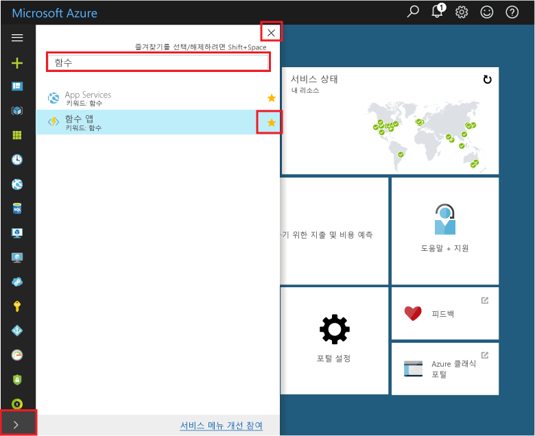

# Azure Portal에서 함수 앱을 관리하는 방법 

Azure Functions에서 함수 앱은 개별 함수에 대한 실행 컨텍스트를 제공합니다. 함수 앱 동작은 지정된 함수 앱에서 호스트하는 모든 함수에 적용됩니다. 이 항목에서는 Azure Portal에서 함수 앱을 구성 및 관리하는 방법을 설명합니다.

시작하려면 [Azure Portal](https://portal.azure.com)로 이동한 후 Azure 계정으로 로그인합니다. 포털 맨 위에 있는 검색 표시줄에 함수 앱의 이름을 입력하고 목록에서 선택합니다. 함수 앱을 선택하면 다음 페이지가 표시됩니다.

## 포털의 즐겨 찾는 함수 

경우에 따라 [Azure Portal]에서 리소스를 찾기 어려울 수 있습니다. 자신이 만든 함수 앱을 더 쉽게 찾을 수 있도록 하려면 포털의 즐겨찾기에 Function App을 추가합니다. 

1. [Azure Portal]에 로그인합니다.

2. 맨 아래 왼쪽에서 화살표를 클릭하여 모든 서비스를 확장하고 **필터** 필드에 `Functions`를 입력한 후 **Function Apps** 옆의 별 모양을 클릭합니다.  
 
    

    그러면 Functions 아이콘이 포털 왼쪽 메뉴에 추가됩니다.

3. 메뉴를 닫은 후 맨 아래로 스크롤하면 Functions 아이콘이 표시됩니다. 이 아이콘을 클릭하면 모든 함수 앱 목록이 표시됩니다. 이 앱에서 함수로 작업하려면 함수 앱을 클릭합니다. 
 
    
 
[Azure Portal]: https://portal.azure.com/

## 함수 앱 설정 탭

**설정** 탭에서는 함수 앱에서 사용되는 Functions 런타임 버전을 업데이트할 수 있습니다. 이 탭에서는 또한 함수 앱에서 호스트하는 모든 함수에 대한 HTTP 액세스를 제한하는 데 사용되는 호스트 키를 관리합니다.

Functions는 소비 호스팅 및 App Service 호스팅 계획을 모두 지원합니다. 자세한 내용은 [Azure Functions에 대한 올바른 서비스 계획 선택](functions-scale.md)을 참조하세요. 소비 계획에서 더 나은 예측 가능성을 얻기 위해 Functions는 일일 사용 할당량(기가바이트 초)을 설정하여 플랫폼 사용을 제한할 수 있도록 합니다. 일일 사용 할당량에 도달하면 함수 앱이 중지됩니다. 사용 할당량에 도달하여 중지한 함수 앱은 일일 사용 할당량을 설정할 때와 같은 컨텍스트에서 다시 활성화할 수 있습니다. 대금 청구에 대한 자세한 내용은 [Azure Functions 가격 책정 페이지](https://azure.microsoft.com/pricing/details/functions/)를 참조하세요.   

## 플랫폼 기능 탭

함수 앱은 Azure App Service 플랫폼에서 실행되고 유지 관리됩니다. 따라서 함수 앱은 Azure의 핵심 웹 호스팅 플랫폼 기능 대부분에 액세스할 수 있습니다. **플랫폼 기능** 탭에서는 함수 앱에서 사용할 수 있는 App Service 플랫폼의 많은 기능에 액세스할 수 있습니다. 

> [!NOTE]
> 함수 앱이 소비 호스팅 계획에서 실행될 때 모든 App Service 기능을 사용할 수 있는 것은 아닙니다.

이 항목의 나머지 부분에서는 Functions에 유용한 Azure Portal의 다음과 같은 App Service 기능을 중점적으로 설명합니다.

+ [App Service 편집기](#editor)
+ [애플리케이션 설정](#settings) 
+ [Console](#console)
+ [고급 도구(Kudu)](#kudu)
+ [배포 옵션](#deployment)
+ [CORS](#cors)
+ [인증](#auth)
+ [API 정의](#swagger)

App Service 설정을 사용하는 방법에 대한 자세한 내용은 [Azure App Service 설정 구성](../app-service/web-sites-configure.md)을 참조하세요.

### App Service 편집기

| | |
|-|-|
|   | App Service 편집기는 JSON 구성 파일과 코드 파일을 둘 다 수정하는 데 사용할 수 있는 포털 내 고급 편집기입니다. 이 옵션을 선택하면 기본 편집기와 함께 별도의 브라우저 탭이 실행됩니다. 이를 통해 Git 리포지토리와 통합하고 코드를 실행 및 디버깅하며 함수 앱 설정을 수정할 수 있습니다. 이 편집기는 기본 함수 앱 블레이드와 비교할 때 함수에 대해 고급 개발 환경을 제공합니다.    |

### 애플리케이션 설정

| | |
|-|-|
|  | App Service **애플리케이션 설정** 블레이드에서 프레임워크 버전, 원격 디버깅, 앱 설정 및 연결 문자열을 구성 및 관리합니다. 다른 Azure 및 타사 서비스에 함수 앱을 통합할 경우 이 블레이드에서 해당 설정을 수정할 수 있습니다. 설정을 삭제하려면 오른쪽으로 스크롤하고 줄 오른쪽 끝에서 **X** 아이콘을 선택합니다(다음 이미지에 표시되지 않음).

### 콘솔

| | |
|-|-|
|  | 포털 내 콘솔은 명령줄에서 함수 앱과 상호 작용하려는 경우에 이상적인 개발자 도구입니다. 일반적인 명령에는 배치 파일 및 스크립트 실행과 함께 디렉터리 및 파일의 생성 및 탐색이 포함됩니다. |

### 고급 도구(Kudu)

| | |
|-|-|
|  | App Service용 고급 도구(Kudu라고도 함)를 사용하면 함수 앱의 고급 관리 기능에 액세스할 수 있습니다. Kudu에서 시스템 정보, 앱 설정, 환경 변수, 사이트 확장, HTTP 헤더 및 서버 변수를 관리할 수 있습니다. `https://<myfunctionapp>.scm.azurewebsites.net/`과 같은 함수 앱에 대한 SCM 엔드포인트로 이동하여 **Kudu**를 시작할 수도 있습니다. |

### <a name="deployment">배포 옵션

| | |
|-|-|
|  | Functions를 사용하면 로컬 컴퓨터에서 함수 코드를 개발할 수 있습니다. 그런 다음 Azure에 로컬 함수 앱 프로젝트를 업로드할 수 있습니다. 기존 FTP 업로드 외에도 Functions를 사용하면 GitHub, Azure DevOps, Dropbox, Bitbucket 등과 같은 인기 있는 연속 통합 솔루션을 사용하여 함수 앱을 배포할 수 있습니다. 자세한 내용은 [Azure Functions에 대한 연속 배포](functions-continuous-deployment.md)를 참조하세요. FTP 또는 로컬 Git을 사용하여 수동으로 업로드하려면 [배포 자격 증명을 구성](functions-continuous-deployment.md#credentials)해야 합니다. |

### CORS

| | |
|-|-|
|  | 서비스의 악의적인 코드 실행을 방지하기 위해 App Service는 외부 원본의 함수 앱에 대한 호출을 차단합니다. Functions는 CORS(원본 간 리소스 공유)를 지원하여 함수가 원격 요청을 수락할 수 있는 허용 원본을 나타내는 “허용 목록"을 정의할 수 있도록 합니다.  |

### 인증

| | |
|-|-|
|  | 함수가 HTTP 트리거를 사용하는 경우 먼저 호출이 인증되도록 요구할 수 있습니다. App Service는 Facebook, Microsoft 및 Twitter 같은 소셜 공급자를 사용하는 Azure Active Directory 인증 및 로그인을 지원합니다. 특정 인증 공급자를 구성하는 방법에 대한 자세한 내용은 [Azure App Service 인증 개요](../app-service/overview-authentication-authorization.md)를 참조하세요. |

### API 정의

| | |
|-|-|
|  | Functions는 클라이언트가 HTTP에서 트리거한 함수를 더 쉽게 사용할 수 있도록 하는 Swagger를 지원합니다. Swagger를 사용하여 API 정의를 만드는 방법에 대한 자세한 내용은 [Azure App Service에서 CORS를 통해 RESTful API 호스팅](../app-service/app-service-web-tutorial-rest-api.md)을 방문하세요. 또한 Functions 프록시를 사용하여 여러 함수에 대해 단일 API 화면을 정의할 수도 있습니다. 자세한 내용은 [Azure Functions 프록시 사용](functions-proxies.md)을 참조하세요. |

## 다음 단계

+ [Azure App Service 설정 구성](../app-service/web-sites-configure.md)
+ [Azure Functions에 대한 연속 배포](functions-continuous-deployment.md)

