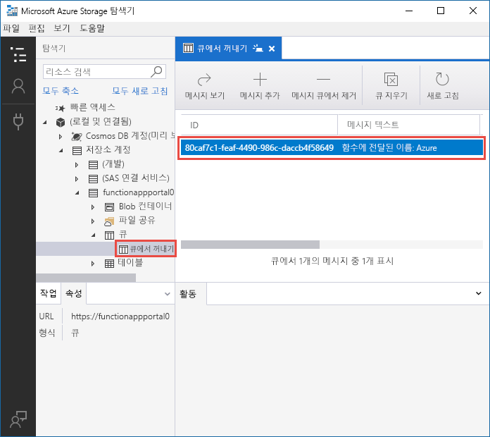
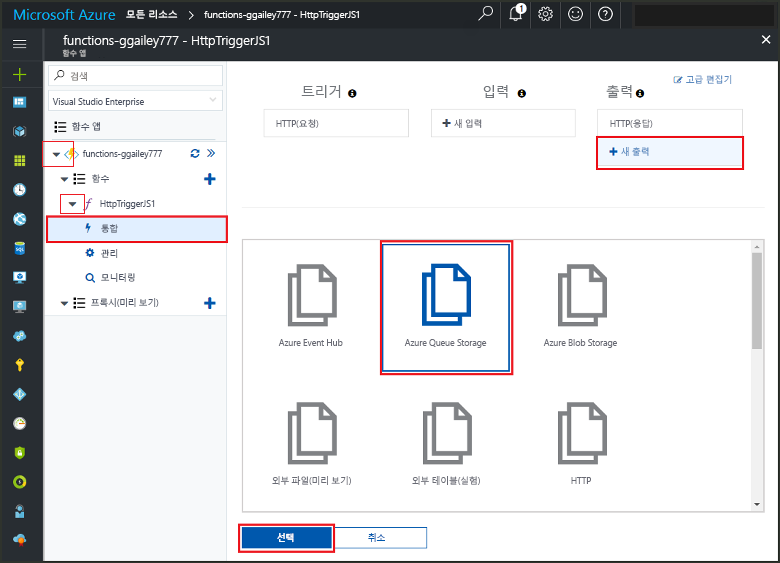
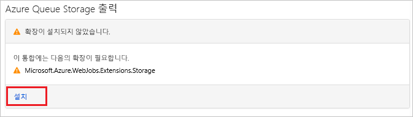
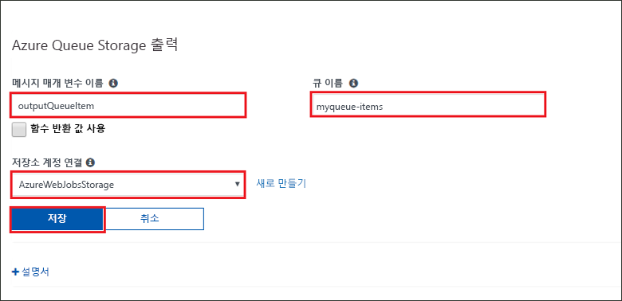
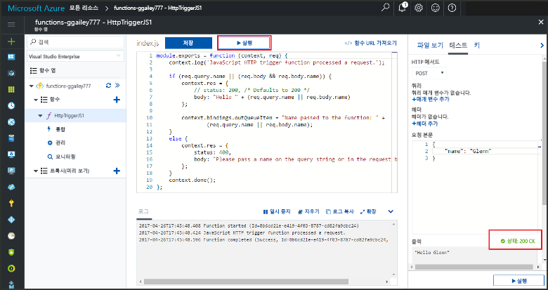
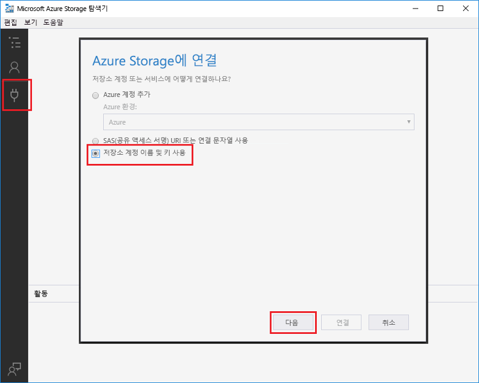
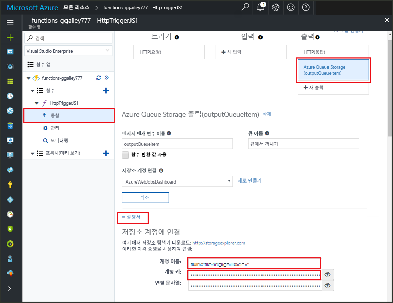
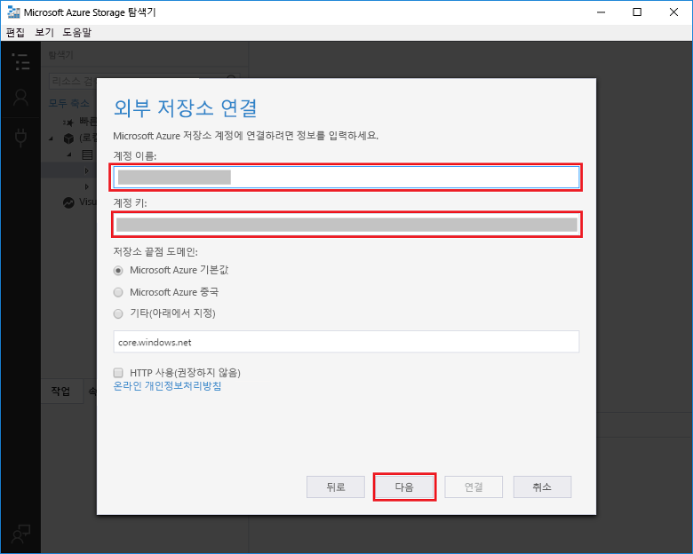

# <a name="add-messages-to-an-azure-storage-queue-using-functions"></a>Functions를 사용하여 Azure Storage 큐에 메시지 추가

Azure Functions에서 입력 및 출력 바인딩은 코드에서 외부 서비스 데이터를 사용하기 위한 선언적 방식을 제공합니다. 이 빠른 시작에서는 출력 바인딩을 사용하여 HTTP 요청에서 함수가 트리거될 때 큐에 메시지를 만듭니다. Azure Storage Explorer를 사용하여 함수가 만드는 큐 메시지를 확인합니다.



## <a name="prerequisites"></a>필수 조건

이 빠른 시작을 완료하려면 다음이 필요합니다.

* [Azure Portal에서 첫 번째 함수 만들기](functions-create-first-azure-function.md)의 지침을 따르고 **리소스 정리** 단계는 수행하지 않습니다. 해당 빠른 시작에서는 함수 앱과, 여기서 사용할 함수를 만듭니다.

* [Microsoft Azure Storage 탐색기](http://storageexplorer.com/)를 설치합니다. 이 도구는 출력 바인딩이 만드는 큐 메시지를 검토하는 데 사용합니다.

## <a name="add-binding"></a>출력 바인딩 추가

이 섹션에서는 포털 UI를 사용하여, 앞서 만든 함수에 큐 저장소 출력 바인딩을 추가합니다. 이 바인딩을 통해 최소한의 코드로 큐에 메시지를 만들 수 있습니다. 저장소 연결 시작, 큐 만들기, 큐에 대한 참조 가져오기 등의 작업을 위해 코드를 작성하지 않아도 됩니다. Azure Functions 런타임 및 큐 출력 바인딩이 이러한 작업을 대신하게 됩니다.

1. Azure Portal에서 [Azure Portal에서 첫 번째 함수 만들기](functions-create-first-azure-function.md)에서 만든 함수 앱에 대한 함수 앱 페이지를 엽니다. 이렇게 하려면 **모든 서비스 > Function 앱**을 선택한 다음, 함수 앱을 선택합니다.

1. 이전 빠른 시작에서 만든 함수를 선택합니다.

1. **통합 > 새 출력 > Azure Queue storage**를 선택합니다.

1. **선택**을 클릭합니다.

    

1. **확장이 설치되지 않았습니다**라는 메시지가 표시되면 **설치**를 선택하여 Storage 바인딩 확장을 함수 앱에 설치합니다. 1분 또는 2분이 걸릴 수 있습니다.

    

1. **Azure Queue Storage 출력**에서 이 스크린샷의 뒤에 오는 테이블에서 지정한 대로 설정을 사용합니다. 

    

    | 설정      |  제안 값   | 설명                              |
    | ------------ |  ------- | -------------------------------------------------- |
    | **메시지 매개 변수 이름** | outputQueueItem | 출력 바인딩 매개 변수의 이름입니다. | 
    | **Storage 계정 연결** | AzureWebJobsStorage | 함수 앱에 이미 사용된 저장소 계정 연결을 사용하거나 새로 만들 수 있습니다.  |
    | **큐 이름**   | outqueue    | Storage 계정에서 연결할 큐의 이름입니다. |

1. **저장**을 클릭하여 바인딩을 추가합니다.

이제 출력 바인딩이 정의되었고 큐에 메시지를 추가할 바인딩을 사용하도록 코드를 업데이트해야 합니다.  

## <a name="add-code-that-uses-the-output-binding"></a>출력 바인딩을 사용하는 코드 추가

이 섹션에서는 출력 큐에 메시지를 작성 하는 코드를 추가합니다. 메시지에는 쿼리 문자열에서 HTTP 트리거로 전달되는 값이 포함됩니다. 예를 들어, 쿼리 문자열이 `name=Azure`를 포함할 경우 큐 메시지는 *함수에 전달된 이름: Azure*가 됩니다.

1. 편집기에서 함수 코드를 표시할 함수를 선택합니다.

1. 함수 언어에 따라 함수 코드를 업데이트합니다.

    # <a name="ctabcsharp"></a>[C\#](#tab/csharp)

    다음 예제와 같이 메서드 서명에 **outputQueueItem** 매개 변수를 추가합니다.

    ```cs
    public static async Task<IActionResult> Run(HttpRequest req,
        ICollector<string> outputQueueItem, ILogger log)
    {
        ...
    }
    ```

    함수의 본문에서 `return` 문 바로 앞에 매개 변수를 사용하여 큐 메시지를 만드는 코드를 추가합니다.

    ```cs
    outputQueueItem.Add("Name passed to the function: " + name);
    ```

    # <a name="javascripttabnodejs"></a>[JavaScript](#tab/nodejs)

    `context.bindings` 개체에서 출력 바인딩을 사용하여 큐 메시지를 만드는 코드를 추가합니다. `context.done` 문 앞에 이 코드를 추가합니다.

    ```javascript
    context.bindings.outputQueueItem = "Name passed to the function: " + 
                (req.query.name || req.body.name);
    ```

    ---

1. **저장**을 선택하여 변경 내용을 저장합니다.

## <a name="test-the-function"></a>함수 테스트

1. 코드 변경 내용이 저장된 후 **실행**을 선택합니다. 

    

    **요청 본문**에 `name` 값 *Azure*가 들어 있습니다. 이 값은 함수가 호출될 때 만들어지는 큐 메시지에 표시됩니다.
    
    여기서 **실행**을 선택하는 대신 브라우저에 URL을 입력하고 쿼리 문자열에 `name` 값을 지정하여 함수를 호출할 수 있습니다. 브라우저 메서드는 [이전 빠른 시작](functions-create-first-azure-function.md#test-the-function)에 있습니다.

2. 로그에서 함수가 성공했는지 확인합니다. 

**outqueue**라는 새 큐는 출력 바인딩이 처음 사용될 때 함수 런타임에 의해 Storage 계정에 만들어집니다. 저장소 탐색기를 사용하여 그 안에 큐와 메시지가 만들어졌는지 확인합니다.

### <a name="connect-storage-explorer-to-your-account"></a>저장소 탐색기를 계정에 연결

이미 저장소 탐색기를 설치하고 이 빠른 시작에 사용하는 저장소 계정에 연결한 경우 이 섹션을 건너뜁니다.

2. [Microsoft Azure Storage Explorer](http://storageexplorer.com/) 도구를 실행하고 왼쪽의 연결 아이콘을 선택하고 **저장소 계정 이름 및 키 사용**을 선택하고 **다음**을 선택합니다.

    

1. Azure Portal의 함수 앱 페이지에서 함수를 선택하고 **통합**을 선택합니다.

1. 이전 단계에서 추가한 **Azure Queue Storage** 출력 바인딩을 선택합니다.

1. 페이지 아래쪽의 **설명서** 섹션을 확장합니다. 

   포털에 저장소 탐색기에서 저장소 계정에 연결하는 데 사용할 수 있는 자격 증명이 표시됩니다.

   

1. 포털에서 **계정 이름** 값을 복사하여 저장소 탐색기의 **계정 이름** 상자에 붙여 넣습니다.
 
1. **계정 키** 옆의 표시/숨김 아이콘을 클릭하여 값을 표시한 다음 **계정 키** 값을 복사하여 저장소 탐색기의 **계정 키** 상자에 붙여넣습니다.
  
3. **다음 > 연결**을 선택합니다.

   

### <a name="examine-the-output-queue"></a>출력 큐 검토 

4. 저장소 탐색기에서 이 빠른 시작에 사용하는 저장소 계정을 선택합니다.

1. **큐** 노드를 확장한 다음 이름이 **outqueue**인 큐를 선택합니다. 

   이 큐에는 HTTP 트리거 함수를 실행했을 때 만들어진 큐 출력 바인딩 메시지가 포함되어 있습니다. 기본 `name` 값 *Azure*로 함수를 호출했다면 큐 메시지는 *함수에 전달된 이름: Azure*입니다.

    

2. 함수를 다시 실행하면 큐에 새 메시지가 표시되는 것을 알 수 있습니다.  

## <a name="clean-up-resources"></a>리소스 정리

[!INCLUDE [Clean up resources](../../includes/functions-quickstart-cleanup.md)]

## <a name="next-steps"></a>다음 단계

이 빠른 시작에서는 기존 함수에 출력 바인딩을 추가했습니다. Queue Storage에 바인딩에 대한 자세한 내용은 [Azure Functions Storage 큐 바인딩](functions-bindings-storage-queue.md)을 참조하세요. 

[!INCLUDE [Next steps note](../../includes/functions-quickstart-next-steps.md)]
