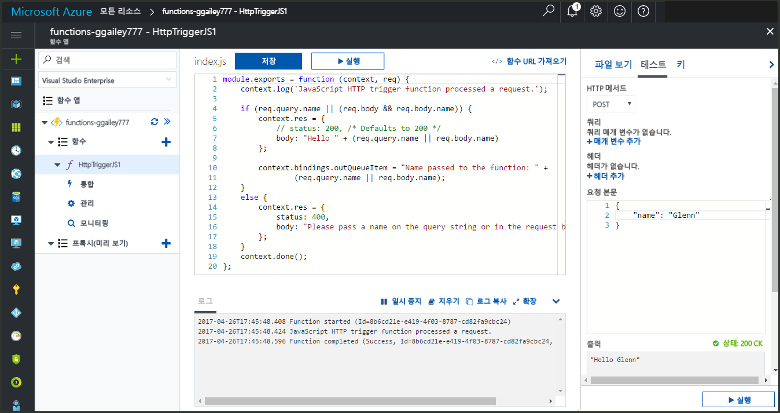

# <a name="add-messages-to-an-azure-storage-queue-using-functions"></a>Functions를 사용하여 Azure Storage 큐에 메시지 추가

Azure Functions에서 입력 및 출력 바인딩은 함수에서 외부 서비스 데이터로 연결하기 위한 선언적 방식을 제공합니다. 이 항목에서는 메시지를 Azure Queue Storage로 보내는 출력 바인딩을 추가하여 기존 함수를 업데이트하는 방법을 알아봅니다.  



## <a name="prerequisites"></a>필수 조건 

[!INCLUDE [Previous topics](../../includes/functions-quickstart-previous-topics.md)]

[Microsoft Azure Storage 탐색기](http://storageexplorer.com/)를 다운로드하고 설치해야 합니다. 

[!INCLUDE [functions-portal-favorite-function-apps](../../includes/functions-portal-favorite-function-apps.md)] 

## <a name="add-binding"></a>출력 바인딩 추가
 
1. 함수 앱과 함수를 모두 확장합니다.

2. **통합** 및 **+ 새 출력**을 클릭한 다음 **Azure Queue Storage** 및 **선택**을 차례로 클릭합니다.
    
    

3. 표에 지정된 대로 설정을 사용한 후 **저장**을 클릭합니다. 

    

    | 설정      |  제안 값   | 설명                              |
    | ------------ |  ------- | -------------------------------------------------- |
    | **큐 이름**   | myqueue-items    | 저장소 계정에서 연결할 큐의 이름입니다. |
    | **저장소 계정 연결** | AzureWebJobStorage | 함수 앱에 이미 사용된 저장소 계정 연결을 사용하거나 새로 만들 수 있습니다.  |
    | **메시지 매개 변수 이름** | outQueueItem | 출력 바인딩 매개 변수의 이름입니다. | 

이제 출력 바인딩이 정의되었고 큐에 메시지를 추가할 바인딩을 사용하도록 코드를 업데이트해야 합니다.  

## <a name="update-the-function-code"></a>함수 코드 업데이트

1. 편집기에서 함수 코드를 표시할 함수를 클릭합니다. 

2. C# 함수의 경우 **outQueueItem** 저장소 바인딩 매개 변수를 추가하기 위해 함수 정의를 다음과 같이 업데이트합니다. JavaScript 함수에 대해서는 이 단계를 건너뜁니다.

    ```cs   
    public static async Task<HttpResponseMessage> Run(HttpRequestMessage req, 
        ICollector<string> outQueueItem, TraceWriter log)
    {
        ....
    }
    ```

3. 메서드가 반환하기 직전에 함수에 다음 코드를 추가합니다. 함수의 언어에 대해 적절한 코드 조각을 사용합니다.

    ```javascript
    context.bindings.outQueueItem = "Name passed to the function: " + 
                (req.query.name || req.body.name);
    ```

    ```cs
    outQueueItem.Add("Name passed to the function: " + name);     
    ```

4. **저장** 을 클릭하여 변경 내용을 저장합니다.

HTTP 트리거에 전달된 값은 큐에 추가된 메시지에 포함됩니다.
 
## <a name="test-the-function"></a>함수 테스트 

1. 코드 변경 내용이 저장된 후 **실행**을 클릭합니다. 

    

2. 로그에서 함수가 성공했는지 확인합니다. **outqueue**라는 새 큐는 출력 바인딩이 처음 사용될 때 함수 런타임에 의해 저장소 계정에 만들어집니다.

다음으로 새 큐와 여기에 추가한 메시지를 확인하기 위해 저장소 계정에 연결할 수 있습니다. 

## <a name="connect-to-the-queue"></a>큐에 연결

Storage 탐색기를 이미 설치했고 저장소 계정에 연결한 경우 처음 세 단계를 건너뜁니다.    

1. 함수에서 **통합** 및 새 **Azure Queue Storage** 출력 바인딩을 클릭한 후 **설명서**를 확장합니다. **계정 이름** 및 **계정 키**를 모두 복사합니다. 이러한 자격 증명을 사용하여 저장소 계정에 연결합니다.
 
    

2. [Microsoft Azure Storage 탐색기](http://storageexplorer.com/) 도구를 실행하고 왼쪽의 연결 아이콘을 클릭하고 **저장소 계정 이름 및 키 사용**을 선택하고 **다음**을 클릭합니다.

    
    
3. 1단계에서 **계정 이름** 및 **계정 키**를 입력하고 **다음**을 클릭한 후 **연결**을 클릭합니다. 
  
    

4. 연결된 저장소 계정을 확장하고 **큐**를 마우스 오른쪽 단추로 클릭하고 **myqueue-items**라는 큐가 존재하는지 확인합니다. 큐에 이미 있는 메시지도 표시됩니다.  
 
    
 

## <a name="clean-up-resources"></a>리소스 정리

[!INCLUDE [Next steps note](../../includes/functions-quickstart-cleanup.md)]

## <a name="next-steps"></a>다음 단계

기존 함수에 출력 바인딩을 추가했습니다. 

[!INCLUDE [Next steps note](../../includes/functions-quickstart-next-steps.md)]

Queue Storage에 바인딩에 대한 자세한 내용은 [Azure Functions Storage 큐 바인딩](functions-bindings-storage-queue.md)을 참조하세요. 


