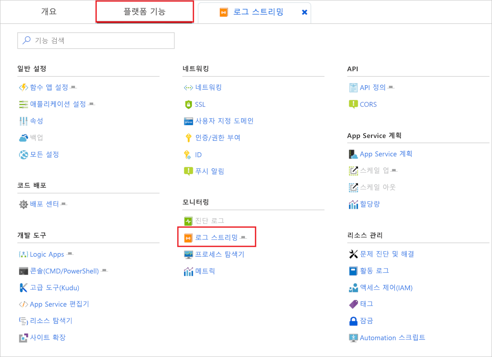
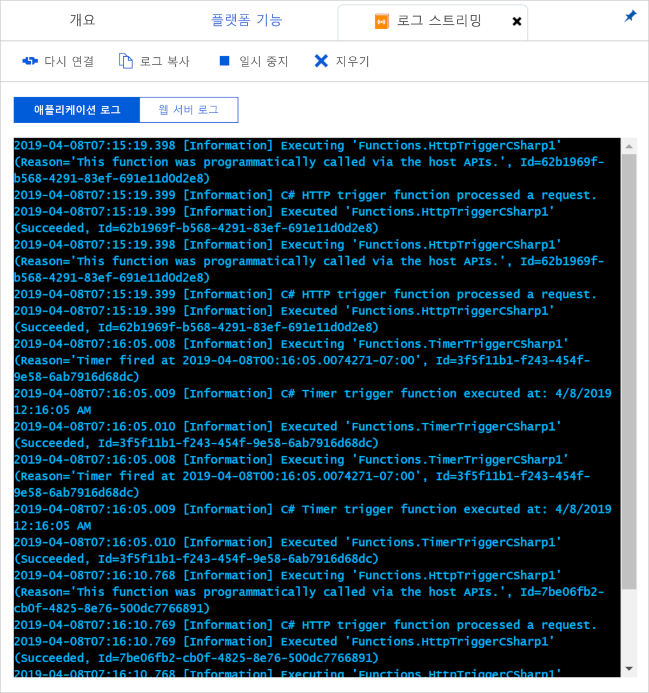

# <a name="monitor-azure-functions"></a>Azure Functions 모니터링

[Azure Functions](functions-overview.md) 기본 제공 통합을 제공 하며 [Azure Application Insights](../azure-monitor/app/app-insights-overview.md) 함수를 모니터링 합니다. 이 문서에서는 로그 파일 시스템에서 생성 된 Application Insights로 보내도록 Azure Functions를 구성 하는 방법을 보여 줍니다.

Application Insights를 사용 하 여 로그, 성능 및 오류 데이터를 수집 하는 것이 좋습니다. 자동으로 성능 이상을 감지 하 고 문제를 진단할 수 있도록 하는 함수를 사용 하는 방법을 이해 하는 강력한 분석 도구가 포함 되어 있습니다. 성능 및 가용성을 지속적으로 향상시킬 수 있도록 설계되었습니다. 로컬 함수 앱 프로젝트를 개발 하는 동안 Application Insights를 사용할 수도 있습니다. 자세한 내용은 [Application Insights 란?](../azure-monitor/app/app-insights-overview.md)합니다.

Application Insights 계측 기능은 필요한 Azure Functions에 빌드될 때 함수 앱에 Application Insights 리소스에 연결할 올바른 계측 키를 하기만 하면 됩니다.

## <a name="application-insights-pricing-and-limits"></a>Application Insights 가격 책정 및 제한

무료로 Function App과 Application Insights 통합을 사용해 볼 수 있습니다. 일일 한도 데이터의 양을 무료로 처리할 수 있습니다. 테스트 하는 동안이 제한에 도달할 수 있습니다. Azure는 일일 한도에 가까워지면 포털 및 이메일 알림을 제공합니다. 이러한 경고를 누락 하는 한도 도달 하는 경우 Application Insights 쿼리에 새 로그가 표시 되지 않습니다. 불필요 한 문제 해결 시간을 방지 하려면 이러한 제한을 고려해 야 합니다. 자세한 내용은 [Application Insights에서 가격 책정 및 데이터 볼륨 관리](../azure-monitor/app/pricing.md)를 참조하세요.

## <a name="enable-application-insights-integration"></a>Application Insights 통합 사용

함수 앱이 Application Insights로 데이터를 보내려면 Application Insights 리소스의 계측 키를 알고 있어야 합니다. 이 키는 **APPINSIGHTS_INSTRUMENTATIONKEY**라는 앱 설정에 있어야 합니다.

### <a name="new-function-app-in-the-portal"></a>포털에서 새 함수 앱

경우 있습니다 [Azure portal에서 함수 앱 만들기](functions-create-first-azure-function.md), Application Insights 통합이 기본적으로 사용 합니다. Application Insights 리소스를 함수 앱으로 동일한 이름을 가진 및 동일한 지역 또는 가장 가까운 지역에 만들어집니다.

생성 되는 Application Insights 리소스를 검토 하려면 선택 하 여 확장 합니다 **Application Insights** 창입니다. 변경할 수 있습니다는 **새 리소스 이름** 다른 폴더를 선택 하거나 **위치** 에 [Azure 지리적 위치](https://azure.microsoft.com/global-infrastructure/geographies/) 데이터를 저장 하려는 위치.


선택 하는 경우 **만들기**에 있는 함수 앱을 사용 하 여 Application Insights 리소스를 만들어집니다를 `APPINSIGHTS_INSTRUMENTATIONKEY` 응용 프로그램 설정에서 설정 합니다. 모든 준비가 되었습니다.

<a id="manually-connect-an-app-insights-resource"></a>
### <a name="add-to-an-existing-function-app"></a>기존 함수 앱에 추가 합니다. 

사용 하 여 함수 앱을 만들 때 합니다 [Azure CLI](functions-create-first-azure-function-azure-cli.md)를 [Visual Studio](functions-create-your-first-function-visual-studio.md), 또는 [Visual Studio Code](functions-create-first-function-vs-code.md), Application Insights 리소스를 만들어야 합니다. 함수 앱의 응용 프로그램 설정으로 해당 리소스의 계측 키를 추가한 다음 있습니다.

[!INCLUDE [functions-connect-new-app-insights.md](../../includes/functions-connect-new-app-insights.md)]

더 이상 권장 되는 기본 제공 모니터링, 초기 버전의 함수에서 사용 합니다. 이러한 함수 앱에 Application Insights 통합을 사용 하도록 설정 하는 경우 수행 해야 [기본 제공 로깅을 사용 하지 않으려면](#disable-built-in-logging)합니다.  

## <a name="view-telemetry-in-monitor-tab"></a>모니터 탭에서 원격 분석 보기

사용 하 여 [Application Insights 통합 사용](#enable-application-insights-integration), 원격 분석 데이터를 볼 수 있습니다 합니다 **모니터** 탭 합니다.

1. 함수 앱 페이지에서 Application Insights를 구성한 후 한 번 이상 실행 하는 함수를 선택 합니다. 다음을 선택 합니다 **모니터** 탭 합니다.

   

1. 선택 **새로 고침** 정기적으로 함수 호출 목록이 나타날 때까지 합니다.

   원격 분석 클라이언트 일괄 서버로 전송 하기 위해 데이터를 처리 하는 동안 표시 목록에 대 한 최대 5 분 정도 걸릴 수 있습니다. (지연에 적용 되지 않습니다 합니다 [라이브 메트릭 Stream](../azure-monitor/app/live-stream.md)합니다. 해당 서비스는 페이지를 로드할 때 함수 호스트에 연결되므로 로그가 페이지에 직접 스트리밍됩니다.)

   

1. 특정 함수 호출에 대한 로그를 보려면 해당 호출에 대한 **날짜** 열 링크를 선택합니다.

   

   해당 호출에 대한 로깅 출력이 새 페이지에 나타납니다.

   

두 페이지는 볼 수 있습니다는 **Application Insights에서 실행** 데이터를 검색 하는 Application Insights Analytics 쿼리를 링크 합니다.


다음 쿼리가 표시 됩니다. 호출 목록 제한 된다는 마지막 30 일 동안 볼 수 있습니다. 목록에는 20 개 이하의 행 표시 (`where timestamp > ago(30d) | take 20`). 호출 정보 목록은 제한이 사용 하 여 지난 30 일입니다.


자세한 내용은 이 문서의 뒷부분에 나오는 [원격 분석 데이터 쿼리](#query-telemetry-data)를 참조하세요.

## <a name="view-telemetry-in-application-insights"></a>Application Insights에서 원격 분석 보기

함수 앱의 Azure portal에서 함수 앱에서 Application Insights를 열려면 이동할 **개요** 페이지입니다. 아래 **기능을 구성**를 선택 **Application Insights**합니다.


Application Insights 사용 방법에 대한 자세한 내용은 [Application Insights 설명서](https://docs.microsoft.com/azure/application-insights/)를 참조하세요. 이 섹션에서는 Application Insights에서 데이터를 보는 방법에 대한 몇 가지 예를 보여줍니다. 인 경우 이미 Application Insights를 사용 하 여 친숙 한 이동할 수도 있습니다 직접 [구성 하 고 원격 분석 데이터를 사용자 지정 하는 방법에 대 한 섹션](#configure-categories-and-log-levels)합니다.


Application Insights의 다음 영역 동작, 성능 및 오류 함수를 평가할 때 도움이 될 수 있습니다.

| 탭 | 설명 |
| ---- | ----------- |
| **[오류](../azure-monitor/app/asp-net-exceptions.md)** |  차트 및 함수 오류 및 서버 예외에 따라 경고를 만듭니다. **작업 이름**은 함수 이름입니다. 종속성에 대 한 사용자 지정 원격 분석을 구현 하지 않으면 종속성 오류가 표시 되지 않습니다. |
| **[성능](../azure-monitor/app/performance-counters.md)** | 성능 문제를 분석 합니다. |
| **서버** | 리소스 사용률 및 처리량 서버당 봅니다. 이 데이터는 함수 때문에 기본 리소스가 정체되는 시나리오를 디버깅하는 데 유용할 수 있습니다. 서버를 **클라우드 역할 인스턴스**라고도 합니다. |
| **[메트릭](../azure-monitor/app/metrics-explorer.md)** | 차트 및 메트릭을 기반으로 하는 경고를 만듭니다. 메트릭에 함수 호출, 실행 시간 및 성공률이 수가 포함 됩니다. |
| **[라이브 메트릭 스트림](../azure-monitor/app/live-stream.md)** | 실시간에서으로 메트릭 데이터를 봅니다. |

## <a name="query-telemetry-data"></a>원격 분석 데이터 쿼리

[Application Insights Analytics](../azure-monitor/app/analytics.md) 데이터베이스의 테이블의 형태로 모든 원격 분석 데이터에 액세스할 수 있습니다. Analytics는 데이터를 추출, 조작 및 시각화하는 쿼리 언어를 제공합니다.


다음 쿼리 예제는 지난 30분간의 작업자당 요청 분포를 보여줍니다.

```
requests
| where timestamp > ago(30m) 
| summarize count() by cloud_RoleInstance, bin(timestamp, 1m)
| render timechart
```

사용할 수 있는 테이블에 표시 되는 **스키마** 왼쪽 탭 합니다. 다음 테이블에서 함수 호출에 의해 생성된 데이터를 찾을 수 있습니다.

| 테이블 | 설명 |
| ----- | ----------- |
| **traces** | 함수 코드 및 런타임에 의해 생성 된 로그입니다. |
| **requests** | 각 함수 호출에 대 한 요청 하나입니다. |
| **exceptions** | 런타임에서 throw 된 예외입니다. |
| **customMetrics** | 성공 및 실패 한 호출, 성공률 및 기간 수입니다. |
| **customEvents** | 예를 들어 런타임에서 추적 이벤트: 함수를 트리거하는 HTTP 요청 |
| **performanceCounters** | 함수에서 실행 되는 서버의 성능에 대 한 정보입니다. |

다른 테이블은 가용성 테스트 및 클라이언트 및 브라우저 원격 분석입니다. 사용자 지정 원격 분석을 구현하여 테이블에 데이터를 추가할 수 있습니다.

각 테이블 내에서 일부 Functions 관련 데이터는 `customDimensions` 필드에 있습니다.  예를 들어 다음 쿼리는 로그 수준이 `Error`인 모든 추적을 검색합니다.

```
traces 
| where customDimensions.LogLevel == "Error"
```

런타임에서 제공 합니다 `customDimensions.LogLevel` 고 `customDimensions.Category` 필드입니다. 함수 코드에서 작성 하는 로그의 추가 필드를 제공할 수 있습니다. 이 문서 뒷부분의 [구조적 로깅](#structured-logging)을 참조하세요.

## <a name="configure-categories-and-log-levels"></a>범주 및 로그 수준 구성

사용자 지정 구성 없이 Application Insights를 사용할 수 있습니다. 대용량 데이터의 기본 구성 될 수 있습니다. Visual Studio Azure 구독을 사용하는 경우 Application Insights에 대한 데이터 제한에 도달할 수 있습니다. 이 문서 뒷부분에 나오는 구성 함수를 Application Insights로 전송 하는 데이터를 사용자 지정 하는 방법을 알아봅니다. 함수 앱에 대 한 로깅이에 구성 되어 합니다 [host.json] 파일입니다.

### <a name="categories"></a>Categories

Azure Functions 로거에는 모든 로그에 대한 *범주*가 포함되어 있습니다. 범주는 런타임 코드 또는 함수 코드의 어느 부분이 로그를 작성했는지를 나타냅니다. 

Functions 런타임은 "호스트"로 시작 하는 범주를 사용 하 여 로그를 만듭니다. "function started", "function executed" 및 "function completed" 로그에는 범주 "Host.Executor"입니다. 

범주는 "Function"을 선택 합니다. 함수 코드에서 로그를 작성 하는 경우

### <a name="log-levels"></a>로그 수준

또한 Azure Functions로 거를 *로그 수준* 모든 로그를 사용 하 여 합니다. [LogLevel](/dotnet/api/microsoft.extensions.logging.loglevel)은 열거형이며, 정수 코드는 상대적 중요도를 나타냅니다.

|LogLevel    |코드|
|------------|---|
|추적       | 0 |
|디버그       | 1 |
|정보 | 2 |
|Warning     | 3 |
|오류       | 4 |
|중요    | 5 |
|없음        | 6 |

로그 수준 `None`은 다음 섹션에 설명되어 있습니다. 

### <a name="log-configuration-in-hostjson"></a>Host.json에서 로그 구성

[host.json] 파일은 함수 앱이 Application Insights로 보내는 로깅의 양을 구성합니다. 각 범주에 대해 보낼 최소 로그 수준을 나타낼 수 있습니다. 두 가지 예제가: 첫 번째 예제에서는 대상 합니다 [Functions 버전 2.x 런타임](functions-versions.md#version-2x) (.NET Core) 하 고 두 번째 예제는 버전 1.x 런타임입니다.

### <a name="version-2x"></a>버전 2.x

v2.x 런타임은 [.NET Core 로깅 필터 계층 구조](https://docs.microsoft.com/aspnet/core/fundamentals/logging/?view=aspnetcore-2.1#log-filtering)를 사용합니다. 

```json
{
  "logging": {
    "fileLoggingMode": "always",
    "logLevel": {
      "default": "Information",
      "Host.Results": "Error",
      "Function": "Error",
      "Host.Aggregator": "Trace"
    }
  }
}
```

### <a name="version-1x"></a>버전 1.x

```json
{
  "logger": {
    "categoryFilter": {
      "defaultLevel": "Information",
      "categoryLevels": {
        "Host.Results": "Error",
        "Function": "Error",
        "Host.Aggregator": "Trace"
      }
    }
  }
}
```

이 예제에서는 다음 규칙을 설정합니다.

* 범주를 사용 하 여 로그에 대 한 `Host.Results` 또는 `Function`만 보냅니다 `Error` 수준 이상 Application Insights로 합니다. `Warning` 수준 이하 로그는 무시됩니다.
* `Host.Aggregator` 범주의 로그는 모든 로그를 Application Insights로 보냅니다. `Trace` 로그 수준은 `Verbose`를 호출하는 일부 로거와 동일하지만, [host.json] 파일의 `Trace`를 사용합니다.
* 그 외의 로그는 `Information` 수준 이상만 Application Insights로 보냅니다.

[host.json]의 범주 값은 같은 값으로 시작하는 모든 범주에 대한 로깅을 제어합니다. `Host` [host.json] 컨트롤에 대 한 로깅을 `Host.General`합니다 `Host.Executor`, `Host.Results`등.

[host.json]에 동일한 문자열로 시작되는 여러 범주가 포함된 경우 길이가 더 긴 범주가 먼저 일치합니다. 제외한 런타임의 모든 항목 만든다고 `Host.Aggregator` 에서 기록할 `Error` 수준 하지 `Host.Aggregator` 에서 기록 하는 `Information` 수준:

### <a name="version-2x"></a>버전 2.x 

```json
{
  "logging": {
    "fileLoggingMode": "always",
    "logLevel": {
      "default": "Information",
      "Host": "Error",
      "Function": "Error",
      "Host.Aggregator": "Information"
    }
  }
}
```

### <a name="version-1x"></a>버전 1.x 

```json
{
  "logger": {
    "categoryFilter": {
      "defaultLevel": "Information",
      "categoryLevels": {
        "Host": "Error",
        "Function": "Error",
        "Host.Aggregator": "Information"
      }
    }
  }
}
```

한 범주의 모든 로그를 표시하지 않으려면 로그 수준 `None`을 사용하면 됩니다. 해당 범주에 속하는 로그가 하나도 작성 되지 하 고 그 위에 대 한 로그 수준은 없습니다.

다음 섹션에서는 런타임에서 만드는 주요 로그 범주에 대해 설명합니다. 

### <a name="category-hostresults"></a>범주 Host.Results

이러한 로그는 Application Insights에 "requests"로 표시됩니다. 함수의 성공 또는 실패를 나타냅니다.


이러한 로그에 쓰는지 `Information` 수준입니다. 필터링 하면 `Warning` 이 데이터가 표시 되지 않습니다 위의 또는 합니다.

### <a name="category-hostaggregator"></a>범주 Host.Aggregator

이러한 로그는 [구성 가능한](#configure-the-aggregator) 기간 동안의 함수 호출 수 및 평균을 제공합니다. 기본 기간은 30초 또는 결과 1,000개 중 먼저 도착하는 것입니다. 

로그는 Application Insights의 **customMetrics** 테이블에서 제공합니다. 실행, 성공률 및 기간 수는 있습니다.


이러한 로그에 쓰는지 `Information` 수준입니다. 필터링 하면 `Warning` 이 데이터가 표시 되지 않습니다 위의 또는 합니다.

### <a name="other-categories"></a>기타 범주

이미 나열된 범주 이외의 범주에 대한 모든 로그는 Application Insights의 **traces** 테이블에서 제공합니다.


로 시작 하는 범주를 사용 하 여 모든 로그 `Host` Functions 런타임에서 작성 됩니다. "Function started" 및 "Function completed" 로그 범주에는 `Host.Executor`합니다. 성공적인 실행의 경우 이러한 로그는 `Information` 수준입니다. 예외 시 로깅됩니다 `Error` 수준입니다. 런타임에서 `Warning` 수준 로그도 작성하며, 포이즌 큐로 전송된 큐 메시지를 예로 들 수 있습니다.

함수 코드에 의해 기록 된 로그 된 범주의 `Function` 및 로그 수준을 지정할 수 있습니다.

## <a name="configure-the-aggregator"></a>수집기 구성

이전 섹션에서 언급했듯이, 런타임은 일정 기간 동안 함수 실행에 대한 데이터를 집계합니다. 기본 기간은 30초 또는 실행 1,000개 중 먼저 도착하는 것입니다. [host.json] 파일에서 이 설정을 구성할 수 있습니다.  예를 들면 다음과 같습니다.

```json
{
    "aggregator": {
      "batchSize": 1000,
      "flushTimeout": "00:00:30"
    }
}
```

## <a name="configure-sampling"></a>샘플링 구성

Application Insights에는 [샘플링](../azure-monitor/app/sampling.md) 기능에 너무 많은 원격 분석 데이터를 생성에서 보호할 수 있는 최대 부하 시간에 실행을 완료 합니다. 들어오는 실행 속도 지정 된 임계값을 초과 하면 Application Insights를 들어오는 실행의 일부를 임의로 무시 하기 시작 합니다. 초당 실행의 최대 수는 20에 대 한 기본 설정은 (버전에서 5 1.x). [host.json]에서 샘플링을 구성할 수 있습니다.  예를 들면 다음과 같습니다.

### <a name="version-2x"></a>버전 2.x 

```json
{
  "logging": {
    "applicationInsights": {
      "samplingSettings": {
        "isEnabled": true,
        "maxTelemetryItemsPerSecond" : 20
      }
    }
  }
}
```

### <a name="version-1x"></a>버전 1.x 

```json
{
  "applicationInsights": {
    "sampling": {
      "isEnabled": true,
      "maxTelemetryItemsPerSecond" : 5
    }
  }
}
```

> [!NOTE]
> [샘플링](../azure-monitor/app/sampling.md)은 기본적으로 사용하도록 설정됩니다. 누락 된 데이터 수를 표시 하는 경우 특정 모니터링 시나리오에 맞게 샘플링 설정을 조정 해야 합니다.

## <a name="write-logs-in-c-functions"></a>C# 함수로 로그 작성

Application Insights에서 traces로 표시되는 로그를 함수 코드로 작성할 수 있습니다.

### <a name="ilogger"></a>ILogger

함수에 `TraceWriter` 매개 변수 대신 [ILogger](https://docs.microsoft.com/dotnet/api/microsoft.extensions.logging.ilogger) 매개 변수를 사용합니다. 사용 하 여 생성 된 로그가 `TraceWriter` Application Insights로 이동 하지만 `ILogger` 수행할 수 있습니다 [구조적 로깅](https://softwareengineering.stackexchange.com/questions/312197/benefits-of-structured-logging-vs-basic-logging)합니다.

`ILogger` 개체를 사용하여 로그를 생성하는 `Log<level>` [ILogger의 확장 메서드](https://docs.microsoft.com/dotnet/api/microsoft.extensions.logging.loggerextensions#methods)를 호출합니다. 다음 코드 쓰기 `Information` 범주가 "Function"을 선택 합니다.

```cs
public static async Task<HttpResponseMessage> Run(HttpRequestMessage req, ILogger logger)
{
    logger.LogInformation("Request for item with key={itemKey}.", id);
```

### <a name="structured-logging"></a>구조적 로깅

이름이 아닌 자리 표시자는 로그 메시지에 사용되는 매개 변수를 결정합니다. 다음 코드가 있다고 가정 합니다.

```csharp
string partitionKey = "partitionKey";
string rowKey = "rowKey";
logger.LogInformation("partitionKey={partitionKey}, rowKey={rowKey}", partitionKey, rowKey);
```

메시지 문자열을 동일하게 유지하고 매개 변수의 순서를 반대로 바꾸면 그 결과 메시지 텍스트가 잘못된 위치에서 값을 갖습니다.

구조적 로깅을 수행할 수 있도록 자리 표시자는 이러한 방식으로 처리됩니다. Application Insights 매개 변수 이름-값 쌍 및 메시지 문자열을 저장 합니다. 그 결과로 메시지 인수는 사용자가 쿼리할 수 있는 필드가 됩니다.

이전 예제와 같이 거 메서드 호출을 하는 경우 필드를 쿼리할 수 있습니다 `customDimensions.prop__rowKey`합니다. `prop__` 런타임에서 추가 하 고 함수 코드 필드는 필드가 서로 충돌 하지 확인 하기 위해 추가 접두사가 추가 됩니다.

`customDimensions.prop__{OriginalFormat}` 필드를 참조하여 원래 메시지 문자열을 쿼리할 수도 있습니다.  

다음은 `customDimensions` 데이터의 샘플 JSON 표현입니다.

```json
{
  customDimensions: {
    "prop__{OriginalFormat}":"C# Queue trigger function processed: {message}",
    "Category":"Function",
    "LogLevel":"Information",
    "prop__message":"c9519cbf-b1e6-4b9b-bf24-cb7d10b1bb89"
  }
}
```

### <a name="custom-metrics-logging"></a>사용자 지정 메트릭 로깅

C# 스크립트 함수에서, `ILogger`에 `LogMetric` 확장 메서드를 사용하여 Application Insights에 사용자 지정 메트릭을 만들 수 있습니다. 다음은 샘플 메서드 호출입니다.

```csharp
logger.LogMetric("TestMetric", 1234);
```

이 코드는 호출 하는 대신 `TrackMetric` .NET 용 Application Insights API를 사용 하 여 합니다.

## <a name="write-logs-in-javascript-functions"></a>JavaScript 함수로 로그 작성

Node.js 함수에서는 `context.log`를 사용하여 로그를 작성합니다. 구조적된 로깅은 사용 되지 않습니다.

```
context.log('JavaScript HTTP trigger function processed a request.' + context.invocationId);
```

### <a name="custom-metrics-logging"></a>사용자 지정 메트릭 로깅

실행할 때 [버전 1.x](functions-versions.md#creating-1x-apps) Node.js 함수의 Functions 런타임을 사용할 수 있는 `context.log.metric` Application Insights에 사용자 지정 메트릭을 만들 방법입니다. 이 메서드가 현재 버전에서 지원 되지 않습니다 2.x입니다. 다음은 샘플 메서드 호출입니다.

```javascript
context.log.metric("TestMetric", 1234);
```

이 코드는 호출 하는 대신 `trackMetric` Application insights Node.js SDK를 사용 하 여 합니다.

## <a name="log-custom-telemetry-in-c-functions"></a>사용자 지정 원격 분석에 로그인 C# 함수

[Microsoft.ApplicationInsights](https://www.nuget.org/packages/Microsoft.ApplicationInsights/) NuGet 패키지를 사용하여 Application Insights로 사용자 지정 원격 분석 데이터를 보낼 수 있습니다. 다음 C# 예제에는 [사용자 지정 원격 분석 API](../azure-monitor/app/api-custom-events-metrics.md)가 사용됩니다. 이 예제는 .NET 클래스 라이브러리용이지만 Application Insights 코드는 C# 스크립트와 동일합니다.

### <a name="version-2x"></a>버전 2.x

버전 2.x 런타임에는 원격 분석 데이터와 현재 작업에 자동으로 상관 관계를 지정하는 Application Insights의 새로운 기능이 사용됩니다. 수동 작업을 설정 하지 않아도 됩니다 `Id`, `ParentId`, 또는 `Name` 필드입니다.

```cs
using System;
using System.Linq;
using System.Threading.Tasks;
using Microsoft.ApplicationInsights;
using Microsoft.ApplicationInsights.DataContracts;
using Microsoft.AspNetCore.Http;
using Microsoft.AspNetCore.Mvc;
using Microsoft.Azure.WebJobs;
using Microsoft.Azure.WebJobs.Extensions.Http;
using Microsoft.Extensions.Logging;

namespace functionapp0915
{
    public class HttpTrigger2
    {
        private readonly TelemetryClient telemetryClient;

        /// Using dependency injection will guarantee that you use the same configuration for telemetry collected automatically and manually.
        public HttpTrigger2(TelemetryConfiguration telemetryConfiguration)
        {
            this.telemetryClient = new TelemetryClient(telemetryConfiguration);
        }

        [FunctionName("HttpTrigger2")]
        public Task<IActionResult> Run(
            [HttpTrigger(AuthorizationLevel.Anonymous, "get", Route = null)]
            HttpRequest req, ExecutionContext context, ILogger log)
        {
            log.LogInformation("C# HTTP trigger function processed a request.");
            DateTime start = DateTime.UtcNow;

            // Parse query parameter
            string name = req.Query
                .FirstOrDefault(q => string.Compare(q.Key, "name", true) == 0)
                .Value;

            // Track an Event
            var evt = new EventTelemetry("Function called");
            evt.Context.User.Id = name;
            this.telemetryClient.TrackEvent(evt);

            // Track a Metric
            var metric = new MetricTelemetry("Test Metric", DateTime.Now.Millisecond);
            metric.Context.User.Id = name;
            this.telemetryClient.TrackMetric(metric);

            // Track a Dependency
            var dependency = new DependencyTelemetry
            {
                Name = "GET api/planets/1/",
                Target = "swapi.co",
                Data = "https://swapi.co/api/planets/1/",
                Timestamp = start,
                Duration = DateTime.UtcNow - start,
                Success = true
            };
            dependency.Context.User.Id = name;
            this.telemetryClient.TrackDependency(dependency);

            return Task.FromResult<IActionResult>(new OkResult());
        }
    }
}
```

### <a name="version-1x"></a>버전 1.x

```cs
using System;
using System.Net;
using Microsoft.ApplicationInsights;
using Microsoft.ApplicationInsights.DataContracts;
using Microsoft.ApplicationInsights.Extensibility;
using Microsoft.Azure.WebJobs;
using System.Net.Http;
using System.Threading.Tasks;
using Microsoft.Azure.WebJobs.Extensions.Http;
using Microsoft.Extensions.Logging;
using System.Linq;

namespace functionapp0915
{
    public static class HttpTrigger2
    {
        private static string key = TelemetryConfiguration.Active.InstrumentationKey = 
            System.Environment.GetEnvironmentVariable(
                "APPINSIGHTS_INSTRUMENTATIONKEY", EnvironmentVariableTarget.Process);

        private static TelemetryClient telemetryClient = 
            new TelemetryClient() { InstrumentationKey = key };

        [FunctionName("HttpTrigger2")]
        public static async Task<HttpResponseMessage> Run(
            [HttpTrigger(AuthorizationLevel.Anonymous, "get", "post", Route = null)]
            HttpRequestMessage req, ExecutionContext context, ILogger log)
        {
            log.LogInformation("C# HTTP trigger function processed a request.");
            DateTime start = DateTime.UtcNow;

            // Parse query parameter
            string name = req.GetQueryNameValuePairs()
                .FirstOrDefault(q => string.Compare(q.Key, "name", true) == 0)
                .Value;

            // Get request body
            dynamic data = await req.Content.ReadAsAsync<object>();

            // Set name to query string or body data
            name = name ?? data?.name;
         
            // Track an Event
            var evt = new EventTelemetry("Function called");
            UpdateTelemetryContext(evt.Context, context, name);
            telemetryClient.TrackEvent(evt);
            
            // Track a Metric
            var metric = new MetricTelemetry("Test Metric", DateTime.Now.Millisecond);
            UpdateTelemetryContext(metric.Context, context, name);
            telemetryClient.TrackMetric(metric);
            
            // Track a Dependency
            var dependency = new DependencyTelemetry
                {
                    Name = "GET api/planets/1/",
                    Target = "swapi.co",
                    Data = "https://swapi.co/api/planets/1/",
                    Timestamp = start,
                    Duration = DateTime.UtcNow - start,
                    Success = true
                };
            UpdateTelemetryContext(dependency.Context, context, name);
            telemetryClient.TrackDependency(dependency);
        }
        
        // Correlate all telemetry with the current Function invocation
        private static void UpdateTelemetryContext(TelemetryContext context, ExecutionContext functionContext, string userName)
        {
            context.Operation.Id = functionContext.InvocationId.ToString();
            context.Operation.ParentId = functionContext.InvocationId.ToString();
            context.Operation.Name = functionContext.FunctionName;
            context.User.Id = userName;
        }
    }    
}
```

호출 하지 마세요 `TrackRequest` 또는 `StartOperation<RequestTelemetry>` 함수 호출에 대 한 중복 요청이 표시 됩니다.  Functions 런타임에서 자동으로 요청을 추적합니다.

`telemetryClient.Context.Operation.Id`를 설정하지 마십시오. 이 전역 설정을 잘못 된 상관 관계를 발생 많은 함수를 동시에 실행 합니다. 대신 새로운 원격 분석 인스턴스(`DependencyTelemetry`, `EventTelemetry`)를 만들고 해당하는 `Context` 속성을 수정합니다. 그런 다음, 원격 분석 인스턴스를 `TelemetryClient`의 해당 `Track` 메서드(`TrackDependency()`, `TrackEvent()`)로 전달합니다. 이 메서드는 원격 분석은 현재 함수 호출이 올바른 상관 관계 세부 정보에 있는지 확인 합니다.

## <a name="log-custom-telemetry-in-javascript-functions"></a>JavaScript 함수에서 사용자 지정 원격 분석 로그

[Application Insights Node.js SDK](https://www.npmjs.com/package/applicationinsights)는 현재 베타 버전입니다. 다음은 Application Insights에 사용자 지정 원격 분석을 보내는 몇 가지 샘플 코드입니다.

```javascript
const appInsights = require("applicationinsights");
appInsights.setup();
const client = appInsights.defaultClient;

module.exports = function (context, req) {
    context.log('JavaScript HTTP trigger function processed a request.');

    client.trackEvent({name: "my custom event", tagOverrides:{"ai.operation.id": context.invocationId}, properties: {customProperty2: "custom property value"}});
    client.trackException({exception: new Error("handled exceptions can be logged with this method"), tagOverrides:{"ai.operation.id": context.invocationId}});
    client.trackMetric({name: "custom metric", value: 3, tagOverrides:{"ai.operation.id": context.invocationId}});
    client.trackTrace({message: "trace message", tagOverrides:{"ai.operation.id": context.invocationId}});
    client.trackDependency({target:"http://dbname", name:"select customers proc", data:"SELECT * FROM Customers", duration:231, resultCode:0, success: true, dependencyTypeName: "ZSQL", tagOverrides:{"ai.operation.id": context.invocationId}});
    client.trackRequest({name:"GET /customers", url:"http://myserver/customers", duration:309, resultCode:200, success:true, tagOverrides:{"ai.operation.id": context.invocationId}});

    context.done();
};
```

합니다 `tagOverrides` 매개 변수 집합을 `operation_Id` 함수의 호출 id와 같습니다. 이 설정을 사용하면 특정 함수 호출에 대해 자동으로 생성된 모든 원격 분석 데이터와 사용자 지정 원격 분석의 상관 관계를 지정할 수 있습니다.

## <a name="dependencies"></a>종속성

Functions v2 HTTP 요청, ServiceBus 및 SQL에 대 한 종속성을 자동으로 수집합니다.

종속성을 표시할 사용자 지정 코드를 작성할 수 있습니다. 예를 들어의 샘플 코드를 참조 합니다 [ C# 사용자 지정 원격 분석 단원](#log-custom-telemetry-in-c-functions)합니다. 샘플 코드의 결과 *응용 프로그램 맵* 것 같습니다 다음 이미지는 Application Insights에서:


## <a name="report-issues"></a>문제 보고

Application Insights의 Functions 통합 문제를 보고하거나 제안 사항 또는 요청 사항을 보내려면 [GitHub에서 문제를 만듭니다](https://github.com/Azure/Azure-Functions/issues/new).

## <a name="streaming-logs"></a>스트리밍 로그

애플리케이션을 개발하는 동안 거의 실시간의 로깅 정보를 보는 것이 종종 유용합니다. Azure portal에서 또는 로컬 컴퓨터의 명령줄 세션에서 함수에 의해 생성 되는 로그 파일의 스트림을 볼 수 있습니다.

표시 하는 동안 함수를 디버그 하는 경우 출력을 동일 [로컬 개발](functions-develop-local.md)합니다. 자세한 내용은 [로그를 스트리밍하는 방법](../app-service/troubleshoot-diagnostic-logs.md#streamlogs)을 참조하세요.

> [!NOTE]
> 스트리밍 로그는 Functions 호스트의 단일 인스턴스만을 지원합니다. 함수를 여러 인스턴스로 조정 하는 경우 다른 인스턴스에서 데이터 로그 스트림에 표시 되지 않습니다. 합니다 [라이브 메트릭 Stream](../azure-monitor/app/live-stream.md) Application Insights에서 여러 인스턴스 지원지 않습니다. 또한 거의 실시간으로 스트리밍 분석은 또한 기반으로 하는 동안 [샘플링 한 데이터](#configure-sampling)입니다.

### <a name="portal"></a>포털

포털에서 스트리밍 로그를 보려면 선택 합니다 **플랫폼 기능** 함수 앱에 대 한 탭 합니다. 그런 다음 **모니터링**, 선택 **로그 스트리밍을**합니다.



그러면 로그 스트리밍 서비스에 앱 연결 및 응용 프로그램 로그 창에 표시 됩니다. 전환할 수 있습니다 **응용 프로그램 로그** 하 고 **웹 서버 로그**합니다.  



### <a name="azure-cli"></a>Azure CLI

스트리밍 로그를 사용 하 여 설정할 수 있습니다.는 [Azure CLI](/cli/azure/install-azure-cli)합니다. 다음 명령을 사용 하 여 로그인, 로그 파일을 스트리밍합니다 고 구독을 선택 합니다.

```azurecli
az login
az account list
az account set --subscription <subscriptionNameOrId>
az webapp log tail --resource-group <RESOURCE_GROUP_NAME> --name <FUNCTION_APP_NAME>
```

### <a name="azure-powershell"></a>Azure PowerShell

스트리밍 로그를 사용 하 여 설정할 수 있습니다 [Azure PowerShell](/powershell/azure/overview)합니다. PowerShell에 대 한 명령을 사용 하 여 다음 Azure 계정 추가, 선택, 구독 및 로그 파일을 스트리밍합니다.

```powershell
Add-AzAccount
Get-AzSubscription
Get-AzSubscription -SubscriptionName "<subscription name>" | Select-AzSubscription
Get-AzWebSiteLog -Name <FUNCTION_APP_NAME> -Tail
```

## <a name="disable-built-in-logging"></a>기본 제공 로깅을 사용하지 않도록 설정

Application Insights를 사용 하면 Azure Storage를 사용 하는 기본 제공 로깅을 사용 하지 않도록 설정 합니다. 기본 제공 로깅은 가벼운 워크 로드를 사용 하 여 테스트를 위해 유용 하지만 부하가 높은 프로덕션 용도로 적합 하지 않습니다. 프로덕션 모니터링에 대 한 Application Insights를 권장 합니다. 기본 제공 로깅 프로덕션 환경에서 사용 하는 경우 Azure Storage의 제한으로 인해 로깅 레코드 수 완료 수 없습니다.

기본 제공 로깅을 사용하지 않도록 설정하려면 `AzureWebJobsDashboard` 앱 설정을 삭제합니다. Azure Portal에서 앱 설정을 삭제하는 방법에 대한 자세한 내용은 [함수 앱을 관리하는 방법](functions-how-to-use-azure-function-app-settings.md#settings)의 **애플리케이션 설정** 섹션을 참조하세요. 앱 설정, 삭제 하기 전에 Azure Storage 트리거 또는 바인딩 설정을 사용 하 여 동일한 함수 앱에서 기존 함수가 있는지 확인 합니다.

## <a name="next-steps"></a>다음 단계

자세한 내용은 다음 리소스를 참조하세요.

* [Application Insights](/azure/application-insights/)
* [ASP.NET Core 로깅](/aspnet/core/fundamentals/logging/)

[host.json]: functions-host-json.md
