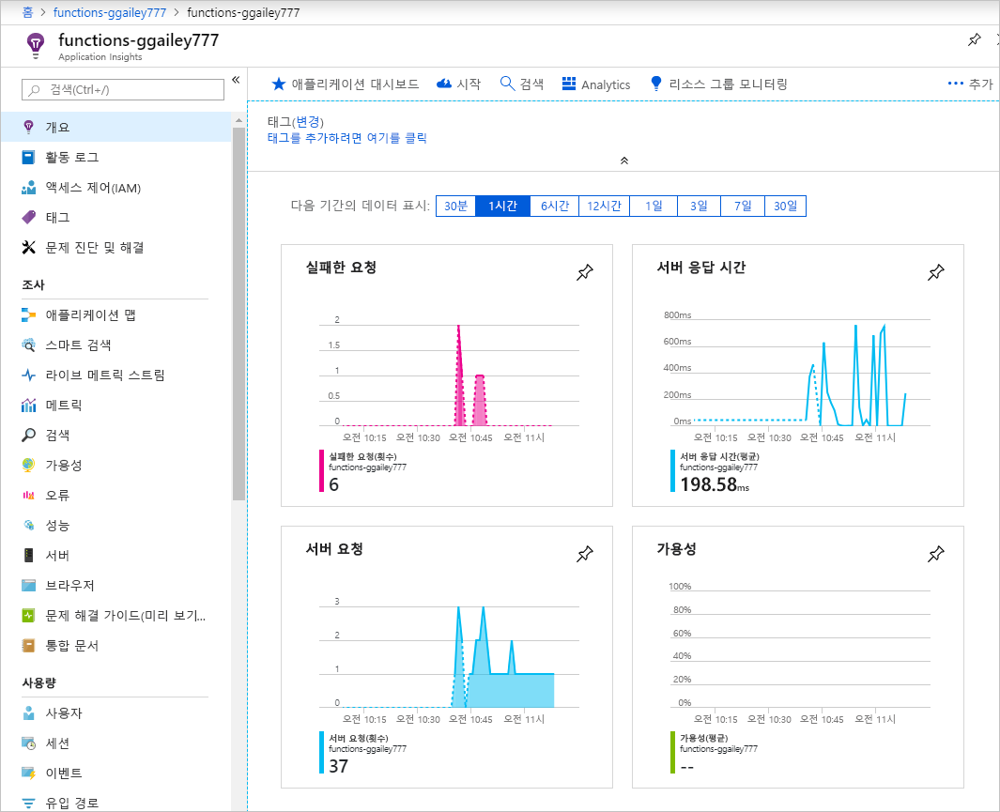
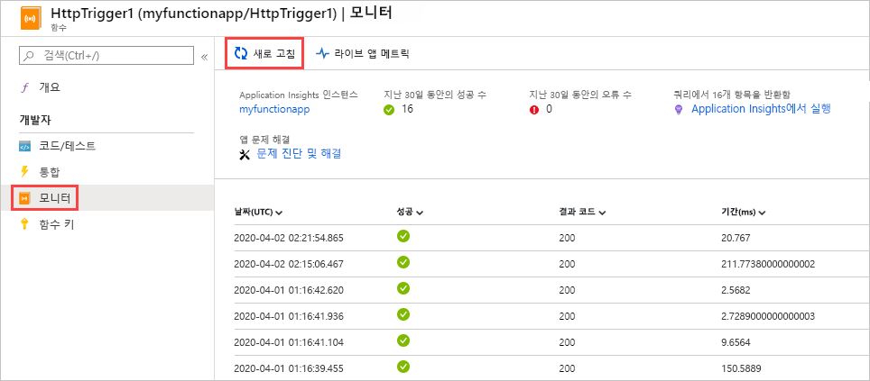
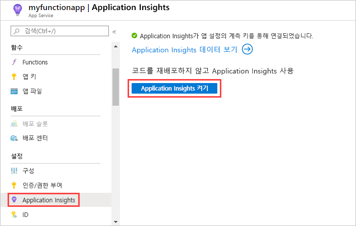
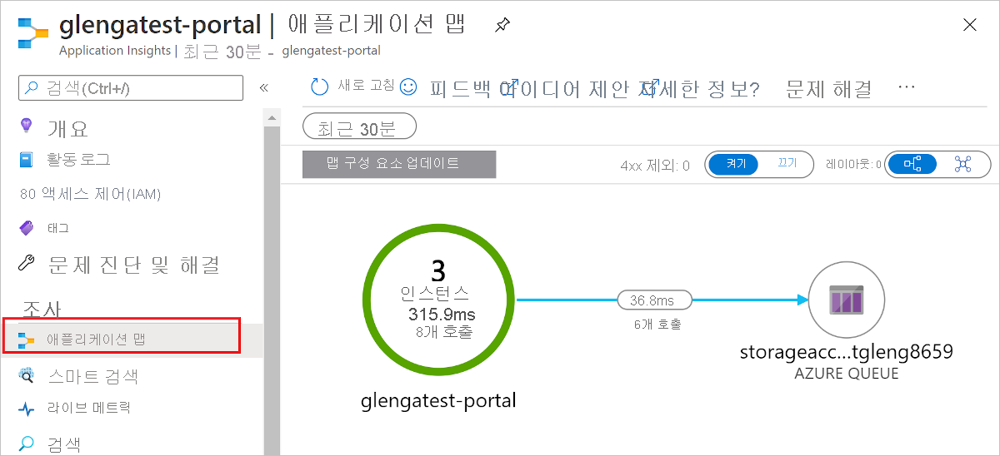

# <a name="monitor-azure-functions"></a>Azure Functions 모니터링

[Azure Functions](functions-overview.md)는 함수를 모니터링할 수 있도록 [Azure Application Insights](../azure-monitor/app/app-insights-overview.md)와 기본적으로 통합됩니다. 이 문서에서는 Application Insights에 시스템 생성 로그 파일을 보내도록 Functions를 구성하는 방법을 보여줍니다.



Functions도 [Application Insights를 사용하지 않는 기본 모니터링](#monitoring-without-application-insights)을 제공합니다. 더 많은 데이터와 보다 나은 데이터 분석 방법을 제공하는 Application Insights를 권장합니다.

## <a name="application-insights-pricing-and-limits"></a>Application Insights 가격 책정 및 제한

무료로 함수 앱과 Application Insights 통합을 사용해 볼 수 있습니다. 그러나 무료로 처리될 수 있는 데이터 크기에 대한 일일 제한이 있으며 테스트하는 동안 해당 제한에 도달할 수 있습니다. Azure는 일일 한도에 가까워지면 포털 및 이메일 알림을 제공합니다.  그렇지만 이러한 경고를 놓치고 제한에 도달하면 Application Insights 쿼리에 새 로그가 표시되지 않습니다. 따라서 불필요한 문제 해결 시간을 방지하려면 이러한 제한을 잘 알고 있어야 합니다. 자세한 내용은 [Application Insights에서 가격 책정 및 데이터 볼륨 관리](../azure-monitor/app/pricing.md)를 참조하세요.

## <a name="enable-app-insights-integration"></a>App Insights 통합 사용

함수 앱이 Application Insights로 데이터를 보내려면 Application Insights 리소스의 계측 키를 알고 있어야 합니다. 이 키는 **APPINSIGHTS_INSTRUMENTATIONKEY**라는 앱 설정에 있어야 합니다.

[Azure Portal](https://portal.azure.com)에서 다음 방법으로 이 연결을 설정할 수 있습니다.

* [새 함수 앱에 대해 자동으로](#new-function-app)
* [App Insights 리소스를 수동으로 연결](#manually-connect-an-app-insights-resource)

### <a name="new-function-app"></a>새 함수 앱

1. 함수 앱의 **만들기** 페이지로 이동합니다.

1. **Application Insights** 스위치를 **켜기**로 설정합니다.

1. **Application Insights 위치**를 선택합니다. [Azure 지리적 위치](https://azure.microsoft.com/global-infrastructure/geographies/)에서 사용자의 함수 앱 지역에 가장 가까우면서 데이터를 저장할 지역을 선택합니다.

   

1. 필요한 다른 정보를 입력하고 **만들기**를 선택합니다.

다음 단계는 [기본 제공 로깅을 사용하지 않도록 설정](#disable-built-in-logging)하는 것입니다.

### <a name="manually-connect-an-app-insights-resource"></a>App Insights 리소스를 수동으로 연결 

1. Application Insights 리소스를 만듭니다. 애플리케이션 형식을 **일반**으로 설정합니다.

   

1. Application Insights 리소스의 **Essentials** 페이지에서 계측 키를 복사합니다. 표시된 키 값의 맨 뒤에 마우스를 가져가서 **복사하려면 클릭** 단추를 불러옵니다.

   

1. 함수 앱의 **애플리케이션 설정** 페이지에서 [새 설정 추가](functions-how-to-use-azure-function-app-settings.md#settings)를 클릭하여 **새 설정을 추가**합니다. 새 설정의 이름을 APPINSIGHTS_INSTRUMENTATIONKEY로 지정하고 복사한 계측 키를 붙여넣습니다.

   

1. **저장**을 클릭합니다.

## <a name="disable-built-in-logging"></a>기본 제공 로깅을 사용하지 않도록 설정

Application Insight를 사용하도록 설정하면 [Azure Storage를 사용하는 기본 제공 로깅](#logging-to-storage)을 사용하지 않도록 설정하십시오. 기본 제공 로깅은 가벼운 워크로드를 테스트하기에 유용하지만 부하가 높은 프로덕션 용도로는 적합하지 않습니다. 프로덕션 모니터링에는 Application Insights를 사용하는 것이 좋습니다. 프로덕션에 기본 제공 로깅이 사용되면 Azure Storage의 제한으로 인해 로깅 레코드가 불완전할 수 있습니다.

기본 제공 로깅을 사용하지 않도록 설정하려면 `AzureWebJobsDashboard` 앱 설정을 삭제합니다. Azure Portal에서 앱 설정을 삭제하는 방법에 대한 자세한 내용은 [함수 앱을 관리하는 방법](functions-how-to-use-azure-function-app-settings.md#settings)의 **애플리케이션 설정** 섹션을 참조하세요. 앱 설정을 삭제하기 전에 동일한 함수 앱에 Azure Storage 트리거 또는 바인딩을 위해 해당 설정을 사용하는 기존 함수가 없는지 확인합니다.

## <a name="view-telemetry-in-monitor-tab"></a>모니터 탭에서 원격 분석 보기

이전 섹션에 나와 있는 것처럼 Application Insights 통합을 설정한 후에 **모니터** 탭에서 원격 분석 데이터를 볼 수 있습니다.

1. 함수 앱 페이지에서 Application Insights가 구성된 후 1번 이상 실행된 함수를 선택하고 **모니터** 탭을 선택합니다.

   

1. 함수 호출 목록이 나타날 때까지 **새로 고침**을 주기적으로 선택합니다.

   원격 분석 클라이언트 일괄 처리 데이터가 서버에 전송되기 때문에 이 목록이 표시되는 데 최대 5분 정도 걸릴 수 있습니다. (이러한 지연 시간이 [라이브 메트릭 스트림](../azure-monitor/app/live-stream.md)에는 적용되지 않습니다. 해당 서비스는 페이지를 로드할 때 함수 호스트에 연결되므로 로그가 페이지에 직접 스트리밍됩니다.)

   

1. 특정 함수 호출에 대한 로그를 보려면 해당 호출에 대한 **날짜** 열 링크를 선택합니다.

   

   해당 호출에 대한 로깅 출력이 새 페이지에 나타납니다.

   

두 페이지(호출 목록 및 호출 정보) 모두 데이터를 검색하는 Application Insights 분석 쿼리에 연결됩니다.


이러한 쿼리에서 호출 목록은 마지막 30일까지 20개 이하의 행으로 제한되며(`where timestamp > ago(30d) | take 20`) 호출 정보 목록은 마지막 30일 동안 제한이 없습니다.

자세한 내용은 이 문서의 뒷부분에 나오는 [원격 분석 데이터 쿼리](#query-telemetry-data)를 참조하세요.

## <a name="view-telemetry-in-app-insights"></a>App Insights에서 원격 분석 보기

Azure Portal의 함수 앱에서 Application Insights를 열려면 함수 앱의 **개요** 페이지에서 **구성된 기능** 섹션에 있는 **Application Insights** 링크를 선택합니다.



Application Insights 사용 방법에 대한 자세한 내용은 [Application Insights 설명서](https://docs.microsoft.com/azure/application-insights/)를 참조하세요. 이 섹션에서는 Application Insights에서 데이터를 보는 방법에 대한 몇 가지 예를 보여줍니다. 이미 Application Insights에 익숙한 경우 [원격 분석 데이터 구성 및 사용자 지정에 대한 섹션](#configure-categories-and-log-levels)으로 바로 넘어가도 됩니다.

[메트릭 탐색기](../azure-monitor/app/metrics-explorer.md)에서는 함수 호출 수, 실행 시간, 성공률 등의 메트릭을 기반으로 차트와 경고를 만들 수 있습니다.


[오류](../azure-monitor/app/asp-net-exceptions.md) 탭에서 함수 오류 및 서버 예외를 기반으로 차트와 경고를 만들 수 있습니다. **작업 이름**은 함수 이름입니다. 종속성에 대한 [사용자 지정 원격 분석](#custom-telemetry-in-c-functions)을 구현하지 않으면 종속성 오류가 표시되지 않습니다.


[성능](../azure-monitor/app/performance-counters.md) 탭에서 성능 문제를 분석할 수 있습니다.


**서버** 탭에는 서버당 리소스 사용률 및 처리량이 표시됩니다. 이 데이터는 함수 때문에 기본 리소스가 정체되는 시나리오를 디버깅하는 데 유용할 수 있습니다. 서버를 **클라우드 역할 인스턴스**라고도 합니다.


[라이브 메트릭 스트림](../azure-monitor/app/live-stream.md) 탭에는 실시간으로 생성되는 메트릭 데이터가 표시됩니다.


## <a name="query-telemetry-data"></a>원격 분석 데이터 쿼리

[Application Insights Analytics](../azure-monitor/app/analytics.md)를 사용하면 모든 원격 분석 데이터를 데이터베이스의 테이블 형태로 사용할 수 있습니다. Analytics는 데이터를 추출, 조작 및 시각화하는 쿼리 언어를 제공합니다.


다음 쿼리 예제는 지난 30분간의 작업자당 요청 분포를 보여줍니다.

```
requests
| where timestamp > ago(30m) 
| summarize count() by cloud_RoleInstance, bin(timestamp, 1m)
| render timechart
```

사용할 수 있는 테이블은 왼쪽 창의 **스키마** 탭에 표시되어 있습니다. 다음 테이블에서 함수 호출에 의해 생성된 데이터를 찾을 수 있습니다.

* **traces** - 런타임 및 함수 코드에 의해 생성된 로그입니다.
* **requests** - 각 함수 호출에 대한 요청입니다.
* **exceptions** - 런타임에 의해 throw되는 예외입니다.
* **customMetrics** - 성공 및 실패 호출의 수, 성공률 및 기간입니다.
* **customEvents** - 런타임에서 추적된 이벤트, 예를 들어 다음과 같습니다.  함수를 트리거하는 HTTP 요청
* **performanceCounters** - 함수가 실행되고 있는 서버의 성능에 대한 정보입니다.

나머지 테이블은 가용성 테스트 및 클라이언트/브라우저 원격 분석용입니다. 사용자 지정 원격 분석을 구현하여 테이블에 데이터를 추가할 수 있습니다.

각 테이블 내에서 일부 Functions 관련 데이터는 `customDimensions` 필드에 있습니다.  예를 들어 다음 쿼리는 로그 수준이 `Error`인 모든 추적을 검색합니다.

```
traces 
| where customDimensions.LogLevel == "Error"
```

런타임은 `customDimensions.LogLevel` 및 `customDimensions.Category`를 제공합니다. 함수 코드에서 작성하는 로그에 추가 필드를 제공할 수 있습니다. 이 문서 뒷부분의 [구조적 로깅](#structured-logging)을 참조하세요.

## <a name="configure-categories-and-log-levels"></a>범주 및 로그 수준 구성

Application Insights를 사용자 지정 구성 없이 사용할 수 있지만, 기본 구성을 사용하면 데이터 볼륨이 커질 수 있습니다. Visual Studio Azure 구독을 사용하는 경우 Application Insights에 대한 데이터 제한에 도달할 수 있습니다. 이 문서의 나머지 부분에서는 함수가 Application Insights로 보내는 데이터를 구성 및 사용자 지정하는 방법을 보여줍니다.

### <a name="categories"></a>범주

Azure Functions 로거에는 모든 로그에 대한 *범주*가 포함되어 있습니다. 범주는 런타임 코드 또는 함수 코드의 어느 부분이 로그를 작성했는지를 나타냅니다. 

Functions 런타임은 범주가 "Host"로 시작하는 로그를 만듭니다. 예를 들어 "function started", "function executed", "function completed" 로그의 범주는 "Host.Executor"입니다. 

함수 코드에 로그를 기록하는 경우 범주는 "Function"입니다.

### <a name="log-levels"></a>로그 수준

Azure Functions 로거에는 모든 로그와 함께 *로그 수준*도 포함되어 있습니다. [LogLevel](/dotnet/api/microsoft.extensions.logging.loglevel)은 열거형이며, 정수 코드는 상대적 중요도를 나타냅니다.

|LogLevel    |코드|
|------------|---|
|추적       | 0 |
|디버그       | 1 |
|정보 | 2 |
|Warning     | 3 |
|오류       | 4 |
|중요    | 5 |
|없음        | 6 |

로그 수준 `None`은 다음 섹션에 설명되어 있습니다. 

### <a name="configure-logging-in-hostjson"></a>host.json에서 로깅 구성

*[host.json](functions-host-json.md)* 파일은 함수 앱이 Application Insights로 보내는 로깅의 양을 구성합니다. 각 범주에 대해 보낼 최소 로그 수준을 나타낼 수 있습니다. 두 가지 예제가 있으며, 한 가지는 [Functions 버전 2.x 런타임](functions-versions.md#version-2x)(.NET Core)을 대상으로 하고 나머지는 버전 1.x 런타임을 대상으로 합니다.

### <a name="version-2x"></a>버전 2.x

v2.x 런타임은 [.NET Core 로깅 필터 계층 구조](https://docs.microsoft.com/aspnet/core/fundamentals/logging/?view=aspnetcore-2.1#log-filtering)를 사용합니다. 

```json
{
  "logging": {
    "fileLoggingMode": "always",
    "logLevel": {
      "default": "Information",
      "Host.Results": "Error",
      "Function": "Error",
      "Host.Aggregator": "Trace"
    }
  }
}
```

### <a name="version-1x"></a>버전 1.x

```json
{
  "logger": {
    "categoryFilter": {
      "defaultLevel": "Information",
      "categoryLevels": {
        "Host.Results": "Error",
        "Function": "Error",
        "Host.Aggregator": "Trace"
      }
    }
  }
}
```

이 예제에서는 다음 규칙을 설정합니다.

1. `Host.Results`**` or `**`Function` 범주의 로그는 `Error` 수준 이상만 Application Insights로 보냅니다. `Warning` 수준 이하 로그는 무시됩니다.
2. `Host.Aggregator` 범주의 로그는 모든 로그를 Application Insights로 보냅니다. `Trace` 로그 수준은 `Verbose`를 호출하는 일부 로거와 동일하지만, [host.json](functions-host-json.md) 파일의 `Trace`를 사용합니다.
3. 그 외의 로그는 `Information` 수준 이상만 Application Insights로 보냅니다.

[host.json](functions-host-json.md)의 범주 값은 같은 값으로 시작하는 모든 범주에 대한 로깅을 제어합니다. 예를 들어, [host.json](functions-host-json.md)의 `Host`는 `Host.General`, `Host.Executor`, `Host.Results` 등에 대한 로깅을 제어합니다.

[host.json](functions-host-json.md)에 동일한 문자열로 시작되는 여러 범주가 포함된 경우 길이가 더 긴 범주가 먼저 일치합니다. 예를 들어 `Host.Aggregator`를 제외한 런타임의 모든 항목을 `Error` 수준에서 기록하지만, `Host.Aggregator`는 `Information` 수준에서 기록한다고 가정해 봅니다.

### <a name="version-2x"></a>버전 2.x 

```json
{
  "logging": {
    "fileLoggingMode": "always",
    "logLevel": {
      "default": "Information",
      "Host": "Error",
      "Function": "Error",
      "Host.Aggregator": "Information"
    }
  }
}
```

### <a name="version-1x"></a>버전 1.x 

```json
{
  "logger": {
    "categoryFilter": {
      "defaultLevel": "Information",
      "categoryLevels": {
        "Host": "Error",
        "Function": "Error",
        "Host.Aggregator": "Information"
      }
    }
  }
}
```

한 범주의 모든 로그를 표시하지 않으려면 로그 수준 `None`을 사용하면 됩니다. 해당 범주에 속하는 로그가 하나도 작성되지 않으며 이보다 높은 로그 수준은 없습니다.

다음 섹션에서는 런타임에서 만드는 주요 로그 범주에 대해 설명합니다. 

### <a name="category-hostresults"></a>범주 Host.Results

이러한 로그는 Application Insights에 "requests"로 표시됩니다. 함수의 성공 또는 실패를 나타냅니다.


이러한 로그는 `Information` 수준에서 작성되므로 `Warning` 이상에서 필터링하면 이 데이터가 표시되지 않습니다.

### <a name="category-hostaggregator"></a>범주 Host.Aggregator

이러한 로그는 [구성 가능한](#configure-the-aggregator) 기간 동안의 함수 호출 수 및 평균을 제공합니다. 기본 기간은 30초 또는 결과 1,000개 중 먼저 도착하는 것입니다. 

로그는 Application Insights의 **customMetrics** 테이블에서 제공합니다. 실행 수, 성공률 및 기간을 예로 들 수 있습니다.


이러한 로그는 `Information` 수준에서 작성되므로 `Warning` 이상에서 필터링하면 이 데이터가 표시되지 않습니다.

### <a name="other-categories"></a>기타 범주

이미 나열된 범주 이외의 범주에 대한 모든 로그는 Application Insights의 **traces** 테이블에서 제공합니다.


범주가 "Host"로 시작하는 모든 로그는 Functions 런타임에서 작성됩니다. "Function started" 및 "Function completed" 로그의 범주는 "Host.Executor"입니다. 성공적인 실행의 경우 이러한 로그가 `Information` 수준이고 예외는 `Error` 수준에서 기록됩니다. 런타임에서 `Warning` 수준 로그도 작성하며, 포이즌 큐로 전송된 큐 메시지를 예로 들 수 있습니다.

함수 코드에 의해 기록된 로그의 경우 범주는 "Function"이고 로그 수준은 어떤 것이라도 가능합니다.

## <a name="configure-the-aggregator"></a>수집기 구성

이전 섹션에서 언급했듯이, 런타임은 일정 기간 동안 함수 실행에 대한 데이터를 집계합니다. 기본 기간은 30초 또는 실행 1,000개 중 먼저 도착하는 것입니다. [host.json](functions-host-json.md) 파일에서 이 설정을 구성할 수 있습니다.  예를 들면 다음과 같습니다.

```json
{
    "aggregator": {
      "batchSize": 1000,
      "flushTimeout": "00:00:30"
    }
}
```

## <a name="configure-sampling"></a>샘플링 구성

Application Insights에는 최대 부하 시 원격 분석 데이터를 너무 많이 생성하지 않도록 보호하는 [샘플링](../azure-monitor/app/sampling.md) 기능이 포함되어 있습니다. 들어오는 원격 분석 비율이 지정된 임계값을 초과하면 Application Insights는 들어오는 항목 중 일부를 임의로 무시하기 시작합니다. 초당 항목의 최대 수에 대한 기본 설정은 5입니다. [host.json](functions-host-json.md)에서 샘플링을 구성할 수 있습니다.  예를 들면 다음과 같습니다.

### <a name="version-2x"></a>버전 2.x 

```json
{
  "logging": {
    "applicationInsights": {
      "samplingSettings": {
        "isEnabled": true,
        "maxTelemetryItemsPerSecond" : 5
      }
    }
  }
}
```

### <a name="version-1x"></a>버전 1.x 

```json
{
  "applicationInsights": {
    "sampling": {
      "isEnabled": true,
      "maxTelemetryItemsPerSecond" : 5
    }
  }
}
```

> [!NOTE]
> [샘플링](../azure-monitor/app/sampling.md)은 기본적으로 사용하도록 설정됩니다. 데이터가 누락된 것 같으면 샘플링 설정을 특정 모니터링 시나리오에 맞게 조정하면 됩니다.

## <a name="write-logs-in-c-functions"></a>C# 함수로 로그 작성

Application Insights에서 traces로 표시되는 로그를 함수 코드로 작성할 수 있습니다.

### <a name="ilogger"></a>ILogger

함수에 `TraceWriter` 매개 변수 대신 [ILogger](https://docs.microsoft.com/dotnet/api/microsoft.extensions.logging.ilogger) 매개 변수를 사용합니다. `TraceWriter`를 사용하여 생성된 로그는 Application Insights로 이동하지만, `ILogger`를 사용하여 [구조적 로깅](https://softwareengineering.stackexchange.com/questions/312197/benefits-of-structured-logging-vs-basic-logging)을 수행할 수 있습니다.

`ILogger` 개체를 사용하여 로그를 생성하는 `Log<level>` [ILogger의 확장 메서드](https://docs.microsoft.com/dotnet/api/microsoft.extensions.logging.loggerextensions#methods)를 호출합니다. 예를 들어 다음 코드는 범주가 "Function"인 `Information` 로그를 작성합니다.

```cs
public static async Task<HttpResponseMessage> Run(HttpRequestMessage req, ILogger logger)
{
    logger.LogInformation("Request for item with key={itemKey}.", id);
```

### <a name="structured-logging"></a>구조적 로깅

이름이 아닌 자리 표시자는 로그 메시지에 사용되는 매개 변수를 결정합니다. 예를 들어 다음과 같은 코드가 있다고 가정하겠습니다.

```csharp
string partitionKey = "partitionKey";
string rowKey = "rowKey";
logger.LogInformation("partitionKey={partitionKey}, rowKey={rowKey}", partitionKey, rowKey);
```

메시지 문자열을 동일하게 유지하고 매개 변수의 순서를 반대로 바꾸면 그 결과 메시지 텍스트가 잘못된 위치에서 값을 갖습니다.

구조적 로깅을 수행할 수 있도록 자리 표시자는 이러한 방식으로 처리됩니다. Application Insights는 메시지 문자열 외에도 매개 변수 이름-값 쌍을 저장합니다. 그 결과로 메시지 인수는 사용자가 쿼리할 수 있는 필드가 됩니다.

예를 들어 로거 메서드 호출이 이전 예제와 같은 경우 `customDimensions.prop__rowKey` 필드를 쿼리할 수 있습니다. 런타임에서 추가하는 필드와 함수 코드에서 추가하는 필드가 서로 충돌하지 않도록 `prop__` 접두사가 추가됩니다.

`customDimensions.prop__{OriginalFormat}` 필드를 참조하여 원래 메시지 문자열을 쿼리할 수도 있습니다.  

다음은 `customDimensions` 데이터의 샘플 JSON 표현입니다.

```json
{
  customDimensions: {
    "prop__{OriginalFormat}":"C# Queue trigger function processed: {message}",
    "Category":"Function",
    "LogLevel":"Information",
    "prop__message":"c9519cbf-b1e6-4b9b-bf24-cb7d10b1bb89"
  }
}
```

### <a name="logging-custom-metrics"></a>사용자 지정 메트릭 로깅  

C# 스크립트 함수에서, `ILogger`에 `LogMetric` 확장 메서드를 사용하여 Application Insights에 사용자 지정 메트릭을 만들 수 있습니다. 다음은 샘플 메서드 호출입니다.

```csharp
logger.LogMetric("TestMetric", 1234);
```

이 코드는 [.NET용 Application Insights API](#custom-telemetry-in-c-functions)를 사용하여 `TrackMetric`을 호출하는 대안입니다.

## <a name="write-logs-in-javascript-functions"></a>JavaScript 함수로 로그 작성

Node.js 함수에서는 `context.log`를 사용하여 로그를 작성합니다. 구조적 로깅은 사용되지 않습니다.

```
context.log('JavaScript HTTP trigger function processed a request.' + context.invocationId);
```

### <a name="logging-custom-metrics"></a>사용자 지정 메트릭 로깅  

Functions 런타임 [1.x 버전](functions-versions.md#creating-1x-apps)을 실행 중인 경우 Node.js는 `context.log.metric` 메서드를 사용하여 Application Insights에 사용자 지정 메트릭을 만들 수 있습니다. 이 메서드는 현재 2.x 버전에서 지원되지 않습니다. 다음은 샘플 메서드 호출입니다.

```javascript
context.log.metric("TestMetric", 1234);
```

이 코드는 [Application Insights용 Node.js SDK](#custom-telemetry-in-javascript-functions)를 사용하여 `trackMetric`을 호출하는 대안입니다.

## <a name="custom-telemetry-in-c-functions"></a>C# 함수의 사용자 지정 원격 분석

[Microsoft.ApplicationInsights](https://www.nuget.org/packages/Microsoft.ApplicationInsights/) NuGet 패키지를 사용하여 Application Insights로 사용자 지정 원격 분석 데이터를 보낼 수 있습니다. 다음 C# 예제에는 [사용자 지정 원격 분석 API](../azure-monitor/app/api-custom-events-metrics.md)가 사용됩니다. 이 예제는 .NET 클래스 라이브러리용이지만 Application Insights 코드는 C# 스크립트와 동일합니다.

### <a name="version-2x"></a>버전 2.x

버전 2.x 런타임에는 원격 분석 데이터와 현재 작업에 자동으로 상관 관계를 지정하는 Application Insights의 새로운 기능이 사용됩니다. `Id`, `ParentId`, 또는 `Name` 작업을 수동으로 설정할 필요가 없습니다.

```cs
using System;
using System.Linq;
using System.Threading.Tasks;
using Microsoft.ApplicationInsights;
using Microsoft.ApplicationInsights.DataContracts;
using Microsoft.AspNetCore.Http;
using Microsoft.AspNetCore.Mvc;
using Microsoft.Azure.WebJobs;
using Microsoft.Azure.WebJobs.Extensions.Http;
using Microsoft.Extensions.Logging;

namespace functionapp0915
{
    public static class HttpTrigger2
    {
        // In Functions v2, TelemetryConfiguration.Active is initialized with the InstrumentationKey
        // from APPINSIGHTS_INSTRUMENTATIONKEY. Creating a default TelemetryClient like this will 
        // automatically use that key for all telemetry. It will also enable telemetry correlation
        // with the current operation.
        // If you require a custom TelemetryConfiguration, create it initially with
        // TelemetryConfiguration.CreateDefault() to include this automatic correlation.
        private static TelemetryClient telemetryClient = new TelemetryClient();

        [FunctionName("HttpTrigger2")]
        public static Task<IActionResult> Run(
            [HttpTrigger(AuthorizationLevel.Anonymous, "get", Route = null)]
            HttpRequest req, ExecutionContext context, ILogger log)
        {
            log.LogInformation("C# HTTP trigger function processed a request.");
            DateTime start = DateTime.UtcNow;

            // parse query parameter
            string name = req.Query
                .FirstOrDefault(q => string.Compare(q.Key, "name", true) == 0)
                .Value;

            // Track an Event
            var evt = new EventTelemetry("Function called");
            evt.Context.User.Id = name;
            telemetryClient.TrackEvent(evt);

            // Track a Metric
            var metric = new MetricTelemetry("Test Metric", DateTime.Now.Millisecond);
            metric.Context.User.Id = name;
            telemetryClient.TrackMetric(metric);

            // Track a Dependency
            var dependency = new DependencyTelemetry
            {
                Name = "GET api/planets/1/",
                Target = "swapi.co",
                Data = "https://swapi.co/api/planets/1/",
                Timestamp = start,
                Duration = DateTime.UtcNow - start,
                Success = true
            };
            dependency.Context.User.Id = name;
            telemetryClient.TrackDependency(dependency);

            return Task.FromResult<IActionResult>(new OkResult());
        }
    }
}
```

### <a name="version-1x"></a>버전 1.x

```cs
using System;
using System.Net;
using Microsoft.ApplicationInsights;
using Microsoft.ApplicationInsights.DataContracts;
using Microsoft.ApplicationInsights.Extensibility;
using Microsoft.Azure.WebJobs;
using System.Net.Http;
using System.Threading.Tasks;
using Microsoft.Azure.WebJobs.Extensions.Http;
using Microsoft.Extensions.Logging;
using System.Linq;

namespace functionapp0915
{
    public static class HttpTrigger2
    {
        private static string key = TelemetryConfiguration.Active.InstrumentationKey = 
            System.Environment.GetEnvironmentVariable(
                "APPINSIGHTS_INSTRUMENTATIONKEY", EnvironmentVariableTarget.Process);

        private static TelemetryClient telemetryClient = 
            new TelemetryClient() { InstrumentationKey = key };

        [FunctionName("HttpTrigger2")]
        public static async Task<HttpResponseMessage> Run(
            [HttpTrigger(AuthorizationLevel.Anonymous, "get", "post", Route = null)]
            HttpRequestMessage req, ExecutionContext context, ILogger log)
        {
            log.LogInformation("C# HTTP trigger function processed a request.");
            DateTime start = DateTime.UtcNow;

            // parse query parameter
            string name = req.GetQueryNameValuePairs()
                .FirstOrDefault(q => string.Compare(q.Key, "name", true) == 0)
                .Value;

            // Get request body
            dynamic data = await req.Content.ReadAsAsync<object>();

            // Set name to query string or body data
            name = name ?? data?.name;
         
            // Track an Event
            var evt = new EventTelemetry("Function called");
            UpdateTelemetryContext(evt.Context, context, name);
            telemetryClient.TrackEvent(evt);
            
            // Track a Metric
            var metric = new MetricTelemetry("Test Metric", DateTime.Now.Millisecond);
            UpdateTelemetryContext(metric.Context, context, name);
            telemetryClient.TrackMetric(metric);
            
            // Track a Dependency
            var dependency = new DependencyTelemetry
                {
                    Name = "GET api/planets/1/",
                    Target = "swapi.co",
                    Data = "https://swapi.co/api/planets/1/",
                    Timestamp = start,
                    Duration = DateTime.UtcNow - start,
                    Success = true
                };
            UpdateTelemetryContext(dependency.Context, context, name);
            telemetryClient.TrackDependency(dependency);
        }
        
        // This correllates all telemetry with the current Function invocation
        private static void UpdateTelemetryContext(TelemetryContext context, ExecutionContext functionContext, string userName)
        {
            context.Operation.Id = functionContext.InvocationId.ToString();
            context.Operation.ParentId = functionContext.InvocationId.ToString();
            context.Operation.Name = functionContext.FunctionName;
            context.User.Id = userName;
        }
    }    
}
```

`TrackRequest` 또는 `StartOperation<RequestTelemetry>`를 호출하지 마세요. 함수 호출에 대한 중복 요청이 표시됩니다.  Functions 런타임에서 자동으로 요청을 추적합니다.

`telemetryClient.Context.Operation.Id`를 설정하지 마십시오. 이 설정은 글로벌 설정이며 많은 함수가 동시에 실행되면 잘못된 상관 관계를 유발합니다. 대신 새로운 원격 분석 인스턴스(`DependencyTelemetry`, `EventTelemetry`)를 만들고 해당하는 `Context` 속성을 수정합니다. 그런 다음, 원격 분석 인스턴스를 `TelemetryClient`의 해당 `Track` 메서드(`TrackDependency()`, `TrackEvent()`)로 전달합니다. 이렇게 하면 원격 분석 데이터가 현재 함수 호출에 대해 올바른 상관 관계 세부 정보를 가질 수 있습니다.

## <a name="custom-telemetry-in-javascript-functions"></a>JavaScript 함수의 사용자 지정 원격 분석

[Application Insights Node.js SDK](https://www.npmjs.com/package/applicationinsights)는 현재 베타 버전입니다. 다음은 Application Insights에 사용자 지정 원격 분석을 보내는 몇 가지 샘플 코드입니다.

```javascript
const appInsights = require("applicationinsights");
appInsights.setup();
const client = appInsights.defaultClient;

module.exports = function (context, req) {
    context.log('JavaScript HTTP trigger function processed a request.');

    client.trackEvent({name: "my custom event", tagOverrides:{"ai.operation.id": context.invocationId}, properties: {customProperty2: "custom property value"}});
    client.trackException({exception: new Error("handled exceptions can be logged with this method"), tagOverrides:{"ai.operation.id": context.invocationId}});
    client.trackMetric({name: "custom metric", value: 3, tagOverrides:{"ai.operation.id": context.invocationId}});
    client.trackTrace({message: "trace message", tagOverrides:{"ai.operation.id": context.invocationId}});
    client.trackDependency({target:"http://dbname", name:"select customers proc", data:"SELECT * FROM Customers", duration:231, resultCode:0, success: true, dependencyTypeName: "ZSQL", tagOverrides:{"ai.operation.id": context.invocationId}});
    client.trackRequest({name:"GET /customers", url:"http://myserver/customers", duration:309, resultCode:200, success:true, tagOverrides:{"ai.operation.id": context.invocationId}});

    context.done();
};
```

`tagOverrides` 매개 변수는 `operation_Id`를 함수의 호출 ID로 설정합니다. 이 설정을 사용하면 특정 함수 호출에 대해 자동으로 생성된 모든 원격 분석 데이터와 사용자 지정 원격 분석의 상관 관계를 지정할 수 있습니다.

## <a name="known-issues"></a>알려진 문제

### <a name="dependencies"></a>종속성

함수가 다른 서비스에 대해 가져야 하는 종속성이 자동으로 표시되지는 않지만 종속성을 표시하는 사용자 지정 코드를 작성할 수 있습니다. [C# 사용자 지정 원격 분석 섹션](#custom-telemetry-in-c-functions)의 샘플 코드에 방법이 나와 있습니다. 샘플 코드의 결과는 다음과 같은 Application Insights의 *애플리케이션 맵*입니다.



### <a name="report-issues"></a>문제 보고

Application Insights의 Functions 통합 문제를 보고하거나 제안 사항 또는 요청 사항을 보내려면 [GitHub에서 문제를 만듭니다](https://github.com/Azure/Azure-Functions/issues/new).

## <a name="monitoring-without-application-insights"></a>Application Insights 없이 모니터링

함수 모니터링에는 Application Insights를 권장합니다. 더 많은 데이터와 보다 나은 데이터 분석 방법을 제공하기 때문입니다. 그러나 Azure Storage를 사용하는 기본 제공 로깅 시스템을 선호하는 경우 해당 방식을 계속 사용할 수 있습니다.

### <a name="logging-to-storage"></a>저장소에 로깅

기본 로깅은 `AzureWebJobsDashboard` 앱 설정의 연결 문자열에 지정된 저장소 계정을 사용합니다. 함수 앱 페이지에서 함수를 선택한 다음 **모니터** 탭을 선택하고 클래식 보기를 유지하도록 선택합니다.


 함수는 실행 목록이 표시됩니다. 함수 실행을 선택하면 기간, 입력 데이터, 오류 및 관련 로그 파일을 검토할 수 있습니다.

이전에 Application Insights를 사용하도록 설정했으나 지금은 기본 제공 로깅으로 돌아가려는 경우 Application Insights을 수동으로 사용하지 않도록 설정한 후 **모니터** 탭을 선택합니다. Application Insights 통합을 사용하지 않도록 설정하려면 APPINSIGHTS_INSTRUMENTATIONKEY 앱 설정을 삭제합니다.

**모니터** 탭에 Application Insights 데이터가 표시되지만 아직 [기본 제공 로깅을 사용하지 않도록 설정](#disable-built-in-logging)하지 않았으면 로그 데이터를 파일 시스템에서 볼 수 있습니다. Storage 리소스에서 파일로 이동하고 함수에 대한 파일 서비스를 선택한 다음, `LogFiles > Application > Functions > Function > your_function`으로 이동하여 로그 파일을 볼 수 있습니다.

### <a name="real-time-monitoring"></a>실시간 모니터링

[Azure CLI(명령줄 인터페이스)](/cli/azure/install-azure-cli) 또는 [Azure PowerShell](/powershell/azure/overview)을 사용하여 로그 파일을 로컬 워크스테이션의 명령줄 세션으로 스트리밍할 수 있습니다.  

Azure CLI의 경우 다음 명령을 사용하여 로그인하고, 구독을 선택하고, 로그 파일을 스트리밍합니다.

```azurecli
az login
az account list
az account set <subscriptionNameOrId>
az webapp log tail --resource-group <resource group name> --name <function app name>
```

Azure PowerShell의 경우 다음 명령을 사용하여 Azure 계정을 추가하고, 구독을 선택하고, 로그 파일을 스트리밍합니다.

```powershell
PS C:\> Add-AzureAccount
PS C:\> Get-AzureSubscription
PS C:\> Get-AzureSubscription -SubscriptionName "<subscription name>" | Select-AzureSubscription
PS C:\> Get-AzureWebSiteLog -Name <function app name> -Tail
```

자세한 내용은 [로그를 스트리밍하는 방법](../app-service/troubleshoot-diagnostic-logs.md#streamlogs)을 참조하세요.

### <a name="viewing-log-files-locally"></a>로컬로 로그 파일 보기

[!INCLUDE [functions-local-logs-location](../../includes/functions-local-logs-location.md)]

## <a name="next-steps"></a>다음 단계

자세한 내용은 다음 리소스를 참조하세요.

* [Application Insights](/azure/application-insights/)
* [ASP.NET Core 로깅](/aspnet/core/fundamentals/logging/)
