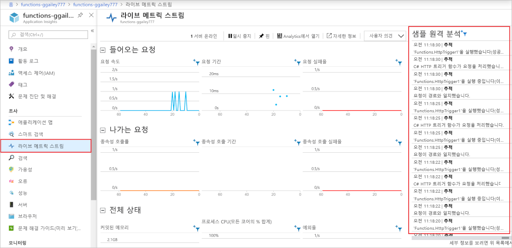

# <a name="monitor-azure-functions"></a>Azure Functions 모니터링

[Azure Functions](functions-overview.md)는 함수를 모니터링할 수 있도록 [Azure Application Insights](../azure-monitor/app/app-insights-overview.md)와 기본적으로 통합됩니다. 이 문서에서는 Application Insights에 시스템 생성 로그 파일을 보내도록 Azure Functions를 구성하는 방법을 보여줍니다.

로그, 성능 및 오류 데이터를 수집하는 Application Insights를 사용하는 것이 좋습니다. 성능 이상을 자동으로 감지하며, 문제를 진단하고 함수가 어떻게 사용되는지 이해할 수 있는 강력한 분석 도구를 포함하고 있습니다. 성능 및 가용성을 지속적으로 향상시킬 수 있도록 설계되었습니다. 로컬 함수 앱 프로젝트를 개발할 때도 Application Insights을 사용할 수 있습니다. 자세한 내용은 [Application Insights란?](../azure-monitor/app/app-insights-overview.md)을 참조하세요.

필요한 Application Insights 계측이 Azure Functions에 기본 제공되므로, 유효한 계측 키만 있으면 함수 앱을 Application Insights 리소스에 연결할 수 있습니다. 계측 키는 Azure에서 함수 앱 리소스를 만들 때 애플리케이션 설정에 추가해야 합니다. 함수 앱에 이 키가 아직 없는 경우 [수동으로 설정](#enable-application-insights-integration)할 수 있습니다.  

## <a name="application-insights-pricing-and-limits"></a>Application Insights 가격 책정 및 제한

무료로 Application Insights를 Azure Functions와 통합하여 사용해 볼 수 있습니다. 하루에 무료로 처리할 수 있는 데이터의 양이 제한되어 있습니다. 테스트 도중 이 제한에 도달할 수 있습니다. Azure는 일일 한도에 가까워지면 포털 및 이메일 알림을 제공합니다. 이러한 경고를 놓치고 제한에 도달하면 Application Insights 쿼리에 새 로그가 표시되지 않습니다. 불필요하게 문제 해결에 시간을 낭비하는 일이 없도록 이러한 제한을 잘 알고 있어야 합니다. 자세한 내용은 [Application Insights에서 가격 책정 및 데이터 볼륨 관리](../azure-monitor/app/pricing.md)를 참조하세요.

> [!IMPORTANT]
> Application Insights에는 최대 부하 시 실행이 완료될 때 원격 분석 데이터를 너무 많이 생성하지 않도록 방지하는 [샘플링](../azure-monitor/app/sampling.md) 기능이 포함되어 있습니다. 샘플링은 기본적으로 사용하도록 설정됩니다. 데이터가 누락된 것 같으면 샘플링 설정을 특정 모니터링 시나리오에 맞게 조정하면 됩니다. 자세한 내용은 [샘플링 구성](#configure-sampling)을 참조하세요.

함수 앱에 사용할 수 있는 Application Insights 기능의 전체 목록은 [Azure Functions에 대한 Application Insights 지원 기능](../azure-monitor/app/azure-functions-supported-features.md)에 자세히 설명되어 있습니다.

## <a name="view-telemetry-in-monitor-tab"></a>모니터 탭에서 원격 분석 보기

[Application Insights 통합을 사용](#enable-application-insights-integration)하면 **모니터링** 탭에서 원격 분석 데이터를 볼 수 있습니다.

1. 함수 앱 페이지에서 Application Insights가 구성된 후 한 번 이상 실행된 함수를 선택합니다. 그런 다음, 왼쪽 창에서 **모니터링**을 선택합니다. 함수 호출 목록이 나타날 때까지 **새로 고침**을 주기적으로 선택합니다.

   

    > [!NOTE]
    > 원격 분석 클라이언트 일괄 처리 데이터가 서버로 전송되기 때문에 이 목록이 표시되는 데 최대 5분 정도 걸릴 수 있습니다. [라이브 메트릭 스트림](../azure-monitor/app/live-stream.md)에는 이러한 지연 시간이 없습니다. 이 서비스는 페이지를 로드할 때 함수 호스트에 연결되므로 로그가 페이지에 직접 스트리밍됩니다.

1. 특정 함수 호출에 대한 로그를 보려면 해당 호출의 **날짜(UTC)** 열 링크를 선택합니다. 해당 호출에 대한 로깅 출력이 새 페이지에 나타납니다.

   

1. Choose **Application Insights에서 실행**을 선택하면 Azure Log에서 Azure Monitor 로그 데이터를 검색하는 쿼리 소스를 볼 수 있습니다. 구독에서 Azure Log Analytics를 처음 사용하는 경우 사용하도록 설정하라는 메시지가 표시됩니다.

1. Log Analytics를 사용하도록 설정하면 다음 쿼리가 표시됩니다. 쿼리 결과가 최근 30일(`where timestamp > ago(30d)`)로 제한되는 것을 볼 수 있습니다. 또한 결과에 20개 이하의 행(`take 20`)이 표시됩니다. 반면, 함수의 호출 세부 정보 목록은 최근 30일의 정보가 제한 없이 제공됩니다.

   

자세한 내용은 이 문서의 뒷부분에 나오는 [원격 분석 데이터 쿼리](#query-telemetry-data)를 참조하세요.

## <a name="view-telemetry-in-application-insights"></a>Application Insights에서 원격 분석 보기

Azure Portal의 함수 앱에서 Application Insights를 열려면 왼쪽 페이지의 **설정**에서 **Application Insights**를 선택합니다. 구독과 함께 Application Insights를 처음 사용하는 경우 사용하도록 설정하라는 메시지가 표시됩니다. **Application Insights 켜기**를 선택하고, 다음 페이지에서 **적용**을 선택합니다.

![함수 앱 [개요] 페이지에서 Application Insights 열기](media/functions-monitoring/ai-link.png)

Application Insights 사용 방법에 대한 자세한 내용은 [Application Insights 설명서](/azure/application-insights/)를 참조하세요. 이 섹션에서는 Application Insights에서 데이터를 보는 방법에 대한 몇 가지 예를 보여줍니다. 이미 Application Insights에 익숙한 경우 [원격 분석 데이터를 구성하고 사용자 지정하는 방법에 대한 섹션](#configure-categories-and-log-levels)으로 바로 넘어가도 됩니다.


함수의 동작, 성능 및 오류를 평가할 때 Application Insights의 다음 영역을 유용하게 사용할 수 있습니다.

| 조사 | Description |
| ---- | ----------- |
| **[실패](../azure-monitor/app/asp-net-exceptions.md)** |  함수 오류 및 서버 예외를 기반으로 차트와 경고를 만듭니다. **작업 이름**은 함수 이름입니다. 종속성에 대한 사용자 지정 원격 분석을 구현하지 않으면 종속성 오류가 표시되지 않습니다. |
| **[성능](../azure-monitor/app/performance-counters.md)** | **클라우드 역할 인스턴스**당 리소스 사용률 및 처리량을 확인하여 성능 문제를 분석합니다. 이 데이터는 함수 때문에 기본 리소스가 정체되는 시나리오를 디버깅하는 데 유용할 수 있습니다. |
| **[메트릭](../azure-monitor/platform/metrics-charts.md)** | 메트릭 기반의 차트 및 경고를 만듭니다. 메트릭에는 함수 호출 수, 실행 시간 및 성공률이 포함됩니다. |
| **[라이브 메트릭](../azure-monitor/app/live-stream.md)** | 거의 실시간으로 생성되는 메트릭 데이터를 봅니다. |

## <a name="query-telemetry-data"></a>원격 분석 데이터 쿼리

[Application Insights Analytics](../azure-monitor/log-query/log-query-overview.md)를 사용하면 데이터베이스의 모든 원격 분석 데이터를 테이블 형식으로 사용할 수 있습니다. Analytics는 데이터를 추출, 조작 및 시각화하는 쿼리 언어를 제공합니다. 

로깅된 이벤트를 살펴보거나 쿼리하려면 **로그**를 선택합니다.


다음 쿼리 예제는 지난 30분간의 작업자당 요청 분포를 보여줍니다.

<pre>
requests
| where timestamp > ago(30m) 
| summarize count() by cloud_RoleInstance, bin(timestamp, 1m)
| render timechart
</pre>

사용할 수 있는 테이블은 왼쪽의 **스키마** 탭에 표시됩니다. 다음 테이블에서 함수 호출에 의해 생성된 데이터를 찾을 수 있습니다.

| 테이블 | Description |
| ----- | ----------- |
| **traces** | 런타임 및 함수 코드에서 작성한 로그입니다. |
| **requests** | 함수가 호출될 때마다 요청 하나입니다. |
| **exceptions** | 런타임에서 throw하는 예외입니다. |
| **customMetrics** | 성공 및 실패 호출의 수, 성공률 및 기간입니다. |
| **customEvents** | 런타임이 추적하는 이벤트. 예: 함수를 트리거하는 HTTP 요청 |
| **performanceCounters** | 함수가 실행되고 있는 서버의 성능에 대한 정보입니다. |

나머지 테이블은 가용성 테스트와 클라이언트/브라우저 원격 분석용입니다. 사용자 지정 원격 분석을 구현하여 테이블에 데이터를 추가할 수 있습니다.

각 테이블 내에서 일부 Functions 관련 데이터는 `customDimensions` 필드에 있습니다.  예를 들어 다음 쿼리는 로그 수준이 `Error`인 모든 추적을 검색합니다.

<pre>
traces 
| where customDimensions.LogLevel == "Error"
</pre>

런타임은 `customDimensions.LogLevel` 및 `customDimensions.Category` 필드를 제공합니다. 함수 코드에서 작성하는 로그에 추가 필드를 제공할 수 있습니다. 이 문서 뒷부분의 [구조적 로깅](#structured-logging)을 참조하세요.

## <a name="configure-categories-and-log-levels"></a>범주 및 로그 수준 구성

사용자 지정 구성 없이 Application Insights를 사용할 수 있습니다. 기본 구성을 사용하면 대량의 데이터가 생성될 수 있습니다. Visual Studio Azure 구독을 사용하는 경우 Application Insights에 대한 데이터 제한에 도달할 수 있습니다. 이 문서의 뒷부분에서는 함수가 Application Insights로 보내는 데이터를 구성 및 사용자 지정하는 방법을 알아봅니다. 함수 앱의 경우 로깅은 [host.json] 파일에서 구성합니다.

### <a name="categories"></a>범주

Azure Functions 로거에는 모든 로그에 대한 *범주*가 포함되어 있습니다. 범주는 런타임 코드 또는 함수 코드의 어느 부분이 로그를 작성했는지를 나타냅니다. 다음 차트에는 런타임에서 만드는 주요 로그 범주가 설명되어 있습니다. 

| Category | Description |
| ----- | ----- | 
| Host.Results | 이러한 로그는 Application Insights에 **requests**로 표시됩니다. 함수의 성공 또는 실패를 나타냅니다. 이러한 로그는 모두 `Information` 수준에서 작성됩니다. `Warning` 이상에서 필터링하면 이 데이터가 표시되지 않습니다. |
| Host.Aggregator | 이러한 로그는 [구성 가능한](#configure-the-aggregator) 기간 동안의 함수 호출 수 및 평균을 제공합니다. 기본 기간은 30초 또는 결과 1,000개 중 먼저 도착하는 것입니다. 로그는 Application Insights의 **customMetrics** 테이블에서 제공합니다. 실행 수, 성공률 및 기간을 예로 들 수 있습니다. 이러한 로그는 모두 `Information` 수준에서 작성됩니다. `Warning` 이상에서 필터링하면 이 데이터가 표시되지 않습니다. |

이 범주 이외의 범주에 대한 모든 로그는 Application Insights의 **traces** 테이블에 제공됩니다.

범주가 `Host`로 시작하는 모든 로그는 Functions 런타임에서 작성합니다. **Function started** 및 **Function completed** 로그의 범주는 `Host.Executor`입니다. 성공한 실행의 로그는 `Information` 수준입니다. 예외는 `Error` 수준에서 로깅됩니다. 런타임에서 `Warning` 수준 로그도 작성하며, 포이즌 큐로 전송된 큐 메시지를 예로 들 수 있습니다.

Functions 런타임은 범주가 "Host"로 시작하는 로그를 만듭니다. 1\.x 버전에서는 `function started`, `function executed` 및 `function completed` 로그의 범주가 `Host.Executor`입니다. 2\.x 버전부터는 이러한 로그에의 범주가 `Function.<YOUR_FUNCTION_NAME>`입니다.

함수 코드에 로그를 기록하는 경우 범주는 `Function.<YOUR_FUNCTION_NAME>.User`이며 로그 수준은 무엇이든 가능합니다. Functions 런타임 버전 1.x에서는 범주가 `Function`입니다.

### <a name="log-levels"></a>로그 수준

Azure Functions 로거에는 모든 로그와 함께 *로그 수준*도 포함되어 있습니다. [LogLevel](/dotnet/api/microsoft.extensions.logging.loglevel)은 열거형이며, 정수 코드는 상대적 중요도를 나타냅니다.

|LogLevel    |코드|
|------------|---|
|추적       | 0 |
|디버그       | 1 |
|정보 | 2 |
|Warning     | 3 |
|Error       | 4 |
|위험    | 5 |
|None        | 6 |

로그 수준 `None`은 다음 섹션에 설명되어 있습니다. 

### <a name="log-configuration-in-hostjson"></a>host.json에서 로그 구성

[host.json] 파일은 함수 앱이 Application Insights로 보내는 로깅의 양을 구성합니다. 각 범주에 대해 보낼 최소 로그 수준을 나타낼 수 있습니다. 두 가지 예제가 있습니다. 첫 번째 예제의 대상은 Functions 런타임 [2.x 이상 버전](functions-versions.md#version-2x)(.NET Core 사용)이고, 두 번째 예제의 대상은 버전 1.x 런타임입니다.

### <a name="version-2x-and-higher"></a>2\.x 이상 버전

v2.x 이상 버전의 Functions 런타임은 [.NET Core 로깅 필터 계층 구조](/aspnet/core/fundamentals/logging/?view=aspnetcore-2.1#log-filtering)를 사용합니다. 

```json
{
  "logging": {
    "fileLoggingMode": "always",
    "logLevel": {
      "default": "Information",
      "Host.Results": "Error",
      "Function": "Error",
      "Host.Aggregator": "Trace"
    }
  }
}
```

### <a name="version-1x"></a>버전 1.x

```json
{
  "logger": {
    "categoryFilter": {
      "defaultLevel": "Information",
      "categoryLevels": {
        "Host.Results": "Error",
        "Function": "Error",
        "Host.Aggregator": "Trace"
      }
    }
  }
}
```

이 예제에서는 다음 규칙을 설정합니다.

* `Host.Results` 또는 `Function` 범주의 로그는 `Error` 수준 이상만 Application Insights로 보냅니다. `Warning` 수준 이하 로그는 무시됩니다.
* `Host.Aggregator` 범주의 로그는 모든 로그를 Application Insights로 보냅니다. `Trace` 로그 수준은 `Verbose`를 호출하는 일부 로거와 동일하지만, [host.json] 파일의 `Trace`를 사용합니다.
* 그 외의 로그는 `Information` 수준 이상만 Application Insights로 보냅니다.

[host.json]의 범주 값은 같은 값으로 시작하는 모든 범주에 대한 로깅을 제어합니다. [host.json]의 `Host`는 `Host.General`, `Host.Executor`, `Host.Results` 등에 대한 로깅을 제어합니다.

[host.json]에 동일한 문자열로 시작되는 여러 범주가 포함된 경우 길이가 더 긴 범주가 먼저 일치합니다. `Host.Aggregator`를 제외한 런타임의 모든 항목을 `Error` 수준에서 기록하지만, `Host.Aggregator`는 `Information` 수준에서 기록한다고 가정해 봅시다.

### <a name="version-2x-and-later"></a>2\.x 이상 버전

```json
{
  "logging": {
    "fileLoggingMode": "always",
    "logLevel": {
      "default": "Information",
      "Host": "Error",
      "Function": "Error",
      "Host.Aggregator": "Information"
    }
  }
}
```

### <a name="version-1x"></a>버전 1.x 

```json
{
  "logger": {
    "categoryFilter": {
      "defaultLevel": "Information",
      "categoryLevels": {
        "Host": "Error",
        "Function": "Error",
        "Host.Aggregator": "Information"
      }
    }
  }
}
```

한 범주의 모든 로그를 표시하지 않으려면 로그 수준 `None`을 사용하면 됩니다. 해당 범주에 속하는 로그가 하나도 작성되지 않으며 이보다 높은 로그 수준은 없습니다.

## <a name="configure-the-aggregator"></a>수집기 구성

이전 섹션에서 언급했듯이, 런타임은 일정 기간 동안 함수 실행에 대한 데이터를 집계합니다. 기본 기간은 30초 또는 실행 1,000개 중 먼저 도착하는 것입니다. [host.json] 파일에서 이 설정을 구성할 수 있습니다.  예를 들면 다음과 같습니다.

```json
{
    "aggregator": {
      "batchSize": 1000,
      "flushTimeout": "00:00:30"
    }
}
```

## <a name="configure-sampling"></a>샘플링 구성

Application Insights에는 최대 부하 시 실행이 완료될 때 원격 분석 데이터를 너무 많이 생성하지 않도록 방지하는 [샘플링](../azure-monitor/app/sampling.md) 기능이 포함되어 있습니다. 들어오는 실행 비율이 지정된 임계값을 초과하면 Application Insights는 들어오는 항목 중 일부를 임의로 무시하기 시작합니다. 초당 최대 실행 수의 기본 설정은 20입니다(1.x 버전은 5). [host.json](./functions-host-json.md#applicationinsights)에서 샘플링을 구성할 수 있습니다.  예를 들면 다음과 같습니다.

### <a name="version-2x-and-later"></a>2\.x 이상 버전

```json
{
  "logging": {
    "applicationInsights": {
      "samplingSettings": {
        "isEnabled": true,
        "maxTelemetryItemsPerSecond" : 20,
        "excludedTypes": "Request"
      }
    }
  }
}
```

버전 2.x에서는 샘플링에서 특정 유형의 원격 분석을 제외할 수 있습니다. 위의 예제에서 형식의 데이터 `Request` 는 샘플링에서 제외 됩니다. 이렇게 하면 *모든* 함수 실행 (요청)이 기록 되 고 다른 유형의 원격 분석은 샘플링 대상이 됩니다.

### <a name="version-1x"></a>버전 1.x 

```json
{
  "applicationInsights": {
    "sampling": {
      "isEnabled": true,
      "maxTelemetryItemsPerSecond" : 5
    }
  }
}
```

## <a name="write-logs-in-c-functions"></a>C# 함수로 로그 작성

Application Insights에서 traces로 표시되는 로그를 함수 코드로 작성할 수 있습니다.

### <a name="ilogger"></a>ILogger

함수에 `TraceWriter` 매개 변수 대신 [ILogger](/dotnet/api/microsoft.extensions.logging.ilogger) 매개 변수를 사용합니다. `TraceWriter`를 사용하여 생성된 로그는 Application Insights로 이동하지만, `ILogger`를 사용하여 [구조적 로깅](https://softwareengineering.stackexchange.com/questions/312197/benefits-of-structured-logging-vs-basic-logging)을 수행할 수 있습니다.

`ILogger` 개체를 사용하여 로그를 생성하는 `Log<level>`[ILogger의 확장 메서드](/dotnet/api/microsoft.extensions.logging.loggerextensions#methods)를 호출합니다. 다음 코드는 범주가 "Function.<YOUR_FUNCTION_NAME>.User"인 `Information` 로그를 작성합니다.

```cs
public static async Task<HttpResponseMessage> Run(HttpRequestMessage req, ILogger logger)
{
    logger.LogInformation("Request for item with key={itemKey}.", id);
```

### <a name="structured-logging"></a>구조적 로깅

이름이 아닌 자리 표시자는 로그 메시지에 사용되는 매개 변수를 결정합니다. 다음과 같은 코드가 있다고 가정하겠습니다.

```csharp
string partitionKey = "partitionKey";
string rowKey = "rowKey";
logger.LogInformation("partitionKey={partitionKey}, rowKey={rowKey}", partitionKey, rowKey);
```

메시지 문자열을 동일하게 유지하고 매개 변수의 순서를 반대로 바꾸면 그 결과 메시지 텍스트가 잘못된 위치에서 값을 갖습니다.

구조적 로깅을 수행할 수 있도록 자리 표시자는 이러한 방식으로 처리됩니다. Application Insights는 매개 변수 이름-값 쌍과 메시지 문자열을 저장합니다. 그 결과로 메시지 인수는 사용자가 쿼리할 수 있는 필드가 됩니다.

로거 메서드 호출이 이전 예제와 같은 경우 `customDimensions.prop__rowKey` 필드를 쿼리할 수 있습니다. 런타임에서 추가하는 필드와 함수 코드에서 추가하는 필드가 서로 충돌하지 않도록 `prop__` 접두사가 추가됩니다.

`customDimensions.prop__{OriginalFormat}` 필드를 참조하여 원래 메시지 문자열을 쿼리할 수도 있습니다.  

다음은 `customDimensions` 데이터의 샘플 JSON 표현입니다.

```json
{
  "customDimensions": {
    "prop__{OriginalFormat}":"C# Queue trigger function processed: {message}",
    "Category":"Function",
    "LogLevel":"Information",
    "prop__message":"c9519cbf-b1e6-4b9b-bf24-cb7d10b1bb89"
  }
}
```

### <a name="custom-metrics-logging"></a>사용자 지정 메트릭 로깅

C# 스크립트 함수에서, `ILogger`에 `LogMetric` 확장 메서드를 사용하여 Application Insights에 사용자 지정 메트릭을 만들 수 있습니다. 다음은 샘플 메서드 호출입니다.

```csharp
logger.LogMetric("TestMetric", 1234);
```

이 코드는 .NET용 Application Insights API를 사용하여 `TrackMetric`을 호출하는 대안입니다.

## <a name="write-logs-in-javascript-functions"></a>JavaScript 함수로 로그 작성

Node.js 함수에서는 `context.log`를 사용하여 로그를 작성합니다. 구조적 로깅은 사용되지 않습니다.

```
context.log('JavaScript HTTP trigger function processed a request.' + context.invocationId);
```

### <a name="custom-metrics-logging"></a>사용자 지정 메트릭 로깅

Functions 런타임 [1.x 버전](functions-versions.md#creating-1x-apps)을 실행 중인 경우 Node.js는 `context.log.metric` 메서드를 사용하여 Application Insights에 사용자 지정 메트릭을 만들 수 있습니다. 이 메서드는 현재 2.x 이상 버전에서 지원되지 않습니다. 다음은 샘플 메서드 호출입니다.

```javascript
context.log.metric("TestMetric", 1234);
```

이 코드는 Application Insights용 Node.js SDK를 사용하여 `trackMetric`을 호출하는 대안입니다.

## <a name="log-custom-telemetry-in-c-functions"></a>C# 함수의 사용자 지정 원격 분석 로깅

함수에서 Application Insights로 사용자 지정 원격 분석 데이터를 전송하는 데 사용할 수 있는 Application Insights SDK의 Functions 관련 버전 [Microsoft.Azure.WebJobs.Logging.ApplicationInsights](https://www.nuget.org/packages/Microsoft.Azure.WebJobs.Logging.ApplicationInsights)가 있습니다. 명령 프롬프트에서 다음 명령을 사용하여 이 패키지를 설치합니다.

# <a name="command"></a>[명령](#tab/cmd)

```cmd
dotnet add package Microsoft.Azure.WebJobs.Logging.ApplicationInsights --version <VERSION>
```

# <a name="powershell"></a>[PowerShell](#tab/powershell)

```powershell
Install-Package Microsoft.Azure.WebJobs.Logging.ApplicationInsights -Version <VERSION>
```

---

이 명령에서 `<VERSION>`을 설치된 [Microsoft.Azure.WebJobs](https://www.nuget.org/packages/Microsoft.Azure.WebJobs/)를 지원하는 이 패키지의 버전으로 바꿉니다. 

다음 C# 예제에서는 [사용자 지정 원격 분석 API](../azure-monitor/app/api-custom-events-metrics.md)를 사용합니다. 이 예제는 .NET 클래스 라이브러리용이지만 Application Insights 코드는 C# 스크립트와 동일합니다.

### <a name="version-2x-and-later"></a>2\.x 이상 버전

런타임 2.x 이상 버전에서는 원격 분석 데이터와 현재 작업 간의 상관 관계를 자동으로 지정하는 Application Insights의 새 기능이 사용됩니다. 작업 `Id`, `ParentId` 또는 `Name` 필드를 수동으로 설정할 필요가 없습니다.

```cs
using System;
using System.Threading.Tasks;
using Microsoft.AspNetCore.Mvc;
using Microsoft.Azure.WebJobs;
using Microsoft.Azure.WebJobs.Extensions.Http;
using Microsoft.AspNetCore.Http;
using Microsoft.Extensions.Logging;

using Microsoft.ApplicationInsights;
using Microsoft.ApplicationInsights.DataContracts;
using Microsoft.ApplicationInsights.Extensibility;
using System.Linq;

namespace functionapp0915
{
    public class HttpTrigger2
    {
        private readonly TelemetryClient telemetryClient;

        /// Using dependency injection will guarantee that you use the same configuration for telemetry collected automatically and manually.
        public HttpTrigger2(TelemetryConfiguration telemetryConfiguration)
        {
            this.telemetryClient = new TelemetryClient(telemetryConfiguration);
        }

        [FunctionName("HttpTrigger2")]
        public Task<IActionResult> Run(
            [HttpTrigger(AuthorizationLevel.Anonymous, "get", Route = null)]
            HttpRequest req, ExecutionContext context, ILogger log)
        {
            log.LogInformation("C# HTTP trigger function processed a request.");
            DateTime start = DateTime.UtcNow;

            // Parse query parameter
            string name = req.Query
                .FirstOrDefault(q => string.Compare(q.Key, "name", true) == 0)
                .Value;

            // Track an Event
            var evt = new EventTelemetry("Function called");
            evt.Context.User.Id = name;
            this.telemetryClient.TrackEvent(evt);

            // Track a Metric
            var metric = new MetricTelemetry("Test Metric", DateTime.Now.Millisecond);
            metric.Context.User.Id = name;
            this.telemetryClient.TrackMetric(metric);

            // Track a Dependency
            var dependency = new DependencyTelemetry
            {
                Name = "GET api/planets/1/",
                Target = "swapi.co",
                Data = "https://swapi.co/api/planets/1/",
                Timestamp = start,
                Duration = DateTime.UtcNow - start,
                Success = true
            };
            dependency.Context.User.Id = name;
            this.telemetryClient.TrackDependency(dependency);

            return Task.FromResult<IActionResult>(new OkResult());
        }
    }
}
```

[GetMetric](../azure-monitor/app/api-custom-events-metrics.md#getmetric)은 현재 메트릭을 만들 때 권장하는 API입니다.

### <a name="version-1x"></a>버전 1.x

```cs
using System;
using System.Net;
using Microsoft.ApplicationInsights;
using Microsoft.ApplicationInsights.DataContracts;
using Microsoft.ApplicationInsights.Extensibility;
using Microsoft.Azure.WebJobs;
using System.Net.Http;
using System.Threading.Tasks;
using Microsoft.Azure.WebJobs.Extensions.Http;
using Microsoft.Extensions.Logging;
using System.Linq;

namespace functionapp0915
{
    public static class HttpTrigger2
    {
        private static string key = TelemetryConfiguration.Active.InstrumentationKey = 
            System.Environment.GetEnvironmentVariable(
                "APPINSIGHTS_INSTRUMENTATIONKEY", EnvironmentVariableTarget.Process);

        private static TelemetryClient telemetryClient = 
            new TelemetryClient() { InstrumentationKey = key };

        [FunctionName("HttpTrigger2")]
        public static async Task<HttpResponseMessage> Run(
            [HttpTrigger(AuthorizationLevel.Anonymous, "get", "post", Route = null)]
            HttpRequestMessage req, ExecutionContext context, ILogger log)
        {
            log.LogInformation("C# HTTP trigger function processed a request.");
            DateTime start = DateTime.UtcNow;

            // Parse query parameter
            string name = req.GetQueryNameValuePairs()
                .FirstOrDefault(q => string.Compare(q.Key, "name", true) == 0)
                .Value;

            // Get request body
            dynamic data = await req.Content.ReadAsAsync<object>();

            // Set name to query string or body data
            name = name ?? data?.name;
         
            // Track an Event
            var evt = new EventTelemetry("Function called");
            UpdateTelemetryContext(evt.Context, context, name);
            telemetryClient.TrackEvent(evt);
            
            // Track a Metric
            var metric = new MetricTelemetry("Test Metric", DateTime.Now.Millisecond);
            UpdateTelemetryContext(metric.Context, context, name);
            telemetryClient.TrackMetric(metric);
            
            // Track a Dependency
            var dependency = new DependencyTelemetry
                {
                    Name = "GET api/planets/1/",
                    Target = "swapi.co",
                    Data = "https://swapi.co/api/planets/1/",
                    Timestamp = start,
                    Duration = DateTime.UtcNow - start,
                    Success = true
                };
            UpdateTelemetryContext(dependency.Context, context, name);
            telemetryClient.TrackDependency(dependency);
        }
        
        // Correlate all telemetry with the current Function invocation
        private static void UpdateTelemetryContext(TelemetryContext context, ExecutionContext functionContext, string userName)
        {
            context.Operation.Id = functionContext.InvocationId.ToString();
            context.Operation.ParentId = functionContext.InvocationId.ToString();
            context.Operation.Name = functionContext.FunctionName;
            context.User.Id = userName;
        }
    }    
}
```

`TrackRequest` 또는 `StartOperation<RequestTelemetry>`를 호출하지 마세요. 함수 호출에 대한 요청이 중복으로 표시됩니다.  Functions 런타임에서 자동으로 요청을 추적합니다.

`telemetryClient.Context.Operation.Id`를 설정하지 마십시오. 이 전역 설정은 여러 함수가 동시에 실행될 때 잘못된 상관 관계를 유발합니다. 대신 새로운 원격 분석 인스턴스(`DependencyTelemetry`, `EventTelemetry`)를 만들고 해당하는 `Context` 속성을 수정합니다. 그런 다음, 원격 분석 인스턴스를 `TelemetryClient`의 해당 `Track` 메서드(`TrackDependency()`, `TrackEvent()`, `TrackMetric()`)에 전달합니다. 이 방법을 사용하면 원격 분석 데이터가 현재 함수 호출에 대해 올바른 상관 관계 세부 정보를 가질 수 있습니다.

## <a name="log-custom-telemetry-in-javascript-functions"></a>JavaScript 함수의 사용자 지정 원격 분석 로깅

[Application Insights Node.js SDK](https://github.com/microsoft/applicationinsights-node.js)를 사용 하 여 사용자 지정 원격 분석을 보내는 샘플 코드 조각은 다음과 같습니다.

### <a name="version-2x-and-later"></a>2\.x 이상 버전

```javascript
const appInsights = require("applicationinsights");
appInsights.setup();
const client = appInsights.defaultClient;

module.exports = function (context, req) {
    context.log('JavaScript HTTP trigger function processed a request.');

    // Use this with 'tagOverrides' to correlate custom telemetry to the parent function invocation.
    var operationIdOverride = {"ai.operation.id":context.traceContext.traceparent};

    client.trackEvent({name: "my custom event", tagOverrides:operationIdOverride, properties: {customProperty2: "custom property value"}});
    client.trackException({exception: new Error("handled exceptions can be logged with this method"), tagOverrides:operationIdOverride});
    client.trackMetric({name: "custom metric", value: 3, tagOverrides:operationIdOverride});
    client.trackTrace({message: "trace message", tagOverrides:operationIdOverride});
    client.trackDependency({target:"http://dbname", name:"select customers proc", data:"SELECT * FROM Customers", duration:231, resultCode:0, success: true, dependencyTypeName: "ZSQL", tagOverrides:operationIdOverride});
    client.trackRequest({name:"GET /customers", url:"http://myserver/customers", duration:309, resultCode:200, success:true, tagOverrides:operationIdOverride});

    context.done();
};
```

### <a name="version-1x"></a>버전 1.x

```javascript
const appInsights = require("applicationinsights");
appInsights.setup();
const client = appInsights.defaultClient;

module.exports = function (context, req) {
    context.log('JavaScript HTTP trigger function processed a request.');

    // Use this with 'tagOverrides' to correlate custom telemetry to the parent function invocation.
    var operationIdOverride = {"ai.operation.id":context.operationId};

    client.trackEvent({name: "my custom event", tagOverrides:operationIdOverride, properties: {customProperty2: "custom property value"}});
    client.trackException({exception: new Error("handled exceptions can be logged with this method"), tagOverrides:operationIdOverride});
    client.trackMetric({name: "custom metric", value: 3, tagOverrides:operationIdOverride});
    client.trackTrace({message: "trace message", tagOverrides:operationIdOverride});
    client.trackDependency({target:"http://dbname", name:"select customers proc", data:"SELECT * FROM Customers", duration:231, resultCode:0, success: true, dependencyTypeName: "ZSQL", tagOverrides:operationIdOverride});
    client.trackRequest({name:"GET /customers", url:"http://myserver/customers", duration:309, resultCode:200, success:true, tagOverrides:operationIdOverride});

    context.done();
};
```

`tagOverrides` 매개 변수는 `operation_Id`를 함수의 호출 ID로 설정합니다. 이 설정을 사용하면 특정 함수 호출에 대해 자동으로 생성된 모든 원격 분석 데이터와 사용자 지정 원격 분석의 상관 관계를 지정할 수 있습니다.

## <a name="dependencies"></a>종속성

Functions v2는 HTTP 요청, ServiceBus, EventHub 및 SQL에 대한 종속성을 자동으로 수집합니다.

종속성을 표시하는 사용자 지정 코드를 작성할 수 있습니다. [C# 사용자 지정 원격 분석 섹션](#log-custom-telemetry-in-c-functions)의 샘플 코드에 예제가 나와 있습니다. 샘플 코드의 결과는 다음 이미지와 비슷한 Application Insights의 *애플리케이션 맵*입니다.


> [!NOTE]
> 종속성은 정보 수준에서 기록 됩니다. 경고 이상에서 필터링 하는 경우이 데이터는 표시 되지 않습니다. 또한 자동 종속성 컬렉션은 사용자가 아닌 범위에서 발생 합니다. 따라서 수준이 host.js의 사용자 범위 (예: 함수 외부)에 있는 **정보** 이상으로 설정 되어 있는지 확인 합니다. <YOUR_FUNCTION_NAME>. 사용자 키)를 클릭 하 여 해당 종속성을 캡처할 수 있습니다.

## <a name="enable-application-insights-integration"></a>Application Insights 통합 사용

함수 앱이 Application Insights로 데이터를 보내려면 Application Insights 리소스의 계측 키를 알고 있어야 합니다. 이 키는 **APPINSIGHTS_INSTRUMENTATIONKEY**라는 앱 설정에 있어야 합니다.

[Azure Portal](functions-create-first-azure-function.md)의 명령줄에서 [Azure Functions Core Tools](functions-create-first-azure-function-azure-cli.md)를 사용하여 또는 [Visual Studio Code](functions-create-first-function-vs-code.md)를 사용하여 함수 앱을 만들 때 Application Insights 통합이 기본적으로 사용하도록 설정됩니다. Application Insights 리소스는 함수 앱과 동일한 이름을 가지며, 동일한 지역 또는 가장 가까운 지역에 생성됩니다.

### <a name="new-function-app-in-the-portal"></a>포털의 새 함수 앱

생성되는 Application Insights 리소스를 검토하려면 해당 리소스를 선택하여 **Application Insights** 창을 확장합니다. **새 리소스 이름**을 변경하거나 데이터를 저장하려는 [Azure 지리적 위치](https://azure.microsoft.com/global-infrastructure/geographies/)에서 다른 **위치**를 선택합니다.


**만들기**를 선택하면 함수 앱을 사용하여 Application Insights 리소스가 생성되고, 이 리소스는 애플리케이션 설정에서 `APPINSIGHTS_INSTRUMENTATIONKEY`로 설정됩니다. 모든 준비가 끝났습니다.

<a id="manually-connect-an-app-insights-resource"></a>
### <a name="add-to-an-existing-function-app"></a>기존 함수 앱에 추가 

[Visual Studio](functions-create-your-first-function-visual-studio.md)를 사용하여 함수 앱을 만들 때 Application Insights 리소스를 만들어야 합니다. 그런 다음, 함수 앱에서 해당 리소스의 계측 키를[애플리케이션 설정](functions-how-to-use-azure-function-app-settings.md#settings)으로 추가할 수 있습니다.

[!INCLUDE [functions-connect-new-app-insights.md](../../includes/functions-connect-new-app-insights.md)]

Functions 초기 버전에서는 기본 제공 모니터링을 사용했지만, 더 이상 권장하지 않습니다. 또한 이러한 함수 앱에 Application Insights 통합을 사용하도록 설정할 때 [기본 제공 로깅을 사용하지 않도록 설정](#disable-built-in-logging)해야 합니다.  

## <a name="report-issues"></a>문제 보고

Application Insights의 Functions 통합 문제를 보고하거나 제안 사항 또는 요청 사항을 보내려면 [GitHub에서 문제를 만듭니다](https://github.com/Azure/Azure-Functions/issues/new).

## <a name="streaming-logs"></a>스트리밍 로그

응용 프로그램을 개발 하는 동안 Azure에서 실행할 때 거의 실시간으로 로그에 기록 되는 항목을 확인 하는 것이 좋습니다.

함수 실행에 의해 생성되는 로그 파일의 스트림을 보는 두 가지 방법이 있습니다.

* **기본 제공 로그 스트리밍**: App Service 플랫폼을 사용하여 애플리케이션 로그 파일의 스트림을 볼 수 있습니다. 이는 [로컬 개발](functions-develop-local.md)에서 함수를 디버그할 때와 포털에서 **테스트** 탭을 사용할 때 표시되는 출력에 해당합니다. 모든 로그 기반 정보가 표시됩니다. 자세한 내용은 [로그 스트리밍](../app-service/troubleshoot-diagnostic-logs.md#stream-logs)을 참조하세요. 이 스트리밍 방법은 단일 인스턴스만 지원하며, 사용 계획을 사용하는 Linux에서 실행되는 앱에는 사용할 수 없습니다.

* **라이브 메트릭 스트림**: 함수 앱이 [Application Insights에 연결](#enable-application-insights-integration)되는 경우 Azure Portal에서 [라이브 메트릭 스트림](../azure-monitor/app/live-stream.md)을 사용하여 로그 데이터 및 기타 메트릭을 거의 실시간으로 볼 수 있습니다. 사용 계획을 사용하는 여러 인스턴스 또는 Linux에서 실행되는 함수를 모니터링할 때 이 방법을 사용합니다. 이 방법은 [샘플링된 데이터](#configure-sampling)를 사용합니다.

로그 스트림은 포털과 대부분의 로컬 개발 환경에서 볼 수 있습니다. 

### <a name="portal"></a>포털

포털에서 두 유형의 로그 스트림을 모두 볼 수 있습니다.

#### <a name="built-in-log-streaming"></a>기본 제공 로그 스트리밍

포털에서 스트리밍 로그를 보려면 함수 앱에서 **플랫폼 기능** 탭을 선택합니다. 그런 다음, **모니터링**에서 **로그 스트리밍**를 선택합니다.


이렇게 하면 앱이 로그 스트리밍 서비스에 연결하고, 창에 애플리케이션 로그가 표시됩니다. **애플리케이션 로그**와 **웹 서버 로그** 간에 전환할 수 있습니다.  


#### <a name="live-metrics-stream"></a>라이브 메트릭 스트림

앱의 라이브 메트릭 스트림을 보려면 함수 앱의 **개요** 탭을 선택합니다. Application Insights를 사용하도록 설정하면 **구성된 기능**에 **Application Insights** 링크가 표시됩니다. 이 링크를 누르면 앱의 Application Insights 페이지로 이동합니다.

Application Insights에서 **라이브 메트릭 스트림**을 선택합니다. [샘플링된 로그 항목](#configure-sampling)이 **샘플 원격 분석** 아래에 표시됩니다.

 

### <a name="visual-studio-code"></a>Visual Studio Code

[!INCLUDE [functions-enable-log-stream-vs-code](../../includes/functions-enable-log-stream-vs-code.md)]

### <a name="core-tools"></a>핵심 도구

[!INCLUDE [functions-streaming-logs-core-tools](../../includes/functions-streaming-logs-core-tools.md)]

### <a name="azure-cli"></a>Azure CLI

[Azure CLI](/cli/azure/install-azure-cli)를 사용하여 스트리밍 로그를 사용하도록 설정할 수 있습니다. 다음 명령을 사용하여 로그인하고, 구독을 선택하고, 로그 파일을 스트리밍합니다.

```azurecli
az login
az account list
az account set --subscription <subscriptionNameOrId>
az webapp log tail --resource-group <RESOURCE_GROUP_NAME> --name <FUNCTION_APP_NAME>
```

### <a name="azure-powershell"></a>Azure PowerShell

[Azure PowerShell](/powershell/azure/)을 사용하여 스트리밍 로그를 사용하도록 설정할 수 있습니다. PowerShell의 경우 다음 코드 조각과 같이 [AzWebApp](/powershell/module/az.websites/set-azwebapp) 명령을 사용 하 여 함수 앱에 대 한 로깅을 사용 하도록 설정 합니다. 

:::code language="powershell" source="~/powershell_scripts/app-service/monitor-with-logs/monitor-with-logs.ps1" range="19-20":::

자세한 내용은 [전체 코드 예제](../app-service/scripts/powershell-monitor.md#sample-script)를 참조 하세요. 

## <a name="scale-controller-logs-preview"></a>컨트롤러 로그 크기 조정 (미리 보기)

이 기능은 미리 보기 상태입니다. 

[Azure Functions 크기 조정 컨트롤러](./functions-scale.md#runtime-scaling) 는 앱이 실행 되는 Azure Functions 호스트의 인스턴스를 모니터링 합니다. 이 컨트롤러는 현재 성능에 따라 인스턴스를 추가 하거나 제거할 시기에 대 한 결정을 내립니다. 크기 조정 컨트롤러는 함수 앱에 대 한 크기 조정 컨트롤러의 결정을 더 잘 이해할 수 있도록 Application Insights 또는 Blob 저장소에 대 한 로그를 내보냅니다.

이 기능을 사용 하도록 설정 하려면 라는 새 응용 프로그램 설정을 추가 `SCALE_CONTROLLER_LOGGING_ENABLED` 합니다. 이 설정의 값은 다음을 기반으로 하는 형식 이어야 합니다 `<DESTINATION>:<VERBOSITY>` .

[!INCLUDE [functions-scale-controller-logging](../../includes/functions-scale-controller-logging.md)]

예를 들어 다음 Azure CLI 명령은 크기 조정 컨트롤러에서 Application Insights로 자세한 정보 로깅을 설정 합니다.

```azurecli-interactive
az functionapp config appsettings set --name <FUNCTION_APP_NAME> \
--resource-group <RESOURCE_GROUP_NAME> \
--settings SCALE_CONTROLLER_LOGGING_ENABLED=AppInsights:Verbose
```

이 예제에서 및은 `<FUNCTION_APP_NAME>` `<RESOURCE_GROUP_NAME>` 각각 함수 앱의 이름 및 리소스 그룹 이름으로 바꿉니다. 

다음 Azure CLI 명령은 자세한 정도를로 설정 하 여 로깅을 사용 하지 않도록 설정 합니다 `None` .

```azurecli-interactive
az functionapp config appsettings set --name <FUNCTION_APP_NAME> \
--resource-group <RESOURCE_GROUP_NAME> \
--settings SCALE_CONTROLLER_LOGGING_ENABLED=AppInsights:None
```

다음 Azure CLI 명령을 사용 하 여 설정을 제거 하 여 로깅을 사용 하지 않도록 설정할 수도 있습니다 `SCALE_CONTROLLER_LOGGING_ENABLED` .

```azurecli-interactive
az functionapp config appsettings delete --name <FUNCTION_APP_NAME> \
--resource-group <RESOURCE_GROUP_NAME> \
--setting-names SCALE_CONTROLLER_LOGGING_ENABLED
```

## <a name="disable-built-in-logging"></a>기본 제공 로깅을 사용하지 않도록 설정

Application Insight를 사용하도록 설정하는 경우 Azure Storage를 사용하는 기본 제공 로깅을 사용하지 않도록 설정하세요. 기본 제공 로깅은 가벼운 워크로드를 테스트할 때 유용하지만, 부하가 높은 프로덕션 용도로는 적합하지 않습니다. 프로덕션 모니터링에는 Application Insights를 사용하는 것이 좋습니다. 프로덕션에 기본 제공 로깅을 사용하면 Azure Storage의 제한으로 인해 로깅 레코드가 불완전할 수 있습니다.

기본 제공 로깅을 사용하지 않도록 설정하려면 `AzureWebJobsDashboard` 앱 설정을 삭제합니다. Azure Portal에서 앱 설정을 삭제하는 방법에 대한 자세한 내용은 [함수 앱을 관리하는 방법](functions-how-to-use-azure-function-app-settings.md#settings)의 **애플리케이션 설정** 섹션을 참조하세요. 앱 설정을 삭제하기 전에, 동일한 함수 앱의 기존 함수 중 Azure Storage 트리거 또는 바인딩에 해당 설정을 사용하는 함수가 없는지 확인합니다.

## <a name="next-steps"></a>다음 단계

자세한 내용은 다음 리소스를 참조하세요.

* [Application Insights](/azure/application-insights/)
* [ASP.NET Core 로깅](/aspnet/core/fundamentals/logging/)

[host.json]: functions-host-json.md
