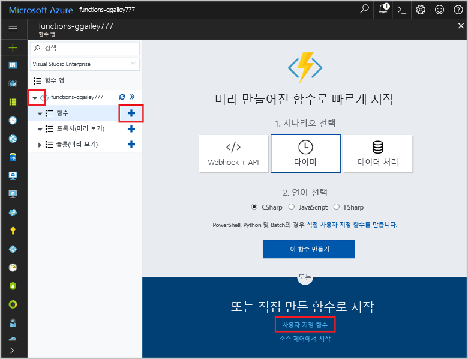

# <a name="create-an-openapi-definition-for-a-function"></a>함수에 대한 OpenAPI 정의 만들기
REST API는 종종 OpenAPI 정의를 사용하여 설명됩니다(이전의 [Swagger](http://swagger.io/) 파일). 이 정의에는 API에서 사용할 수 있는 작업 및 API에 대한 요청 및 응답 데이터가 구성되는 방식에 대한 정보가 포함됩니다.

이 자습서에서는 풍차의 응급 복구가 비용 효율적인지 여부를 결정하는 함수를 만듭니다. 그런 다음 해당 함수가 다른 앱 및 서비스에서 호출될 수 있도록 함수 앱에 대한 OpenAPI 정의를 만듭니다.

이 자습서에서는 다음 방법에 대해 알아봅니다.

> [!div class="checklist"]
> * Azure에서 함수 만들기
> * OpenAPI 도구를 사용하여 OpenAPI 정의 생성
> * 정의를 수정하여 추가 메타데이터 제공
> * 함수를 호출하여 정의 테스트

## <a name="create-a-function-app"></a>함수 앱 만들기

함수 실행을 호스트하는 함수 앱이 있어야 합니다. 함수 앱을 사용하면 함수를 논리 단위로 그룹화하여 더 쉽게 리소스를 관리, 배포, 크기 조정 및 공유할 수 있습니다. 

[!INCLUDE [Create function app Azure portal](../../includes/functions-create-function-app-portal.md)]


## <a name="create-the-function"></a>함수 만들기

이 자습서에서는 두 개의 매개 변수, 즉 터빈 복구 예상 시간(시)과 터빈 용량(킬로와트)을 사용하는 HTTP 트리거 함수를 사용합니다. 그런 후 이 함수는 복구 비용과 터빈이 24시간 후에 가져올 수 있는 수익을 계산합니다.

1. 함수 앱을 확장한 후 **함수** 옆의 **+** 단추를 선택합니다. 함수 앱에서 첫 번째 함수이면 **사용자 지정 함수**를 선택합니다. 그러면 함수 템플릿의 전체 집합이 표시됩니다. 

    

2. 검색 필드에 `http`를 입력한 다음, HTTP 트리거 템플릿에 대해 **C#** 을 선택합니다. 
 
    

3. 함수 **이름**에 `TurbineRepair`를 입력하고 **[인증 수준](functions-bindings-http-webhook.md#http-auth)** 에 대해 `Function`을 선택한 후 **만들기**를 선택합니다.  

    

1. run.csx 파일 내용을 다음 코드로 바꾼 다음 **저장**을 클릭합니다.

    ```csharp
    using System.Net;

    const double revenuePerkW = 0.12; 
    const double technicianCost = 250; 
    const double turbineCost = 100;

    public static async Task<HttpResponseMessage> Run(HttpRequestMessage req, TraceWriter log)
    {   

        //Get request body
        dynamic data = await req.Content.ReadAsAsync<object>();
        int hours = data.hours;
        int capacity = data.capacity;

        //Formulas to calculate revenue and cost
        double revenueOpportunity = capacity * revenuePerkW * 24;  
        double costToFix = (hours * technicianCost) +  turbineCost;
        string repairTurbine;

        if (revenueOpportunity > costToFix){
            repairTurbine = "Yes";
        }
        else {
            repairTurbine = "No";
        }

        return req.CreateResponse(HttpStatusCode.OK, new{
            message = repairTurbine,
            revenueOpportunity = "$"+ revenueOpportunity,
            costToFix = "$"+ costToFix         
        }); 
    }
    ```
    이 함수 코드는 응급 복구가 비용 효율적인지 여부와 터빈이 나타내는 수익 기회 및 터빈 수리 비용을 나타내기 위해 `Yes` 또는 `No` 메시지를 반환합니다. 

1. 이 함수를 테스트하려면 오른쪽 끝의 **테스트**를 클릭하여 테스트 탭을 확장합니다. **요청 본문**에 다음 값을 입력한 다음 **실행**을 클릭합니다.

    ```json
    {
    "hours": "6",
    "capacity": "2500"
    }
    ```

    

    응답의 본문에 다음 값이 반환됩니다.

    ```json
    {"message":"Yes","revenueOpportunity":"$7200","costToFix":"$1600"}
    ```

이제 응급 복구 작업의 비용 효율성을 결정하는 함수가 만들어졌습니다. 다음으로 함수 앱에 대한 OpenAPI 정의를 생성하고 수정합니다.

## <a name="generate-the-openapi-definition"></a>OpenAPI 정의 생성

이제 OpenAPI 정의를 생성할 준비가 되었습니다. 이 정의는 API Apps, [PowerApps](functions-powerapps-scenario.md) 및 [Microsoft Flow](../azure-functions/app-service-export-api-to-powerapps-and-flow.md)와 같은 기타 Microsoft 기술뿐만 아니라 [Postman](https://www.getpostman.com/docs/importing_swagger) 및 [많은 추가 패키지](http://swagger.io/tools/) 등의 타사 개발자 도구에서도 사용될 수 있습니다.

1. API(이 경우 POST)에서 지원하는 *동사*만 선택합니다. 이를 통해 생성된 API 정의가 더 분명해집니다.

    1. 새 HTTP 트리거 함수의 **통합** 탭에서 **허용된 HTTP 메서드**를 **선택한 메서드**로 변경합니다.

    1. **선택한 HTTP 메서드**에서 **POST**를 제외한 모든 옵션을 선택 취소하고 **저장**을 클릭합니다.

        
        
1. 함수 앱 이름(예: **function-demo-energy**) > **플랫폼 기능** > **API 정의**를 차례로 클릭합니다.

    

1. **API 정의** 탭에서 **함수**를 클릭합니다.

    

    이 단계에서는 함수 앱의 도메인에서 OpenAPI 파일을 호스팅하는 끝점, [OpenAPI 편집기](http://editor.swagger.io)의 인라인 복사, API 정의 템플릿 생성기를 포함하여 함수 앱의 OpenAPI 옵션을 사용하도록 설정합니다.

1. **API 정의 템플릿 생성** > **저장**을 클릭합니다.

    

    Azure는 함수 앱에서 HTTP 트리거 함수를 검색하고 functions.json에서 해당 정보를 사용하여 OpenAPI 정의를 생성합니다. 생성되는 정의는 다음과 같습니다.

    ```yaml
    swagger: '2.0'
    info:
    title: function-demo-energy.azurewebsites.net
    version: 1.0.0
    host: function-demo-energy.azurewebsites.net
    basePath: /
    schemes:
    - https
    - http
    paths:
    /api/TurbineRepair:
        post:
        operationId: /api/TurbineRepair/post
        produces: []
        consumes: []
        parameters: []
        description: >-
            Replace with Operation Object
            #http://swagger.io/specification/#operationObject
        responses:
            '200':
            description: Success operation
        security:
            - apikeyQuery: []
    definitions: {}
    securityDefinitions:
    apikeyQuery:
        type: apiKey
        name: code
        in: query
    ```

    이 정의는 전체 OpenAPI 정의가 되기 위해서는 더 많은 메타데이터가 필요하므로 _템플릿_으로 설명됩니다. 다음 단계에서 해당 정의를 수정합니다.

## <a name="modify-the-openapi-definition"></a>OpenAPI 정의 수정
이제 템플릿 정의가 있으므로 API의 작업 및 데이터 구조에 대한 추가 메타데이터를 제공하도록 수정합니다. **API 정의**에서 생성된 정의를 `post`부터 정의 가장 아래쪽까지 삭제하여 아래 콘텐츠에 붙여넣고 **저장**을 클릭합니다.

```yaml
    post:
      operationId: CalculateCosts
      description: Determines if a technician should be sent for repair
      summary: Calculates costs
      x-ms-summary: Calculates costs
      x-ms-visibility: important
      produces:
        - application/json
      consumes:
        - application/json
      parameters:
        - name: body
          in: body
          description: Hours and capacity used to calculate costs
          x-ms-summary: Hours and capacity
          x-ms-visibility: important
          required: true
          schema:
            type: object
            properties:
              hours:
                description: The amount of effort in hours required to conduct repair
                type: number
                x-ms-summary: Hours
                x-ms-visibility: important
              capacity:
                description: The max output of a turbine in kilowatts
                type: number
                x-ms-summary: Capacity
                x-ms-visibility: important
      responses:
        200:
          description: Message with cost and revenue numbers
          x-ms-summary: Message
          schema:
           type: object
           properties:
            message:
              type: string
              description: Returns Yes or No depending on calculations
              x-ms-summary: Message 
            revenueOpportunity:
              type: string
              description: The revenue opportunity cost
              x-ms-summary: RevenueOpportunity 
            costToFix:
              type: string
              description: The cost in $ to fix the turbine
              x-ms-summary: CostToFix
      security:
        - apikeyQuery: []
definitions: {}
securityDefinitions:
  apikeyQuery:
    type: apiKey
    name: code
    in: query
```

이 경우 그냥 업데이트된 메타데이터에 붙여넣을 수도 있지만 기본 템플릿에서 어떤 유형의 수정을 수행했는지 이해하는 것이 중요합니다.

+ API가 JSON 형식으로 데이터를 생성하고 소비한다고 지정했습니다.

+ 이름 및 데이터 형식을 사용해서 필수 매개 변수를 지정했습니다.

+ 이름 및 데이터 형식을 사용해서 성공적인 응답에 대한 반환 값을 지정했습니다.

+ API, 해당 작업 및 매개 변수에 대해 친숙한 요약 및 설명을 제공했습니다. 이러한 점은 이 함수를 사용하게 될 사용자에게 중요합니다.

+ Microsoft Flow 및 Logic Apps의 UI에 사용되는 x-ms-summary 및 x-ms-visibility를 추가했습니다. 자세한 내용은 [Microsoft Flow의 사용자 지정 API에 대한 OpenAPI 확장](https://preview.flow.microsoft.com/documentation/customapi-how-to-swagger/)을 참조하세요.

> [!NOTE]
> 기본 인증 방법을 API 키로 지정하여 보안 정의 지정했습니다. 다른 유형의 인증을 사용하는 경우 정의의 이 섹션을 변경할 수 있습니다.

API 작업 정의 방법에 대한 자세한 내용은 [Open API 사양](https://swagger.io/specification/#operationObject)을 참조하세요.

## <a name="test-the-openapi-definition"></a>OpenAPI 정의 테스트
API 정의를 사용하기 전에 Azure Functions UI에 테스트하는 것이 좋습니다.

1. 함수의 **관리** 탭에 있는 **호스트 키** 아래에서 **기본** 키를 복사합니다.

    

    > [!NOTE]
    >이 키를 테스트에 사용하고, 앱 또는 서비스에서 API를 호출할 때도 사용합니다.

1. API 정의로 돌아갑니다. **function-demo-energy** > **플랫폼 기능** > **API 정의**.

1. 오른쪽 창에서 **인증**을 클릭하고 복사한 API 키를 입력한 후 **인증**을 클릭합니다.

    

1. 아래로 스크롤하여 **이 작업 시도**를 클릭합니다.

    

1. **시간** 및 **용량** 값을 입력합니다.

    

    UI가 API 정의의 설명을 사용하는 방법을 확인합니다.

1. **요청 보내기**를 클릭하고 **다시 적용** 탭을 클릭하여 출력을 확인합니다.

    

## <a name="next-steps"></a>다음 단계

이 자습서에서는 다음 방법에 대해 알아보았습니다.

> [!div class="checklist"]
> * Azure에서 함수 만들기
> * OpenAPI 도구를 사용하여 OpenAPI 정의 생성
> * 정의를 수정하여 추가 메타데이터 제공
> * 함수를 호출하여 정의 테스트

다음 항목으로 이동하여 만든 OpenAPI 정의를 사용하는 PowerApps 앱을 만드는 방법을 알아봅니다.
> [!div class="nextstepaction"]
> [PowerApps에서 함수 호출](functions-powerapps-scenario.md)
