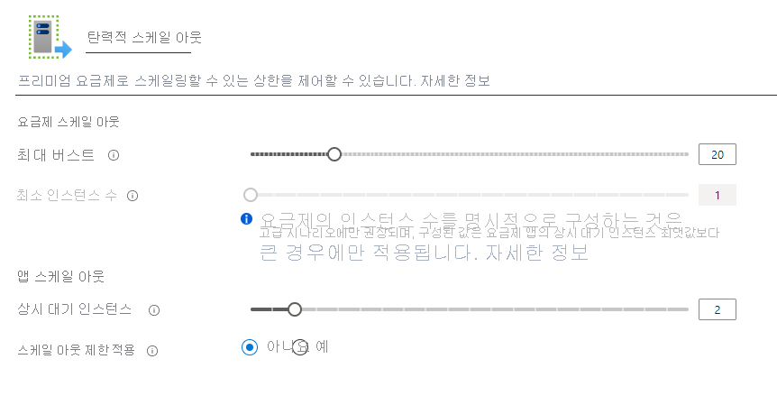

# <a name="azure-functions-premium-plan-preview"></a>Azure Functions Premium 계획 (미리 보기)

Azure Functions 프리미엄 요금제에는 함수 앱에 대 한 호스팅 옵션입니다. 프리미엄 요금제는 VNet 연결과 콜드 시작 안 함, 프리미엄 하드웨어 같은 기능을 제공 합니다.  동일한 Premium 계획에 여러 함수 앱을 배포할 수 있습니다 하 고 계획을 사용 하면 계산 인스턴스 크기, 기본 계획 크기 및 최대 계획 크기를 구성할 수 있습니다.  프리미엄 요금제 및 기타 계획 형식을 비교를 참조 하세요 [함수 크기 조정 및 호스팅 옵션](functions-scale.md)합니다.

> [!NOTE]
> 프리미엄 계획 미리 보기는 현재 Windows 인프라를 통해.NET, 노드 또는 Java에서 실행 되는 함수를 지원 합니다.

## <a name="create-a-premium-plan"></a>프리미엄 계획 만들기

[!INCLUDE [functions-premium-create](../../includes/functions-premium-create.md)]

Azure CLI에서 프리미엄 계획을 만들 수도 있습니다.

```azurecli-interactive
az functionapp plan create -g <resource-group> -n <plan-name> -l <region> --number-of-workers 1 --sku EP1
```

## <a name="features"></a>기능

다음 기능은 프리미엄 계획에 배포 하는 함수 앱에서 사용할 수 있습니다.

### <a name="pre-warmed-instances"></a>사전 준비 인스턴스

실행 없고 이벤트 발생 하면 현재 소비 계획에서 앱 0 개 인스턴스로 축소할 수 있습니다. 새 이벤트를 제공 하는 경우 새 인스턴스를 실행 중인 앱을 사용 하 여 특수화할 수 해야 합니다.  특수화의 새 인스턴스를 앱에 따라 다소 시간이 걸릴 수 있습니다.  첫 번째 호출에서이 추가 대기 시간에 응용 프로그램의 콜드 시작을 이라고 합니다.

프리미엄 요금제에서는 최소 계획 크기까지 인스턴스의 지정된 된 수에 미리 준비 앱을 할 수 있습니다.  또한 미리 준비 인스턴스 미리 높은 로드 하기 전에 앱을 확장할 수 있습니다. 앱 확장 되 면 대로 먼저 미리 warmed 인스턴스로 조정 합니다. 추가 인스턴스 및 다음 크기 조정 작업에 대 한 준비에서 즉시 웜 버퍼를 계속 합니다. 사전 준비 인스턴스의 버퍼를가지고 있으므로, 콜드 대기 시간을 효과적으로 방지할 수 있습니다.  미리 준비 인스턴스는 프리미엄 요금제 기능 하 고 하나 이상의 인스턴스를 유지 해야 활성 상태인 모든 시간 계획에서 사용할 수 있습니다.

선택 하 여 Azure portal에서 미리 준비 인스턴스 수를 구성할 수 있습니다 **Scale Out** 에 **플랫폼 기능** 탭 합니다.



Azure CLI를 사용 하 여 앱에 대 한 미리 준비 인스턴스를 구성할 수도 있습니다.

```azurecli-interactive
az resource update -g <resource_group> -n <function_app_name>/config/web --set properties.preWarmedInstanceCount=<desired_prewarmed_count> --resource-type Microsoft.Web/sites
```

### <a name="private-network-connectivity"></a>개인 네트워크 연결

프리미엄 계획에 배포 하는 azure Functions는 활용 [웹 앱에 대 한 새 VNet 통합](../app-service/web-sites-integrate-with-vnet.md#new-vnet-integration)합니다.  구성 되 면 앱 VNet 내의 리소스와 통신할 수 또는 서비스 끝점을 통해 보호 합니다.  IP 제한 들어오는 트래픽을 제한 하기 위해 앱에서 사용할 수 있습니다.

프리미엄 계획에서 함수 앱으로 서브넷을 할당 때 잠재적인 각 인스턴스에 대 한 충분 한 IP 주소를 사용 하 여 서브넷을 해야 합니다. 인스턴스의 최대 수는 미리 보기 기간 동안 다를 수 있습니다, 있지만 100 개 이상의 사용 가능한 주소를 사용 하 여 IP 블록이 필요 합니다.

자세한 내용은 (영문)을 참조 하세요 [VNet을 사용 하 여 함수 앱을 통합](functions-create-vnet.md)합니다.

### <a name="rapid-elastic-scale"></a>신속한 탄력적 확장

추가 계산 인스턴스가 동일한 신속 하 게 크기 조정 논리를 사용 하 여 소비 계획으로 앱에 대 한 자동으로 추가 됩니다.  작동 방법을 크기 조정에 대 한 자세한 내용은 참조 하세요 [크기 조정 및 호스팅 함수](./functions-scale.md#how-the-consumption-and-premium-plans-work)합니다.

### <a name="unbounded-run-duration"></a>Unbounded 실행 지속 시간

Azure Functions 소비 계획에서 단일 실행에 대 일 분으로 제한 됩니다.  프리미엄 계획에서 실행된 기간 기본 런어웨이 실행을 방지 하기 위해 30 분입니다. 그러나 수 있습니다 [host.json 구성을 수정](./functions-host-json.md#functiontimeout) 프리미엄 계획 앱에 대 한 무제한 이렇게 하려면.

미리 보기에서 프로그램 기간 지난 12 분 보장 되지 않으며 확률이 앱은 하지 해당 최소 작업자 수 확장할 경우 30 분 이상 실행 해야 합니다.

## <a name="plan-and-sku-settings"></a>계획 및 SKU 설정

두 가지 설정을 구성 하는 계획을 만들면: 인스턴스 (또는 계획 크기)의 최소 및 최대 버스트 용량 한도입니다.  프리미엄 요금제에 대 한 최소 인스턴스 수 1 이며 미리 보기 중 최대 버스트는 20 개입니다.  최소 인스턴스가 항상 실행 되 고 예약 합니다.

> [!IMPORTANT]
> 할당 된 최소 인스턴스 수에 관계 없이 여부 함수 실행 하는 경우 각 인스턴스에 대 한 요금이 청구 됩니다.

앱에 필요한 계획 크기 초과 인스턴스, 인스턴스 수가 최대 버스트 제한에 도달 될 때까지 확장 하기 위해 계속 수 있습니다.  동안에 계획 크기의 범위 밖에 있는 인스턴스에 대 한 사용자에 게 청구는 실행 되 고를 임대 합니다.  앱에 대 한 최소 계획 인스턴스는 보장 하지만 정의 된 최대 한도 초과 앱 크기 조정에 최선을 다를 해 드립니다.

계획 크기를 구성할 수 있으며 선택 하 여 Azure portal에서 최대값을 **Scale Out** 계획이 나 해당 계획에 배포 하는 함수 앱에 대 한 옵션 (아래 **플랫폼 기능**).

또한 Azure CLI에서 최대 버스트 제한을 높일 수 있습니다.

```azurecli-interactive
az resource update -g <resource_group> -n <premium_plan_name> --set properties.maximumElasticWorkerCount=<desired_max_burst> --resource-type Microsoft.Web/serverfarms 
```

### <a name="available-instance-skus"></a>사용 가능한 인스턴스 Sku

확장성 계획을 만들 때 세 가지 인스턴스 크기를 선택할 수 있습니다.  총 코어 수 및 사용 된 초당 메모리에 대 한 청구 됩니다.  앱에 자동으로 규모를 확장할 수 여러 인스턴스가 필요에 따라 합니다.  

|SKU|코어 수|메모리|Storage|
|--|--|--|--|
|EP1|1|3.5GB|250GB|
|EP2|2|7GB|250GB|
|EP3|4|14GB|250GB|

## <a name="regions"></a>영역

다음은 공개 미리 보기에 대 한 현재 지원 되는 지역입니다.

|지역|
|--|
|오스트레일리아 동부|
|오스트레일리아 남동부|
|캐나다 중부|
|미국 중부|
|동아시아|
|미국 동부 2|
|프랑스 중부|
|일본 서부|
|한국 중부|
|유럽 북부|
|미국 중남부|
|인도 남부|
|동남아시아|
|영국 서부|
|서유럽|
|인도 서부|
|미국 서부|

## <a name="known-issues"></a>알려진 문제

알려진 문제의 상태를 추적할 수는 [GitHub에서 공개 미리 보기](https://github.com/Azure/Azure-Functions/wiki/Premium-plan-known-issues)합니다.

## <a name="next-steps"></a>다음 단계

> [!div class="nextstepaction"]
> [Azure Functions 크기 조정 및 호스팅 옵션 이해](functions-scale.md)
