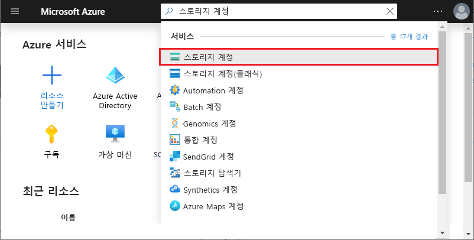

# <a name="work-with-azure-functions-core-tools"></a>Azure Functions 핵심 도구 작업

Azure Functions Core Tools를 사용하면 명령 프롬프트나 터미널에서 함수를 개발하고 테스트할 수 있습니다. 로컬 함수는 라이브 Azure 서비스에 연결할 수 있고 사용자는 전체 Functions 런타임을 사용하여 로컬 머신에서 함수를 디버깅할 수 있습니다. Azure 구독에 함수 앱을 배포할 수도 있습니다.

[!INCLUDE [Don't mix development environments](../../includes/functions-mixed-dev-environments.md)]

핵심 도구를 사용 하 여 로컬 컴퓨터에서 함수를 개발 하 고 Azure에 게시 하는 작업은 다음과 같은 기본 단계를 따릅니다.

> [!div class="checklist"]
> * [핵심 도구 및 종속성을 설치 합니다.](#v2)
> * [언어별 템플릿에서 함수 앱 프로젝트를 만듭니다.](#create-a-local-functions-project)
> * [트리거 및 바인딩 확장을 등록 합니다.](#register-extensions)
> * [저장소 및 기타 연결을 정의 합니다.](#local-settings-file)
> * [트리거와 언어별 템플릿에서 함수를 만듭니다.](#create-func)
> * [함수를 로컬로 실행 합니다.](#start)
> * [Azure에 프로젝트를 게시 합니다.](#publish)

## <a name="core-tools-versions"></a>Core Tools 버전

Azure Functions Core Tools에는 세 가지 버전이 있습니다. 사용 되는 버전은 로컬 개발 환경, [선택 언어](supported-languages.md)및 필요한 지원 수준에 따라 달라 집니다.

+ [**버전 3.x/**](#v2)2.x:는 [Azure Functions 런타임의 버전 3(sp3) 또는](functions-versions.md)2.x를 지원 합니다. 이러한 버전은 [Windows](?tabs=windows#v2), [Macos](?tabs=macos#v2)및 [Linux](?tabs=linux#v2) 를 지원 하 고 플랫폼별 패키지 관리자 또는 npm를 사용 하 여 설치 합니다.

+ **버전**1.x: Azure Functions 런타임의 버전 1.X를 지원 합니다. 이 버전의 도구는 Windows 컴퓨터에서만 지원되며 [npm 패키지](https://www.npmjs.com/package/azure-functions-core-tools)에서 설치됩니다.

별도로 언급 하지 않는 한이 문서의 예는 버전 2.x에 대 한 것입니다.

## <a name="prerequisites"></a>사전 요구 사항

Azure Functions Core Tools 현재 Azure 계정으로 인증 하는 Azure CLI에 따라 달라 집니다. 즉, Azure Functions Core Tools에서 [Azure에 게시할](#publish) 수 있도록 [Azure CLI를 로컬로 설치](/cli/azure/install-azure-cli) 해야 합니다. 

## <a name="install-the-azure-functions-core-tools"></a>Azure Functions 핵심 도구 설치

[Azure Functions 핵심 도구]에는 로컬 개발 컴퓨터에서 실행할 수 있는 Azure Functions 런타임을 제공하는 동일한 런타임 버전이 포함됩니다. 또한 함수를 만들고, Azure에 연결하고, 함수 프로젝트를 배포하는 명령을 제공합니다.

### <a name="version-3x-and-2x"></a><a name="v2"></a>버전 3(sp3) 및 2.x

버전 3(sp3)의 도구는 .NET Core를 기반으로 하는 Azure Functions 런타임을 사용 합니다. 이 버전은 [Windows](?tabs=windows#v2), [Macos](?tabs=macos#v2)및 [Linux](?tabs=linux#v2)를 포함 하 여 .net Core에서 지 원하는 모든 플랫폼에서 지원 됩니다. 

> [!IMPORTANT]
> [확장 번들]을 사용 하 여 .NET Core SDK를 설치 하기 위한 요구 사항을 무시할 수 있습니다.

# <a name="windows"></a>[Windows](#tab/windows)

다음 단계에서는 Windows installer (MSI)를 사용 하 여 핵심 도구 v3. x를 설치 합니다. 핵심 도구 v2. x를 설치 하는 데 필요한 다른 패키지 기반 설치 관리자에 대 한 자세한 내용은 [핵심 도구 추가](https://github.com/Azure/azure-functions-core-tools/blob/master/README.md#windows)정보를 참조 하세요.

1. Windows 버전에 따라 핵심 도구 설치 관리자를 다운로드 하 여 실행 합니다.

    - [v3. x-Windows 64](https://go.microsoft.com/fwlink/?linkid=2135274) 비트 (권장) [Visual Studio Code 디버깅](functions-develop-vs-code.md#debugging-functions-locally) 에는 64 비트가 필요 합니다.)
    - [v3. x-Windows 32 비트](https://go.microsoft.com/fwlink/?linkid=2135275)

1. [확장 번들](functions-bindings-register.md#extension-bundles)을 사용 하지 않으려는 경우 [Windows 용 .NET Core 3(sp3) SDK](https://dotnet.microsoft.com/download)를 설치 합니다.

# <a name="macos"></a>[macOS](#tab/macos)

다음 단계에서는 Homebrew를 사용하여 macOS에 핵심 도구를 설치합니다.

1. 아직 설치되지 않은 경우 [Homebrew](https://brew.sh/)를 설치합니다.

1. 다음과 같이 핵심 도구 패키지를 설치합니다.

    ##### <a name="v3x-recommended"></a>v3. x (권장)

    ```bash
    brew tap azure/functions
    brew install azure-functions-core-tools@3
    # if upgrading on a machine that has 2.x installed
    brew link --overwrite azure-functions-core-tools@3
    ```
    
    ##### <a name="v2x"></a>v2.x

    ```bash
    brew tap azure/functions
    brew install azure-functions-core-tools@2
    ```
    
1. [확장 번들](functions-bindings-register.md#extension-bundles)을 사용 하지 않으려는 경우 [macos 용 .NET Core 2.x SDK](https://dotnet.microsoft.com/download)를 설치 합니다.

# <a name="linux"></a>[Linux](#tab/linux)

다음 단계에서는 [APT](https://wiki.debian.org/Apt)를 사용하여 Ubuntu/Debian Linux 배포판에 핵심 도구를 설치합니다. 다른 Linux 배포판의 경우 [핵심 도구 추가 정보](https://github.com/Azure/azure-functions-core-tools/blob/master/README.md#linux)를 참조하세요.

1. Microsoft package repository GPG 키를 설치 하 여 패키지 무결성의 유효성을 검사 합니다.

    ```bash
    curl https://packages.microsoft.com/keys/microsoft.asc | gpg --dearmor > microsoft.gpg
    sudo mv microsoft.gpg /etc/apt/trusted.gpg.d/microsoft.gpg
    ```

1. APT 업데이트를 수행 하기 전에 APT 원본 목록을 설정 합니다.

    ##### <a name="ubuntu"></a>Ubuntu

    ```bash
    sudo sh -c 'echo "deb [arch=amd64] https://packages.microsoft.com/repos/microsoft-ubuntu-$(lsb_release -cs)-prod $(lsb_release -cs) main" > /etc/apt/sources.list.d/dotnetdev.list'
    ```

    ##### <a name="debian"></a>Debian

    ```bash
    sudo sh -c 'echo "deb [arch=amd64] https://packages.microsoft.com/debian/$(lsb_release -rs | cut -d'.' -f 1)/prod $(lsb_release -cs) main" > /etc/apt/sources.list.d/dotnetdev.list'
    ```

1. 파일에서 `/etc/apt/sources.list.d/dotnetdev.list` 아래 나열 된 적절 한 Linux 버전 문자열 중 하나를 확인 합니다.

    | Linux 배포 | 버전 |
    | --------------- | ----------- |
    | Debian 10 | `buster`  |
    | Debian 9  | `stretch` |
    | Ubuntu 20.04    | `focal`     |
    | Ubuntu 19.04    | `disco`     |
    | Ubuntu 18.10    | `cosmic`    |
    | Ubuntu 18.04    | `bionic`    |
    | Ubuntu 17.04    | `zesty`     |
    | Ubuntu 16.04/Linux Mint 18    | `xenial`  |

1. APT 원본 업데이트를 시작 합니다.

    ```bash
    sudo apt-get update
    ```

1. 다음과 같이 핵심 도구 패키지를 설치합니다.

    ##### <a name="v3x-recommended"></a>v3. x (권장)
    ```bash
    sudo apt-get update
    sudo apt-get install azure-functions-core-tools-3
    ```
    
    ##### <a name="v2x"></a>v2.x
    ```bash
    sudo apt-get update
    sudo apt-get install azure-functions-core-tools-2
    ```

1. [확장 번들](functions-bindings-register.md#extension-bundles)을 사용 하지 않으려는 경우 [Linux 용 .NET Core 2.x SDK](https://dotnet.microsoft.com/download)를 설치 합니다.

---

## <a name="create-a-local-functions-project"></a>로컬 Functions 프로젝트 만들기

함수 프로젝트 디렉터리에는 개별 함수에 대한 코드가 포함된 하위 폴더와 함께 [host.json](functions-host-json.md) 및 [local.settings.json](#local-settings-file) 파일이 포함됩니다. 이 디렉터리는 Azure의 함수 앱에 해당합니다. Functions 폴더 구조에 대한 자세한 내용은 [Azure Functions 개발자 가이드](functions-reference.md#folder-structure)를 참조하세요.

버전 3.x/2.x의 경우 프로젝트를 초기화할 때 프로젝트에 대 한 기본 언어를 선택 해야 합니다. 버전 3.x/2.x에서 추가 된 모든 함수는 기본 언어 템플릿을 사용 합니다. 버전 1.x에서는 함수를 만들 때마다 언어를 지정합니다.

터미널 창이나 명령 프롬프트에서 다음 명령을 실행하여 프로젝트 및 로컬 Git 리포지토리를 만듭니다.

```
func init MyFunctionProj
```

프로젝트 이름을 제공하면 해당 이름을 사용한 새 폴더가 생성되고 초기화됩니다. 그렇지 않으면 현재 폴더는 초기화됩니다.  
버전 3(sp3)/2.x에서 명령을 실행할 때 프로젝트에 대 한 런타임을 선택 해야 합니다. 

<pre>
Select a worker runtime:
dotnet
node
python 
powershell
</pre>

위쪽/아래쪽 화살표 키를 사용하여 언어를 선택한 다음, Enter 키를 누릅니다. JavaScript 또는 TypeScript 함수를 개발 하려는 경우에는 **노드**를 선택 하 고 언어를 선택 합니다. TypeScript에는 [몇 가지 추가 요구 사항이](functions-reference-node.md#typescript)있습니다. 

출력은 JavaScript 프로젝트에 대한 다음 예제와 유사합니다.

<pre>
Select a worker runtime: node
Writing .gitignore
Writing host.json
Writing local.settings.json
Writing C:\myfunctions\myMyFunctionProj\.vscode\extensions.json
Initialized empty Git repository in C:/myfunctions/myMyFunctionProj/.git/
</pre>

`func init`는 다음과 같은 옵션을 지원 합니다 .이 옵션은 다른 설명이 없는 경우 버전 3(sp3)/x-only입니다.

| 옵션     | Description                            |
| ------------ | -------------------------------------- |
| **`--csx`** | 버전 1.x 동작인 .NET 함수를 c # 스크립트로 만듭니다. 에만 유효 `--worker-runtime dotnet` 합니다. |
| **`--docker`** | 선택한을 기반으로 하는 기본 이미지를 사용 하 여 컨테이너에 대 한 Dockerfile을 만듭니다 `--worker-runtime` . 사용자 지정 Linux 컨테이너에 게시하려는 경우 이 옵션을 사용합니다. |
| **`--docker-only`** |  Dockerfile을 기존 프로젝트에 추가 합니다. 지정 되지 않았거나 local.settings.js에 설정 되어 있지 않은 경우 작업자-런타임에 대 한 메시지를 표시 합니다. 사용자 지정 Linux 컨테이너에 기존 프로젝트를 게시할 계획인 경우이 옵션을 사용 합니다. |
| **`--force`** | 프로젝트에 기존 파일이 있어도 프로젝트를 초기화합니다. 이 설정은 이름이 같은 기존 파일을 덮어씁니다. 프로젝트 폴더의 다른 파일에는 영향이 없습니다. |
| **`--language`** | 언어별 프로젝트를 초기화 합니다. 로 설정 되 면 현재 지원 `--worker-runtime` `node` 됩니다. 옵션은 `typescript` 및 `javascript`입니다. 또는를 사용할 수도 `--worker-runtime javascript` 있습니다 `--worker-runtime typescript` .  |
| **`--managed-dependencies`**  | 관리 되는 종속성을 설치 합니다. 현재 PowerShell worker runtime 에서만이 기능을 지원 합니다. |
| **`--source-control`** | Git 리포지토리 작성 여부를 제어합니다. 리포지토리는 기본적으로 작성되지 않습니다. `true`이면 리포지토리가 작성됩니다. |
| **`--worker-runtime`** | 프로젝트의 언어 런타임을 설정합니다. 지원 되는 값은 `csharp` , `dotnet` , `javascript` , `node` (JavaScript),, `powershell` `python` 및 `typescript` 입니다. Java의 경우 [Maven](functions-reference-java.md#create-java-functions)를 사용 합니다. 설정 하지 않은 경우 초기화 하는 동안 런타임을 선택 하 라는 메시지가 표시 됩니다. |
|
> [!IMPORTANT]
> 기본적으로 버전 2.x 이상 버전의 핵심 도구는 .NET 런타임에 대 한 함수 앱 프로젝트를 [c # 클래스 프로젝트](functions-dotnet-class-library.md) (.csproj)로 만듭니다. 이러한 C# 프로젝트는 Visual Studio 또는 Visual Studio Code에서 사용할 수 있으며, 테스트 중에/Azure에 게시할 때 컴파일됩니다. 버전 1.x 및 포털에서 생성되는 것과 동일한 C# 스크립트(.csx) 파일을 만들고 작업하려는 경우, 함수를 만들고 배포할 때 `--csx` 매개 변수를 포함해야 합니다.

[!INCLUDE [functions-core-tools-install-extension](../../includes/functions-core-tools-install-extension.md)]

[!INCLUDE [functions-local-settings-file](../../includes/functions-local-settings-file.md)]

기본적으로 이러한 설정은 프로젝트가 Azure에 게시될 때 자동으로 마이그레이션되지 않습니다. [게시할 때](#publish)`--publish-local-settings` 스위치를 사용하여 이러한 설정이 Azure의 함수 앱에 추가되었는지 확인합니다. **ConnectionStrings**의 값은 게시되지 않습니다.

이 함수 앱 설정 값은 코드에서 환경 변수로 읽을 수도 있습니다. 자세한 내용은 다음 언어별 참조 항목의 Environment 변수 섹션을 참조하세요.

* [미리 컴파일된 C#](functions-dotnet-class-library.md#environment-variables)
* [C# 스크립트(.csx)](functions-reference-csharp.md#environment-variables)
* [Java](functions-reference-java.md#environment-variables)
* [JavaScript](functions-reference-node.md#environment-variables)
* [PowerShell](functions-reference-powershell.md#environment-variables)
* [Python](functions-reference-python.md#environment-variables)

에 대해 유효한 저장소 연결 문자열을 설정 하지 않고 [`AzureWebJobsStorage`] 에뮬레이터를 사용 하지 않는 경우 다음 오류 메시지가 표시 됩니다.

> local.settings.json에 AzureWebJobsStorage 값이 없습니다. 이 값은 HTTP 이외의 모든 트리거에 필요합니다. 'func azure functionapp fetch-app-settings \<functionAppName\>'를 실행하거나 local.settings.json에서 연결 문자열을 지정할 수 있습니다.

### <a name="get-your-storage-connection-strings"></a>스토리지 연결 문자열 가져오기

개발에 Microsoft Azure Storage 에뮬레이터를 사용 하는 경우에도 실제 저장소 연결로 테스트 하는 것이 좋습니다. 이미 [스토리지 계정을 만든](../storage/common/storage-account-create.md) 것으로 가정하면 다음 방법 중 하나에서 유효한 스토리지 연결 문자열을 가져올 수 있습니다.

- [Azure Portal]에서 **저장소 계정**을 검색 하 고 선택 합니다. 
  
  
  저장소 계정을 선택 하 고, **설정**에서 **액세스 키** 를 선택한 다음, **연결 문자열** 값 중 하나를 복사 합니다.
  

- [Azure Storage Explorer](https://storageexplorer.com/)를 사용하여 Azure 계정에 연결합니다. **탐색기**에서 구독을 확장 하 고 **저장소 계정**을 확장 한 다음 저장소 계정을 선택 하 고 기본 또는 보조 연결 문자열을 복사 합니다.

  

+ 다음 중 한 명령을 사용하여 Azure에서 연결 문자열을 다운로드하려면 핵심 도구를 사용합니다.

  + 기존 함수 앱에서 모든 설정을 다운로드합니다.

    ```
    func azure functionapp fetch-app-settings <FunctionAppName>
    ```
  + 특정 스토리지 계정에 대한 연결 문자열을 가져옵니다.

    ```
    func azure storage fetch-connection-string <StorageAccountName>
    ```

    Azure에 아직 로그인 하지 않은 경우 로그인 하 라는 메시지가 표시 됩니다.

## <a name="create-a-function"></a><a name="create-func"></a>함수 만들기

함수를 만들려면 다음 명령을 실행합니다.

```
func new
```

버전 3.x/2.x에서를 실행 하면 `func new` 함수 앱의 기본 언어로 템플릿을 선택 하 라는 메시지가 표시 됩니다. 그러면 함수 이름을 선택 하 라는 메시지도 표시 됩니다. 버전 1.x에서는 언어를 선택하라는 메시지도 표시됩니다.

<pre>
Select a language: Select a template:
Blob trigger
Cosmos DB trigger
Event Grid trigger
HTTP trigger
Queue trigger
SendGrid
Service Bus Queue trigger
Service Bus Topic trigger
Timer trigger
</pre>

함수 코드는 다음 큐 트리거 출력에서 알 수 있듯이 제공된 함수 이름으로 하위 폴더에 생성됩니다.

<pre>
Select a language: Select a template: Queue trigger
Function name: [QueueTriggerJS] MyQueueTrigger
Writing C:\myfunctions\myMyFunctionProj\MyQueueTrigger\index.js
Writing C:\myfunctions\myMyFunctionProj\MyQueueTrigger\readme.md
Writing C:\myfunctions\myMyFunctionProj\MyQueueTrigger\sample.dat
Writing C:\myfunctions\myMyFunctionProj\MyQueueTrigger\function.json
</pre>

다음 인수를 사용하는 명령에서 이러한 옵션을 지정할 수도 있습니다.

| 인수     | Description                            |
| ------------------------------------------ | -------------------------------------- |
| **`--csx`** | (버전 2.x 이상 버전) 버전 1.x 및 포털에서 사용 되는 동일한 c # 스크립트 (csx) 템플릿을 생성 합니다. |
| **`--language`**, **`-l`**| C#, F# 또는 JavaScript와 같은 템플릿 프로그래밍 언어 이 옵션은 버전 1.x에서 필요합니다. 버전 2.x 이상 버전에서는이 옵션을 사용 하거나 작업자 런타임과 일치 하는 언어를 선택 하지 마세요. |
| **`--name`**, **`-n`** | 함수 이름입니다. |
| **`--template`**, **`-t`** | `func templates list` 명령을 사용하여 지원되는 각 언어에 대해 사용 가능한 템플릿의 전체 목록을 확인합니다.   |


예를 들어 단일 명령에서 JavaScript HTTP 트리거를 만들려면 다음을 실행합니다.

```
func new --template "Http Trigger" --name MyHttpTrigger
```

단일 명령에서 큐 트리거 함수를 만들려면 다음을 실행합니다.

```
func new --template "Queue Trigger" --name QueueTriggerJS
```

## <a name="run-functions-locally"></a><a name="start"></a>로컬로 함수 실행

Functions 프로젝트를 실행하려면 Functions 호스트를 실행합니다. 호스트는 프로젝트의 모든 함수에 대해 트리거를 사용 하도록 설정 합니다. 시작 명령은 프로젝트 언어에 따라 달라집니다.

# <a name="c"></a>[C\#](#tab/csharp)

```
func start --build
```
# <a name="javascript"></a>[JavaScript](#tab/node)

```
func start
```

# <a name="python"></a>[Python](#tab/python)

```
func start
```
이 명령은 [가상 환경에서 실행](./functions-create-first-azure-function-azure-cli.md?pivots=programming-language-python#create-venv)해야 합니다.

# <a name="typescript"></a>[TypeScript](#tab/ts)

```
npm install
npm start     
```

---

>[!NOTE]  
> 함수 런타임의 버전 1.x `host` 에는 다음 예제와 같이 명령이 필요 합니다.
>
> ```
> func host start
> ```

`func start`은 다음 옵션을 지원합니다.

| 옵션     | Description                            |
| ------------ | -------------------------------------- |
| **`--no-build`** | 실행 전에 현재 프로젝트를 빌드하지 않도록 합니다. dotnet 프로젝트에만 해당합니다. 기본값은 false로 설정하는 것입니다. 버전 1.x에는 지원 되지 않습니다. |
| **`--cors-credentials`** | 버전 1.x에 대해 지원 되지 않는 크로스-원본 인증 된 요청 (즉, 쿠키 및 인증 헤더)을 허용 합니다. |
| **`--cors`** | CORS 원본의 공백 없이 쉼표로 구분된 목록입니다. |
| **`--language-worker`** | 언어 작업자를 구성하는 인수입니다. 예를 들어 [디버그 포트 및 기타 필수 인수](https://github.com/Azure/azure-functions-core-tools/wiki/Enable-Debugging-for-language-workers)를 제공 하 여 언어 작업자에 대해 디버깅을 사용 하도록 설정할 수 있습니다. 버전 1.x에는 지원 되지 않습니다. |
| **`--cert`** | 프라이빗 키가 포함된 .pfx 파일에 대한 경로입니다. `--useHttps`을 통해서만 사용됩니다. 버전 1.x에는 지원 되지 않습니다. |
| **`--password`** | .pfx 파일에 대한 암호가 포함된 암호 또는 파일입니다. `--cert`을 통해서만 사용됩니다. 버전 1.x에는 지원 되지 않습니다. |
| **`--port`**, **`-p`** | 수신 대기할 로컬 포트입니다. 기본값: 7071 |
| **`--pause-on-error`** | 프로세스를 종료하기 전에 추가 입력에 대해 일시 중지합니다. IDE(통합 개발 환경)에서 Core Tools를 시작할 때만 사용됩니다.|
| **`--script-root`**, **`--prefix`** | 실행하거나 배포할 함수 앱의 루트 경로를 지정하는 데 사용됩니다. 하위 폴더에 프로젝트 파일을 생성하는 컴파일된 프로젝트용으로 사용됩니다. 예를 들어 C# 클래스 라이브러리 프로젝트를 작성할 때는 `MyProject/bin/Debug/netstandard2.0`과 같은 경로를 사용하여 *root* 하위 폴더에 host.json, local.settings.json 및 function.json 파일이 생성됩니다. 이 경우 접두사를 `--script-root MyProject/bin/Debug/netstandard2.0`으로 설정합니다. 이 접두사는 Azure에서 실행할 때의 함수 앱 루트입니다. |
| **`--timeout`**, **`-t`** | Functions 호스트를 시작할 제한 시간(초)입니다. 기본값: 20초|
| **`--useHttps`** | `http://localhost:{port}`가 아닌 `https://localhost:{port}`에 바인딩합니다. 기본적으로 이 옵션은 사용자 컴퓨터에 신뢰할 수 있는 인증서를 만듭니다.|

Functions 호스트가 시작되면 HTTP 트리거 함수의 URL이 출력됩니다.

<pre>
Found the following functions:
Host.Functions.MyHttpTrigger

Job host started
Http Function MyHttpTrigger: http://localhost:7071/api/MyHttpTrigger
</pre>

>[!IMPORTANT]
>로컬로 실행 하는 경우 HTTP 끝점에 대 한 권한 부여는 적용 되지 않습니다. 즉, 모든 로컬 HTTP 요청은 `authLevel = "anonymous"`로 처리됩니다. 자세한 내용은 [HTTP 바인딩 문서](functions-bindings-http-webhook-trigger.md#authorization-keys)를 참조하세요.

### <a name="passing-test-data-to-a-function"></a>테스트 데이터를 함수에 전달

로컬로 함수를 테스트하려면 [Functions 호스트를 시작](#start)하고 HTTP 요청을 사용하여 로컬 서버에서 엔드포인트를 호출합니다. 호출하는 엔드포인트는 함수의 형식에 따라 달라집니다.

>[!NOTE]
> 이 항목의 예제에서는 cURL 도구를 사용하여 터미널 또는 명령 프롬프트의 HTTP 요청을 보냅니다. 로컬 서버에 HTTP 요청을 보내도록 선택한 도구를 사용할 수 있습니다. 말아 넘기기 도구는 Linux 기반 시스템 및 Windows 10 빌드 17063 이상에서 기본적으로 사용할 수 있습니다. 이전 창에서는 먼저 [말아 넘기기 도구](https://curl.haxx.se/)를 다운로드 하 여 설치 해야 합니다.

함수를 테스트하는 방법에 대한 일반적인 내용은 [Azure Functions에서 코드를 테스트하기 위한 전략](functions-test-a-function.md)을 참조하세요.

#### <a name="http-and-webhook-triggered-functions"></a>HTTP 및 웹후크 트리거된 함수

다음 엔드포인트를 호출하여 HTTP 및 웹후크 트리거된 함수를 로컬로 실행합니다.

```
http://localhost:{port}/api/{function_name}
```

Functions 호스트가 수신 대기 중인 동일한 서버 이름 및 포트를 사용하도록 합니다. Function 호스트를 시작할 때 생성된 출력에서 이 항목을 확인합니다. 트리거에서 지원하는 HTTP 메서드를 사용하여 이 URL을 호출할 수 있습니다.

다음 cURL 명령은 _이름_ 매개 변수를 쿼리 문자열에 전달한 GET 요청에서 `MyHttpTrigger` 빠른 시작 함수를 트리거합니다.

```
curl --get http://localhost:7071/api/MyHttpTrigger?name=Azure%20Rocks
```

다음 예제는 요청 본문에서 _이름_을 전달하는 POST 요청에서 호출되는 동일한 함수입니다.

# <a name="bash"></a>[Bash](#tab/bash)
```bash
curl --request POST http://localhost:7071/api/MyHttpTrigger --data '{"name":"Azure Rocks"}'
```
# <a name="cmd"></a>[Cmd](#tab/cmd)
```cmd
curl --request POST http://localhost:7071/api/MyHttpTrigger --data "{'name':'Azure Rocks'}"
```
---

쿼리 문자열에서 데이터를 전달하는 브라우저에서 GET 요청을 수행할 수 있습니다. 다른 모든 HTTP 메서드에서 cURL, Fiddler, Postman 또는 비슷한 HTTP 테스트 도구를 사용해야 합니다.

#### <a name="non-http-triggered-functions"></a>HTTP가 아닌 트리거된 함수

HTTP 트리거와 웹 후크 및 Event Grid 트리거와는 다른 모든 종류의 함수에는 관리 끝점을 호출 하 여 로컬에서 함수를 테스트할 수 있습니다. 로컬 서버에서 HTTP POST 요청으로 이 엔드포인트를 호출하면 함수를 트리거합니다. 

트리거된 함수를 로컬로 Event Grid 테스트 하려면 [뷰어 웹 앱을 사용 하 여 로컬 테스트](functions-bindings-event-grid-trigger.md#local-testing-with-viewer-web-app)를 참조 하세요.

필요에 따라 POST 요청의 본문에서 실행에 테스트 데이터를 전달할 수 있습니다. 이 기능은 Azure Portal에서 **테스트** 탭과 비슷합니다.

다음 관리자 엔드포인트를 호출하여 HTTP가 아닌 함수를 트리거합니다.

```
http://localhost:{port}/admin/functions/{function_name}
```

함수의 관리자 엔드포인트에 테스트 데이터를 전달하려면 POST 요청 메시지의 본문에서 데이터를 제공해야 합니다. 메시지 본문에는 다음 JSON 형식이 필요합니다.

```JSON
{
    "input": "<trigger_input>"
}
```

`<trigger_input>` 값에는 함수에 필요한 형식의 데이터가 포함됩니다. 다음 cURL 예제는 `QueueTriggerJS` 함수에 대한 POST 요청입니다. 이 경우에 입력은 큐에 위치해야 하는 메시지에 해당하는 문자열입니다.

# <a name="bash"></a>[Bash](#tab/bash)
```bash
curl --request POST -H "Content-Type:application/json" --data '{"input":"sample queue data"}' http://localhost:7071/admin/functions/QueueTrigger
```
# <a name="cmd"></a>[Cmd](#tab/cmd)
```bash
curl --request POST -H "Content-Type:application/json" --data "{'input':'sample queue data'}" http://localhost:7071/admin/functions/QueueTrigger
```
---

#### <a name="using-the-func-run-command-version-1x-only"></a>명령 사용 `func run` (버전 2.x에만 해당)

>[!IMPORTANT]
> `func run`이 명령은 도구의 버전 1.x 에서만 지원 됩니다. 자세한 내용은 [Azure Functions 런타임 버전을 대상으로 지정하는 방법](set-runtime-version.md) 항목을 참조하세요.

버전 1.x에서는를 사용 하 여 함수를 직접 호출 하 `func run <FunctionName>` 고 함수에 대 한 입력 데이터를 제공할 수도 있습니다. 이 명령은 Azure Portal에서 **테스트** 탭을 사용하여 함수를 실행하는 것과 비슷합니다.

`func run`은 다음 옵션을 지원합니다.

| 옵션     | Description                            |
| ------------ | -------------------------------------- |
| **`--content`**, **`-c`** | 인라인 콘텐츠입니다. |
| **`--debug`**, **`-d`** | 함수를 실행하기 전에 호스트 프로세스에 디버거를 연결합니다.|
| **`--timeout`**, **`-t`** | 로컬 Functions 호스트가 준비될 때까지의 대기 시간(초)입니다.|
| **`--file`**, **`-f`** | 콘텐츠로 사용할 파일 이름입니다.|
| **`--no-interactive`** | 입력에 대한 메시지를 표시하지 않습니다. 자동화 시나리오에 유용합니다.|

예를 들어 HTTP 트리거 함수를 호출하고 콘텐츠 본문을 전달하려면 다음 명령을 실행합니다.

```
func run MyHttpTrigger -c '{\"name\": \"Azure\"}'
```

## <a name="publish-to-azure"></a><a name="publish"></a>Azure에 게시

Azure Functions Core Tools는 [Zip](functions-deployment-technologies.md#zip-deploy) 배포 및 [사용자 지정 Docker 컨테이너](functions-deployment-technologies.md#docker-container)배포를 통해 함수 앱에 함수 프로젝트 파일을 직접 배포 하는 두 가지 유형의 배포를 지원 합니다. [Azure 구독에서](functions-cli-samples.md#create)코드를 배포할 함수 앱을 이미 만들어야 합니다. 컴파일해야 하는 프로젝트는 이진 파일을 배포할 수 있는 방식으로 빌드해야 합니다.

>[!IMPORTANT]
>핵심 도구에서 Azure에 게시 하려면 [Azure CLI](/cli/azure/install-azure-cli) 를 로컬로 설치 해야 합니다.  

프로젝트 폴더는 게시 하지 않아야 하는 언어별 파일 및 디렉터리를 포함할 수 있습니다. 제외 된 항목은 루트 프로젝트 폴더의 funcignore 파일에 나열 됩니다.     

### <a name="deploy-project-files"></a><a name="project-file-deployment"></a>프로젝트 파일 배포

Azure의 함수 앱에 로컬 코드를 게시하려면 `publish` 명령을 사용합니다.

```
func azure functionapp publish <FunctionAppName>
```

이 명령은 Azure에서 기존 함수 앱에 게시합니다. 구독에 존재 하지 않는에 게시 하려고 하면 오류가 발생 `<FunctionAppName>` 합니다. Azure CLI를 사용하여 명령 프롬프트 또는 터미널 창에서 함수 앱을 만드는 방법을 알아보려면 [서버를 사용하지 않고 실행하기 위한 Function App 만들기](./scripts/functions-cli-create-serverless.md)를 참조하세요. 기본적으로이 명령은 [원격 빌드](functions-deployment-technologies.md#remote-build) 를 사용 하 고 [배포 패키지에서 실행](run-functions-from-deployment-package.md)되도록 앱을 배포 합니다. 권장 배포 모드를 사용 하지 않도록 설정 하려면 `--nozip` 옵션을 사용 합니다.

>[!IMPORTANT]
> Azure Portal에서 함수 앱을 만들 때 기본적으로 함수 런타임의 버전 3.x를 사용 합니다. 함수 앱이 런타임 버전 1.x를 사용하도록 하려면 [버전 1.x에서 실행](functions-versions.md#creating-1x-apps)의 지침을 따르세요.
> 기존 함수가 있는 함수 앱의 런타임 버전은 변경할 수 없습니다.

다음 게시 옵션은 모든 버전에 적용 됩니다.

| 옵션     | Description                            |
| ------------ | -------------------------------------- |
| **`--publish-local-settings -i`** |  local.settings.json의 설정을 Azure에 게시하고, 설정이 이미 있는 경우 덮어쓸지 묻습니다. Microsoft Azure Storage 에뮬레이터 사용 하는 경우 먼저 앱 설정을 [실제 저장소 연결](#get-your-storage-connection-strings)로 변경 합니다. |
| **`--overwrite-settings -y`** | `--publish-local-settings -i` 사용 시 앱 설정을 덮어쓴다는 메시지를 표시하지 않습니다.|

다음 게시 옵션은 버전 2.x 이상 버전 에서만 지원 됩니다.

| 옵션     | Description                            |
| ------------ | -------------------------------------- |
| **`--publish-settings-only`**, **`-o`** |  설정만 게시하고 콘텐츠는 건너뜁니다. 기본값은 프롬프트입니다. |
|**`--list-ignored-files`** | .funcignore 파일을 기준으로 하여 게시 중에 무시되는 파일 목록을 표시합니다. |
| **`--list-included-files`** | .funcignore 파일을 기준으로 하여 게시되는 파일 목록을 표시합니다. |
| **`--nozip`** | 기본 `Run-From-Package` 모드를 끕니다. |
| **`--build-native-deps`** | Python 함수 앱을 게시할 때 생성 되는 원반 폴더를 건너뜁니다. |
| **`--build`**, **`-b`** | Linux 함수 앱에 배포할 때 빌드 작업을 수행 합니다. 수락: `remote` 및 `local` . |
| **`--additional-packages`** | 네이티브 종속성을 빌드할 때 설치할 패키지 목록입니다. 예를 들면 `python3-dev libevent-dev`과 다음과 같습니다. |
| **`--force`** | 특정 시나리오에서 게시 전 확인을 무시합니다. |
| **`--csx`** | C# 스크립트(.csx) 프로젝트를 게시합니다. |
| **`--no-build`** | 게시 하는 동안 프로젝트가 빌드되지 않습니다. Python의 경우가 `pip install` 수행 되지 않습니다. |
| **`--dotnet-cli-params`** | 컴파일된 C#(.csproj) 함수를 게시할 때 Core Tools는 'dotnet build --output bin/publish'를 호출합니다. 이 명령으로 전달하는 모든 매개 변수는 명령줄에 추가됩니다. |

### <a name="deploy-custom-container"></a>사용자 지정 컨테이너 배포

Azure Functions를 사용 하 여 [사용자 지정 Docker 컨테이너](functions-deployment-technologies.md#docker-container)에 함수 프로젝트를 배포할 수 있습니다. 자세한 내용은 [사용자 지정 이미지를 사용하여 Linux에서 함수 만들기](functions-create-function-linux-custom-image.md)를 참조하세요. 사용자 지정 컨테이너에는 Dockerfile이 있어야 합니다. Dockerfile을 사용 하 여 앱을 만들려면에서--dockerfile 옵션을 사용 `func init` 합니다.

```
func deploy
```

다음과 같은 사용자 지정 컨테이너 배포 옵션을 사용할 수 있습니다.

| 옵션     | Description                            |
| ------------ | -------------------------------------- |
| **`--registry`** | 현재 사용자가 로그인되어 있는 Docker 레지스트리의 이름입니다. |
| **`--platform`** | 함수 앱의 호스팅 플랫폼입니다. 유효한 옵션은 `kubernetes`입니다. |
| **`--name`** | 함수 앱 이름입니다. |
| **`--max`**  | 필요한 경우 배포할 함수 앱 인스턴스의 최대 수를 설정합니다. |
| **`--min`**  | 필요한 경우 배포할 함수 앱 인스턴스의 최소 수를 설정합니다. |
| **`--config`** | 선택적 배포 구성 파일을 설정합니다. |

## <a name="monitoring-functions"></a>함수 모니터링

함수 실행을 모니터링 하는 권장 방법은 Azure 애플리케이션 Insights와 통합 하는 것입니다. 실행 로그를 로컬 컴퓨터로 스트리밍할 수도 있습니다. 자세히 알아보려면 [Azure Functions 모니터링](functions-monitoring.md)을 참조하세요.

### <a name="application-insights-integration"></a>Application Insights 통합

Azure에서 함수 앱을 만들 때 Application Insights 통합을 사용 하도록 설정 해야 합니다. 일부 이유로 함수 앱이 Application Insights 인스턴스에 연결 되지 않은 경우 Azure Portal에서이 통합을 쉽게 수행할 수 있습니다. 

[!INCLUDE [functions-connect-new-app-insights.md](../../includes/functions-connect-new-app-insights.md)]

### <a name="enable-streaming-logs"></a>스트리밍 로그 사용

로컬 컴퓨터의 명령줄 세션에서 함수에 의해 생성 되는 로그 파일의 스트림을 볼 수 있습니다. 

#### <a name="native-streaming-logs"></a>네이티브 스트리밍 로그

[!INCLUDE [functions-streaming-logs-core-tools](../../includes/functions-streaming-logs-core-tools.md)]

이 유형의 스트리밍 로그에는 함수 앱에 대 한 Application Insights 통합을 사용 하도록 설정 해야 합니다.   


## <a name="next-steps"></a>다음 단계

[Microsoft 학습 모듈](/learn/modules/develop-test-deploy-azure-functions-with-core-tools/) Azure Functions Core Tools Azure Functions Core Tools를 사용 하 여 Azure Functions를 개발, 테스트 및 게시 하는 방법을 알아보고 [GitHub에서 호스트](https://github.com/azure/azure-functions-cli)합니다.  
버그 또는 기능 요청을 제출하려면 [GitHub 문제를 개설](https://github.com/azure/azure-functions-cli/issues)합니다.

<!-- LINKS -->

[Azure Functions Core Tools]: https://www.npmjs.com/package/azure-functions-core-tools
[Azure Portal]: https://portal.azure.com 
[Node.js]: https://docs.npmjs.com/getting-started/installing-node#osx-or-windows
[`FUNCTIONS_WORKER_RUNTIME`]: functions-app-settings.md#functions_worker_runtime
[AzureWebJobsStorage]: functions-app-settings.md#azurewebjobsstorage
[확장 번들]: functions-bindings-register.md#extension-bundles
