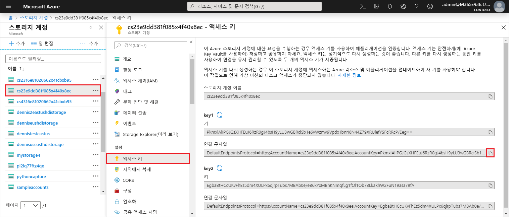
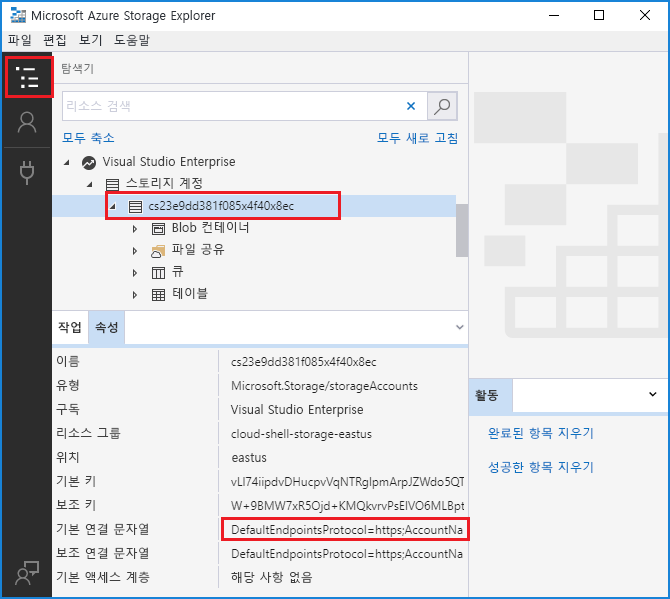

# <a name="work-with-azure-functions-core-tools"></a>Azure Functions 핵심 도구 작업

Azure Functions 핵심 도구를 사용하여 명령 프롬프트 또는 터미널의 로컬 머신에서 함수를 개발하고 테스트할 수 있습니다. 로컬 함수는 라이브 Azure 서비스에 연결할 수 있고 사용자는 전체 Functions 런타임을 사용하여 로컬 머신에서 함수를 디버깅할 수 있습니다. Azure 구독에 함수 앱을 배포할 수도 있습니다.

[!INCLUDE [Don't mix development environments](../../includes/functions-mixed-dev-environments.md)]

## <a name="core-tools-versions"></a>핵심 도구 버전

Azure Functions 핵심 도구에는 두 가지 버전이 있습니다. 사용 중인 버전은 로컬 개발 환경, [선택한 언어](supported-languages.md) 및 필요한 지원 수준에 따라 달라집니다.

+ 버전 1.x: 런타임 버전 1.x를 지원합니다. 이 버전의 도구는 Windows 컴퓨터에서만 지원되며 [npm 패키지](https://docs.npmjs.com/getting-started/what-is-npm)에서 설치됩니다. 이 버전을 사용하면 공식적으로 지원되지 않는 실험적 언어로 함수를 만들 수 있습니다. 자세한 내용은 [Azure Functions에서 지원되는 언어](supported-languages.md)를 참조하세요.

+ [버전 2.x](#v2): [런타임 버전 2.x](functions-versions.md)를 지원합니다. 이 버전은 [Windows](#windows-npm), [macOS](#brew) 및 [Linux](#linux)를 지원합니다. 설치에 플랫폼별 패키지 관리자 또는 npm을 사용합니다.

언급이 없는 경우 이 아티클의 예제는 2.x 버전용입니다.

## <a name="install-the-azure-functions-core-tools"></a>Azure Functions 핵심 도구 설치

[Azure Functions 핵심 도구]에는 로컬 개발 컴퓨터에서 실행할 수 있는 Azure Functions 런타임을 제공하는 동일한 런타임 버전이 포함됩니다. 또한 함수를 만들고, Azure에 연결하고, 함수 프로젝트를 배포하는 명령을 제공합니다.

### <a name="v2"></a>버전 2.x

버전 2.x 도구는 .NET Core를 기반으로 하는 Azure Functions 런타임 2.x를 사용합니다. 이 버전은 [Windows](#windows-npm), [macOS](#brew) 및 [Linux](#linux)를 포함하여 .NET Core 2.x에서 지원하는 모든 플랫폼에서 지원됩니다. 먼저 .NET Core 2.x SDK를 설치해야 합니다.

#### <a name="windows-npm"></a>Windows

다음 단계에서는 npm을 사용하여 Windows에 핵심 도구를 설치합니다. [Chocolatey](https://chocolatey.org/)를 사용할 수도 있습니다. 자세한 내용은 [핵심 도구 추가 정보](https://github.com/Azure/azure-functions-core-tools/blob/master/README.md#windows)를 참조하세요.

1. [Windows용 .NET Core 2.x SDK](https://www.microsoft.com/net/download/windows)를 설치합니다.

2. [Node.js](npm 포함)를 설치합니다. 버전 2.x 도구의 경우 Node.js 8.5 이상 버전만 지원됩니다.

3. 다음과 같이 핵심 도구 패키지를 설치합니다.

    ```bash
    npm install -g azure-functions-core-tools
    ```

#### <a name="brew"></a>Homebrew가 있는 MacOS

다음 단계에서는 Homebrew를 사용하여 macOS에 핵심 도구를 설치합니다.

1. [macOS용 .NET Core 2.x SDK](https://www.microsoft.com/net/download/macos)를 설치합니다.

2. 아직 설치되지 않은 경우 [Homebrew](https://brew.sh/)를 설치합니다.

3. 다음과 같이 핵심 도구 패키지를 설치합니다.

    ```bash
    brew tap azure/functions
    brew install azure-functions-core-tools
    ```

#### <a name="linux"></a>APT가 있는 Linux(Debian/Ubuntu)

다음 단계에서는 [APT](https://wiki.debian.org/Apt)를 사용하여 Ubuntu/Debian Linux 배포판에 핵심 도구를 설치합니다. 다른 Linux 배포판의 경우 [핵심 도구 추가 정보](https://github.com/Azure/azure-functions-core-tools/blob/master/README.md#linux)를 참조하세요.

1. [Linux용 .NET Core 2.x SDK](https://www.microsoft.com/net/download/linux)를 설치합니다.

2. Microsoft 제품 키를 신뢰할 수 있는 키로 등록합니다.

    ```bash
    curl https://packages.microsoft.com/keys/microsoft.asc | gpg --dearmor > microsoft.gpg
    sudo mv microsoft.gpg /etc/apt/trusted.gpg.d/microsoft.gpg
    ```

3. Ubuntu 서버가 아래 표에서 적절한 버전 중 하나를 실행하고 있는지 확인합니다. Apt 원본을 추가하려면 다음을 실행합니다.

    ```bash
    sudo sh -c 'echo "deb [arch=amd64] https://packages.microsoft.com/repos/microsoft-ubuntu-$(lsb_release -cs)-prod $(lsb_release -cs) main" > /etc/apt/sources.list.d/dotnetdev.list'
    sudo apt-get update
    ```

    | Linux 배포 | Version |
    | --------------- | ----------- |
    | Ubuntu 18.10    | `cosmic`    |
    | Ubuntu 18.04    | `bionic`    |
    | Ubuntu 17.04    | `zesty`     |
    | Ubuntu 16.04/Linux Mint 18    | `xenial`  |

4. 다음과 같이 핵심 도구 패키지를 설치합니다.

    ```bash
    sudo apt-get install azure-functions-core-tools
    ```

## <a name="create-a-local-functions-project"></a>로컬 Functions 프로젝트 만들기

함수 프로젝트 디렉터리에는 개별 함수에 대한 코드가 포함된 하위 폴더와 함께 [host.json](functions-host-json.md) 및 [local.settings.json](#local-settings-file) 파일이 포함됩니다. 이 디렉터리는 Azure의 함수 앱에 해당합니다. Functions 폴더 구조에 대한 자세한 내용은 [Azure Functions 개발자 가이드](functions-reference.md#folder-structure)를 참조하세요.

버전 2.x는 초기화될 때 프로젝트에 대한 기본 언어를 선택해야 하고 추가된 모든 기능은 기본 언어 템플릿을 사용합니다. 버전 1.x에서는 함수를 만들 때마다 언어를 지정합니다.

터미널 창이나 명령 프롬프트에서 다음 명령을 실행하여 프로젝트 및 로컬 Git 리포지토리를 만듭니다.

```bash
func init MyFunctionProj
```

프로젝트 이름을 제공하면 해당 이름을 사용한 새 폴더가 생성되고 초기화됩니다. 그렇지 않으면 현재 폴더는 초기화됩니다.  
버전 2.x에서는 명령을 실행할 때 프로젝트에 대한 런타임을 선택해야 합니다. JavaScript 함수를 개발하려는 경우 **노드**를 선택합니다.

```output
Select a worker runtime:
dotnet
node
```

위쪽/아래쪽 화살표 키를 사용하여 언어를 선택한 다음, Enter 키를 누릅니다. 출력은 JavaScript 프로젝트에 대한 다음 예제와 유사합니다.

```output
Select a worker runtime: node
Writing .gitignore
Writing host.json
Writing local.settings.json
Writing C:\myfunctions\myMyFunctionProj\.vscode\extensions.json
Initialized empty Git repository in C:/myfunctions/myMyFunctionProj/.git/
```

별도의 설명이 없으면 `func init`는 다음 옵션(버전 2.x 전용)을 지원합니다.

| 옵션     | 설명                            |
| ------------ | -------------------------------------- |
| **`--csx`** | C# 스크립트(.csx) 프로젝트를 초기화합니다. 후속 명령에서 `--csx`를 지정해야 합니다. |
| **`--docker`** | 선택한 `--worker-runtime`을 기반으로 하는 기본 이미지를 사용하여 컨테이너용 Docker 파일을 만듭니다. 사용자 지정 Linux 컨테이너에 게시하려는 경우 이 옵션을 사용합니다. |
| **`--force`** | 프로젝트에 기존 파일이 있어도 프로젝트를 초기화합니다. 이 설정은 이름이 같은 기존 파일을 덮어씁니다. 프로젝트 폴더의 다른 파일에는 영향이 없습니다. |
| **`--no-source-control -n`** | 버전 1.x에서 Git 리포지토리 기본 작성을 차단합니다. 버전 2.x에서는 Git 리포지토리가 기본적으로 작성되지 않습니다. |
| **`--source-control`** | Git 리포지토리 작성 여부를 제어합니다. 리포지토리는 기본적으로 작성되지 않습니다. `true`이면 리포지토리가 작성됩니다. |
| **`--worker-runtime`** | 프로젝트의 언어 런타임을 설정합니다. 지원되는 값은 `dotnet`, `node`(JavaScript), `java` 및 `python`입니다. 설정하지 않으면 초기화 중에 런타임을 선택하라는 메시지가 표시됩니다. |

> [!IMPORTANT]
> 기본적으로 핵심 도구 버전 2.x에서는 .NET 런타임에 대한 함수 앱 프로젝트를 [C# 클래스 프로젝트](functions-dotnet-class-library.md)(.csproj)로 만듭니다. 이러한 C# 프로젝트는 Visual Studio 또는 Visual Studio Code에서 사용할 수 있으며, 테스트 중에/Azure에 게시할 때 컴파일됩니다. 버전 1.x 및 포털에서 생성되는 것과 동일한 C# 스크립트(.csx) 파일을 만들고 작업하려는 경우, 함수를 만들고 배포할 때 `--csx` 매개 변수를 포함해야 합니다.

## <a name="register-extensions"></a>확장 등록

Azure Functions 런타임의 2.x 버전에서는 함수 앱에서 사용하는 바인딩 확장(바인딩 형식)을 명시적으로 등록해야 합니다.

[!INCLUDE [Register extensions](../../includes/functions-core-tools-install-extension.md)]

자세한 내용은 [Azure Functions 트리거 및 바인딩 개념](./functions-bindings-expressions-patterns.md)을 참조하세요.

## <a name="local-settings-file"></a>로컬 설정 파일

local.settings.json 파일은 앱 설정, 연결 문자열 및 Azure Functions 핵심 도구에 대한 설정을 저장합니다. local.settings.json 파일의 설정은 로컬에서 실행할 때 Functions 도구에서만 사용됩니다. 기본적으로 이러한 설정은 프로젝트가 Azure에 게시될 때 자동으로 마이그레이션되지 않습니다. [게시할 때](#publish) `--publish-local-settings` 스위치를 사용하여 이러한 설정이 Azure의 함수 앱에 추가되었는지 확인합니다. **ConnectionStrings**의 값은 게시되지 않습니다. 파일의 구조는 다음과 같습니다.

```json
{
  "IsEncrypted": false,
  "Values": {
    "FUNCTIONS_WORKER_RUNTIME": "<language worker>",
    "AzureWebJobsStorage": "<connection-string>",
    "AzureWebJobsDashboard": "<connection-string>",
    "MyBindingConnection": "<binding-connection-string>"
  },
  "Host": {
    "LocalHttpPort": 7071,
    "CORS": "*"
  },
  "ConnectionStrings": {
    "SQLConnectionString": "<sqlclient-connection-string>"
  }
}
```

| 설정      | 설명                            |
| ------------ | -------------------------------------- |
| **`IsEncrypted`** | 로 설정 하면 `true`, 모든 값은 로컬 컴퓨터 키를 사용 하 여 암호화 됩니다. `func settings` 명령과 함께 사용됩니다. 기본값은 `false`입니다. |
| **`Values`** | 로컬에서 실행될 때 사용되는 연결 문자열 및 애플리케이션 설정의 컬렉션입니다. 이러한 값과 같은 Azure에서 함수 앱의 앱 설정에 해당 [ `AzureWebJobsStorage` ]합니다. 많은 트리거와 바인딩에 같은 연결 문자열 앱 설정 참조 속성이 `Connection` 에 대 한 합니다 [Blob storage 트리거](functions-bindings-storage-blob.md#trigger---configuration)합니다. 이러한 속성에 정의 된 응용 프로그램 설정 해야 합니다 `Values` 배열입니다. <br/>[`AzureWebJobsStorage`] HTTP 이외의 트리거에 대 한 필수 앱 설정입니다. <br/>버전의 Functions 런타임 2.x 필요 합니다 [ `FUNCTIONS_WORKER_RUNTIME` ] 핵심 도구 프로젝트에 대해 생성 되는 설정입니다. <br/> 경우는 [Azure storage 에뮬레이터](../storage/common/storage-use-emulator.md) 로컬로 설치를 설정할 수 있습니다 [ `AzureWebJobsStorage` ] 를 `UseDevelopmentStorage=true` 핵심 도구 에뮬레이터를 사용 합니다. 개발 중에 유용하지만 배포 전에 실제 저장소 연결을 테스트해야 합니다. |
| **`Host`** | 이 섹션의 설정은 로컬에서 실행할 때 Functions 호스트 프로세스를 사용자 지정합니다. |
| **`LocalHttpPort`** | 로컬 Functions 호스트(`func host start` 및 `func run`)를 실행할 때 사용되는 기본 포트를 설정합니다. `--port` 명령줄 옵션이 이 값보다 우선합니다. |
| **`CORS`** | [CORS(원본 간 리소스 공유)](https://en.wikipedia.org/wiki/Cross-origin_resource_sharing)에 허용된 원본을 정의합니다. 원본은 공백 없이 쉼표로 구분된 목록으로 제공됩니다. 와일드카드 값(\*)이 지원되므로 모든 원본에서 요청할 수 있습니다. |
| **`ConnectionStrings`** | 함수 바인딩에서 사용하는 연결 문자열에 대해 이 컬렉션을 사용하지 마십시오. 이 컬렉션은 일반적으로 연결 문자열에서 가져오기 프레임 워크만 사용 합니다 `ConnectionStrings` 섹션의 구성 파일을 [Entity Framework](https://msdn.microsoft.com/library/aa937723(v=vs.113).aspx). 이 개체의 연결 문자열은 공급자 유형이 [System.Data.SqlClient](https://msdn.microsoft.com/library/system.data.sqlclient(v=vs.110).aspx)인 환경에 추가됩니다. 이 컬렉션의 항목은 다른 앱 설정을 사용하여 Azure에 게시되지 않습니다. 이러한 값을 명시적으로 추가 해야 합니다 `Connection strings` 함수 앱 설정의 컬렉션입니다. 만들려는 경우는 [ `SqlConnection` ](https://msdn.microsoft.com/library/system.data.sqlclient.sqlconnection(v=vs.110).aspx) 함수 코드에서 연결 문자열 값을 저장 해야 **응용 프로그램 설정** 다른 연결을 사용 하 여 포털에 있습니다. |

이 함수 앱 설정 값은 코드에서 환경 변수로 읽을 수도 있습니다. 자세한 내용은 다음 언어별 참조 항목의 Environment 변수 섹션을 참조하세요.

* [미리 컴파일된 C#](functions-dotnet-class-library.md#environment-variables)
* [C# 스크립트(.csx)](functions-reference-csharp.md#environment-variables)
* [F# 스크립트(.fsx)](functions-reference-fsharp.md#environment-variables)
* [Java](functions-reference-java.md#environment-variables)
* [JavaScript](functions-reference-node.md#environment-variables)

올바른 저장소 연결 문자열 설정 된 경우 [ `AzureWebJobsStorage` ] 에뮬레이터를 사용 하지 않을, 다음 오류 메시지가 표시 됩니다.

> local.settings.json에 AzureWebJobsStorage 값이 없습니다. 이 값은 HTTP 이외의 모든 트리거에 필요합니다. 'func azure functionapp fetch-app-settings \<functionAppName\>'을 실행하거나 local.settings.json에서 연결 문자열을 지정할 수 있습니다.

### <a name="get-your-storage-connection-strings"></a>저장소 연결 문자열 가져오기

개발을 위해 저장소 에뮬레이터를 사용하는 경우라도 실제 저장소 연결을 테스트하고 싶을 수 있습니다. 이미 [저장소 계정을 만든](../storage/common/storage-create-storage-account.md) 것으로 가정하면 다음 방법 중 하나에서 유효한 저장소 연결 문자열을 가져올 수 있습니다.

+ [Azure Portal] 저장소 계정으로 이동하여 **설정**에서 **액세스 키**를 선택한 다음, **연결 문자열** 값 중 하나를 복사합니다.

  

+ [Azure Storage 탐색기](https://storageexplorer.com/)를 사용하여 Azure 계정에 연결합니다. **탐색기**에서 구독을 확장하고, 저장소 계정을 선택하고, 기본 또는 보조 연결 문자열을 복사합니다.

  

+ 다음 중 한 명령을 사용하여 Azure에서 연결 문자열을 다운로드하려면 핵심 도구를 사용합니다.

  + 기존 함수 앱에서 모든 설정을 다운로드합니다.

    ```bash
    func azure functionapp fetch-app-settings <FunctionAppName>
    ```
  + 특정 저장소 계정에 대한 연결 문자열을 가져옵니다.

    ```bash
    func azure storage fetch-connection-string <StorageAccountName>
    ```

    Azure에 로그인하지 않은 경우 수행하라는 메시지가 나타납니다.

## <a name="create-func"></a>함수 만들기

함수를 만들려면 다음 명령을 실행합니다.

```bash
func new
```

버전 2.x에서 `func new`를 실행하는 경우 함수 앱의 기본 언어에서 템플릿을 선택하라는 메시지가 나타난 다음, 함수에 대한 이름을 선택하라는 메시지도 표시됩니다. 버전 1.x에서는 언어를 선택하라는 메시지도 표시됩니다.

```output
Select a language: Select a template:
Blob trigger
Cosmos DB trigger
Event Grid trigger
HTTP trigger
Queue trigger
SendGrid
Service Bus Queue trigger
Service Bus Topic trigger
Timer trigger
```

함수 코드는 다음 큐 트리거 출력에서 알 수 있듯이 제공된 함수 이름으로 하위 폴더에 생성됩니다.

```output
Select a language: Select a template: Queue trigger
Function name: [QueueTriggerJS] MyQueueTrigger
Writing C:\myfunctions\myMyFunctionProj\MyQueueTrigger\index.js
Writing C:\myfunctions\myMyFunctionProj\MyQueueTrigger\readme.md
Writing C:\myfunctions\myMyFunctionProj\MyQueueTrigger\sample.dat
Writing C:\myfunctions\myMyFunctionProj\MyQueueTrigger\function.json
```

다음 인수를 사용하는 명령에서 이러한 옵션을 지정할 수도 있습니다.

| 인수     | 설명                            |
| ------------------------------------------ | -------------------------------------- |
| **`--csx`** | (버전 2.x) 버전 1.x 및 포털에서 사용되는 것과 동일한 C# 스크립트(.csx) 템플릿을 생성합니다. |
| **`--language -l`**| C#, F# 또는 JavaScript와 같은 템플릿 프로그래밍 언어 이 옵션은 버전 1.x에서 필요합니다. 버전 2.x에서는 이 옵션을 사용하지 않거나 작업자 런타임과 일치하는 언어를 선택하세요. |
| **`--name -n`** | 함수 이름 |
| **`--template -t`** | `func templates list` 명령을 사용하여 지원되는 각 언어에 대해 사용 가능한 템플릿의 전체 목록을 확인합니다.   |

예를 들어 단일 명령에서 JavaScript HTTP 트리거를 만들려면 다음을 실행합니다.

```bash
func new --template "Http Trigger" --name MyHttpTrigger
```

단일 명령에서 큐 트리거 함수를 만들려면 다음을 실행합니다.

```bash
func new --template "Queue Trigger" --name QueueTriggerJS
```

## <a name="start"></a>로컬로 함수 실행

Functions 프로젝트를 실행하려면 Functions 호스트를 실행합니다. 이 호스트는 프로젝트의 모든 함수에 대한 트리거를 활성화합니다.

```bash
func host start
```

`host` 명령은 버전 1.x에서만 필요합니다.

`func host start`은 다음 옵션을 지원합니다.

| 옵션     | 설명                            |
| ------------ | -------------------------------------- |
| **`--no-build`** | 실행 전에 현재 프로젝트를 빌드하지 않도록 합니다. dotnet 프로젝트에만 해당합니다. 기본값은 false로 설정하는 것입니다. 버전 2.x 전용입니다. |
| **`--cert`** | 개인 키가 포함된 .pfx 파일에 대한 경로입니다. `--useHttps`을 통해서만 사용됩니다. 버전 2.x 전용입니다. |
| **`--cors-credentials`** | 원본 간 인증된 요청(즉, 쿠키 및 인증 헤더)을 허용하며, 버전 2.x 전용입니다. |
| **`--cors`** | CORS 원본의 공백 없이 쉼표로 구분된 목록입니다. |
| **`--language-worker`** | 언어 작업자를 구성하는 인수입니다. 버전 2.x 전용입니다. |
| **`--nodeDebugPort -n`** | 사용할 노드 디버거의 포트입니다. Default: launch.json 값 또는 5858. 버전 1.x 전용입니다. |
| **`--password`** | .pfx 파일에 대한 암호가 포함된 암호 또는 파일입니다. `--cert`을 통해서만 사용됩니다. 버전 2.x 전용입니다. |
| **`--port -p`** | 수신 대기할 로컬 포트입니다. 기본값: 7071. |
| **`--pause-on-error`** | 프로세스를 종료하기 전에 추가 입력에 대해 일시 중지합니다. IDE(통합 개발 환경)에서 Core Tools를 시작할 때만 사용됩니다.|
| **`--script-root --prefix`** | 실행하거나 배포할 함수 앱의 루트 경로를 지정하는 데 사용됩니다. 하위 폴더에 프로젝트 파일을 생성하는 컴파일된 프로젝트용으로 사용됩니다. 예를 들어 C# 클래스 라이브러리 프로젝트를 작성할 때는 `MyProject/bin/Debug/netstandard2.0`과 같은 경로를 사용하여 *root* 하위 폴더에 host.json, local.settings.json 및 function.json 파일이 생성됩니다. 이 경우 접두사를 `--script-root MyProject/bin/Debug/netstandard2.0`으로 설정합니다. 이 접두사는 Azure에서 실행할 때의 함수 앱 루트입니다. |
| **`--timeout -t`** | Functions 호스트를 시작할 제한 시간(초)입니다. Default: 20초.|
| **`--useHttps`** | `http://localhost:{port}`가 아닌 `https://localhost:{port}`에 바인딩합니다. 기본적으로 이 옵션은 사용자 컴퓨터에 신뢰할 수 있는 인증서를 만듭니다.|

C# 클래스 라이브러리 프로젝트(.csproj)의 경우 library.dll을 생성하려면 `--build` 옵션을 포함해야 합니다.

Functions 호스트가 시작되면 HTTP 트리거 함수의 URL이 출력됩니다.

```output
Found the following functions:
Host.Functions.MyHttpTrigger

Job host started
Http Function MyHttpTrigger: http://localhost:7071/api/MyHttpTrigger
```

>[!IMPORTANT]
>로컬로 실행할 때 인증은 HTTP 엔드포인트에 적용되지 않습니다. 즉, 모든 로컬 HTTP 요청은 `authLevel = "anonymous"`로 처리됩니다. 자세한 내용은 [HTTP 바인딩 문서](functions-bindings-http-webhook.md#authorization-keys)를 참조하세요.

### <a name="passing-test-data-to-a-function"></a>테스트 데이터를 함수에 전달

로컬로 함수를 테스트하려면 [Functions 호스트를 시작](#start)하고 HTTP 요청을 사용하여 로컬 서버에서 엔드포인트를 호출합니다. 호출하는 엔드포인트는 함수의 형식에 따라 달라집니다.

>[!NOTE]
> 이 항목의 예제에서는 cURL 도구를 사용하여 터미널 또는 명령 프롬프트의 HTTP 요청을 보냅니다. 로컬 서버에 HTTP 요청을 보내도록 선택한 도구를 사용할 수 있습니다. cURL 도구는 Linux 기반 시스템에서 기본적으로 사용할 수 있습니다. Windows에서는 먼저 [cURL 도구](https://curl.haxx.se/)를 다운로드한 후 설치해야 합니다.

함수를 테스트하는 방법에 대한 일반적인 내용은 [Azure Functions에서 코드를 테스트하기 위한 전략](functions-test-a-function.md)을 참조하세요.

#### <a name="http-and-webhook-triggered-functions"></a>HTTP 및 웹후크 트리거된 함수

다음 엔드포인트를 호출하여 HTTP 및 웹후크 트리거된 함수를 로컬로 실행합니다.

    http://localhost:{port}/api/{function_name}

Functions 호스트가 수신 대기 중인 동일한 서버 이름 및 포트를 사용하도록 합니다. Function 호스트를 시작할 때 생성된 출력에서 이 항목을 확인합니다. 트리거에서 지원하는 HTTP 메서드를 사용하여 이 URL을 호출할 수 있습니다.

다음 cURL 명령은 _이름_ 매개 변수를 쿼리 문자열에 전달한 GET 요청에서 `MyHttpTrigger` 빠른 시작 함수를 트리거합니다.

```bash
curl --get http://localhost:7071/api/MyHttpTrigger?name=Azure%20Rocks
```

다음 예제는 요청 본문에서 _이름_을 전달하는 POST 요청에서 호출되는 동일한 함수입니다.

```bash
curl --request POST http://localhost:7071/api/MyHttpTrigger --data '{"name":"Azure Rocks"}'
```

쿼리 문자열에서 데이터를 전달하는 브라우저에서 GET 요청을 수행할 수 있습니다. 다른 모든 HTTP 메서드에서 cURL, Fiddler, Postman 또는 비슷한 HTTP 테스트 도구를 사용해야 합니다.

#### <a name="non-http-triggered-functions"></a>HTTP가 아닌 트리거된 함수

HTTP 트리거와 웹후크가 아닌 다른 모든 종류의 함수에서 관리 엔드포인트를 호출하여 로컬로 함수를 테스트할 수 있습니다. 로컬 서버에서 HTTP POST 요청으로 이 엔드포인트를 호출하면 함수를 트리거합니다. 필요에 따라 POST 요청의 본문에서 실행에 테스트 데이터를 전달할 수 있습니다. 이 기능은 Azure Portal에서 **테스트** 탭과 비슷합니다.

다음 관리자 엔드포인트를 호출하여 HTTP가 아닌 함수를 트리거합니다.

    http://localhost:{port}/admin/functions/{function_name}

함수의 관리자 엔드포인트에 테스트 데이터를 전달하려면 POST 요청 메시지의 본문에서 데이터를 제공해야 합니다. 메시지 본문에는 다음 JSON 형식이 필요합니다.

```JSON
{
    "input": "<trigger_input>"
}
```

`<trigger_input>` 값에는 함수에 필요한 형식의 데이터가 포함됩니다. 다음 cURL 예제는 `QueueTriggerJS` 함수에 대한 POST 요청입니다. 이 경우에 입력은 큐에 위치해야 하는 메시지에 해당하는 문자열입니다.

```bash
curl --request POST -H "Content-Type:application/json" --data '{"input":"sample queue data"}' http://localhost:7071/admin/functions/QueueTriggerJS
```

#### <a name="using-the-func-run-command-in-version-1x"></a>1.x 버전에서 `func run` 명령 사용

>[!IMPORTANT]
> `func run` 명령은 도구의 2.x 버전에서 지원되지 않습니다. 자세한 내용은 [Azure Functions 런타임 버전을 대상으로 지정하는 방법](set-runtime-version.md) 항목을 참조하세요.

`func run <FunctionName>`을 사용하여 함수를 직접 호출하고 함수에 대한 입력 데이터를 제공할 수도 있습니다. 이 명령은 Azure Portal에서 **테스트** 탭을 사용하여 함수를 실행하는 것과 비슷합니다.

`func run`은 다음 옵션을 지원합니다.

| 옵션     | 설명                            |
| ------------ | -------------------------------------- |
| **`--content -c`** | 인라인 콘텐츠입니다. |
| **`--debug -d`** | 함수를 실행하기 전에 호스트 프로세스에 디버거를 연결합니다.|
| **`--timeout -t`** | 로컬 Functions 호스트가 준비될 때까지의 대기 시간(초)입니다.|
| **`--file -f`** | 콘텐츠로 사용할 파일 이름입니다.|
| **`--no-interactive`** | 입력에 대한 메시지를 표시하지 않습니다. 자동화 시나리오에 유용합니다.|

예를 들어 HTTP 트리거 함수를 호출하고 콘텐츠 본문을 전달하려면 다음 명령을 실행합니다.

```bash
func run MyHttpTrigger -c '{\"name\": \"Azure\"}'
```

## <a name="publish"></a>Azure에 게시

Core Tools는 두 가지 배포 유형을 지원합니다. 그중 하나는 함수 앱에 함수 프로젝트 파일을 직접 배포하는 것이고, 다른 하나는 사용자 지정 Linux 컨테이너를 배포하는 것입니다. 두 번째 유형은 버전 2.x에서만 지원됩니다. 그리고 이미 [Azure 구독에서 함수 앱을 작성](functions-cli-samples.md#create)한 상태여야 합니다.

버전 2.x에서는 게시 전에 프로젝트에서 [확장을 등록](#register-extensions)해야 합니다. 컴파일해야 하는 프로젝트는 이진 파일을 배포할 수 있는 방식으로 빌드해야 합니다.

### <a name="project-file-deployment"></a>프로젝트 파일 배포

가장 흔히 사용되는 배포 방법에서는 Core Tools를 사용하여 함수 앱 프로젝트, 이진 파일 및 종속성을 패키지로 만든 후 함수 앱에 해당 패키지를 배포합니다. 필요한 경우 [배포 패키지에서 함수를 직접 실행](run-functions-from-deployment-package.md)할 수 있습니다.

Azure의 함수 앱에 Functions 프로젝트를 게시하려면 `publish` 명령을 사용합니다.

```bash
func azure functionapp publish <FunctionAppName>
```

이 명령은 Azure에서 기존 함수 앱에 게시합니다. `<FunctionAppName>`이 구독에 없으면 오류가 발생합니다. Azure CLI를 사용하여 명령 프롬프트 또는 터미널 창에서 함수 앱을 만드는 방법을 알아보려면 [서버를 사용하지 않고 실행하기 위한 Function App 만들기](./scripts/functions-cli-create-serverless.md)를 참조하세요.

`publish` 명령은 Functions 프로젝트 디렉터리의 콘텐츠를 업로드합니다. 파일을 로컬로 삭제하는 경우 `publish` 명령은 Azure에서 해당 파일을 삭제하지 않습니다. [Azure Portal]에서 [Kudu 도구](functions-how-to-use-azure-function-app-settings.md#kudu)를 사용하여 Azure에서 파일을 삭제할 수 있습니다.

>[!IMPORTANT]
> Azure Portal에서 함수 앱을 만들 때는 기본적으로 Function 런타임 버전 2.x가 사용됩니다. 함수 앱이 런타임 버전 1.x를 사용하도록 하려면 [버전 1.x에서 실행](functions-versions.md#creating-1x-apps)의 지침을 따르세요.
> 기존 함수가 있는 함수 앱의 런타임 버전은 변경할 수 없습니다.

다음 프로젝트 게시 옵션은 두 버전 1.x 및 2.x에 모두 적용됩니다.

| 옵션     | 설명                            |
| ------------ | -------------------------------------- |
| **`--publish-local-settings -i`** |  local.settings.json의 설정을 Azure에 게시하고, 설정이 이미 있는 경우 덮어쓸지 묻습니다. 저장소 에뮬레이터를 사용하는 경우 앱 설정을 [실제 저장소 연결](#get-your-storage-connection-strings)로 변경합니다. |
| **`--overwrite-settings -y`** | `--publish-local-settings -i` 사용 시 앱 설정을 덮어쓴다는 메시지를 표시하지 않습니다.|

다음 프로젝트 게시 옵션은 버전 2.x에서만 지원됩니다.

| 옵션     | 설명                            |
| ------------ | -------------------------------------- |
| **`--publish-settings-only -o`** |  설정만 게시하고 콘텐츠는 건너뜁니다. 기본값은 프롬프트입니다. |
|**`--list-ignored-files`** | .funcignore 파일을 기준으로 하여 게시 중에 무시되는 파일 목록을 표시합니다. |
| **`--list-included-files`** | .funcignore 파일을 기준으로 하여 게시되는 파일 목록을 표시합니다. |
| **`--nozip`** | 기본 `Run-From-Zip` 모드를 끕니다. |
| **`--build-native-deps`** | Python 함수 앱을 게시할 때 .wheels 폴더 생성을 건너뜁니다. |
| **`--additional-packages`** | 네이티브 종속성을 빌드할 때 설치할 패키지 목록입니다. 예: `python3-dev libevent-dev` |
| **`--force`** | 특정 시나리오에서 게시 전 확인을 무시합니다. |
| **`--csx`** | C# 스크립트(.csx) 프로젝트를 게시합니다. |
| **`--no-build`** | dotnet 함수 작성을 건너뜁니다. |
| **`--dotnet-cli-params`** | 컴파일된 C#(.csproj) 함수를 게시할 때 Core Tools는 'dotnet build --output bin/publish'를 호출합니다. 이 명령으로 전달하는 모든 매개 변수는 명령줄에 추가됩니다. |

### <a name="custom-container-deployment"></a>사용자 지정 컨테이너 배포

Functions에서는 사용자 지정 Linux 컨테이너에서 함수 프로젝트를 배포할 수 있습니다. 자세한 내용은 [사용자 지정 이미지를 사용하여 Linux에서 함수 만들기](functions-create-function-linux-custom-image.md)를 참조하세요. Core Tools 버전 2.x에서는 사용자 지정 컨테이너 배포가 지원됩니다. 사용자 지정 컨테이너에는 Dockerfile이 있어야 합니다. Dockerfile을 포함하려면 `func init`에서 --dockerfile 옵션을 사용합니다.

```bash
func deploy
```

다음과 같은 사용자 지정 컨테이너 배포 옵션을 사용할 수 있습니다.

| 옵션     | 설명                            |
| ------------ | -------------------------------------- |
| **`--registry`** | 현재 사용자가 로그인되어 있는 Docker 레지스트리의 이름입니다. |
| **`--platform`** | 함수 앱의 호스팅 플랫폼입니다. 유효한 옵션은 `kubernetes`입니다. |
| **`--name`** | 함수 앱 이름입니다. |
| **`--max`**  | 필요한 경우 배포할 함수 앱 인스턴스의 최대 수를 설정합니다. |
| **`--min`**  | 필요한 경우 배포할 함수 앱 인스턴스의 최소 수를 설정합니다. |
| **`--config`** | 선택적 배포 구성 파일을 설정합니다. |

## <a name="monitoring-functions"></a>함수 모니터링

함수 실행을 모니터링 하려면 Azure Application Insights와 통합 하 여는 것이 좋습니다. Azure Portal에서 함수 앱을 만들 때는 이 통합이 기본적으로 자동 수행됩니다. 그러나 Azure CLI를 사용하여 함수 앱을 만드는 경우 Azure에서 함수 앱 통합이 수행되지 않습니다.

함수 앱에 대해 Application Insights를 사용하도록 설정하려면 다음 단계를 수행합니다.

[!INCLUDE [functions-connect-new-app-insights.md](../../includes/functions-connect-new-app-insights.md)]

자세히 알아보려면 [Azure Functions 모니터링](functions-monitoring.md)을 참조하세요.

## <a name="next-steps"></a>다음 단계

Azure Functions 핵심 도구는 [오픈 소스이며 GitHub에서 호스팅](https://github.com/azure/azure-functions-cli)됩니다.  
버그 또는 기능 요청을 제출하려면 [GitHub 문제를 개설](https://github.com/azure/azure-functions-cli/issues)합니다.

<!-- LINKS -->

[Azure Functions 핵심 도구]: https://www.npmjs.com/package/azure-functions-core-tools
[Azure Portal]: https://portal.azure.com 
[Node.JS]: https://docs.npmjs.com/getting-started/installing-node#osx-or-windows
[`FUNCTIONS_WORKER_RUNTIME`]: functions-app-settings.md#functions_worker_runtime
[`AzureWebJobsStorage`]: functions-app-settings.md#azurewebjobsstorage
