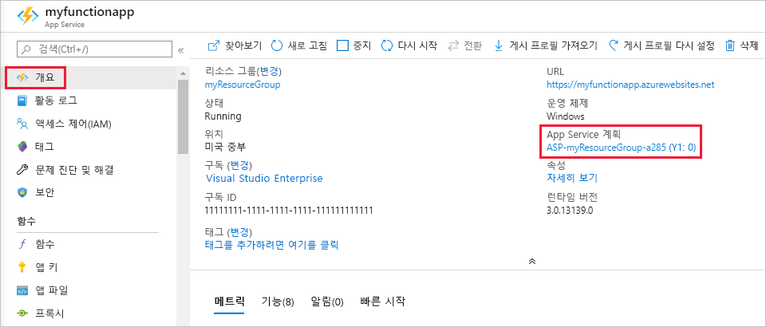

# <a name="azure-functions-scale-and-hosting"></a>Azure Functions 크기 조정 및 호스팅

Azure Functions는 소비 계획 또는 Azure App Service 계획의 두 가지 모드로 실행됩니다. 소비 계획은 코드가 실행될 때 계산 능력을 자동으로 할당합니다. 로드를 처리해야 하는 경우 앱이 규모 확장되고 코드가 실행되지 않을 때는 규모 축소됩니다. 유휴 VM에 대한 요금을 지불하고 용량을 미리 예약할 필요가 없습니다.

> [!NOTE]  
> [Linux 호스팅](functions-create-first-azure-function-azure-cli-linux.md)은 현재 App Service 계획에서만 사용할 수 있습니다.

Azure Functions에 익숙하지 않으면 [Azure Functions 개요](functions-overview.md)를 참조하세요.

함수 앱을 만들 때 앱에 있는 함수에 대한 호스팅 계획을 선택합니다. 두 계획에서 *Azure Functions 호스트* 인스턴스는 함수를 실행합니다. 계획 형식은 다음을 제어합니다.

* 호스트 인스턴스 확장 방법
* 각 호스트에 사용할 수 있는 리소스

> [!IMPORTANT]
> 함수 앱을 만드는 중에 호스팅 계획 형식을 선택해야 합니다. 나중에 변경할 수 없습니다.

App Service 계획에서는 계층 간에 크기 조정하여 서로 다른 양의 리소스를 할당할 수 있습니다. 소비 계획에서 Azure Functions는 모든 리소스 할당을 자동으로 처리합니다. 

## <a name="consumption-plan"></a>소비 계획

소비 계획을 사용하는 경우 Azure Functions 호스트의 인스턴스는 들어오는 이벤트의 수에 따라 동적으로 추가되고 제거됩니다. 이 서버를 사용하지 않는 계획은 자동으로 규모를 조정하며, 함수를 실행하는 경우에만 계산 리소스에 대한 요금이 청구됩니다. 소비 계획에서 구성 가능한 시간 후 함수 실행 시간이 초과됩니다.

> [!NOTE]
> 소비 계획에서 함수에 대한 기본 시간 제한은 5분입니다. [host.json](functions-host-json.md#functiontimeout) 프로젝트 파일에서 `functionTimeout` 속성을 변경하여 함수 앱에서 이 값을 최대 10분으로 늘릴 수 있습니다.

청구는 실행 횟수, 실행 시간 및 사용된 메모리를 기반으로 하며, 함수 앱 내의 모든 함수에 대해 집계됩니다. 자세한 내용은 [Azure Functions 가격 책정 페이지]를 참조하세요.

소비 계획은 기본 호스팅 계획이며 다음과 같은 이점을 제공합니다.

* 함수를 실행 중인 경우에만 지불
* 높은 부하 기간 동안에도 자동으로 규모 확장

## <a name="app-service-plan"></a>App Service 계획

전용 App Service 계획에서 함수 앱은 다른 App Service 앱과 같이 기본, 표준, 프리미엄, 격리된 SKU의 전용 VM에서 실행됩니다. 전용 VM은 함수 앱에 할당됩니다. 즉, 함수 호스트는 [항상 실행될 수 있습니다](#always-on). App Service 계획은 Linux를 지원합니다.

다음과 같은 경우에 App Service 계획을 고려합니다.

* 이미 다른 App Service 인스턴스를 실행하고 있는 기존의 활용도가 낮은 VM이 있습니다.
* 함수 앱을 계속해서 또는 거의 끊임없이 실행합니다. 이 경우 App Service 계획은 좀 더 비용 효율적이 될 수 있습니다.
* 소비 계획에서 제공하는 것보다 많은 CPU 또는 메모리 옵션이 필요합니다.
* 사용자 코드는 소비 계획에서 허용되는 최대 실행 시간(최대 10분)보다 오래 실행해야 합니다.
* App Service 환경에 대한 지원, VNET/VPN 연결 및 더 큰 VM 크기와 같이 App Service 계획에서만 사용할 수 있는 기능이 필요합니다.
* Linux에서 함수 앱을 실행하거나 함수를 실행할 사용자 지정 이미지를 제공하려고 합니다.

VM은 실행 횟수, 실행 시간 및 사용된 메모리에서 비용을 분리합니다. 결과적으로, 할당하는 VM 인스턴스의 비용보다 더 지불하지 않습니다. App Service 계획의 작동 원리에 대한 자세한 내용은 [Azure App Service 계획의 포괄 개요](../app-service/azure-web-sites-web-hosting-plans-in-depth-overview.md)를 참조하세요. 

App Service 계획을 사용하면 더 많은 VM 인스턴스를 추가하여 수동으로 확장하거나 자동 조정을 사용하도록 설정할 수 있습니다. 자세한 내용은 [수동 또는 자동으로 인스턴스 개수 조정](../azure-monitor/platform/autoscale-get-started.md?toc=%2fazure%2fapp-service%2ftoc.json)을 참조하세요. 다른 App Service 계획을 선택하여 확장할 수도 있습니다. 자세한 내용은 [Azure에서 앱 확장](../app-service/web-sites-scale.md)을 참조하세요. 

App Service 계획에서 JavaScript 함수를 실행 중인 경우 vCPU 수가 더 작은 계획을 선택해야 합니다. 자세한 내용은 [단일 코어 App Service 계획 선택](functions-reference-node.md#considerations-for-javascript-functions)을 참조하세요.  

<!-- Note: the portal links to this section via fwlink https://go.microsoft.com/fwlink/?linkid=830855 --> 
<a name="always-on"></a>
### <a name="always-on"></a>Always On

App Service 계획에서 실행하는 경우 함수 앱이 올바르게 실행되도록 **Always On** 설정을 사용해야 합니다. App Service 계획에서 함수 런타임은 비활성화되고 몇 분 후 유휴 상태가 되므로 HTTP 트리거만 함수를 “다시 시작”합니다. Always On은 App Service 계획에서만 사용할 수 있습니다. 소비 계획에서 플랫폼은 함수 앱을 자동으로 활성화합니다.

## <a name="what-is-my-hosting-plan"></a>내 호스팅 계획이란?

함수 앱에서 사용하는 호스팅 계획을 결정하려면 [Azure Portal](https://portal.azure.com)의 함수 앱에 대한 **개요** 탭에서 **App Service 계획/가격 책정 계층**을 참조하세요. App Service 계획의 경우 가격 책정 계층도 표시됩니다. 



또한 다음과 같이 계획을 확인하기 위해 Azure CLI를 사용할 수도 있습니다.

```azurecli-interactive
appServicePlanId=$(az functionapp show --name <my_function_app_name> --resource-group <my_resource_group> --query appServicePlanId --output tsv)
az appservice plan list --query "[?id=='$appServicePlanId'].sku.tier" --output tsv
```  

이 명령의 출력이 `dynamic`인 경우 함수 앱은 소비 계획 상태입니다. 다른 모든 값은 App Service 계획의 계층을 나타냅니다.

Always On이 설정된 경우에도 개별 함수의 실행 시간 초과는 [host.json](functions-host-json.md#functiontimeout) 프로젝트 파일의 `functionTimeout` 설정에 의해 제어됩니다.

## <a name="storage-account-requirements"></a>Storage 계정 요구 사항

소비 계획 또는 App Service 계획에서 함수 앱을 사용하려면 Azure Blob, Queue, Files 및 Table 저장소를 지원하는 일반 Azure Storage 계정이 필요합니다. Functions는 트리거 관리 및 함수 실행 기록과 같은 작업에 Azure Storage를 사용하지만 일부 저장소 계정은 큐와 테이블을 지원하지 않기 때문입니다. Blob 전용 저장소 계정(Premium Storage 포함) 및 영역 중복 저장소 복제가 사용되는 범용 저장소 계정을 포함한 계정은 함수 앱을 만들 때 기존 **저장소 계정** 선택 항목에서 필터링됩니다.

<!-- JH: Does using a Premium Storage account improve perf? -->

저장소 계정 유형에 대해 자세히 알아보려면 [Azure Storage 서비스 소개](../storage/common/storage-introduction.md#azure-storage-services)를 참조하세요.

## <a name="how-the-consumption-plan-works"></a>소비 계획의 작동 원리

소비 계획에서 크기 조정 컨트롤러는 해당 함수가 트리거되는 이벤트의 수에 따라 함수 호스트의 인스턴스를 추가하여 CPU 및 메모리 리소스를 자동으로 조정합니다. 함수 호스트의 각 인스턴스는 1.5GB의 메모리로 제한됩니다.  호스트의 인스턴스는 함수 앱입니다. 즉, 함수 앱 내에 있는 모든 기능은 인스턴스 내에서 리소스를 공유하고 동시에 크기 조정됩니다. 동일한 소비 계획을 공유하는 함수 앱은 독립적으로 크기 조정됩니다.  

소비 호스팅 계획을 사용하는 경우 함수 코드 파일은 함수의 주 저장소 계정에 있는 Azure Files 공유에 저장됩니다. 함수 앱의 주 저장소 계정을 삭제하면 함수 코드 파일이 삭제되고 복구할 수 없습니다.

> [!NOTE]
> 소비 계획에서 Blob 트리거를 사용하는 경우 새 Blob 처리에 하루 최대 10분이 지연될 수 있습니다. 이 지연은 함수 앱이 유휴 상태일 때 발생합니다. 함수 앱이 실행된 후에는 Blob이 즉시 처리됩니다. 이 콜드 부팅 지연 시간을 방지하려면 **Always On**을 사용하도록 설정한 App Service 계획을 사용하거나 Event Grid 트리거를 사용합니다. 자세한 내용은 [Blob 트리거 바인딩 참조 문서](functions-bindings-storage-blob.md#trigger)를 참조합니다.

### <a name="runtime-scaling"></a>런타임 크기 조정

Azure Functions는 *크기 조정 컨트롤러*라는 구성 요소를 사용하여 이벤트의 비율을 모니터링하고 규모를 확장하거나 감축할 것인지 결정합니다. 크기 조정 컨트롤러는 각 트리거 유형에 대해 추론을 사용합니다. 예를 들어 Azure Queue Storage 트리거를 사용하는 경우 큐 길이 및 가장 오래된 큐 메시지의 기간에 따라 트리거가 조정됩니다.

크기 조정 단위는 함수 앱입니다. 함수 앱을 확장하면 Azure Functions 호스트의 여러 인스턴스를 실행하기 위해 추가 리소스가 할당됩니다. 반대로, 계산 수요가 감소하면 크기 조정 컨트롤러에서 함수 호스트 인스턴스를 제거합니다. 함수 앱 내에서 실행 중인 함수가 없으면 인스턴스 수가 결국 0으로 축소됩니다.


### <a name="understanding-scaling-behaviors"></a>크기 조정 동작 이해

크기 조정은 다양한 요인에 따라 다르고, 선택한 트리거 및 언어에 따라 달라질 수 있습니다. 그러나 현재 시스템에서 크기 조정의 몇 가지 측면은 다음과 같습니다.

* 단일 함수 앱은 최대 200개의 인스턴스로만 강화됩니다. 단일 인스턴스는 동시에 둘 이상의 메시지 또는 요청을 처리할 수 있지만 동시 실행 수를 제한하지 않습니다.
* 새 인스턴스는 10초마다 한 번만 할당됩니다.

다른 트리거에는 아래에 문서화된 대로 다른 규모 조정 제한이 있을 수도 있습니다.

* [이벤트 허브](functions-bindings-event-hubs.md#trigger---scaling)

### <a name="best-practices-and-patterns-for-scalable-apps"></a>확장성 있는 앱의 모범 사례 및 패턴

함수 앱에는 호스트 구성, 런타임 공간 및 리소스 효율성을 비롯하여 규모 조정에 영향을 주는 여러 측면이 있습니다.  자세한 내용은 [성능 고려 사항 문서의 확장성 섹션](functions-best-practices.md#scalability-best-practices)을 참조하세요. 또한 함수 앱의 확장에 따라 연결이 어떻게 작동하는지도 알고 있어야 합니다. 자세한 내용은 [Azure Functions에서 연결을 관리하는 방법](manage-connections.md)을 참조하세요.

### <a name="billing-model"></a>청구 모델

소비 계획의 요금 청구는 [Azure Functions 가격 책정 페이지]에 자세히 설명되어 있습니다. 사용량은 함수 앱 수준에서 집계되며 함수 코드가 실행될 때만 계산됩니다. 다음은 요금 청구 단위입니다.

* **기가바이트-초 단위의 리소스 소비(GB-s)**. 함수 앱 내 모든 함수의 메모리 크기와 실행 시간 조합으로 계산됩니다. 
* **실행 횟수**. 이벤트 트리거에 대한 응답으로 함수가 실행될 때마다 계산됩니다.

[Azure Functions 가격 책정 페이지]: https://azure.microsoft.com/pricing/details/functions
