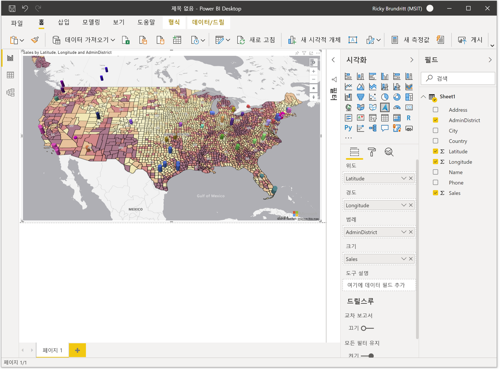

# Azure Maps Power BI 시각적 개체 시작

<Token>**적용 대상:**  **_소비자_** 를 위한 Power BI 서비스  디자이너 및 개발자를 위한 Power BI 서비스  Power BI Desktop  Pro 또는 Premium 라이선스 필요 </Token>

이 문서에서는 Power BI용 Microsoft Azure Maps 시각적 개체를 사용하는 방법을 보여 줍니다.

> [!NOTE]
> 이 시각적 개체는 Power BI Desktop과 Power BI 서비스 모두에서 만들고 볼 수 있습니다. 이 문서의 단계와 그림은 모두 Power BI Desktop에 해당합니다.

Power BI용 Azure Maps 시각적 개체는 지도 위에 공간 데이터에 대한 다양한 데이터 시각화 세트를 제공합니다. 비즈니스 데이터의 80% 이상이 위치 컨텍스트를 가지고 있는 것으로 추정됩니다. Azure Maps 시각적 개체를 통해 이 위치 컨텍스트가 비즈니스 데이터와 어떻게 관련되고 영향을 미치는지에 대한 인사이트를 얻습니다.

## Azure에 전달되는 내용

Azure Maps 시각적 개체는 Azure에서 호스트되는 클라우드 서비스에 연결하여 지도 시각화를 만드는 데 사용되는 지도 이미지 및 좌표와 같은 위치 데이터를 검색합니다. 

-   초점이 맞춰진 지도 영역에 대한 세부 정보는 지도 캔버스(지도 타일이라고도 함)를 렌더링하는 데 필요한 이미지를 검색하기 위해 Azure에 전송됩니다. 
-   위치, 위도 및 경도 버킷의 데이터를 Azure로 전송하여 지도 좌표(지오코딩이라는 프로세스)를 검색할 수 있습니다. 
-   Power BI에서 원격 분석 옵션을 사용하는 경우 원격 분석 데이터가 시각적 개체의 상태(예: 크래시 보고서)에 대해 수집될 수 있습니다.

위에서 설명한 시나리오 외에 지도에 오버레이된 그 어떤 데이터도 Azure Maps 서버로 전송되지 않습니다. 모든 데이터 렌더링은 클라이언트 내에서 로컬로 발생합니다.

사용자 또는 관리자는 다음 URL을 사용하는 Azure Maps 플랫폼에 대한 액세스를 허용하도록 방화벽을 업데이트해야 할 수 있습니다.

> `https://atlas.microsoft.com`

Azure Maps와 관련된 개인 정보 및 사용 약관에 대해 자세히 알아보려면 [Microsoft Azure 법적 정보](https://azure.microsoft.com/support/legal/)를 참조하세요.

## Azure Maps 시각적 개체(미리 보기) 동작 및 요구 사항

**Azure Maps** 시각적 개체에 대한 몇 가지 고려 사항 및 요구 사항이 있습니다. :

-   Power BI Desktop에서 **Azure Maps** 시각적 개체(미리 보기)를 사용하도록 설정해야 합니다. **Azure Maps** 시각적 개체를 사용하도록 설정하려면 **파일** &gt; **옵션 및 설정** &gt; **옵션** &gt; **미리 보기 기능** 을 선택한 다음 **Azure Maps 시각적 개체** 확인란을 선택합니다. 이 작업을 수행한 후 Azure Maps 시각적 개체를 사용할 수 없는 경우 관리 포털에서 테넌트 관리자 스위치를 사용하도록 설정해야 할 수 있습니다.
-   데이터 세트에는 **위도** 및 **경도** 정보를 포함하는 필드가 있어야 합니다. 위치 필드 지오코딩은 이후 업데이트에서 추가될 예정입니다.
-   Power BI에 대한 기본 제공 범례 컨트롤은 현재 이 미리 보기에 표시되지 않습니다. 이후 업데이트에서 추가될 예정입니다.

## Azure Maps 시각적 개체(미리 보기) 사용

**Azure Maps** 시각적 개체를 사용하도록 설정하면 **시각화** 창에서 **Azure Maps** 아이콘을 선택합니다.

Power BI는 빈 Azure Maps 시각적 개체 디자인 캔버스를 만듭니다. 미리 보기 중에는 추가 부인 사항이 표시됩니다.

Azure Maps 시각적 개체를 로드하려면 다음 단계를 수행합니다.

1.  **필드** 창에서 위도 및 경도 좌표 정보를 포함하는 데이터 필드를 **위도** 및/또는 **경도** 버킷으로 끌어 옵니다. Azure Maps 시각적 개체를 로드하는 데 필요한 최소한의 데이터입니다.
    
    > [!div class="mx-imgBorder"]
    > 

2.  분류에 따라 데이터의 색을 설정하려면 범주 필드를 **필드** 창의 **범례** 버킷으로 끌어 옵니다. 이 예에서는 **Admindistrict** 열(시/도라고도 함)을 사용합니다.  
    
    > [!div class="mx-imgBorder"]
    > 

    > [!NOTE]
    > Power BI에 대한 기본 제공 범례 컨트롤은 현재 이 미리 보기에 표시되지 않습니다. 이후 업데이트에서 추가될 예정입니다.

3.  데이터의 크기를 상대적으로 조정하려면 **필드** 창의 **크기** 버킷에 측정값을 끌어 놓습니다. 이 예에서는 **Sales** 열을 사용합니다.  
    
    > [!div class="mx-imgBorder"]
    > 

4.  **서식** 창의 옵션을 사용하여 데이터가 렌더링되는 방식을 사용자 지정할 수 있습니다. 다음 이미지는 위와 동일한 지도이지만 거품형 계층 채우기 투명도 옵션은 50%로 설정되고 고대비 윤곽선 옵션은 사용하도록 설정됩니다.  
    
    > [!div class="mx-imgBorder"]
    > 

## 필드 창 버킷

다음 데이터 버킷은 Azure Maps 시각적 개체의 **필드** 창에서 사용할 수 있습니다.

| 필드     | Description  |
|-----------|--------------|
| 위도  | 데이터 포인트의 위도 값을 지정하는 데 사용되는 필드입니다. 위도 값은 -90과 90 사이의 10진수 각도 형식이어야 합니다.  |
| 경도 | 데이터 포인트의 경도 값을 지정하는 데 사용되는 필드입니다. 경도 값은 -180과 180 사이의 10진수 각도 형식이어야 합니다.  |
| 범례    | 데이터를 분류하고 각 범주의 데이터 포인트에 고유한 색을 할당하는 데 사용되는 필드입니다. 이 버킷이 채워지면 색을 조정할 수 있는 **데이터 색** 섹션이 **서식** 창에 표시됩니다. |
| 크기      | 지도에서 데이터 포인트의 상대적인 크기 조정에 사용되는 측정값입니다.   |
| 도구 설명  | 도형을 마우스로 가리킬 때 도구 설명에 표시되는 추가 데이터 필드입니다. |

## 지도 설정

서식 창의 **지도 설정** 섹션에는 지도가 표시되고 업데이트에 반응하는 방식을 사용자 지정하는 옵션이 제공됩니다.

| 설정             | Description  |
|---------------------|--------------|
| 자동 확대/축소           | 시각적 개체의 **필드** 창을 통해 로드된 데이터로 지도를 자동 확대/축소합니다. 데이터가 변경되면 지도는 그에 따라 해당 위치를 업데이트합니다. 슬라이더가 **꺼짐** 위치에 있으면 기본 지도 보기에 대한 추가 지도 보기 설정이 표시됩니다. |
| 세계 래핑          | 사용자가 지도를 무한히 세로로 이동할 수 있습니다. |
| 스타일 선택기        | 보고서를 읽는 사람이 지도의 스타일을 변경할 수 있도록 하는 단추를 지도에 추가합니다. |
| 탐색 컨트롤 | 보고서를 읽는 사람이 지도의 피치를 확대/축소, 회전 및 변경할 수 있도록 하는 다른 방법으로 지도에 단추를 추가합니다. 사용자가 지도를 탐색할 수 있는 여러 가지 방법에 대한 자세한 내용은 [지도 탐색](map-accessibility.md#navigating-the-map)에 대한 이 문서를 참조하세요. |
| 맵 스타일           | 지도 스타일입니다. [지원되는 지도 스타일](supported-map-styles.md)에 대한 자세한 내용은 이 문서를 참조하세요. |

### 지도 보기 설정

**자동 확대/축소** 슬라이더가 **꺼짐** 위치에 있으면 다음 설정이 표시되고 사용자가 기본 지도 보기 정보를 지정할 수 있습니다.

| 설정          | Description   |
|------------------|---------------|
| 확대/축소             | 지도의 기본 확대/축소 수준입니다. 0~22 사이의 숫자입니다. |
| 중심 위도  | 지도의 가운데에 있는 기본 위도입니다. |
| 중심 경도 | 지도의 가운데에 있는 기본 경도입니다. |
| 제목          | 지도의 기본 방향(도)입니다. 여기서 0은 북부, 90은 동부, 180은 남부, 270은 서부입니다. 0~360 사이의 숫자입니다. |
| 피치            | 지도의 기본 기울기는 0에서 60 사이입니다. 여기서 0은 지도에서 바로 아래를 조회합니다. |

## 고려 사항 및 제한 사항

Azure Maps 시각적 개체는 다음 서비스 및 애플리케이션에서 사용할 수 있습니다.

| 서비스/앱                              | 가용성 |
|------------------------------------------|--------------|
| Power BI Desktop                         | 예          |
| Power BI 서비스(app.powerbi.com)       | 예          |
| Power BI 모바일 애플리케이션             | 예          |
| Power BI 웹에 게시                  | 아니요           |
| Power BI Embedded                        | 아니요           |
| Power BI 서비스 포함(PowerBI.com) | 예          |

추가 Power BI 서비스/앱에 대한 지원은 향후 업데이트에서 추가될 예정입니다.

**Azure Maps는 어디에서 사용할 수 있나요?**

현재 Azure Maps는 현재 다음 지역을 제외한 모든 국가 및 지역에서 사용할 수 있습니다.

- 중국
- 대한민국

이 시각적 개체를 제공하는 다양한 Azure Maps 서비스의 적용 범위에 대한 정보는 [지리적 적용 범위 정보](geographic-coverage.md) 문서를 참조하세요.

**Azure Maps 시각적 개체에서 지원되는 웹 브라우저는 무엇인가요?**

[Azure Maps 웹 SDK 지원 브라우저](supported-browsers.md)에 대한 자세한 내용은 이 설명서를 참조하세요.

**시각화할 수 있는 데이터 포인트는 몇 개인가요?**

이 시각적 개체는 최대 3만 개의 데이터 포인트를 지원합니다.

**이 시각적 개체에서 주소 또는 다른 위치 문자열을 사용할 수 있나요?**

이 시각적 개체의 초기 미리 보기는 10진수 각도의 위도 및 경도 값만 지원합니다. 이후 업데이트에서는 주소 및 기타 위치 문자열에 대한 지원을 추가합니다.

## 다음 단계

Azure Maps Power BI 시각적 개체에 대해 자세히 알아봅니다.

> [!div class="nextstepaction"]
> [Azure Maps Power BI 시각적 개체의 계층 이해](power-bi-visual-understanding-layers.md)

> [!div class="nextstepaction"]
> [조직 내에서 Azure Maps 시각적 개체 관리](power-bi-visual-manage-access.md)

시각적 개체를 사용자 지정합니다.

> [!div class="nextstepaction"]
> [Power BI의 색 서식을 위한 팁과 힌트](/power-bi/visuals/service-tips-and-tricks-for-color-formatting)

> [!div class="nextstepaction"]
> [시각화 제목, 배경 및 범례 사용자 지정](/power-bi/visuals/power-bi-visualization-customize-title-background-and-legend)