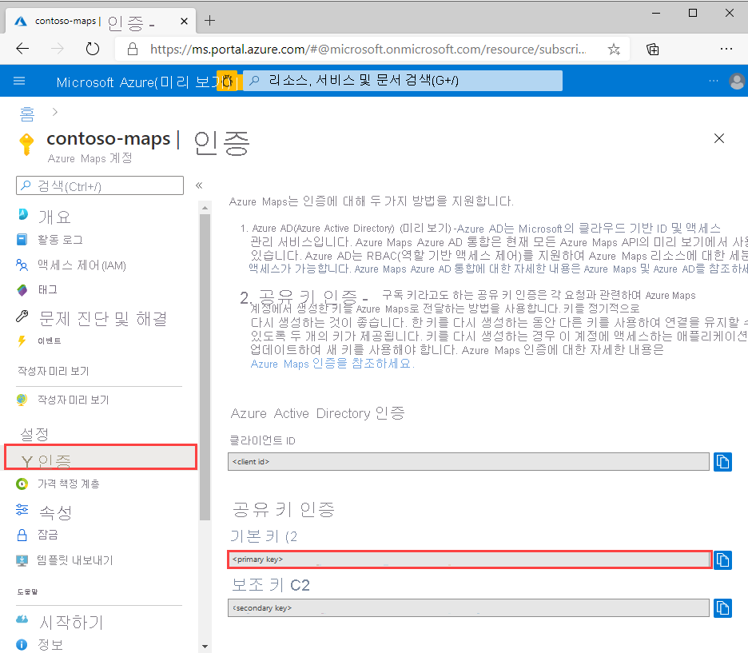
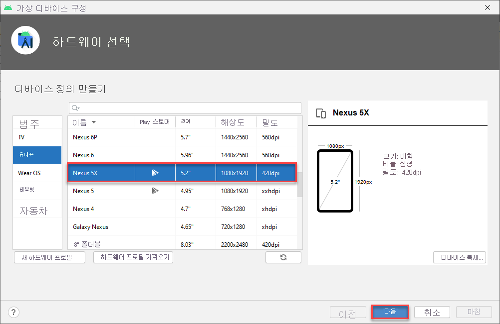
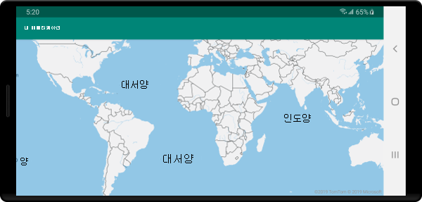

# <a name="quickstart-create-an-android-app-with-azure-maps"></a>빠른 시작: Azure Maps를 사용하여 Android 앱 만들기

이 문서에서는 Android 앱에 Azure Maps를 추가하는 방법을 보여줍니다. 여기서는 다음 기본 단계를 단계별로 안내합니다.

* 개발 환경을 설정합니다.
* 사용자 고유의 Azure Maps 계정을 만듭니다.
* 앱에서 사용할 기본 Azure Maps 키를 가져옵니다.
* 프로젝트에서 Azure Maps 라이브러리를 참조합니다.
* 앱에 Azure Maps 컨트롤을 추가합니다.

## <a name="prerequisites"></a>필수 조건

1. [Azure Portal](https://portal.azure.com)에 로그인하여 Azure Maps 계정을 만듭니다. Azure 구독이 아직 없는 경우 시작하기 전에 [체험 계정](https://azure.microsoft.com/free/)을 만듭니다.
2. [Azure Maps 계정을 만듭니다](quick-demo-map-app.md#create-an-azure-maps-account).
3. 기본 키 또는 구독 키라고도 하는 [기본 구독 키를 가져옵니다](quick-demo-map-app.md#get-the-primary-key-for-your-account). Azure Maps의 인증에 대한 자세한 내용은 [Azure Maps의 인증 관리](how-to-manage-authentication.md)를 참조하세요.
4. Google에서 무료로 [Android Studio를 다운로드](https://developer.android.com/studio/)하세요.

## <a name="create-an-azure-maps-account"></a>Azure Maps 계정 만들기

다음 단계에 따라 새 Azure Maps 계정을 만듭니다.

1. [Azure Portal](https://portal.azure.com)의 왼쪽 위 모서리에서 **리소스 만들기** 를 클릭합니다.
2. *Marketplace 검색* 상자에서 **Azure Maps** 를 입력합니다.
3. *결과* 에서 **Azure Maps** 를 선택합니다. 맵 아래에 나타나는 **만들기** 단추를 클릭합니다.
4. **Maps 계정 만들기** 페이지에서 다음 값을 입력합니다.
    * 이 계정에 사용하려는 *구독*.
    * 이 계정에 대한 *리소스 그룹* 이름. *새로 만들기* 또는 *기존* 리소스 그룹 사용을 선택할 수도 있습니다.
    * 새 계정의 *이름*.
    * 이 계정에 대한 *가격 책정 계층* 입니다.
    * *라이선스* 및 *개인정보처리방침* 을 읽고 조건에 동의하는 확인란을 선택합니다.
    * **만들기** 단추를 클릭합니다.

    :::image type="content" source="./media/quick-demo-map-app/create-account.png" alt-text="포털에서 Maps 계정 만들기":::

## <a name="get-the-primary-key-for-your-account"></a>사용자 계정에 대한 기본 키 가져오기

Maps 계정이 성공적으로 만들어지면 Maps API를 쿼리할 수 있는 기본 키를 검색합니다.

1. 포털에서 Maps 계정을 엽니다.
2. 설정 섹션에서 **인증** 을 선택합니다.
3. **기본 키** 를 클립보드로 복사합니다. 이 자습서의 뒷부분에서 사용하기 위해 로컬로 저장합니다.

>[!NOTE]
> Azure Maps 기본 키 대신 Azure 구독 키를 사용하면 맵이 제대로 렌더링되지 않습니다. 또한 보안을 위해 기본 키와 보조 키 사이를 회전하는 것이 좋습니다. 키를 회전하려면 보조 키를 사용하도록 앱을 업데이트하고 배포한 다음, 기본 키 옆에 있는 주기/새로 고침 단추를 눌러 새 기본 키를 생성합니다. 이전 기본 키는 사용할 수 없습니다. 키 회전에 대한 자세한 내용은 [키 회전 및 감사를 사용하여 Azure Key Vault 설정](../key-vault/secrets/tutorial-rotation-dual.md)을 참조하세요.



## <a name="create-a-project-in-android-studio"></a>Android Studio에서 프로젝트 만들기

우선, 빈 작업으로 새 프로젝트를 만듭니다. Android Studio 프로젝트를 만들려면 다음 단계를 완료합니다.

1. **프로젝트 선택** 에서 **휴대폰 및 태블릿** 을 선택합니다. 애플리케이션이 이 폼 팩터에서 실행됩니다.
2. **휴대폰 및 태블릿** 탭에서 **빈 작업** 을 선택하고 **다음** 을 선택합니다.
3. **프로젝트 구성** 에서 최소 SDK로 `API 21: Android 5.0.0 (Lollipop)`을 선택합니다. 이는 Azure Maps Android SDK에서 지원하는 가장 초기 버전입니다.
4. 기본 `Activity Name` 및 `Layout Name`을 적용하고 **마침** 을 선택합니다.

Android Studio를 설치하고 새 프로젝트를 만드는 방법에 대한 자세한 도움말은 [Android Studio 문서](https://developer.android.com/studio/intro/)를 참조하세요.


## <a name="set-up-a-virtual-device"></a>가상 디바이스 설정

Android Studio를 사용하면 컴퓨터에 가상 Android 디바이스를 설정할 수 있습니다. 이렇게 하면 개발 중에 애플리케이션을 테스트하는 데 도움이 됩니다. 가상 디바이스를 설정하려면 프로젝트 화면의 오른쪽 상단 모서리에 있는 AVD(Android 가상 디바이스) 관리자 아이콘을 선택한 다음 **가상 디바이스 만들기** 를 선택합니다. 도구 모음에서 **도구** > **Android** > **AVD 관리자** 를 선택하여 AVD 관리자가 될 수도 있습니다. **휴대폰** 범주에서 **Nexus 5X** 를 선택한 후 **다음** 을 선택합니다.

[Android Studio 문서](https://developer.android.com/studio/run/managing-avds)에서 AVD 설정 방법을 자세히 알아볼 수 있습니다.



## <a name="install-the-azure-maps-android-sdk"></a>Azure Maps Android SDK 설치

애플리케이션을 빌드하는 다음 단계에서 Azure Maps Android SDK를 설치합니다. SDK를 설치하려면 다음 단계를 완료합니다.

1. 최상위 **build.gradle** 파일을 열고, **all projects**, **repositories** 블록에 다음 코드를 추가합니다.

    ```gradle
    maven {
        url "https://atlas.microsoft.com/sdk/android"
    }
    ```

2. **app/build.gradle** 을 업데이트하고 다음 코드를 추가합니다.

    1. 프로젝트의 **minSdkVersion** 이 API 21 이상인지 확인합니다.

    2. Android 섹션에 다음 코드를 추가합니다.

        ```gradle
        compileOptions {
            sourceCompatibility JavaVersion.VERSION_1_8
            targetCompatibility JavaVersion.VERSION_1_8
        }
        ```

    3. 다음과 같이 종속성 블록을 업데이트하고 최신 Azure Maps Android SDK에 대한 새 구현 종속성 줄을 추가합니다.

        ```gradle
        implementation "com.microsoft.azure.maps:mapcontrol:0.7"
        ```

        > [!Note]
        > 버전 번호를 "0+"로 설정하여 코드가 항상 최신 버전을 가리키게 할 수 있습니다.

    4. 도구 모음에서 **파일** 로 이동한 다음, **Gradle 파일과 프로젝트 동기화** 를 클릭합니다.
3. 다음과 같이 기본 작업에 맵 조각을 추가합니다(res \> layout \> activity\_main.xml).

    ```xml
    <com.microsoft.azure.maps.mapcontrol.MapControl
        android:id="@+id/mapcontrol"
        android:layout_width="match_parent"
        android:layout_height="match_parent"
        />
    ```

::: zone pivot="programming-language-java-android"

4. **MainActivity.java** 파일에서 다음을 수행해야 합니다.

    * Azure Maps SDK에 대한 가져오기 추가
    * Azure Maps 인증 정보 설정
    * **onCreate** 메서드에서 지도 컨트롤 인스턴스 가져오기

    `setSubscriptionKey` 또는 `setAadProperties` 메서드를 사용하여 `AzureMaps` 클래스에 대한 인증 정보를 전역적으로 설정하면 보기마다 인증 정보를 추가할 필요가 없습니다.

    지도 컨트롤에는 Android의 OpenGL 수명 주기를 관리하는 자체 수명 주기 메서드가 포함되어 있습니다. 이러한 수명 주기 메서드는 포함된 작업에서 직접 호출해야 합니다. 앱에서 지도 컨트롤의 수명 주기 메서드를 올바르게 호출하려면 지도 컨트롤이 포함된 작업에서 다음 수명 주기 메서드를 재정의해야 합니다. 그리고 각 지도 컨트롤 메서드를 호출해야 합니다.

    * `onCreate(Bundle)`
    * `onDestroy()`
    * `onLowMemory()`
    * `onPause()`
    * `onResume()`
    * `onSaveInstanceState(Bundle)`
    * `onStart()`
    * `onStop()`

    **MainActivity.java** 파일을 다음과 같이 편집합니다.

    ```java
    package com.example.myapplication;
    
    import androidx.appcompat.app.AppCompatActivity;
    import com.microsoft.azure.maps.mapcontrol.AzureMaps;
    import com.microsoft.azure.maps.mapcontrol.MapControl;
    import com.microsoft.azure.maps.mapcontrol.layer.SymbolLayer;
    import com.microsoft.azure.maps.mapcontrol.options.MapStyle;
    import com.microsoft.azure.maps.mapcontrol.source.DataSource;
    
    public class MainActivity extends AppCompatActivity {
        
    static {
        AzureMaps.setSubscriptionKey("<Your Azure Maps subscription key>");

        //Alternatively use Azure Active Directory authenticate.
        //AzureMaps.setAadProperties("<Your aad clientId>", "<Your aad AppId>", "<Your aad Tenant>");
    }

    MapControl mapControl;

    @Override
    protected void onCreate(Bundle savedInstanceState) {
        super.onCreate(savedInstanceState);
        setContentView(R.layout.activity_main);

        mapControl = findViewById(R.id.mapcontrol);

        mapControl.onCreate(savedInstanceState);

        //Wait until the map resources are ready.
        mapControl.onReady(map -> {
            //Add your post map load code here.

        });
    }

    @Override
    public void onResume() {
        super.onResume();
        mapControl.onResume();
    }

    @Override
    protected void onStart(){
        super.onStart();
        mapControl.onStart();
    }

    @Override
    public void onPause() {
        super.onPause();
        mapControl.onPause();
    }

    @Override
    public void onStop() {
        super.onStop();
        mapControl.onStop();
    }

    @Override
    public void onLowMemory() {
        super.onLowMemory();
        mapControl.onLowMemory();
    }

    @Override
    protected void onDestroy() {
        super.onDestroy();
        mapControl.onDestroy();
    }

    @Override
    protected void onSaveInstanceState(Bundle outState) {
        super.onSaveInstanceState(outState);
        mapControl.onSaveInstanceState(outState);
    }}
    ```

    > [!NOTE]
    > 위의 단계를 완료하면 일부 코드에 대한 Android Studio의 경고를 받을 수 있습니다. 이러한 경고를 해결하려면 `MainActivity.java`에서 참조되는 클래스를 가져옵니다.
    > `Alt` + `Enter`(Mac에서는 `Option` + `Return`)를 선택하면 해당 클래스를 자동으로 가져올 수 있습니다.

::: zone-end

::: zone pivot="programming-language-kotlin"

4. **MainActivity.kt** 파일에서 다음을 수행해야 합니다.

    * Azure Maps SDK에 대한 가져오기 추가
    * Azure Maps 인증 정보 설정
    * **onCreate** 메서드에서 지도 컨트롤 인스턴스 가져오기

    `setSubscriptionKey` 또는 `setAadProperties` 메서드를 사용하여 `AzureMaps` 클래스에 대한 인증 정보를 전역적으로 설정하면 보기마다 인증 정보를 추가할 필요가 없습니다.

    지도 컨트롤에는 Android의 OpenGL 수명 주기를 관리하는 자체 수명 주기 메서드가 포함되어 있습니다. 이러한 수명 주기 메서드는 포함된 작업에서 직접 호출해야 합니다. 앱에서 지도 컨트롤의 수명 주기 메서드를 올바르게 호출하려면 지도 컨트롤이 포함된 작업에서 다음 수명 주기 메서드를 재정의해야 합니다. 그리고 각 지도 컨트롤 메서드를 호출해야 합니다.

    * `onCreate(Bundle)`
    * `onDestroy()`
    * `onLowMemory()`
    * `onPause()`
    * `onResume()`
    * `onSaveInstanceState(Bundle)`
    * `onStart()`
    * `onStop()`

    **MainActivity.kt** 파일을 다음과 같이 편집합니다.

    ```kotlin
    package com.example.myapplication;

    import androidx.appcompat.app.AppCompatActivity
    import android.os.Bundle
    import com.microsoft.azure.maps.mapcontrol.AzureMap
    import com.microsoft.azure.maps.mapcontrol.AzureMaps
    import com.microsoft.azure.maps.mapcontrol.MapControl
    import com.microsoft.azure.maps.mapcontrol.events.OnReady
    
    class MainActivity : AppCompatActivity() {
    
        companion object {
            init {
                AzureMaps.setSubscriptionKey("<Your Azure Maps subscription key>");
    
                //Alternatively use Azure Active Directory authenticate.
                //AzureMaps.setAadProperties("<Your aad clientId>", "<Your aad AppId>", "<Your aad Tenant>");
            }
        }
    
        var mapControl: MapControl? = null
    
        override fun onCreate(savedInstanceState: Bundle?) {
            super.onCreate(savedInstanceState)
            setContentView(R.layout.activity_main)
    
            mapControl = findViewById(R.id.mapcontrol)
    
            mapControl?.onCreate(savedInstanceState)
    
            //Wait until the map resources are ready.
            mapControl?.onReady(OnReady { map: AzureMap -> })
        }
    
        public override fun onStart() {
            super.onStart()
            mapControl?.onStart()
        }
    
        public override fun onResume() {
            super.onResume()
            mapControl?.onResume()
        }
    
        public override fun onPause() {
            mapControl?.onPause()
            super.onPause()
        }
    
        public override fun onStop() {
            mapControl?.onStop()
            super.onStop()
        }
    
        override fun onLowMemory() {
            mapControl?.onLowMemory()
            super.onLowMemory()
        }
    
        override fun onDestroy() {
            mapControl?.onDestroy()
            super.onDestroy()
        }
    
        override fun onSaveInstanceState(outState: Bundle) {
            super.onSaveInstanceState(outState)
            mapControl?.onSaveInstanceState(outState)
        }
    }
    ```

    > [!NOTE]
    > 위의 단계를 완료하면 일부 코드에 대한 Android Studio의 경고를 받을 수 있습니다. 이러한 경고를 해결하려면 `MainActivity.kt`에서 참조되는 클래스를 가져옵니다.
    > `Alt` + `Enter`(Mac에서는 `Option` + `Return`)를 선택하면 해당 클래스를 자동으로 가져올 수 있습니다.

::: zone-end

5. 다음 그래픽에 표시된 대로 실행 단추를 선택하여(또는 Mac에서는 `Control` + `R`을 누름) 애플리케이션을 빌드합니다.

    ![[실행]을 클릭합니다.](media/quick-android-map/run-app.png)

Android Studio에서 애플리케이션을 빌드하는 데 몇 초 정도 걸립니다. 빌드가 완료되면 에뮬레이트된 Android 디바이스에서 애플리케이션을 테스트할 수 있습니다. 다음과 같은 맵이 표시됩니다.



## <a name="clean-up-resources"></a>리소스 정리

>[!WARNING]
> [다음 단계](#next-steps) 섹션에 나열된 이 자습서에서는 계정에서 Azure Maps를 사용하고 구성하는 방법에 대해 자세히 설명되어 있습니다. 자습서를 계속 진행하려면 이 빠른 시작에서 만든 리소스를 정리하지 마세요.

자습서를 계속 진행하지 않으려면 다음 단계에 따라 리소스를 정리합니다.

1. Android Studio를 닫고 사용자가 만든 애플리케이션을 삭제합니다.
2. 외부 디바이스에서 애플리케이션을 테스트한 경우 해당 디바이스에서 애플리케이션을 제거합니다.

Azure Maps Android SDK를 사용하여 계속 개발할 계획이 없는 경우:

1. Azure Portal 페이지로 이동합니다. 기본 포털 페이지에서 **모든 리소스** 를 선택합니다. 또는 왼쪽 위 모서리에 있는 메뉴 아이콘을 클릭합니다. **모든 리소스** 를 선택합니다.
2. Azure Maps 계정을 클릭합니다. 페이지 위쪽에서 **삭제** 를 클릭합니다.
3. 경우에 따라 Android 앱을 계속 개발할 계획이 없는 경우 Android Studio를 제거합니다.

추가 코드 예제는 다음 가이드를 참조하세요.

* [Azure Maps의 인증 관리](how-to-manage-authentication.md)
* [Android 맵에서 맵 스타일 변경](set-android-map-styles.md)
* [기호 계층 추가](how-to-add-symbol-to-android-map.md)
* [선 계층 추가](android-map-add-line-layer.md)
* [다각형 계층 추가](how-to-add-shapes-to-android-map.md)

## <a name="next-steps"></a>다음 단계

이 빠른 시작에서는 Azure Maps 계정을 만들고 데모 애플리케이션을 만들었습니다. Azure Maps에 대해 자세히 알아보려면 다음 자습서를 살펴보세요.

> [!div class="nextstepaction"]
> [Azure Maps에 GeoJSON 데이터 로드](tutorial-load-geojson-file-android.md)