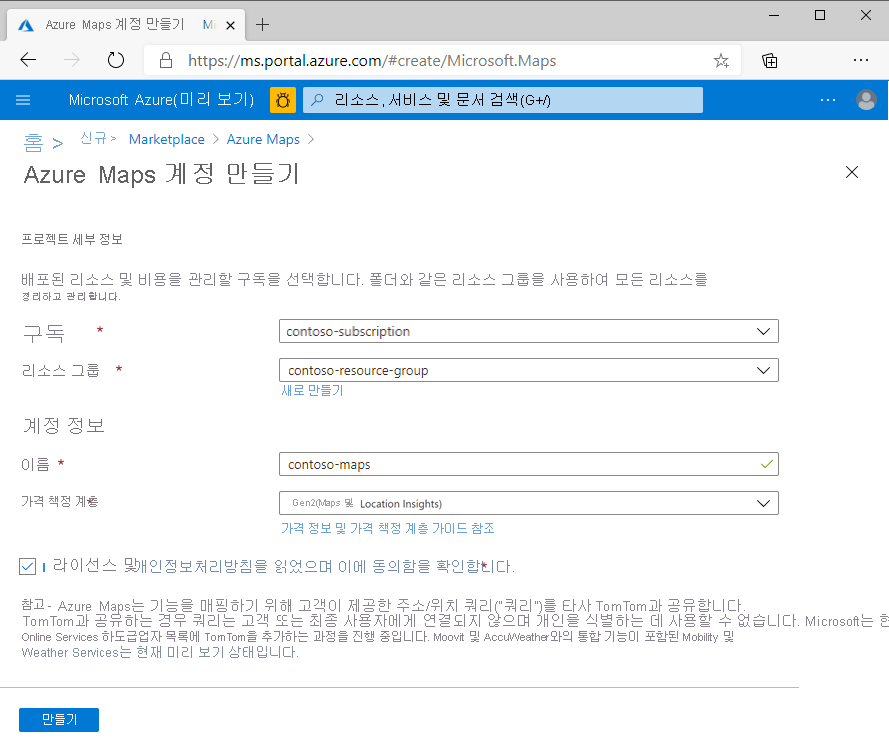
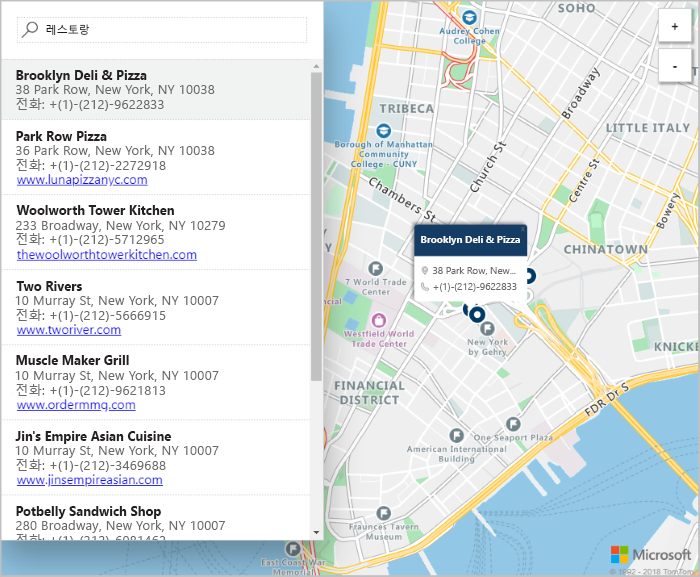

# Azure Maps를 사용하여 대화형 검색 맵 만들기

이 문서에서는 사용자에게 대화형 검색 환경을 제공하는 지도를 만드는 Azure Maps의 기능을 보여 줍니다. 여기서는 다음 기본 단계를 단계별로 안내합니다.
* 사용자 고유의 Azure Maps 계정을 만듭니다.
* 웹 애플리케이션 데모에서 사용할 계정 키를 가져옵니다.

Azure 구독이 아직 없는 경우 시작하기 전에 [체험 계정](https://azure.microsoft.com/free/?WT.mc_id=A261C142F)을 만듭니다.

## Azure Portal에 로그인

[Azure Portal](https://portal.azure.com/)에 로그인합니다.

## 계정 생성 및 키 가져오기

1. [Azure Portal](https://portal.azure.com)의 왼쪽 위 모서리에서 **리소스 만들기**를 선택합니다.
2. **Marketplace 검색** 상자에서 **Maps**를 입력합니다.
3. **결과**에서 **Maps**를 선택합니다. 맵 아래에 나타나는 **만들기** 단추를 선택합니다.
4. **Azure Maps 계정 만들기** 페이지에서 다음 값을 입력합니다.
   - 새 계정의 **이름**.
   - 이 계정에 사용하려는 **구독**.
   - 이 계정에 대한 **리소스 그룹**. **새로 만들기** 또는 **기존 리소스 그룹 사용**을 선택할 수도 있습니다.
   - 선택 항목에서 **가격 책정 계층**을 선택합니다.
   - **라이선스** 및 **개인정보처리방침**을 읽습니다. 사용 약관에 동의하려면 확인란을 선택합니다.
   - 마지막으로 **만들기** 단추를 선택합니다.

     

5. 계정이 성공적으로 만들어지면 해당 계정을 열고 계정 메뉴의 설정 섹션을 찾습니다. **키**를 선택하여 Azure Maps 계정에 대한 기본 및 보조 키를 확인합니다. **기본 키** 값은 로컬 클립보드에 복사하여 다음 섹션에서 사용합니다.

## 응용 프로그램 다운로드

1. [interactiveSearch.html](https://github.com/Azure-Samples/AzureMapsCodeSamples/blob/master/AzureMapsCodeSamples/Tutorials/interactiveSearch.html) 파일의 콘텐츠를 다운로드하거나 복사합니다.
2. 이 파일의 콘텐츠를 **AzureMapDemo.html**에 로컬로 저장합니다. 텍스트 편집기에서 엽니다.
3. `<Your Azure Maps Key>` 문자열을 검색합니다. 이 문자열을 이전 섹션의 **기본 키** 값으로 바꿉니다.

## 애플리케이션 열기

1. 원하는 브라우저에서 **AzureMapDemo.html** 파일을 엽니다.
2. 로스앤젤레스 시의 지도를 관찰합니다. 확대 및 축소하여 확대/축소 수준에 따라 지도가 더 많거나 더 적은 정보로 자동으로 렌더링되도록 하는 방법을 확인합니다. 
3. 지도의 기본 센터를 변경합니다. **AzureMapDemo.html** 파일에서 **center**라는 변수를 검색합니다. 이 변수에 대한 위도, 경도 쌍 값을 새 값인 **[-74.0060, 40.7128]** 로 바꿉니다. 파일을 저장하고 브라우저를 새로 고칩니다.
4. 대화형 검색 환경을 사용해 봅니다. 웹 애플리케이션 데모의 왼쪽 위 모서리에 있는 검색 상자에서 **식당**을 검색합니다.
5. 검색 상자 아래에 표시되는 주소와 위치의 목록 위로 마우스를 이동합니다. 지도의 해당 핀이 해당 위치에 대한 정보를 팝업하는 상태를 확인합니다. 프라이빗 비즈니스의 정보 보호를 위해 가상의 이름과 주소가 표시됩니다.

    

## 리소스 정리

이 자습서에서는 계정을 사용하여 Azure Maps를 사용하고 구성하는 방법에 대해 자세히 설명하고 있습니다. 자습서를 계속 진행하려면 이 빠른 시작에서 만든 리소스를 정리하지 마세요. 계속 진행하지 않으려면 다음 단계에 따라 리소스를 정리합니다.

1. **AzureMapDemo.html** 웹 애플리케이션을 실행하는 브라우저를 닫습니다.
2. Azure Portal의 왼쪽 메뉴에서 **모든 리소스**를 선택합니다. 그런 다음, Azure Maps 계정을 선택합니다. **모든 리소스** 블레이드의 위쪽에서 **삭제**를 선택합니다.

## 다음 단계

이 빠른 시작에서는 Azure Maps 계정과 앱 데모를 만들었습니다. Azure Maps에 대해 자세히 알아보려면 다음 자습서를 살펴보세요.

> [!div class="nextstepaction"]
> [Azure Maps를 사용하여 주변 관심 지점 검색](tutorial-search-location.md)

더 많은 코드 예제 및 대화형 코딩 환경은 다음 가이드를 참조하세요.

> [!div class="nextstepaction"]
> [Azure Maps 검색 서비스를 사용하여 주소 찾기](how-to-search-for-address.md)

> [!div class="nextstepaction"]
> [Azure Maps 맵 컨트롤 사용](how-to-use-map-control.md)
