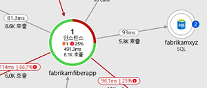
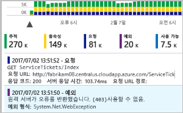
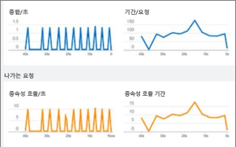
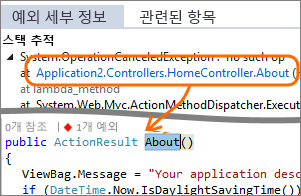
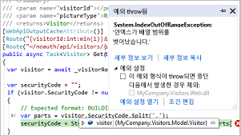
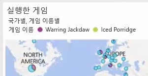

# Application Insights란?
[Azure Monitor](../overview.md)의 기능인 Application Insights는 개발자 및 DevOps 전문가를 위한 확장 가능한 APM(애플리케이션 성능 관리) 서비스입니다. 라이브 애플리케이션을 모니터링하는 데 사용합니다. 성능 이상을 자동으로 감지하고, 문제를 진단하고 사용자가 실제로 앱을 사용하여 수행하는 작업을 파악할 수 있는 강력한 분석 도구를 포함하고 있습니다.  성능 및 가용성을 지속적으로 향상시킬 수 있도록 설계되었습니다. 온-프레미스, 하이브리드 또는 퍼블릭 클라우드에서 호스팅되는 .NET, Node.js, Java 및 Python을 포함하여 다양한 플랫폼의 앱에서 작동합니다. DevOps 프로세스와 통합되며, 다양한 개발 도구와의 연결 지점을 갖고 있습니다. Visual Studio App Center를 통합하여 모바일 앱에서 원격 분석을 모니터링하고 분석할 수 있습니다.

## Application Insights의 작동 방식
작은 계측 패키지(SDK)를 애플리케이션에 설치하거나, [지원되는](./platforms.md) 경우 Application Insights Agent를 사용하여 Application Insights를 사용하도록 설정합니다. 계측은 앱을 모니터링하고, 계측 키라고 하는 고유한 GUID를 사용하여 원격 분석 데이터를 Azure Application Insights 리소스로 보냅니다.

웹 서비스 애플리케이션뿐 아니라 모든 백그라운드 구성 요소와 웹 페이지 자체의 JavaScript까지 계측할 수 있습니다. 애플리케이션 및 해당 구성 요소는 어디서나 실행될 수 있으며 Azure에서 호스팅할 필요가 없습니다.

뿐만 아니라 호스트 환경에서 성능 카운터, Azure 진단, Docker 로그 등의 원격 분석을 가져올 수 있습니다. 웹 서비스에 주기적으로 가상 요청을 보내는 웹 테스트를 설정할 수도 있습니다.

이러한 모든 원격 분석 스트림은 Azure Monitor에 통합되어 있습니다. Azure Portal에서 강력한 분석 및 검색 도구를 원시 데이터에 적용할 수 있습니다.

### 오버헤드는 무엇입니까?
앱 성능에 미치는 영향은 적습니다. 추적 호출은 차단되지 않으며, 별도의 스레드로 일괄 처리 및 전송합니다.

## Application Insights는 무엇을 모니터링하나요?

Application Insights는 애플리케이션 팀에서 앱의 작동 방식과 사용 방식을 이해하는 데 도움을 주기 위해 고안되었습니다. 다음 사항을 모니터링합니다.

* **요청 속도, 응답 시간 및 실패율** - 하루 중 어느 시간에 어떤 페이지를 가장 많이 방문하는지, 사용자가 어디에 있는지 확인합니다. 어떤 페이지가 가장 성능이 우수한지 확인합니다. 요청이 더 있는데 응답 시간과 실패율이 높아지면 아마도 리소스 문제가 있는 것입니다. 
* **종속성 비율, 응답 시간 및 실패율** - 외부 서비스 때문에 속도가 느려지는지 확인합니다.
* **예외** - 집계된 통계를 분석하거나 특정 인스턴스를 선택하여 스택 추적 및 관련 요청을 자세히 분석합니다. 서버 및 브라우저 예외가 전부 보고됩니다.
* **페이지 보기 및 로드 성능** - 사용자의 브라우저에서 보고합니다.
* 웹 페이지의 **AJAX 호출** - 속도, 응답 시간 및 실패율.
* **사용자 및 세션 수**.
* Windows 또는 Linux 서버 컴퓨터의 **성능 카운터** - CPU, 메모리, 네트워크 사용량 등. 
* Docker 또는 Azure의 **호스트 진단**. 
* 앱의 **진단 추적 로그** - 추적 이벤트를 요청과 상호 연결하는 데 사용됩니다.
* 판매된 품목, 승리한 게임 등의 비즈니스 이벤트를 추적하기 위해 개발자가 직접 클라이언트 또는 서버 코드로 작성하는 **사용자 지정 이벤트 및 메트릭**.

## 원격 분석은 어디서 찾을 수 있나요?

다양한 방법으로 데이터를 탐색할 수 있습니다. 다음 문서를 확인하세요.

|  |  |
| --- | --- |
| [**스마트 검색 및 수동 경고**](./proactive-diagnostics.md) 앱의 일반적인 원격 분석 패턴에 맞게 자동경고가 설정되고, 일반적인 패턴을 벗어나는 항목이 있으면 트리거합니다. 특정 수준의 사용자 지정 또는 표준 메트릭에 대해 [경고를 설정](../platform/alerts-log.md)할 수도 있습니다. | |
| [**애플리케이션 맵**](./app-map.md) 주요 메트릭 및 경고가 포함된 앱의 구성 요소를 살펴봅니다. |  |
| [**프로파일러**](./profiler.md) 샘플링된 요청의 실행 프로필을 검사합니다. | |
| [**사용량 현황 분석**](./usage-overview.md) 사용자 구분 및 재방문 주기를 분석합니다.| |
| [**인스턴스 데이터에 대한 진단 검색**](./diagnostic-search.md) 요청, 예외, 종속성 호출, 로그 추적 및 페이지 보기와 같은 이벤트를 검색하고 필터링할 수 있습니다.  | |
| [**집계된 데이터에 대한 메트릭 탐색기**](../platform/metrics-charts.md) 요청, 오류 및 예외의 비율과 응답 시간, 페이지 로드 시간과 같은 집계된 데이터를 탐색, 필터링 및 분할할 수 있습니다. | |
| [**대시보드**](./overview-dashboard.md) 여러 리소스의 데이터를 매시업한 후 다른 사용자와 공유할 수 있습니다. 다중 구성 요소 애플리케이션에서 사용하거나 단체방에 연속으로 표시하는 데 유용합니다. | |
| [**라이브 메트릭 스트림**](./live-stream.md) 새 빌드를 배포할 때 이러한 실시간에 가까운 성능 표시기를 확인하여 모든 항목이 예상대로 작동하는지 알 수 있습니다. | |
| [**분석**](../log-query/log-query-overview.md) 이 강력한 쿼리 언어를 사용하여 앱의 성능 및 사용 현황에 대한 까다로운 질문에 답변할 수 있습니다. | |
| [**Visual Studio**](./visual-studio.md) 코드의 성능 데이터를 참조하세요. 스택 추적의 코드로 이동하세요.| |
| [**스냅샷 디버거**](./snapshot-debugger.md) 실시간 작업에서 샘플링된 스냅샷을 매개 변수 값으로 디버그합니다.| |
| [**Power BI**](./export-power-bi.md) 사용 현황 메트릭을 다른 비즈니스 인텔리전스와 통합합니다.| |
| [**REST API**](https://dev.applicationinsights.io/) 메트릭 및 원시 데이터에 대한 쿼리를 실행하는 코드를 작성합니다.|  |
| [**연속 내보내기**](./export-telemetry.md) 원시 데이터가 도착하는 즉시 스토리지에 대량으로 내보냅니다. | |

## Application Insights를 어떻게 사용하나요?

### 모니터
앱에 Application Insights를 설치하고, [가용성 웹 테스트를 설정](./monitor-web-app-availability.md)하고, 다음을 수행합니다.

* 종속성, 페이지 로드 및 AJAX 호출의 부하, 응답성 및 성능을 모니터링하기 위한 팀 공간용 기본 [애플리케이션 대시보드](./overview-dashboard.md)를 체크 아웃합니다.
* 가장 느리고 대부분 실패한 요청을 검색합니다.
* 새 릴리스를 배포할 때 [라이브 스트림](./live-stream.md)을 보고 성능 저하를 즉시 인식합니다.

### 감지, 진단
경고를 수신하거나 문제를 검색한 경우:

* 얼마나 많은 사용자가 영향을 받는지 평가합니다.
* 오류는 예외, 종속성 호출 및 추적과 연관이 있습니다.
* 프로파일러, 스냅샷, 스택 덤프 및 추적 로그를 검사합니다.

### 빌드, 측정, 학습
배포하는 새로운 각 기능의 [효율성을 측정](./usage-overview.md)합니다.

* 고객이 새 UX 또는 비즈니스 기능을 사용하는 방식을 측정하도록 계획합니다.
* 코드에 사용자 지정 원격 분석을 작성합니다.
* 원격 분석에서 얻은 구체적인 증거를 기반으로 다음 개발 주기를 결정합니다.

## 시작하기
Application Insights는 Microsoft Azure에서 호스트되는 다양한 서비스 중 하나이며, 원격 분석이 분석 및 프레젠테이션을 위해 이 서비스로 전송됩니다. 따라서 다른 작업을 수행하기 전에 [Microsoft Azure](https://azure.com)를 구독해야 합니다. 등록은 무료이며 Application Insights에 대해 기본 [가격 책정 계획](https://azure.microsoft.com/pricing/details/application-insights/)을 선택하는 경우 애플리케이션 사용량이 특정 크기로 커질 때까지 무료입니다. 조직에 이미 구독이 있으면 해당 구독에 Microsoft 계정을 추가할 수 있습니다.

시작하는 데는 몇 가지 방법이 있습니다. 본인에게 적합한 방법으로 시작합니다. 나중에 계정을 더 추가할 수 있습니다.

* **런타임: 서버에서 웹앱을 계측합니다.** 이미 배포된 애플리케이션에 적합합니다. 코드에 대한 업데이트를 방지합니다.
  * [**Azure Web Apps에서 호스팅되는 ASP.NET 또는 ASP.NET Core 애플리케이션**](./azure-web-apps.md)
  * [**Azure VM 또는 Azure Virtual Machine Scale Set의 IIS에 호스트된 ASP.NET 애플리케이션**](./azure-vm-vmss-apps.md)
  * [**IIS 온-프레미스 VM에 호스트된 ASP.NET 애플리케이션**](./monitor-performance-live-website-now.md)
* **개발 타임: 코드에 Application Insights를 추가합니다.** 원격 분석 데이터 컬렉션을 사용자 지정하고 원격 분석 데이터를 추가로 전송할 수 있습니다.
  * [ASP.NET 애플리케이션](./asp-net.md)
  * [ASP.NET Core 애플리케이션](./asp-net-core.md)
  * [.NET 콘솔 애플리케이션](./console.md)
  * [Java](./java-get-started.md)
  * [Node.JS](./nodejs.md)
  * [Python](./opencensus-python.md)
  * [기타 플랫폼](./platforms.md)
* 페이지 보기, AJAX 및 기타 클라이언트 쪽 원격 분석에 대해 **[웹 페이지를 계측](./javascript.md)** 합니다.
* Visual Studio App Center와 통합하여 **[모바일 앱 사용을 분석](../learn/mobile-center-quickstart.md)** 합니다.
* **[가용성 테스트](./monitor-web-app-availability.md)** -서버에서 정기적으로 웹 사이트를 ping합니다.

## 다음 단계
다음을 사용하여 런타임에 시작하세요.

* [Azure VM 및 Azure Virtual Machine Scale Set IIS 호스트 앱](./azure-vm-vmss-apps.md)
* [IIS 서버](./monitor-performance-live-website-now.md)
* [Azure Web Apps](./azure-web-apps.md)

다음을 사용하여 개발 시에 시작하세요.

* [ASP.NET](./asp-net.md)
* [ASP.NET Core](./asp-net-core.md)
* [Java](./java-get-started.md)
* [Node.JS](./nodejs.md)
* [Python](./opencensus-python.md)
* [JavaScript](./javascript.md)

## 지원 및 피드백
* 질문 및 문제:
  * [문제 해결][qna]
  * [Microsoft Q&A 질문 페이지](/answers/topics/azure-monitor.html)
  * [StackOverflow](https://stackoverflow.com/questions/tagged/ms-application-insights)
* 사용자 제안:
  * [UserVoice](https://feedback.azure.com/forums/357324-application-insights/filters/top)
* 블로그:
  * [Application Insights 블로그](https://azure.microsoft.com/blog/tag/application-insights)

<!--Link references-->

[android]: ../learn/mobile-center-quickstart.md
[azure]: ../../insights-perf-analytics.md
[client]: ./javascript.md
[desktop]: ./windows-desktop.md
[greenbrown]: ./asp-net.md
[ios]: ../learn/mobile-center-quickstart.md
[java]: ./java-get-started.md
[knowUsers]: app-insights-web-track-usage.md
[platforms]: ./platforms.md
[portal]: https://portal.azure.com/
[qna]: ../faq.md
[redfield]: ./monitor-performance-live-website-now.md

