# DevOps용 Application Insights 개요

[Application Insights](../../azure-monitor/app/app-insights-overview.md)를 사용하면 앱이 라이브 상태일 때 앱의 성능과 사용 방식을 신속하게 파악할 수 있습니다. 문제가 있는 경우 문제에 대해 알려주며 영향을 평가하고 원인을 확인하는 데 도움을 줍니다.

웹 애플리케이션을 개발하는 팀의 사례는 다음과 같습니다.

* *"몇 일 전에 '사소한' 핫픽스가 배포되었습니다. 광범위한 테스트 패스를 실행하지 않았지만 안타깝게도 예기치 못한 변경 사항 일부가 페이로드에 병합되었으며 이는 프런트 엔드 및 백 엔드 사이의 비호환성을 유발합니다. 즉시, 서버 예외 사항이 급증했고 경고가 발생했으며 상황을 인식하도록 했습니다. Application Insights 포털에서 몇 번의 클릭만으로 문제를 줄이기 위해 예외 사항 호출 스택에서 충분한 정보를 얻었습니다. 즉시 롤백하고 손상을 제한했습니다. Application Insights는 DevOps 사이클에서 이 부분을 매우 쉽고 조치할 수 있도록 합니다."*

이 문서에서는 OBS(온라인 뱅킹 시스템)를 개발하는 Fabrikam Bank의 팀을 따라 Application Insights를 사용하여 고객에게 신속하게 응답하고 업데이트하는 방법을 확인합니다.  

팀은 다음 그림에 표시된 DevOps 주기에 작동합니다.

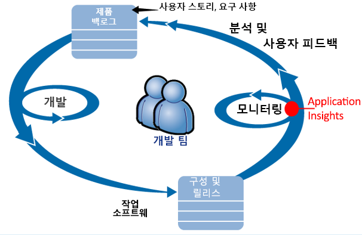

요구 사항이 개발 백로그(작업 목록)에 제공됩니다. 팀에서는 대개 기존 애플리케이션에 대한 개선 기능과 확장의 형태로, 작동하는 소프트웨어를 짧은 기간 안에 제공합니다. 라이브 앱은 새로운 기능으로 자주 업데이트됩니다. 앱이 라이브 상태일 때 팀은 Application Insights의 도움을 받아 앱의 성능과 사용 현황을 모니터링합니다. 이 APM 데이터는 다시 팀의 개발 백로그로 전달됩니다.

팀에서는 Application Insights를 사용하여 라이브 웹 애플리케이션을 자세히 모니터링합니다.

* 성능. 팀에서는 요청 수에 따라 응답 시간이 어떻게 달라지는지, 얼마나 많은 CPU, 네트워크, 디스크 및 기타 리소스가 사용되고 있는지, 어떤 애플리케이션 코드로 인해 성능이 저하되었는지, 그리고 어디에 병목이 있는지를 파악하려고 합니다.
* 오류. 예외 또는 실패한 요청이 있거나 성능 카운터가 적절한 범위를 벗어나는 경우 팀에서는 조치를 취할 수 있도록 신속하게 파악해야 합니다.
* 사용 현황. 새로운 기능이 릴리스될 때마다 팀에서는 해당 기능이 사용되는 범위와 사용자가 해당 기능에서 어려움을 겪고 있는지 여부를 파악하려고 합니다.

주기의 피드백 부분을 집중적으로 살펴보겠습니다.

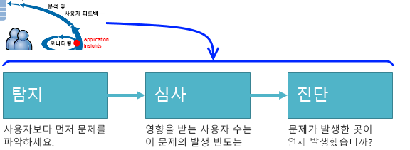

## 가용성 저하 감지
Marcela Markova는 OBS 팀에서 선임 개발자이며 온라인 성능 모니터링을 리드합니다. 여러 [가용성 테스트](../../azure-monitor/app/monitor-web-app-availability.md)를 설정합니다.

* 앱의 주 방문 페이지(http://fabrikambank.com/onlinebanking/)에 대한 단일 URL 테스트. HTTP 코드 200 및 '시작!' 텍스트의 조건을 설정합니다. 이 테스트에 실패하면 네트워크 또는 서버에 심각한 문제가 있거나 배포 문제일 수 있습니다. (또는 누군가 알리지 않고 해당 페이지에서 시작! 메시지를 변경한 것입니다.)
* 각 페이지에서 몇 가지 중요한 세부 정보를 나열하고 확인하는 현재 계정에 로그인하고 가져오는 보다 심화된 다단계 테스트. 이 테스트는 계정 데이터베이스에 대한 링크가 동작하고 있는지 학인합니다. Marcela는 가상 고객 ID를 사용합니다. 이 중 몇 개는 테스트 목적으로 유지 관리됩니다.

이러한 테스트를 설정하여 Marcela는 팀이 가동 중단에 대해 빨리 알게 될 것을 확신할 수 있습니다.  

오류는 웹 테스트 개요 차트에 빨간색 점으로 표시됩니다.

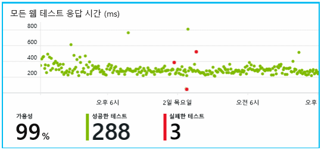

하지만 더 중요한 점은 모든 오류에 대한 경고가 개발팀에 이메일로 전송된다는 것입니다. 이러한 방법으로 팀은 거의 모든 고객보다 먼저 이에 대해 알고 있습니다.

## 성능 모니터링
Application Insights의 개요 페이지에는 [주요 메트릭](../../azure-monitor/app/web-monitor-performance.md)을 보여 주는 차트가 있습니다.

브라우저 페이지 로드 시간은 웹 페이지에서 직접 전송한 원격 분석에서 파생됩니다. 서버 응답 시간, 서버 요청 수 및 실패한 요청 수는 웹 서버에서 측정되며 여기에서 Application Insights로 전송됩니다.

Marcela는 서버 응답 그래프 때문에 약간 걱정을 하고 있습니다. 이 그래프는 서버가 사용자의 브라우저에서 HTTP 요청을 받아서 응답을 반환할 때까지 걸리는 평균 시간을 보여줍니다. 시스템의 부하가 달라짐에 따라 이 차트에 변동이 있는 것이 비정상적인 것은 아닙니다. 하지만 이 경우 요청 횟수의 작은 증가와 응답 시간의 큰 증가 사이에 상관 관계가 있어 보입니다. 시스템이 해당 한계에서 작동하고 있음을 나타낼 수 있습니다.

Marcela는 서버 차트를 엽니다.

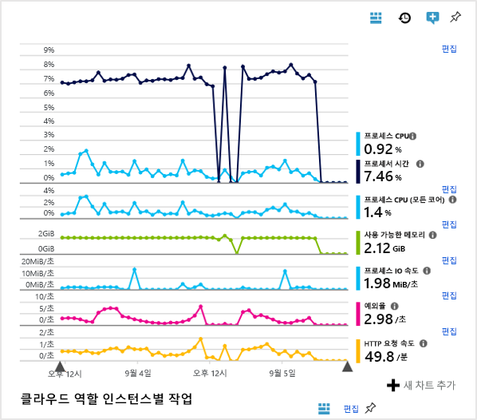

서버 차트에 리소스 한계의 징후는 없어 보이므로 서버 응답 차트의 범프는 단순한 우연인 것 같습니다.

## 목표를 충족하기 위해 경고 설정
그럼에도 불구하고 Marcela는 응답 시간을 주시합니다. 응답 시간이 너무 높게 증가하는 경우 Marcela는 이에 대해 즉시 알고자 합니다.

그래서 일반적인 임계값보다 큰 응답 시간에 대한 [경고](../../azure-monitor/app/metrics-explorer.md)를 설정합니다. 이렇게 하면 응답 시간이 느린 경우 이에 대해 알게 된다는 확신이 생깁니다.

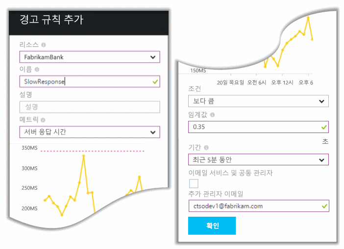

다양한 기타 메트릭에도 경고를 설정할 수 있습니다. 예를들어, 예외 수가 커지너가 사용할 수 있는 메모리가 부족해지거나 클라이언트 요청에서 최고량이 있는 경우에 이메일을 받을 수 있습니다.

## 스마트 검색 경고로 최신 정보 유지
다음 날 Application Insights에서 경고 메일이 도착합니다. 하지만 Marcela는 메일을 열어 보고 설정한 응답 시간 경고가 아님을 알게 됩니다. 대신 이를 통해 실패한 요청, 즉 500개 이상의 오류 코드를 반환한 요청에서 갑자기 증가했음을 알 수 있습니다.

실패한 요청은 사용자가 오류를 찾은 곳입니다(일반적으로 코드에서 발생된 예외 사항을 따름). "지금은 세부 정보를 업데이트할 수 없습니다."라는 메시지가 표시될 수 있습니다. 또는 최악의 상황으로, 웹 서버 때문에 사용자의 화면에 스택 덤프가 나타납니다.

Marcela는 마지막으로 확인했을 때 실패한 요청 수가 고무적으로 낮았기 때문에 이 경고에 놀란 것입니다. 사용량이 많은 서버에서는 오류 수가 적을 수 있습니다.

또한 Marcela는 이 경고를 구성할 필요가 없었으므로 다소 의외였습니다. Application Insights에는 스마트 검색이 포함되어 있습니다. 사전 진단은 앱의 일반 오류 패턴에 맞게 자동으로 조정하고 특정 페이지의 오류, 높은 부하에서의 오류 또는 기타 메트릭에 연결된 오류에 “익숙해집니다”. 예상보다 높은 증가가 있는 경우에만 경고가 발생합니다.

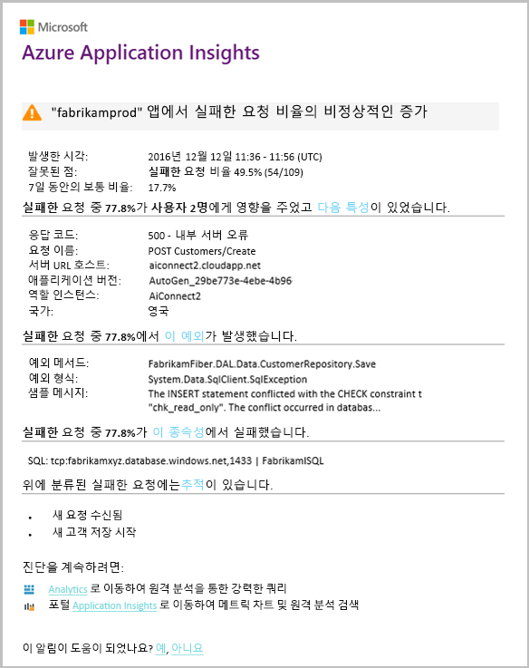

이 메일은 매우 유용합니다. 이 메일은 경고를 발생시키지 않습니다. 또한 수많은 심사 및 진단 작업을 수행합니다.

얼마나 많은 고객이 영향을 받는지 어떤 웹 페이지 또는 작업이 영향을 받는지를 보여 줍니다. Marcela는 전체 팀이 소방 훈련처럼 이 작업을 수행해야 하는지 또는 다음 주까지 무시할 수 있는지 여부를 결정할 수 있습니다.

또한 메일은 특정 예외가 발생했음을 보여 주며 더 흥미롭게도 실패가 특정 데이터베이스에 대한 실패한 호출과 연결되는 것을 보여 줍니다. 이는 Marcela의 팀이 최근 업데이트를 배포하지 않았는데도 오류가 갑자기 나타난 이유를 설명합니다.

Marcella은 이 메일을 기반으로 데이터베이스 팀의 리더를 ping합니다. 그녀는 지난 30분 동안 핫픽스를 릴리스했는데 아마 약간의 스키마 변경이 있었을 수 있음을 알고 있습니다.

그래서 로그를 조사하기 전부터 문제가 해결되고 있습니다. 그리고 발생 15분 이내에 해결될 것입니다. 그러나 Marcela는 Application Insights를 여는 링크를 클릭합니다. 실패한 요청으로 바로 열리고 관련된 종속성 호출 목록에서 실패한 데이터베이스 호출을 확인할 수 있습니다.

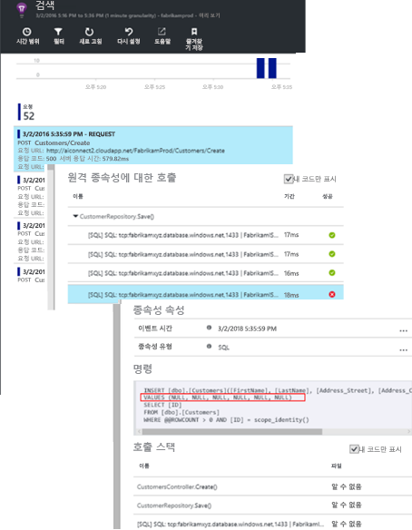

## 예외 검색
설치가 일부 진행되면 [예외](../../azure-monitor/app/asp-net-exceptions.md) 가 Application Insights에 자동으로 보고됩니다. [TrackException()](../../azure-monitor/app/api-custom-events-metrics.md#trackexception) 에 대한 호출을 코드에 삽입하여 명시적으로 캡처될 수도 있습니다.  

    var telemetry = new TelemetryClient();
    ...
    try
    { ...
    }
    catch (Exception ex)
    {
       // Set up some properties:
       var properties = new Dictionary <string, string>
         {{"Game", currentGame.Name}};

       var measurements = new Dictionary <string, double>
         {{"Users", currentGame.Users.Count}};

       // Send the exception telemetry:
       telemetry.TrackException(ex, properties, measurements);
    }

Fabrikam 은행 팀은 명백한 복구가 있는 경우를 제외하고 예외 사항에 대한 원격 분석을 항상 보내는 사례를 발전시켰습니다.  

실제로 해당 전략은 다음 사례보다 훨씬 광범위합니다. 코드의 예외 사항과 부합하는지 여부에 따라 고객이 하고자 했던 경우에 대해 실망한 모든 사례의 원격 분석을 전송합니다. 예를들어 외부 은행 사이의 이체 시스템에서 일부 운영상의 이유로(고객의 실수 아님) "이 거래를 완료할 수 없음" 메시지를 반환하는 경우 해당 이벤트를 추적합니다.

    var successCode = AttemptTransfer(transferAmount, ...);
    if (successCode < 0)
    {
       var properties = new Dictionary <string, string>
            {{ "Code", returnCode, ... }};
       var measurements = new Dictionary <string, double>
         {{"Value", transferAmount}};
       telemetry.TrackEvent("transfer failed", properties, measurements);
    }

TrackException은 스택 복사본을 보내기 때문에 예외 사항을 보고하는 데 사용됩니다. TrackEvent는 기타 이벤트를 보고하는 데 사용됩니다. 진단에서 유용할 수 있는 모든 속성을 연결할 수 있습니다.

예외 사항 및 이벤트는 [진단 검색](diagnostic-search.md) 블레이드에 표시됩니다. 이를 자세히 알아보면 추가 속성 및 스택 추적을 확인할 수 있습니다.

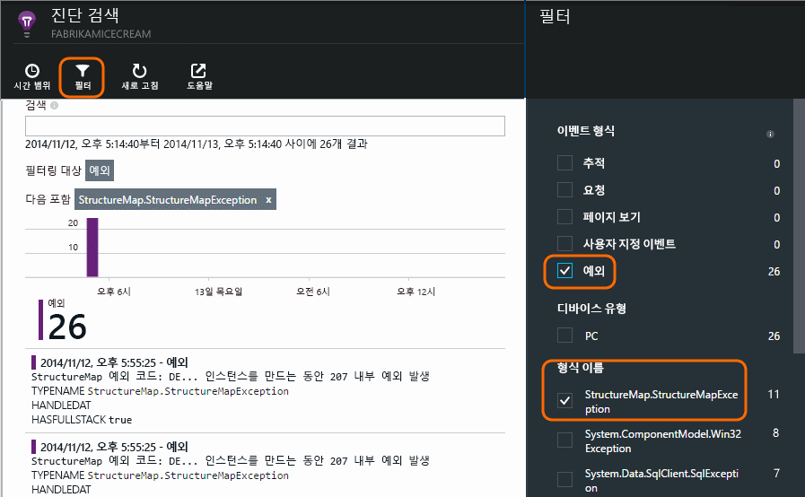

## 사전 모니터링
Marcela는 가만히 앉아서 경고를 기다리고 있지는 않습니다. 매든 재배포 후 곧바로 예외 수뿐 아니라 가장 느린 요청의 전체적인 수치 및 표 모두 [응답 시간](../../azure-monitor/app/web-monitor-performance.md)을 살펴봅니다.  

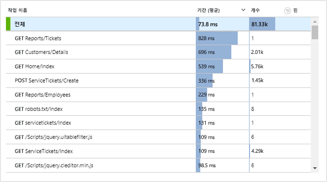

일반적으로 매주 마지막을 비교하여 모든 배포의 성능 효과를 평가할 수 있습니다. 갑작스러운 악화가 있는 경우 관련 개발자와 함께 해당 수치를 높입니다.

## 문제 심사
심사(심각도 및 익스텐트는 문제의 심각도 평가)는 감지 후 첫 번째 단계입니다. 자정에 팀을 호출해야 할까요? 또는 백로그에 손쉽게 액세스할 수 있는 다음 간격까지 기다려도 될까요? 심사에는 몇 가지 핵심적인 질문이 있습니다.

얼마나 자주 발행하나요? 개요 블레이드의 차트는 문제에 대한 일부 관점을 제공합니다. 예를 들어 Fabrikam 애플리케이션이 하룻밤에 4개의 웹 테스트 경고를 생성했습니다. 팀이 아침에 차트를 보면서 여전히 대부분의 테스트가 녹색이지만 일부는 정말 빨간색 점이 있음을 보았습니다. 가용성 차트를 자세히 알아보니 이러한 간헐적인 문제가 모두 한 곳의 테스트 위치에서 발생했음이 명확해졌습니다. 하나의 경로에만 영향을 미치는 명백한 네트워크 문제였으며 저절로 해결될 가능성이 큽니다.  

이와 반대로 예외 수 또는 응답 시간 그래프에서 극적이며 안정적인 증가는 명백히 두려워할만한 것입니다.

유용한 심사 방법은 직접 해보기입니다. 동일한 문제를 실행하면 진실을 알 수 있습니다.

사용자의 어느 부분에 영향을 미치나요? 대략적인 답을 얻으려면 실패율을 세션 수로 나눕니다.

느린 응답이 있는 경우 가장 느린 응답 요청의 테이블과 각 페이지의 사용 빈도를 비교합니다.

차단된 시나리오는 얼마나 중요한가요? 특정 사용자 이야기를 차단하는 기능적 문제가 있는 경우 큰 문제인가요? 고객이 요금을 지불할 수 없는 경우라면 심각한 문제입니다. 고객이 화면 색상 기본 설정을 변경할 수 없는 경우라면 기다릴 수 있습니다. 이벤트 또는 예외 사항의 세부 정보 또는 느린 페이지의 ID는 고객이 문제를 겪고 있는 위치를 말해 줍니다.

## 문제 진단
진단은 디버깅과 같지는 않습니다. 코드를 통한 추적을 시작하기 전에 문제가 발생하고 있는 이유, 위치 및 시기에 대한 대략적인 개념이 있어야 합니다.

**언제 발생하나요?** 이벤트 및 메트릭 차트에서 제공하는 기록 보기를 통해 가능한 원인과 효과를 쉽게 연관지을 수 있습니다. 응답 시간 또는 예외 속도에 간헐적인 최대치가 있으면 요청 수를 살펴 봅니다. 동시에 최대치로 올라가는 경우 리소스 문제일 수 있습니다. 더 많은 CPU 또는 메모리를 할당해야 하나요? 또는 부하를 관리할 수 없는 종속성인가요?

**원인이 무엇인가요?**  예를 들어 고객이 계정서를 원할 때 특정 요청 유형의 성능에서 갑작스러운 하락이 있는 경우, 웹 애플리케이션보다는 외부 하위 시스템일 가능성이 있습니다. 메트릭 탐색기에서 종속성 실패 비율 및 종속성 기간 비율을 선택하여 감지한 문제가 있는 과거 몇 시간 또는 몇 일에 대한 기록을 비교합니다. 연관된 변경 내용이 있는 경우 외부 하위 시스템 때문일 수 있습니다.  

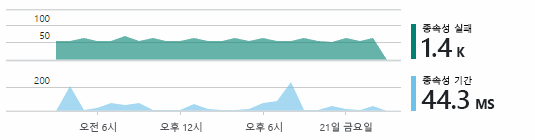

일부 느린 종속성 문제는 지리적 위치 문제입니다. Fabrikam 은행은 Azure 가상 컴퓨터를 사용하며, 의도치 않게 다른 국가에 웹 서버 및 계정 서버가 있음을 발견했습니다. 그 중 하나를 마이그레이션하여 극적인 개선이 이루어졌습니다.

**무엇을 했나요?**  문제가 종속성에 있는 것으로 나타나지 않고 항상 있지 않는 경우, 최근 변경 내용으로 인한 것일 수 있습니다. 메트릭 및 이벤트 차트에서 제공하는 기록적 관점을 통해 갑작스러운 변경 내용과 배포를 쉽게 연관지을 수 있습니다. 이는 문제에 대한 검색 범위를 좁힙니다. 애플리케이션 코드에서 성능을 저하시킨 줄을 확인하려면 Application Insights Profiler를 사용하도록 설정합니다. [Application Insights를 사용하여 라이브 Azure Web Apps 프로파일링](./../../azure-monitor/app/profiler.md)을 참조하세요. Profiler를 사용하도록 설정하고 나면 다음과 같은 추적이 표시됩니다. 이 예제에서는 *GetStorageTableData* 메서드로 인해 문제가 발생했음을 쉽게 확인할 수 있습니다.  

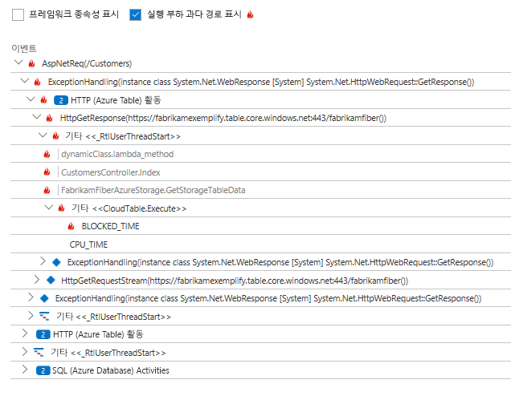

**무엇이 일어나고 있나요?** 일부 문제가 드물게만 발생하고 오프라인 테스트를 통해서는 추적하기 어려울 수 있습니다. 최대한 할 수 있는 일은 실시간으로 발생할 때 버그를 확보하려고 노력하는 것입니다. 예외 보고서에서 스택 덤프를 점검할 수 있습니다. 또한 자주 사용하는 로깅 프레임워크 또는 TrackTrace()나 TrackEvent()를 사용하여 추적 호출을 작성할 수 있습니다.  

Fabrikam은 계좌 간 이체에 간헐적인 문제가 있었으나 특정 계좌 유형에만 발생하지는 않았습니다. 자세히 이해하기 위해 계좌 유형을 각각의 호출에 속성으로 연결하여 코드에서 주요 포인트로 TrackTrace() 호출을 삽입했습니다. 이를 통해 진단 검색에서 해당 추적을 필터링하기 쉬워졌습니다. 또한 속성 및 측정값으로 매개 변수 값을 추적 호출에 연결했습니다.

## 검색된 문제에 대응
문제를 진단하면 이를 수정하기 위한 계획을 세울 수 있습니다. 최근 변경 내용을 롤백해야 할 수도 있고, 진행하여 수정할 수도 있습니다. 수정이 이루어지면 수정이 성공했는지 Application Insights에서 알려 줍니다.  

Fabrikam 은행 개발팀은 보다 구조화된 접근법으로 Application Insights를 사용하기 전에 사용했던 측정 방식을 수행합니다.

* Application Insights 개요 페이지에서 특정 측정값을 기준으로 성능 목표를 설정합니다.
* 'funnels.'를 통해 사용자 진행률을 측정하는 메트릭과 같이 시작부터 애플리케이션에 성능 측정값을 디자인합니다.  

## 사용자 활동 모니터링
응답 시간이 일관적으로 양호하고 예외가 거의 없으면 개발 팀에서 유용성으로 넘어갈 수 있습니다. 사용자의 경험을 개선하는 방법과 더 많은 사용자가 원하는 목표를 달성하도록 유도하는 방법에 대해 고민할 수 있습니다.

Application Insights는 사용자가 앱으로 수행할 작업에 대해 알아보는 데 사용할 수도 있습니다. 원활하게 실행되면 팀은 가장 인기 있는 기능, 사용자가 좋아하는 기능 또는 어려워하는 기능 및 다시 방문하는 빈도에 대해 알고자 합니다. 이는 예정된 작업의 우선 순위를 정하는 데 도움이 됩니다. 또한 개발 주기의 일환으로 각 기능의 성공을 측정할 계획을 세울 수 있습니다.

예를 들어 웹 사이트를 통한 일반적인 사용자 여정에는 명확한 "깔때기"가 있습니다. 많은 고객들이 다양한 유형의 대출 금리를 살펴봅니다. 견적서를 작성하는 단계로 넘어가는 고객은 그보다 수가 적습니다. 견적서를 작성한 고객 중에서 일부만 다음 단계로 넘어가서 대출을 실행합니다.

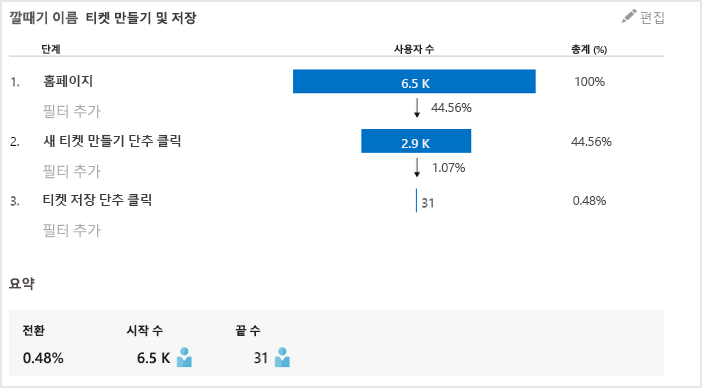

빠져나가는 고객의 수가 가장 많은 영역을 고려하면, 깔때기형 차트의 아래쪽을 통해 더 많은 사용자를 받는 방법에 대해 작업할 수 있습니다. 일부의 경우 사용자 환경(UX) 실패일 수 있습니다. 예를 들어 '다음' 단추를 찾기 어렵거나 지침이 분명하지 않습니다. 탈퇴에 가장 중요한 비즈니스 이유는 대출 이율이 너무 높기 때문일 수 있습니다.

어떤 이유이든 데이터는 사용자가 무엇을 사용하고 있는지 아는 데 도움이 됩니다. 추가 추적 호출이 삽입되어 더 많은 것을 알아낼 수 있습니다. TrackEvent()는 지불과 같은 상당한 성과에 대한 개별 단추 클릭의 횟수로 모든 사용자 동작을 계산하는데 사용할 수 있습니다.

팀은 사용자 작업에 대한 정보를 가져오는 데 익숙합니다. 오늘날에는 새로운 기능을 디자인할 때마다 사용에 대한 피드백을 받는 방법을 생각합니다. 처음부터 기능으로의 추적 호출을 디자인합니다. 피드백을 사용하여 각 개발 주기로 기능을 향상시킵니다.

[사용 현황 추적에 대해 자세히 읽어보세요](../../azure-monitor/app/usage-overview.md).

## DevOps 주기 적용
이것이 한 팀이 Application Insights를 사용하여 개별 문제를 수정하는 것이 아니라 개발 수명 주기를 개선한 방법입니다. Application Insights가 애플리케이션의 성능 관리를 개선하는 데 어떻게 도움을 줄 수 있는지에 대한 아이디어를 제공했기 바랍니다.

## 비디오

> [!VIDEO https://channel9.msdn.com/events/Connect/2016/112/player]

## 다음 단계
애플리케이션의 특성에 따라 여러 가지 방법으로 시작할 수 있습니다. 가장 적합한 항목을 선택하세요.

* [ASP.NET 웹 애플리케이션](../../azure-monitor/app/asp-net.md)
* [Java 웹 애플리케이션](../../azure-monitor/app/java-get-started.md)
* [Node.js 웹 애플리케이션](../../azure-monitor/app/nodejs.md)
* [IIS](../../azure-monitor/app/monitor-web-app-availability.md)에서 호스트되는 이미 배포된 앱
* [Azure](../../azure-monitor/app/app-insights-overview.md).
* [웹 페이지](../../azure-monitor/app/javascript.md) - 단일 페이지 앱 또는 일반 웹 페이지 - 독립적으로 또는 다른 서버 옵션과 함께 사용
* [가용성 테스트](../../azure-monitor/app/monitor-web-app-availability.md) - 공용 인터넷에서 앱 테스트
