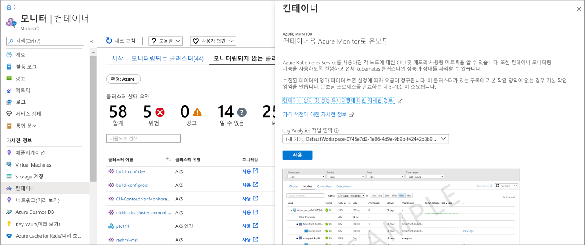

# <a name="enable-monitoring-of-azure-kubernetes-service-aks-cluster-already-deployed"></a>이미 배포 된 AKS (Azure Kubernetes Service) 클러스터의 모니터링 사용

이 문서에서는 구독에 이미 배포 된 [Azure Kubernetes Service](../../aks/index.yml) 에 호스트 된 관리 되는 Kubernetes 클러스터를 모니터링 하는 컨테이너에 대 한 Azure Monitor를 설정 하는 방법을 설명 합니다.

지원 되는 방법 중 하나를 사용 하 여 이미 배포 된 AKS 클러스터의 모니터링을 사용 하도록 설정할 수 있습니다.

* Azure CLI
* Terraform
* [Azure Monitor에서](#enable-from-azure-monitor-in-the-portal) 또는 AZURE PORTAL의 [AKS 클러스터에서 직접](#enable-directly-from-aks-cluster-in-the-portal)
* Azure PowerShell cmdlet을 사용 하거나 Azure CLI를 사용 하 여 [제공 된 Azure Resource Manager 템플릿을](#enable-using-an-azure-resource-manager-template) 사용 `New-AzResourceGroupDeployment` 합니다.

## <a name="sign-in-to-the-azure-portal"></a>Azure Portal에 로그인

[Azure Portal](https://portal.azure.com)에 로그인합니다.

## <a name="enable-using-azure-cli"></a>Azure CLI 사용

다음 단계에서는 Azure CLI를 사용하여 AKS 클러스터의 모니터링을 사용하도록 설정합니다. 이 예에서는 기존 작업 영역을 미리 만들거나 지정할 필요가 없습니다. 이 명령은 해당 지역에서 AKS 클러스터 구독의 기본 리소스 그룹에 기본 작업 공간이 아직 없는 경우 기본 작업 공간을 만들어서 프로세스를 간소화합니다.  만든 기본 작업 영역은 *defaultworkspace \<GUID> - \<Region> *의 형식과 유사 합니다.

```azurecli
az aks enable-addons -a monitoring -n MyExistingManagedCluster -g MyExistingManagedClusterRG
```

출력은 다음과 유사합니다.

```output
provisioningState       : Succeeded
```

### <a name="integrate-with-an-existing-workspace"></a>기존 작업 영역과 통합

기존 작업 영역에 통합 하는 경우 다음 단계를 수행 하 여 매개 변수에 필요한 Log Analytics 작업 영역의 전체 리소스 ID를 먼저 식별 한 `--workspace-resource-id` 다음 명령을 실행 하 여 지정 된 작업 영역에 대해 모니터링 추가 기능을 사용 하도록 설정 합니다.

1. 다음 명령을 사용 하 여 액세스 권한이 있는 모든 구독을 나열 합니다.

    ```azurecli
    az account list --all -o table
    ```

    출력은 다음과 유사합니다.

    ```output
    Name                                  CloudName    SubscriptionId                        State    IsDefault
    ------------------------------------  -----------  ------------------------------------  -------  -----------
    Microsoft Azure                       AzureCloud   68627f8c-91fO-4905-z48q-b032a81f8vy0  Enabled  True
    ```

    **SubscriptionId**의 값을 복사 합니다.

2. 다음 명령을 사용 하 여 Log Analytics 작업 영역을 호스팅하는 구독으로 전환 합니다.

    ```azurecli
    az account set -s <subscriptionId of the workspace>
    ```

3. 다음 예에서는 구독의 작업 영역 목록을 기본 JSON 형식으로 표시 합니다.

    ```azurecli
    az resource list --resource-type Microsoft.OperationalInsights/workspaces -o json
    ```

    출력에서 작업 영역 이름을 찾은 다음, 해당 Log Analytics 작업 영역의 전체 리소스 ID를 필드 **ID**로 복사 합니다.

4. 다음 명령을 실행 하 여 모니터링 추가 기능을 사용 하도록 설정 하 고 매개 변수의 값을 바꿉니다 `--workspace-resource-id` . 문자열 값은 큰따옴표로 묶어야 합니다.

    ```azurecli
    az aks enable-addons -a monitoring -n ExistingManagedCluster -g ExistingManagedClusterRG --workspace-resource-id "/subscriptions/<SubscriptionId>/resourceGroups/<ResourceGroupName>/providers/Microsoft.OperationalInsights/workspaces/<WorkspaceName>"
    ```

    출력은 다음과 유사합니다.

    ```output
    provisioningState       : Succeeded
    ```

## <a name="enable-using-terraform"></a>Terraform 사용

1. 기존 [azurerm_kubernetes_cluster 리소스](https://www.terraform.io/docs/providers/azurerm/d/kubernetes_cluster.html#addon_profile)에 **oms_agent** 추가 프로필을 추가합니다.

   ```
   addon_profile {
    oms_agent {
      enabled                    = true
      log_analytics_workspace_id = "${azurerm_log_analytics_workspace.test.id}"
     }
   }
   ```

2. Terraform 설명서의 단계에 따라 [azurerm_log_analytics_solution](https://www.terraform.io/docs/providers/azurerm/r/log_analytics_solution.html)을 추가합니다.

## <a name="enable-from-azure-monitor-in-the-portal"></a>포털의 Azure Monitor에서 사용

Azure Monitor의 Azure Portal에서 AKS 클러스터의 모니터링을 사용하려면 다음 단계를 수행합니다.

1. Azure Portal에서 **모니터**를 선택합니다.

2. 목록에서 **컨테이너**를 선택합니다.

3. **모니터-컨테이너** 페이지에서 모니터링 되지 않는 **클러스터**를 선택 합니다.

4. 모니터링 되지 않는 클러스터 목록에서 목록에 있는 컨테이너를 찾고 **사용**을 클릭 합니다.

5. 클러스터와 동일한 구독에 기존 Log Analytics 작업 영역이 있는 경우 **컨테이너용 Azure Monitor에 온보딩** 페이지의 드롭다운 목록에서 해당 작업 영역을 선택합니다.
    구독에서 AKS 컨테이너가 배포된 기본 작업 영역 및 위치가 미리 선택됩니다.

    

    >[!NOTE]
    >클러스터의 모니터링 데이터를 저장하기 위해 새 Log Analytics 작업 영역을 만들려면 [Log Analytics 작업 영역 만들기](../learn/quick-create-workspace.md)를 참조하세요. AKS 컨테이너가 배포된 구독과 동일한 구독에 작업 영역을 만들어야 합니다.

모니터링을 사용하도록 설정하고 약 15분 후에 클러스터에 대한 상태 메트릭을 볼 수 있습니다.

## <a name="enable-directly-from-aks-cluster-in-the-portal"></a>포털에서 AKS 클러스터에서 직접 사용

Azure Portal에서 AKS 클러스터 중 하나에서 직접 모니터링을 사용 하도록 설정 하려면 다음을 수행 합니다.

1. Azure Portal에서 **모든 서비스**를 선택합니다.

2. 리소스 목록에서 **컨테이너** 입력을 시작합니다.  입력한 내용을 기반으로 목록이 필터링됩니다.

3. **Kubernetes 서비스**를 선택합니다.

    

4. 컨테이너 목록에서 컨테이너를 선택합니다.

5. 컨테이너 개요 페이지에서 **컨테이너 모니터링**을 선택합니다.

6. 클러스터와 동일한 구독에 기존 Log Analytics 작업 영역이 있는 경우 **컨테이너용 Azure Monitor에 온보딩** 페이지의 드롭다운 목록에서 해당 작업 영역을 선택합니다.
    구독에서 AKS 컨테이너가 배포된 기본 작업 영역 및 위치가 미리 선택됩니다.

    

    >[!NOTE]
    >클러스터의 모니터링 데이터를 저장하기 위해 새 Log Analytics 작업 영역을 만들려면 [Log Analytics 작업 영역 만들기](../learn/quick-create-workspace.md)를 참조하세요. AKS 컨테이너가 배포된 구독과 동일한 구독에 작업 영역을 만들어야 합니다.

모니터링을 사용하도록 설정한 후 약 15분 후에 클러스터에 대한 운영 데이터를 볼 수 있습니다.

## <a name="enable-using-an-azure-resource-manager-template"></a>Azure Resource Manager 템플릿을 사용 하도록 설정

이 메서드는 두 가지 JSON 템플릿을 포함합니다. 한 가지 템플릿은 모니터링을 사용하도록 구성을 지정하고, 다른 템플릿은 다음을 지정하도록 구성하는 매개 변수 값을 포함합니다.

* AKS 컨테이너 리소스 ID.
* 클러스터가 배포된 리소스 그룹.

>[!NOTE]
>템플릿을 클러스터와 동일한 리소스 그룹에 배포해야 합니다.
>

Azure PowerShell 또는 CLI를 사용 하 여 모니터링을 사용 하도록 설정 하기 전에 Log Analytics 작업 영역을 만들어야 합니다. 작업 영역을 만들려면 [Azure Resource Manager](../platform/template-workspace-configuration.md)나 [PowerShell](../scripts/powershell-sample-create-workspace.md?toc=%2fpowershell%2fmodule%2ftoc.json)을 통해 또는 [Azure Portal](../learn/quick-create-workspace.md)에서 설정할 수 있습니다.

템플릿을 사용하여 리소스를 배포하는 개념에 익숙하지 않은 경우 다음을 참조하십시오.

* [Resource Manager 템플릿과 Azure PowerShell로 리소스 배포](../../azure-resource-manager/templates/deploy-powershell.md)

* [Resource Manager 템플릿과 Azure CLI로 리소스 배포](../../azure-resource-manager/templates/deploy-cli.md)

Azure CLI를 사용하도록 선택한 경우, 먼저 CLI를 로컬에 설치하고 사용해야 합니다. Azure CLI 버전 2.0.59 이상을 실행 해야 합니다. 버전을 확인하려면 `az --version`을 실행합니다. Azure CLI를 설치하거나 업그레이드해야 하는 경우 [Azure CLI 설치](/cli/azure/install-azure-cli)를 참조하세요.

### <a name="create-and-execute-a-template"></a>템플릿 만들기 및 실행

1. 다음 JSON 구문을 파일에 복사하여 붙여넣습니다.

    ```json
    {
      "$schema": "https://schema.management.azure.com/schemas/2015-01-01/deploymentTemplate.json#",
      "contentVersion": "1.0.0.0",
      "parameters": {
        "aksResourceId": {
          "type": "string",
          "metadata": {
            "description": "AKS Cluster Resource ID"
          }
        },
        "aksResourceLocation": {
          "type": "string",
          "metadata": {
            "description": "Location of the AKS resource e.g. \"East US\""
          }
        },
        "aksResourceTagValues": {
          "type": "object",
          "metadata": {
            "description": "Existing all tags on AKS Cluster Resource"
          }
        },
        "workspaceResourceId": {
          "type": "string",
          "metadata": {
            "description": "Azure Monitor Log Analytics Resource ID"
          }
        }
      },
      "resources": [
        {
          "name": "[split(parameters('aksResourceId'),'/')[8]]",
          "type": "Microsoft.ContainerService/managedClusters",
          "location": "[parameters('aksResourceLocation')]",
          "tags": "[parameters('aksResourceTagValues')]",
          "apiVersion": "2018-03-31",
          "properties": {
            "mode": "Incremental",
            "id": "[parameters('aksResourceId')]",
            "addonProfiles": {
              "omsagent": {
                "enabled": true,
                "config": {
                  "logAnalyticsWorkspaceResourceID": "[parameters('workspaceResourceId')]"
                }
              }
            }
          }
        }
      ]
    }
    ```

2. 이 파일을 **existingClusterOnboarding.json**으로 로컬 폴더에 저장합니다.

3. 다음 JSON 구문을 파일에 붙여넣습니다.

    ```json
    {
      "$schema": "https://schema.management.azure.com/schemas/2015-01-01/deploymentParameters.json#",
      "contentVersion": "1.0.0.0",
      "parameters": {
        "aksResourceId": {
          "value": "/subscriptions/<SubscriptionId>/resourcegroups/<ResourceGroup>/providers/Microsoft.ContainerService/managedClusters/<ResourceName>"
        },
        "aksResourceLocation": {
          "value": "<aksClusterLocation>"
        },
        "workspaceResourceId": {
          "value": "/subscriptions/<SubscriptionId>/resourceGroups/<ResourceGroup>/providers/Microsoft.OperationalInsights/workspaces/<workspaceName>"
        },
        "aksResourceTagValues": {
          "value": {
            "<existing-tag-name1>": "<existing-tag-value1>",
            "<existing-tag-name2>": "<existing-tag-value2>",
            "<existing-tag-nameN>": "<existing-tag-valueN>"
          }
        }
      }
    }
    ```

4. AKS 클러스터에 대 한 **AKS 개요** 페이지의 값을 사용 하 여 **aksResourceId** 및 **aksResourceLocation** 에 대 한 값을 편집 합니다. **workspaceResourceId** 값은 Log Analytics 작업 영역의 전체 리소스 ID 이며, 작업 영역 이름을 포함합니다.

    **AksResourceTagValues** 에 대 한 값을 편집 하 여 AKS 클러스터에 지정 된 기존 태그 값과 일치 시킵니다.

5. 이 파일을 **existingClusterParam.json**으로 로컬 폴더에 저장합니다.

6. 이제 이 템플릿을 배포할 수 있습니다.

   * Azure PowerShell를 사용 하 여 배포 하려면 템플릿이 포함 된 폴더에서 다음 명령을 사용 합니다.

       ```powershell
       New-AzResourceGroupDeployment -Name OnboardCluster -ResourceGroupName <ResourceGroupName> -TemplateFile .\existingClusterOnboarding.json -TemplateParameterFile .\existingClusterParam.json
       ```

       구성 변경을 완료하려면 몇 분 정도 걸릴 수 있습니다. 완료되면 다음과 유사한 메시지가 표시되고 결과가 포함됩니다.

       ```output
       provisioningState       : Succeeded
       ```

   * Azure CLI를 사용 하 여 배포 하려면 다음 명령을 실행 합니다.

       ```azurecli
       az login
       az account set --subscription "Subscription Name"
       az group deployment create --resource-group <ResourceGroupName> --template-file ./existingClusterOnboarding.json --parameters @./existingClusterParam.json
       ```

       구성 변경을 완료하려면 몇 분 정도 걸릴 수 있습니다. 완료되면 다음과 유사한 메시지가 표시되고 결과가 포함됩니다.

       ```output
       provisioningState       : Succeeded
       ```

       모니터링을 사용하도록 설정하고 약 15분 후에 클러스터에 대한 상태 메트릭을 볼 수 있습니다.

## <a name="verify-agent-and-solution-deployment"></a>에이전트 및 솔루션 배포 확인

에이전트 *06072018* 또는 이후 버전을 사용하여 에이전트 및 솔루션이 모두 성공적으로 배포되었는지 확인할 수 있습니다. 이전 버전의 에이전트를 사용하면 에이전트 배포만 확인할 수 있습니다.

### <a name="agent-version-06072018-or-later"></a>에이전트 06072018 또는 이후 버전

다음 명령을 실행하여 에이전트가 성공적으로 배포되었는지 확인합니다.

```
kubectl get ds omsagent --namespace=kube-system
```

출력은 다음과 유사해야 하며, 이 출력은 제대로 배포된 것을 나타냅니다.

```output
User@aksuser:~$ kubectl get ds omsagent --namespace=kube-system
NAME       DESIRED   CURRENT   READY     UP-TO-DATE   AVAILABLE   NODE SELECTOR                 AGE
omsagent   2         2         2         2            2           beta.kubernetes.io/os=linux   1d
```

클러스터에 Windows Server 노드가 있는 경우 다음 명령을 실행 하 여 에이전트가 성공적으로 배포 되었는지 확인할 수 있습니다.

```
kubectl get ds omsagent-win --namespace=kube-system
```

출력은 다음과 유사해야 하며, 이 출력은 제대로 배포된 것을 나타냅니다.

```output
User@aksuser:~$ kubectl get ds omsagent-win --namespace=kube-system
NAME                   DESIRED   CURRENT   READY     UP-TO-DATE   AVAILABLE   NODE SELECTOR                   AGE
omsagent-win           2         2         2         2            2           beta.kubernetes.io/os=windows   1d
```

솔루션의 배포를 확인하려면 다음 명령을 실행합니다.

```
kubectl get deployment omsagent-rs -n=kube-system
```

출력은 다음과 유사해야 하며, 이 출력은 제대로 배포된 것을 나타냅니다.

```output
User@aksuser:~$ kubectl get deployment omsagent-rs -n=kube-system
NAME       DESIRED   CURRENT   UP-TO-DATE   AVAILABLE    AGE
omsagent   1         1         1            1            3h
```

### <a name="agent-version-earlier-than-06072018"></a>06072018 이전 에이전트 버전

*06072018* 이전에 릴리스된 Log Analytics 에이전트 버전이 제대로 배포되었는지 확인하려면 다음 명령을 실행합니다.

```
kubectl get ds omsagent --namespace=kube-system
```

출력은 다음과 유사해야 하며, 이 출력은 제대로 배포된 것을 나타냅니다.

```output
User@aksuser:~$ kubectl get ds omsagent --namespace=kube-system
NAME       DESIRED   CURRENT   READY     UP-TO-DATE   AVAILABLE   NODE SELECTOR                 AGE
omsagent   2         2         2         2            2           beta.kubernetes.io/os=linux   1d
```

## <a name="view-configuration-with-cli"></a>CLI로 구성 보기

`aks show` 명령을 사용하면 솔루션을 사용하도록 설정되어 있는지 여부, Log Analytics 작업 영역 resourceID, 클러스터에 대한 요약 정보와 같은 세부 정보를 얻을 수 있습니다.

```azurecli
az aks show -g <resourceGroupofAKSCluster> -n <nameofAksCluster>
```

몇 분 후 명령이 완료되면 솔루션에 대한 JSON 형식 정보가 반환됩니다.  명령의 결과에는 모니터링 추가 항목 프로필이 표시되며 다음 예제 출력과 유사합니다.

```output
"addonProfiles": {
    "omsagent": {
      "config": {
        "logAnalyticsWorkspaceResourceID": "/subscriptions/<WorkspaceSubscription>/resourceGroups/<DefaultWorkspaceRG>/providers/Microsoft.OperationalInsights/workspaces/<defaultWorkspaceName>"
      },
      "enabled": true
    }
  }
```

## <a name="next-steps"></a>다음 단계

* 솔루션을 등록하는 동안 문제가 발생하는 경우 [문제 해결 가이드](container-insights-troubleshoot.md)를 검토하세요.

* 모니터링을 사용 하 여 AKS 클러스터의 상태 및 리소스 사용률을 수집 하 고 해당 작업에서 실행 되는 작업을 수집 합니다. 컨테이너에 Azure Monitor [를 사용 하는 방법을](container-insights-analyze.md) 알아봅니다.

