# <a name="using-service-map-solution-in-azure"></a>Azure에서 서비스 맵 솔루션 사용
서비스 맵은 Windows 및 Linux 시스템에서 애플리케이션 구성 요소를 자동으로 검색하고 서비스 간 통신을 매핑합니다. 서비스 맵을 사용하면 생각하는 방식 즉, 중요한 서비스를 제공하는 상호 연결된 시스템으로 서버를 볼 수 있습니다. 서비스 맵은 서버, 프로세스, 인바운드/아웃바운드 연결 대기 시간 및 에이전트 설치 이외에 구성이 필요 없는 TCP 연결 아키텍처의 포트 간 연결을 보여 줍니다.

이 문서에서는 서비스 맵 사용 및 온보딩에 대한 세부 정보를 설명합니다. 서비스 맵 구성 및 에이전트 온보딩에 대한 자세한 내용은 [Azure에서 서비스 맵 솔루션 구성]( service-map-configure.md)을 참조하세요.

>[!NOTE]
>서비스 맵을 이미 배포한 경우에는 VM 상태 및 성능을 모니터링하는 추가 기능이 포함된 VM용 Azure Monitor에서 맵을 볼 수 있습니다. 자세한 내용은 [VM용 Azure Monitor 개요](../../azure-monitor/insights/vminsights-overview.md)를 참조하세요.


## <a name="sign-in-to-azure"></a>Azure에 로그인
[https://portal.azure.com](https://portal.azure.com)에서 Azure Portal에 로그인합니다.

## <a name="enable-service-map"></a>서비스 맵 사용
1. Azure Portal에서 **+ 리소스 만들기**를 클릭합니다.
2. 검색 창에 **서비스 맵**을 입력하고 **Enter** 키를 누릅니다.
3. 마켓플레이스 검색 결과 페이지의 목록에서 **서비스 맵**을 선택합니다.<br><br> <br>
4. **서비스 맵** 개요 창에서 솔루션 세부 정보를 검토한 다음, **만들기**를 클릭하여 Log Analytics 작업 영역에서 온보딩 프로세스를 시작합니다.<br><br> .
5. **솔루션 구성** 창에서 기존 Log Analytics 작업 영역을 선택하거나 새 Log Analytics 작업 영역을 만듭니다.  새 작업 영역을 만드는 방법에 대한 자세한 내용은 [Azure Portal에서 Log Analytics 작업 영역 만들기](../../azure-monitor/learn/quick-create-workspace.md)를 참조합니다. 필요한 정보를 제공한 후 **만들기**를 클릭합니다.  

정보가 확인되고 솔루션이 배포되는 동안 메뉴의 **알림**에서 진행 상황을 추적할 수 있습니다. 

Log Analytics 작업 영역의 Azure Portal에서 서비스 맵에 액세스하고 왼쪽 창에서 **솔루션** 옵션을 선택합니다.<br><br> 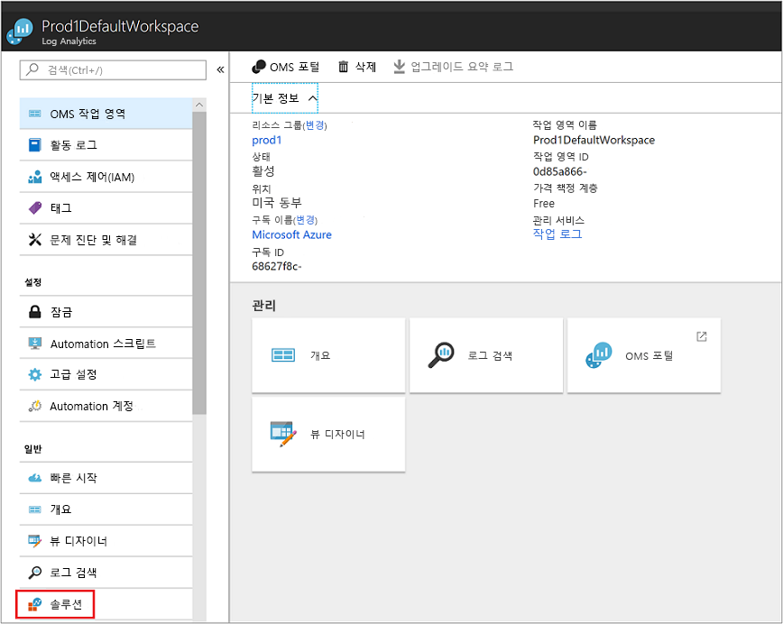.<br> 솔루션의 목록에서 **ServiceMap(workspaceName)** 을 선택하고 서비스 맵 솔루션 개요 페이지에서 서비스 맵 요약 타일을 클릭합니다.<br><br> 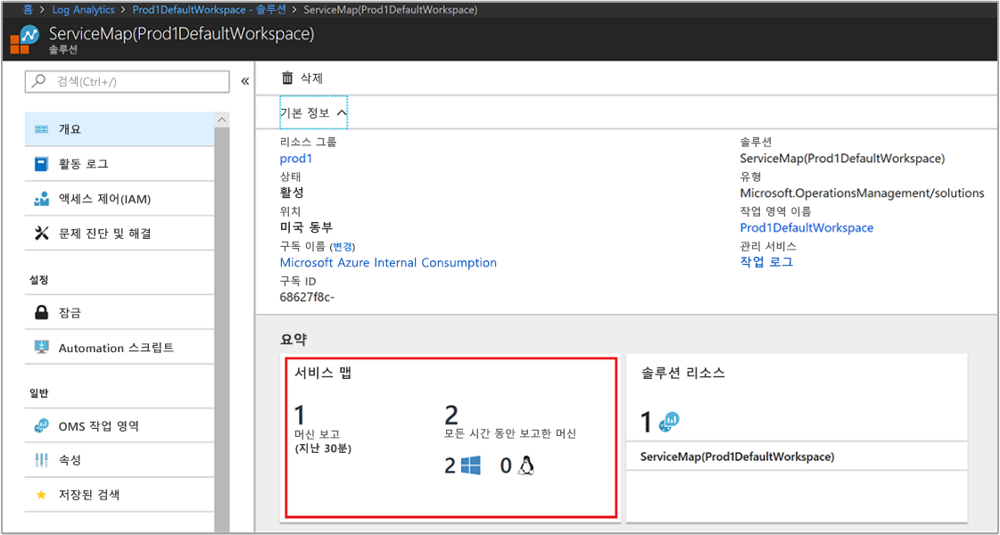.

## <a name="use-cases-make-your-it-processes-dependency-aware"></a>사용 사례: IT 프로세스 종속성 인식

### <a name="discovery"></a>검색
서비스 맵은 서버, 프로세스 및 타사 서비스 간 종속성에 대한 일반적인 참조 맵을 자동으로 작성합니다. 모든 TCP 종속성을 검색 및 매핑하여 예기치 않은 연결, 사용 중인 원격 타사 시스템, Active Directory 등 기존의 어두운 영역에 대한 종속성을 식별합니다. 서비스 맵은 관리되는 시스템에서 시도하는 실패한 네트워크 연결을 검색하여 잠재적인 서버 구성 오류, 서비스 중단 및 네트워크 문제를 파악할 수 있습니다.

### <a name="incident-management"></a>인시던트 관리
서비스 맵을 통해 시스템이 어떻게 연결되고 서로 어떻게 영향을 주는지 표시할 수 있으므로 문제 격리의 추측을 없앨 수 있습니다. 실패한 연결을 식별하는 것 외에도, 잘못 구성된 부하 분산 장치, 중요한 서비스에서 예기치 않거나 과도한 로드, 프로덕션 시스템과 통신 중인 개발자 컴퓨터와 같은 불량 클라이언트를 식별하는 데 도움이 됩니다. 변경 내용 추적과 통합된 워크플로를 사용하여, 백 엔드 컴퓨터 또는 서비스의 변경 이벤트가 인시던트의 근본 원인을 설명하는지 여부도 확인할 수 있습니다.

### <a name="migration-assurance"></a>마이그레이션 보증
서비스 맵을 사용하면, Azure Migration을 효과적으로 계획, 가속화 및 검증할 수 있으므로 아무것도 남기지 않고 임의의 중단이 발생하지 않도록 할 수 있습니다. 함께 마이그레이션해야 하는 모든 상호 종속적인 시스템을 검색하고 시스템 구성 및 용량을 평가하며 실행 중인 시스템이 여전히 사용자에게 서비스 중인지, 마이그레이션 대신 서비스 해제가 적합한지 여부를 식별합니다. 이동이 완료되면 클라이언트 로드 및 ID를 확인하여 테스트 시스템과 고객이 연결 중인지 확인할 수 있습니다. 서브넷 계획 및 방화벽 정의에 문제가 있으면 서비스 맵 맵에서 실패한 연결을 통해 사용자는 연결이 필요한 시스템으로 안내됩니다.

### <a name="business-continuity"></a>비즈니스 연속성
Azure Site Recovery를 사용 중이고 애플리케이션 환경에 대한 복구 시퀀스를 정의하는 데 도움이 필요한 경우 서비스 맵은 시스템이 서로 어떻게 의존하여 복구 계획의 안정성을 보장하는지를 자동으로 보여 줄 수 있습니다. 중요한 서버나 그룹을 선택하고 클라이언트를 보면 서버가 복원되어 사용 가능할 때 복구할 프런트 엔드 시스템을 식별할 수 있습니다. 반대로 중요한 서버의 백 엔드 종속성을 살펴보고 포커스 시스템을 복원하기 전에 복구할 시스템을 식별할 수 있습니다.

### <a name="patch-management"></a>패치 관리
서비스 맵은 다른 어떤 팀과 서버가 사용자의 서비스에 종속되어 있는지를 보여 주어 시스템 업데이트 평가 사용을 개선하므로 패치 적용을 위해 시스템이 중단되기 전에 사전에 알릴 수 있습니다. 또한 서비스 맵은 서비스가 사용 가능한지, 패치 적용되어 다시 시작된 후 제대로 연결되었는지를 표시하여 패치 관리를 개선합니다.

## <a name="mapping-overview"></a>매핑 개요
서비스 맵 에이전트는 에이전트가 설치된 서버에서 각 프로세스에 대한 인바운드 및 아웃바운드 연결에 대한 정보를 비롯하여 모든 TCP 연결 프로세스에 대한 정보를 수집합니다.

왼쪽 창의 목록에서 서비스 맵 에이전트가 있는 시스템이나 그룹을 선택하여 지정된 시간 범위에 대한 종속성을 시각화할 수 있습니다. 컴퓨터 종속성 맵은 특정 컴퓨터에 집중하고 해당 컴퓨터의 직접 TCP 클라이언트 또는 서버인 모든 컴퓨터를 보여 줍니다.  컴퓨터 그룹 맵은 일련의 서버 및 서버 종속성을 보여줍니다.

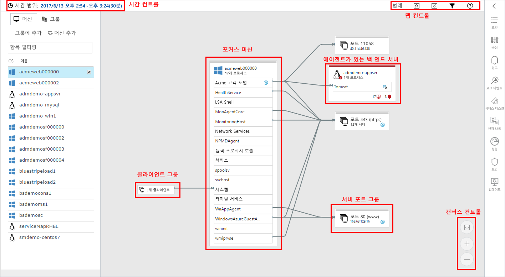

선택한 시간 범위 동안 활성 네트워크 연결을 통해 실행 중인 프로세스 그룹 및 프로세스를 표시하도록 맵에서 컴퓨터를 확장할 수 있습니다. 서비스 맵 에이전트가 있는 원격 컴퓨터를 확장하여 프로세스 세부 정보를 표시하면 포커스 시스템과 통신하는 프로세스만 표시됩니다. 포커스 컴퓨터에 연결되는 에이전트 없는 프런트 엔드 컴퓨터의 수가 연결되는 프로세스의 왼쪽에 표시됩니다. 포커스 컴퓨터가 에이전트 없는 백 엔드 컴퓨터에 연결하는 경우 백 엔드 서버는 동일한 포트 번호에 대한 다른 연결과 함께 서버 포트 그룹에 포함됩니다.

기본적으로 서비스 맵 맵은 최근 30분 간의 종속성 정보를 표시합니다. 왼쪽 상단의 시간 컨트롤을 사용하여 최대 1시간의 기록 시간 범위에 대한 맵을 쿼리하여 과거의 종속성(예: 인시던트 중 또는 변경되기 전)을 보여줍니다. 서비스 맵 데이터는 유료 작업 영역에서 30일 동안, 무료 작업 영역에서는 7일 동안 저장됩니다.

## <a name="status-badges-and-border-coloring"></a>상태 배지 및 경계 색 지정
맵의 각 서버 하단에는 서버에 대한 상태 정보를 전달하는 상태 배지 목록이 있을 수 있습니다. 이러한 배지가 있으면 솔루션 통합 중 하나에서 제공된 서버 관련 정보가 있는 것입니다. 배지를 클릭하면 오른쪽 창의 상태 세부 정보로 직접 이동됩니다. 현재 사용 가능한 상태 배지에는 경고, 서비스 데스크, 변경 내용, 보안 및 업데이트가 포함됩니다.

상태 배지의 심각도에 따라 컴퓨터 노드 경계는 빨간색(위험), 노란색(경고) 또는 파란색(정보)으로 지정될 수 있습니다. 색은 상태 배지 중 가장 심각한 상태를 나타냅니다. 회색 테두리는 상태 표시기가 없는 노드를 나타냅니다.

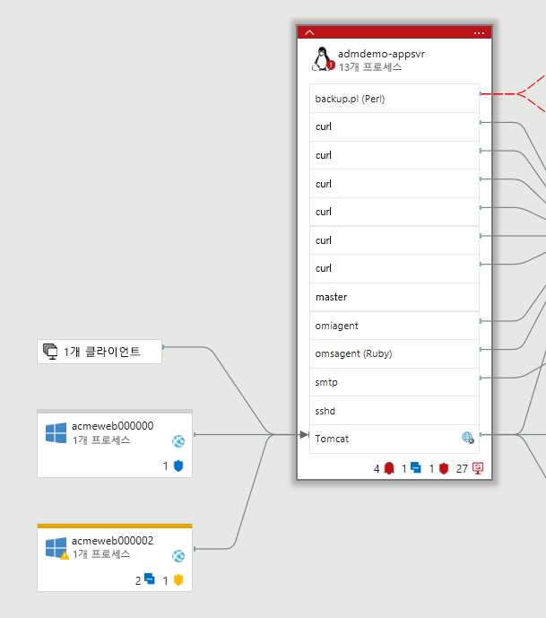

## <a name="process-groups"></a>프로세스 그룹
프로세스 그룹은 공통 제품 또는 서비스와 연결된 프로세스를 프로세스 그룹으로 결합합니다.  컴퓨터 노드를 확장하는 경우 프로세스 그룹과 함께 독립 실행형 프로세스를 표시합니다.  프로세스 그룹 내의 프로세스에 대한 인바운드 및 아웃바운드 연결이 실패한 경우 연결은 전체 프로세스 그룹에 대해 실패한 것으로 표시됩니다.

## <a name="machine-groups"></a>컴퓨터 그룹
컴퓨터 그룹을 사용하면 하나의 서버가 아닌 여러 서버를 중심으로 맵을 볼 수 있으므로 하나의 맵에서 다중 계층 애플리케이션 또는 서버 클러스터의 모든 멤버를 볼 수 있습니다.

사용자는 그룹에 함께 속하는 서버를 선택하고 그룹의 이름을 선택합니다.  그런 다음 모든 프로세스와 연결이 있는 그룹을 보거나 그룹의 다른 구성원과 직접 관련된 프로세스와 연결만 있는 그룹을 볼 수 있습니다.

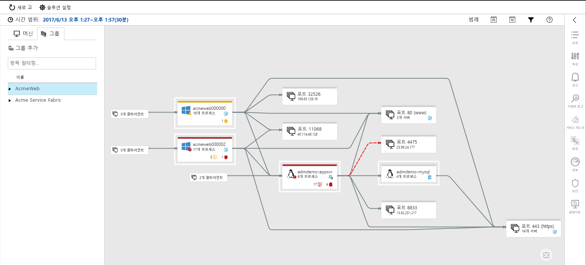

### <a name="creating-a-machine-group"></a>컴퓨터 그룹 만들기
그룹을 만들려면 컴퓨터 목록에서 원하는 컴퓨터를 선택하고 **그룹에 추가**를 클릭합니다.

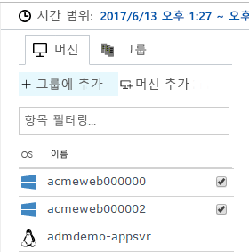

여기서 **새로 만들기**를 선택하고 그룹에 이름을 지정할 수 있습니다.

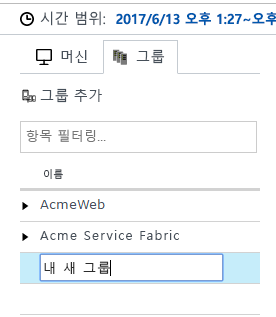

>[!NOTE]
>머신 그룹은 10개 서버로 제한됩니다.

### <a name="viewing-a-group"></a>그룹 보기
그룹을 만들고 나면 그룹 탭을 선택하여 해당 그룹을 볼 수 있습니다.

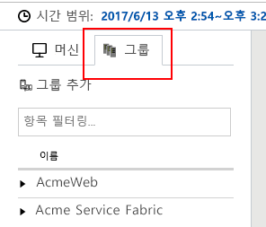

그런 다음 해당 컴퓨터 그룹에 대한 맵을 보려면 그룹 이름을 선택합니다.
 그룹에 속하는 컴퓨터는 맵에 흰색 윤곽이 표시됩니다.

그룹을 확장하면 컴퓨터 그룹을 구성하는 컴퓨터가 나열됩니다.

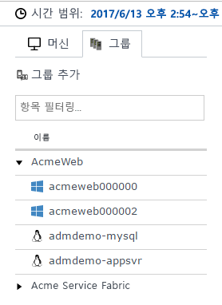

### <a name="filter-by-processes"></a>프로세스별 필터링
그룹의 모든 프로세스와 연결을 보여주는 맵 보기와 컴퓨터 그룹과 직접 관련된 프로세스와 연결만 보여주는 맵 보기 간에 토글할 수 있습니다.  기본 보기는 모든 프로세스를 표시하는 것입니다.  맵 위의 필터 아이콘을 클릭하면 보기를 변경할 수 있습니다.

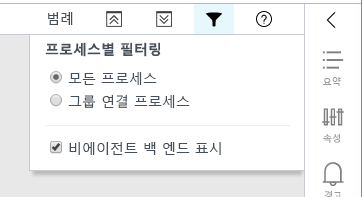

**모든 프로세스**를 선택하면 그룹의 각 컴퓨터에 있는 모든 프로세스와 연결이 맵에 포함됩니다.

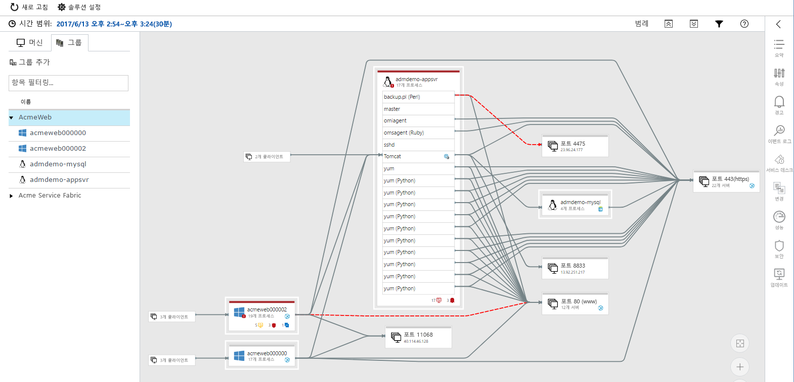

**그룹 연결 프로세스**만 표시하도록 보기를 변경하면 맵의 범위가 그룹의 다른 컴퓨터에 직접 연결된 프로세스 및 연결만으로 축소되어 단순 보기가 생성됩니다.

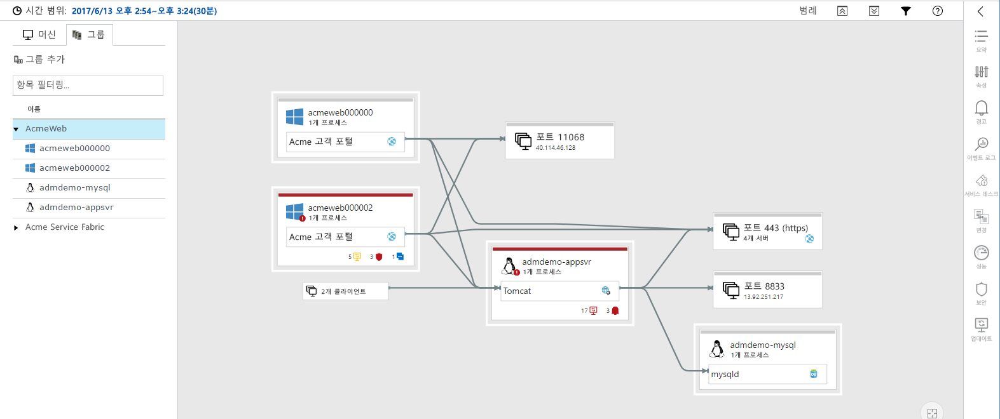
 
### <a name="adding-machines-to-a-group"></a>컴퓨터를 그룹에 추가
컴퓨터를 기존 그룹에 추가하려면, 원하는 컴퓨터 옆에 있는 상자를 선택한 다음 **그룹에 추가**를 클릭합니다.  그런 다음 컴퓨터를 추가할 그룹을 선택합니다.
 
### <a name="removing-machines-from-a-group"></a>컴퓨터를 그룹에서 제거
그룹 목록에서 그룹 이름을 확장하여 컴퓨터 그룹의 컴퓨터를 나열합니다.  그런 다음 제거할 컴퓨터 옆에 있는 줄임표 메뉴를 클릭하고 **제거**를 선택합니다.

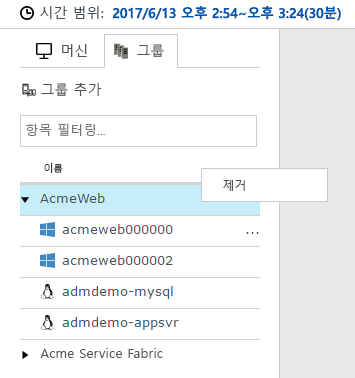

### <a name="removing-or-renaming-a-group"></a>그룹 제거 또는 이름 변경
그룹 목록에서 그룹 이름 옆에 있는 줄임표 메뉴를 클릭합니다.

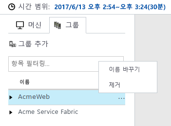


## <a name="role-icons"></a>역할 아이콘
특정 프로세스는 컴퓨터에서 웹 서버, 애플리케이션 서버, 데이터베이스 등과 같은 특정 역할을 담당합니다. 서비스 맵은 역할 아이콘이 있는 프로세스 및 컴퓨터 상자에 주석을 달아서 한 눈에 프로세스나 서버가 맡은 역할을 식별할 수 있습니다.

| 역할 아이콘 | 설명 |
|:--|:--|
|  | 웹 서버 |
|  | 애플리케이션 서버 |
|  | 데이터베이스 서버 |
|  | LDAP 서버 |
|  | SMB 서버 |

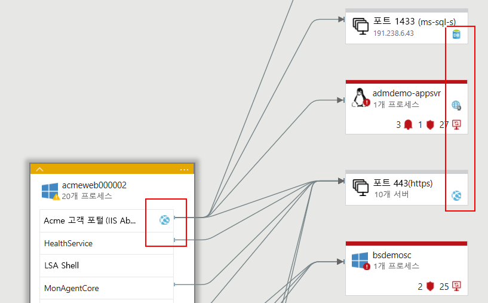


## <a name="failed-connections"></a>실패한 연결
실패한 연결은 프로세스 및 컴퓨터에 대한 서비스 맵에 표시됩니다. 이때 클라이언트 시스템이 프로세스 또는 포트에 도달할 수 없는 경우 빨간색 점선으로 표시됩니다. 실패한 연결은 시스템에서 실패한 연결을 시도하는 경우 서비스 맵 에이전트가 배포된 모든 시스템에서 보고됩니다. 서비스 맵은 연결 설정에 실패한 TCP 소켓을 관찰하여 이 프로세스를 측정합니다. 이러한 실패는 방화벽, 클라이언트 또는 서버의 잘못된 구성 또는 원격 서비스를 사용할 수 없기 때문에 발생할 수 있습니다.

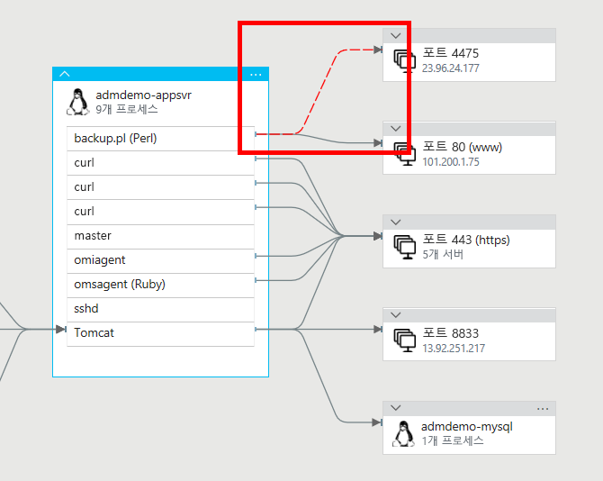

실패한 연결을 이해하면 문제 해결, 마이그레이션 유효성 검사, 보안 분석 및 전체 아키텍처를 이해하는 데 도움이 됩니다. 실패한 연결이 문제가 되지 않을 때도 있지만 갑자기 장애 조치(failover) 환경에 도달할 수 없거나 두 개의 애플리케이션 계층이 클라우드 마이그레이션 후 대화할 수 없는 등과 같은 문제를 직접적으로 나타내는 경우가 많습니다.

## <a name="client-groups"></a>클라이언트 그룹
클라이언트 그룹은 맵에서 종속성 에이전트가 없는 클라이언트 컴퓨터를 나타내는 상자입니다. 단일 클라이언트 그룹은 개별 프로세스 및 컴퓨터에 대한 클라이언트를 나타냅니다.

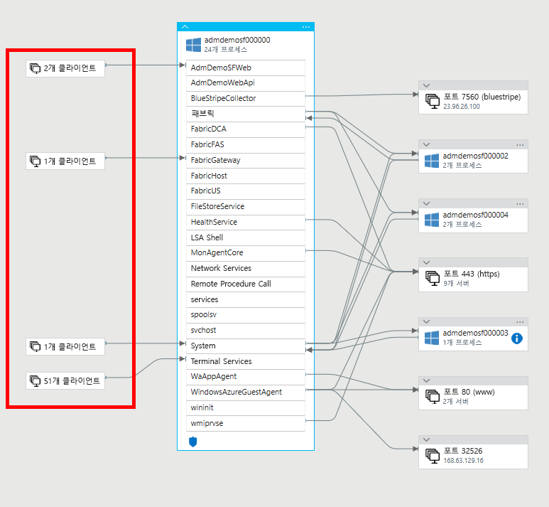

클라이언트 그룹의 서버 IP 주소를 확인하려면 그룹을 선택합니다. 그룹의 내용은 **클라이언트 그룹 속성** 창에 나열됩니다.

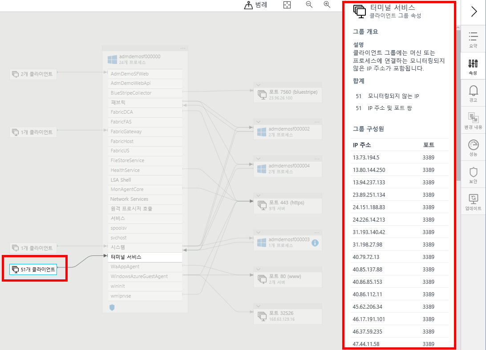

## <a name="server-port-groups"></a>서버 포트 그룹
서버 그룹은 종속성 에이전트가 없는 서버의 서버 포트를 나타내는 상자입니다. 이 상자에는 서버 포트와 이 포트에 연결된 서버 수가 표시됩니다. 개별 서버 및 연결을 보려면 상자를 확장합니다. 상자에 서버가 하나만 있으면 이름 또는 IP 주소가 나열됩니다.

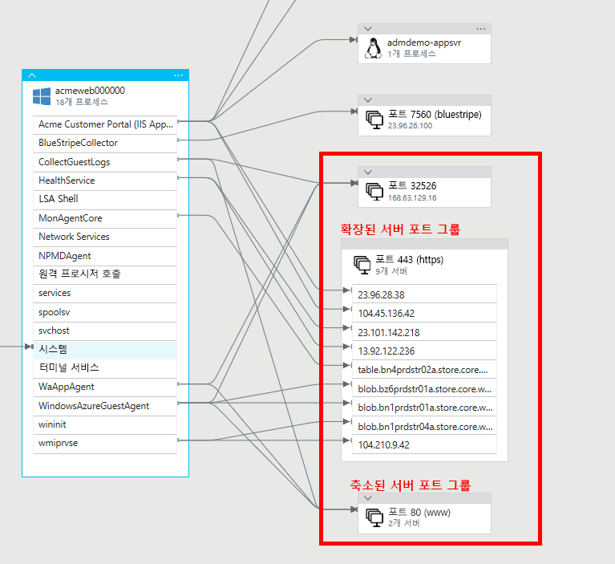

## <a name="context-menu"></a>상황에 맞는 메뉴
모든 서버의 오른쪽 위에 있는 줄임표(...)를 클릭하면 해당 서버의 상황에 맞는 메뉴가 표시됩니다.

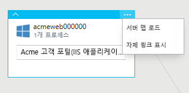

### <a name="load-server-map"></a>서버 맵 로드
**서버 맵 로드**를 클릭하면 선택한 서버가 새 포커스 컴퓨터인 새 맵으로 이동합니다.

### <a name="show-self-links"></a>자체 링크 표시
**자체 링크 표시**를 클릭하면 서버 내에서 프로세스를 시작 및 종료하는 TCP 연결에 해당하는 자체 링크를 포함하는 서버 노드가 다시 그려집니다. 셀프 링크가 표시되면 셀프 링크를 끌 수 있도록 메뉴 명령이 **자체 링크 숨기기**로 변경됩니다.

## <a name="computer-summary"></a>컴퓨터 요약
**컴퓨터 요약** 창에는 서버의 운영 체제 개요, 종속성 개수 및 다른 솔루션의 데이터가 포함됩니다. 이러한 데이터에는 성능 메트릭, 서비스 데스크 티켓, 변경 내용 추적, 보안 및 업데이트가 포함됩니다.

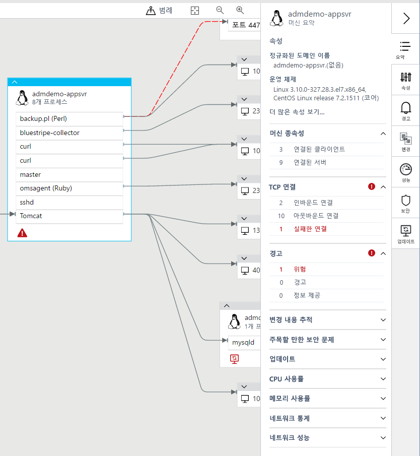

## <a name="computer-and-process-properties"></a>컴퓨터 및 프로세스 속성
서비스 맵을 탐색할 때 컴퓨터 및 프로세스를 선택하면 해당 속성에 대한 추가 컨텍스트를 얻을 수 있습니다. 컴퓨터는 DNS 이름, IPv4 주소, CPU 및 메모리 용량, VM 유형, 운영 체제 및 버전, 마지막 다시 부팅 시간, 해당 OMS 및 서비스 맵 에이전트의 ID에 대한 정보를 제공합니다.

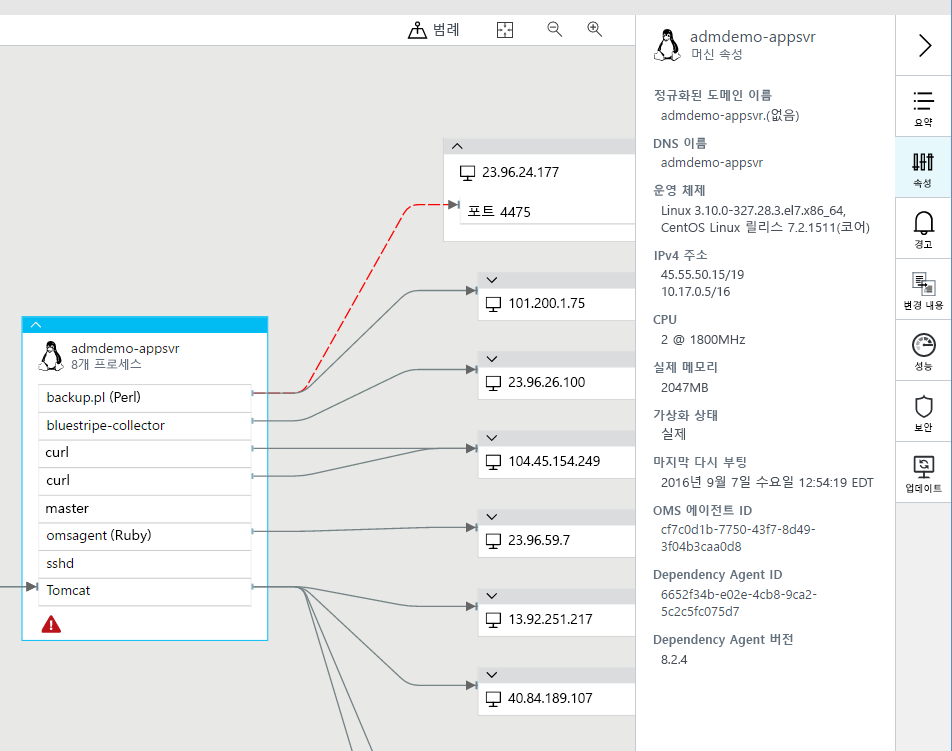

운영 체제 메타데이터에서 프로세스 이름, 프로세스 설명, 사용자 이름 및 도메인(Windows), 회사 이름, 제품 이름, 제품 버전, 작업 디렉터리, 명령줄 및 프로세스 시작 시간을 비롯한 실행 중인 프로세스에 대한 프로세스 정보를 수집할 수 있습니다.


**프로세스 요약** 패널은 프로세스의 연결에 대한 바인딩된 포트, 인바운드 및 아웃바운드 연결, 실패한 연결을 비롯한 추가 정보를 제공합니다.

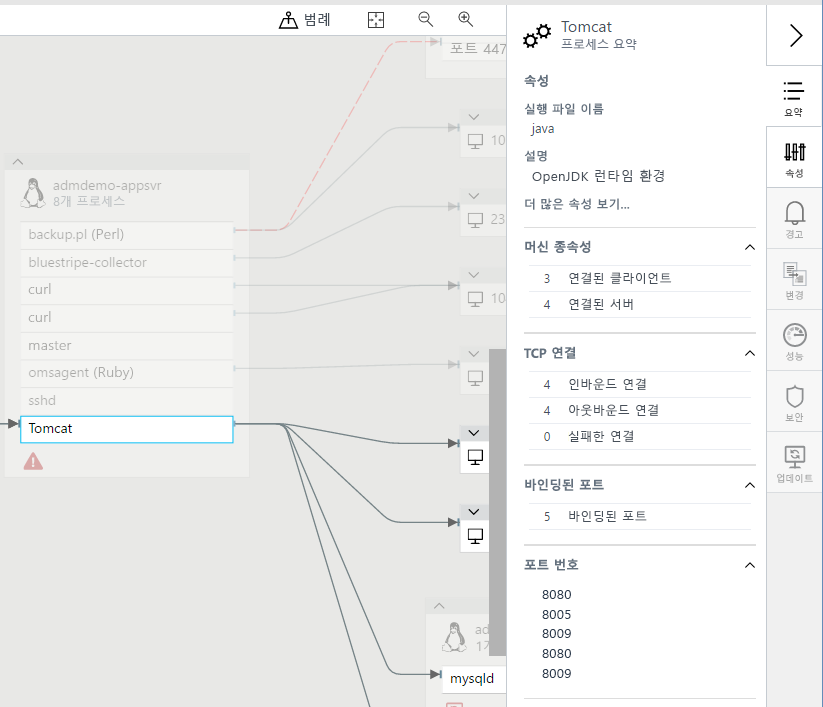

## <a name="alerts-integration"></a>경고 통합
서비스 맵은 Azure 경고와 통합되어 선택한 시간 범위에서 선택한 서버에 대해 발생된 경고를 표시합니다. 현재 경고가 있으면 서버에 아이콘이 표시되고 **컴퓨터 경고** 창에 경고가 나열됩니다.


서비스 맵에서 관련 경고를 표시하려면 특정 컴퓨터에 대해 실행되는 경고 규칙을 만듭니다. 적절한 경고를 만들려면
- 컴퓨터별로 그룹화할 절(예, **by Computer interval 1 minute**)을 포함합니다.
- 미터법을 기준으로 경고하도록 선택

## <a name="log-events-integration"></a>로그 이벤트 통합
서비스 맵은 로그 검색과 통합되어 선택한 시간 범위 내에서 선택한 서버에 대해 사용할 수 있는 모든 로그 이벤트의 개수를 표시합니다. 이벤트 수 목록의 행을 클릭하면 로그 검색으로 이동하고 개별 로그 이벤트를 볼 수 있습니다.

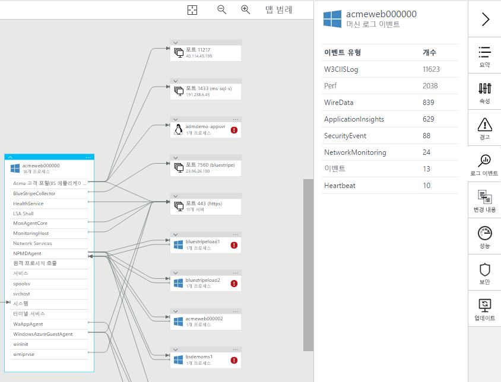

## <a name="service-desk-integration"></a>서비스 데스크 통합
IT 서비스 관리 커넥터와 서비스 맵 통합은 두 솔루션이 사용하도록 설정되고 Log Analytics 작업 영역에서 구성된 경우 자동입니다. 서비스 맵의 이러한 통합에는 "서비스 데스크" 레이블이 지정됩니다. 자세한 내용은 [IT Service Management Connector를 사용하여 ITSM 작업 항목을 중앙에서 관리](https://docs.microsoft.com/azure/log-analytics/log-analytics-itsmc-overview)를 참조하세요.

**컴퓨터 서비스 데스크** 창에는 선택한 시간 범위에서 선택한 서버에 대한 모든 IT 서비스 관리 이벤트 목록이 표시됩니다. 현재 항목이 있고 컴퓨터 서비스 데스크 창에 해당 항목이 나열되면 서버에 아이콘이 표시됩니다.

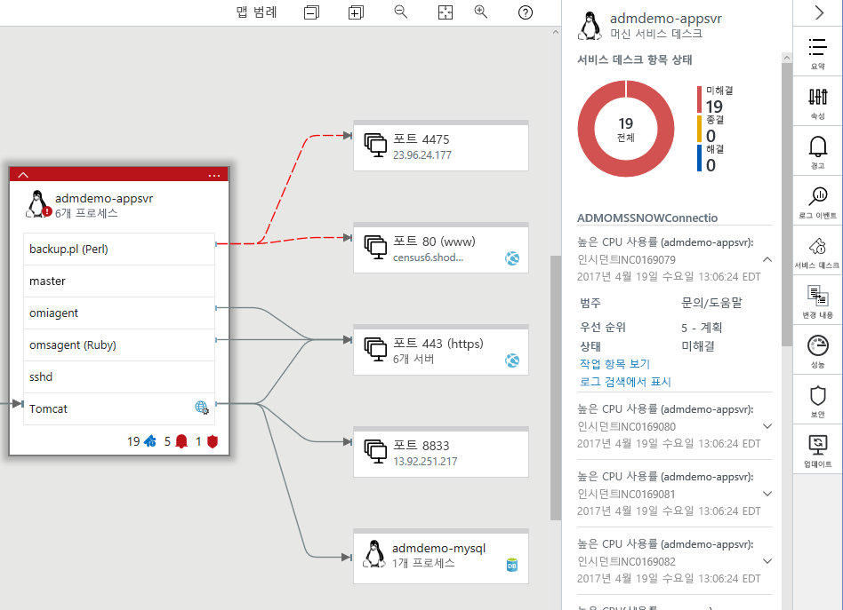

연결된 ITSM 솔루션에서 항목을 열려면 **작업 항목 보기**를 클릭합니다.

로그 검색에서 항목의 세부 정보를 보려면 **로그 검색에서 표시**를 클릭합니다.
연결 메트릭은 Log Analytics에서 두 개의 새 테이블에 작성됩니다. 

## <a name="change-tracking-integration"></a>변경 내용 추적 통합
변경 내용 추적과 서비스 맵 통합은 두 솔루션이 사용하도록 설정되고 Log Analytics 작업 영역에서 구성된 경우 자동입니다.

**컴퓨터 변경 내용 추적** 창에 로그 검색의 추가 정보를 드릴다운 수 있는 링크와 함께 모든 변경 내용이 최근 순으로 표시됩니다.

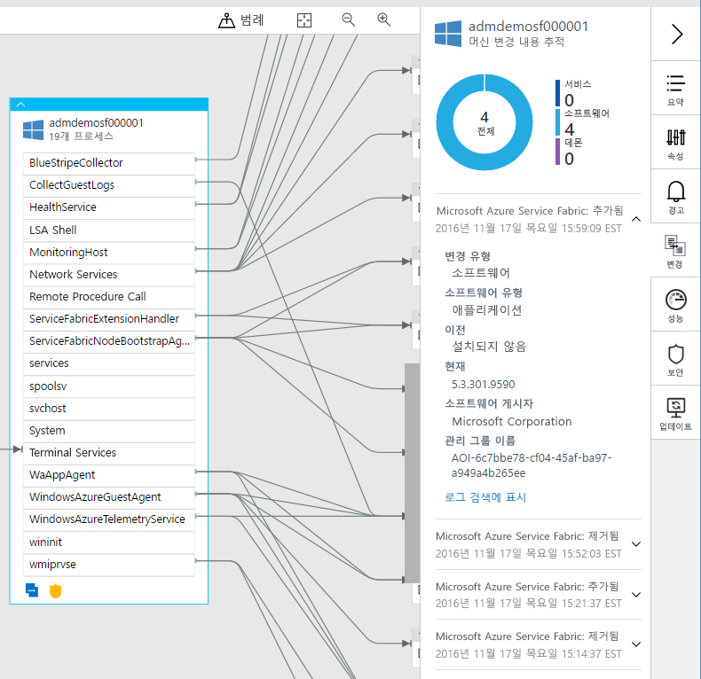

다음 이미지는 **Log Analytics에 표시**를 선택한 후 볼 수 있는 ConfigurationChange 이벤트의 자세히 보기입니다.

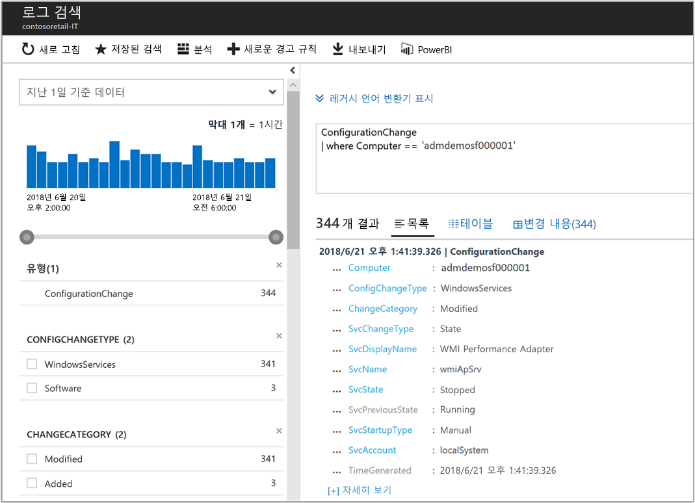

## <a name="performance-integration"></a>성능 통합
**컴퓨터 성능** 창에는 선택한 서버에 대한 표준 성능 메트릭이 표시됩니다. 메트릭에는 CPU 사용률, 메모리 사용률, 보내고 받은 네트워크 바이트 수 및 보내고 받은 네트워크 바이트 수에 따른 상위 프로세스 목록이 포함됩니다.

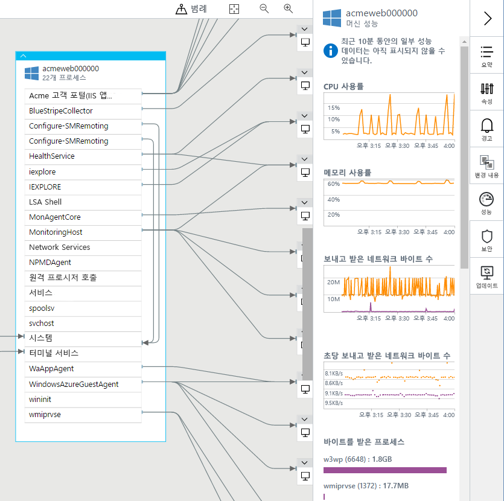

성능 데이터를 보려면 [적절한 Log Analytics 성능 카운터를 사용하도록 설정](https://docs.microsoft.com/azure/log-analytics/log-analytics-data-sources-performance-counters)해야 할 수 있습니다.  사용하도록 설정할 카운터는 다음과 같습니다.

Windows:
- Processor(*)\\% Processor Time
- Memory\\% Committed Bytes In Use
- Network Adapter(*)\\Bytes Sent/sec
- Network Adapter(*)\\Bytes Received/sec

Linux:
- Processor(*)\\% Processor Time
- Memory(*)\\% Used Memory
- Network Adapter(*)\\Bytes Sent/sec
- Network Adapter(*)\\Bytes Received/sec

네트워크 성능 데이터를 가져오려면 작업 영역에서 Wire Data 2.0 솔루션도 사용하도록 설정해야 합니다.
 
## <a name="security-integration"></a>보안 통합
보안 및 감사와 서비스 맵 통합은 두 솔루션이 사용하도록 설정되고 Log Analytics 작업 영역에서 구성된 경우 자동입니다.

**컴퓨터 보안** 창에는 선택한 서버에 대한 보안 및 감사 솔루션의 데이터가 표시됩니다. 이 창에는 선택한 기간 동안 서버의 보안 문제에 대한 요약이 나열됩니다. 보안 문제를 클릭하면 보안 문제에 대한 세부 내용을 표시하는 로그 검색으로 드릴다운됩니다.

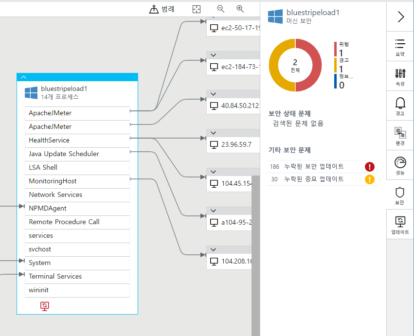

## <a name="updates-integration"></a>업데이트 통합
업데이트 관리 및 서비스 맵 솔루션은 Log Analytics 작업 영역에서 모두 사용하도록 설정되어 있고 구성되어 있으면 자동으로 통합됩니다.

**컴퓨터 업데이트** 창에는 선택한 서버에 대한 업데이트 관리 솔루션의 데이터가 표시됩니다. 이 창에는 선택한 시간 범위 동안 서버에서 누락된 업데이트에 대한 요약이 나열됩니다.

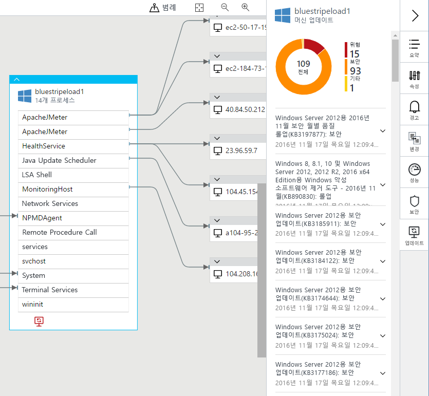

## <a name="log-analytics-records"></a>Log Analytics 레코드
서비스 맵 컴퓨터 및 프로세스 인벤토리 데이터는 Log Analytics에서 [검색](../../azure-monitor/log-query/log-query-overview.md)할 수 있습니다. 마이그레이션 계획, 용량 분석, 검색 및 주문형 성능 문제 해결을 포함하는 시나리오에 이 데이터를 적용할 수 있습니다.

프로세스 또는 컴퓨터가 시작되거나 서비스 맵에 등록된 경우 생성되는 레코드 외에도 고유한 각 컴퓨터 및 프로세스에 대해 시간당 하나의 레코드가 생성됩니다. 이러한 레코드는 다음 표의 속성을 가집니다. ServiceMapComputer_CL 이벤트의 필드 및 값은 ServiceMap Azure Resource Manager API의 컴퓨터 리소스 필드에 매핑됩니다. ServiceMapProcess_CL 이벤트의 필드 및 값은 ServiceMap Azure Resource Manager API의 프로세스 리소스 필드에 매핑됩니다. ResourceName_s 필드는 해당하는 Resource Manager 리소스의 이름 필드와 일치합니다. 

>[!NOTE]
>서비스 맵 기능이 확장되면 이러한 필드도 변경될 수 있습니다.

고유한 프로세스 및 컴퓨터를 식별하는 데 사용할 수 있는 내부적으로 생성된 속성이 있습니다.

- 컴퓨터: *ResourceId* 또는 *ResourceName_s*를 사용하여 Log Analytics 작업 영역 내에서 컴퓨터를 고유하게 식별합니다.
- 프로세스: *ResourceId*를 사용하여 Log Analytics 작업 영역 내에서 프로세스를 고유하게 식별합니다. *ResourceName_s*는 프로세스가 실행 중인 머신(MachineResourceName_s)의 컨텍스트 내에서 고유합니다. 

지정된 시간 범위 내에서 지정된 프로세스 및 컴퓨터에 대해 여러 레코드가 존재할 수 있으므로 쿼리는 동일한 컴퓨터 또는 프로세스에 대해 둘 이상의 레코드를 반환할 수 있습니다. 가장 최근 레코드만 포함하려면 쿼리에 "| dedup ResourceId"를 추가합니다.

### <a name="connections"></a>연결
연결 메트릭은 Log Analytics - VMConnection에서 새 테이블에 작성됩니다. 이 테이블은 머신에 대한 연결 관련 정보를 제공합니다(인바운드 및 아웃바운드). 또한 연결 메트릭은 해당 기간 동안 특정 메트릭을 가져올 수 있는 방법을 제공하는 API를 사용하여 노출됩니다.  수신 대기 소켓에서의 *수락*으로 인해 발생한 TCP 연결은 인바운드되는 반면, 지정된 IP 및 포트로 *연결*되면서 생성된 연결은 아웃바운드됩니다. 연결의 방향은 **인바운드** 또는 **아웃바운드** 중 하나로 설정할 수 있는 Direction 속성으로 표현됩니다. 

이러한 테이블의 레코드는 종속성 에이전트에서 보고된 데이터에서 생성됩니다. 모든 레코드는 1분 간격의 관찰을 나타냅니다. TimeGenerated 속성은 시간 간격의 시작을 나타냅니다. 각 레코드에는 각 엔터티를 식별하는 정보가 있습니다. 즉, 해당 엔터티에 연결된 메트릭과 함께 연결 또는 포트를 포함합니다. 현재 IPv4를 통해 TCP를 사용하여 발생하는 네트워크 활동만 보고됩니다.

비용 및 복잡성을 관리하기 위해 연결 레코드는 개별 물리적 네트워크 연결을 나타내지 않습니다. 여러 물리적 네트워크 연결은 논리적 연결로 그룹화됩니다. 그런 다음, 각 테이블에 반영됩니다.  즉, *VMConnection* 테이블의 레코드는 관찰되는 개별 물리적 연결이 아닌 논리적 그룹화를 나타냅니다. 지정된 1분 간격 동안 다음 특성에 대해 동일한 값을 공유하는 물리적 네트워크 연결이 *VMConnection*의 단일 논리적 레코드에 집계됩니다. 

| 자산 | 설명 |
|:--|:--|
| `Direction` |연결 방향으로 값은 *인바운드* 또는 *아웃바운드*입니다. |
| `Machine` |컴퓨터 FQDN |
| `Process` |연결을 시작/수락하는 프로세스 또는 프로세스 그룹의 ID입니다. |
| `SourceIp` |원본의 IP 주소 |
| `DestinationIp` |대상의 IP 주소 |
| `DestinationPort` |대상의 포트 번호 |
| `Protocol` |연결에 사용되는 프로토콜입니다.  값은 *tcp*입니다. |

그룹화의 영향을 고려하기 위해 그룹화된 물리적 연결 수에 대한 정보가 다음과 같은 레코드 속성에서 제공됩니다.

| 자산 | 설명 |
|:--|:--|
| `LinksEstablished` |보고 기간 동안 설정된 물리적 네트워크 연결의 수 |
| `LinksTerminated` |보고 기간 동안 종료된 물리적 네트워크 연결의 수 |
| `LinksFailed` |보고 기간 동안 실패한 물리적 네트워크 연결의 수. 이 정보는 현재 아웃바운드 연결에 대해서만 사용할 수 있습니다. |
| `LinksLive` |보고 기간의 마지막에 시작된 물리적 네트워크 연결의 수|

#### <a name="metrics"></a>메트릭

연결 수 메트릭 외에도 지정된 논리적 연결 또는 네트워크 포트에 전송 및 수신된 데이터의 볼륨에 대한 정보도 다음과 같은 레코드 속성에 포함됩니다.

| 자산 | 설명 |
|:--|:--|
| `BytesSent` |보고 기간 동안 전송된 총 바이트 수 |
| `BytesReceived` |보고 기간 동안 수신된 총 바이트 수 |
| `Responses` |보고 기간 동안 관찰된 응답의 수 
| `ResponseTimeMax` |보고 기간 동안 관찰된 최대 응답 시간(밀리초).  값이 없는 경우 속성은 비어 있습니다.|
| `ResponseTimeMin` |보고 기간 동안 관찰된 최소 응답 시간(밀리초).  값이 없는 경우 속성은 비어 있습니다.|
| `ResponseTimeSum` |보고 기간 동안 관찰된 모든 응답 시간의 합계(밀리초).  값이 없는 경우 속성은 비어 있습니다.|

보고할 데이터의 세 번째 형식은 호출자가 원격 엔드포인트에서 처리 및 응답할 연결을 통해 전송된 요청을 대기하는 데 걸리는 시간인 응답 시간입니다. 보고된 응답 시간은 기본 애플리케이션 프로토콜의 true 응답 시간에 대한 추정치입니다. 물리적 네트워크 연결의 원본 및 대상 끝 사이의 데이터 흐름을 관찰하여 그에 따른 추론 방식을 사용하여 계산됩니다. 개념적으로는 발신자가 요청의 마지막 바이트를 보낸 시간과 응답의 마지막 바이트가 다시 도착할 때의 시간 사이에는 차이가 있습니다. 이러한 두 타임스탬프는 지정된 물리적 연결에서 요청 및 응답 이벤트를 설명하는 데 사용됩니다. 그 차이는 단일 요청의 응답 시간을 나타냅니다. 

이 기능의 이 첫 번째 릴리스에서 해당 알고리즘은 지정된 네트워크 연결에 사용된 실제 애플리케이션 프로토콜에 따라 각기 다른 성공도로 작동할 수도 있는 근사값입니다. 예를 들어, 현재 접근 방식은 HTTP(S)와 같은 프로토콜 기반 요청-응답에는 적합하지만, 단방향 또는 메시지 큐 기반 프로토콜에는 작동하지 않습니다.

고려할 몇 가지 중요한 사항은 다음과 같습니다.

1. 프로세스가 동일한 IP 주소에 있지만 여러 네트워크 인터페이스를 통한 연결을 허용하는 경우 각 인터페이스에 대한 별도 레코드가 보고됩니다. 
2. 와일드카드 IP를 사용한 레코드에는 활동이 포함되지 않습니다. 해당 레코드는 머신에 있는 포트가 인바운드 트래픽에 대해 열려있음을 나타내기 위해 포함됩니다.
3. 자세한 정도 및 데이터 볼륨을 줄이기 위해 와일드카드 IP를 사용한 레코드는 특정 IP 주소와 일치하는 레코드(동일한 프로세스, 포트 및 프로토콜에 대해)가 있는 경우 생략됩니다. 와일드카드 IP 레코드가 생략되면 포트가 보고한 머신의 모든 인터페이스에서 노출됨을 나타내기 위해 특정 IP 주소를 가진 IsWildcardBind 레코드 속성이 “True”로 설정됩니다.
4. 특정 인터페이스에서만 바인딩된 포트는 IsWildcardBind가 “False”로 설정되어 있습니다.

#### <a name="naming-and-classification"></a>이름 지정 및 분류
편의를 위해 연결의 원격 끝 IP 주소는 RemoteIp 속성에 포함됩니다. 인바운드 연결의 경우 RemoteIp는 SourceIp와 동일하고, 아웃바운드 연결의 경우 DestinationIp와 동일합니다. RemoteDnsCanonicalNames 속성은 RemoteIp에 대한 머신에서 보고된 DNS 정식 이름을 나타냅니다. 나중에 사용하기 위해 RemoteDnsQuestions 및 RemoteClassification 속성이 예약되어 있습니다. 

#### <a name="geolocation"></a>지리적 위치
또한 *VMConnection*은 다음과 같은 레코드 속성에서 각 연결 레코드의 원격 끝에 대한 지리적 위치 정보를 포함합니다. 

| 자산 | 설명 |
|:--|:--|
| `RemoteCountry` |RemoteIp 호스팅 국가/지역의 이름입니다.  예: *United States* |
| `RemoteLatitude` |지리적 위치 위도입니다.  예: *47.68* |
| `RemoteLongitude` |지리적 위치 경도입니다.  예: *-122.12* |

#### <a name="malicious-ip"></a>악성 IP
*VMConnection* 테이블의 모든 RemoteIp 속성을 알려진 악의적인 활동의 IP 집합에 대해 검사합니다. RemoteIp가 악성으로 식별되면 다음과 같은 속성이 다음과 같은 레코드 속성에서 채워집니다(IP가 악성으로 간주되지 않으면 비어 있음).

| 자산 | 설명 |
|:--|:--|
| `MaliciousIp` |RemoteIp 주소 |
| `IndicatorThreadType` |검색된 위협 표시기가 *Botnet*, *C2*, *CryptoMining*, *Darknet*, *DDos*, *MaliciousUrl*, *Malware*, *Phishing*, *Proxy*, *PUA*, *Watchlist* 값 중 하나입니다.   |
| `Description` |관찰된 위협에 대한 설명입니다. |
| `TLPLevel` |TLP(Traffic Light Protocol) 수준은 정의된 *White*, *Green*, *Amber*, *Red* 값 중 하나입니다. |
| `Confidence` |값은 *0 - 100*입니다. |
| `Severity` |값은 *0 - 5*입니다. 여기서 *5*는 가장 심각하고 *0*은 심각하지 않습니다. 기본값은 *3*입니다.  |
| `FirstReportedDateTime` |공급자가 표시기를 처음 보고한 시간입니다. |
| `LastReportedDateTime` |표시기가 Interflow에 의해 마지막으로 확인된 시간입니다. |
| `IsActive` |표시기가 *True* 또는 *False* 값으로 비활성화되었음을 나타냅니다. |
| `ReportReferenceLink` |지정된 관찰 가능 개체와 관련된 보고서의 링크입니다. |
| `AdditionalInformation` |관찰된 위협에 대한 추가 정보(해당되는 경우)를 제공합니다. |

### <a name="servicemapcomputercl-records"></a>ServiceMapComputer_CL 레코드
*ServiceMapComputer_CL* 형식의 레코드는 서비스 맵 에이전트가 있는 서버에 대한 인벤토리 데이터를 포함합니다. 이러한 레코드는 다음 표의 속성을 가집니다.

| 자산 | 설명 |
|:--|:--|
| `Type` | *ServiceMapComputer_CL* |
| `SourceSystem` | *OpsManager* |
| `ResourceId` | 작업 영역 내 컴퓨터에 대한 고유 식별자 |
| `ResourceName_s` | 작업 영역 내 컴퓨터에 대한 고유 식별자 |
| `ComputerName_s` | 컴퓨터 FQDN |
| `Ipv4Addresses_s` | 서버의 IPv4 주소 목록 |
| `Ipv6Addresses_s` | 서버의 IPv6 주소 목록 |
| `DnsNames_s` | DNS 이름 배열 |
| `OperatingSystemFamily_s` | Windows 또는 Linux |
| `OperatingSystemFullName_s` | 운영 체제의 전체 이름  |
| `Bitness_s` | 컴퓨터의 비트(32비트 또는 64비트)  |
| `PhysicalMemory_d` | 실제 메모리(MB) |
| `Cpus_d` | CPU 수 |
| `CpuSpeed_d` | CPU 속도(MHz)|
| `VirtualizationState_s` | *unknown*, *physical*, *virtual*, *hypervisor* |
| `VirtualMachineType_s` | *hyperv*, *vmware* 등 |
| `VirtualMachineNativeMachineId_g` | 해당 하이퍼바이저에 의해 할당된 VM ID |
| `VirtualMachineName_s` | VM 이름 |
| `BootTime_t` | 부팅 시간 |

### <a name="servicemapprocesscl-type-records"></a>ServiceMapProcess_CL 형식 레코드
*ServiceMapProcess_CL* 형식의 레코드는 서비스 맵 에이전트가 있는 서버에서 TCP 연결 프로세스에 대한 인벤토리 데이터를 포함합니다. 이러한 레코드는 다음 표의 속성을 가집니다.

| 자산 | 설명 |
|:--|:--|
| `Type` | *ServiceMapProcess_CL* |
| `SourceSystem` | *OpsManager* |
| `ResourceId` | 작업 영역 내 프로세스에 대한 고유 식별자 |
| `ResourceName_s` | 프로세스를 실행 중인 컴퓨터 내의 프로세스에 대한 고유 식별자|
| `MachineResourceName_s` | 컴퓨터의 리소스 이름 |
| `ExecutableName_s` | 프로세스 실행 파일의 이름 |
| `StartTime_t` | 프로세스 풀 시작 시간 |
| `FirstPid_d` | 프로세스 풀의 첫 번째 PID |
| `Description_s` | 프로세스 설명 |
| `CompanyName_s` | 회사의 이름 |
| `InternalName_s` | 내부 이름 |
| `ProductName_s` | 제품 이름 |
| `ProductVersion_s` | 제품 버전 |
| `FileVersion_s` | 파일 버전 |
| `CommandLine_s` | 명령줄 |
| `ExecutablePath _s` | 실행 파일 경로 |
| `WorkingDirectory_s` | 작업 디렉터리 |
| `UserName` | 프로세스를 실행 중인 계정 |
| `UserDomain` | 프로세스를 실행 중인 도메인 |

## <a name="sample-log-searches"></a>샘플 로그 검색

### <a name="list-all-known-machines"></a>알려진 모든 컴퓨터 나열
ServiceMapComputer_CL | summarize arg_max(TimeGenerated, *) by ResourceId

### <a name="list-the-physical-memory-capacity-of-all-managed-computers"></a>모든 관리되는 컴퓨터의 실제 메모리 용량을 나열합니다.
ServiceMapComputer_CL | summarize arg_max(TimeGenerated, *) by ResourceId | project PhysicalMemory_d, ComputerName_s

### <a name="list-computer-name-dns-ip-and-os"></a>컴퓨터 이름, DNS, IP 및 OS를 나열합니다.
ServiceMapComputer_CL | summarize arg_max(TimeGenerated, *) by ResourceId | project ComputerName_s, OperatingSystemFullName_s, DnsNames_s, Ipv4Addresses_s

### <a name="find-all-processes-with-sql-in-the-command-line"></a>명령줄에서 "sql"로 모든 프로세스 찾기
ServiceMapProcess_CL | where CommandLine_s contains_cs "sql" | summarize arg_max(TimeGenerated, *) by ResourceId

### <a name="find-a-machine-most-recent-record-by-resource-name"></a>리소스 이름으로 컴퓨터(가장 최근 레코드) 찾기
search in (ServiceMapComputer_CL) "m-4b9c93f9-bc37-46df-b43c-899ba829e07b" | summarize arg_max(TimeGenerated, *) by ResourceId

### <a name="find-a-machine-most-recent-record-by-ip-address"></a>IP 주소로 컴퓨터(가장 최근 레코드) 찾기
search in (ServiceMapComputer_CL) "10.229.243.232" | summarize arg_max(TimeGenerated, *) by ResourceId

### <a name="list-all-known-processes-on-a-specified-machine"></a>특정 컴퓨터의 알려진 프로세스 모두 나열
ServiceMapProcess_CL | where MachineResourceName_s == "m-559dbcd8-3130-454d-8d1d-f624e57961bc" | summarize arg_max(TimeGenerated, *) by ResourceId

### <a name="list-all-computers-running-sql"></a>SQL을 실행하는 모든 컴퓨터를 나열합니다.
ServiceMapComputer_CL | where ResourceName_s in ((search in (ServiceMapProcess_CL) "\*sql\*" | distinct MachineResourceName_s)) | distinct ComputerName_s

### <a name="list-all-unique-product-versions-of-curl-in-my-datacenter"></a>내 데이터 센터에서 curl의 고유한 제품 버전 모두 나열
ServiceMapProcess_CL | where ExecutableName_s == "curl" | distinct ProductVersion_s

### <a name="create-a-computer-group-of-all-computers-running-centos"></a>CentOS를 실행하는 모든 컴퓨터의 컴퓨터 그룹 만들기
ServiceMapComputer_CL | where OperatingSystemFullName_s contains_cs "CentOS" | distinct ComputerName_s

### <a name="summarize-the-outbound-connections-from-a-group-of-machines"></a>머신 그룹에서 아웃바운드 연결 요약
```
// the machines of interest
let machines = datatable(m: string) ["m-82412a7a-6a32-45a9-a8d6-538354224a25"];
// map of ip to monitored machine in the environment
let ips=materialize(ServiceMapComputer_CL
| summarize ips=makeset(todynamic(Ipv4Addresses_s)) by MonitoredMachine=ResourceName_s
| mvexpand ips to typeof(string));
// all connections to/from the machines of interest
let out=materialize(VMConnection
| where Machine in (machines)
| summarize arg_max(TimeGenerated, *) by ConnectionId);
// connections to localhost augmented with RemoteMachine
let local=out
| where RemoteIp startswith "127."
| project ConnectionId, Direction, Machine, Process, ProcessName, SourceIp, DestinationIp, DestinationPort, Protocol, RemoteIp, RemoteMachine=Machine;
// connections not to localhost augmented with RemoteMachine
let remote=materialize(out
| where RemoteIp !startswith "127."
| join kind=leftouter (ips) on $left.RemoteIp == $right.ips
| summarize by ConnectionId, Direction, Machine, Process, ProcessName, SourceIp, DestinationIp, DestinationPort, Protocol, RemoteIp, RemoteMachine=MonitoredMachine);
// the remote machines to/from which we have connections
let remoteMachines = remote | summarize by RemoteMachine;
// all augmented connections
(local)
| union (remote)
//Take all outbound records but only inbound records that come from either //unmonitored machines or monitored machines not in the set for which we are computing dependencies.
| where Direction == 'outbound' or (Direction == 'inbound' and RemoteMachine !in (machines))
| summarize by ConnectionId, Direction, Machine, Process, ProcessName, SourceIp, DestinationIp, DestinationPort, Protocol, RemoteIp, RemoteMachine
// identify the remote port
| extend RemotePort=iff(Direction == 'outbound', DestinationPort, 0)
// construct the join key we'll use to find a matching port
| extend JoinKey=strcat_delim(':', RemoteMachine, RemoteIp, RemotePort, Protocol)
// find a matching port
| join kind=leftouter (VMBoundPort 
| where Machine in (remoteMachines) 
| summarize arg_max(TimeGenerated, *) by PortId 
| extend JoinKey=strcat_delim(':', Machine, Ip, Port, Protocol)) on JoinKey
// aggregate the remote information
| summarize Remote=makeset(iff(isempty(RemoteMachine), todynamic('{}'), pack('Machine', RemoteMachine, 'Process', Process1, 'ProcessName', ProcessName1))) by ConnectionId, Direction, Machine, Process, ProcessName, SourceIp, DestinationIp, DestinationPort, Protocol
```

## <a name="rest-api"></a>REST API
서비스 맵의 모든 서버, 프로세스 및 종속성 데이터는 [서비스 맵 REST API](https://docs.microsoft.com/rest/api/servicemap/)를 통해 사용할 수 있습니다.

## <a name="diagnostic-and-usage-data"></a>진단 및 사용 현황 데이터
Microsoft는 서비스 맵 서비스를 사용하여 사용 현황 및 성능 데이터를 자동으로 수집합니다. Microsoft는 이 데이터를 사용하여 서비스 맵 서비스의 품질, 보안 및 무결성을 제공 및 개선합니다. 정확하고 효율적인 문제 해결 기능을 제공하기 위해, 운영 체제 및 버전, IP 주소, DNS 이름 및 워크스테이션 이름과 같은 소프트웨어 구성 정보가 데이터에 포함됩니다. 이름, 주소 또는 기타 연락처 정보는 수집하지 않습니다.

데이터 수집 및 사용에 대한 자세한 내용은 [Microsoft Online Services 개인정보처리방침](https://go.microsoft.com/fwlink/?LinkId=512132)을 참조하세요.


## <a name="next-steps"></a>다음 단계
Log Analytics의 [로그 검색](../../azure-monitor/log-query/log-query-overview.md)에 대해 자세히 알아보고 서비스 맵이 수집한 데이터를 검색합니다.


## <a name="troubleshooting"></a>문제 해결
[서비스 맵 구성 문서의 문제 해결 섹션]( service-map-configure.md#troubleshooting)을 참조하세요.


## <a name="feedback"></a>사용자 의견
서비스 맵 또는 이 설명서에 대한 의견이 있습니까?  기능을 제안하거나 기존 제안에 투표할 수 있는 [사용자 의견 페이지](https://feedback.azure.com/forums/267889-log-analytics/category/184492-service-map)를 방문하세요.
