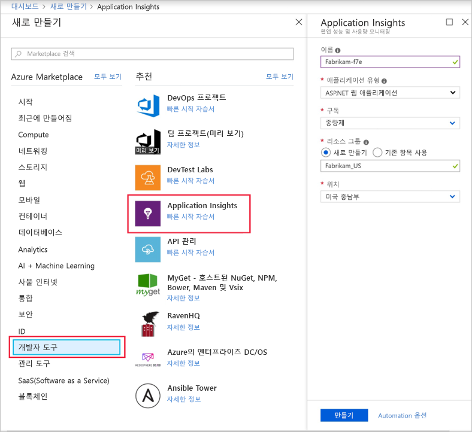
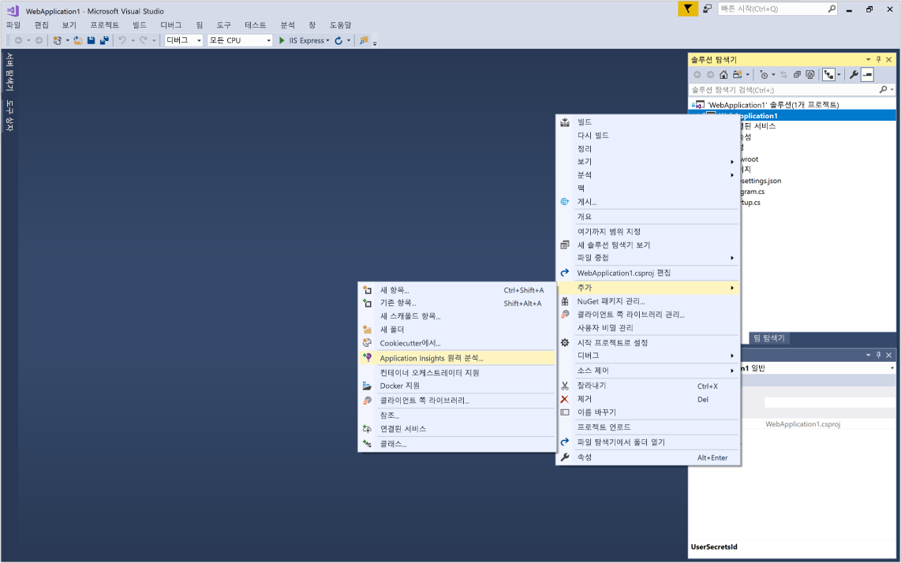
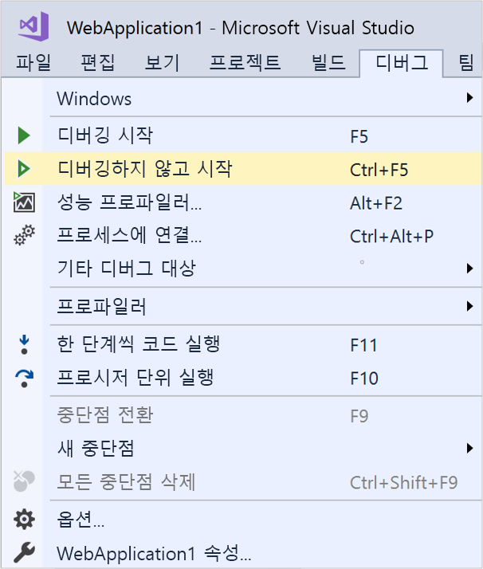
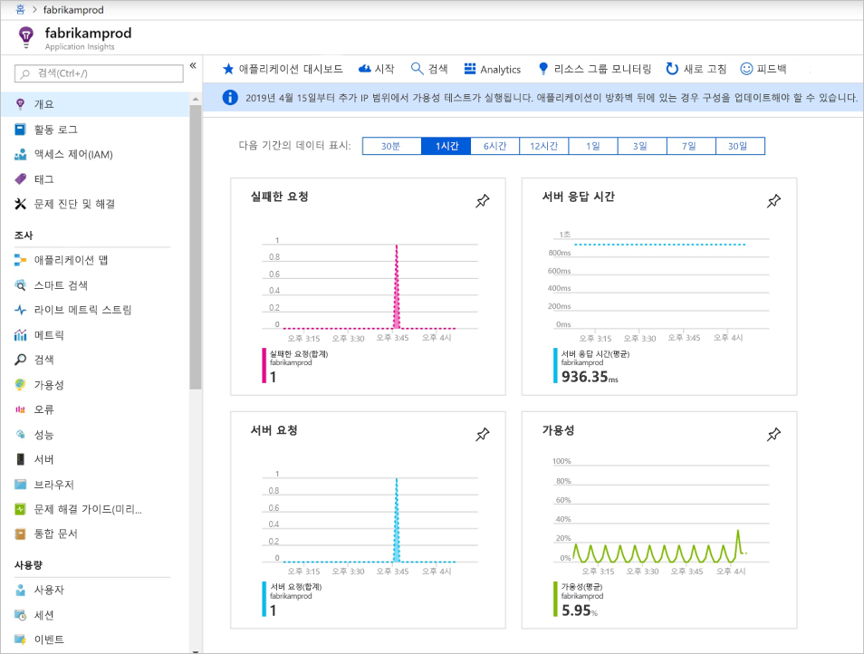
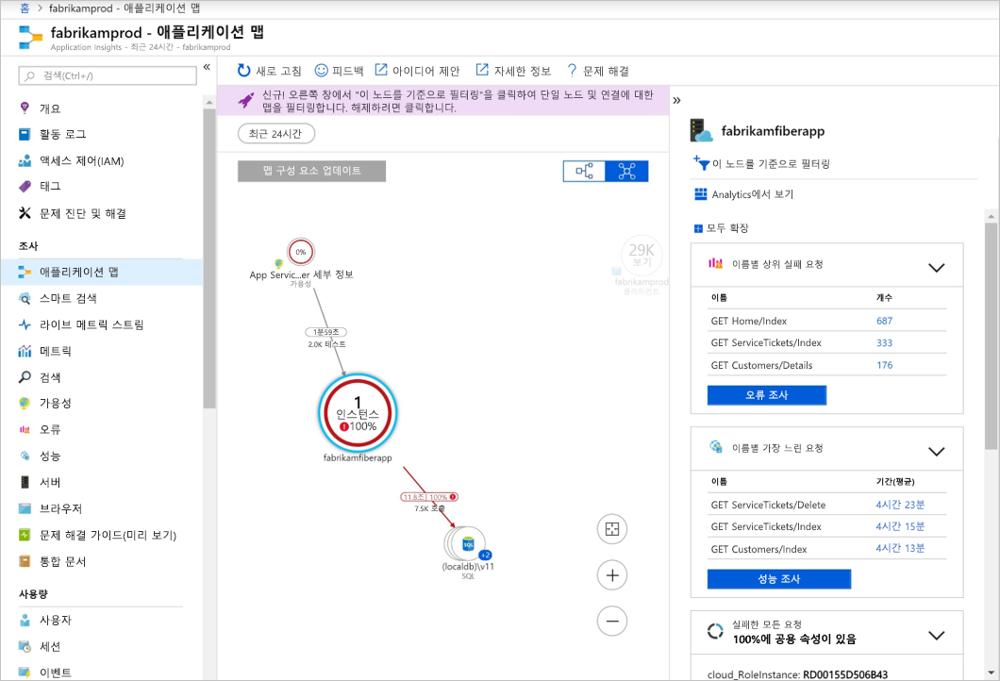
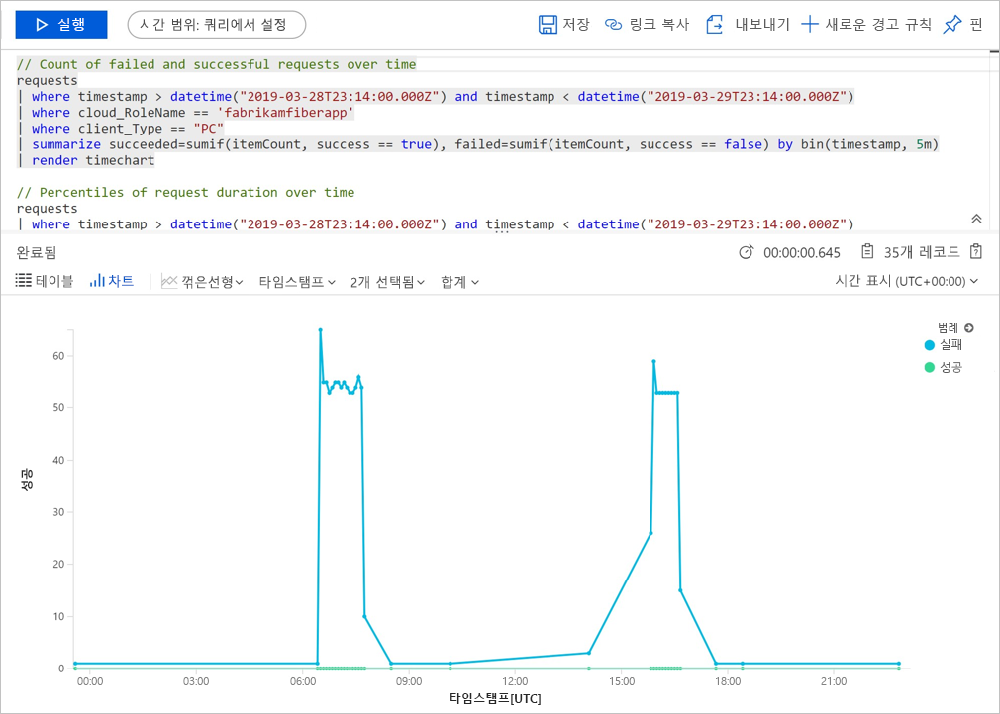
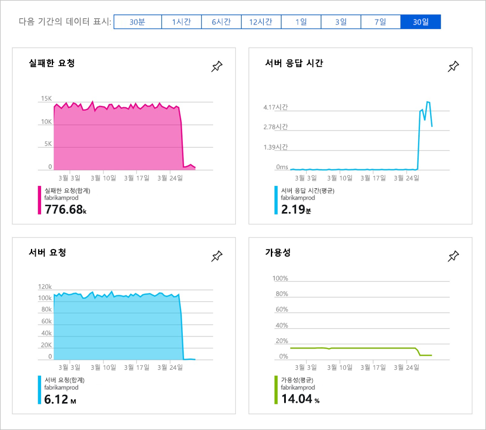

# <a name="start-monitoring-your-aspnet-core-web-application"></a>ASP.NET Core 웹 애플리케이션 모니터링 시작

Azure Application Insights를 사용하면 웹 애플리케이션의 가용성, 성능 및 사용량을 쉽게 모니터링할 수 있습니다. 또한 사용자가 보고할 때까지 기다리지 않고 애플리케이션의 오류를 빠르게 식별하고 진단할 수 있습니다. 

이 빠른 시작은 기존 ASP.NET Core 웹 애플리케이션에 Application Insights SDK를 추가하는 방법을 안내합니다. 

## <a name="prerequisites"></a>필수 조건

이 빠른 시작을 완료하려면 다음이 필요합니다.

- [Visual Studio 2017 설치](https://www.visualstudio.com/downloads/)(다음 워크로드 포함)
  - ASP.NET 및 웹 개발
  - Azure 개발
- [.NET Core SDK 2.0 설치](https://www.microsoft.com/net/core)
- Azure 구독 및 기존 .NET Core 웹 애플리케이션이 필요합니다.

ASP.NET Core 웹 애플리케이션이 없는 경우 단계별 가이드에 따라 [ASP.NET Core 앱을 만들고 Application Insights를 추가](../../azure-monitor/app/asp-net-core.md)할 수 있습니다.

Azure 구독이 아직 없는 경우 시작하기 전에 [체험](https://azure.microsoft.com/free/) 계정을 만듭니다.

## <a name="sign-in-to-the-azure-portal"></a>Azure Portal에 로그인

[Azure Portal](https://portal.azure.com/)에 로그인합니다.

## <a name="enable-application-insights"></a>Application Insights 사용

Application Insights는 온-프레미스 또는 클라우드에서 실행되는지 여부에 관계 없이 인터넷에 연결된 모든 애플리케이션에서 원격 분석 데이터를 수집할 수 있습니다. 이 데이터를 보기 시작하려면 다음 단계를 사용합니다.

1. **리소스 만들기** > **개발자 도구** > **Application Insights**를 선택합니다.

   

    구성 상자가 표시되면 다음 표를 사용하여 입력 필드를 채웁니다.

    | 설정        |  값           | 설명  |
   | ------------- |:-------------|:-----|
   | **Name**      | 전역적으로 고유한 값 | 모니터링하는 응용 프로그램을 식별하는 이름입니다. |
   | **애플리케이션 유형** | ASP.NET 웹 애플리케이션 | 모니터링하는 응용 프로그램의 유형입니다. |
   | **리소스 그룹**     | myResourceGroup      | Application Insights 데이터를 호스팅할 새 리소스 그룹의 이름입니다. |
   | **위치**: | 미국 동부 | 가까운 위치 또는 응용 프로그램이 호스팅되는 위치 근처를 선택합니다. |

2. **만들기**를 클릭합니다.

## <a name="configure-app-insights-sdk"></a>Application Insights SDK 구성

1. Visual Studio에서 ASP.NET Core 웹앱 **프로젝트**를 열고, **솔루션 탐색기**에서 응용 프로그램 이름을 마우스 오른쪽 단추로 클릭하고, **추가** > **Application Insights 원격 분석**을 차례로 선택합니다.

    

2. **시작** 단추 클릭

3. 계정 및 구독을 선택하고 > Azure Portal에서 만든 **기존 리소스**를 선택한 후 > **등록**을 클릭합니다.

4. **디버그** > **디버깅하지 않고 시작**(Ctrl+F5)을 선택하여 응용 프로그램을 시작합니다.

    

> [!NOTE]
> 데이터가 포털에 표시되려면 3-5분 정도 걸립니다. 이 응용 프로그램이 트래픽이 적은 테스트 앱인 경우 활성 요청이나 작업이 있을 때만 대부분의 메트릭이 캡처됩니다.

## <a name="start-monitoring-in-the-azure-portal"></a>Azure Portal에서 모니터링 시작

1. **홈**을 선택하여 Azure Portal에서 Application Insights **개요** 페이지를 다시 열고, 최근 리소스에서 이전에 생성한 리소스를 선택하여 현재 실행 중인 애플리케이션에 대한 세부 정보를 확인합니다.

   

2. 애플리케이션 구성 요소 간의 종속성 관계에 대한 시각적 레이아웃을 보려면 **애플리케이션 맵**을 클릭합니다. 각 구성 요소에는 로드, 성능, 오류 및 경고와 같은 KPI가 표시됩니다.

   

3. **앱 분석** 아이콘  **Analytics에서 보기**를 클릭합니다. 그러면 Application Insights에 의해 수집된 모든 데이터를 분석하기 위한 풍부한 쿼리 언어를 제공하는 **Application Insights Analytics**가 열립니다. 이 경우 요청 수를 차트로 렌더링하는 쿼리가 생성됩니다. 사용자 고유의 쿼리를 작성하여 다른 데이터를 분석할 수 있습니다.

   

4. **개요** 페이지로 돌아가서 KPI 대시보드를 검사합니다.  이 대시보드는 들어오는 요청의 수, 해당 요청의 기간 및 발생한 모든 오류를 포함하여 애플리케이션 상태에 대한 통계를 제공합니다. 

   

   **페이지 보기 로드 시간** 차트를 **클라이언트 쪽 원격 분석** 데이터로 채우도록 하려면 이 스크립트를 추적하려는 각 페이지에 추가합니다.

   ```HTML
   <!-- 
   To collect user behavior analytics about your application, 
   insert the following script into each page you want to track.
   Place this code immediately before the closing </head> tag,
   and before any other scripts. Your first data will appear 
   automatically in just a few seconds.
   -->
   <script type="text/javascript">
     var appInsights=window.appInsights||function(config){
       function i(config){t[config]=function(){var i=arguments;t.queue.push(function(){t[config].apply(t,i)})}}var t={config:config},u=document,e=window,o="script",s="AuthenticatedUserContext",h="start",c="stop",l="Track",a=l+"Event",v=l+"Page",y=u.createElement(o),r,f;y.src=config.url||"https://az416426.vo.msecnd.net/scripts/a/ai.0.js";u.getElementsByTagName(o)[0].parentNode.appendChild(y);try{t.cookie=u.cookie}catch(p){}for(t.queue=[],t.version="1.0",r=["Event","Exception","Metric","PageView","Trace","Dependency"];r.length;)i("track"+r.pop());return i("set"+s),i("clear"+s),i(h+a),i(c+a),i(h+v),i(c+v),i("flush"),config.disableExceptionTracking||(r="onerror",i("_"+r),f=e[r],e[r]=function(config,i,u,e,o){var s=f&&f(config,i,u,e,o);return s!==!0&&t["_"+r](config,i,u,e,o),s}),t
       }({
           instrumentationKey:"<insert instrumentation key>"
       });
       
       window.appInsights=appInsights;
       appInsights.trackPageView();
   </script>
   ```

5. 왼쪽에서 **메트릭**을 클릭합니다. 메트릭 탐색기를 사용하여 리소스의 상태 및 사용률을 조사합니다. **새 차트 추가**를 클릭하여 사용자 지정 보기를 추가로 만들거나, **편집**을 선택하여 기존 차트의 종류, 높이, 색상표, 그룹화 및 메트릭을 수정할 수 있습니다. 예를 들어 메트릭 드롭다운의 “브라우저 페이지 로드 시간”과 집계의 “Avg”를 선택하여 평균 브라우저 페이지 로드 시간을 표시하는 차트를 만들 수 있습니다. Azure 메트릭 탐색기에 대해 자세히 알아보려면 [Azure 메트릭 탐색기 시작](../../azure-monitor/platform/metrics-getting-started.md)을 방문하세요.

     

## <a name="clean-up-resources"></a>리소스 정리
테스트를 완료하면 리소스 그룹 및 모든 관련 리소스를 삭제할 수 있습니다. 이 작업을 수행하려면 다음 단계를 따르세요.

1. Azure Portal의 왼쪽 메뉴에서 **리소스 그룹**과 **myResourceGroup**을 차례로 클릭합니다.
2. 리소스 그룹 페이지에서 **삭제**를 클릭하고 텍스트 상자에 **myResourceGroup**을 입력한 후 **삭제**를 클릭합니다.

## <a name="next-steps"></a>다음 단계

> [!div class="nextstepaction"]
> [런타임 예외 찾기 및 진단](https://docs.microsoft.com/azure/application-insights/app-insights-tutorial-runtime-exceptions)
