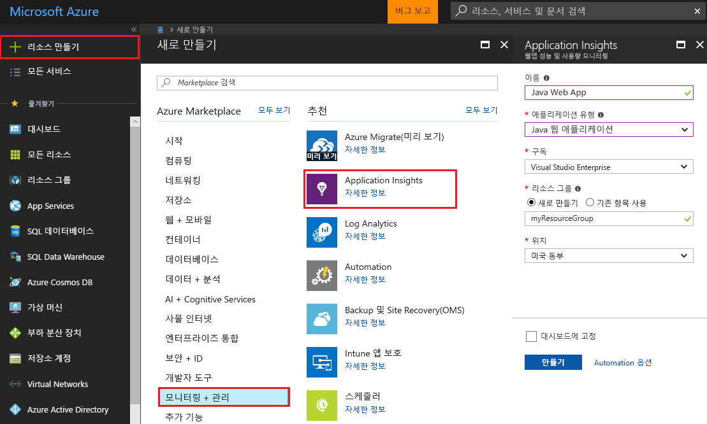
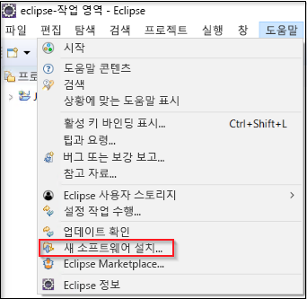
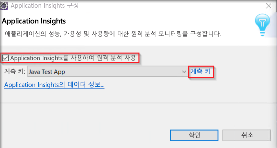
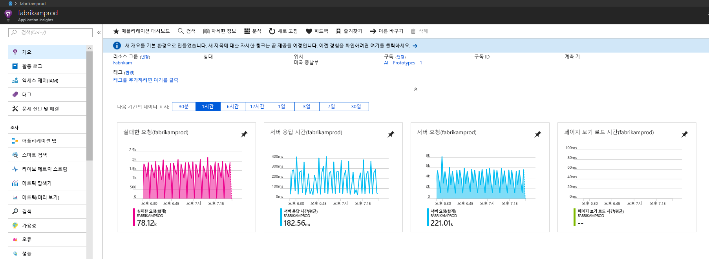
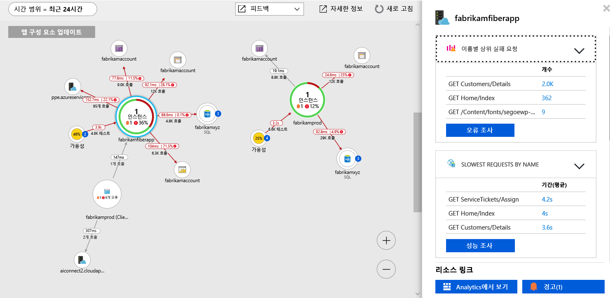
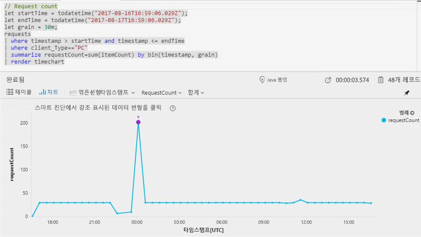
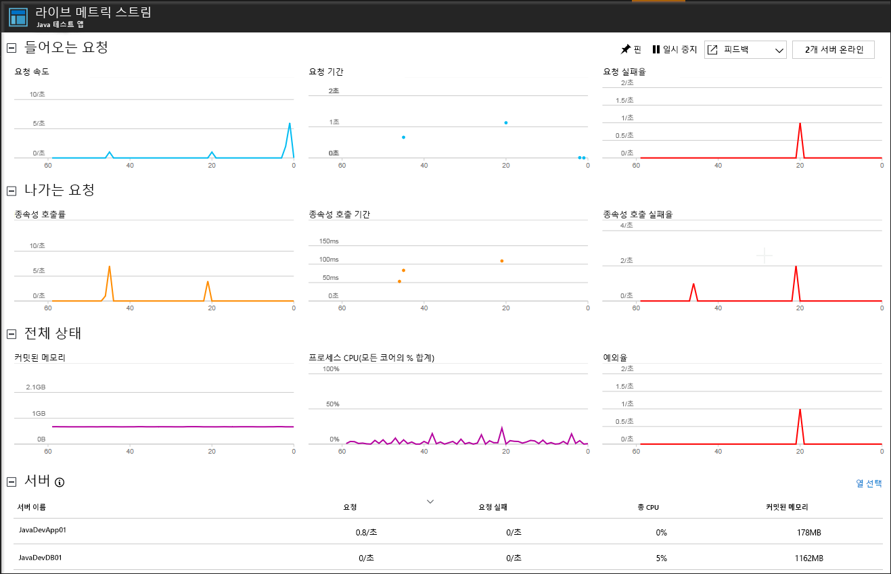

# <a name="start-monitoring-your-java-web-application"></a>Java 웹 애플리케이션 모니터링 시작

Azure Application Insights를 사용하면 웹 애플리케이션의 가용성, 성능 및 사용량을 쉽게 모니터링할 수 있습니다. 또한 사용자가 보고할 때까지 기다리지 않고 애플리케이션의 오류를 빠르게 식별하고 진단할 수 있습니다. Application Insights Java SDK를 사용하면 MongoDB, MySQL 및 Redis를 포함하여 일반적인 타사 패키지를 모니터링할 수 있습니다.

이 빠른 시작은 기존 Java 동적 웹 프로젝트에 Application Insights SDK를 추가하는 방법을 안내합니다.

## <a name="prerequisites"></a>필수 조건

이 빠른 시작을 완료하려면 다음이 필요합니다.

- JRE 1.7 또는 1.8 설치
- [Java EE 개발자용 Eclipse IDE 평가판](https://www.eclipse.org/downloads/)을 설치합니다. 이 빠른 시작에서는 Eclipse Oxygen(4.7)을 사용합니다.
- Azure 구독과 기존 Java 동적 웹 프로젝트가 필요합니다.
 
Java 동적 웹 프로젝트가 없는 경우 [Java 웹앱 만들기 빠른 시작](https://docs.microsoft.com/azure/app-service-web/app-service-web-get-started-java)을 사용하여 Java 동적 웹 프로젝트를 만들 수 있습니다.

Azure 구독이 아직 없는 경우 시작하기 전에 [체험](https://azure.microsoft.com/free/) 계정을 만듭니다.

Spring 프레임워크를 선호하는 경우 [Application Insights 가이드를 사용하도록 Spring Boot 이니셜라이저 앱을 구성](https://docs.microsoft.com/java/azure/spring-framework/configure-spring-boot-java-applicationinsights)해 보세요.

## <a name="log-in-to-the-azure-portal"></a>Azure Portal에 로그인

[Azure Portal](https://portal.azure.com/)에 로그인합니다.

## <a name="enable-application-insights"></a>Application Insights 사용

Application Insights는 온-프레미스 또는 클라우드에서 실행되는지 여부에 관계 없이 인터넷에 연결된 모든 애플리케이션에서 원격 분석 데이터를 수집할 수 있습니다. 이 데이터를 보기 시작하려면 다음 단계를 사용합니다.

1. **리소스 만들기** > **모니터링 + 관리** > **Application Insights**를 선택합니다.

   

   구성 상자가 표시되면 다음 표를 사용하여 입력 필드를 채웁니다.

    | 설정        | 값           | 설명  |
   | ------------- |:-------------|:-----|
   | **Name**      | 전역적으로 고유한 값 | 모니터링하는 응용 프로그램을 식별하는 이름입니다. |
   | **애플리케이션 유형** | Java 웹 애플리케이션 | 모니터링하는 응용 프로그램의 유형입니다. |
   | **리소스 그룹**     | myResourceGroup      | Application Insights 데이터를 호스팅할 새 리소스 그룹의 이름입니다. |
   | **위치**: | 미국 동부 | 가까운 위치 또는 응용 프로그램이 호스팅되는 위치 근처를 선택합니다. |

2. **만들기**를 클릭합니다.

## <a name="install-app-insights-plugin"></a>Application Insights 플러그 인 설치

1. **Eclipse**를 시작하고, **도움말**을 클릭하고, **새 소프트웨어 설치**를 선택합니다.

   

2. "Work With(작업 항목)" 필드에 ```https://dl.microsoft.com/eclipse```를 복사하고, **Java용 Azure 도구 키트**를 선택하고, **Java용 Application Insights 플러그 인**을 선택하고,  > "설치하는 동안 모든 업데이트 사이트에 문의하여 필요한 소프트웨어를 찾습니다."를 **선택 취소**합니다.

3. 설치가 완료되면 **Eclipse를 다시 시작**하라는 메시지가 표시됩니다.

## <a name="configure-app-insights-plugin"></a>Application Insights 플러그 인 구성

1. **Eclipse**를 시작하고, **프로젝트**를 열고, **프로젝트 탐색기**에서 프로젝트 이름을 마우스 오른쪽 단추로 클릭하고, **Azure**를 선택하고, **로그인**을 클릭합니다.

2. **대화형** 인증 방법을 선택하고, **로그인**을 클릭하고, 메시지가 표시되면 **Azure 자격 증명**을 입력하고, **Azure 구독**을 선택합니다.

3. **프로젝트 탐색기**에서 프로젝트 이름을 마우스 오른쪽 단추로 클릭하고 **Azure**를 선택하고, **Application Insights 구성**을 클릭합니다.

4. **Application Insights로 원격 분석 사용**을 선택하고, Java 애플리케이션에 연결하려는 Application Insights 리소스 및 관련 **계측 키**를 선택합니다.

   

> [!NOTE]
> Java용 Application Insights SDK는 라이브 메트릭을 캡처하고 시각화할 수 있지만, 처음으로 원격 분석 수집을 사용하도록 설정하면 포털에 데이터가 표시되기까지 몇 분이 걸릴 수 있습니다. 이 응용 프로그램이 트래픽이 적은 테스트 앱인 경우 활성 요청이나 작업이 있을 때만 대부분의 메트릭이 캡처됩니다.

## <a name="start-monitoring-in-the-azure-portal"></a>Azure Portal에서 모니터링 시작

1. 이제 계측 키를 검색한 Azure Portal에서 Application Insights **개요** 페이지를 다시 열어 현재 실행 중인 애플리케이션에 대한 세부 정보를 볼 수 있습니다.

   

2. 애플리케이션 구성 요소 간의 종속성 관계에 대한 시각적 레이아웃을 보려면 **애플리케이션 맵**을 클릭합니다. 각 구성 요소에는 로드, 성능, 오류 및 경고와 같은 KPI가 표시됩니다.

   

3. **앱 분석** 아이콘을 클릭합니다. 그러면 Application Insights에 의해 수집된 모든 데이터를 분석하기 위한 풍부한 쿼리 언어를 제공하는 **Application Insights Analytics**가 열립니다. 이 경우 요청 수를 차트로 렌더링하는 쿼리가 생성됩니다. 사용자 고유의 쿼리를 작성하여 다른 데이터를 분석할 수 있습니다.

   

4. **개요** 페이지로 돌아가서 KPI 그래프를 검사합니다.  이 대시보드는 들어오는 요청의 수, 해당 요청의 기간 및 발생한 모든 오류를 포함하여 애플리케이션 상태에 대한 통계를 제공합니다.

   

   **페이지 보기 로드 시간** 차트를 **클라이언트 쪽 원격 분석** 데이터로 채우도록 하려면 이 스크립트를 추적하려는 각 페이지에 추가합니다.

   ```HTML
   <!-- 
   To collect user behavior analytics about your application, 
   insert the following script into each page you want to track.
   Place this code immediately before the closing </head> tag,
   and before any other scripts. Your first data will appear 
   automatically in just a few seconds.
   -->
   <script type="text/javascript">
     var appInsights=window.appInsights||function(config){
     function i(config){t[config]=function(){var i=arguments;t.queue.push(function(){t[config].apply(t,i)})}}var t={config:config},u=document,e=window,o="script",s="AuthenticatedUserContext",h="start",c="stop",l="Track",a=l+"Event",v=l+"Page",y=u.createElement(o),r,f;y.src=config.url||"https://az416426.vo.msecnd.net/scripts/a/ai.0.js";u.getElementsByTagName(o)[0].parentNode.appendChild(y);try{t.cookie=u.cookie}catch(p){}for(t.queue=[],t.version="1.0",r=["Event","Exception","Metric","PageView","Trace","Dependency"];r.length;)i("track"+r.pop());return i("set"+s),i("clear"+s),i(h+a),i(c+a),i(h+v),i(c+v),i("flush"),config.disableExceptionTracking||(r="onerror",i("_"+r),f=e[r],e[r]=function(config,i,u,e,o){var s=f&&f(config,i,u,e,o);return s!==!0&&t["_"+r](config,i,u,e,o),s}),t
    }({
        instrumentationKey:"<instrumentation key>"
    });

    window.appInsights=appInsights;
    appInsights.trackPageView();
   </script>
    ```

5. **라이브 스트림**을 클릭합니다. 여기서 Java 웹앱의 성능과 관련된 라이브 메트릭을 확인합니다. **라이브 메트릭 스트림**에는 들어오는 요청의 수, 요청의 기간 및 발생하는 모든 오류와 관련된 데이터가 포함됩니다. 또한 프로세서 및 메모리와 같은 중요한 성능 메트릭을 실시간으로 모니터링할 수 있습니다.

   

Java 모니터링에 대한 자세한 내용은 [Application Insights Java 추가 설명서](./../../azure-monitor/app/java-get-started.md)를 참조하세요.

## <a name="clean-up-resources"></a>리소스 정리

계속하여 다음의 빠른 시작 또는 자습서를 사용하려는 경우 이 빠른 시작에서 만든 리소스를 정리하지 않습니다. 계속하지 않으려는 경우 다음 단계에 따라 Azure Portal에서 이 빠른 시작에서 만든 모든 리소스를 삭제합니다.

1. Azure Portal의 왼쪽 메뉴에서 **리소스 그룹**과 **myResourceGroup**을 차례로 클릭합니다.
2. 리소스 그룹 페이지에서 **삭제**를 클릭하고 텍스트 상자에 **myResourceGroup**을 입력한 후 **삭제**를 클릭합니다.

## <a name="next-steps"></a>다음 단계

> [!div class="nextstepaction"]
> [성능 문제 찾기 및 진단](https://docs.microsoft.com/azure/application-insights/app-insights-analytics)