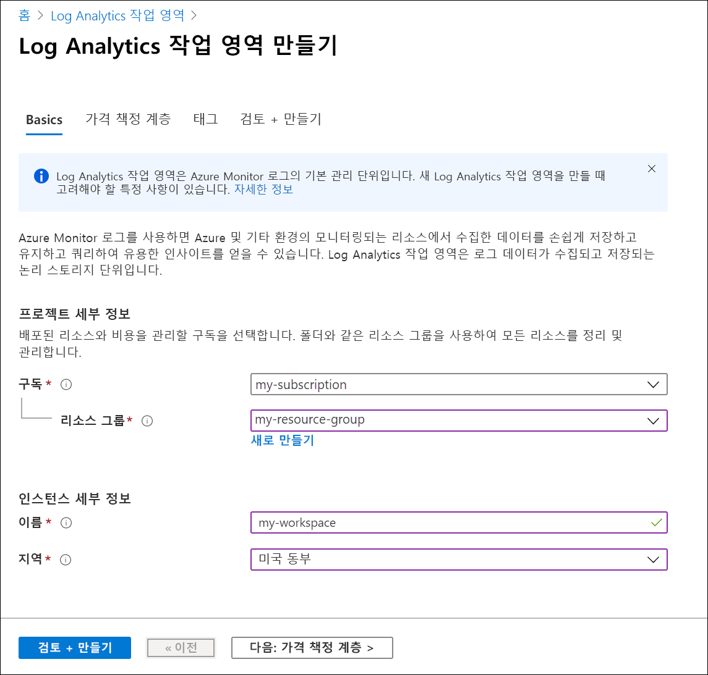
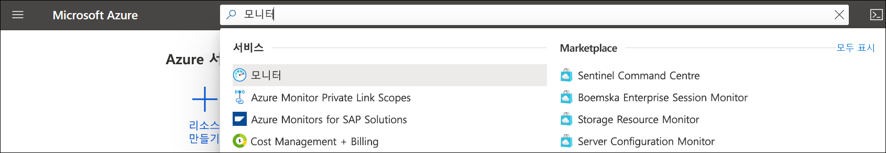
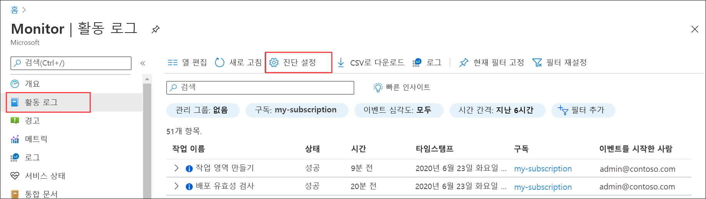
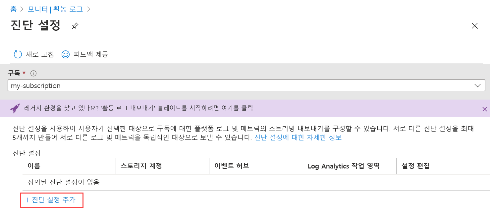
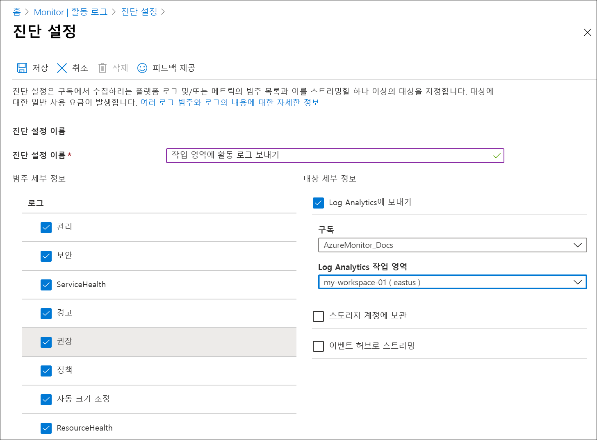
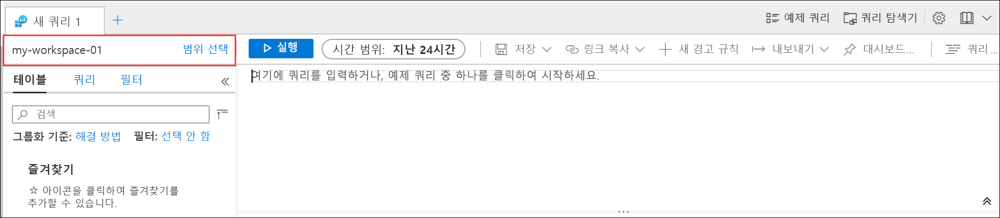
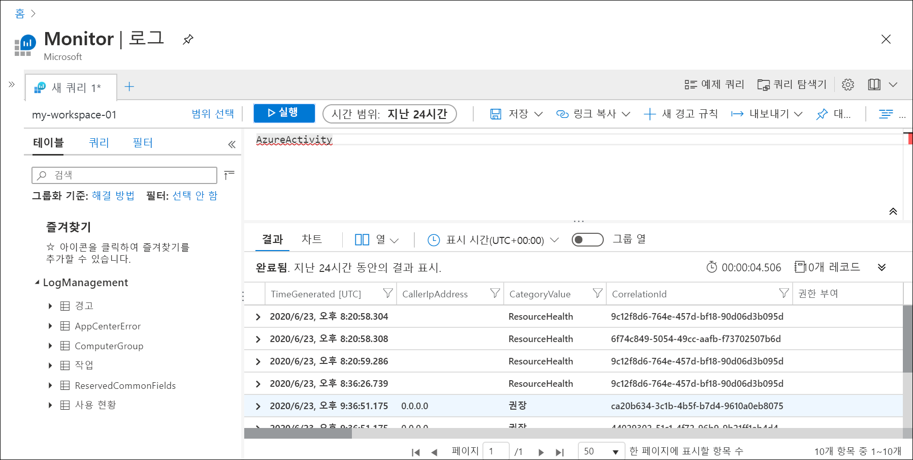
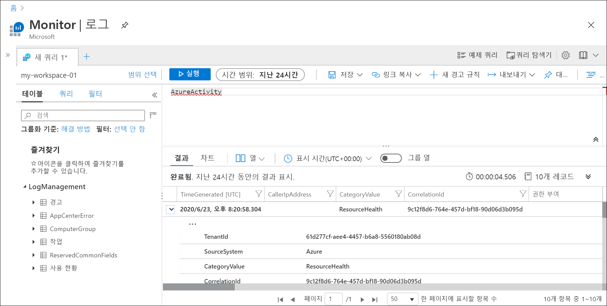
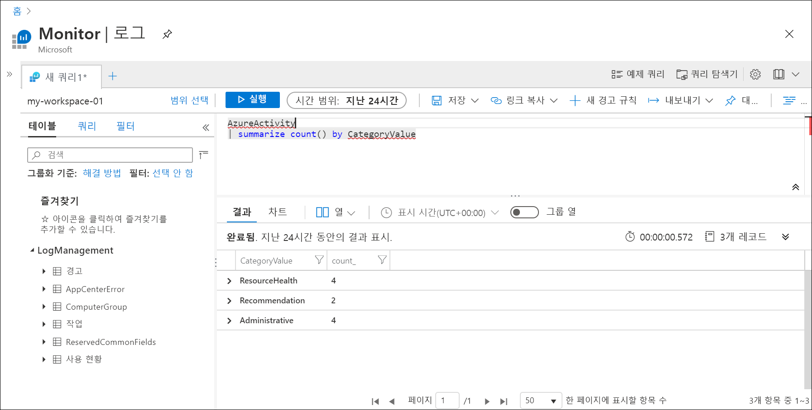

# Azure Portal을 사용하여 Log Analytics 작업 영역에 Azure 활동 로그 보내기
활동 로그는 구독 수준 이벤트에 대한 인사이트를 제공하는 Azure의 플랫폼 로그입니다. 여기에는 리소스가 수정되거나 가상 머신이 시작되는 등의 이벤트 정보가 포함됩니다. Azure Portal에서 활동 로그를 보거나 PowerShell 및 CLI를 사용하여 항목을 검색할 수 있습니다. 이 빠른 시작에서는 Azure Portal을 사용하여 Log Analytics 작업 영역 및 Azure Monitor Logs에 활동 로그를 보내는 진단 설정을 만드는 방법을 보여 줍니다. Azure Monitor Logs에서는 [로그 쿼리](../log-query/log-query-overview.md)를 사용하여 활동 로그를 분석하고 [로그 경고](../platform/alerts-log-query.md) 및 [통합 문서](../platform/workbooks-overview.md)와 같은 다른 기능을 사용할 수 있습니다. 

## Azure Portal에 로그인
[https://portal.azure.com](https://portal.azure.com)에서 Azure Portal에 로그인합니다. 

## Log Analytics 작업 영역 만들기
Azure Portal에서 **Log Analytics 작업 영역**을 검색한 다음, 선택합니다. 

  
**추가**를 클릭한 다음, **리소스 그룹**, 작업 영역 **이름** 및 **위치**에 대한 값을 제공합니다. 작업 영역 이름은 모든 Azure 구독에서 고유해야 합니다.

**검토 + 만들기**를 클릭하여 설정을 검토한 다음, **만들기**를 클릭하여 작업 영역을 만듭니다. 이렇게 하면 **종량제**의 기본 가격 책정 계층을 선택하여 충분한 양의 데이터 수집을 시작할 때까지 변경 내용이 발생하지 않습니다. 활동 로그 수집에는 요금이 부과되지 않습니다.

## 진단 설정 만들기
Azure Portal에서 **모니터**를 검색한 다음, 선택합니다. 

**활동 로그**를 선택합니다. 현재 구독에 대한 최근 이벤트를 확인해야 합니다. **진단 설정**을 클릭하여 구독에 대한 진단 설정을 봅니다.

**진단 설정 추가**를 클릭하여 새 설정을 만듭니다. 

*작업 영역에 활동 로그 보내기*와 같은 이름을 입력합니다. 각 범주를 선택합니다. 대상 전용으로 **Log Analytics에 보내기**를 선택한 다음, 앞에서 만든 작업 영역을 지정합니다. **저장**을 클릭하여 진단 설정을 만든 다음, 페이지를 닫습니다.

## 로그 데이터 생성
새 활동 로그 항목만 Log Analytics 작업 영역으로 전송되므로, 구독에서 가상 머신 시작/중지 또는 다른 리소스 만들기/수정처럼 로깅될 작업을 수행합니다. 진단 설정이 만들어지고 작업 영역에 데이터가 처음 기록될 때까지 몇 분 정도 걸릴 수 있습니다. 이 시간이 지나면 작업 로그에 기록된 모든 이벤트가 몇 초 내에 작업 영역으로 전송됩니다.

## 로그 쿼리를 사용하여 데이터 검색

**Azure Monitor** 메뉴에서 **로그**를 선택합니다. **예제 쿼리** 페이지를 닫습니다. 범위를 앞에서 만든 작업 영역으로 설정하지 않은 경우 **범위 선택**을 클릭하여 앞에서 만든 작업 영역을 찾습니다.

쿼리 창에서 `AzureActivity`를 입력하고 **실행**을 클릭합니다. 활동 로그에서 보낸 모든 레코드를 포함하는 *AzureActivity* 테이블의 모든 레코드를 반환하는 단순 쿼리입니다.

레코드 중 하나를 확장하면 자세한 속성이 표시됩니다.

범주별로 요약된 이벤트 수를 제공하는 `AzureActivity | summarize count() by CategoryValue`처럼 좀 더 복잡한 쿼리를 시도해 봅니다.

## 다음 단계
이 빠른 시작에서는 Log Analytics 작업 영역으로 전송되도록 활동 로그를 구성했습니다. 이제 작업 영역으로 수집할 다른 데이터를 구성할 수 있습니다. 그런 다음, Azure Monitor의 [로그 쿼리](../log-query/log-query-overview.md)를 사용하여 함께 분석하고 [로그 경고](../platform/alerts-log-query.md) 및 [통합 문서](../platform/workbooks-overview.md) 등의 기능을 활용할 수 있습니다. 다음으로, 활동 로그의 데이터를 보충하여 각 리소스 내에서 수행된 작업에 대한 인사이트를 제공하는 [리소스 로그](../platform/resource-logs.md)를 Azure 리소스에서 수집해야 합니다.

> [!div class="nextstepaction"]
> [Azure Monitor를 사용하여 리소스 로그 수집 및 분석](tutorial-resource-logs.md)
