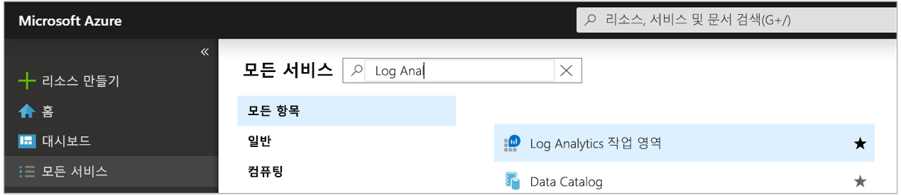
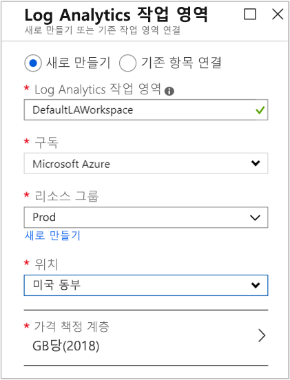
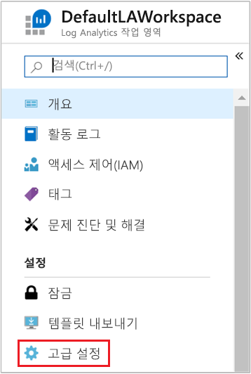
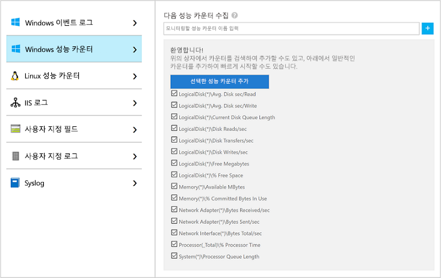
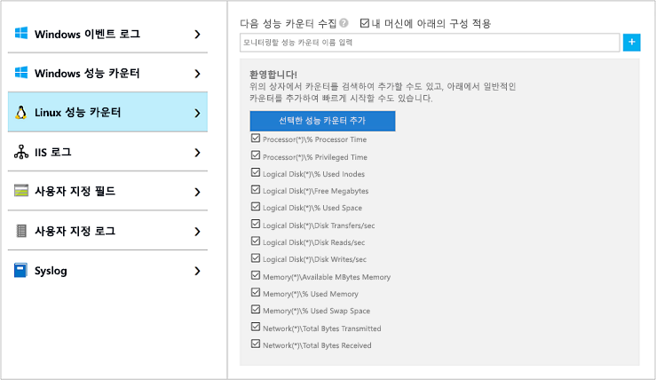
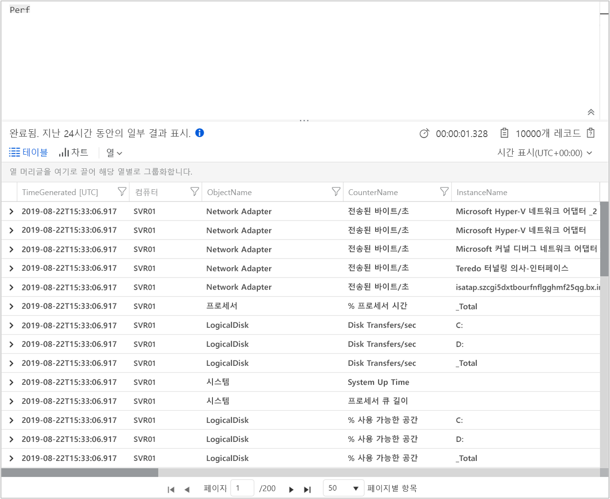
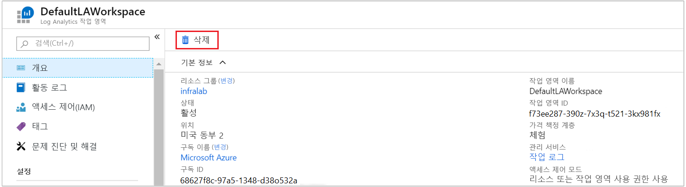

# Azure Monitor를 사용하여 Azure 가상 머신에서 데이터 수집

[Azure Monitor](../overview.md)는 상세한 분석 및 상관 관계 파악을 위해 Azure 가상 머신 데이터를 Log Analytics 작업 영역으로 직접 수집할 수 있습니다. [Windows](../../virtual-machines/extensions/oms-windows.md) 및 [Linux](../../virtual-machines/extensions/oms-linux.md)용 Log Analytics VM 확장을 설치하면 Azure Monitor에서 Azure VM 데이터를 수집할 수 있습니다. 이 빠른 시작에서는 VM 확장을 사용하여 Azure Linux 또는 Windows VM에서 데이터를 구성 및 수집하는 방법을 몇 가지 간단한 단계로 보여줍니다.  
 
또한 기존 Azure Virtual Machine이 있다고 가정합니다. 그렇지 않은 경우 VM 빠른 시작 가이드에 따라 [Windows VM을 만들거나](../../virtual-machines/windows/quick-create-portal.md)[Linux VM을 만들 수 있습니다](../../virtual-machines/linux/quick-create-cli.md).

## Azure Portal에 로그인

[https://portal.azure.com](https://portal.azure.com)에서 Azure Portal에 로그인합니다. 

## 작업 영역 만들기

1. Azure Portal에서 **모든 서비스**를 선택합니다. 리소스 목록에서 **Log Analytics**를 입력합니다. 입력을 시작하면 입력한 내용을 바탕으로 목록이 필터링됩니다. **Log Analytics 작업 영역**을 선택합니다.

       

2. **만들기**를 선택한 후, 다음 항목에 대한 선택 사항을 지정합니다.

   * 새 **Log Analytics 작업 영역**의 이름(예: *DefaultLAWorkspace*)을 지정합니다.  
   * 기본으로 선택된 값이 적절하지 않으면 드롭다운 목록에서 선택하여 연결할 **구독**을 선택합니다.
   * **리소스 그룹**에 대해 하나 이상의 Azure Virtual Machines를 포함하는 기존 리소스 그룹을 선택합니다.  
   * VM이 배포된 **위치**를 선택합니다.  자세한 내용은 [Log Analytics를 사용할 수 있는 지역](https://azure.microsoft.com/regions/services/)을 참조하세요.
   * 2018년 4월 2일 이후에 만들어진 새 구독에서 작업 영역을 만드는 경우 *GB당* 가격 책정 계획이 자동으로 사용되며 가격 책정 계층을 선택할 수 있는 옵션이 제공되지 않습니다.  4월 2일 전에 만들어진 기존 구독 또는 기존 EA 등록과 연결된 구독에서 작업 영역을 만드는 경우 선호하는 가격 책정 계층을 선택합니다.  특정 계층에 대한 자세한 내용은 [Log Analytics 가격 책정 정보](https://azure.microsoft.com/pricing/details/log-analytics/)를 참조하세요.
  
         

3. **Log Analytics 작업 영역** 창에서 필요한 정보를 제공한 후 **확인**을 선택합니다.  

정보가 확인되고 작업 영역이 만들어지는 동안 메뉴의 **알림**에서 진행 상황을 추적할 수 있습니다. 

## Log Analytics VM 확장 사용

[!INCLUDE [log-analytics-agent-note](../../../includes/log-analytics-agent-note.md)] 

Azure에 이미 배포된 Windows 및 Linux 가상 머신에 대해, Log Analytics VM 확장을 사용하여 Log Analytics 에이전트를 설치합니다. 이 확장을 사용하면 설치 프로세스가 간소화되고 지정한 Log Analytics 작업 영역에 데이터를 전송하도록 에이전트가 자동으로 구성됩니다. 최신 버전이 릴리스될 때 에이전트도 자동으로 업그레이드되므로 최신 기능 및 수정 사항을 받아볼 수 있습니다. 계속하기 전에 VM이 실행되는지 확인합니다. 그렇지 않으면, 프로세스를 완료하는 데 실패합니다.  

>[!NOTE]
>Linux용 Log Analytics 에이전트는 둘 이상의 Log Analytics 작업 영역에 보고하도록 구성할 수 없습니다. 

1. Azure Portal의 왼쪽 위 모서리에 있는 **모든 서비스**를 선택합니다. 리소스 목록에서 **Log Analytics**를 입력합니다. 입력을 시작하면 입력한 내용을 바탕으로 목록이 필터링됩니다. **Log Analytics 작업 영역**을 선택합니다.

2. Log Analytics 작업 영역 목록에서 이전에 만든 *DefaultLAWorkspace*를 선택합니다.

3. 왼쪽 메뉴의 작업 영역 데이터 원본에서 **가상 머신**을 선택합니다.  

4. **가상 머신** 목록에서 에이전트를 설치할 가상 머신을 선택합니다. VM에 대한 **Log Analytics 연결 상태**가 **연결되지 않음**을 나타냅니다.

5. 가상 머신에 대한 세부 정보에서 **연결**을 선택합니다. Log Analytics 작업 영역에 대해 에이전트가 자동적으로 설치되고 구성됩니다. 이 프로세스는 몇 분 정도 걸리며, 그동안 **상태**는 **연결 중**으로 표시됩니다.

6. 에이전트가 설치 및 연결된 후에는 **Log Analytics 연결 상태**가 **이 작업 영역**으로 업데이트됩니다.

## 이벤트 및 성능 데이터 수집

Azure Monitor는 Windows 이벤트 로그 또는 Linux Syslog에서 이벤트를 수집하고, 더 긴 기간의 분석 및 보고를 위해 지정한 성능 카운터를 수집할 수 있으며 특정 조건이 검색되면 작업을 수행할 수 있습니다. 다음 단계에 따라 Windows 시스템 로그 및 Linux Syslog의 수집과 시작할 몇 가지 일반 성능 카운터를 구성하세요.  

### Windows VM에서 데이터 수집

1. **고급 설정**을 선택합니다.

    

2. **데이터**를 선택한 후 **Windows 이벤트 로그**를 선택합니다.

3. 로그 이름을 입력하여 이벤트 로그를 추가합니다.  **System**을 입력한 다음, 더하기 기호( **+** )를 선택합니다.

4. 표에서 심각도 **오류** 및 **경고**를 선택합니다.

5. 페이지 맨 위에서 **저장**을 선택하여 구성을 저장합니다.

6. **Windows 성능 데이터**를 선택하여 Linux 컴퓨터의 성능 카운터 수집을 사용하도록 설정합니다.

7. 새 Log Analytics 작업 영역에 대한 Windows 성능 카운터를 처음으로 구성하는 경우, 몇 가지 공용 카운터를 신속하게 만드는 옵션이 제공됩니다. 각 항목은 옆에 확인란과 함께 나열됩니다.

    

    **선택한 성능 카운터 추가**를 선택합니다.  해당 성능 카운터가 추가되고, 10초의 수집 샘플 간격으로 미리 설정됩니다.
  
8. 페이지 맨 위에서 **저장**을 선택하여 구성을 저장합니다.

### Linux VM에서 데이터 수집

1. **Syslog**를 선택합니다.  

2. 로그 이름을 입력하여 이벤트 로그를 추가합니다.  **Syslog**을 입력한 다음, 더하기 기호( **+** )를 선택합니다.  

3. 표에서 심각도 **정보**, **알림** 및 **디버그**를 선택 취소합니다. 

4. 페이지 맨 위에서 **저장**을 선택하여 구성을 저장합니다.

5. **Linux 성능 데이터**를 선택하여 Linux 컴퓨터의 성능 카운터 수집을 사용하도록 설정합니다. 

6. 새 Log Analytics 작업 영역에 대한 Linux 성능 카운터를 처음으로 구성하는 경우, 몇 가지 공용 카운터를 신속하게 만드는 옵션이 제공됩니다. 각 항목은 옆에 확인란과 함께 나열됩니다.

    

    **내 머신에 아래 구성 적용**을 선택한 다음, **선택한 성능 카운터 추가**를 선택합니다.  해당 성능 카운터가 추가되고, 10초의 수집 샘플 간격으로 미리 설정됩니다.  

7. 페이지 맨 위에서 **저장**을 선택하여 구성을 저장합니다.

## 수집되는 데이터 보기

데이터 수집을 사용하도록 설정했으므로 대상 VM의 일부 데이터를 확인하는 간단한 로그 검색 예제를 실행해보겠습니다.  

1. 선택한 작업 영역의 왼쪽 창에서 **로그**를 선택합니다.

2. 로그 쿼리 페이지에서 쿼리 편집기에 `Perf`를 입력하고 **실행**을 선택합니다.

     

    예를 들어, 다음 이미지의 쿼리는 10,000개의 성능 레코드를 반환했습니다. 결과는 훨씬 더 적습니다.

    

## 리소스 정리

더 이상 필요하지 않은 경우 Log Analytics 작업 영역을 삭제합니다. 이렇게 하려면 앞서 만든 Log Analytics 작업 영역을 선택하고 리소스 페이지에서 **삭제**를 선택합니다.

## 다음 단계

Windows 또는 Linux 가상 머신에서 운영 및 성능 데이터를 수집하도록 구성했으므로 이제 *무료*로 수집하는 데이터를 쉽게 탐색하고 분석하고 관련 작업을 수행할 수 있습니다.  

데이터를 보고 분석하는 방법을 알아보려면 자습서를 계속 진행합니다.

> [!div class="nextstepaction"]
> [Log Analytics에서 데이터 보기 또는 분석](../../azure-monitor/learn/tutorial-viewdata.md)
