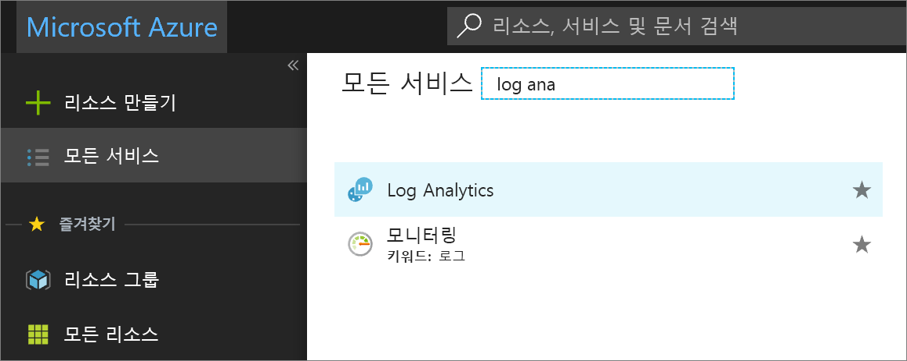
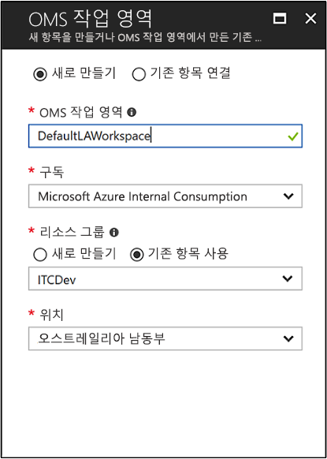
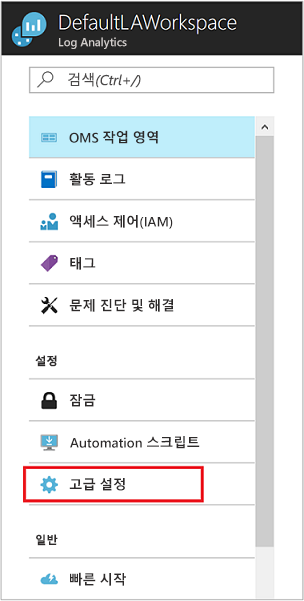
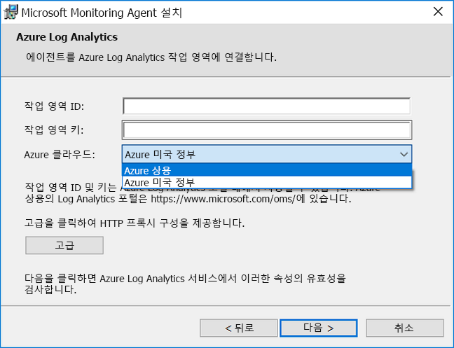
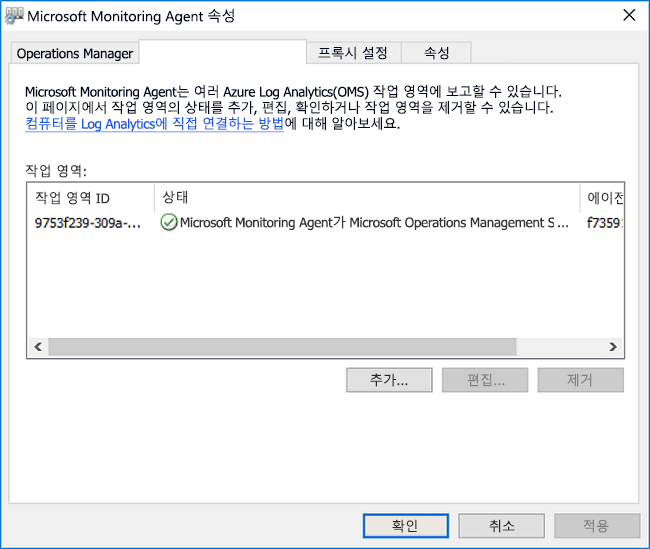
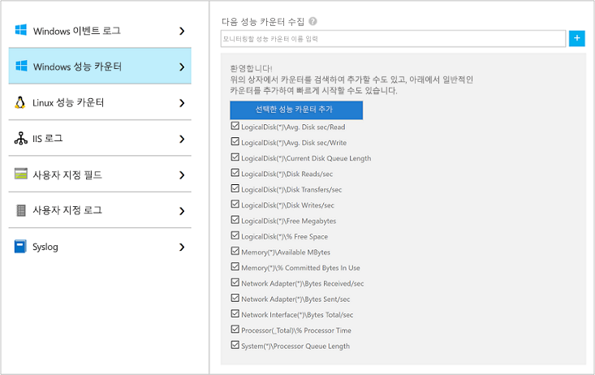
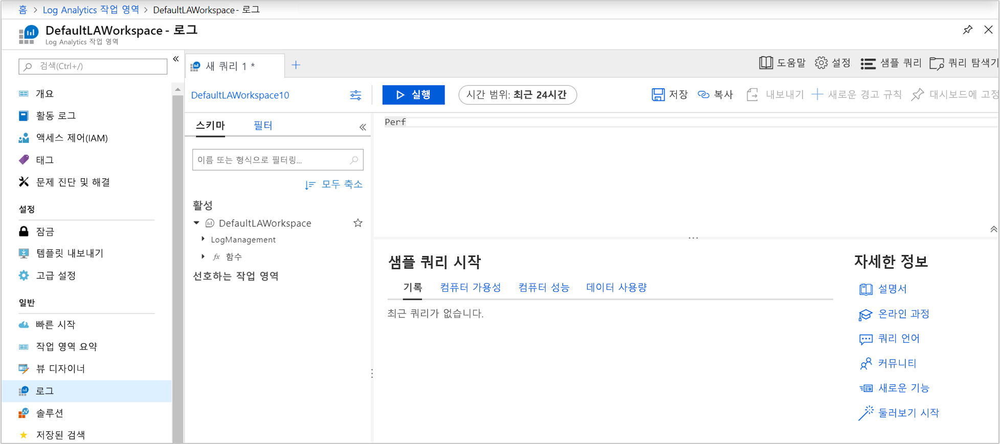
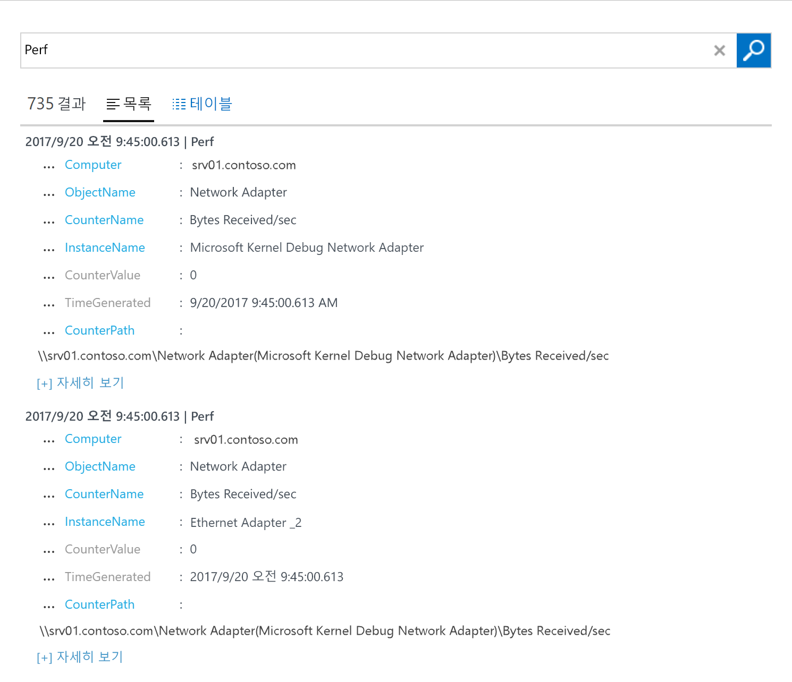
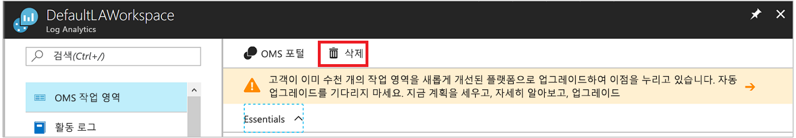

# 하이브리드 환경에서 Windows 컴퓨터용 Log Analytics 에이전트 구성
[Azure Log Analytics](../../azure-monitor/platform/agent-windows.md)는 자세한 분석 및 상관 관계를 위해 데이터를 실제 또는 가상 Windows 컴퓨터에서 단일 리포지토리로 직접 수집할 수 있습니다. Log Analytics는 데이터 센터 또는 다른 클라우드 환경에서 데이터를 수집할 수 있습니다. 이 빠른 시작 가이드에서는 몇 가지 간단한 단계로 Windows 컴퓨터에서 데이터를 구성 및 수집하는 방법을 보여 줍니다.  Azure Windows VM에 대한 자세한 내용은 [Azure Virtual Machines에 대한 데이터 수집](../../azure-monitor/learn/quick-collect-azurevm.md)을 참조하세요.  

지원되는 구성을 이해하려면 [지원되는 Windows 운영 체제](../../azure-monitor/platform/log-analytics-agent.md#supported-windows-operating-systems) 및 [네트워크 방화벽 구성](../../azure-monitor/platform/log-analytics-agent.md#network-firewall-requirements)을 참조하세요.
 
Azure 구독이 아직 없는 경우 시작하기 전에 [체험 계정](https://azure.microsoft.com/free/?WT.mc_id=A261C142F)을 만듭니다.

## Azure Portal에 로그인
[https://portal.azure.com](https://portal.azure.com)에서 Azure Portal에 로그인합니다.

## 작업 영역 만들기
1. Azure Portal에서 **모든 서비스**를 선택합니다. 검색 상자에서 **Log Analytics**를 입력합니다. 입력하는 대로 입력 내용에 따라 목록이 필터링됩니다. **Log Analytics**를 선택합니다.

    
  
2. **만들기**를 선택하고 다음 세부 정보를 제공합니다.

   * 새 **Log Analytics 작업 영역**에 대한 이름을 입력합니다. **DefaultLAWorkspace**와 비슷합니다.
   * 연결할 **구독**을 선택합니다. 기본값을 사용하지 않으려면 목록에서 다른 값을 선택합니다.
   * **리소스 그룹**에 대해 하나 이상의 Azure 가상 머신이 포함된 기존 리소스 그룹을 선택합니다.  
   * VM이 배포된 **위치**를 선택합니다. [Log Analytics를 사용할 수 있는 지역](https://azure.microsoft.com/regions/services/) 목록을 참조하세요.  
   * 2018년 4월 2일 이후에 만든 구독에서 작업 영역을 만드는 경우 해당 작업 영역에는 **GB당** 가격 책정 계획이 자동으로 사용됩니다. 가격 책정 계층은 선택할 수 없습니다. 2018년 4월 2일 이전에 만든 구독 또는 기존 EA 등록과 연결된 구독에서 작업 영역을 만드는 경우 사용하려는 가격 책정 계획을 선택합니다. 계층에 대한 자세한 내용은 [Log Analytics 가격 책정 세부 정보](https://azure.microsoft.com/pricing/details/log-analytics/)를 참조하세요.

           

3. **Log Analytics 작업 영역** 창에서 필요한 정보를 제공한 후 **확인**을 선택합니다.  

정보가 확인되고 작업 영역이 만들어지는 동안 메뉴의 **알림** 아래에서 진행 상황을 추적할 수 있습니다.

## 작업 영역 ID 및 키 가져오기
Windows용 Microsoft Monitoring Agent를 설치하려면 Log Analytics 작업 영역에 대한 작업 영역 ID 및 키가 필요합니다. 이 정보는 설치 마법사에서 에이전트를 올바르게 구성하고 Log Analytics와 통신할 수 있게 하는 데 필요합니다.  

1. Azure Portal의 왼쪽 위 모서리에서 **모든 서비스**를 선택합니다. 검색 상자에서 **Log Analytics**를 입력합니다. 입력하는 대로 입력 내용에 따라 목록이 필터링됩니다. **Log Analytics**를 선택합니다.
2. Log Analytics 작업 영역 목록에서 이전에 만든 작업 영역을 선택합니다. (이름은 **DefaultLAWorkspace**로 지정했을 수 있습니다.)
3. **고급 설정**을 선택합니다.

    
  
4. **연결된 원본**을 선택한 다음 **Windows 서버**를 선택합니다.
5. 값을 **작업 영역 ID** 및 **기본 키**의 오른쪽에 복사합니다. 즐겨찾는 편집기에 붙여넣습니다.

## Windows용 에이전트 설치
다음 단계에서는 Log Analytics용 에이전트를 Azure 및 Azure Government에 설치하고 구성합니다. Microsoft Monitoring Agent 설치 프로그램을 사용하여 에이전트를 컴퓨터에 설치합니다.

1. 일단의 이전 단계에서 계속하여 **Windows Server** 페이지에서 다운로드하려는 **Windows 에이전트 다운로드** 버전을 선택합니다. Windows 운영 체제의 프로세서 아키텍처에 적합한 버전을 선택합니다.
2. 설치를 실행하여 컴퓨터에 에이전트를 설치합니다.
2. **Welcome** 페이지에서 **다음**을 선택합니다.
3. **사용 조건** 페이지에서 라이선스를 읽고 **동의함**을 선택합니다.
4. **대상 폴더** 페이지에서 기본 설치 폴더를 변경 또는 유지하고 **다음**을 선택합니다.
5. **에이전트 설치 옵션** 페이지에서 에이전트를 Azure Log Analytics에 연결하고, **다음**을 선택합니다.
6. **Azure Log Analytics** 페이지에서 다음 단계를 수행합니다.
   1. 앞에서 복사한 **작업 영역 ID** 및 **작업 영역 키(기본 키)** 를 붙여넣습니다. 컴퓨터가 Azure Government의 Log Analytics 작업 영역에 보고해야 하는 경우 **Azure Cloud** 목록에서 **Azure US Government**를 선택합니다.  
   2. 컴퓨터가 프록시 서버를 통해 Log Analytics 서비스와 통신해야 하는 경우 **고급**을 선택하고 프록시 서버의 URL 및 포트 번호를 제공합니다. 프록시 서버에 인증이 필요한 경우 프록시 서버 인증용 사용자 이름과 암호를 입력하고, **다음**을 선택합니다.  
7. 구성 설정을 추가하고, **다음**을 선택합니다.

    

8. **설치 준비** 페이지에서 선택 항목을 검토한 다음 **설치**를 선택합니다.
9. **구성이 완료되었습니다** 페이지에서 **마침**을 선택합니다.

설치 및 설정이 완료되면 Microsoft Monitoring Agent가 제어판에 표시됩니다. 구성을 검토하고 에이전트가 Log Analytics에 연결되었는지 확인할 수 있습니다. 연결되면 에이전트에서 **Azure Log Analytics** 탭에 다음 메시지를 표시합니다. **Microsoft Monitoring Agent가 Microsoft Log Analytics 서비스에 성공적으로 연결되었습니다.** 와 같은 메시지가 표시됩니다.   

## 이벤트 및 성능 데이터 수집
Log Analytics는 장기 분석 및 보고를 위해 Windows 이벤트 로그 및 성능 카운터에서 지정한 이벤트를 수집할 수 있습니다. 또한 특정 조건이 감지되면 조치를 취할 수도 있습니다. 다음 단계에 따라 Windows 이벤트 로그의 이벤트 수집과 시작할 몇 가지 일반 성능 카운터를 구성합니다.  

1. Azure Portal의 왼쪽 아래 모서리에서 **추가 서비스**를 선택합니다. 검색 상자에서 **Log Analytics**를 입력합니다. 입력하는 대로 입력 내용에 따라 목록이 필터링됩니다. **Log Analytics**를 선택합니다.
2. **고급 설정**을 선택합니다.

    
 
3. **데이터**를 선택한 후 **Windows 이벤트 로그**를 선택합니다.  
4. 로그 이름을 입력하여 이벤트 로그를 추가합니다. **System**을 입력한 다음, 더하기 기호( **+** )를 선택합니다.  
5. 테이블에서 **오류** 및 **경고** 심각도를 선택합니다.
6. 페이지 위쪽에서 **저장**을 선택합니다.
7. **Windows 성능 카운터**를 선택하여 Linux 컴퓨터의 성능 카운터 수집을 사용하도록 설정합니다.
8. 새 Log Analytics 작업 영역에 대한 Windows 성능 카운터를 처음 구성하는 경우 몇 가지 공용 카운터를 빠르게 만들 수 있는 옵션이 제공됩니다. 각 옵션이 나열되고 옆에 확인란이 표시됩니다.

    .
    
    **선택한 성능 카운터 추가**를 선택합니다. 해당 카운터가 추가되고, 10초의 수집 샘플 간격으로 미리 설정됩니다.

9. 페이지 위쪽에서 **저장**을 선택합니다.

## 수집된 데이터 보기
데이터 수집을 사용하도록 설정했으므로 간단한 로그 검색을 실행하여 대상 컴퓨터의 일부 데이터를 확인해 보겠습니다.  

1. Azure Portal의 선택한 작업 영역에서 **로그** 타일을 선택합니다.  
2. **로그 검색** 창의 쿼리 상자에서 **Perf**를 입력하고, 쿼리 상자 위쪽에서 **실행**을 클릭합니다.
 
    

    예를 들어 다음 이미지의 쿼리에서는 735개의 성능 레코드를 반환했습니다.

    

## 리소스 정리
더 이상 필요하지 않은 경우 컴퓨터에서 에이전트를 제거하고 Log Analytics 작업 영역을 삭제할 수 있습니다.  

에이전트를 제거하려면 다음 단계를 수행합니다.

1. 제어판을 엽니다.
2. **프로그램 및 기능**을 엽니다.
3. **프로그램 및 기능**에서 **Microsoft Monitoring Agent**를 선택한 다음, **제거**를 선택합니다.

앞에서 만든 Log Analytics 작업 영역을 삭제하려면 해당 작업 영역을 선택하고 리소스 페이지에서 **삭제**를 클릭합니다.

## 다음 단계
이제 Windows 컴퓨터에서 운영 및 성능 데이터를 수집하고 있으므로 수집한 데이터를 *추가 비용 없이* 검색, 분석 및 사용할 수 있습니다.  

데이터를 보고 분석하는 방법을 알아보려면 다음 자습서로 계속 진행하세요.

> [!div class="nextstepaction"]
> [Log Analytics에서 데이터 보기 또는 분석](tutorial-viewdata.md)
