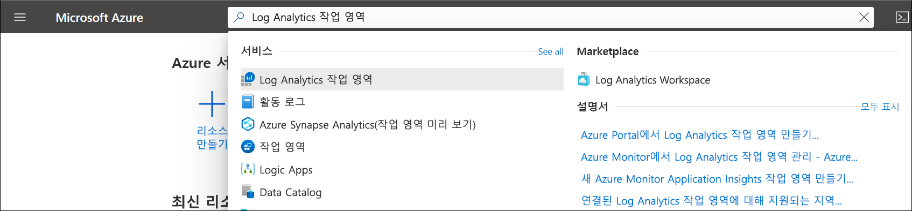

# Azure Portal에서 Log Analytics 작업 영역 만들기
**Log Analytics 작업 영역** 메뉴를 사용하여 Azure Portal에서 Log Analytics 작업 영역을 만듭니다. Log Analytics 작업 영역은 Azure Monitor 로그 데이터에 대한 고유한 환경입니다. 각 작업 영역에는 자체 데이터 리포지토리 및 구성이 있으며 데이터 원본 및 솔루션은 특정 작업 영역에 데이터를 저장하도록 구성됩니다. 다음 원본에서 데이터를 수집하려는 경우 Log Analytics 작업 영역이 필요합니다.

* 구독의 Azure 리소스
* System Center Operations Manager에서 모니터링하는 온-프레미스 컴퓨터
* System Center Configuration Manager의 데이터 수집 
* Azure Storage에서 진단 또는 로그 데이터

Azure VM 및 사용자 환경의 Windows 또는 Linux VM 등 다른 소스의 경우 다음 항목을 참조하세요.

*  [Azure 가상 머신에서 데이터 수집](../learn/quick-collect-azurevm.md) 
*  [하이브리드 Linux 컴퓨터에서 데이터 수집](../learn/quick-collect-linux-computer.md)
*  [하이브리드 Windows 컴퓨터에서 데이터 수집](quick-collect-windows-computer.md)

Azure 구독이 아직 없는 경우 시작하기 전에 [체험 계정](https://azure.microsoft.com/free/?WT.mc_id=A261C142F)을 만듭니다.

## Azure Portal에 로그인
[https://portal.azure.com](https://portal.azure.com)에서 Azure Portal에 로그인합니다. 

## 작업 영역 만들기
1. Azure Portal에서 **모든 서비스**를 클릭합니다. 리소스 목록에서 **Log Analytics**를 입력합니다. 입력을 시작하면 입력한 내용을 바탕으로 목록이 필터링됩니다. **Log Analytics 작업 영역**을 선택합니다.

    
  
2. **추가**를 클릭한 후 다음 항목에 대한 선택 항목을 선택합니다.

   * 새 **Log Analytics 작업 영역**의 이름(예: *DefaultLAWorkspace*)을 지정합니다. 
   * 기본으로 선택된 값이 적절하지 않으면 드롭다운 목록에서 선택하여 연결할 **구독**을 선택합니다.
   * **리소스 그룹**의 경우 이미 설정된 기존 리소스 그룹을 사용하도록 선택하거나 새 리소스 그룹을 만듭니다.  
   * 사용 가능한 **위치**를 선택합니다.  자세한 내용은 참조 하세요 [Log Analytics에서 사용할 수 있는 지역](https://azure.microsoft.com/regions/services/) 및 Azure Monitor에서 검색 합니다 **제품에 대 한 검색** 필드.  
   * 2018년 4월 2일 이후에 만들어진 새 구독에서 작업 영역을 만드는 경우 *GB당* 가격 책정 계획이 자동으로 사용되며 가격 책정 계층을 선택할 수 있는 옵션이 제공되지 않습니다.  4월 2일 전에 만들어진 기존 구독 또는 기존 EA(기업계약) 등록과 연결된 구독에서 작업 영역을 만드는 경우 선호하는 가격 책정 계층을 선택합니다.  특정 계층에 대한 자세한 내용은 [Log Analytics 가격 책정 정보](https://azure.microsoft.com/pricing/details/log-analytics/)를 참조하세요.

          

3. **Log Analytics 작업 영역** 창에서 필요한 정보를 제공한 후에 **확인**을 클릭합니다.  

정보가 확인되고 작업 영역이 만들어지는 동안 메뉴의 **알림**에서 진행 상황을 추적할 수 있습니다. 

## 다음 단계
이제 사용 가능한 작업 영역이 있으므로 모니터링 원격 분석의 컬렉션을 구성하고, 해당 데이터를 분석하는 로그 검색을 실행하고, 추가 데이터 및 분석 정보를 제공하는 관리 솔루션을 추가할 수 있습니다. 

* Azure Diagnostics 또는 Azure 스토리지를 사용하여 Azure 리소스의 데이터 수집을 사용하려면 [Log Analytics에서 사용할 Azure 서비스 로그 및 메트릭 수집](../platform/collect-azure-metrics-logs.md)을 참조하세요.  
* [System Center Operations Manager를 데이터 원본으로 추가](../platform/om-agents.md)하여 Operations Manager 관리 그룹을 보고하는 에이전트에서 데이터를 수집하고 Log Analytics 작업 영역에 저장합니다. 
* [Configuration Manager](../platform/collect-sccm.md)를 연결하여 계층에서 컬렉션의 멤버인 컴퓨터를 가져옵니다.  
* 제공되는 [모니터링 솔루션](../insights/solutions.md)을 검토하고 작업 영역에서 솔루션을 추가하거나 제거하는 방법을 검토합니다.
