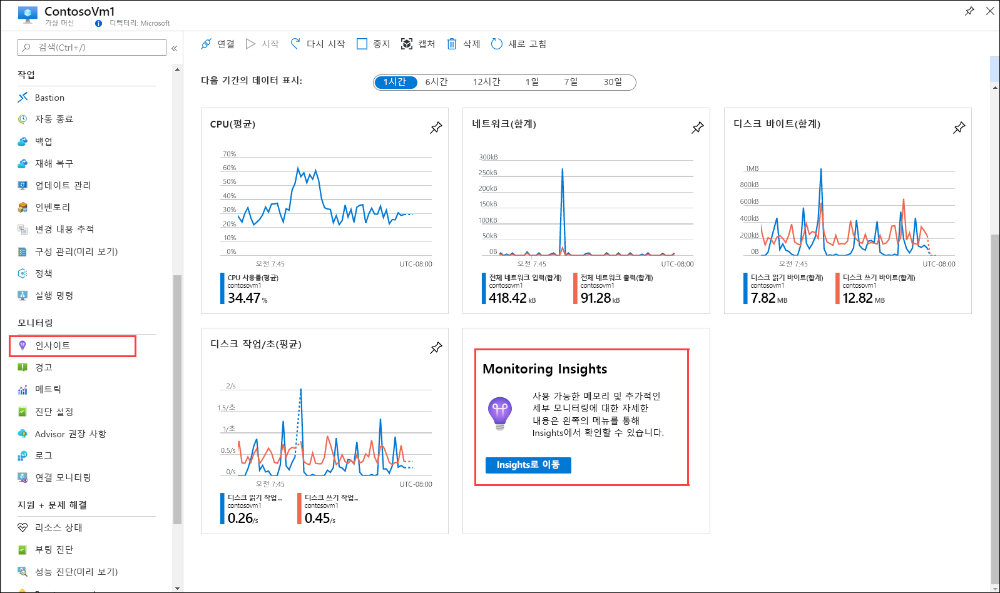
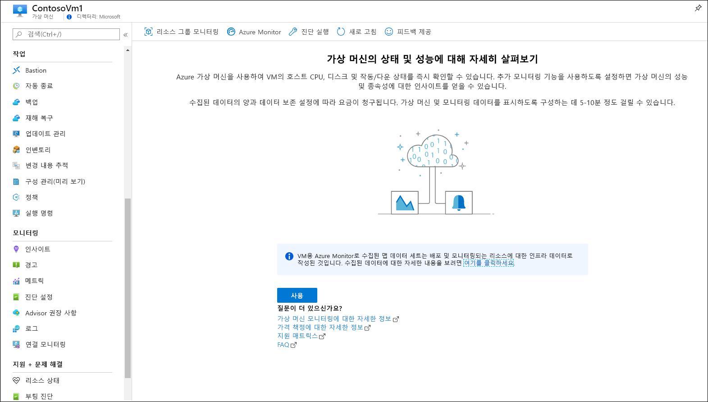
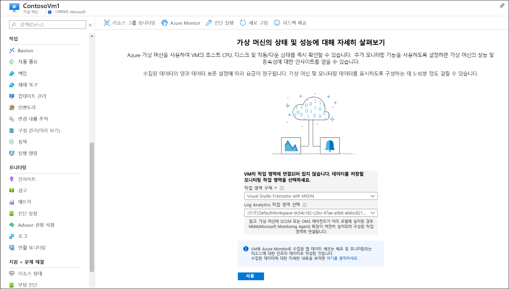
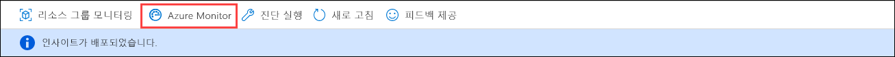
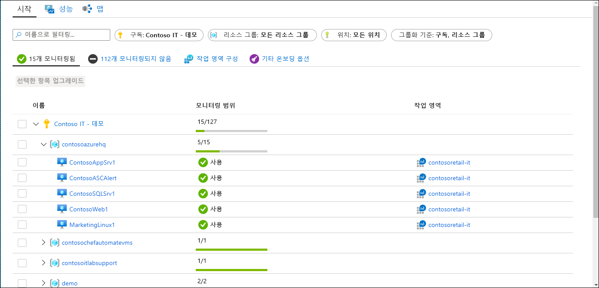
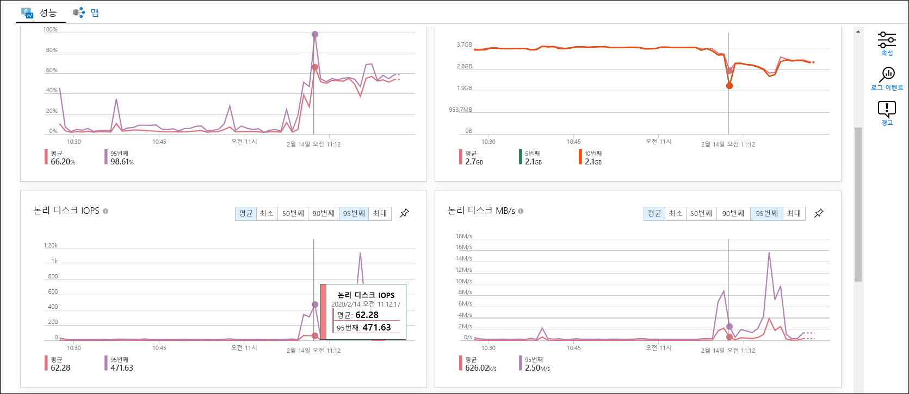
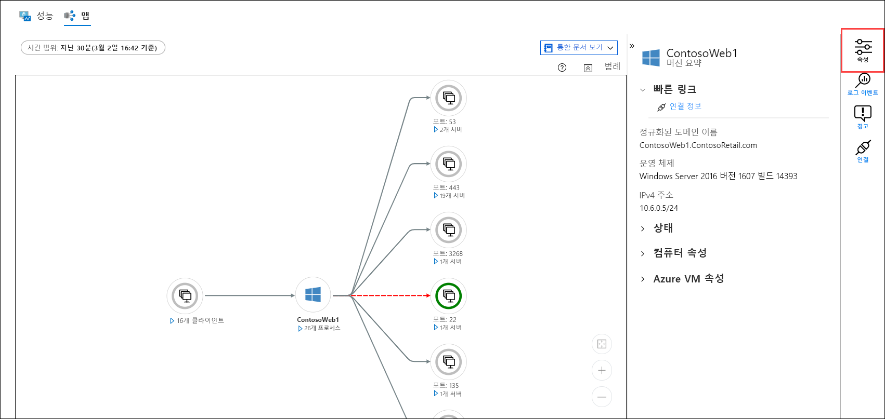
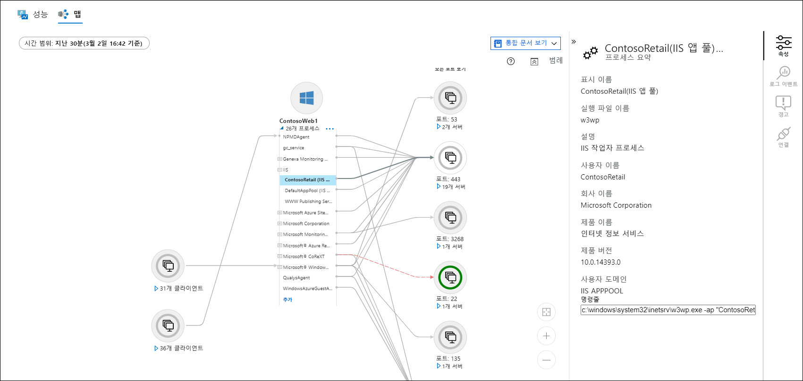
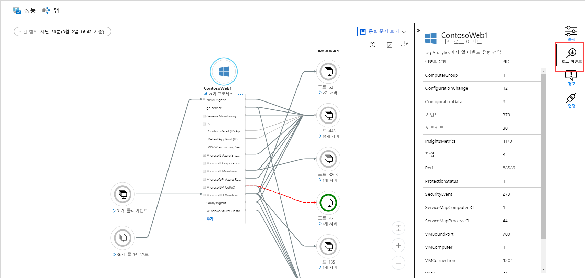
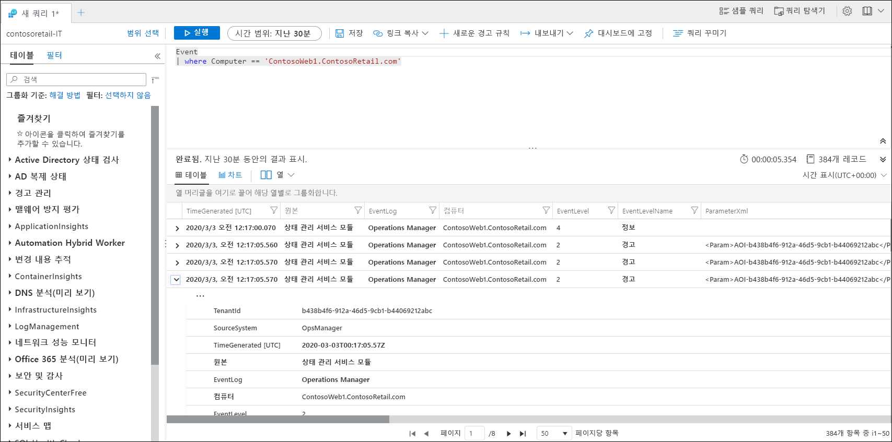

# 빠른 시작: Azure Monitor를 사용하여 Azure 가상 머신 모니터링
[Azure Monitor](../overview.md)는 생성되는 순간부터 Azure 가상 머신에서 데이터 수집을 시작합니다. 이 빠른 시작에서는 Azure VM에 대해 자동으로 수집되는 데이터의 종류와 이러한 데이터를 Azure Portal에서 살펴보는 방법을 간단하게 연습합니다. 그런 다음, VM에 [VM용 Azure Monitor](../insights/vminsights-overview.md)를 사용하도록 설정합니다. 그러면 VM의 에이전트는 프로세스 및 프로세스의 종속성을 포함하여 게스트 운영 체제에서 데이터를 수집하고 분석할 수 있습니다.

또한 기존 Azure Virtual Machine이 있다고 가정합니다. 그렇지 않은 경우 VM 빠른 시작 가이드에 따라 [Windows VM을 만들거나](../../virtual-machines/windows/quick-create-portal.md)[Linux VM을 만들 수 있습니다](../../virtual-machines/linux/quick-create-cli.md).

Azure 리소스에서 수집된 데이터 모니터링에 대한 자세한 내용은 [Azure Monitor를 사용하여 Azure 가상 머신 모니터링](../insights/monitor-vm-azure.md)을 참조하세요.

## Azure 리소스 모니터링 빠른 시작을 완료합니다.
[Azure Monitor를 사용하여 Azure 리소스 모니터링](quick-monitor-azure-resource.md)을 완료하여 구독의 VM에 대한 개요 페이지, 활동 로그 및 메트릭을 살펴봅니다. Azure VM은 다른 Azure 리소스와 동일한 모니터링 데이터를 수집하지만, 이는 호스트 VM에만 해당됩니다. 이 빠른 시작의 나머지 부분에서는 게스트 운영 체제 및 해당 워크로드의 모니터링에 초점을 둡니다.

## VM용 Azure Monitor 사용
호스트 VM에 대한 메트릭 및 활동 로그가 수집되는 동안 게스트 운영 체제 및 해당 워크로드의 모니터링 데이터를 수집하고 분석하도록 에이전트를 구성해야 합니다. VM용 Azure Monitor는 이러한 에이전트를 설치하고, 가상 머신을 모니터링하기 위한 강력한 추가 기능을 제공합니다.

1. 가상 머신의 메뉴로 이동합니다.
2. **개요** 페이지에서 **인사이트로 이동**을 클릭하거나, **모니터링** 메뉴에서 **인사이트**를 클릭합니다.

    

3. 아직 가상 머신에 VM용 Azure Monitor를 사용하도록 설정하지 않은 경우 **사용**을 클릭합니다. 

    

4. 가상 머신이 아직 Log Analytics 작업 영역에 연결되지 않은 경우 기존 작업 영역을 선택하거나 새 작업 영역을 만들라는 메시지가 표시됩니다. 가상 머신과 동일한 지역에서 고유한 이름을 사용하는 작업 영역인 기본값을 선택합니다.

    

5. 확장이 사용하도록 설정되고 가상 머신에 에이전트가 설치되기 때문에 온보딩에 몇 분 정도 걸립니다. 완료되면 인사이트가 성공적으로 배포되었다는 메시지를 받게 됩니다. **Azure Monitor**를 클릭하여 VM용 Azure Monitor를 엽니다.

    

6. 온보딩된 다른 VM과 함께 내 VM이 구독에 포함되어 있을 것입니다. 구독에서 온보딩되지 않은 가상 머신을 보려면 **모니터링되지 않음** 탭을 선택합니다.

    

## 작업 영역 구성
새 Log Analytics 작업 영역을 만들 때 로그를 수집하도록 작업 영역을 구성해야 합니다. 이 구성 작업은 구성이 연결하는 가상 머신으로 구성이 전송된 후 한 번만 수행하면 됩니다.

1. **작업 영역 구성**을 선택한 다음, 해당하는 작업 영역을 선택합니다.

2. **고급 설정**을 선택합니다.

    

### Windows VM에서 데이터 수집

2. **데이터**를 선택한 후 **Windows 이벤트 로그**를 선택합니다.

3. 로그 이름을 입력하여 이벤트 로그를 추가합니다.  **System**을 입력한 다음, 더하기 기호( **+** )를 선택합니다.

4. 표에서 심각도 **오류** 및 **경고**를 선택합니다.

5. 페이지 맨 위에서 **저장**을 선택하여 구성을 저장합니다.

### Linux VM에서 데이터 수집

1. **Syslog**를 선택합니다.  

2. 로그 이름을 입력하여 이벤트 로그를 추가합니다.  **Syslog**을 입력한 다음, 더하기 기호( **+** )를 선택합니다.  

3. 표에서 심각도 **정보**, **알림** 및 **디버그**를 선택 취소합니다. 

4. 페이지 맨 위에서 **저장**을 선택하여 구성을 저장합니다.

## 수집되는 데이터 보기

7. 가상 머신을 클릭한 다음, **성능** 탭을 선택합니다. 그러면 VM의 게스트 운영 체제에서 수집된 일부 성능 카운터 그룹이 표시됩니다. 아래로 스크롤하여 더 많은 카운터를 살펴보고, 그래프 위로 마우스를 이동하여 여러 시간의 평균 및 백분위 수를 확인합니다.

    

9. **맵**을 선택하여 가상 머신에서 실행 중인 프로세스와 해당 종속성을 보여주는 맵 기능을 엽니다. 아직 속성 창을 열지 않았으면 **속성**을 선택하여 속성 창을 엽니다.

    

11. 가상 머신의 프로세스를 확장합니다. 프로세스 중 하나를 선택하여 세부 정보를 확인하고 해당 종속성을 강조 표시합니다.

    

12. 가상 머신을 다시 선택한 다음, **로그 이벤트**를 선택합니다. 

    

13. 가상 머신의 Log Analytics 작업 영역에 저장된 테이블 목록이 표시됩니다. 이 목록은 Windows 가상 머신을 사용하는지 아니면 Linux 가상 머신을 사용하는지에 따라 달라집니다. **Event** 테이블을 클릭합니다. 여기에는 Windows 이벤트 로그의 모든 이벤트가 포함됩니다. 이벤트 로그 항목을 검색하는 간단한 쿼리와 함께 Log Analytics가 열립니다.

    

## 다음 단계
이 빠른 시작에서는 가상 머신에 VM용 Azure Monitor를 사용하도록 설정하고, 게스트 운영 체제에 대한 이벤트를 수집 하도록 Log Analytics 작업 영역을 구성했습니다. 데이터를 보고 분석하는 방법을 알아보려면 자습서를 계속 진행합니다.

> [!div class="nextstepaction"]
> [Log Analytics에서 데이터 보기 또는 분석](../../azure-monitor/learn/tutorial-viewdata.md)
