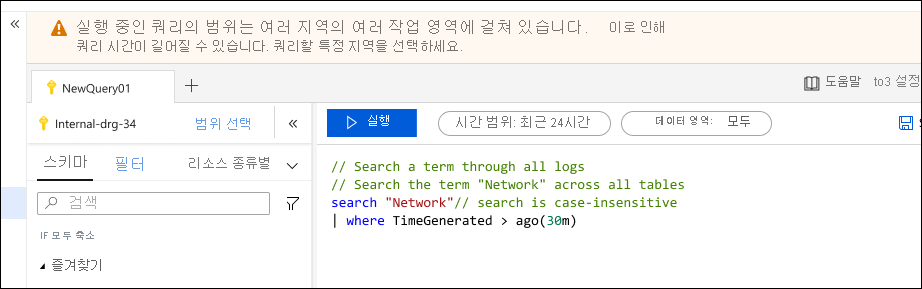
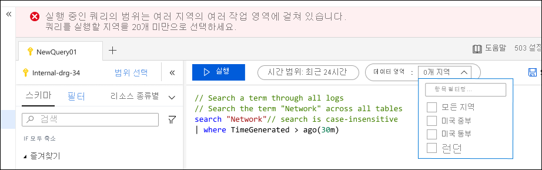

# Azure Monitor Log Analytics의 로그 쿼리 범위 및 시간 범위
[Azure Portal에서 Log Analytics](get-started-portal.md)에 [로그 쿼리](log-query-overview.md) 를 실행 하는 경우 쿼리에 의해 평가 되는 데이터 집합은 선택한 범위와 시간 범위에 따라 달라 집니다. 이 문서에서는 범위 및 시간 범위와 요구 사항에 따라 각 범위를 설정 하는 방법을 설명 합니다. 또한 다양 한 유형의 범위 동작을 설명 합니다.

## 쿼리 범위
쿼리 범위는 쿼리에 의해 평가 되는 레코드를 정의 합니다. 이는 일반적으로 단일 Log Analytics 작업 영역 또는 Application Insights 응용 프로그램의 모든 레코드를 포함 합니다. Log Analytics를 사용 하 여 모니터링 되는 특정 Azure 리소스에 대 한 범위를 설정할 수도 있습니다. 이렇게 하면 리소스가 여러 작업 영역에 기록 되는 경우에도 리소스 소유자가 해당 데이터에만 집중할 수 있습니다.

범위는 항상 Log Analytics 창의 왼쪽 위에 표시 됩니다. 아이콘은 범위가 Log Analytics 작업 영역 인지 또는 Application Insights 응용 프로그램 인지를 나타냅니다. 다른 Azure 리소스를 나타내는 아이콘이 없습니다.

범위는 Log Analytics를 시작 하는 데 사용 하는 방법에 따라 결정 되며, 경우에 따라 범위를 클릭 하 여 변경할 수 있습니다. 다음 표에서는 사용 되는 다양 한 종류의 범위와 각각에 대 한 다양 한 세부 정보를 나열 합니다.

> [!IMPORTANT]
> Application Insights에서 작업 영역 기반 응용 프로그램을 사용 하는 경우 해당 데이터는 다른 모든 로그 데이터가 포함 된 Log Analytics 작업 영역에 저장 됩니다. 이전 버전과의 호환성을 위해 응용 프로그램을 범위로 선택할 때 클래식 Application Insights 환경을 이용할 수 있습니다. Log Analytics 작업 영역에서이 데이터를 보려면 범위를 작업 영역으로 설정 합니다.

| 쿼리 범위 | 범위 내의 레코드 | 선택 방법 | 범위 변경 |
|:---|:---|:---|:---|
| Log Analytics 작업 영역 | Log Analytics 작업 영역에 있는 모든 레코드 | **Azure Monitor** 메뉴 또는 **Log Analytics 작업 영역** 메뉴에서 **로그** 를 선택 합니다.  | 범위를 다른 리소스 유형으로 변경할 수 있습니다. |
| Application Insights 애플리케이션 | Application Insights 응용 프로그램의 모든 레코드 | 응용 프로그램에 대 한 **Application Insights** 메뉴에서 **로그** 를 선택 합니다. | 범위만 다른 Application Insights 응용 프로그램으로 변경할 수 있습니다. |
| Resource group | 리소스 그룹의 모든 리소스에 의해 생성 된 레코드입니다. 여러 Log Analytics 작업 영역의 데이터를 포함할 수 있습니다. | 리소스 그룹 메뉴에서 **로그** 를 선택 합니다. | 범위를 변경할 수 없습니다.|
| Subscription | 구독의 모든 리소스에서 만든 레코드 여러 Log Analytics 작업 영역의 데이터를 포함할 수 있습니다. | 구독 메뉴에서 **로그** 를 선택 합니다.   | 범위를 변경할 수 없습니다. |
| 기타 Azure 리소스 | 리소스에서 만든 레코드입니다. 여러 Log Analytics 작업 영역의 데이터를 포함할 수 있습니다.  | 리소스 메뉴에서 **로그** 를 선택 합니다. 또는 **Azure Monitor** 메뉴에서 **로그** 를 선택 하 고 새 범위를 선택 합니다. | 범위만 동일한 리소스 유형으로 변경할 수 있습니다. |

### 리소스로 범위가 지정 된 경우의 제한 사항

쿼리 범위가 Log Analytics 작업 영역 또는 Application Insights 응용 프로그램 이면 포털의 모든 옵션과 모든 쿼리 명령을 사용할 수 있습니다. 그러나 리소스로 범위가 지정 된 경우 포털의 다음 옵션은 단일 작업 영역 또는 응용 프로그램과 연결 되어 있으므로 사용할 수 없습니다.

- 저장
- 쿼리 탐색기
- 새 경고 규칙

쿼리 범위는 해당 리소스 또는 리소스 집합에 대 한 데이터가 있는 작업 영역을 이미 포함 하 고 있으므로 리소스로 범위가 지정 된 경우 쿼리에서 다음 명령을 사용할 수 없습니다.

- [app](app-expression.md)
- [환경이](workspace-expression.md)
 

## 쿼리 범위 제한
리소스 또는 리소스 집합으로 범위를 설정 하는 것은 분산 된 데이터를 단일 쿼리로 자동으로 통합할 수 있기 때문에 Log Analytics의 특히 강력한 기능입니다. 여러 Azure 지역에 걸쳐 작업 영역에서 데이터를 검색 해야 하는 경우 성능에 큰 영향을 줄 수 있습니다.

Log Analytics를 사용 하면 특정 개수의 지역이 사용 되는 경우 경고 또는 오류를 발행 하 여 여러 지역에서 작업 영역을 확장 하는 쿼리에서 과도 한 오버 헤드를 방지할 수 있습니다. 범위에 5 개 이상의 지역에 있는 작업 영역이 포함 되어 있으면 쿼리에 경고가 표시 됩니다. 계속 실행 되지만 완료 하는 데 너무 많은 시간이 걸릴 수 있습니다.

범위가 20 개 이상의 지역에 있는 작업 영역을 포함 하는 경우 쿼리 실행이 차단 됩니다. 이 경우 작업 영역 수를 줄이고 쿼리 실행을 다시 시도 하 라는 메시지가 표시 됩니다. 드롭다운에는 쿼리 범위의 모든 지역이 표시 되 고, 쿼리 실행을 다시 시도 하기 전에 지역 수를 줄여야 합니다.

## 시간 범위
시간 범위는 레코드를 만든 시간을 기준으로 쿼리를 평가 하는 레코드 집합을 지정 합니다. 다음 표에 지정 된 대로 작업 영역 또는 응용 프로그램의 모든 레코드에 대해 **Timegenerated** 열에서 정의 됩니다. 클래식 Application Insights 응용 프로그램의 경우 시간 범위에 **타임 스탬프** 열이 사용 됩니다.

Log Analytics 창의 맨 위에 있는 시간 선택에서 시간 범위를 선택 하 여 설정 합니다.  미리 정의 된 기간을 선택 하거나 **사용자 지정** 을 선택 하 여 특정 시간 범위를 지정할 수 있습니다.

위의 테이블에 표시 된 것 처럼 표준 시간 열을 사용 하는 쿼리에 필터를 설정 하면 시간 선택이 **쿼리에서 설정** 으로 변경 되 고 시간 선택은 사용 하지 않도록 설정 됩니다. 이 경우 쿼리 맨 위에 필터를 배치 하는 것이 가장 효율적입니다. 그러면 모든 후속 처리에서 필터링 된 레코드만 사용 해야 합니다.

[작업 영역](workspace-expression.md) 또는 [앱](app-expression.md) 명령을 사용 하 여 다른 작업 영역 또는 클래식 응용 프로그램에서 데이터를 검색 하는 경우 시간 선택이 다르게 동작할 수 있습니다. 범위가 Log Analytics 작업 영역 일 때 **앱** 을 사용 하는 경우 또는 범위가 클래식 Application Insights 응용 프로그램이 고 **작업 영역** Log Analytics을 사용 하는 경우에는 필터에 사용 된 열이 시간 필터를 결정 하는 것을 알 수 없습니다.

다음 예에서는 범위가 Log Analytics 작업 영역으로 설정 되어 있습니다.  쿼리는 **작업 영역** 을 사용 하 여 다른 Log Analytics 작업 영역에서 데이터를 검색 합니다. 시간 선택은 예상 **Timegenerated** 열을 사용 하는 필터를 표시 하기 때문에 **쿼리에서 설정** 하도록 변경 됩니다.

쿼리에서 **앱** 을 사용 하 여 클래식 Application Insights 응용 프로그램에서 데이터를 검색 하는 경우에는 Log Analytics에서 필터의 **타임 스탬프** 열을 인식 하지 못하며 시간 선택이 변경 되지 않은 상태로 유지 됩니다. 이 경우 두 필터가 모두 적용 됩니다. 이 예제에서는 지난 24 시간 동안 생성 된 레코드만 **where** 절에서 7 일을 지정 하더라도 쿼리에 포함 됩니다.

## 다음 단계

- [Azure Portal에서 Log Analytics를 사용 하는 방법에 대 한 자습서](get-started-portal.md)를 안내 합니다.
- [쿼리 작성에 대 한 자습서](get-started-queries.md)를 안내 합니다.