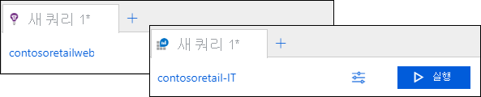
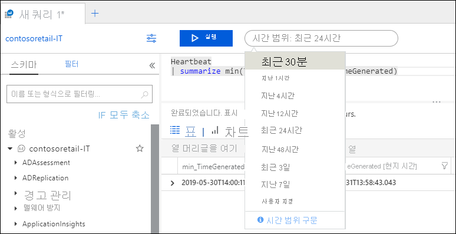
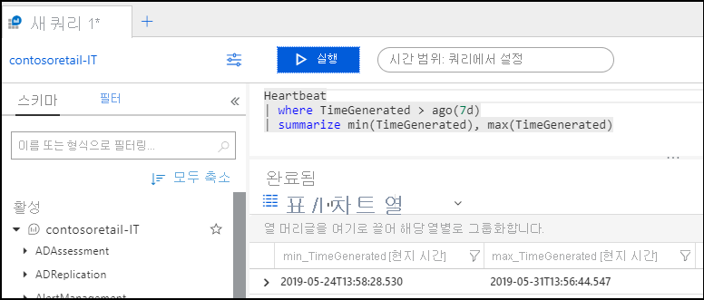
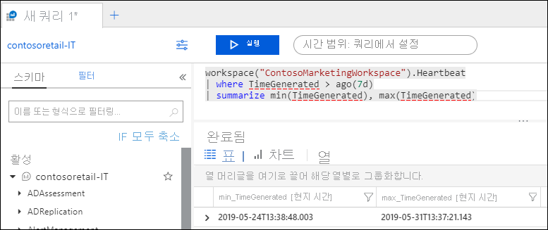
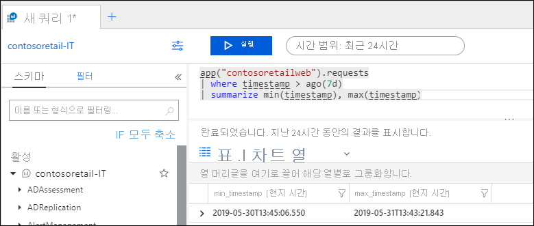

# Azure Monitor Log Analytics에서 로그 쿼리 범위 및 시간 범위
실행 하는 경우는 [로그 쿼리의](log-query-overview.md) 에 [Azure portal에서 Log Analytics](get-started-portal.md), 쿼리에서 계산 되는 데이터 집합 범위 및 선택한 시간 범위에 따라 달라 집니다. 이 문서에서 범위 및 시간 범위와 요구 사항에 따라 각를 설정 하는 방법을 설명 합니다. 또한 다양 한 범위의 동작을 설명합니다.

## 쿼리 범위
쿼리 범위 쿼리에서 계산 되는 레코드를 정의 합니다. 여기에 일반적으로 단일 Log Analytics 작업 영역 또는 Application Insights 응용 프로그램에서 모든 레코드를 포함 됩니다. 또한 log Analytics을 사용 하면 모니터링 되는 특정 Azure 리소스에 대 한 범위를 설정할 수 있습니다. 여러 작업 영역에 해당 리소스를 작성 하는 경우에 리소스 소유자를 데이터에만 집중할 수 있습니다.

범위는 항상 맨 위에 표시 되는 Log Analytics 창 왼쪽입니다. 아이콘을 Log Analytics 작업 영역 또는 Application Insights 응용 프로그램 범위 인지를 나타냅니다. 아이콘이 없는 다른 Azure 리소스를 나타냅니다.

범위를 사용 하 여 Log Analytics를 시작 하 고 일부 경우에서 클릭 하 여 범위를 변경할 수 메서드에 의해 결정 됩니다. 다음 표에서 다양 한 유형의 사용 되는 범위 및 각각에 대해 다른 세부 정보입니다.

| 쿼리 범위 | 범위에서 레코드 | 선택 하는 방법 | 범위 변경 |
|:---|:---|:---|:---|
| Log Analytics 작업 영역 | Log Analytics 작업 영역의 모든 레코드입니다. | 선택 **로그** 에서 합니다 **Azure Monitor** 메뉴 또는 **Log Analytics 작업 영역** 메뉴.  | 다른 리소스 유형 범위를 변경할 수 있습니다. |
| Application Insights 응용 프로그램 | Application Insights 응용 프로그램에서 모든 레코드입니다. | 선택 **Analytics** 에서 **개요** Application Insights의 페이지입니다. | 다른 Application Insights 응용 프로그램에 범위를 변경할 수만 있습니다. |
| 리소스 그룹 | 리소스 그룹의 모든 리소스를 만들어 기록 합니다. 여러 Log Analytics 작업 영역에서 데이터를 포함할 수 있습니다. | 선택 **로그** 리소스 그룹 메뉴에서. | 범위를 변경할 수 없습니다.|
| 구독 | 구독에서 모든 리소스를 만들어 기록 합니다. 여러 Log Analytics 작업 영역에서 데이터를 포함할 수 있습니다. | 선택 **로그** 구독 합니다.   | 범위를 변경할 수 없습니다. |
| 다른 Azure 리소스 | 리소스를 만들어 기록 합니다. 여러 Log Analytics 작업 영역에서 데이터를 포함할 수 있습니다.  | 선택 **로그** 리소스 메뉴에서. 또는 선택 **로그** 에서 합니다 **Azure Monitor** 메뉴 및 새 범위를 선택 합니다. | 동일한 리소스 형식으로 범위를 변경할 수만 있습니다. |

### 리소스에 범위가 지정 된 때의 제한 사항

쿼리 범위는 Log Analytics 작업 영역 또는 Application Insights 응용 프로그램 경우 포털에서 모든 옵션 및 모든 쿼리 명령을 사용할 수 있습니다. 단일 작업 영역 또는 응용 프로그램을 사용 하 여 연결 이기 때문에 사용할 수 없습니다는 포털에서 다음 옵션 하지만 리소스에 범위가 지정 하는 경우:

- 저장
- 쿼리 탐색기
- 새 경고 규칙

쿼리에 쿼리 범위는 해당 리소스 또는 리소스 집합에 대 한 데이터를 사용 하 여 모든 작업 영역을 포함 이미 있으므로 리소스에 범위가 지정 된 경우 다음 명령을 사용할 수 없습니다.

- [app](app-expression.md)
- [workspace](workspace-expression.md)
 

## 시간 범위
시간 범위에 레코드를 만들 때 기준으로 쿼리 평가 하는 레코드 집합을 지정 합니다. 다음 표에 지정한 대로 응용 프로그램을 작업 영역에서 모든 레코드의 표준 속성으로 정의 됩니다.

| Location | 자산 |
|:---|:---|
| Log Analytics 작업 영역          | TimeGenerated |
| Application Insights 응용 프로그램 | timestamp     |

Log Analytics 창의 맨 위에 있는 시간 선택기를 선택 하 여 시간 범위를 설정 합니다.  미리 정의 된 기간을 선택 하거나 선택할 수 있습니다 **사용자 지정** 특정 시간 범위를 지정 합니다.

시간 선택 변경 위의 표에 나와 있는 것 처럼 표준 시간 속성을 사용 하는 쿼리에 필터를 설정 하는 경우 **쿼리에서 설정**, 시간 선택기를 사용할 수 없습니다. 이 경우 모든 후속 처리만 필터링된 된 레코드를 사용 해야 할 수 있도록 쿼리의 맨 위에 있는 필터를 적용할 가장 효율적인 것입니다.

사용 하는 경우는 [작업 영역](workspace-expression.md) 하거나 [앱](app-expression.md) 다른 작업 영역 또는 응용 프로그램에서 데이터를 검색 하는 명령, 시간 선택기를 다르게 동작할 수 있습니다. 범위는 Log Analytics 작업 영역 및 사용할 경우 **앱**, 범위는 Application Insights 응용 프로그램을 사용 하는 경우 또는 **작업 영역**, Log Analytics에 사용 되는 속성을 이해 하지 못하는 다음 합니다 필터는 시간 필터를 확인 해야 합니다.

다음 예제에서는 범위는 Log Analytics 작업 영역에 설정 됩니다.  쿼리 사용 **작업 영역** 다른 Log Analytics 작업 영역에서 데이터를 검색 합니다. 시간 선택 변경 **쿼리에서 설정** 예상 되는 필터를 발견 하므로 **TimeGenerated** 속성입니다.

쿼리를 사용 하는 경우 **앱** Application Insights 응용 프로그램에서 데이터를 통해 검색 하려면 Log Analytics를 인식 하지 못하는 합니다 **타임 스탬프** 속성 필터 및 시간 선택에 그대로 유지 됩니다. 이 경우 두 필터가 적용 됩니다. 예제에서는 지난 24 시간 동안에서 생성 된 레코드만 포함 된 쿼리에서에서는 7 일 동안 지정 하는 경우에 합니다 **여기서** 절.

## 다음 단계

- 안내를 [Azure portal에서 Log Analytics를 사용 하 여 자습서](get-started-portal.md)합니다.
- 안내를 [쿼리 작성에 대 한 자습서](get-started-queries.md)합니다.