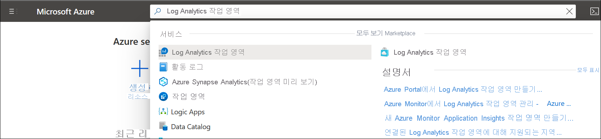

# Azure Portal에서 Log Analytics 작업 영역 만들기
**Log Analytics 작업 영역** 메뉴를 사용하여 Azure Portal에서 Log Analytics 작업 영역을 만듭니다. Log Analytics 작업 영역은 Azure Monitor 로그 데이터에 대한 고유한 환경입니다. 각 작업 영역에는 자체 데이터 리포지토리 및 구성이 있으며 데이터 원본 및 솔루션은 특정 작업 영역에 데이터를 저장하도록 구성됩니다. 다음 원본에서 데이터를 수집하려는 경우 Log Analytics 작업 영역이 필요합니다.

* 구독의 Azure 리소스
* System Center Operations Manager에서 모니터링하는 온-프레미스 컴퓨터
* Configuration Manager에서 디바이스 컬렉션 
* Azure Storage에서 진단 또는 로그 데이터

Azure VM 및 사용자 환경의 Windows 또는 Linux VM 등 다른 소스의 경우 다음 항목을 참조하세요.

*  [Azure 가상 머신에서 데이터 수집](../vm/quick-collect-azurevm.md) 
*  [하이브리드 Linux 컴퓨터에서 데이터 수집](../vm/quick-collect-linux-computer.md)
*  [하이브리드 Windows 컴퓨터에서 데이터 수집](../vm/quick-collect-windows-computer.md)

Azure 구독이 아직 없는 경우 시작하기 전에 [체험 계정](https://azure.microsoft.com/free/?WT.mc_id=A261C142F)을 만듭니다.

## Azure Portal에 로그인
[https://portal.azure.com](https://portal.azure.com)에서 Azure Portal에 로그인합니다. 

## 작업 영역 만들기
Azure Portal에서 **모든 서비스** 를 클릭합니다. 리소스 목록에서 **Log Analytics** 를 입력합니다. 입력을 시작하면 입력한 내용을 바탕으로 목록이 필터링됩니다. **Log Analytics 작업 영역** 을 선택합니다.

  
**추가** 를 클릭한 후 다음 옵션에 대한 값을 제공합니다.

   * 기본으로 선택된 값이 적절하지 않으면 드롭다운 목록에서 선택하여 연결할 **구독** 을 선택합니다.
   * **리소스 그룹** 의 경우 이미 설정된 기존 리소스 그룹을 사용하도록 선택하거나 새 리소스 그룹을 만듭니다.  
   * 새 **Log Analytics 작업 영역** 의 이름(예: *DefaultLAWorkspace*)을 지정합니다. 이 이름은 모든 Azure Monitor 구독에서 전역적으로 고유해야 합니다.
   * 사용 가능한 **지역** 을 선택합니다.  자세한 내용은 [Log Analytics 사용 가능 지역](https://azure.microsoft.com/regions/services/)을 참조하고 **제품 검색** 필드에서 Azure Monitor를 검색합니다.  

          

**검토 + 만들기** 를 클릭하여 설정을 검토한 다음, **만들기** 를 클릭하여 작업 영역을 만듭니다. 이렇게 하면 종량제의 기본 가격 책정 계층을 선택하여 충분한 양의 데이터 수집을 시작할 때까지 변경 내용이 발생하지 않습니다. 기타 가격 책정 계층에 대한 자세한 내용은 [Log Analytics 가격 책정 세부 정보](https://azure.microsoft.com/pricing/details/log-analytics/)를 참조하세요.

## 문제 해결
지난 14일 동안 삭제되어 [일시 삭제 상태](../logs/delete-workspace.md#soft-delete-behavior)인 작업 영역을 만들면 작업 영역 구성에 따라 작업의 결과가 달라질 수 있습니다.
1. 삭제된 작업 영역과 작업 영역 이름, 리소스 그룹, 구독 및 지역이 동일한 경우 해당 데이터, 구성 및 연결된 에이전트를 포함한 작업 영역이 복구됩니다.
2. 작업 영역 이름은 동일하지만 다른 리소스 그룹, 구독 또는 지역을 사용할 경우 *이 작업 영역 이름은 이미 사용 중입니다. 다른 이름을 시도하세요* 오류가 발생합니다. 일시 삭제를 재정의하고 작업 영역을 영구적으로 삭제하고 같은 이름으로 새 작업 영역을 만들려면 다음 단계를 수행하여 작업 영역을 먼저 복구한 후 영구 삭제를 수행합니다.
   - [작업 영역](../logs/delete-workspace.md#recover-workspace)을 복구합니다.
   - 작업 영역을 [영구 삭제](../logs/delete-workspace.md#permanent-workspace-delete)합니다.
   - 동일한 작업 영역 이름을 사용하여 새 작업 영역을 만듭니다.

## 다음 단계
이제 사용 가능한 작업 영역이 있으므로 모니터링 원격 분석의 컬렉션을 구성하고, 해당 데이터를 분석하는 로그 검색을 실행하고, 추가 데이터 및 분석 정보를 제공하는 관리 솔루션을 추가할 수 있습니다. 

* 작업 영역의 상태를 모니터링하는 경고 규칙 만들기 [Azure Monitor에서 Log Analytics 작업 영역의 모니터 상태](../logs/monitor-workspace.md)를 참조하세요. 
* Azure Diagnostics 또는 Azure 스토리지를 사용하여 Azure 리소스의 데이터 수집을 사용하려면 [Log Analytics에서 사용할 Azure 서비스 로그 및 메트릭 수집](../essentials/resource-logs.md#send-to-log-analytics-workspace)을 참조하세요.
