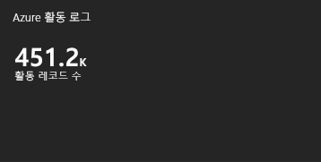
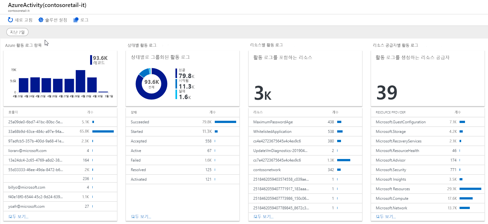

# Azure Monitor에서 Log Analytics 작업 영역에서 Azure 활동 로그 수집 및 분석
합니다 [Azure 활동 로그](activity-logs-overview.md) Azure 구독에서 발생 한 구독 수준 이벤트에 대 한 정보를 제공 합니다. 이 문서에서는 Log Analytics 작업 영역으로 활동 로그를 수집 하는 방법 및 Activity Log Analytics를 사용 하는 방법 설명 [모니터링 솔루션](../insights/solutions.md),이 데이터를 분석 하는 것에 대 한 로그 쿼리 및 뷰를 제공 하는 합니다. 

활동 로그를 Log Analytics 작업 영역에 연결 하는 다음과 같은 이점이 있습니다.

- 분석을 위해 하나의 위치에 여러 Azure 구독에서 활동 로그를 통합 합니다.
- 90 일 이상에 대 한 활동 로그 항목을 저장 합니다.
- Azure Monitor에서 수집한 기타 모니터링 데이터를 사용 하 여 활동 로그 데이터 상관 관계를 지정 합니다.
- 사용 하 여 [쿼리 로그](../log-query/log-query-overview.md) 복잡 한 분석을 수행 하 여 활동 로그 항목에 대 한 깊은 통찰력을 얻을 수 있습니다.

## Log Analytics 작업 영역에 연결
활동 로그를 하나의 작업 영역에 연결 될 수 있지만 단일 작업 영역을 동일한 Azure 테 넌 트에 여러 구독에 대 한 활동 로그에 연결할 수 있습니다. 여러 테 넌 트 컬렉션에 대 한 참조 [서로 다른 Azure Active Directory에서 구독의 Log Analytics 작업 영역으로 Azure 활동 로그 수집 테 넌 트](activity-log-collect-tenants.md)합니다.

활동 로그를 Log Analytics 작업 영역에 연결 하려면 다음 절차를 따르십시오.

1. **Log Analytics 작업 영역** 메뉴는 Azure 포털에서 활동 로그를 수집 하려면 작업 영역을 선택 합니다.
1. 에 **작업 영역 데이터 원본** workspace의 메뉴의 섹션 **Azure 활동 로그**합니다.
1. 연결 하려는 구독을 클릭 합니다.

    

1. 클릭 **Connect** 구독에서 활동 로그는 선택한 작업 영역에 연결 합니다. 구독에 이미 연결 되어 다른 작업 영역, 클릭 **연결 끊기** 먼저 연결을 끊습니다.

    

## Log Analytics 작업 영역에서 분석
항목 라는 테이블에 작업 영역에 쓰입니다 활동 로그를 Log Analytics 작업 영역에 연결할 때 **AzureActivity** 사용 하 여 검색할 수 있는 한 [로그 쿼리](../log-query/log-query-overview.md)합니다. 이 테이블의 구조에 따라 달라 집니다 합니다 [로그 엔트리의 범주](activity-logs-overview.md#categories-in-the-activity-log)합니다. 참조 [Azure 활동 로그 이벤트 스키마](activity-log-schema.md) 각 범주에 대 한 합니다.

## 활동 로그 분석 모니터링 솔루션
Azure Log Analytics 모니터링 솔루션에 여러 로그 쿼리 및 Log Analytics 작업 영역에 활동 로그 레코드를 분석 하는 것에 대 한 보기를 포함 합니다.

### 솔루션 설치
절차를 사용 [모니터링 솔루션을 설치할](../insights/solutions.md#install-a-monitoring-solution) 설치 하는 **Activity Log Analytics** 솔루션입니다. 필요한 추가 구성은 없습니다.

### 솔루션 사용
모니터링 솔루션에서 액세스 되는 **모니터** Azure portal의 메뉴. 선택 **자세한** 에 **Insights** 열려는 섹션의 **개요** 솔루션 타일을 사용 하 여 페이지. 합니다 **Azure 활동 로그** 타일 수가 수가 표시 됩니다 **AzureActivity** 영역의 레코드입니다.

클릭 합니다 **Azure 활동 로그** 열려는 타일 합니다 **Azure 활동 로그** 보기. 보기는 다음 표에 시각화 요소를 포함 합니다. 각 파트는 지정된 된 시간 범위에 대 한 해당 파트의 조건과 일치 하는 최대 10 개 항목을 나열 합니다. 클릭 하 여 모든 일치 하는 레코드를 반환 하는 로그 쿼리를 실행할 수 있습니다 **모두 보기** 파트의 맨 아래에 있습니다.

| 시각화 요소 | 설명 |
| --- | --- |
| Azure 활동 로그 항목 | 상위 10 개 활동 호출자 목록을 표시 및 선택한 날짜 범위에 대 한 레코드 합계 상위 Azure 활동 로그 항목의 가로 막대형 차트를 보여 줍니다. 가로 막대형 차트를 클릭하면 `AzureActivity`에 대한 로그 검색이 실행됩니다. 해당 항목에 대 한 모든 활동 로그 항목을 반환 하는 로그 검색을 실행 하려면 호출자에 게 항목을 클릭 합니다. |
| 상태별 활동 로그 | 상위 10 개 상태 레코드 목록 및 선택한 날짜 범위에 대 한 Azure 활동 로그 상태의 도넛형 차트를 보여 줍니다. 에 대 한 로그 쿼리를 실행 하려면 차트를 클릭 `AzureActivity | summarize AggregatedValue = count() by ActivityStatus`합니다. 해당 상태 레코드에 대 한 모든 활동 로그 항목을 반환 하는 로그 검색을 실행 하는 상태 항목을 클릭 합니다. |
| 리소스별 활동 로그 | 활동 로그를 사용 하 여 리소스의 총 수를 표시 하 고 각 리소스에 대 한 10 개 리소스 레코드를 사용 하 여 계산 맨을 나열 합니다. 전체 영역을 클릭하여 `AzureActivity | summarize AggregatedValue = count() by Resource`에 대해 로그 검색을 실행하면 솔루션에 사용할 수 있는 모든 Azure 리소스가 표시됩니다. 해당 리소스에 대 한 모든 활동 레코드를 반환 하는 로그 쿼리를 실행 하는 리소스를 클릭 합니다. |
| 리소스 공급자별 활동 로그 | 활동 로그를 생성 하는 리소스 공급자의 총 수를 표시 하 고 상위 10 개의 나열 합니다. 전체 영역에 대 한 로그 쿼리를 실행 하려면 클릭 `AzureActivity | summarize AggregatedValue = count() by ResourceProvider`, 모든 Azure 리소스 공급자가 표시 됩니다. 공급자에 대 한 모든 활동 레코드를 반환 하는 로그 쿼리를 실행 하려면 리소스 공급자를 클릭 합니다. |

## 다음 단계

- 에 대 한 자세한 정보는 [활동 로그](activity-logs-overview.md)합니다.
- 에 대 한 자세한 정보는 [Azure Monitor 데이터 플랫폼](data-platform.md)합니다.
- 사용 하 여 [쿼리 로그](../log-query/log-query-overview.md) 활동 로그에서 자세한 정보를 볼 수 있습니다.
