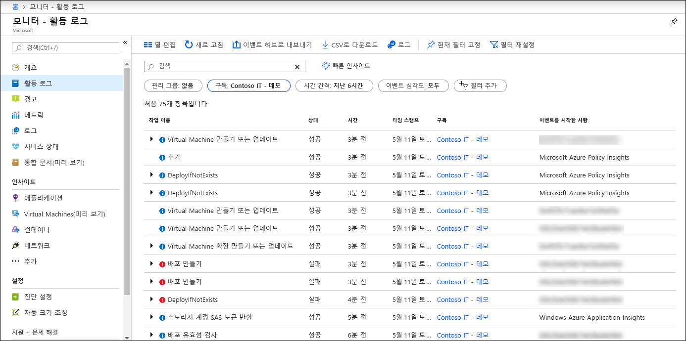
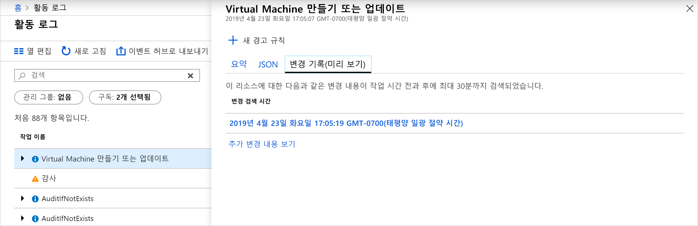
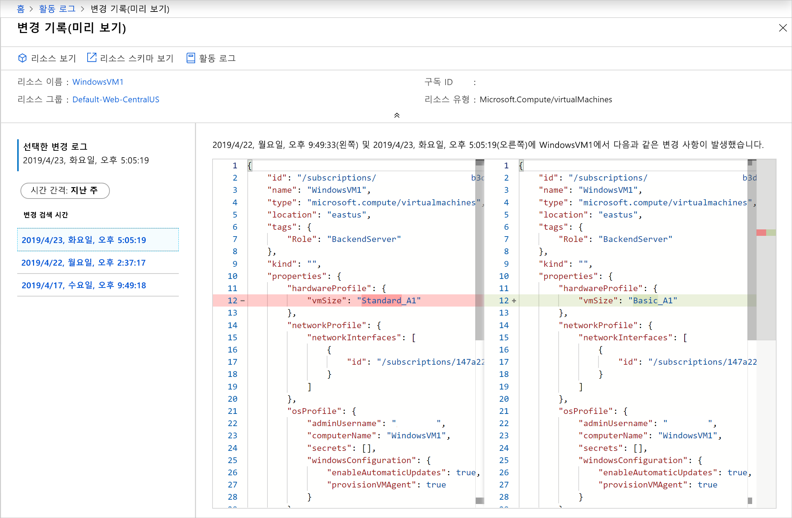

# <a name="view-and-retrieve-azure-activity-log-events"></a>보기 및 Azure 활동 로그 이벤트를 검색 합니다.

합니다 [Azure 활동 로그](activity-logs-overview.md) Azure 동안 발생 한 구독 수준 이벤트에 대 한 정보를 제공 합니다. 이 문서 보기 및 활동 로그 이벤트를 검색에 대 한 다양 한 방법에 자세하게 설명 합니다.

## <a name="azure-portal"></a>Azure portal
모든 리소스에 대 한 활동 로그를 보려면 합니다 **모니터** Azure portal의 메뉴. 특정 리소스에 대 한 활동 로그를 보려면 합니다 **활동 로그** 해당 리소스 메뉴의 옵션입니다.



다음 필드를 통해 활동 로그 이벤트를 필터링 할 수 있습니다.

* **Timespan**: 이벤트에 대 한 시작 및 종료 시간입니다.
* **범주**: 이벤트 범주에 설명 된 대로 [활동 로그의 범주](activity-logs-overview.md#categories-in-the-activity-log)합니다.
* **구독**: 하나 이상의 Azure 구독 이름입니다.
* **리소스 그룹**: 선택한 구독 내에서 하나 이상의 리소스 그룹입니다.
* **리소스 (이름)** :-특정 리소스의 이름입니다.
* **리소스 종류**: 예를 들어 리소스의 종류 _microsoft.compute/virtualmachines_합니다.
* **작업 이름** -예를 들어, Azure Resource Manager 작업의 이름을 _Microsoft.SQL/servers/Write_합니다.
* **심각도**: 이벤트의 심각도 수준입니다. 사용 가능한 값은 _Informational_를 _경고_를 _오류_를 _위험_합니다.
* **이벤트를 시작한 사람**: 작업을 수행한 사용자입니다.
* **검색 열기**: 모든 이벤트의 모든 필드에서 해당 문자열을 검색 하는 텍스트 검색 상자를 엽니다.

### <a name="view-change-history"></a>변경 기록 보기

활동 로그를 검토 하는 경우 도움이 변경 하는 동안 발생 하는 한 해당 이벤트 시간입니다. 이 정보를 볼 수 있습니다 **변경 내용**합니다. 에 대 한 자세한 확인 하려는 활동 로그에서 이벤트를 선택 합니다. 선택 된 **변경 내용 (미리 보기)** 탭을 보려면 해당 이벤트를 사용 하 여 변경 내용을 연결 합니다.



이벤트와 연결 된 변경의 경우 선택할 수 있는 변경 내용 목록이 표시 됩니다. 열립니다는 **변경 내용 (미리 보기)** 페이지입니다. 이 페이지는 리소스 변경 내용을 볼 수 있습니다. 다음 예제에서 보듯이에서는 VM 크기, 하지만 변경 전의 이전 VM 크기 및에 변경 된 내용을 변경 되었는지 확인할 수 있습니다.



변경 내용에 대 한 자세한 내용은 참조 하세요 [리소스 변경 내용을 가져오려면](../../governance/resource-graph/how-to/get-resource-changes.md)합니다.


## <a name="log-analytics-workspace"></a>Log Analytics 작업 영역
클릭 **로그** 맨 위에 있는 **활동 로그** 페이지를 열려면 합니다 [Activity Log Analytics 모니터링 솔루션](activity-log-collect.md) 구독에 대 한 합니다. 이렇게 하면 보기의 활동 로그에 대 한 분석을 실행할 수 [쿼리를 로깅](../log-query/log-query-overview.md) 사용 하 여 합니다 **AzureActivity** 테이블. 활동 로그는 Log Analytics 작업 영역에 연결 되지 않은, 경우이 구성을 수행 하 라는 메시지가 표시 됩니다.


## <a name="powershell"></a>PowerShell
사용 된 [Get AzLog](https://docs.microsoft.com/powershell/module/az.monitor/get-azlog) PowerShell에서 활동 로그를 검색 하기 위한 cmdlet입니다. 다음은 몇 가지 일반적인 예입니다.

> [!NOTE]
> `Get-AzLog` 명령은 15일 간의 기록만 제공합니다. 사용 된 **-MaxEvents** 매개 변수를 15 일 이후의 n 개 이벤트를 쿼리 합니다. 15 일 보다 오래 된 이벤트에 액세스 하려면 REST API 또는 SDK를 사용 합니다. **StartTime**을 포함하지 않으면 **EndTime**에서 1시간을 뺀 값이 기본값입니다. **EndTime**을 포함하지 않으면 현재 시간이 기본값입니다. 모든 시간은 UTC입니다.


특정 날짜 이후에 생성 된 로그 항목을 가져옵니다.

```powershell
Get-AzLog -StartTime 2016-03-01T10:30
```

날짜 시간 범위의 로그 항목을 가져옵니다.

```powershell
Get-AzLog -StartTime 2015-01-01T10:30 -EndTime 2015-01-01T11:30
```

특정 리소스 그룹에서 로그 항목을 가져옵니다.

```powershell
Get-AzLog -ResourceGroup 'myrg1'
```

날짜 / 시간 범위 간의 특정 리소스 공급자에서 로그 항목을 가져옵니다.

```powershell
Get-AzLog -ResourceProvider 'Microsoft.Web' -StartTime 2015-01-01T10:30 -EndTime 2015-01-01T11:30
```

특정 호출자를 사용 하 여 로그 항목을 가져옵니다.

```powershell
Get-AzLog -Caller 'myname@company.com'
```

최근 1,000 개 이벤트를 가져옵니다.

```powershell
Get-AzLog -MaxEvents 1000
```


## <a name="cli"></a>CLI
사용 하 여 [az monitor 활동 로그](cli-samples.md#view-activity-log-for-a-subscription) 하려면 CLI에서 활동 로그를 검색 합니다. 다음은 몇 가지 일반적인 예입니다.


사용 가능한 모든 옵션을 확인 합니다.

```azurecli
az monitor activity-log list -h
```

특정 리소스 그룹에서 로그 항목을 가져옵니다.

```azurecli
az monitor activity-log list --resource-group <group name>
```

특정 호출자를 사용 하 여 로그 항목을 가져옵니다.

```azurecli
az monitor activity-log list --caller myname@company.com
```

날짜 범위 내 리소스 유형에 대 한 호출자 별 로그를 가져옵니다.

```azurecli
az monitor activity-log list --resource-provider Microsoft.Web \
    --caller myname@company.com \
    --start-time 2016-03-08T00:00:00Z \
    --end-time 2016-03-16T00:00:00Z
```

## <a name="rest-api"></a>REST API
사용 된 [Azure Monitor REST API](https://docs.microsoft.com/rest/api/monitor/) REST 클라이언트에서 활동 로그를 검색 하려면. 다음은 몇 가지 일반적인 예입니다.

필터를 사용 하 여 활동 로그를 가져옵니다.

``` HTTP
GET https://management.azure.com/subscriptions/089bd33f-d4ec-47fe-8ba5-0753aa5c5b33/providers/microsoft.insights/eventtypes/management/values?api-version=2015-04-01&$filter=eventTimestamp ge '2018-01-21T20:00:00Z' and eventTimestamp le '2018-01-23T20:00:00Z' and resourceGroupName eq 'MSSupportGroup'
```

선택한 필터를 사용 하 여 활동 로그를 가져옵니다.

```HTTP
GET https://management.azure.com/subscriptions/089bd33f-d4ec-47fe-8ba5-0753aa5c5b33/providers/microsoft.insights/eventtypes/management/values?api-version=2015-04-01&$filter=eventTimestamp ge '2015-01-21T20:00:00Z' and eventTimestamp le '2015-01-23T20:00:00Z' and resourceGroupName eq 'MSSupportGroup'&$select=eventName,id,resourceGroupName,resourceProviderName,operationName,status,eventTimestamp,correlationId,submissionTimestamp,level
```

Select를 사용 하 여 활동 로그를 가져옵니다.

```HTTP
GET https://management.azure.com/subscriptions/089bd33f-d4ec-47fe-8ba5-0753aa5c5b33/providers/microsoft.insights/eventtypes/management/values?api-version=2015-04-01&$select=eventName,id,resourceGroupName,resourceProviderName,operationName,status,eventTimestamp,correlationId,submissionTimestamp,level
```

필터 또는 선택 하지 않고 활동 로그를 가져옵니다.

```HTTP
GET https://management.azure.com/subscriptions/089bd33f-d4ec-47fe-8ba5-0753aa5c5b33/providers/microsoft.insights/eventtypes/management/values?api-version=2015-04-01
```


## <a name="next-steps"></a>다음 단계

* [활동 로그 개요 읽기](activity-logs-overview.md)
* [Storage에 활동 로그 보관 또는 Event Hubs로 스트림](activity-log-export.md)
* [Azure 활동 로그를 Event Hubs로 스트림](activity-logs-stream-event-hubs.md)
* [저장소에 Azure 활동 로그 보관](archive-activity-log.md)

