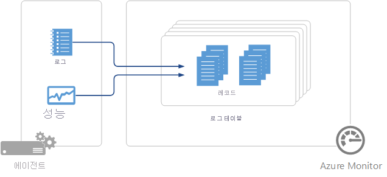

# Azure Monitor의 에이전트 데이터 원본
Azure Monitor가 에이전트에서 수집하는 데이터는 구성한 데이터 원본에 의해 정의됩니다.  에이전트의 데이터는 레코드 세트를 사용하여 [로그 데이터](data-platform-logs.md)로 저장됩니다.  각 데이터 원본은 각각 고유한 속성 집합이 있는 특정 유형의 레코드를 만듭니다.

## 데이터 원본 요약
다음 표에는 현재 Azure Monitor에서 사용할 수 있는 에이전트 데이터 원본이 나와 있습니다.  각각 해당 데이터 원본에 대한 세부 정보를 제공하는 별도의 문서에 대한 링크가 있습니다.   수집 방법 및 빈도에 대한 정보도 제공합니다. 

| 데이터 원본 | 플랫폼 | Microsoft Monitoring Agent | Operations Manager 에이전트 | Azure 저장소 | Operations Manager 필요 여부 | 관리 그룹을 통해 전송되는 Operations Manager 에이전트 데이터 | 수집 빈도 |
| --- | --- | --- | --- | --- | --- | --- | --- |
| [사용자 지정 로그](data-sources-custom-logs.md) | Windows |&#8226; |  | |  |  | 도착 시 |
| [사용자 지정 로그](data-sources-custom-logs.md) | Linux   |&#8226; |  | |  |  | 도착 시 |
| [IIS 로그](data-sources-iis-logs.md) | Windows |&#8226; |&#8226; |&#8226; |  |  |로그 파일 롤오버 설정에 따라 다름 |
| [성능 카운터](data-sources-performance-counters.md) | Windows |&#8226; |&#8226; |  |  |  |예약된 대로, 최소 10초 |
| [성능 카운터](data-sources-performance-counters.md) | Linux |&#8226; |  |  |  |  |예약된 대로, 최소 10초 |
| [Syslog](data-sources-syslog.md) | Linux |&#8226; |  |  |  |  |Azure Storage: 10분, 에이전트: 도착 시 |
| [Windows 이벤트 로그](data-sources-windows-events.md) |Windows |&#8226; |&#8226; |&#8226; |  |&#8226; | 도착 시 |

## 데이터 원본 구성
작업 영역에 대한 **고급 설정**의 **데이터** 메뉴에서 데이터 원본을 구성합니다.  모든 구성은 작업 영역의 모든 연결된 원본으로 전달됩니다.  현재 이 구성에서 에이전트를 제외할 수는 없습니다.

1. Azure Portal에서 **Log Analytics 작업 영역** > 작업 영역 > **고급 설정**을 선택합니다.
2. **데이터**를 선택합니다.
3. 구성할 데이터 원본을 클릭합니다.
4. 해당 구성에 대한 세부 정보를 보려면 위 표에서 각 데이터 원본에 대한 설명서 링크를 따릅니다.

## 데이터 수집
데이터 원본 구성은 몇 분 이내에 Azure Monitor에 직접 연결된 에이전트로 전달됩니다.  지정된 데이터는 에이전트에서 수집되어 각 데이터 원본에 특정한 간격으로 Azure Monitor에 직접 전달됩니다.  이러한 세부 사항은 각 데이터 원본에 대한 설명서를 참조하세요.

연결된 관리 그룹 내 System Center Operations Manager 에이전트의 경우 데이터 원본 구성은 관리 팩으로 변환되어 기본적으로 5분마다 관리 그룹에 전달됩니다.  에이전트는 일반적인 방식으로 관리 팩을 다운로드하고 지정된 데이터를 수집합니다. 데이터 원본에 따라, 데이터가 관리 서버로 전송된 다음 관리 서버가 Azure Monitor로 데이터를 전달하거나 에이전트가 관리 서버를 통하지 않고 Azure Monitor로 데이터를 전송합니다. 자세한 내용은 [Azure의 모니터링 솔루션에 대한 데이터 수집 세부 정보](../insights/solutions-inventory.md)를 참조하세요.  Operations Manager와 Azure Monitor의 연결 및 구성 전달 주기 수정에 대한 자세한 내용은 [System Center Operations Manager와의 통합 구성](om-agents.md)에서 확인할 수 있습니다.

에이전트는 Azure Monitor 또는 Operations Manager에 연결할 수 없으면 데이터를 계속 수집하다가 연결이 설정되면 데이터를 전달합니다.  데이터 양이 클라이언트의 최대 캐시 크기에 도달하거나 에이전트가 24시간 내에 연결을 설정할 수 없는 경우 데이터가 손실될 수 있습니다.

## 로그 레코드
Azure Monitor에서 수집된 모든 로그 데이터는 작업 영역에 레코드로 저장됩니다.  여러 데이터 원본에서 수집된 레코드는 고유한 속성 집합이 있으며 해당 **Type** 속성으로 식별됩니다.  각 레코드 유형에 대한 자세한 내용은 각 데이터 원본 및 솔루션에 대한 설명서를 참조하세요.

## 다음 단계
* Azure Monitor에 기능을 추가하고 작업 영역으로 데이터를 수집하는 [모니터링 솔루션](../insights/solutions.md)에 대해 알아봅니다.
* 데이터 원본 및 모니터링 솔루션에서 수집한 데이터를 분석하는 [로그 쿼리](../log-query/log-query-overview.md)에 대해 알아봅니다.  
* 데이터 원본 및 모니터링 솔루션에서 수집된 중요한 데이터를 사전에 알리도록 [경고](alerts-overview.md)를 구성합니다.