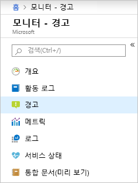
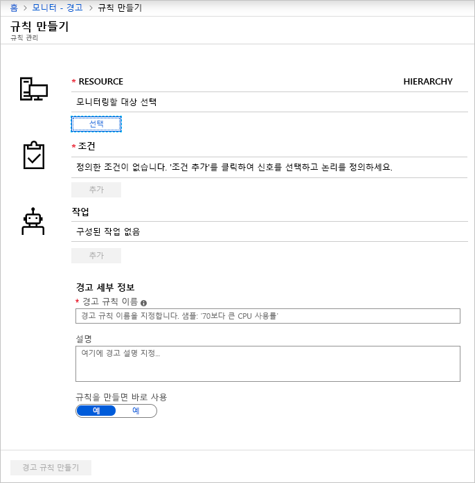
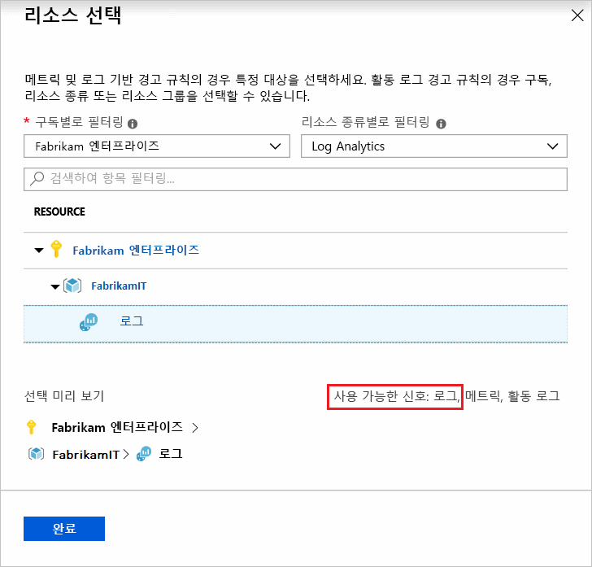
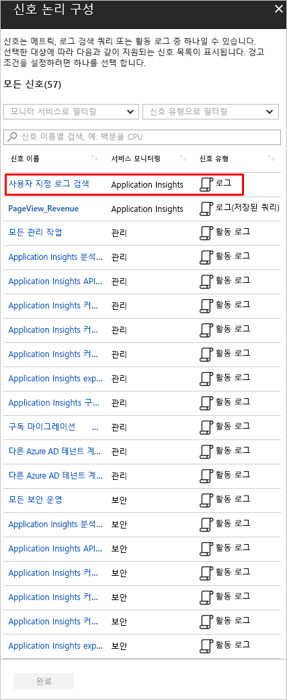
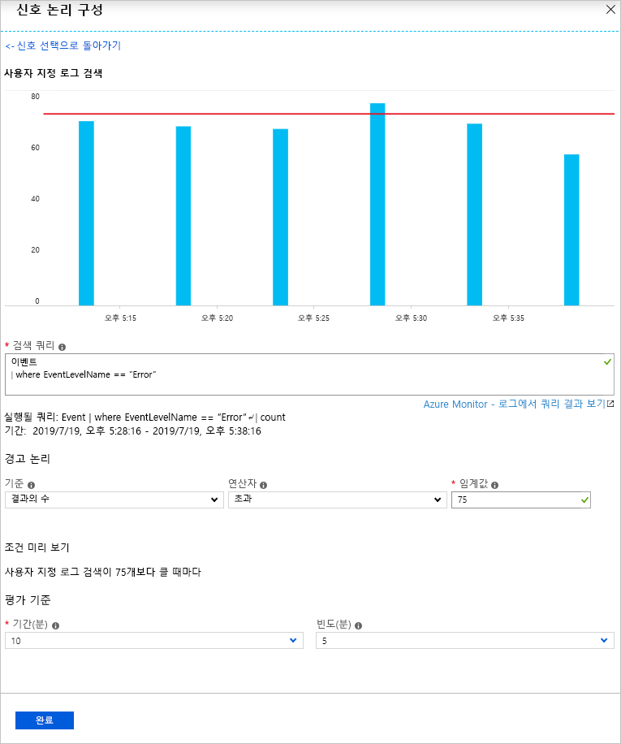
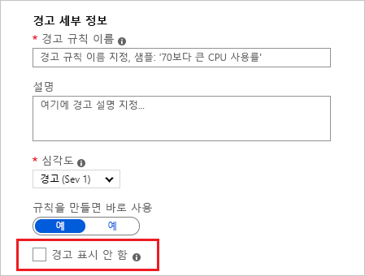
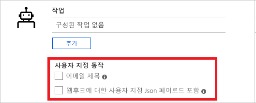
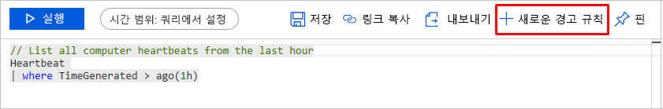

# <a name="create-view-and-manage-log-alerts-using-azure-monitor"></a>Azure Monitor를 사용하여 로그 경고 만들기, 보기 및 관리

## <a name="overview"></a>개요
이 문서에서는 Azure Portal 내에서 경고 인터페이스를 사용하여 로그 경고를 설정하는 방법을 보여줍니다. 경고 규칙의 정의는 세 부분으로 이루어져 있습니다.
- 대상: 모니터링될 특정 Azure 리소스
- 조건: 신호에서 표시될 때 작업을 트리거해야 하는 특정 조건 또는 논리
- 작업: 알림의 받는 사람에게 보내는 특정 호출 - 이메일, SMS, 웹후크 등

[Log Analytics 작업 영역](../learn/tutorial-viewdata.md) 또는 [Application Insights](../app/analytics.md)에서 신호가 로그 쿼리 인 경고를 설명 하는 용어 **로그 경고** 입니다. [로그 경고 - 개요](alerts-unified-log.md)에서 기능, 용어 및 형식에 대해 자세히 알아보세요.

> [!NOTE]
> 이제 [Log Analytics 작업 영역의](../../azure-monitor/learn/tutorial-viewdata.md) 인기 있는 로그 데이터를 Azure Monitor의 메트릭 플랫폼 에서도 사용할 수 있습니다. 세부 정보 보기는 [로그에 대한 메트릭 경고](alerts-metric-logs.md)를 참조하세요.

## <a name="managing-log-alerts-from-the-azure-portal"></a>Azure Portal에서 로그 경고 관리

자세한 다음 내용은 Azure Portal 인터페이스를 통해 로그 경고를 사용하기 위한 단계별 가이드입니다.

### <a name="create-a-log-alert-rule-with-the-azure-portal"></a>Azure Portal을 통해 로그 경고 규칙 만들기

1. [포털](https://portal.azure.com/)에서 **모니터**를 선택하고 모니터 섹션 아래에서 **경고**를 선택합니다.

    

1. **새 경고 규칙** 단추를 선택하여 Azure에서 새 경고를 만듭니다.

    

1. 경고 만들기 섹션은 *경고 조건 정의*, *경고 세부 정보 정의* 및 *작업 그룹 정의*로 구성된 세 부분으로 표시됩니다.

    

1. **리소스 선택** 링크를 사용하고 리소스를 선택하여 대상을 지정하여 경고 조건을 정의합니다. _구독_, _리소스 종류_ 및 필요한 _리소스_를 선택하여 필터링합니다.

   > [!NOTE]
   > 로그 경고 만들기의 경우 진행하기 전에 선택한 리소스에 대해 사용 가능한 **로그** 신호를 확인합니다.
   >  

1. *로그 경고*: **리소스 종류**가 *Log Analytics* 또는 *Application Insights*와 같은 분석 원본이고 신호 유형이 **로그**인지 확인한 다음, 적절한 **리소스가** 선택되면 *완료*를 클릭합니다. 다음으로 **조건 추가** 단추를 사용하여 리소스 및 **Log Analytics** 또는 *Application Insights*와 같은 선택된 로그 모니터 서비스에 대한 신호 목록 *사용자 지정 로그 검색* 옵션에서 사용할 수 있는 신호 옵션 목록을 봅니다.

   

   > [!NOTE]
   > 
   > 경고 목록은 위 그림과 같이 분석 쿼리를 신호 유형 - **로그(저장된 쿼리)** 로 가져올 수 있습니다. 따라서 사용자는 분석에서 쿼리를 완벽 하 게 수행한 다음 나중에 사용 하기 위해 저장할 수 있습니다. 자세한 내용은 [application insights 분석의 Azure Monitor 또는 공유 쿼리](../app/app-insights-overview.md)를 [사용 하 여 로그 쿼리](../log-query/log-query-overview.md) 를 사용 하 여 사용 가능한 쿼리 저장을 참조 하세요.

1. *로그 경고*: 선택한 후에 경고에 대한 쿼리를 **검색 쿼리** 필드에서 정의할 수 있습니다. 쿼리 구문이 올바르지 않을 경우 필드는 빨간색으로 오류를 표시합니다. 쿼리 구문이 올바른 경우 참조를 위해 정의된 쿼리의 기록 데이터가 마지막 6시간에서 지난 주까지 시간 창을 조정하는 옵션과 함께 그래프로 표시됩니다.

    

   > [!NOTE]
   > 
   > 쿼리 결과에 시간 세부 정보가 있는 경우 기록 데이터 시각화만 표시될 수 있습니다. 쿼리 결과가 요약된 데이터 또는 특정 열 값인 경우 단일 플롯으로 동일하게 표시됩니다.
   > Application insights를 사용하거나 [새 API로 전환된](alerts-log-api-switch.md) 로그 경고의 메트릭 측정 유형의 경우 아래에 설명된 대로 **집계** 옵션을 사용하여 데이터를 그룹화하는 특정 변수를 지정할 수 있습니다.
   > 
   > 

1. *로그 경고*: 준비된 시각화를 사용하여 조건, 집계 및 마지막으로 임계값의 표시된 옵션에서 **경고 논리**를 선택할 수 있습니다. 마지막으로 논리에서 **기간** 옵션을 사용하여 지정된 조건에 대해 평가할 시간을 지정합니다. **빈도**를 선택하여 경고를 실행해야 하는 빈도를 지정합니다. **로그 경고**는 다음을 기반으로 할 수 있습니다.
    - [레코드 수](../../azure-monitor/platform/alerts-unified-log.md#number-of-results-alert-rules): 쿼리에서 반환된 레코드의 개수가 제공된 값보다 큰 또는 값보다 작은 경우 경고가 생성됩니다.
    - [메트릭 측정](../../azure-monitor/platform/alerts-unified-log.md#metric-measurement-alert-rules): 결과에서 각 *집계 값*이 제공된 임계값을 초과하고 선택한 값*으로 그룹화*되는 경우 경고가 생성됩니다. 경고에 대한 위반 수는 임계값이 선택한 기간에서 초과된 횟수입니다. 결과 집합에서 모든 위반의 조합에 대해 총 위반을 지정하거나 연속 위반을 지정하여 연속된 샘플에서 위반이 발생해야 한다고 요구할 수 있습니다.


1. 두 번째 단계로 제공된 옵션에서 경고 및 **심각도**에 대한 세부 사항을 자세히 설명하는 **설명**과 함께 **경고 규칙 이름** 필드에서 경고에 대한 이름을 정의합니다. 이러한 세부 정보는 모든 경고 이메일, 알림 또는 Azure Monitor에 의해 수행되는 푸시에서 다시 사용됩니다. 또한 사용자는 **규칙을 만들면 바로 사용** 옵션을 적절히 설정/해제하여 생성 시 경고 규칙을 즉시 활성화하도록 선택할 수 있습니다.

    **로그 경고**의 경우 몇 가지 추가 기능을 경고 정보에 사용할 수 있습니다.

    - **경고 표시 안 함**: 경고 규칙 표시 안 함 기능을 켜면 규칙에 대한 작업이 새 경고를 만든 후 정의된 기간 동안 비활성화됩니다. 규칙은 여전히 실행되고 있으며 조건을 만족하면 경고 레코드를 생성합니다. 중복 작업을 실행하지 않고 문제를 해결할 시간 여유를 갖게 됩니다.

        

        > [!TIP]
        > 중첩 없이 알림이 중지되도록 경고 표시 안 함의 값을 경고의 빈도보다 큰 값으로 지정

1. 세 번째이자 마지막 단계로 경고 조건이 충족될 때 경고 규칙에 대해 **작업 그룹**을 트리거해야 하는지를 지정합니다. 경고와 함께 모든 기존 작업 그룹을 선택하거나 새 작업 그룹을 만들 수 있습니다. 선택한 작업 그룹에 따라 경고가 트리거될 때 Azure는 이메일을 보내고, SMS를 보내고, 웹후크를 호출하고, Azure Runbook을 사용하여 수정하고, ITSM 도구에 푸시하는 등의 작업을 수행합니다. [작업 그룹](action-groups.md)에 대해 자세히 알아보세요.

    > [!NOTE]
    > [Azure 구독 서비스 제한](../../azure-resource-manager/management/azure-subscription-service-limits.md)에서 Azure 작업 그룹을 통해 로그 경고에 대해 트리거된 Runbook 페이로드의 제한을 참조하세요.

    **로그 경고**의 경우 기본 작업을 재정의하는 데 몇 가지 추가 기능을 사용할 수 있습니다.

    - **이메일 알림**: 언급된 작업 그룹에 하나 이상의 이메일 작업이 있는 경우 작업 그룹을 통해 전송된 이메일의 *이메일 제목*을 재정의합니다. 메일 본문은 수정할 수 없으며, 이 필드는 이메일 주소에 대한 필드가 **아닙니다**.
    - **사용자 지정 Json 페이로드 포함**: 언급된 작업 그룹에 하나 이상의 웹후크 작업이 있는 경우 작업 그룹에서 사용하는 웹후크 JSON을 재정의합니다. 사용자는 관련된 작업 그룹에 구성된 모든 웹후크에 사용할 JSON 형식을 지정할 수 있습니다. 웹후크 형식에 대한 자세한 내용은 [로그 경고에 대한 웹후크 작업](../../azure-monitor/platform/alerts-log-webhook.md)을 참조하세요. 샘플 JSON 데이터를 사용하여 형식을 검사할 수 있는 Webhook 보기 옵션이 제공됩니다.

        


1. 모든 필드가 유효하고 녹색 틱인 경우 **경고 규칙 만들기** 단추를 클릭할 수 있으며 Azure Monitor - 경고에서 경고가 생성됩니다. 경고 대시보드에서 모든 경고를 볼 수 있습니다.

     

     앞서 설명한 대로 몇 분 안에 경고가 활성화 및 트리거됩니다.

또한 사용자는 [log analytics](../log-query/portals.md) 에서 분석 쿼리를 마무리 한 다음이를 푸시하여 ' 경고 설정 ' 단추를 통해 경고를 만든 다음, 위의 자습서에 있는 6 단계의 지침에 따라 경고를 만들 수 있습니다.

 

### <a name="view--manage-log-alerts-in-azure-portal"></a>Azure Portal에서 로그 경고 보기 및 관리

1. [포털](https://portal.azure.com/)에서 **모니터**를 선택하고 모니터 섹션 아래에서 **경고**를 선택합니다.

1. **경고 대시보드**가 표시됩니다. 여기에는 로그 경고 규칙이 발생한 모든 인스턴스를 포함하여 모든 Azure 경고(로그 경고 포함)가 단일 보드에 표시됩니다. 자세한 내용은 [경고 관리](https://aka.ms/managealertinstances)를 참조하세요.
    > [!NOTE]
    > 로그 경고 규칙은 사용자가 제공한 사용자 지정 쿼리 기반 논리로 구성되므로 확인된 상태를 사용하지 않습니다. 로그 경고 규칙에 지정된 조건이 충족되므로 해당 경고 규칙이 발생합니다.

1. 위쪽 표시줄에서 **규칙 관리** 단추를 선택하여 규칙 관리 섹션으로 이동합니다. 여기에 비활성화된 경고를 포함한 만들어진 모든 경고 규칙이 나열됩니다.
    

## <a name="managing-log-alerts-using-azure-resource-template"></a>Azure 리소스 템플릿을 사용하여 로그 경고 관리

Azure Monitor의 로그 경고는 리소스 유형 `Microsoft.Insights/scheduledQueryRules/`와 연결되어 있습니다. 이 리소스 종류에 대한 자세한 내용은 [Azure Monitor - 예약된 쿼리 규칙 API 참조](https://docs.microsoft.com/rest/api/monitor/scheduledqueryrules/)를 참조하세요. Application Insights 또는 Log Analytics에 대한 로그 경고는 [예약된 쿼리 규칙 API](https://docs.microsoft.com/rest/api/monitor/scheduledqueryrules/)를 사용하여 만들 수 있습니다.

> [!NOTE]
> Log Analytics에 대한 로그 경고는 레거시 [Log Analytics 경고 API](api-alerts.md) 및 [Log Analytics 저장된 검색 및 경고](../insights/solutions-resources-searches-alerts.md)의 레거시 템플릿을 사용하여 관리할 수도 있습니다. 기본적으로 여기에서 설명하는 새 ScheduledQueryRules API 사용에 대한 자세한 내용은 [Log Analytics 경고에 대한 새 API로 전환](alerts-log-api-switch.md)을 참조하세요.


### <a name="sample-log-alert-creation-using-azure-resource-template"></a>Azure 리소스 템플릿을 사용하여 샘플 로그 경고 만들기

다음은 변수로 샘플 데이터 세트가 있는 [결과 유형 로그 경고 수](https://docs.microsoft.com/rest/api/monitor/scheduledqueryrules/createorupdate)의 표준 로그 검색 쿼리를 사용하여 [예약된 쿼리 규칙 만들기](alerts-unified-log.md#number-of-results-alert-rules) 기반 리소스 템플릿에 대한 구조입니다.

```json
{
    "$schema": "https://schema.management.azure.com/schemas/2015-01-01/deploymentTemplate.json#",
    "contentVersion": "1.0.0.0",
    "parameters": {
    },
    "variables": {
        "alertLocation": "southcentralus",
        "alertName": "samplelogalert",
        "alertDescription": "Sample log search alert",
        "alertStatus": "true",
        "alertSource":{
            "Query":"requests",
            "SourceId": "/subscriptions/a123d7efg-123c-1234-5678-a12bc3defgh4/resourceGroups/myRG/providers/microsoft.insights/components/sampleAIapplication",
            "Type":"ResultCount"
        },
        "alertSchedule":{
            "Frequency": 15,
            "Time": 60
        },
        "alertActions":{
            "SeverityLevel": "4"
        },
        "alertTrigger":{
            "Operator":"GreaterThan",
            "Threshold":"1"
        },
        "actionGrp":{
            "ActionGroup": "/subscriptions/a123d7efg-123c-1234-5678-a12bc3defgh4/resourceGroups/myRG/providers/microsoft.insights/actiongroups/sampleAG",
            "Subject": "Customized Email Header",
            "Webhook": "{ \"alertname\":\"#alertrulename\", \"IncludeSearchResults\":true }"
        }
    },
    "resources":[ {
        "name":"[variables('alertName')]",
        "type":"Microsoft.Insights/scheduledQueryRules",
        "apiVersion": "2018-04-16",
        "location": "[variables('alertLocation')]",
        "properties":{
            "description": "[variables('alertDescription')]",
            "enabled": "[variables('alertStatus')]",
            "source": {
                "query": "[variables('alertSource').Query]",
                "dataSourceId": "[variables('alertSource').SourceId]",
                "queryType":"[variables('alertSource').Type]"
            },
            "schedule":{
                "frequencyInMinutes": "[variables('alertSchedule').Frequency]",
                "timeWindowInMinutes": "[variables('alertSchedule').Time]"
            },
            "action":{
                "odata.type": "Microsoft.WindowsAzure.Management.Monitoring.Alerts.Models.Microsoft.AppInsights.Nexus.DataContracts.Resources.ScheduledQueryRules.AlertingAction",
                "severity":"[variables('alertActions').SeverityLevel]",
                "aznsAction":{
                    "actionGroup":"[array(variables('actionGrp').ActionGroup)]",
                    "emailSubject":"[variables('actionGrp').Subject]",
                    "customWebhookPayload":"[variables('actionGrp').Webhook]"
                },
                "trigger":{
                    "thresholdOperator":"[variables('alertTrigger').Operator]",
                    "threshold":"[variables('alertTrigger').Threshold]"
                }
            }
        }
    } ]
}

```

위의 샘플 json은 이 연습의 목적을 위해 sampleScheduledQueryRule.json(예)으로 저장될 수 있으며 [Azure Portal에서 Azure Resource Manager](../../azure-resource-manager/templates/deploy-portal.md#deploy-resources-from-custom-template)를 사용하여 배포될 수 있습니다.


### <a name="log-alert-with-cross-resource-query-using-azure-resource-template"></a>Azure 리소스 템플릿을 사용하여 리소스 간 쿼리를 통해 로그 경고

다음은 변수로 샘플 데이터 세트가 있는 [메트릭 측정 유형 로그 경고](https://docs.microsoft.com/rest/api/monitor/scheduledqueryrules/createorupdate)의 [리소스 간 로그 검색 쿼리](../../azure-monitor/log-query/cross-workspace-query.md)를 사용하여 [예약된 쿼리 규칙 만들기](../../azure-monitor/platform/alerts-unified-log.md#metric-measurement-alert-rules) 기반 리소스 템플릿에 대한 구조입니다.

```json

{
    "$schema": "https://schema.management.azure.com/schemas/2015-01-01/deploymentTemplate.json#",
    "contentVersion": "1.0.0.0",
    "parameters": {
    },
    "variables": {
        "alertLocation": "Region Name for your Application Insights App or Log Analytics Workspace",
        "alertName": "sample log alert",
        "alertDescr": "Sample log search alert",
        "alertStatus": "true",
        "alertSource":{
            "Query":"union workspace(\"servicews\").Update, app('serviceapp').requests | summarize AggregatedValue = count() by bin(TimeGenerated,1h), Classification",
            "Resource1": "/subscriptions/a123d7efg-123c-1234-5678-a12bc3defgh4/resourceGroups/contosoRG/providers/microsoft.OperationalInsights/workspaces/servicews",
            "Resource2": "/subscriptions/a123d7efg-123c-1234-5678-a12bc3defgh4/resourceGroups/contosoRG/providers/microsoft.insights/components/serviceapp",
            "SourceId": "/subscriptions/a123d7efg-123c-1234-5678-a12bc3defgh4/resourceGroups/contosoRG/providers/microsoft.OperationalInsights/workspaces/servicews",
            "Type":"ResultCount"
        },
        "alertSchedule":{
            "Frequency": 15,
            "Time": 60
        },
        "alertActions":{
            "SeverityLevel": "4",
            "SuppressTimeinMin": 20
        },
        "alertTrigger":{
            "Operator":"GreaterThan",
            "Threshold":"1"
        },
        "metricMeasurement": {
            "thresholdOperator": "Equal",
            "threshold": "1",
            "metricTriggerType": "Consecutive",
            "metricColumn": "Classification"
        },
        "actionGrp":{
            "ActionGroup": "/subscriptions/a123d7efg-123c-1234-5678-a12bc3defgh4/resourceGroups/contosoRG/providers/microsoft.insights/actiongroups/sampleAG",
            "Subject": "Customized Email Header",
            "Webhook": "{ \"alertname\":\"#alertrulename\", \"IncludeSearchResults\":true }"
        }
    },
    "resources":[ {
        "name":"[variables('alertName')]",
        "type":"Microsoft.Insights/scheduledQueryRules",
        "apiVersion": "2018-04-16",
        "location": "[variables('alertLocation')]",
        "properties":{
            "description": "[variables('alertDescr')]",
            "enabled": "[variables('alertStatus')]",
            "source": {
                "query": "[variables('alertSource').Query]",
                "authorizedResources": "[concat(array(variables('alertSource').Resource1), array(variables('alertSource').Resource2))]",
                "dataSourceId": "[variables('alertSource').SourceId]",
                "queryType":"[variables('alertSource').Type]"
            },
            "schedule":{
                "frequencyInMinutes": "[variables('alertSchedule').Frequency]",
                "timeWindowInMinutes": "[variables('alertSchedule').Time]"
            },
            "action":{
                "odata.type": "Microsoft.WindowsAzure.Management.Monitoring.Alerts.Models.Microsoft.AppInsights.Nexus.DataContracts.Resources.ScheduledQueryRules.AlertingAction",
                "severity":"[variables('alertActions').SeverityLevel]",
                "throttlingInMin": "[variables('alertActions').SuppressTimeinMin]",
                "aznsAction":{
                    "actionGroup": "[array(variables('actionGrp').ActionGroup)]",
                    "emailSubject":"[variables('actionGrp').Subject]",
                    "customWebhookPayload":"[variables('actionGrp').Webhook]"
                },
                "trigger":{
                    "thresholdOperator":"[variables('alertTrigger').Operator]",
                    "threshold":"[variables('alertTrigger').Threshold]",
                    "metricTrigger":{
                        "thresholdOperator": "[variables('metricMeasurement').thresholdOperator]",
                        "threshold": "[variables('metricMeasurement').threshold]",
                        "metricColumn": "[variables('metricMeasurement').metricColumn]",
                        "metricTriggerType": "[variables('metricMeasurement').metricTriggerType]"
                    }
                }
            }
        }
    } ]
}

```

> [!IMPORTANT]
> 로그 경고에 리소스 간 쿼리를 사용하는 경우 [authorizedResources](https://docs.microsoft.com/rest/api/monitor/scheduledqueryrules/createorupdate#source) 사용은 반드시 필요하며 사용자는 시작된 리소스의 목록에 액세스할 수 있어야 합니다.

위의 샘플 json은 이 연습의 목적을 위해 sampleScheduledQueryRule.json(예)으로 저장될 수 있으며 [Azure Portal에서 Azure Resource Manager](../../azure-resource-manager/templates/deploy-portal.md#deploy-resources-from-custom-template)를 사용하여 배포될 수 있습니다.

## <a name="managing-log-alerts-using-powershell"></a>PowerShell을 사용 하 여 로그 경고 관리

[!INCLUDE [updated-for-az](../../../includes/updated-for-az.md)]

Azure Monitor [예약 된 쿼리 규칙 API](https://docs.microsoft.com/rest/api/monitor/scheduledqueryrules/) 는 REST API 이며 Azure Resource Manager REST API와 완전히 호환 됩니다. 아래에 나열 된 PowerShell cmdlet은 [예약 된 쿼리 규칙 API](https://docs.microsoft.com/rest/api/monitor/scheduledqueryrules/)를 활용 하는 데 사용할 수 있습니다.

1. [AzScheduledQueryRule](https://docs.microsoft.com/powershell/module/az.monitor/new-azscheduledqueryrule) : Powershell cmdlet을 통해 새 로그 경고 규칙을 만듭니다.
1. [AzScheduledQueryRule](https://docs.microsoft.com/powershell/module/az.monitor/set-azscheduledqueryrule) : Powershell Cmdlet을 설정 하 여 기존 로그 경고 규칙을 업데이트 합니다.
1. [AzScheduledQueryRuleSource](https://docs.microsoft.com/powershell/module/az.monitor/new-azscheduledqueryrulesource) : Powershell cmdlet은 로그 경고의 원본 매개 변수를 지정 하는 개체를 만들거나 업데이트 합니다. AzScheduledQueryRule 및 [AzScheduledQueryRule](https://docs.microsoft.com/powershell/module/az.monitor/set-azscheduledqueryrule) cmdlet [의](https://docs.microsoft.com/powershell/module/az.monitor/new-azscheduledqueryrule) 입력으로 사용 됩니다.
1. [AzScheduledQueryRuleSchedule](https://docs.microsoft.com/powershell/module/az.monitor/New-AzScheduledQueryRuleSchedule): Powershell cmdlet은 로그 경고의 일정 매개 변수를 지정 하는 개체를 만들거나 업데이트 합니다. AzScheduledQueryRule 및 [AzScheduledQueryRule](https://docs.microsoft.com/powershell/module/az.monitor/set-azscheduledqueryrule) cmdlet [의](https://docs.microsoft.com/powershell/module/az.monitor/new-azscheduledqueryrule) 입력으로 사용 됩니다.
1. [AzScheduledQueryRuleAlertingAction](https://docs.microsoft.com/powershell/module/az.monitor/New-AzScheduledQueryRuleAlertingAction) : Powershell cmdlet은 로그 경고에 대 한 작업 매개 변수를 지정 하는 개체를 만들거나 업데이트 합니다. AzScheduledQueryRule 및 [AzScheduledQueryRule](https://docs.microsoft.com/powershell/module/az.monitor/set-azscheduledqueryrule) cmdlet [의](https://docs.microsoft.com/powershell/module/az.monitor/new-azscheduledqueryrule) 입력으로 사용 됩니다.
1. [AzScheduledQueryRuleAznsActionGroup](https://docs.microsoft.com/powershell/module/az.monitor/new-azscheduledqueryruleaznsactiongroup) : Powershell cmdlet은 로그 경고에 대 한 작업 그룹 매개 변수를 지정 하는 개체를 만들거나 업데이트 합니다. [AzScheduledQueryRuleAlertingAction cmdlet의](https://docs.microsoft.com/powershell/module/az.monitor/New-AzScheduledQueryRuleAlertingAction) 입력으로 사용 됩니다.
1. [AzScheduledQueryRuleTriggerCondition](https://docs.microsoft.com/powershell/module/az.monitor/new-azscheduledqueryruletriggercondition) : Powershell cmdlet은 로그 경고에 대 한 트리거 조건 매개 변수를 지정 하는 개체를 만들거나 업데이트 합니다. [AzScheduledQueryRuleAlertingAction cmdlet의](https://docs.microsoft.com/powershell/module/az.monitor/New-AzScheduledQueryRuleAlertingAction) 입력으로 사용 됩니다.
1. [AzScheduledQueryRuleLogMetricTrigger](https://docs.microsoft.com/powershell/module/az.monitor/new-azscheduledqueryrulelogmetrictrigger) : Powershell cmdlet은 메트릭 [측정 유형 로그 경고](../../azure-monitor/platform/alerts-unified-log.md#metric-measurement-alert-rules)에 대 한 메트릭 트리거 조건 매개 변수를 지정 하는 개체를 만들거나 업데이트 합니다. [AzScheduledQueryRuleTriggerCondition cmdlet의](https://docs.microsoft.com/powershell/module/az.monitor/new-azscheduledqueryruletriggercondition) 입력으로 사용 됩니다.
1. [AzScheduledQueryRule](https://docs.microsoft.com/powershell/module/az.monitor/get-azscheduledqueryrule) : Powershell cmdlet-기존 로그 경고 규칙 또는 특정 로그 경고 규칙을 나열 합니다.
1. [AzScheduledQueryRule](https://docs.microsoft.com/powershell/module/az.monitor/update-azscheduledqueryrule) : 로그 경고 규칙을 사용 하거나 사용 하지 않도록 설정 하는 Powershell cmdlet
1. [AzScheduledQueryRule](https://docs.microsoft.com/powershell/module/az.monitor/remove-azscheduledqueryrule): 기존 로그 경고 규칙을 삭제 하는 Powershell cmdlet

> [!NOTE]
> ScheduledQueryRules PowerShell cmdlet은 cmdlet 자체 또는 Azure Monitor [예약 쿼리 규칙 API](https://docs.microsoft.com/rest/api/monitor/scheduledqueryrules/)를 사용 하 여 만든 규칙만 관리할 수 있습니다. 레거시 [Log Analytics 경고 API](api-alerts.md) 를 사용 하 여 만든 로그 경고 규칙 및 [저장 된 검색 및 경고](../insights/solutions-resources-searches-alerts.md) 에 대 한 레거시 Log Analytics 템플릿을 사용자가 [Log Analytics 경고에 대 한 사용자 전환 API 기본 설정](alerts-log-api-switch.md)이후에만 ScheduledQueryRules PowerShell cmdlet을 사용 하 여 관리할 수 있습니다.

다음은 scheduledQueryRules PowerShell cmdlet을 사용 하 여 샘플 로그 경고 규칙을 만드는 단계입니다.
```powershell
$source = New-AzScheduledQueryRuleSource -Query 'Heartbeat | summarize AggregatedValue = count() by bin(TimeGenerated, 5m), _ResourceId' -DataSourceId "/subscriptions/a123d7efg-123c-1234-5678-a12bc3defgh4/resourceGroups/contosoRG/providers/microsoft.OperationalInsights/workspaces/servicews"

$schedule = New-AzScheduledQueryRuleSchedule -FrequencyInMinutes 15 -TimeWindowInMinutes 30

$metricTrigger = New-AzScheduledQueryRuleLogMetricTrigger -ThresholdOperator "GreaterThan" -Threshold 2 -MetricTriggerType "Consecutive" -MetricColumn "_ResourceId"

$triggerCondition = New-AzScheduledQueryRuleTriggerCondition -ThresholdOperator "LessThan" -Threshold 5 -MetricTrigger $metricTrigger

$aznsActionGroup = New-AzScheduledQueryRuleAznsActionGroup -ActionGroup "/subscriptions/a123d7efg-123c-1234-5678-a12bc3defgh4/resourceGroups/contosoRG/providers/microsoft.insights/actiongroups/sampleAG" -EmailSubject "Custom email subject" -CustomWebhookPayload "{ `"alert`":`"#alertrulename`", `"IncludeSearchResults`":true }"

$alertingAction = New-AzScheduledQueryRuleAlertingAction -AznsAction $aznsActionGroup -Severity "3" -Trigger $triggerCondition

New-AzScheduledQueryRule -ResourceGroupName "contosoRG" -Location "Region Name for your Application Insights App or Log Analytics Workspace" -Action $alertingAction -Enabled $true -Description "Alert description" -Schedule $schedule -Source $source -Name "Alert Name"
```

## <a name="managing-log-alerts-using-cli-or-api"></a>CLI 또는 API를 사용 하 여 로그 경고 관리

Azure Monitor [예약 된 쿼리 규칙 API](https://docs.microsoft.com/rest/api/monitor/scheduledqueryrules/) 는 REST API 이며 Azure Resource Manager REST API와 완전히 호환 됩니다. 따라서 Azure CLI에 대 한 리소스 관리자 명령을 사용 하 여 Powershell을 통해 사용할 수 있습니다.


> [!NOTE]
> Log Analytics에 대한 로그 경고는 레거시 [Log Analytics 경고 API](api-alerts.md) 및 [Log Analytics 저장된 검색 및 경고](../insights/solutions-resources-searches-alerts.md)의 레거시 템플릿을 사용하여 관리할 수도 있습니다. 기본적으로 여기에서 설명하는 새 ScheduledQueryRules API 사용에 대한 자세한 내용은 [Log Analytics 경고에 대한 새 API로 전환](alerts-log-api-switch.md)을 참조하세요.

현재 로그 경고에 전용 CLI 명령이 없습니다. 그러나 아래에 설명 된 것 처럼 리소스 템플릿 섹션의 앞에 표시 된 샘플 리소스 템플릿 (sampleScheduledQueryRule)에 대 한 Azure Resource Manager CLI 명령을 통해 사용할 수 있습니다.

```azurecli
az group deployment create --resource-group contosoRG --template-file sampleScheduledQueryRule.json
```

작업이 성공하면 201은 상태 새 경고 규칙 만들기로 반환되거나 200은 기존 경고 규칙이 수정된 경우 반환됩니다.

## <a name="next-steps"></a>다음 단계

* [Azure Alerts의 로그 경고](../../azure-monitor/platform/alerts-unified-log.md)에 대해 알아보기
* [로그 경고에 대한 웹후크 작업](../../azure-monitor/platform/alerts-log-webhook.md) 이해
* [Application Insights](../../azure-monitor/app/analytics.md)에 대해 자세히 알아보기
* [로그 쿼리에](../log-query/log-query-overview.md)대해 자세히 알아보세요.
